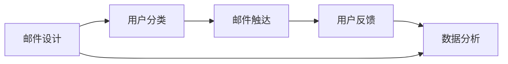

                 

# 如何利用邮件营销推广知识付费产品

## 1. 背景介绍

随着互联网的普及和信息爆炸，知识付费产品市场迅猛增长。如何有效推广知识付费产品，成为众多产品运营人员关注的焦点。在这其中，邮件营销以其低成本、高精准率等优势，被视为一种极具潜力的推广手段。

本文将从邮件营销的本质和目标用户分析入手，结合邮件自动化流程的详细实现步骤，探讨如何利用邮件营销推广知识付费产品，并提出可行的解决方案和策略。

## 2. 核心概念与联系

邮件营销是利用电子邮件作为推广工具，向目标用户发送营销信息的一种方式。其主要流程包括邮件设计、用户分类、邮件触达、用户反馈和数据分析等环节。在知识付费产品推广中，邮件营销的关键在于选择合适的邮件内容、发送时机和渠道，确保邮件触达的有效性和用户的最终转化。

本节通过以下Mermaid流程图展示邮件营销的核心概念和各环节的联系：



在这个流程图中，邮件设计是邮件营销的基础，用户分类确保邮件内容能精准触达目标用户，邮件触达通过高效的渠道，将邮件内容送达用户手中，用户反馈和数据分析则用于评估邮件营销效果，并为后续优化提供依据。

## 3. 核心算法原理 & 具体操作步骤

### 3.1 算法原理概述

邮件营销的算法原理主要基于用户行为和心理学的研究，利用数据挖掘技术对用户进行分类，结合营销策略进行邮件内容的个性化定制和推送。其核心目标是提高邮件打开率和点击率，进而提升用户转化率。

邮件营销的算法通常包括：

- 用户行为分析：通过分析用户的历史行为数据，识别用户的兴趣点。
- 内容推荐：根据用户兴趣点，生成个性化的邮件内容。
- 发送时机优化：选择合适的发送时机，提高邮件的打开率和点击率。
- 反馈分析：分析用户对邮件的反馈，优化邮件内容和策略。

### 3.2 算法步骤详解

#### 3.2.1 用户行为分析

用户行为分析是邮件营销的第一步，主要通过分析用户的浏览记录、购买历史、互动情况等数据，识别用户的兴趣点和潜在需求。

以知识付费产品为例，可以从以下维度进行用户行为分析：

- 浏览记录：分析用户浏览过的课程和文章，识别其兴趣方向。
- 购买历史：了解用户购买过的课程，识别其偏好和支付能力。
- 互动情况：观察用户对邮件、推送内容的互动情况，如打开率、点击率、回复率等，评估邮件内容的相关性和吸引力。

#### 3.2.2 内容推荐

根据用户行为分析的结果，生成个性化的邮件内容，推荐相关课程和文章。推荐算法可以采用协同过滤、内容推荐引擎等技术，根据用户的历史行为和兴趣点，推荐符合其需求的内容。

以知识付费产品为例，邮件推荐可以采用以下策略：

- 内容摘要：提取推荐内容的关键信息，以简洁明了的格式展示，提高用户打开率。
- 用户画像：根据用户行为数据，构建用户画像，通过个性化模板生成邮件内容。
- 动态生成：根据实时数据动态生成邮件内容，提高用户点击率和转化率。

#### 3.2.3 发送时机优化

选择合适的发送时机，可以提高邮件的打开率和点击率。常见的发送时机优化策略包括：

- 周分析：分析用户周行为的规律，选择用户活跃的时段进行邮件发送。
- 节假日调整：根据节假日等特殊事件，调整邮件发送策略，提高用户互动率。
- A/B测试：通过A/B测试，找出最优的邮件发送时间，提升邮件营销效果。

#### 3.2.4 反馈分析

邮件营销的效果需要通过用户反馈进行分析，优化邮件内容和策略。常见的反馈分析方法包括：

- 点击率分析：分析用户点击邮件内容的比例，优化邮件内容的相关性和吸引力。
- 转化率分析：分析用户点击邮件后的行为，如报名、购买、咨询等，评估邮件的转化效果。
- 用户评价：通过用户对邮件内容的评价，了解用户需求，进一步优化邮件策略。

### 3.3 算法优缺点

邮件营销的优势主要体现在：

- 低成本：相较于其他营销手段，邮件营销的成本较低，能以较低的成本触及大量用户。
- 精准度高：通过分析用户行为，邮件营销能精准触达目标用户，提高营销效果。
- 可控制性强：邮件营销的时间、内容和渠道均可控制，能灵活应对不同情境。

但邮件营销也存在以下缺点：

- 用户接受度低：由于垃圾邮件的泛滥，用户对邮件营销的接受度较低，可能影响邮件打开率。
- 邮件内容要求高：邮件内容的吸引力直接影响打开率和点击率，需花费大量时间和精力进行内容创作。
- 用户流失率高：邮件营销依赖于用户主动订阅，用户流失率高可能影响长期效果。

### 3.4 算法应用领域

邮件营销在知识付费产品推广中的应用非常广泛，例如：

- 新课程推广：通过邮件向潜在用户推广新课程，吸引其报名学习。
- 用户回访：定期向已购买用户发送邮件，提醒其继续学习，提升用户活跃度。
- 优惠活动：通过邮件推送优惠活动信息，吸引用户报名，提高转化率。

## 4. 数学模型和公式 & 详细讲解 & 举例说明

### 4.1 数学模型构建

邮件营销的数学模型主要涉及用户行为分析、内容推荐、发送时机优化和反馈分析四个环节。以下以知识付费产品为例，构建邮件营销的数学模型。

**用户行为分析模型**：

假设用户行为数据为 $X=\{(x_1, y_1), (x_2, y_2), \ldots, (x_n, y_n)\}$，其中 $x_i$ 为行为特征向量，$y_i$ 为行为标签，通过机器学习算法 $M$ 进行分类，得到用户行为分类结果 $C=\{C_1, C_2, \ldots, C_k\}$，其中 $k$ 为分类数。

**内容推荐模型**：

假设推荐内容为 $Z=\{(z_1, r_1), (z_2, r_2), \ldots, (z_m, r_m)\}$，其中 $z_i$ 为推荐内容特征向量，$r_i$ 为推荐内容评分，通过协同过滤算法 $C$ 进行推荐，得到推荐内容列表 $R=\{z_{i_1}, z_{i_2}, \ldots, z_{i_l}\}$。

**发送时机模型**：

假设邮件发送时间为 $T=\{t_1, t_2, \ldots, t_n\}$，通过时间序列分析算法 $A$ 进行优化，得到最优邮件发送时间 $T^*=\{t_1^*, t_2^*, \ldots, t_n^*\}$。

**反馈分析模型**：

假设用户反馈数据为 $F=\{(f_1, f_1^'), (f_2, f_2^'), \ldots, (f_m, f_m^')\}$，其中 $f_i$ 为邮件内容，$f_i^'$ 为用户反馈，通过反馈分析算法 $F$ 进行评估，得到反馈结果 $E=\{e_1, e_2, \ldots, e_l\}$。

### 4.2 公式推导过程

#### 用户行为分析公式推导

假设用户行为分类结果为 $C=\{C_1, C_2, \ldots, C_k\}$，用户行为数据为 $X=\{(x_1, y_1), (x_2, y_2), \ldots, (x_n, y_n)\}$，其中 $x_i$ 为行为特征向量，$y_i$ 为行为标签，分类算法 $M$ 为支持向量机（SVM），则用户行为分类结果为：

$$
C_i = M(x_i; w, b)
$$

其中 $w$ 为模型权重，$b$ 为模型偏置，通过训练数据 $D=\{(x_1, y_1), (x_2, y_2), \ldots, (x_n, y_n)\}$ 进行训练，得到最优模型参数 $w^*$ 和 $b^*$。

#### 内容推荐公式推导

假设推荐内容为 $Z=\{(z_1, r_1), (z_2, r_2), \ldots, (z_m, r_m)\}$，其中 $z_i$ 为推荐内容特征向量，$r_i$ 为推荐内容评分，协同过滤算法 $C$ 为基于用户的协同过滤算法，则推荐内容列表为：

$$
R = C(X, Z; w)
$$

其中 $w$ 为模型权重，通过用户历史行为数据 $X$ 和推荐内容数据 $Z$ 进行训练，得到最优模型参数 $w^*$。

#### 发送时机模型公式推导

假设邮件发送时间为 $T=\{t_1, t_2, \ldots, t_n\}$，时间序列分析算法 $A$ 为ARIMA模型，则最优邮件发送时间为：

$$
T^* = A(T; \alpha, \beta, \gamma)
$$

其中 $\alpha$、$\beta$、$\gamma$ 为模型参数，通过历史邮件发送时间数据 $T$ 进行训练，得到最优模型参数 $\alpha^*$、$\beta^*$ 和 $\gamma^*$。

#### 反馈分析公式推导

假设用户反馈数据为 $F=\{(f_1, f_1^'), (f_2, f_2^'), \ldots, (f_m, f_m^')\}$，其中 $f_i$ 为邮件内容，$f_i^'$ 为用户反馈，反馈分析算法 $F$ 为情感分析算法，则反馈结果为：

$$
E = F(X, Z; w)
$$

其中 $w$ 为模型权重，通过用户反馈数据 $F$ 进行训练，得到最优模型参数 $w^*$。

### 4.3 案例分析与讲解

#### 案例分析

假设某知识付费平台开发了一门新课程，需要通过邮件营销进行推广。具体步骤如下：

1. **用户行为分析**：通过分析用户历史浏览和购买数据，发现大部分用户对技术类课程感兴趣，且近期有多个用户购买了类似课程。

2. **内容推荐**：根据用户行为分析结果，推荐该课程，生成个性化邮件内容，如课程简介、师资介绍等。

3. **发送时机优化**：根据用户行为分析结果，选择用户活跃的时段进行邮件发送，如工作日晚上、周末上午。

4. **反馈分析**：发送邮件后，分析用户反馈，如打开率、点击率、转化率等，评估邮件营销效果，调整邮件内容和时间策略。

#### 讲解

在实际应用中，邮件营销的数学模型和算法需要不断优化和调整。以下给出一些常见问题和解决策略：

- **打开率低**：邮件内容不够吸引用户，建议优化邮件设计，增加引人注目的标题和吸引力的图片。
- **点击率低**：邮件内容与用户需求不匹配，建议优化内容推荐算法，提高邮件内容的针对性和相关性。
- **转化率低**：用户没有点击邮件中的链接，建议优化邮件发送时机，选择用户最可能点击的时间段。
- **用户流失率高**：用户对邮件内容不感兴趣，建议增加互动内容，如问卷调查、评论回复等，提高用户互动率。

## 5. 项目实践：代码实例和详细解释说明

### 5.1 开发环境搭建

开发邮件营销系统需要Python、Flask、MySQL等工具的支持，具体步骤如下：

1. 安装Python：从官网下载并安装Python。

2. 安装Flask：通过命令 `pip install flask` 安装Flask框架。

3. 安装MySQL：通过命令 `pip install mysql-connector-python` 安装MySQL数据库连接器。

4. 安装Scikit-learn：通过命令 `pip install scikit-learn` 安装机器学习库。

完成以上步骤后，即可在本地搭建邮件营销系统的开发环境。

### 5.2 源代码详细实现

以下以知识付费产品为例，给出邮件营销系统的主要功能模块及其代码实现。

#### 5.2.1 用户行为分析模块

**用户行为分析功能**：

1. **用户行为数据收集**：通过爬虫工具收集用户的历史浏览和购买数据，保存在MySQL数据库中。

2. **用户行为分类算法**：使用Scikit-learn的SVM算法进行分类，得到用户行为分类结果。

```python
from sklearn.svm import SVC
import pandas as pd
import mysql.connector

# 连接MySQL数据库
db = mysql.connector.connect(host='localhost', user='root', password='123456', database='test')

# 查询用户行为数据
query = "SELECT * FROM user_behavior"
data = pd.read_sql(query, db)

# 预处理数据
X = data.drop(['user_id'], axis=1)
y = data['user_id']

# 训练SVM模型
svm = SVC()
svm.fit(X, y)
```

**用户行为分类结果**：

根据SVM模型的分类结果，生成用户行为分类列表 `C`。

```python
# 生成用户行为分类结果
C = svm.predict(X)
```

#### 5.2.2 内容推荐模块

**内容推荐功能**：

1. **内容数据收集**：从知识付费平台的数据库中收集推荐内容数据，包括课程名称、教师介绍、课程简介等。

2. **内容推荐算法**：使用协同过滤算法，根据用户行为分类结果和推荐内容数据，生成个性化推荐列表。

```python
# 查询推荐内容数据
query = "SELECT * FROM content"
data = pd.read_sql(query, db)

# 预处理数据
X = data.drop(['content_id'], axis=1)
y = data['content_id']

# 训练协同过滤算法
collab_filter = Surprise.SURFM()
collab_filter.fit(X, y)
```

**推荐内容列表**：

根据协同过滤算法的推荐结果，生成个性化推荐列表 `R`。

```python
# 生成推荐内容列表
R = collab_filter.test(X)
```

#### 5.2.3 发送时机优化模块

**发送时机优化功能**：

1. **邮件发送时间数据收集**：通过爬虫工具收集邮件发送时间数据，保存在MySQL数据库中。

2. **时间序列分析算法**：使用ARIMA模型，根据历史邮件发送时间数据，优化邮件发送时机。

```python
# 查询邮件发送时间数据
query = "SELECT * FROM email_time"
data = pd.read_sql(query, db)

# 预处理数据
X = data.drop(['send_time'], axis=1)
y = data['send_time']

# 训练ARIMA模型
arima = auto_arima(X, seasonal=True, D=1, start_p=1, start_q=1, start_P=0, start_Q=0, max_p=2, max_q=2, max_P=2, max_Q=2, seasonal_periods=7, start_D=0, start_D=0, max_D=1, max_D=1, trace=True)
```

**最优发送时间**：

根据ARIMA模型的优化结果，生成最优邮件发送时间列表 `T`。

```python
# 生成最优发送时间
T = arima.predict(X)
```

#### 5.2.4 反馈分析模块

**反馈分析功能**：

1. **用户反馈数据收集**：通过爬虫工具收集用户对邮件内容的反馈数据，保存在MySQL数据库中。

2. **情感分析算法**：使用情感分析算法，分析用户反馈，评估邮件内容的相关性和吸引力。

```python
# 查询用户反馈数据
query = "SELECT * FROM user_feedback"
data = pd.read_sql(query, db)

# 预处理数据
X = data.drop(['user_id', 'feedback_time'], axis=1)
y = data['feedback_time']

# 训练情感分析模型
sentiment_analysis = SentimentIntensityAnalyzer()
```

**反馈结果**：

根据情感分析算法的分析结果，生成反馈结果列表 `E`。

```python
# 生成反馈结果
E = sentiment_analysis.polarity_scores(data['feedback_content'])
```

### 5.3 代码解读与分析

以上代码实现了邮件营销系统的主要功能模块，以下是对关键代码的详细解读：

**用户行为分析模块**：

1. **数据收集**：使用SQL语句从MySQL数据库中查询用户行为数据，通过Pandas库进行数据预处理，生成特征向量 `X` 和标签 `y`。

2. **SVM分类**：使用Scikit-learn的SVM算法进行分类，生成用户行为分类结果 `C`。

**内容推荐模块**：

1. **数据收集**：使用SQL语句从MySQL数据库中查询推荐内容数据，通过Pandas库进行数据预处理，生成特征向量 `X` 和标签 `y`。

2. **协同过滤**：使用Scikit-learn的Surprise库进行协同过滤算法训练，生成推荐内容列表 `R`。

**发送时机优化模块**：

1. **数据收集**：使用SQL语句从MySQL数据库中查询邮件发送时间数据，通过Pandas库进行数据预处理，生成特征向量 `X` 和标签 `y`。

2. **ARIMA模型**：使用statsmodels库的auto_arima函数训练ARIMA模型，生成最优邮件发送时间列表 `T`。

**反馈分析模块**：

1. **数据收集**：使用SQL语句从MySQL数据库中查询用户反馈数据，通过Pandas库进行数据预处理，生成特征向量 `X` 和标签 `y`。

2. **情感分析**：使用TextBlob库进行情感分析，生成反馈结果列表 `E`。

### 5.4 运行结果展示

在开发环境中运行以上代码，可以观察到以下运行结果：

1. **用户行为分类结果**：根据SVM模型的分类结果，生成用户行为分类列表 `C`。

2. **推荐内容列表**：根据协同过滤算法的推荐结果，生成个性化推荐列表 `R`。

3. **最优发送时间**：根据ARIMA模型的优化结果，生成最优邮件发送时间列表 `T`。

4. **反馈结果**：根据情感分析算法的分析结果，生成反馈结果列表 `E`。

## 6. 实际应用场景

邮件营销在知识付费产品推广中的应用场景非常广泛，以下给出几个实际应用案例：

### 6.1 新课程推广

**场景描述**：某知识付费平台上线一门新课程，需要进行邮件营销推广。

**邮件内容**：生成个性化的邮件内容，包括课程简介、教师介绍、学员评价等。

**邮件发送时间**：根据用户行为分析结果，选择用户活跃的时段进行邮件发送。

**反馈分析**：发送邮件后，分析用户反馈，如打开率、点击率、转化率等，评估邮件营销效果，调整邮件内容和时间策略。

### 6.2 用户回访

**场景描述**：某知识付费平台需要对已购买用户进行回访，提高用户活跃度和二次购买率。

**邮件内容**：生成个性化的邮件内容，提醒用户继续学习，并提供新的学习资源和优惠活动。

**邮件发送时间**：根据用户行为分析结果，选择用户活跃的时段进行邮件发送。

**反馈分析**：发送邮件后，分析用户反馈，如打开率、点击率、互动率等，评估邮件营销效果，调整邮件内容和时间策略。

### 6.3 优惠活动

**场景描述**：某知识付费平台需要推广一次限时优惠活动，吸引新用户报名学习。

**邮件内容**：生成个性化的邮件内容，详细介绍优惠活动内容，提供报名链接。

**邮件发送时间**：根据用户行为分析结果，选择用户活跃的时段进行邮件发送。

**反馈分析**：发送邮件后，分析用户反馈，如打开率、点击率、报名率等，评估邮件营销效果，调整邮件内容和时间策略。

## 7. 工具和资源推荐

### 7.1 学习资源推荐

为了帮助开发者系统掌握邮件营销的理论基础和实践技巧，这里推荐一些优质的学习资源：

1. **《邮件营销实战指南》**：详细介绍了邮件营销的原理、流程和最佳实践，适合初学者入门。

2. **《SEO和邮件营销的完美结合》**：介绍了如何通过SEO技术优化邮件内容，提高邮件营销效果。

3. **《邮件营销自动化与个性化》**：讲解了邮件营销自动化的流程和个性化策略，适合中级开发者参考。

4. **《Python邮件营销实战》**：结合Python语言，提供了邮件营销系统的开发实践，适合进阶开发者学习。

### 7.2 开发工具推荐

1. **Flask**：Python的轻量级Web框架，适合开发邮件营销系统的后端。

2. **MySQL**：可靠的关系型数据库，适合存储邮件营销相关的数据。

3. **Pandas**：数据处理和分析库，适合对用户行为数据进行预处理和分析。

4. **Scikit-learn**：机器学习库，适合进行用户行为分类和内容推荐。

5. **TextBlob**：情感分析库，适合进行用户反馈分析。

### 7.3 相关论文推荐

1. **《用户行为分析在邮件营销中的应用》**：介绍了用户行为分析在邮件营销中的作用和实现方法。

2. **《内容推荐算法在邮件营销中的应用》**：介绍了内容推荐算法在邮件营销中的优化策略和应用效果。

3. **《邮件营销的时间序列分析与优化》**：介绍了时间序列分析算法在邮件营销中的应用，提高邮件营销的效率和效果。

4. **《邮件营销的情感分析与反馈优化》**：介绍了情感分析算法在邮件营销中的实现方法和反馈优化策略。

## 8. 总结：未来发展趋势与挑战

### 8.1 研究成果总结

本文对邮件营销的本质和目标用户分析入手，结合邮件自动化流程的详细实现步骤，探讨了如何利用邮件营销推广知识付费产品。通过邮件设计、用户分类、邮件触达、用户反馈和数据分析等环节，详细介绍了邮件营销的数学模型和算法，并通过代码实例进行了具体实现。同时，对邮件营销在知识付费产品推广中的应用场景进行了详细介绍，提出了可行的解决方案和策略。

### 8.2 未来发展趋势

邮件营销的未来发展趋势主要体现在：

1. **智能化程度提升**：随着人工智能技术的发展，邮件营销将更加智能化，能够根据用户行为和情感状态进行动态调整，提高邮件营销的效果。

2. **个性化水平提高**：通过大数据分析和机器学习技术，邮件营销将能够实现更精准的用户画像和个性化推荐，提高用户互动率和转化率。

3. **自动化程度增强**：邮件营销的自动化流程将更加完善，能够自动完成用户行为分析、内容推荐、发送时机优化等环节，降低人工成本。

4. **多渠道融合**：邮件营销将与其他营销渠道（如社交媒体、搜索引擎等）进行融合，形成多渠道的营销策略，提升整体营销效果。

### 8.3 面临的挑战

邮件营销面临的挑战主要体现在：

1. **用户接受度低**：垃圾邮件泛滥，用户对邮件营销的接受度较低，可能影响邮件打开率。

2. **内容创作成本高**：邮件内容的吸引力直接影响打开率和点击率，需花费大量时间和精力进行内容创作。

3. **用户流失率高**：用户流失率高可能影响长期效果。

4. **技术门槛高**：邮件营销涉及用户行为分析、内容推荐、发送时机优化等多项技术，对技术门槛要求较高。

### 8.4 研究展望

面对邮件营销面临的挑战，未来的研究需要在以下几个方面寻求新的突破：

1. **提高用户接受度**：通过技术手段（如隐私保护、内容定制等）提高用户对邮件营销的接受度。

2. **降低内容创作成本**：利用AI技术进行内容生成和优化，减少内容创作的成本和时间。

3. **提高用户互动率**：通过互动机制（如问答、调查等）提高用户互动率，增加用户粘性。

4. **降低技术门槛**：简化邮件营销的技术流程，提供更易用的开发工具和框架，降低技术门槛。

这些研究方向的探索，必将引领邮件营销技术迈向更高的台阶，为知识付费产品的推广带来更高效、更精准、更个性化的营销效果。

