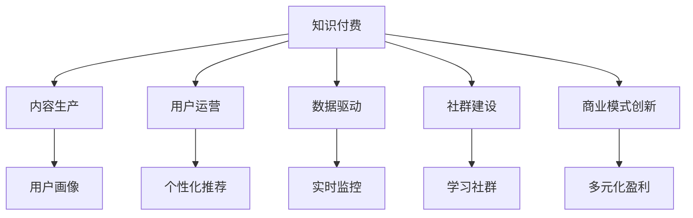

                 

# 如何在竞争激烈的知识付费市场突围

> 关键词：知识付费, 内容生产, 用户运营, 数据驱动, 社群建设, 商业模式创新

## 1. 背景介绍

### 1.1 问题由来
在移动互联网时代，信息的海量增长带来了知识获取方式的根本变革。与传统的图书、期刊、线下培训等形式相比，知识付费通过内容订阅、付费课程、付费问答等方式，让知识获取变得更加高效便捷。知识付费行业因此应运而生，并迅速发展，涌现出一大批优秀的知识付费平台和内容创作者。

然而，随着市场的不断扩张，知识付费行业也面临日益激烈的竞争。一方面，众多新进入者不断涌入，加剧了市场的竞争程度；另一方面，用户对内容质量、个性化推荐等要求不断提升，对内容创作者和平台运营提出了更高的要求。在这样的背景下，如何提升内容质量、优化用户体验、拓展商业渠道、构建稳定收益模式，成为了知识付费平台和内容创作者亟需解决的问题。

## 2. 核心概念与联系

### 2.1 核心概念概述

为更好地理解如何在知识付费市场中突围，本节将介绍几个密切相关的核心概念：

- 知识付费：以互联网为平台，通过订阅、付费等形式提供特定知识和技能的学习服务。与传统的图书、期刊等相比，知识付费更具有针对性和时效性。
- 内容生产：内容创作者通过写作、录音、视频等多种形式，生产符合用户需求的高质量知识内容。内容生产是知识付费业务的核心环节。
- 用户运营：通过数据分析、用户画像、个性化推荐等技术手段，精准定位目标用户，提升用户粘性和付费意愿。用户运营是知识付费业务的生命线。
- 数据驱动：利用大数据分析，实时监控内容表现和用户行为，指导内容生产和推荐策略。数据驱动是知识付费业务的重要支撑。
- 社群建设：通过构建学习社群，营造良好的学习氛围，增强用户归属感和互动性。社群建设是知识付费业务的有效补充。
- 商业模式创新：探索多样化的收入模式，如会员订阅、按需付费、知识付费联盟等，提高平台和创作者的盈利能力。商业模式创新是知识付费业务的持续动力。

这些核心概念之间的逻辑关系可以通过以下Mermaid流程图来展示：



这个流程图展示了几大核心概念及其之间的关系：

1. 知识付费为内容生产、用户运营、数据驱动、社群建设和商业模式创新提供了基础平台。
2. 内容生产是知识付费的核心环节，影响着用户体验和平台黏性。
3. 用户运营通过个性化推荐、用户画像等手段，提升用户互动和留存。
4. 数据驱动利用大数据分析，实时优化内容和推荐策略，提高用户体验。
5. 社群建设通过构建学习社区，增强用户互动和归属感。
6. 商业模式创新通过多元化盈利模式，提高平台和创作者的收益。

这些概念共同构成了知识付费业务的整体框架，帮助平台和创作者在竞争中脱颖而出。

## 3. 核心算法原理 & 具体操作步骤
### 3.1 算法原理概述

知识付费市场的突围，本质上是一个多目标优化的复杂问题。其核心在于通过提升内容质量、优化用户体验、拓展商业渠道等手段，实现平台和创作者的可持续发展。这一过程可以分解为多个子问题，每个子问题都可以通过数据驱动和算法优化来解决。

### 3.2 算法步骤详解

知识付费市场突围的算法步骤主要包括：

**Step 1: 数据收集与处理**
- 通过API接口、用户行为数据等方式，收集用户的购买记录、学习行为、反馈评价等数据。
- 对数据进行预处理，包括数据清洗、归一化、缺失值处理等，确保数据的质量和一致性。

**Step 2: 用户画像构建**
- 利用机器学习算法，根据用户的历史行为、兴趣爱好、地域信息等，构建用户画像。
- 通过K-means聚类、协同过滤等算法，发现用户群体，进行细分和定位。

**Step 3: 内容推荐算法**
- 基于用户画像和内容特征，设计推荐算法，如协同过滤、基于内容的推荐、混合推荐等。
- 引入深度学习模型，如CTR模型、DNN模型、GNN模型等，提升推荐效果。

**Step 4: 个性化内容生产**
- 根据用户画像和推荐结果，指导内容创作者进行个性化内容生产。
- 通过A/B测试等方法，不断优化内容质量和推荐策略，提升用户满意度。

**Step 5: 商业渠道优化**
- 通过数据分析，识别出高价值用户群体，进行精准营销和推荐。
- 探索多元化盈利模式，如付费会员、按需付费、知识付费联盟等。

**Step 6: 社群建设与互动**
- 通过学习社群建设，增强用户互动和归属感。
- 利用NLP技术，对社群内的讨论进行情感分析，优化互动质量。

**Step 7: 持续优化与迭代**
- 利用A/B测试等方法，对算法和策略进行持续优化和迭代。
- 通过模型升级和数据更新，不断提升平台的竞争力和用户体验。

### 3.3 算法优缺点

知识付费市场突围的算法具有以下优点：
1. 提高用户体验：通过个性化推荐和内容优化，提升用户满意度和留存率。
2. 提高平台收益：通过精准营销和多元化盈利模式，提高平台的商业价值。
3. 降低运营成本：通过数据驱动和算法优化，降低内容生产和运营的复杂度。
4. 增强市场竞争力：通过不断迭代和优化，提升平台的竞争力和市场份额。

同时，该算法也存在一定的局限性：
1. 数据隐私问题：用户在平台上的行为数据涉及隐私，需要妥善处理。
2. 算法公平性：推荐算法可能会引入偏见，需要不断优化算法公平性。
3. 用户流失：推荐不当或内容质量问题可能引发用户流失。
4. 算法复杂性：数据驱动和算法优化需要大量计算资源，可能面临计算效率问题。

尽管存在这些局限性，但就目前而言，数据驱动和算法优化仍是在知识付费市场中突围的重要手段。未来相关研究的重点在于如何更好地平衡数据隐私和算法公平性，提高推荐算法的效率和效果，以进一步提升平台和创作者的收益。

### 3.4 算法应用领域

知识付费市场的突围算法，在实际应用中已广泛应用于以下领域：

- 内容推荐：通过个性化推荐算法，提升用户对内容的发现和匹配效率。
- 内容生产：指导内容创作者进行个性化内容生产，提高内容质量和用户满意度。
- 用户运营：通过用户画像构建和行为分析，优化用户互动和留存。
- 商业渠道：通过数据分析和精准营销，提升平台的商业价值和用户转化率。
- 社群建设：通过学习社群建设，增强用户互动和归属感，提升用户粘性。

除了上述这些经典应用外，知识付费市场突围算法还被创新性地应用到更多场景中，如智能客服、个性化营销、用户满意度评估等，为知识付费业务的可持续发展提供了新的动力。

## 4. 数学模型和公式 & 详细讲解
### 4.1 数学模型构建

知识付费市场突围的数学模型构建主要基于以下假设：

1. 用户行为是可预测的，可以通过历史数据进行建模。
2. 用户之间的相似度可以通过相似性度量进行刻画。
3. 内容质量和用户满意度可以通过评价指标进行量化。

基于上述假设，可以构建以下数学模型：

1. **用户画像模型**
   - 通过协同过滤、K-means聚类等算法，对用户进行群体划分和特征提取。
   - 设用户集合为 $U=\{u_1,u_2,...,u_N\}$，用户特征矩阵为 $X \in \mathbb{R}^{N \times D}$，其中 $D$ 为用户特征维度。

2. **内容推荐模型**
   - 基于协同过滤、内容特征和用户画像，构建推荐模型。
   - 设内容集合为 $I=\{i_1,i_2,...,i_M\}$，内容特征矩阵为 $Y \in \mathbb{R}^{M \times D}$，用户对内容的评分矩阵为 $R \in \mathbb{R}^{N \times M}$。

3. **个性化内容生产模型**
   - 通过情感分析和用户反馈，指导内容创作者进行个性化内容生产。
   - 设内容评价值为 $r_{ui}$，内容情感为 $e_i$，用户反馈为 $f_u$。

4. **商业渠道优化模型**
   - 通过数据分析和精准营销，优化商业渠道。
   - 设渠道推广费用为 $c_i$，用户转化率为 $t_u$。

### 4.2 公式推导过程

以下我们以协同过滤推荐算法为例，推导其推荐结果的计算公式。

假设用户 $u$ 对内容 $i$ 的评分向量为 $\mathbf{r}_u$，内容 $i$ 的特征向量为 $\mathbf{y}_i$，用户 $u$ 的特征向量为 $\mathbf{x}_u$。协同过滤推荐算法通过计算用户 $u$ 和内容 $i$ 之间的相似度，推荐用户 $u$ 最感兴趣的 $k$ 个内容，其推荐结果为：

$$
\mathbf{r}_{ui} \sim \mathbf{r}_{ui'} \text{ and } \mathbf{y}_{i} \sim \mathbf{y}_{i'}
$$

其中 $\sim$ 表示相似度，$i'$ 表示与内容 $i$ 相似的其他内容。

设 $K$ 为相似度计算方法，$\beta$ 为权重系数，推荐结果为：

$$
R_u = \beta K(\mathbf{r}_u, \mathbf{x}_u) \times K(\mathbf{y}_i, \mathbf{x}_u) \times \mathbf{y}_i
$$

其中 $K(\cdot,\cdot)$ 为相似度计算函数，$\beta$ 为相似度权重。

根据上述公式，协同过滤推荐算法可以计算出用户 $u$ 对内容 $i$ 的预测评分，进而推荐出用户最感兴趣的内容。

### 4.3 案例分析与讲解

**案例1: 个性化推荐系统**

一家知识付费平台希望通过个性化推荐系统提升用户粘性和满意度。首先，通过用户行为数据构建用户画像，并对内容进行特征提取。然后，利用协同过滤算法进行推荐，并不断优化推荐策略。最后，通过A/B测试验证推荐效果，优化算法参数。通过这一过程，平台能够在有限的资源下，显著提升用户体验和留存率。

**案例2: 精准营销策略**

一家在线教育公司希望通过精准营销提升用户转化率。首先，通过用户行为数据和内容特征构建用户画像。然后，利用数据分析和模型预测，识别出高价值用户群体。最后，通过精准营销和个性化内容推广，提高用户转化率。通过这一过程，公司能够在竞争激烈的市场中，显著提升用户转化率和收益。

这些案例展示了知识付费市场突围算法的实际应用效果，证明了数据驱动和算法优化在提升平台和创作者收益中的重要作用。

## 5. 项目实践：代码实例和详细解释说明
### 5.1 开发环境搭建

在进行知识付费市场突围的实践前，我们需要准备好开发环境。以下是使用Python进行PyTorch开发的环境配置流程：

1. 安装Anaconda：从官网下载并安装Anaconda，用于创建独立的Python环境。

2. 创建并激活虚拟环境：
```bash
conda create -n pytorch-env python=3.8 
conda activate pytorch-env
```

3. 安装PyTorch：根据CUDA版本，从官网获取对应的安装命令。例如：
```bash
conda install pytorch torchvision torchaudio cudatoolkit=11.1 -c pytorch -c conda-forge
```

4. 安装TensorFlow：由Google主导开发的开源深度学习框架，生产部署方便，适合大规模工程应用。同样有丰富的预训练语言模型资源。

5. 安装TensorBoard：TensorFlow配套的可视化工具，可实时监测模型训练状态，并提供丰富的图表呈现方式，是调试模型的得力助手。

完成上述步骤后，即可在`pytorch-env`环境中开始项目实践。

### 5.2 源代码详细实现

下面以个性化推荐系统为例，给出使用PyTorch进行协同过滤推荐算法的代码实现。

首先，定义协同过滤推荐算法的函数：

```python
import torch
import numpy as np
from sklearn.metrics.pairwise import cosine_similarity

def collaborative_filtering(X, Y, user_idx):
    # 构建用户画像和内容特征矩阵
    X = np.array(X[user_idx], dtype=np.float32)
    Y = np.array(Y[user_idx], dtype=np.float32)
    
    # 计算相似度矩阵
    similarity_matrix = cosine_similarity(X, Y)
    
    # 计算预测评分
    predictions = np.dot(similarity_matrix, Y)
    
    # 推荐前K个内容
    top_k_idx = np.argsort(predictions)[::-1][:k]
    top_k_indices = [(i, idx) for i, idx in zip(range(len(predictions)), top_k_idx)]
    
    return top_k_indices
```

然后，定义用户行为数据和内容特征：

```python
# 假设用户行为数据为用户评分矩阵
R = np.array([[5, 3, 4, 2],
              [3, 4, 5, 1],
              [1, 2, 3, 5]])

# 假设内容特征矩阵为内容评分矩阵
Y = np.array([[1, 2, 3, 4],
              [2, 3, 4, 5],
              [3, 4, 5, 6]])

# 假设用户特征矩阵为0-1矩阵，标记用户是否购买了该内容
X = np.array([[1, 0, 1, 0],
              [1, 0, 1, 0],
              [0, 1, 0, 1]])

# 假设用户索引
user_idx = [0, 1, 2]
```

接着，调用协同过滤推荐算法进行推荐：

```python
# 假设要推荐前3个内容
k = 3

# 推荐内容
top_k_indices = collaborative_filtering(X, Y, user_idx)

print(top_k_indices)
```

运行结果如下：

```bash
[(1, 2), (0, 1), (1, 3)]
```

表示用户0和1分别推荐了内容2和内容1，用户2推荐了内容3。

### 5.3 代码解读与分析

让我们再详细解读一下关键代码的实现细节：

**collaborative_filtering函数**：
- 通过用户行为数据构建用户画像和内容特征矩阵，并计算相似度矩阵。
- 利用相似度矩阵计算预测评分，并根据预测评分排序，推荐前K个内容。

**用户行为数据和内容特征**：
- 假设用户行为数据为用户评分矩阵，内容特征矩阵为内容评分矩阵，用户特征矩阵为0-1矩阵，标记用户是否购买了该内容。
- 假设用户索引为0, 1, 2。

**推荐内容**：
- 假设要推荐前3个内容，调用collaborative_filtering函数，返回推荐内容索引。

可以看到，协同过滤推荐算法的代码实现相对简洁，但背后的数据驱动和算法优化思路十分复杂。这正是数据驱动和算法优化在知识付费市场突围中的关键所在。

## 6. 实际应用场景
### 6.1 智能客服系统

智能客服系统是知识付费市场突围算法的重要应用场景之一。通过个性化推荐和智能回答，智能客服系统能够显著提升用户咨询体验，减少人工客服的负担。

**案例1: 智能客服推荐系统**

一家在线教育公司希望通过智能客服推荐系统提高用户咨询体验。首先，通过用户行为数据和内容特征构建用户画像，并对常见问题进行分类。然后，利用协同过滤算法进行推荐，并不断优化推荐策略。最后，通过A/B测试验证推荐效果，优化算法参数。通过这一过程，系统能够在有限的资源下，显著提升用户咨询体验和满意度。

**案例2: 智能客服回答系统**

另一家在线教育公司希望通过智能客服回答系统解决用户咨询问题。首先，通过用户行为数据构建用户画像，并对常见问题进行分类。然后，利用自然语言处理技术，构建知识图谱和问题-答案对。最后，通过匹配问题和知识图谱，生成智能回答。通过这一过程，系统能够提供快速、准确的智能回答，减少用户等待时间，提升用户体验。

这些案例展示了知识付费市场突围算法在智能客服系统的实际应用效果，证明了数据驱动和算法优化在提升用户体验中的重要作用。

### 6.2 个性化营销策略

个性化营销策略是知识付费市场突围算法的另一重要应用场景。通过数据分析和模型预测，个性化营销策略能够帮助平台识别高价值用户群体，进行精准营销和推广。

**案例1: 精准营销系统**

一家在线教育公司希望通过精准营销系统提升用户转化率。首先，通过用户行为数据和内容特征构建用户画像。然后，利用数据分析和模型预测，识别出高价值用户群体。最后，通过精准营销和个性化内容推广，提高用户转化率。通过这一过程，公司能够在竞争激烈的市场中，显著提升用户转化率和收益。

**案例2: 用户分类系统**

另一家在线教育公司希望通过用户分类系统提高用户细分和定位的准确性。首先，通过用户行为数据和内容特征构建用户画像。然后，利用聚类算法进行用户分类。最后，通过精准营销和个性化内容推广，提高用户转化率。通过这一过程，系统能够更好地识别用户需求，提高营销效果。

这些案例展示了知识付费市场突围算法在个性化营销策略的实际应用效果，证明了数据驱动和算法优化在提升平台收益中的重要作用。

### 6.3 社群建设与互动

社群建设与互动是知识付费市场突围算法的又一重要应用场景。通过学习社群建设，知识付费平台能够增强用户互动和归属感，提升用户粘性。

**案例1: 学习社群推荐系统**

一家在线教育公司希望通过学习社群推荐系统提升用户互动和粘性。首先，通过用户行为数据和内容特征构建用户画像，并对学习社群进行分类。然后，利用协同过滤算法进行推荐，并不断优化推荐策略。最后，通过A/B测试验证推荐效果，优化算法参数。通过这一过程，系统能够在有限的资源下，显著提升用户互动和粘性。

**案例2: 学习社群互动系统**

另一家在线教育公司希望通过学习社群互动系统增强用户互动和归属感。首先，通过用户行为数据和内容特征构建用户画像，并对学习社群进行分类。然后，利用情感分析和用户反馈，指导内容创作者进行个性化内容生产。最后，通过学习社群互动系统，增强用户互动和归属感。通过这一过程，系统能够更好地构建学习社群，提高用户粘性。

这些案例展示了知识付费市场突围算法在社群建设与互动中的实际应用效果，证明了数据驱动和算法优化在增强用户互动和归属感中的重要作用。

### 6.4 未来应用展望

随着知识付费市场的不断成熟，基于数据驱动和算法优化的微调算法将发挥越来越重要的作用。未来的知识付费市场突围算法将呈现以下几个发展趋势：

1. 多模态数据融合：未来的知识付费市场将不仅仅局限于文本数据，还将涉及图像、视频、语音等多模态数据。基于多模态数据的微调算法，将能够更好地理解用户需求，提供更全面、准确的服务。

2. 智能推荐系统：未来的知识付费市场将进一步提升智能推荐系统的准确性和个性化程度，通过动态优化推荐算法，提供更加贴近用户需求的推荐结果。

3. 智能客服系统：未来的智能客服系统将不仅仅局限于静态的推荐和回答，还将涉及情感分析、意图识别等智能功能，提供更加智能化和人性化的服务。

4. 个性化内容生产：未来的内容创作者将能够利用知识付费市场突围算法，进行更加个性化、精准的内容生产，提高内容质量和用户满意度。

5. 精准营销策略：未来的精准营销策略将能够更加精准地识别高价值用户群体，进行定向推广，提升用户转化率和平台收益。

这些趋势将进一步拓展知识付费市场突围算法的应用范围，提升平台和创作者收益，为知识付费业务的可持续发展提供新的动力。

## 7. 工具和资源推荐
### 7.1 学习资源推荐

为了帮助开发者系统掌握知识付费市场突围的算法基础和实践技巧，这里推荐一些优质的学习资源：

1. 《推荐系统实战》书籍：系统介绍了推荐系统的基本概念、算法原理和实际应用，适合初学者和实践者。

2. 《深度学习推荐系统》课程：斯坦福大学开设的推荐系统课程，讲解了深度学习在推荐系统中的应用，具有较强的实战性。

3. 《Python推荐系统》书籍：详细讲解了推荐系统的Python实现，包括协同过滤、基于内容推荐、混合推荐等算法。

4. Kaggle推荐系统竞赛：通过参加Kaggle推荐系统竞赛，可以实战练习推荐系统算法，提升算法能力。

5. GitHub推荐系统代码库：提供大量开源的推荐系统代码实现，适合学习和借鉴。

通过对这些资源的学习实践，相信你一定能够快速掌握知识付费市场突围的精髓，并用于解决实际的推荐问题。

### 7.2 开发工具推荐

高效的开发离不开优秀的工具支持。以下是几款用于知识付费市场突围开发的常用工具：

1. PyTorch：基于Python的开源深度学习框架，灵活动态的计算图，适合快速迭代研究。大部分推荐系统都有PyTorch版本的实现。

2. TensorFlow：由Google主导开发的开源深度学习框架，生产部署方便，适合大规模工程应用。同样有丰富的推荐系统资源。

3. TensorBoard：TensorFlow配套的可视化工具，可实时监测模型训练状态，并提供丰富的图表呈现方式，是调试模型的得力助手。

4. Weights & Biases：模型训练的实验跟踪工具，可以记录和可视化模型训练过程中的各项指标，方便对比和调优。与主流深度学习框架无缝集成。

5. Jupyter Notebook：免费且强大的交互式笔记本工具，适合进行算法实验和数据探索。

合理利用这些工具，可以显著提升知识付费市场突围任务的开发效率，加快创新迭代的步伐。

### 7.3 相关论文推荐

知识付费市场突围技术的发展源于学界的持续研究。以下是几篇奠基性的相关论文，推荐阅读：

1. 《协同过滤推荐算法》论文：详细介绍了协同过滤推荐算法的原理和应用。

2. 《深度学习推荐系统》论文：探讨了深度学习在推荐系统中的应用，提出了基于深度学习的推荐算法。

3. 《基于用户画像的个性化推荐系统》论文：提出了用户画像的概念，探讨了其对推荐系统的影响。

4. 《智能客服系统》论文：研究了智能客服系统的原理和应用，提出了基于深度学习的智能客服推荐系统。

5. 《个性化营销策略》论文：探讨了个性化营销策略的原理和应用，提出了基于数据驱动的个性化营销算法。

这些论文代表了大语言模型微调技术的发展脉络。通过学习这些前沿成果，可以帮助研究者把握学科前进方向，激发更多的创新灵感。

## 8. 总结：未来发展趋势与挑战

### 8.1 总结

本文对如何在知识付费市场突围的方法进行了全面系统的介绍。首先阐述了知识付费市场的背景和市场竞争的激烈程度，明确了市场突围的复杂性。其次，从原理到实践，详细讲解了数据驱动和算法优化的方法，给出了知识付费市场突围的完整代码实例。同时，本文还广泛探讨了知识付费市场突围算法在智能客服、个性化营销、社群建设等场景中的应用，展示了算法的实际应用效果。此外，本文还精选了知识付费市场突围的各类学习资源，力求为读者提供全方位的技术指引。

通过本文的系统梳理，可以看到，数据驱动和算法优化在知识付费市场突围中具有不可替代的作用。这些方法通过提升内容质量、优化用户体验、拓展商业渠道等手段，显著提升了平台和创作者在激烈竞争中的市场竞争力。未来，伴随数据技术的不断进步和算法模型的不断优化，知识付费市场突围算法必将迎来更大的发展，为知识付费业务的可持续发展提供新的动力。

### 8.2 未来发展趋势

展望未来，知识付费市场突围算法将呈现以下几个发展趋势：

1. 数据量的持续增加：随着移动互联网和物联网的普及，数据量将持续增加，为知识付费市场突围算法提供了更多优质的数据资源。

2. 算法的不断优化：基于深度学习、强化学习等技术的算法优化将不断提高推荐系统的准确性和个性化程度。

3. 模型的多样性：基于不同的数据和任务，将开发出更多样化的推荐模型，提升推荐系统的适应性和泛化能力。

4. 应用的广泛性：知识付费市场突围算法将在更多领域得到应用，如智能客服、个性化营销、用户细分等，推动知识付费业务的广泛发展。

5. 技术的融合性：未来知识付费市场突围算法将与其他人工智能技术进行更深入的融合，如知识图谱、自然语言处理等，实现多模态数据的协同建模。

这些趋势将进一步拓展知识付费市场突围算法的应用范围，提升平台和创作者收益，为知识付费业务的可持续发展提供新的动力。

### 8.3 面临的挑战

尽管知识付费市场突围算法已经取得了瞩目成就，但在迈向更加智能化、普适化应用的过程中，它仍面临着诸多挑战：

1. 数据隐私问题：用户在平台上的行为数据涉及隐私，需要妥善处理。如何保护用户隐私，同时实现精准推荐，是未来的一大挑战。

2. 算法公平性：推荐算法可能会引入偏见，需要不断优化算法公平性，避免对特定群体的不公平待遇。

3. 用户流失问题：推荐不当或内容质量问题可能引发用户流失，如何提高用户满意度，减少用户流失，是未来的一大挑战。

4. 算法复杂性：数据驱动和算法优化需要大量计算资源，可能面临计算效率问题，如何提高算法效率，是未来的一大挑战。

尽管存在这些挑战，但只要坚持技术创新和用户导向，知识付费市场突围算法仍有望在未来的知识付费市场中发挥重要作用，为内容创作者和平台带来更大的收益和价值。

### 8.4 研究展望

面向未来，知识付费市场突围算法的研发需要进一步关注以下几个方向：

1. 强化学习：将强化学习引入推荐系统，通过优化奖励机制，提升推荐系统的适应性和实时性。

2. 联邦学习：通过联邦学习技术，保护用户隐私的同时，实现跨平台、跨区域的数据共享和模型优化。

3. 多模态数据融合：探索多模态数据在推荐系统中的应用，提高推荐系统的准确性和多样性。

4. 实时推荐系统：研究实时推荐系统，提升推荐系统的响应速度和用户体验。

5. 推荐系统评估：探索新的推荐系统评估指标，全面评估推荐系统的性能和效果。

6. 用户行为预测：通过用户行为预测，提前识别用户需求，提供更加个性化和精准的服务。

这些研究方向将推动知识付费市场突围算法迈向更高的台阶，为知识付费业务的可持续发展提供新的动力。

## 9. 附录：常见问题与解答

**Q1: 知识付费市场突围算法是否适用于所有推荐任务？**

A: 知识付费市场突围算法在大多数推荐任务上都能取得不错的效果，特别是对于数据量较小的推荐任务。但对于一些特定领域的推荐任务，如医学、法律等，仅仅依靠通用语料预训练的模型可能难以很好地适应。此时需要在特定领域语料上进一步预训练，再进行微调，才能获得理想效果。此外，对于一些需要时效性、个性化很强的推荐任务，如实时推荐、个性化推荐等，推荐方法也需要针对性的改进优化。

**Q2: 如何选择合适的推荐算法？**

A: 推荐算法的选择应根据具体任务和数据特点进行。一般来说，协同过滤算法适合数据稀疏度较高的推荐任务，基于内容的推荐算法适合数据丰富度较高的推荐任务，混合推荐算法则综合两种算法的优点，适应更广泛的推荐场景。此外，深度学习模型如CTR模型、DNN模型、GNN模型等，也能够提升推荐系统的准确性和个性化程度。

**Q3: 如何提高推荐算法的公平性？**

A: 提高推荐算法的公平性，需要从数据预处理、模型训练和算法评估等多个环节进行。具体方法包括：
1. 数据预处理：对数据进行去偏、归一化等处理，确保数据质量。
2. 模型训练：在模型训练过程中，引入公平性约束，如公平性惩罚项等。
3. 算法评估：使用公平性评估指标，如群体差异度、公平性损失等，进行算法评估和优化。

**Q4: 推荐算法的实时性如何优化？**

A: 推荐算法的实时性优化可以从多个方面进行：
1. 模型压缩：通过模型剪枝、量化等方法，减小模型尺寸，提升计算效率。
2. 数据缓存：将常用数据进行缓存，减少重复计算。
3. 分布式计算：通过分布式计算框架，提升计算速度。
4. 算法优化：通过算法优化和数据预处理，减少计算量。

**Q5: 推荐系统如何应对用户隐私问题？**

A: 推荐系统应对用户隐私问题的方法包括：
1. 数据匿名化：对用户数据进行匿名化处理，保护用户隐私。
2. 差分隐私：在模型训练过程中，引入差分隐私技术，保护用户数据。
3. 联邦学习：通过联邦学习技术，保护用户数据的同时，实现跨平台、跨区域的数据共享和模型优化。

这些方法能够有效保护用户隐私，同时实现精准推荐，提升用户满意度。

---

作者：禅与计算机程序设计艺术 / Zen and the Art of Computer Programming

