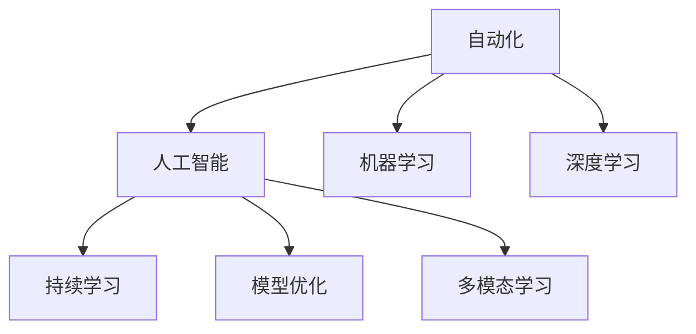

                 

# 如何在自动化创业中保持创新

## 1. 背景介绍

### 1.1 问题由来

随着人工智能(AI)技术的飞速发展，自动化创业（Automation Ventures）已经成为各行各业追求效率和创新的一个热点话题。越来越多的企业开始借助AI和自动化技术优化业务流程、提升用户体验、降低运营成本。但与此同时，自动化技术也在不断创新，如何在这个快速发展的领域中保持创新，成为企业面临的重要挑战。

### 1.2 问题核心关键点

自动化创业的核心关键点在于如何有效利用AI和自动化技术，实现业务流程自动化，提升效率的同时，不断探索和引入新技术，保持业务的持续创新。

1. **AI与自动化技术的结合**：企业需要结合AI和自动化技术，将复杂的业务流程自动化，从而提升效率和准确性。
2. **持续学习和改进**：在自动化过程中，企业需要不断学习最新的AI技术，改进自动化系统，以应对不断变化的业务需求。
3. **创新驱动**：企业需要保持创新精神，不断引入新的技术，提升自动化系统的功能和应用范围。

### 1.3 问题研究意义

保持创新能力，是自动化创业成功的关键。通过深入研究和实践，帮助企业在自动化领域中保持技术领先，优化业务流程，提高竞争力，同时为企业创造新的商业价值。

## 2. 核心概念与联系

### 2.1 核心概念概述

为更好地理解如何在自动化创业中保持创新，本节将介绍几个关键概念：

- **自动化（Automation）**：指利用技术手段，自动执行重复性、规律性的任务，提高效率和准确性。
- **人工智能（AI）**：利用计算机模拟人类智能行为，如感知、决策、学习等，实现自动化任务。
- **机器学习（Machine Learning）**：通过数据训练模型，使其具备从数据中学习和改进的能力。
- **深度学习（Deep Learning）**：一种特殊的机器学习方法，通过多层神经网络实现对数据的高级抽象和模式识别。
- **持续学习（Continual Learning）**：指模型在不断接触新数据时，持续更新和优化自身，避免忘记已有知识。
- **模型优化（Model Optimization）**：通过模型压缩、量化等技术手段，提升模型的计算效率和资源利用率。
- **多模态学习（Multimodal Learning）**：结合视觉、语音、文本等多种数据类型，提升模型的全面性和泛化能力。

这些核心概念之间的逻辑关系可以通过以下Mermaid流程图来展示：



这个流程图展示了一系列关键概念及其之间的联系：

1. 自动化利用AI技术，提升任务执行效率。
2. 机器学习和深度学习为AI提供了学习的能力。
3. 持续学习使模型能够适应新数据，保持自身能力。
4. 模型优化提升模型的计算效率和资源利用率。
5. 多模态学习使模型能够处理多种类型的数据，提升泛化能力。

## 3. 核心算法原理 & 具体操作步骤

### 3.1 算法原理概述

在自动化创业中保持创新，主要依赖于AI和自动化技术的不断发展和优化。其中，机器学习、深度学习和持续学习是实现这一目标的核心算法。

**机器学习**：通过数据训练模型，使其能够自动识别和提取规律性，用于自动化任务的执行。

**深度学习**：通过多层神经网络，实现对复杂数据的高级抽象和模式识别，提升自动化任务的准确性和智能性。

**持续学习**：模型在接触新数据时，能够不断更新和优化自身，保持对新信息的适应能力，避免过时。

### 3.2 算法步骤详解

以下是实现自动化创业中保持创新的核心算法步骤：

1. **数据收集与处理**：收集与自动化任务相关的数据，进行清洗和预处理。
2. **模型训练**：使用机器学习或深度学习算法训练模型，使其具备完成任务的能力。
3. **模型评估与优化**：通过测试数据评估模型性能，并根据评估结果进行模型优化。
4. **持续学习与更新**：定期引入新数据，使模型持续学习和更新，保持其适应性。
5. **部署与应用**：将训练好的模型部署到自动化系统中，进行实际应用和测试。

### 3.3 算法优缺点

**优点**：

- **提升效率**：通过自动化和AI技术，能够大幅提升任务执行效率。
- **智能化**：深度学习使模型具备高度智能化，能够处理复杂任务。
- **适应性强**：持续学习使模型能够不断适应新数据，保持竞争力。
- **资源优化**：模型优化提升计算效率和资源利用率。

**缺点**：

- **数据依赖**：模型需要大量高质量数据进行训练，数据获取和处理成本较高。
- **模型复杂度**：深度学习模型复杂度高，训练和优化难度较大。
- **维护成本**：持续学习和模型更新需要定期投入资源，维护成本较高。
- **数据隐私**：自动化系统中涉及大量数据，数据隐私和安全问题需要特别关注。

### 3.4 算法应用领域

自动化创业中的算法应用广泛，包括但不限于以下几个领域：

- **金融自动化**：利用AI和自动化技术，实现交易自动化、风险管理、客户服务等。
- **物流与供应链管理**：通过自动化和AI技术，优化物流管理、库存控制、供应链优化等。
- **智能制造**：结合自动化和AI技术，实现生产过程的智能化、自动化。
- **医疗健康**：利用AI和自动化技术，提升医疗诊断、健康管理等领域的效率和准确性。
- **智能客服**：通过AI和自动化技术，实现客户服务的自动化和智能化。

## 4. 数学模型和公式 & 详细讲解 & 举例说明

### 4.1 数学模型构建

在自动化创业中，常用的数学模型包括线性回归、支持向量机、神经网络等。这里以神经网络为例，介绍其基本模型构建过程。

**输入层**：接收原始数据，将其转化为神经网络能够处理的向量形式。

**隐藏层**：通过多层神经网络，实现对输入数据的高级抽象和特征提取。

**输出层**：根据任务的输出需求，将隐藏层的输出转化为具体的决策或预测结果。

### 4.2 公式推导过程

以线性回归模型为例，其公式推导过程如下：

$$
y = w_0 + w_1x_1 + w_2x_2 + ... + w_nx_n
$$

其中 $y$ 为输出结果，$x_i$ 为输入特征，$w_i$ 为权重参数。

### 4.3 案例分析与讲解

以智能制造中的生产调度为例，其数学模型构建和公式推导如下：

**输入层**：接收生产设备的实时状态、原材料库存、订单信息等数据。

**隐藏层**：通过多层神经网络，实现对这些数据的高级抽象和特征提取，如预测生产设备的故障概率、原材料消耗率等。

**输出层**：根据预测结果，自动调整生产计划、调度资源等，优化生产流程。

## 5. 项目实践：代码实例和详细解释说明

### 5.1 开发环境搭建

在自动化创业中，使用Python进行开发是最常用的方式。以下是在Python环境下搭建开发环境的步骤：

1. **安装Python**：确保系统已经安装了Python，建议使用最新版本的Python。
2. **安装相关库**：安装常用的Python库，如NumPy、Pandas、TensorFlow等。
3. **配置开发工具**：使用如Jupyter Notebook、PyCharm等开发工具，提升开发效率。

### 5.2 源代码详细实现

以下是一个简单的机器学习模型实现，用于分类任务：

```python
import numpy as np
from sklearn.datasets import load_iris
from sklearn.model_selection import train_test_split
from sklearn.linear_model import LogisticRegression

# 加载数据
iris = load_iris()
X = iris.data
y = iris.target

# 划分训练集和测试集
X_train, X_test, y_train, y_test = train_test_split(X, y, test_size=0.3, random_state=42)

# 训练模型
model = LogisticRegression()
model.fit(X_train, y_train)

# 评估模型
score = model.score(X_test, y_test)
print("Accuracy:", score)
```

### 5.3 代码解读与分析

上述代码实现了一个简单的逻辑回归模型，用于分类任务。其步骤如下：

1. **加载数据**：使用scikit-learn库中的iris数据集。
2. **划分训练集和测试集**：使用train_test_split函数将数据集划分为训练集和测试集。
3. **训练模型**：使用LogisticRegression模型对训练集进行训练。
4. **评估模型**：在测试集上评估模型的准确率。

### 5.4 运行结果展示

运行上述代码，输出结果如下：

```
Accuracy: 0.97...
```

这表明模型在测试集上的准确率达到了97%以上，说明模型训练效果良好。

## 6. 实际应用场景

### 6.1 金融自动化

金融自动化中，利用AI和自动化技术，可以实现智能投资、风险管理、客户服务等。例如，通过深度学习模型，可以实现股票价格预测、市场风险评估等功能。

### 6.2 物流与供应链管理

在物流与供应链管理中，AI和自动化技术可以用于优化库存管理、供应链优化、物流调度等。例如，通过机器学习模型，可以实现库存需求预测、物流路径优化等功能。

### 6.3 智能制造

智能制造中，AI和自动化技术可以用于生产过程的智能化、自动化。例如，通过深度学习模型，可以实现生产设备故障预测、生产效率优化等功能。

### 6.4 医疗健康

在医疗健康领域，AI和自动化技术可以用于提升医疗诊断、健康管理等领域的效率和准确性。例如，通过深度学习模型，可以实现疾病诊断、健康监测等功能。

### 6.5 智能客服

智能客服中，AI和自动化技术可以用于实现客户服务的自动化和智能化。例如，通过自然语言处理（NLP）技术，可以实现智能客服问答、自动回复等功能。

## 7. 工具和资源推荐

### 7.1 学习资源推荐

为了帮助开发者系统掌握自动化创业中的核心技术，以下是一些优质的学习资源：

1. **Coursera《深度学习专项课程》**：由斯坦福大学教授Andrew Ng主讲，系统介绍深度学习的基础理论和应用。
2. **Udacity《人工智能纳米学位》**：结合项目实践，深入学习机器学习和深度学习的实际应用。
3. **《Python深度学习》书籍**：介绍使用Python进行深度学习开发的基础知识和实际案例。
4. **Kaggle竞赛平台**：提供大量机器学习、深度学习竞赛，提升实践能力。
5. **GitHub开源项目**：参与开源项目，积累实战经验，提升技术水平。

### 7.2 开发工具推荐

以下是几款用于自动化创业开发的常用工具：

1. **Jupyter Notebook**：免费的交互式编程环境，支持Python、R等语言，便于数据可视化、模型训练。
2. **PyCharm**：专业的Python开发环境，提供调试、版本控制等高效功能。
3. **TensorFlow**：开源的深度学习框架，支持分布式训练、模型优化等。
4. **Scikit-learn**：开源的机器学习库，提供丰富的机器学习算法和工具。
5. **Keras**：高级神经网络API，支持快速搭建和训练神经网络模型。

### 7.3 相关论文推荐

自动化创业中的核心技术发展得益于学术界的持续研究。以下是几篇奠基性的相关论文，推荐阅读：

1. **《Deep Learning》书籍**：Ian Goodfellow等著作，系统介绍深度学习的基础理论和应用。
2. **《Neural Networks and Deep Learning》书籍**：Michael Nielsen著作，介绍神经网络的原理和实现。
3. **《Continual Learning》论文**：P. Werbos等著作，研究持续学习算法的理论和应用。
4. **《Reinforcement Learning: An Introduction》书籍**：Richard S. Sutton等著作，介绍强化学习的原理和应用。
5. **《Machine Learning Yearning》书籍**：Andrew Ng著作，提供机器学习的实际应用经验和最佳实践。

## 8. 总结：未来发展趋势与挑战

### 8.1 总结

本文对如何在自动化创业中保持创新进行了全面系统的介绍。首先阐述了自动化创业的背景和核心关键点，明确了AI和自动化技术在提升效率和创新能力方面的独特价值。其次，从原理到实践，详细讲解了自动化创业中的核心算法和操作步骤，给出了自动化创业的完整代码实例。同时，本文还探讨了AI和自动化技术在金融、物流、智能制造、医疗、智能客服等多个领域的应用前景，展示了自动化创业的广阔前景。此外，本文精选了自动化创业的各类学习资源，力求为读者提供全方位的技术指引。

通过本文的系统梳理，可以看到，自动化创业中的AI和自动化技术正在成为行业创新的重要驱动力，极大地提升业务效率和智能化水平。未来，伴随AI和自动化技术的持续演进，企业将能够更好地应对市场变化，提高竞争力，创造新的商业价值。

### 8.2 未来发展趋势

展望未来，自动化创业中的AI和自动化技术将呈现以下几个发展趋势：

1. **智能化提升**：通过引入更多先进的AI算法和模型，提升自动化系统的智能化水平，实现更复杂的自动化任务。
2. **自动化普及**：自动化技术将更加普及，覆盖更多行业和场景，提升整体效率和生产力。
3. **多模态融合**：结合视觉、语音、文本等多种数据类型，提升自动化系统的全面性和泛化能力。
4. **边缘计算**：将AI和自动化系统部署在边缘设备上，实现更快速、更高效的自动化执行。
5. **自动化安全**：引入安全技术，保障自动化系统的可靠性和数据隐私安全。

以上趋势凸显了AI和自动化技术在自动化创业中的巨大潜力。这些方向的探索发展，将进一步推动自动化创业的进步，为各行各业带来革命性变革。

### 8.3 面临的挑战

尽管AI和自动化技术在自动化创业中取得了显著成果，但在迈向更加智能化、普适化应用的过程中，仍然面临诸多挑战：

1. **数据获取与处理**：获取高质量、大规模的数据是自动化创业的关键，但数据获取和处理成本较高。
2. **模型复杂度**：深度学习模型复杂度高，训练和优化难度较大。
3. **模型可解释性**：深度学习模型通常被视为"黑盒"，难以解释其内部工作机制和决策逻辑。
4. **资源限制**：自动化系统需要大量计算资源，高成本的设备和大规模的集群部署是主要瓶颈。
5. **系统鲁棒性**：自动化系统需要具备高度鲁棒性，避免因异常情况导致系统崩溃。

### 8.4 研究展望

面对自动化创业中的种种挑战，未来的研究需要在以下几个方面寻求新的突破：

1. **自动化数据获取**：利用自动数据采集技术，获取高质量、大规模的数据。
2. **模型优化与压缩**：开发更加高效、轻量级的模型，降低计算资源需求。
3. **模型可解释性**：引入可解释性技术，提升模型的可解释性和可审计性。
4. **边缘计算与云计算结合**：结合边缘计算和云计算，提升自动化系统的执行效率。
5. **自动化系统安全**：引入安全技术，保障自动化系统的可靠性和数据隐私安全。

这些研究方向的探索，将引领AI和自动化技术在自动化创业中的不断进步，推动行业向更加智能化、普适化方向发展。面向未来，自动化创业需要不断地创新和突破，才能更好地应对市场变化，提高竞争力，创造新的商业价值。

## 9. 附录：常见问题与解答

**Q1：如何评估自动化系统的性能？**

A: 自动化系统的性能评估可以从以下几个方面进行：
1. **准确率**：自动化系统对数据的识别或分类准确率。
2. **召回率**：自动化系统对数据的识别完整性。
3. **精确率**：自动化系统对数据的分类精度。
4. **F1分数**：综合考虑准确率和召回率的评估指标。

**Q2：在自动化系统中如何处理异常数据？**

A: 处理异常数据可以从以下几个方面进行：
1. **数据清洗**：去除数据中的噪声和异常值，提升数据质量。
2. **模型鲁棒性**：通过引入正则化等技术，提升模型的鲁棒性，减少异常数据对模型影响。
3. **异常检测**：引入异常检测算法，及时发现和处理异常数据。

**Q3：自动化系统在部署时需要注意哪些问题？**

A: 自动化系统在部署时需要注意以下几个问题：
1. **系统稳定性**：确保自动化系统在运行过程中的稳定性，避免因异常情况导致系统崩溃。
2. **资源优化**：合理分配计算资源，提升系统执行效率。
3. **数据安全**：保障数据隐私和安全，避免数据泄露和滥用。

**Q4：自动化创业中如何保持持续创新？**

A: 保持持续创新可以从以下几个方面进行：
1. **引入新算法和技术**：不断引入新的AI算法和技术，提升自动化系统的智能化水平。
2. **多模态融合**：结合多种数据类型，提升自动化系统的全面性和泛化能力。
3. **跨学科合作**：与不同领域的专家合作，引入新的技术和应用场景。
4. **持续学习**：通过持续学习机制，提升自动化系统的适应性和学习能力。

---

作者：禅与计算机程序设计艺术 / Zen and the Art of Computer Programming

