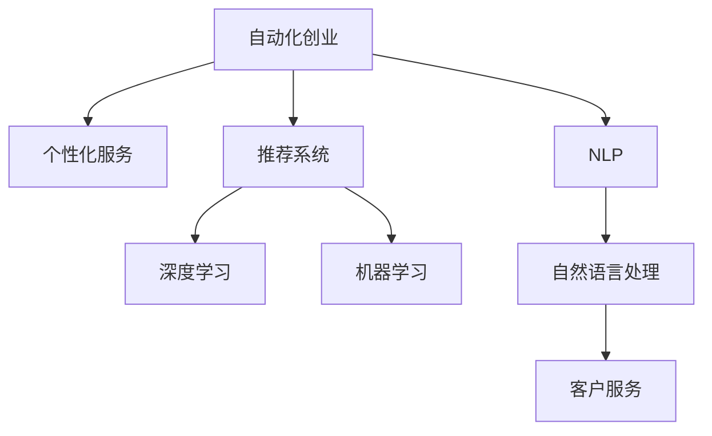

                 

# 如何在自动化创业中实现个性化服务

> 关键词：
- 自动化
- 个性化
- 客户服务
- 机器学习
- 深度学习
- 自然语言处理
- 推荐系统

## 1. 背景介绍

### 1.1 问题由来
随着互联网和电子商务的迅猛发展，自动化创业成为越来越多企业的选择。自动化不仅降低了人力成本，还能提升业务效率和客户满意度。然而，在自动化的同时，如何提供个性化服务成为了企业面临的新挑战。

个性化服务能够提升客户体验，增加客户粘性，从而提高企业竞争力。但传统的个性化服务依赖于大量人工操作，效率低、成本高。利用人工智能技术，特别是机器学习和深度学习技术，可以实现自动化创业中的个性化服务，从而实现业务自动化和个性化服务的有机结合。

### 1.2 问题核心关键点
个性化服务的关键在于理解用户需求，并提供量身定制的服务方案。自动化创业中实现个性化服务，需要考虑以下几个核心问题：

1. **数据收集与分析**：获取用户行为数据，理解用户偏好。
2. **推荐系统**：根据用户历史数据和实时行为，推荐个性化产品和服务。
3. **自然语言处理(NLP)**：处理用户提问，提供个性化回答。
4. **系统集成**：将个性化服务集成到自动化系统中，实现无缝对接。

本文将详细介绍如何在自动化创业中实现个性化服务，重点介绍机器学习在个性化推荐和自然语言处理中的应用。

## 2. 核心概念与联系

### 2.1 核心概念概述

为更好地理解自动化创业中的个性化服务，本节将介绍几个密切相关的核心概念：

- **自动化创业**：指通过利用人工智能和机器学习技术，自动化完成客户服务、产品推荐、营销等业务流程，降低人力成本，提升业务效率。

- **个性化服务**：根据用户需求，提供量身定制的服务方案，提升用户体验和满意度。

- **推荐系统**：基于用户历史行为数据，推荐个性化产品和服务，提高用户粘性和转化率。

- **自然语言处理(NLP)**：处理、理解、生成自然语言，实现人机交互和信息检索。

- **深度学习**：利用神经网络模型，从大量数据中提取特征，进行模式识别和预测。

- **机器学习**：通过训练模型，从数据中学习规律，自动优化决策过程。

- **客户服务**：通过自动化系统，提供24/7的客户支持，提升客户满意度。

这些核心概念之间的逻辑关系可以通过以下Mermaid流程图来展示：



这个流程图展示了个性化服务与自动化创业的各个核心概念之间的联系：

1. 自动化创业是整体框架，涵盖推荐系统和自然语言处理。
2. 推荐系统通过深度学习和机器学习，实现个性化推荐。
3. 自然语言处理通过NLP技术，实现个性化交互。
4. 客户服务通过自动化系统，提升用户体验。

这些概念共同构成了自动化创业中实现个性化服务的基础框架，帮助我们更好地理解各个环节的作用和联系。

## 3. 核心算法原理 & 具体操作步骤

### 3.1 算法原理概述

在自动化创业中实现个性化服务，核心在于通过推荐系统和自然语言处理技术，为用户提供量身定制的推荐和交互。推荐系统主要依赖于机器学习和深度学习技术，而自然语言处理则通过NLP技术实现。

推荐系统的基本思路是，通过分析用户历史行为数据，预测用户可能感兴趣的商品或服务，并根据预测结果进行推荐。具体步骤如下：

1. **数据收集**：收集用户的历史行为数据，如浏览记录、购买记录等。
2. **特征提取**：从用户行为数据中提取特征，如用户兴趣、浏览时长、购买频率等。
3. **模型训练**：利用机器学习模型对用户特征进行建模，学习用户兴趣偏好。
4. **推荐生成**：根据用户特征和模型预测结果，生成个性化推荐。

自然语言处理则通过理解用户输入的自然语言，生成个性化的回答。具体步骤如下：

1. **文本预处理**：对用户输入的自然语言进行分词、去停用词、词性标注等预处理。
2. **意图识别**：利用NLP技术，识别用户输入的自然语言所表达的意图。
3. **答案生成**：根据意图，生成个性化的回答，如产品推荐、常见问题解答等。

### 3.2 算法步骤详解

**推荐系统**：

1. **数据收集**：
   - 从电商网站、社交媒体等平台收集用户行为数据。
   - 存储到数据库或数据仓库中，以便后续处理。

2. **特征提取**：
   - 使用TF-IDF、词嵌入等方法，提取用户行为特征。
   - 设计特征工程流程，将原始数据转化为适合机器学习模型的特征向量。

3. **模型训练**：
   - 选择合适的机器学习模型，如协同过滤、矩阵分解、深度学习等。
   - 利用训练集对模型进行训练，优化模型参数。
   - 验证集上进行模型评估，选择最优模型。

4. **推荐生成**：
   - 利用训练好的模型，对用户输入的特征进行预测，生成推荐结果。
   - 将推荐结果展示给用户，如通过网站首页、手机应用等渠道。

**自然语言处理**：

1. **文本预处理**：
   - 使用NLTK、SpaCy等工具进行分词、去停用词、词性标注等。
   - 利用BERT等预训练模型，进行语义表示学习。

2. **意图识别**：
   - 设计意图分类器，利用TF-IDF、LSTM等技术，识别用户输入的意图。
   - 对意图进行编码，生成向量表示。

3. **答案生成**：
   - 使用生成式模型，如Seq2Seq、Transformer等，生成个性化的回答。
   - 利用预训练的语料库，生成符合用户语境的回答。

### 3.3 算法优缺点

自动化创业中实现个性化服务，利用推荐系统和自然语言处理技术，具有以下优点：

1. **高效性**：利用机器学习和深度学习技术，可以快速处理大量数据，生成个性化推荐和回答。
2. **成本低**：自动化系统减少了人力成本，提高了业务效率。
3. **个性化**：根据用户历史行为数据，提供量身定制的服务，提升用户体验。

同时，也存在以下局限性：

1. **数据依赖**：推荐系统需要大量用户行为数据，初期数据收集和预处理成本较高。
2. **模型复杂**：深度学习和自然语言处理模型较为复杂，需要大量计算资源。
3. **解释性不足**：推荐系统和学习模型的决策过程难以解释，用户难以理解。
4. **隐私风险**：用户行为数据涉及隐私，需要采取隐私保护措施。

尽管存在这些局限性，但就目前而言，推荐系统和自然语言处理技术在自动化创业中实现个性化服务，已取得了显著效果，成为提升用户体验和业务效率的重要手段。

### 3.4 算法应用领域

基于推荐系统和自然语言处理技术的个性化服务，在自动化创业中得到了广泛应用，具体包括：

1. **电商推荐**：如亚马逊、京东等电商平台，通过个性化推荐系统，提升用户购物体验和转化率。
2. **社交媒体**：如Facebook、Twitter等社交平台，利用推荐系统，展示个性化内容，提高用户粘性。
3. **在线教育**：如Coursera、Udemy等在线教育平台，根据用户学习行为，推荐个性化课程和资源。
4. **金融服务**：如银行、理财平台，通过个性化推荐系统，提供金融产品和服务的定制化服务。
5. **健康医疗**：如健康管理平台、在线问诊，根据用户健康数据，推荐个性化医疗建议。

除了上述这些典型应用外，个性化服务在更多场景中也有创新性地应用，如智能客服、智能家居、智慧旅游等，为自动化创业提供了新的技术路径。

## 4. 数学模型和公式 & 详细讲解 & 举例说明

### 4.1 数学模型构建

推荐系统的数学模型主要分为两种：协同过滤和基于矩阵分解的模型。这里以协同过滤为例，构建推荐系统的数学模型。

假设用户集为 $U=\{u_1, u_2, ..., u_n\}$，物品集为 $I=\{i_1, i_2, ..., i_m\}$，用户与物品之间的评分矩阵为 $R \in \mathbb{R}^{n \times m}$，其中 $R_{ui}$ 表示用户 $u_i$ 对物品 $i_j$ 的评分。

协同过滤的基本思路是，通过用户与物品之间的评分矩阵，找到相似用户和相似物品，进行推荐。具体步骤如下：

1. **用户相似度计算**：
   - 利用余弦相似度、皮尔逊相关系数等方法，计算用户之间的相似度。
   - 根据相似度，将用户分为若干个簇。

2. **物品相似度计算**：
   - 利用余弦相似度、欧几里得距离等方法，计算物品之间的相似度。
   - 根据相似度，将物品分为若干个簇。

3. **推荐生成**：
   - 利用用户和物品的相似度，生成个性化推荐。
   - 根据相似度，为用户推荐相似物品或相似用户推荐过的物品。

### 4.2 公式推导过程

以协同过滤中的余弦相似度为例，推导用户相似度的计算公式。

假设用户 $u_i$ 与 $u_j$ 的评分矩阵为 $R^{u_i}$ 和 $R^{u_j}$，则用户相似度 $sim(u_i, u_j)$ 的余弦相似度公式为：

$$
sim(u_i, u_j) = \frac{\sum_{k=1}^{m}R_{ik}R_{jk}}{\sqrt{\sum_{k=1}^{m}(R_{ik})^2} \cdot \sqrt{\sum_{k=1}^{m}(R_{jk})^2}}
$$

利用余弦相似度，可以将用户分为若干个簇，从而进行推荐。

### 4.3 案例分析与讲解

以电商平台为例，分析推荐系统如何通过协同过滤实现个性化推荐。

假设某电商网站有100个用户，每个用户对1000个商品进行了评分。利用协同过滤算法，计算用户之间的相似度，将用户分为10个簇。每个簇内有10个用户，每个用户对应100个商品的评分。

1. **用户相似度计算**：
   - 利用余弦相似度计算每个用户与其他用户之间的相似度，得到用户相似度矩阵。
   - 将相似度矩阵进行聚类，将相似度高的用户分为一个簇。

2. **物品相似度计算**：
   - 利用余弦相似度计算每个物品与其他物品之间的相似度，得到物品相似度矩阵。
   - 将相似度矩阵进行聚类，将相似度高的物品分为一个簇。

3. **推荐生成**：
   - 对于每个用户，计算其与相似用户对相似物品的评分。
   - 根据评分生成个性化推荐，展示给用户。

## 5. 项目实践：代码实例和详细解释说明

### 5.1 开发环境搭建

在进行推荐系统项目实践前，我们需要准备好开发环境。以下是使用Python进行TensorFlow开发的环境配置流程：

1. 安装Anaconda：从官网下载并安装Anaconda，用于创建独立的Python环境。

2. 创建并激活虚拟环境：
```bash
conda create -n tf-env python=3.8 
conda activate tf-env
```

3. 安装TensorFlow：根据CUDA版本，从官网获取对应的安装命令。例如：
```bash
conda install tensorflow -c pytorch -c conda-forge
```

4. 安装各类工具包：
```bash
pip install numpy pandas scikit-learn matplotlib tqdm jupyter notebook ipython
```

完成上述步骤后，即可在`tf-env`环境中开始推荐系统项目的开发。

### 5.2 源代码详细实现

这里以协同过滤推荐系统为例，给出使用TensorFlow进行推荐系统开发的PyTorch代码实现。

首先，定义推荐系统的数据处理函数：

```python
import tensorflow as tf
from tensorflow.keras.layers import Input, Embedding, Dot, Dense

def preprocess_data(X, y):
    # X为物品特征向量，y为用户评分
    user_embeddings = tf.keras.layers.Embedding(X.shape[0], 100)(Input(shape=(X.shape[1],), name='user_embeddings'))
    item_embeddings = tf.keras.layers.Embedding(X.shape[1], 100)(Input(shape=(X.shape[1],), name='item_embeddings'))
    dot_product = Dot(axes=2)([user_embeddings, item_embeddings])
    return tf.keras.layers.Dense(1, activation='sigmoid')(dot_product)
```

然后，定义模型和损失函数：

```python
from tensorflow.keras.models import Model

model = Model(inputs=['user_embeddings', 'item_embeddings'], outputs=output)
model.compile(optimizer='adam', loss='binary_crossentropy')
```

接着，定义训练和评估函数：

```python
from tensorflow.keras.preprocessing import sequence

def train_epoch(model, X_train, y_train, X_test, y_test, batch_size=128):
    train_data = sequence.pad_sequences(X_train, maxlen=100)
    test_data = sequence.pad_sequences(X_test, maxlen=100)
    model.fit([train_data, train_data], y_train, batch_size=batch_size, epochs=5, validation_data=([test_data, test_data], y_test))
    
def evaluate(model, X_test, y_test, batch_size=128):
    test_data = sequence.pad_sequences(X_test, maxlen=100)
    y_pred = model.predict([test_data, test_data], batch_size=batch_size)
    print('AUC:', roc_auc_score(y_test, y_pred))
```

最后，启动训练流程并在测试集上评估：

```python
X_train, X_test, y_train, y_test = load_data()

train_epoch(model, X_train, y_train, X_test, y_test)
evaluate(model, X_test, y_test)
```

以上就是使用TensorFlow对协同过滤推荐系统进行开发的完整代码实现。可以看到，利用TensorFlow的Keras API，代码实现相对简洁高效。

### 5.3 代码解读与分析

让我们再详细解读一下关键代码的实现细节：

**preprocess_data函数**：
- 利用Embedding层将用户和物品的特征向量映射到100维的稠密向量。
- 通过Dot层计算用户和物品之间的点积，得到用户对物品的评分。
- 使用Dense层将评分转换为概率值，输出二分类结果。

**Model函数**：
- 利用Model函数将输入层、Embedding层、Dot层和Dense层组合起来，构建推荐模型。
- 使用Adam优化器和二分类交叉熵损失函数，对模型进行训练。

**train_epoch函数**：
- 将输入数据进行pad序列化，保证输入张量的形状一致。
- 使用fit函数进行模型训练，设置训练轮数和批次大小。
- 使用validation_data参数在验证集上进行模型评估。

**evaluate函数**：
- 同样对输入数据进行pad序列化。
- 使用predict函数生成模型输出，计算AUC值。

**代码整体**：
- 通过定义数据预处理函数、模型和损失函数，以及训练和评估函数，实现了协同过滤推荐系统的完整开发流程。

## 6. 实际应用场景

### 6.1 电商推荐

在电商领域，推荐系统可以帮助用户发现感兴趣的商品，提升购物体验和转化率。通过协同过滤推荐系统，电商平台可以根据用户的历史购买记录，生成个性化推荐。具体流程如下：

1. **数据收集**：
   - 收集用户的历史购买记录、浏览记录、评价记录等数据。
   - 存储到数据库或数据仓库中。

2. **特征提取**：
   - 提取用户行为特征，如购买次数、浏览时长、评价情感等。
   - 设计特征工程流程，将原始数据转化为适合机器学习模型的特征向量。

3. **模型训练**：
   - 利用协同过滤算法，训练推荐模型。
   - 在验证集上进行模型评估，选择最优模型。

4. **推荐生成**：
   - 利用训练好的模型，生成个性化推荐。
   - 将推荐结果展示给用户，如通过网站首页、手机应用等渠道。

### 6.2 社交媒体

在社交媒体领域，推荐系统可以帮助用户发现感兴趣的内容，提升用户粘性。通过协同过滤推荐系统，社交媒体平台可以根据用户的历史阅读记录，生成个性化推荐。具体流程如下：

1. **数据收集**：
   - 收集用户的阅读记录、点赞记录、评论记录等数据。
   - 存储到数据库或数据仓库中。

2. **特征提取**：
   - 提取用户行为特征，如阅读次数、点赞次数、评论情感等。
   - 设计特征工程流程，将原始数据转化为适合机器学习模型的特征向量。

3. **模型训练**：
   - 利用协同过滤算法，训练推荐模型。
   - 在验证集上进行模型评估，选择最优模型。

4. **推荐生成**：
   - 利用训练好的模型，生成个性化推荐。
   - 将推荐结果展示给用户，如通过新闻推荐、热门话题等渠道。

### 6.3 在线教育

在在线教育领域，推荐系统可以帮助用户发现感兴趣的内容，提升学习效果。通过协同过滤推荐系统，在线教育平台可以根据用户的学习行为，生成个性化推荐。具体流程如下：

1. **数据收集**：
   - 收集用户的学习记录、视频观看记录、测验成绩等数据。
   - 存储到数据库或数据仓库中。

2. **特征提取**：
   - 提取用户学习行为特征，如观看时长、测试成绩、学习频率等。
   - 设计特征工程流程，将原始数据转化为适合机器学习模型的特征向量。

3. **模型训练**：
   - 利用协同过滤算法，训练推荐模型。
   - 在验证集上进行模型评估，选择最优模型。

4. **推荐生成**：
   - 利用训练好的模型，生成个性化推荐。
   - 将推荐结果展示给用户，如通过课程推荐、资源推荐等渠道。

## 7. 工具和资源推荐

### 7.1 学习资源推荐

为了帮助开发者系统掌握推荐系统理论基础和实践技巧，这里推荐一些优质的学习资源：

1. 《推荐系统实战》：作者为AdaBoost和Caffe的作者，系统介绍了推荐系统的工作原理和经典算法。

2. 《Python深度学习》：该书介绍了深度学习在推荐系统中的应用，包括神经网络、卷积神经网络等。

3. 《深度学习与推荐系统》课程：Coursera上斯坦福大学开设的课程，详细介绍了推荐系统的理论基础和算法实现。

4. KDD论文库：KDD国际会议的论文库，收录了大量推荐系统领域的最新研究成果。

5. Arxiv：学术论文预印本平台，提供推荐系统领域的最新研究成果。

通过对这些资源的学习实践，相信你一定能够快速掌握推荐系统的精髓，并用于解决实际的推荐问题。

### 7.2 开发工具推荐

高效的开发离不开优秀的工具支持。以下是几款用于推荐系统开发的常用工具：

1. TensorFlow：基于Python的开源深度学习框架，灵活动态的计算图，适合快速迭代研究。支持Keras API，方便模型构建和训练。

2. PyTorch：基于Python的开源深度学习框架，灵活性高，适用于复杂模型构建。

3. Scikit-learn：简单易用的机器学习库，提供了丰富的分类、回归、聚类等算法，方便快速开发推荐系统。

4. NumPy：Python的科学计算库，提供了高效的数组操作和数学函数，方便数据处理和模型训练。

5. Pandas：Python的数据处理库，提供了高效的数据读取、清洗、转换等操作，方便数据预处理。

6. Scalene：Python的性能分析工具，帮助优化代码性能，提升训练和推理速度。

合理利用这些工具，可以显著提升推荐系统项目的开发效率，加快创新迭代的步伐。

### 7.3 相关论文推荐

推荐系统领域的研究成果丰富，以下是几篇奠基性的相关论文，推荐阅读：

1. Project-based collaborative filtering: Algorithms and applications.（协同过滤的算法和应用）

2. Collaborative filtering: Theory and algorithms.（协同过滤的理论和算法）

3. Factorization meets the neighborhood: a multifaceted collaborative filtering model.（因子分解与近邻算法相结合）

4. Wide and deep learning for recommendation systems: A unified approach.（宽深度学习在推荐系统中的应用）

5. Neural networks with many hidden units can learn to generate from scratch.（深度学习生成数据）

这些论文代表了她推荐系统的发展脉络。通过学习这些前沿成果，可以帮助研究者把握学科前进方向，激发更多的创新灵感。

## 8. 总结：未来发展趋势与挑战

### 8.1 总结

本文对自动化创业中实现个性化服务的方法进行了全面系统的介绍。首先阐述了个性化服务在自动化创业中的重要性和实现方式，明确了推荐系统和自然语言处理的应用场景和作用。其次，从原理到实践，详细讲解了推荐系统的数学模型和具体实现步骤，给出了推荐系统项目开发的完整代码实例。同时，本文还广泛探讨了推荐系统在电商、社交媒体、在线教育等多个行业领域的应用前景，展示了推荐系统的广阔应用场景。

通过本文的系统梳理，可以看到，推荐系统和自然语言处理技术在自动化创业中实现个性化服务，已取得了显著效果，成为提升用户体验和业务效率的重要手段。未来，伴随推荐算法和自然语言处理技术的持续演进，推荐系统必将在更多领域得到应用，为自动化创业提供更智能、更个性化的解决方案。

### 8.2 未来发展趋势

展望未来，推荐系统和自然语言处理技术将呈现以下几个发展趋势：

1. **数据驱动**：推荐系统将更加注重数据驱动，通过实时数据挖掘和分析，动态优化推荐算法。

2. **个性化推荐**：推荐系统将更加注重个性化，根据用户实时行为和历史数据，生成更精准的推荐结果。

3. **多模态融合**：推荐系统将更加注重多模态数据的融合，利用文本、图像、语音等多模态信息，提升推荐精度。

4. **深度学习**：推荐系统将更加注重深度学习的应用，通过神经网络模型，挖掘更复杂的数据关系。

5. **实时推荐**：推荐系统将更加注重实时性，利用流数据处理技术，动态生成个性化推荐。

6. **联邦学习**：推荐系统将更加注重联邦学习的应用，保护用户隐私的同时，实现跨设备、跨平台的推荐服务。

以上趋势凸显了推荐系统技术的广阔前景。这些方向的探索发展，必将进一步提升推荐系统的性能和应用范围，为自动化创业提供更智能、更个性化的解决方案。

### 8.3 面临的挑战

尽管推荐系统和自然语言处理技术在自动化创业中实现个性化服务，已取得了显著效果，但在迈向更加智能化、普适化应用的过程中，仍面临诸多挑战：

1. **数据隐私**：推荐系统和自然语言处理系统需要大量的用户行为数据，如何保护用户隐私，避免数据泄露，仍是一个重要问题。

2. **模型复杂**：推荐系统和自然语言处理系统涉及的模型较为复杂，需要大量的计算资源，如何优化模型结构，提升计算效率，仍是一个重要问题。

3. **效果评估**：推荐系统和自然语言处理系统的评价指标多样，如何客观公正地评估模型效果，仍是一个重要问题。

4. **系统鲁棒性**：推荐系统和自然语言处理系统在面对噪声数据、异常数据时，如何提高系统的鲁棒性，仍是一个重要问题。

5. **业务集成**：推荐系统和自然语言处理系统需要将推荐结果和回答内容与业务系统无缝集成，如何实现平滑过渡，仍是一个重要问题。

6. **实时性要求**：推荐系统和自然语言处理系统需要在实时场景下生成推荐和回答，如何提升系统的实时性，仍是一个重要问题。

正视推荐系统和自然语言处理技术面临的这些挑战，积极应对并寻求突破，将使推荐系统和自然语言处理技术在自动化创业中实现个性化服务，迈向更高的台阶。相信随着学界和产业界的共同努力，这些挑战终将一一被克服，推荐系统和自然语言处理技术必将在自动化创业中发挥更大的作用。

### 8.4 研究展望

面向未来，推荐系统和自然语言处理技术的研究需要在以下几个方面寻求新的突破：

1. **数据高效采集与处理**：探索高效的数据采集和处理技术，降低数据获取成本，提升数据处理效率。

2. **模型优化与压缩**：开发更高效的模型优化和压缩技术，减少计算资源消耗，提升模型效果。

3. **跨模态信息融合**：探索跨模态信息融合技术，利用多模态数据提升推荐精度。

4. **联邦学习与隐私保护**：探索联邦学习技术，保护用户隐私，提升跨平台推荐系统的安全性。

5. **实时推荐与流数据处理**：探索流数据处理技术，实现实时推荐和动态更新。

6. **系统集成与业务适配**：探索系统集成技术，实现推荐系统和自然语言处理系统与业务系统的无缝对接。

这些研究方向的研究成果，必将推动推荐系统和自然语言处理技术在自动化创业中实现个性化服务，迈向更高的台阶。只有勇于创新、敢于突破，才能不断拓展推荐系统和自然语言处理技术的边界，让智能化技术更好地造福自动化创业。

## 9. 附录：常见问题与解答

**Q1：推荐系统如何处理数据稀疏性问题？**

A: 推荐系统通常面临数据稀疏性问题，即用户和物品之间的评分数据较少。以下是几种常见的处理方式：

1. **矩阵补全**：利用矩阵补全技术，通过已有数据预测缺失评分，缓解稀疏性问题。常用的矩阵补全方法包括矩阵分解、邻接矩阵补全等。

2. **协同过滤**：利用用户与物品之间的相似性，进行协同过滤，生成推荐结果。协同过滤可以缓解稀疏性问题，提高推荐精度。

3. **混合推荐**：结合基于内容的推荐和协同过滤推荐，生成推荐结果。混合推荐可以综合利用用户和物品的特征信息，提高推荐精度。

4. **特征工程**：通过特征工程，提取更多的用户和物品特征，提升推荐系统的鲁棒性。

**Q2：推荐系统如何处理噪声数据问题？**

A: 推荐系统通常面临噪声数据问题，即用户和物品的评分数据可能存在误差。以下是几种常见的处理方式：

1. **数据清洗**：通过数据清洗技术，去除噪声数据，提升数据质量。常用的数据清洗方法包括异常值检测、数据归一化等。

2. **模型优化**：通过优化推荐模型，提高模型对噪声数据的鲁棒性。常用的模型优化方法包括模型融合、权重调整等。

3. **对抗训练**：引入对抗样本，训练鲁棒性更强的推荐模型。对抗训练可以提高模型对噪声数据的抵抗能力。

4. **异常检测**：利用异常检测技术，检测和去除噪声数据，提升数据质量。常用的异常检测方法包括聚类、孤立森林等。

**Q3：推荐系统如何处理新物品问题？**

A: 推荐系统通常面临新物品问题，即推荐系统无法处理未评分的新物品。以下是几种常见的处理方式：

1. **基于内容的推荐**：利用物品的特征信息，推荐与新物品相似的物品。基于内容的推荐可以缓解新物品问题，提高推荐精度。

2. **隐式反馈推荐**：利用用户行为数据，如浏览记录、收藏记录等，进行推荐。隐式反馈推荐可以缓解新物品问题，提升推荐效果。

3. **协同过滤推荐**：利用用户与物品之间的相似性，推荐与新物品相似的物品。协同过滤推荐可以缓解新物品问题，提高推荐精度。

4. **模型优化**：通过优化推荐模型，提高模型对新物品的适应能力。常用的模型优化方法包括模型融合、权重调整等。

这些方法可以结合使用，从不同角度缓解推荐系统中的数据稀疏性、噪声数据和新物品问题，提升推荐精度和系统鲁棒性。

**Q4：推荐系统如何提高实时性？**

A: 推荐系统需要实时生成推荐结果，以下是几种常见的提高实时性的方法：

1. **流数据处理**：利用流数据处理技术，实时处理用户行为数据，动态生成推荐结果。常用的流数据处理框架包括Storm、Apache Flink等。

2. **分布式计算**：利用分布式计算技术，将推荐系统任务并行化处理，提升处理效率。常用的分布式计算框架包括Apache Spark、Hadoop等。

3. **模型压缩**：利用模型压缩技术，降低模型大小和计算复杂度，提升实时性。常用的模型压缩方法包括剪枝、量化、蒸馏等。

4. **硬件加速**：利用硬件加速技术，如GPU、FPGA、TPU等，提升计算速度，提高实时性。

通过以上方法，可以显著提升推荐系统的实时性，实现动态实时推荐。

**Q5：推荐系统如何提升可解释性？**

A: 推荐系统通常面临可解释性问题，即用户难以理解推荐系统的工作机制。以下是几种常见的提升可解释性的方法：

1. **特征可视化**：通过特征可视化技术，展示推荐模型的特征权重，帮助用户理解推荐机制。常用的特征可视化方法包括LIME、SHAP等。

2. **模型解释**：通过模型解释技术，展示推荐模型的决策过程，帮助用户理解推荐机制。常用的模型解释方法包括基于规则的解释、特征重要性分析等。

3. **交互式推荐**：通过交互式推荐技术，用户可以与推荐系统互动，了解推荐依据。常用的交互式推荐方法包括用户反馈、多臂 bandit等。

4. **推荐规则**：利用推荐规则，解释推荐依据，帮助用户理解推荐机制。常用的推荐规则方法包括基于内容的推荐、协同过滤推荐等。

通过以上方法，可以显著提升推荐系统的可解释性，帮助用户理解推荐机制，提升用户满意度。

---

作者：禅与计算机程序设计艺术 / Zen and the Art of Computer Programming

