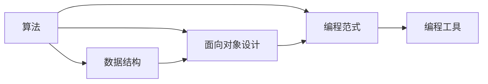

                 

## 1. 背景介绍

在信息技术日新月异、数字化转型如火如荼的今天，如何将编程技能应用于个人效率提升成为众多IT从业者和学生的共同关注点。编程不仅仅是开发软件的工具，更是一种高效解决问题的思维方式。通过编程技能，个人可以自动化重复性工作，高效管理数据，构建智能应用，极大地提高工作效率和生活质量。本文将从编程技能的核心要素入手，探讨如何将编程技能广泛应用于个人效率提升，以期为读者提供实用的指导和启示。

## 2. 核心概念与联系

编程技能的核心要素包括算法、数据结构、面向对象设计、编程范式和工具等。这些要素之间相互联系，共同构建了高效解决问题的编程体系。通过以下Mermaid流程图，我们能够更清晰地理解这些核心要素之间的关系：



### 2.1 核心概念概述

- **算法(Algorithm)**：解决问题的方法和步骤。算法分为基本算法和高级算法，掌握基本算法是编程的基础。
- **数据结构(Data Structure)**：数据存储和组织的方式。数据结构的选择对算法效率影响显著。
- **面向对象设计(Object-Oriented Design)**：通过封装、继承和多态等机制，实现模块化、可扩展和易于维护的代码结构。
- **编程范式(Programming Paradigm)**：如过程式、函数式、面向对象等编程方式。每种范式都有其适用的场景和优缺点。
- **编程工具(Programming Tools)**：如IDE、调试器、编译器、版本控制系统等，提高开发效率和代码质量。

这些核心概念相互支撑，共同促进了高效编程和问题解决能力的提升。

## 3. 核心算法原理 & 具体操作步骤

### 3.1 算法原理概述

编程技能的核心在于算法，算法是解决特定问题的步骤和方法。算法一般包括基本算法和高级算法，如排序、搜索、图论、动态规划、贪心算法等。掌握这些算法原理和应用场景，能够帮助个人在面对各种实际问题时，快速找到解决方案。

### 3.2 算法步骤详解

1. **问题定义**：明确问题，确定输入和输出。
2. **算法设计**：选择合适的算法，如排序、搜索、图算法等。
3. **代码实现**：根据算法设计，选择合适的数据结构和编程语言实现。
4. **测试优化**：对代码进行测试，并根据测试结果进行优化。
5. **部署维护**：将代码部署到生产环境，并持续维护更新。

### 3.3 算法优缺点

- **优点**：算法能够高效解决特定问题，通过抽象和自动化，提高工作效率。
- **缺点**：算法的选择和实现需要一定的知识和经验，开发复杂度较高。

### 3.4 算法应用领域

算法广泛应用于软件开发、数据分析、人工智能、网络安全等各个领域。通过算法，可以实现自动化处理数据、智能推荐、加密解密、网络攻击防御等功能。

## 4. 数学模型和公式 & 详细讲解 & 举例说明

### 4.1 数学模型构建

数学模型是编程问题中的重要组成部分，通过数学模型可以更精确地描述问题的本质。例如，线性回归、决策树、神经网络等模型都是常用的数学模型。

### 4.2 公式推导过程

以线性回归为例，推导其公式：

$$
\min_{\theta} \frac{1}{2n}\sum_{i=1}^n (y_i - \theta^Tx_i)^2
$$

其中，$n$为样本数，$y_i$为目标变量，$x_i$为输入变量，$\theta$为模型参数。

### 4.3 案例分析与讲解

线性回归模型在数据分析和预测中应用广泛。例如，预测股票价格、分析销售趋势、推荐系统等。通过线性回归模型，可以建立输入变量和目标变量之间的关系，并通过训练数据拟合模型参数，实现预测和优化。

## 5. 项目实践：代码实例和详细解释说明

### 5.1 开发环境搭建

开发环境搭建是编程实践的第一步。常用的开发环境包括：

- **IDE**：如Visual Studio Code、IntelliJ IDEA、Eclipse等。
- **版本控制系统**：如Git、SVN等，管理代码版本。
- **构建工具**：如Maven、Gradle等，自动化构建和管理项目依赖。

### 5.2 源代码详细实现

以下是一个简单的线性回归模型实现示例，使用Python语言和Scikit-Learn库：

```python
from sklearn.linear_model import LinearRegression

# 加载数据集
X, y = load_data()

# 创建模型
model = LinearRegression()

# 训练模型
model.fit(X, y)

# 预测结果
y_pred = model.predict(X_test)
```

### 5.3 代码解读与分析

- `load_data`：加载数据集。
- `LinearRegression`：创建线性回归模型。
- `fit`：训练模型，使用训练数据拟合模型参数。
- `predict`：预测结果，使用测试数据预测目标变量。

### 5.4 运行结果展示

运行上述代码，可以得到训练后的模型参数和测试结果，评估模型的准确性。

## 6. 实际应用场景

### 6.1 项目管理

编程技能在项目管理中也有广泛应用。通过编程，可以实现任务自动化、进度追踪、资源管理等功能。例如，使用Python编写脚本来自动更新项目进度、生成报表，或使用Jira进行任务管理和分配。

### 6.2 数据分析

数据分析是编程技能的重要应用场景之一。通过编写Python脚本，可以使用Pandas、NumPy、Matplotlib等工具进行数据清洗、分析和可视化。例如，分析销售数据、客户行为数据、网络流量数据等，帮助企业做出更明智的决策。

### 6.3 自动化测试

在软件开发中，自动化测试是保证代码质量和提高效率的关键。通过编写测试脚本，可以自动化执行单元测试、集成测试、性能测试等，确保代码的稳定性和可靠性。例如，使用JUnit、TestNG、Selenium等工具进行单元测试和Web应用测试。

### 6.4 未来应用展望

未来，编程技能将继续在各个领域发挥重要作用。例如，物联网设备的编程、区块链应用的开发、智能家居系统的构建等。编程技能不仅是技术工作者的必备技能，也将成为普通人提升效率和创造价值的重要手段。

## 7. 工具和资源推荐

### 7.1 学习资源推荐

- **在线课程**：如Coursera、Udacity、edX等平台提供大量编程课程，涵盖基础算法、数据结构、编程语言等。
- **编程书籍**：如《算法导论》、《编程珠玑》、《Head First设计模式》等，深入讲解编程原理和最佳实践。
- **开源项目**：GitHub上有众多开源项目，参与开源项目能够快速积累编程经验和实际项目经验。

### 7.2 开发工具推荐

- **IDE**：如Visual Studio Code、IntelliJ IDEA、Eclipse等，提供代码高亮、自动补全、调试等功能。
- **版本控制系统**：如Git、SVN等，管理代码版本，支持分支、合并、拉取等操作。
- **构建工具**：如Maven、Gradle等，自动化构建和管理项目依赖。

### 7.3 相关论文推荐

- **《程序员修炼之道》**：这是一本经典的编程书籍，通过大量真实案例，探讨如何成为一名优秀的程序员。
- **《重构》**：这本书详细介绍了软件重构的方法和技巧，帮助程序员提升代码质量和可维护性。
- **《代码整洁之道》**：这本书强调代码整洁的重要性，提供了大量编程规范和最佳实践。

## 8. 总结：未来发展趋势与挑战

### 8.1 研究成果总结

编程技能在个人效率提升中的应用前景广阔。通过算法、数据结构、面向对象设计、编程范式和工具等核心要素，个人可以构建高效解决问题的能力。编程技能的应用不仅限于软件开发，还广泛应用于项目管理、数据分析、自动化测试等领域。

### 8.2 未来发展趋势

未来，编程技能将继续在各个领域发挥重要作用。例如，物联网设备的编程、区块链应用的开发、智能家居系统的构建等。编程技能不仅是技术工作者的必备技能，也将成为普通人提升效率和创造价值的重要手段。

### 8.3 面临的挑战

尽管编程技能在提升个人效率方面具有重要价值，但实际应用中也面临一些挑战：

- **学习曲线陡峭**：编程技能的掌握需要时间和精力，初学者可能会遇到困难。
- **语言和技术多样性**：编程语言和技术不断更新，需要持续学习和适应。
- **项目复杂性**：大型项目需要多人协作，沟通和协作难度较大。

### 8.4 研究展望

为了克服这些挑战，未来的研究应重点关注以下几点：

- **编程教育**：改进编程教育方式，提高教育质量和效率，普及编程技能。
- **工具和框架**：开发更易用的编程工具和框架，降低编程门槛，提高开发效率。
- **跨学科应用**：推动编程技能与其他学科的融合，拓展编程技能的应用场景。

## 9. 附录：常见问题与解答

### 9.1 问题一：编程技能是否适用于非计算机专业学生？

**回答**：编程技能对所有学生都有价值。无论是计算机专业还是非计算机专业，掌握编程技能都能够提升个人效率，解决实际问题。

### 9.2 问题二：初学者如何开始学习编程？

**回答**：初学者可以从简单编程语言（如Python、JavaScript）入手，选择一些入门级项目（如编程小游戏、数据分析项目）进行实践。参加编程课程和编程社区也是快速提升编程技能的好方法。

### 9.3 问题三：如何提升编程效率？

**回答**：提升编程效率需要掌握一些高效编程技巧，如使用IDE、版本控制系统、代码重构等。同时，持续学习和实践，积累编程经验，也是提升编程效率的重要途径。

---

作者：禅与计算机程序设计艺术 / Zen and the Art of Computer Programming

