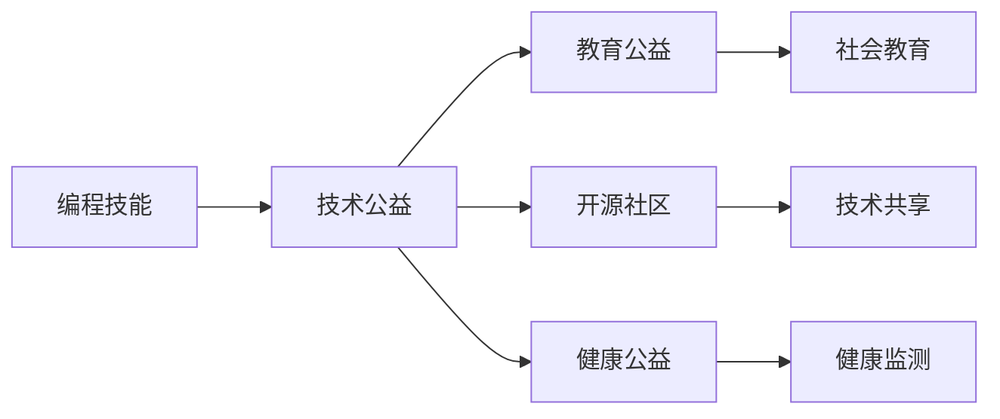

                 

# 如何将编程技能应用于社会公益

> 关键词：编程技能, 社会公益, 技术公益, 开源社区, 教育公益, 健康公益

## 1. 背景介绍

### 1.1 问题由来
随着科技的发展和社会的进步，越来越多的人开始思考如何利用自己的专业技能服务于社会。程序员作为技术行业的核心力量，拥有强大的编程技能，将这一技能应用到社会公益事业中，既能够提升自身价值，又能帮助他人。

### 1.2 问题核心关键点
将编程技能应用于社会公益，关键在于找到合适的应用场景，通过技术手段解决社会问题。常见的应用场景包括但不限于以下几个方面：

- 教育公益：通过开发在线教育平台、编程学习资源等，普及编程知识，帮助更多的人提高技能，实现自我提升。
- 技术公益：在医疗、环保、应急响应等领域，开发工具和解决方案，提升效率和准确性。
- 开源社区：积极参与开源项目，贡献代码和资源，推动技术共享和协作。
- 健康公益：开发健康监测、康复辅助等应用，关注特殊群体的健康和福祉。

### 1.3 问题研究意义
将编程技能应用于社会公益，具有以下重要意义：

1. **提升个人价值**：通过参与公益项目，程序员能够将自己的专业技能转化为社会贡献，提升社会地位和自我满足感。
2. **促进社会进步**：技术工具和方法的应用，能够提升社会服务的效率和质量，促进社会的全面进步。
3. **推动教育普及**：编程知识的普及，有助于提升全社会的数字化能力，培养更多的科技人才。
4. **促进技术创新**：参与公益项目，能够激发更多的技术创新，推动社会治理的现代化。

## 2. 核心概念与联系

### 2.1 核心概念概述

要理解如何将编程技能应用于社会公益，需要首先掌握以下几个关键概念：

- **编程技能**：包括编程语言、算法设计、软件开发、系统架构等方面的知识和技术。
- **社会公益**：指通过技术手段解决社会问题，提升社会福祉的公益活动。
- **技术公益**：指利用技术手段，改善社会问题的公益活动。
- **开源社区**：由程序员和开发者组成的社区，致力于共享代码、工具和知识，推动技术进步。
- **教育公益**：通过技术手段，普及编程知识，提升教育水平和公众数字化素养。
- **健康公益**：利用技术手段，关注健康监测、康复辅助等领域，提升人们的健康水平和生活质量。

这些概念之间存在密切联系，通过编程技能的应用，可以在教育、技术、健康等多个领域实现社会公益的目标。

### 2.2 核心概念原理和架构的 Mermaid 流程图



这个流程图展示了编程技能如何通过技术公益，进一步延伸到教育公益、开源社区和健康公益等不同的应用领域，从而实现社会公益的目标。

## 3. 核心算法原理 & 具体操作步骤

### 3.1 算法原理概述

将编程技能应用于社会公益，可以通过以下算法原理实现：

1. **需求分析**：通过调查和访谈，了解社会需求和潜在痛点，确定技术应用的可行性。
2. **技术选型**：选择合适的技术栈和工具，确保项目的实现效率和效果。
3. **代码开发**：根据需求分析和技术选型，编写代码实现功能模块。
4. **系统集成**：将各模块集成到统一系统中，进行测试和优化。
5. **部署上线**：将系统部署到生产环境，进行日常维护和迭代改进。

### 3.2 算法步骤详解

以下是一个详细的算法步骤：

1. **需求调研**：通过问卷调查、面对面访谈等方式，了解目标群体的需求和问题。例如，对于教育公益项目，可以调查学生和教师的需求；对于健康公益项目，可以调查病人和医护人员的需求。

2. **技术评估**：评估现有技术和工具的适用性。例如，选择合适的编程语言（如Python、JavaScript等），确定数据存储和处理的方式（如SQL、NoSQL等）。

3. **系统设计**：设计系统的整体架构和技术栈。例如，决定是否使用前后端分离、微服务架构等。

4. **代码实现**：编写代码实现系统的各个功能模块。例如，开发在线教育平台的学习模块、健康监测系统的数据收集模块等。

5. **测试优化**：对系统进行测试和优化，确保功能的正确性和稳定性。例如，进行单元测试、集成测试、用户验收测试等。

6. **部署上线**：将系统部署到生产环境，并进行日常维护和迭代改进。例如，监控系统运行状态，收集用户反馈，定期更新代码和数据。

### 3.3 算法优缺点

将编程技能应用于社会公益的方法，具有以下优点：

1. **高效性**：技术手段能够快速提升社会服务的效率和质量，解决复杂问题。
2. **灵活性**：编程技能的灵活性和可扩展性，使得公益项目能够根据需求进行快速迭代和优化。
3. **可控性**：通过编程技能的应用，公益项目的实施过程和效果具有较高的可控性。

同时，也存在一些缺点：

1. **技术依赖**：公益项目的效果很大程度上依赖于技术实现的正确性和质量。
2. **资源消耗**：编程技能的应用需要一定的计算资源和人力资源，对于资源有限的公益组织可能是一大挑战。
3. **维护成本**：公益项目的长期维护和更新需要持续的技术投入和人力资源。

### 3.4 算法应用领域

将编程技能应用于社会公益，可以广泛应用于以下几个领域：

- **教育公益**：开发在线教育平台、编程学习应用等，普及编程知识，提升教育质量。
- **技术公益**：开发医疗信息系统、环保监测工具等，提升社会服务的效率和准确性。
- **开源社区**：参与开源项目，贡献代码和资源，推动技术共享和协作。
- **健康公益**：开发健康监测系统、康复辅助应用等，关注特殊群体的健康和福祉。

## 4. 数学模型和公式 & 详细讲解

### 4.1 数学模型构建

在将编程技能应用于社会公益时，可以构建以下数学模型：

1. **用户需求模型**：描述目标用户群体的需求和问题，例如通过问卷调查得到的需求分布。

2. **技术解决方案模型**：描述通过编程技能实现的技术方案和算法，例如基于机器学习的预测模型。

3. **系统性能模型**：描述系统的运行效率和稳定性，例如响应时间和系统负载。

4. **用户反馈模型**：描述用户对系统的反馈和评价，例如通过用户满意度调查得到的数据。

5. **资源消耗模型**：描述项目实施所需的计算资源和人力资源，例如服务器配置和开发人员数量。

### 4.2 公式推导过程

以教育公益项目为例，通过编程技能实现的用户需求模型和解决方案模型如下：

1. **用户需求模型**：

   $$
   D = \{(x_i, y_i)\}_{i=1}^N
   $$

   其中 $x_i$ 表示用户需求，$y_i$ 表示用户满意度，$N$ 表示用户数量。

2. **解决方案模型**：

   $$
   F = \{x_i, \theta\}
   $$

   其中 $x_i$ 表示用户需求，$\theta$ 表示编程实现的技术参数，$F$ 表示解决方案。

### 4.3 案例分析与讲解

假设某教育公益项目旨在开发在线编程学习应用，通过问卷调查得到以下需求：

- 50%的用户需要基础编程知识
- 30%的用户需要进阶编程知识
- 20%的用户需要高级编程知识

基于这些需求，可以构建以下解决方案模型：

1. **基础编程课程**：

   $$
   F_1 = \{x_1, \theta_1\}
   $$

2. **进阶编程课程**：

   $$
   F_2 = \{x_2, \theta_2\}
   $$

3. **高级编程课程**：

   $$
   F_3 = \{x_3, \theta_3\}
   $$

其中 $x_1, x_2, x_3$ 分别表示基础、进阶、高级编程课程的需求，$\theta_1, \theta_2, \theta_3$ 分别表示相应课程的编程实现参数。

## 5. 项目实践：代码实例和详细解释说明

### 5.1 开发环境搭建

在进行公益项目开发前，需要搭建合适的开发环境。以下是使用Python和Django框架搭建开发环境的流程：

1. **安装Python**：下载并安装Python 3.x版本，确保其与项目兼容。

2. **安装Django**：使用pip安装Django框架，并创建一个新的项目。

   ```bash
   pip install django
   django-admin startproject project_name
   ```

3. **安装数据库**：选择MySQL、PostgreSQL等关系型数据库，并使用Django内置的admin界面管理数据。

   ```bash
   pip install django-db-backend-psycopg2
   ```

4. **配置环境**：在settings.py文件中配置数据库和其他相关设置。

5. **创建应用**：使用Django管理后台创建新的应用，并编写相应的视图和模板。

### 5.2 源代码详细实现

以下是一个简单的在线编程学习应用开发流程：

1. **开发需求分析**：通过问卷调查了解目标用户的需求和痛点。

2. **设计系统架构**：确定项目的技术栈和数据模型。

   ```python
   # models.py
   from django.db import models

   class User(models.Model):
       username = models.CharField(max_length=30)
       email = models.EmailField()

   class Course(models.Model):
       title = models.CharField(max_length=100)
       description = models.TextField()
       level = models.IntegerField()
   ```

3. **编写代码实现**：根据需求和架构，编写具体的代码实现。

   ```python
   # views.py
   from django.shortcuts import render
   from .models import User, Course

   def home(request):
       courses = Course.objects.all()
       return render(request, 'home.html', {'courses': courses})

   def course_detail(request, pk):
       course = get_object_or_404(Course, pk=pk)
       return render(request, 'course_detail.html', {'course': course})
   ```

4. **系统集成和测试**：将各模块集成到统一系统中，并进行测试和优化。

   ```python
   # urls.py
   from django.urls import path
   from . import views

   urlpatterns = [
       path('', views.home, name='home'),
       path('course/<int:pk>/', views.course_detail, name='course_detail'),
   ]
   ```

5. **部署上线**：将系统部署到生产环境，并进行日常维护和迭代改进。

   ```python
   # 使用Django的runserver命令启动开发服务器
   python manage.py runserver
   ```

### 5.3 代码解读与分析

在开发过程中，需要注意以下几个关键点：

1. **需求分析**：确保对用户需求的准确理解和把握，避免因需求不明确导致的资源浪费。
2. **系统设计**：合理设计系统架构，确保代码的可扩展性和维护性。
3. **代码实现**：严格遵循编码规范和最佳实践，确保代码的健壮性和可读性。
4. **系统测试**：全面覆盖单元测试、集成测试和用户验收测试，确保系统的稳定性和正确性。
5. **部署上线**：选择适合的生产环境，进行持续监控和优化，确保系统的持续可用。

## 6. 实际应用场景

### 6.1 教育公益项目

教育公益项目通过编程技能的应用，可以帮助普及编程知识，提升教育质量和公众数字化素养。例如：

- **在线编程学习平台**：开发简单易用的在线编程学习应用，提供基础和进阶编程课程，供学生免费学习。
- **编程竞赛平台**：举办在线编程竞赛，激发学生学习编程的兴趣和激情，促进编程文化的普及。
- **编程教育资源库**：收集和整理高质量的编程教育资源，提供给学校和学生，提升教育资源共享的效率。

### 6.2 技术公益项目

技术公益项目通过编程技能的应用，可以提高社会服务的效率和准确性，改善民生。例如：

- **医疗信息系统**：开发基于人工智能的医疗信息系统，提升医院的管理效率和医疗水平。
- **环保监测系统**：开发环境监测系统，实时收集和分析环境数据，支持环保政策的制定和实施。
- **应急响应系统**：开发应急响应系统，提高灾害预警和应对效率，保障人民生命财产安全。

### 6.3 开源社区项目

开源社区项目通过编程技能的应用，可以促进技术共享和协作，推动技术进步。例如：

- **代码贡献**：积极参与开源项目，贡献代码和资源，推动社区的发展和壮大。
- **社区协作**：通过线上讨论和线下活动，加强开发者之间的交流和合作，形成技术生态。
- **知识共享**：建立技术文档和知识库，分享编程经验和最佳实践，提升社区的集体智慧。

### 6.4 健康公益项目

健康公益项目通过编程技能的应用，可以关注特殊群体的健康和福祉，提升公共健康水平。例如：

- **健康监测系统**：开发健康监测系统，实时采集和分析用户的健康数据，提供个性化的健康建议。
- **康复辅助应用**：开发康复辅助应用，帮助残疾人和老年人进行日常康复训练，提升生活质量。
- **心理健康平台**：开发心理健康平台，提供心理测评和咨询服务，帮助用户缓解压力和焦虑。

## 7. 工具和资源推荐

### 7.1 学习资源推荐

为了帮助开发者更好地掌握编程技能和公益应用，以下是一些推荐的学习资源：

1. **《Python编程从入门到实践》**：适合编程初学者，深入浅出地介绍了Python编程基础和应用实践。
2. **《Django Web开发》**：介绍Django框架的基本用法和高级功能，适合Web开发入门。
3. **《Open Source: The Definitive Guide》**：详细介绍开源社区的运作方式和最佳实践，适合开源项目贡献者。
4. **《代码大全》**：讲解软件开发的最佳实践和编程技巧，适合提高代码质量和技术水平。
5. **《计算机程序设计艺术》**：经典编程入门书籍，深入讲解编程思想和算法设计。

### 7.2 开发工具推荐

以下是一些常用的开发工具和框架，推荐给公益项目开发者：

1. **Python**：流行的编程语言，易于学习和使用，适合各种类型的编程任务。
2. **Django**：流行的Web框架，支持MVC架构，提供丰富的数据库和模板引擎。
3. **Flask**：轻量级的Web框架，适合快速开发和部署小型应用。
4. **React**：流行的前端框架，支持组件化开发和响应式设计。
5. **Vue.js**：流行的前端框架，适合构建复杂的Web应用和单页应用。
6. **Git**：流行的版本控制系统，支持分布式协作开发。

### 7.3 相关论文推荐

为了深入理解编程技能在社会公益中的应用，以下是一些推荐的相关论文：

1. **《开源社区的社会资本网络分析》**：研究开源社区的社交网络和知识流动，探讨技术共享和协作的机制。
2. **《编程技能的社会影响》**：分析编程技能在教育、技术、健康等领域的社会影响，探讨其潜在的社会价值。
3. **《技术公益的应用案例研究》**：通过具体案例，展示编程技能在医疗、环保、应急响应等领域的实际应用效果。

## 8. 总结：未来发展趋势与挑战

### 8.1 研究成果总结

将编程技能应用于社会公益，已经取得了显著的成果，并在多个领域得到了广泛应用。这些成果不仅提升了社会服务的效率和质量，还促进了技术共享和协作，推动了社会的全面进步。

### 8.2 未来发展趋势

未来，编程技能在社会公益中的应用将呈现以下几个发展趋势：

1. **智能化和自动化**：通过人工智能和大数据分析，实现公益项目的智能化和自动化，提升服务效率和精准性。
2. **全栈开发和跨领域应用**：开发全栈技术解决方案，跨越多个应用领域，实现更广泛的公益覆盖。
3. **社区协作和生态建设**：加强开发者之间的协作和交流，构建更强大的技术生态，推动公益项目的持续发展。
4. **跨文化和社会包容**：关注全球不同文化和社会群体的需求，推动包容性公益项目的发展，提升社会公平性。

### 8.3 面临的挑战

尽管编程技能在社会公益中的应用取得了一定成果，但仍面临诸多挑战：

1. **技术资源限制**：对于资源有限的公益组织，技术资源的获取和应用是一大挑战。
2. **用户需求多样化**：不同群体的需求和痛点各不相同，需要个性化定制的技术解决方案。
3. **技术标准化**：公益项目的开发标准和评估方法尚未完全统一，缺乏统一的指导和规范。
4. **长期维护成本**：公益项目需要持续的技术支持和维护，成本较高。
5. **安全和隐私**：公益项目涉及用户数据和个人隐私，需要严格的数据安全和隐私保护措施。

### 8.4 研究展望

未来，编程技能在社会公益中的应用需要从以下几个方面进行研究：

1. **技术标准化**：制定公益项目的技术标准和评估方法，提高项目的一致性和可比性。
2. **数据驱动决策**：利用大数据和人工智能技术，进行数据分析和预测，提升公益项目的决策效率和效果。
3. **跨领域融合**：推动编程技能与其他领域技术的融合，实现更全面和深入的公益应用。
4. **社会影响评估**：开展公益项目的社会影响评估，了解其对社会进步的贡献和效果。

总之，将编程技能应用于社会公益，是一个充满挑战和机遇的领域。通过不断的技术创新和实践探索，相信编程技能在社会公益中的应用将更加广泛和深入，为社会的进步和和谐贡献更多的力量。

## 9. 附录：常见问题与解答

**Q1: 如何选择合适的编程语言和框架？**

A: 根据项目需求和团队技术栈选择合适的编程语言和框架。例如，Web开发项目可以选择Django或Flask，移动应用可以选择React Native或Flutter。

**Q2: 如何进行需求调研和用户反馈收集？**

A: 通过问卷调查、访谈、用户测试等方式进行需求调研和用户反馈收集。确保调研过程的全面性和准确性，定期更新和调整需求。

**Q3: 如何保证项目的可持续性和稳定性？**

A: 建立严格的开发流程和规范，进行代码审查和测试，定期进行系统维护和更新。同时，建立用户反馈机制，及时响应和解决问题。

**Q4: 如何处理公益项目中的安全和隐私问题？**

A: 加强数据加密和存储保护，采用匿名化处理，遵守相关法律法规，确保用户隐私和数据安全。

**Q5: 如何提升公益项目的社会影响和认可度？**

A: 积极进行项目宣传和推广，参与社会公益活动，建立用户和社区的信任和支持，提升项目的社会影响力。

---

作者：禅与计算机程序设计艺术 / Zen and the Art of Computer Programming

