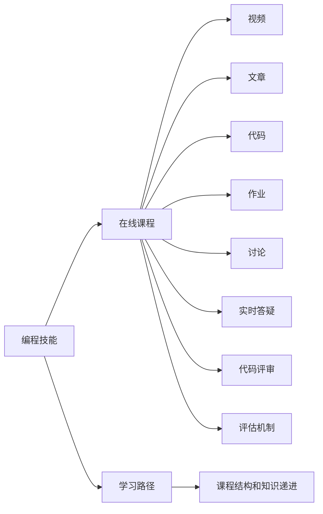

                 

# 如何将编程技能转化为在线课程

## 1. 背景介绍

在当今信息爆炸的时代，人们对于在线教育的需求日益增长。编程技能作为现代社会中的核心竞争力之一，其在线教育市场潜力巨大。然而，将编程技能转化为高质量的在线课程并非易事。本文旨在探讨如何将编程技能系统化地转化为易于理解和操作的在线课程，使其能够有效地传播知识，培养更多的编程人才。

### 1.1 编程教育的重要性
编程能力已经成为现代社会不可或缺的一项技能。无论是软件开发、数据分析、人工智能，还是区块链、物联网等领域，编程技能都是关键。在线课程作为现代教育的重要组成部分，不仅可以帮助更多人掌握编程技能，还可以扩大教育的覆盖面，突破时间和空间的限制。因此，将编程技能转化为在线课程，具有重要意义。

### 1.2 在线教育的发展现状
在线教育经历了从MOOCs（大规模开放在线课程）到SPOCs（小型私有在线课程），再到XMOOCs（开放且可扩展的在线课程）的发展历程。随着技术的进步和需求的增长，在线教育平台如Coursera、Udacity、edX等不断涌现，吸引了全球数以亿计的学习者。这些平台上的课程内容涵盖了编程、数据科学、人工智能、机器学习等诸多领域，极大地促进了知识的传播和人才的培养。

## 2. 核心概念与联系

### 2.1 核心概念概述

在将编程技能转化为在线课程的过程中，涉及到以下几个核心概念：

- **编程技能**：包括算法、数据结构、软件开发、系统设计、软件工程等多个方面。
- **在线课程**：通过视频、文章、代码、作业、讨论等多种形式，系统地传播知识。
- **学习路径**：根据学习者的基础和目标，设计合理的课程结构和知识递进。
- **互动反馈**：通过实时答疑、代码评审、讨论等形式，增强学习体验。
- **评估机制**：通过测试、项目、作业等方式，评估学习效果，提供反馈。

这些概念之间相互关联，共同构成了在线编程教育的框架。

### 2.2 核心概念原理和架构的 Mermaid 流程图



这个流程图展示了编程技能转化为在线课程的关键环节及其相互关系。

## 3. 核心算法原理 & 具体操作步骤

### 3.1 算法原理概述

将编程技能转化为在线课程，需要遵循一定的算法原理和操作步骤。这些步骤包括课程设计、内容制作、技术实现、互动反馈等。每个步骤都有其独特的算法原理和实践方法。

### 3.2 算法步骤详解

#### 3.2.1 课程设计
课程设计是编程技能转化为在线课程的第一步。课程设计需要考虑以下几个关键因素：

- **目标受众**：确定课程面向的学习者群体，包括编程基础、应用场景、职业发展等。
- **课程内容**：根据目标受众，设计合理的课程内容，包括算法、数据结构、软件开发等。
- **课程结构**：设计课程结构，包括理论部分和实践部分，确保知识递进有序。

#### 3.2.2 内容制作
内容制作是将编程技能转化为易于理解和操作的在线课程的关键环节。内容制作需要考虑以下几个关键因素：

- **教学视频**：制作高质量的教学视频，涵盖课程内容的各个方面，解释理论知识，演示实践技巧。
- **课程文章**：编写详细的课程文章，包括概念解释、算法实现、代码示例等，帮助学习者深入理解。
- **代码示例**：提供详细的代码示例，涵盖课程内容的各个方面，帮助学习者实践应用。
- **作业和项目**：设计针对性的作业和项目，评估学习效果，提供反馈，增强学习体验。

#### 3.2.3 技术实现
技术实现是将编程技能转化为在线课程的重要环节。技术实现需要考虑以下几个关键因素：

- **平台选择**：选择适合的技术平台，如Coursera、Udacity、edX等，确保课程的稳定性和可扩展性。
- **技术架构**：设计合理的技术架构，确保课程的性能和安全性。
- **互动反馈**：实现实时答疑、代码评审、讨论等功能，增强学习体验。

#### 3.2.4 互动反馈
互动反馈是编程技能转化为在线课程的重要环节。互动反馈需要考虑以下几个关键因素：

- **实时答疑**：提供实时的课程答疑，解答学习者的疑问，帮助其解决问题。
- **代码评审**：对学习者的代码进行评审，提供反馈，帮助其提升编程能力。
- **讨论区**：建立课程讨论区，促进学习者之间的交流和讨论，增强学习体验。

#### 3.2.5 评估机制
评估机制是编程技能转化为在线课程的关键环节。评估机制需要考虑以下几个关键因素：

- **测试和考试**：设计合理的测试和考试，评估学习者的理论知识掌握情况。
- **项目和作业**：设计针对性的项目和作业，评估学习者的实践能力。
- **反馈和改进**：根据评估结果，提供反馈，帮助学习者改进。

### 3.3 算法优缺点

#### 3.3.1 优点
将编程技能转化为在线课程具有以下几个优点：

- **可扩展性**：在线课程可以覆盖更广泛的受众，不受时间和空间限制。
- **灵活性**：学习者可以自主安排学习时间和进度，灵活性高。
- **互动性**：通过互动反馈，增强学习体验，提高学习效果。
- **成本低**：相比于传统的线下教育，在线课程的运营成本更低。

#### 3.3.2 缺点
将编程技能转化为在线课程也存在以下几个缺点：

- **缺乏互动**：相比于传统的线下教育，在线课程的互动性相对较低。
- **技术依赖**：在线课程的开发和运营需要依赖一定的技术平台和资源。
- **评估难度**：在线课程的评估难度较大，难以全面评估学习者的能力。

### 3.4 算法应用领域

将编程技能转化为在线课程，可以应用于以下领域：

- **基础编程教育**：为初学者提供基础编程知识和技能的培训。
- **应用场景编程**：针对特定的应用场景，提供有针对性的编程培训。
- **职业发展培训**：为职业人士提供编程技能的进阶培训，提升其职业竞争力。
- **企业内训**：为公司内部员工提供编程技能培训，提升团队整体技术水平。
- **开源社区贡献**：为开源社区成员提供编程技能培训，促进开源社区的发展。

## 4. 数学模型和公式 & 详细讲解 & 举例说明

### 4.1 数学模型构建

在将编程技能转化为在线课程的过程中，可以构建以下数学模型：

- **学习者模型**：描述学习者的知识水平、兴趣偏好、学习习惯等。
- **课程模型**：描述课程的目标、内容、结构等。
- **互动模型**：描述学习者和教师之间的互动方式和频率。
- **评估模型**：描述课程的评估方式和评估指标。

### 4.2 公式推导过程

以课程模型为例，其数学模型可以表示为：

$$
C = \{T_i, C_i, S_i\}_{i=1}^N
$$

其中：
- $T_i$ 表示课程第 $i$ 个理论知识点的名称。
- $C_i$ 表示课程第 $i$ 个实践题目的名称。
- $S_i$ 表示课程第 $i$ 个作业或项目的名称。

### 4.3 案例分析与讲解

以编程基础课程为例，其课程模型可以表示为：

$$
C = \{T_1:变量和数据类型, C_1:变量声明和赋值, S_1:编写第一个程序, T_2:条件语句, C_2:条件语句应用, S_2:编写第二个程序\}
$$

这个课程模型包含了三个理论知识点和两个实践题目，帮助学习者从基础开始，逐步提升编程能力。

## 5. 项目实践：代码实例和详细解释说明

### 5.1 开发环境搭建

要进行编程技能的在线课程开发，首先需要搭建开发环境。以下是使用Python进行Django框架开发的环境配置流程：

1. 安装Anaconda：从官网下载并安装Anaconda，用于创建独立的Python环境。

2. 创建并激活虚拟环境：
```bash
conda create -n pytorch-env python=3.8 
conda activate pytorch-env
```

3. 安装PyTorch：根据CUDA版本，从官网获取对应的安装命令。例如：
```bash
conda install pytorch torchvision torchaudio cudatoolkit=11.1 -c pytorch -c conda-forge
```

4. 安装Django：
```bash
pip install django
```

5. 安装其他必要的Python库：
```bash
pip install numpy pandas scikit-learn django-sslify pytz
```

完成上述步骤后，即可在`pytorch-env`环境中开始在线课程的开发。

### 5.2 源代码详细实现

下面以Python基础编程课程为例，给出使用Django框架进行课程开发和发布的PyTorch代码实现。

首先，定义课程的基本信息：

```python
from django.db import models
from django.contrib.auth.models import User

class Course(models.Model):
    title = models.CharField(max_length=255)
    description = models.TextField()
    instructor = models.ForeignKey(User, on_delete=models.CASCADE)
    created_at = models.DateTimeField(auto_now_add=True)
    updated_at = models.DateTimeField(auto_now=True)
```

然后，定义课程的视频、文章、代码、作业和项目：

```python
class Video(models.Model):
    title = models.CharField(max_length=255)
    content = models.TextField()
    course = models.ForeignKey(Course, on_delete=models.CASCADE)
    created_at = models.DateTimeField(auto_now_add=True)
    updated_at = models.DateTimeField(auto_now=True)

class Article(models.Model):
    title = models.CharField(max_length=255)
    content = models.TextField()
    course = models.ForeignKey(Course, on_delete=models.CASCADE)
    created_at = models.DateTimeField(auto_now_add=True)
    updated_at = models.DateTimeField(auto_now=True)

class Code(models.Model):
    title = models.CharField(max_length=255)
    content = models.TextField()
    course = models.ForeignKey(Course, on_delete=models.CASCADE)
    created_at = models.DateTimeField(auto_now_add=True)
    updated_at = models.DateTimeField(auto_now=True)

class Assignment(models.Model):
    title = models.CharField(max_length=255)
    content = models.TextField()
    due_date = models.DateTimeField()
    course = models.ForeignKey(Course, on_delete=models.CASCADE)
    created_at = models.DateTimeField(auto_now_add=True)
    updated_at = models.DateTimeField(auto_now=True)

class Project(models.Model):
    title = models.CharField(max_length=255)
    content = models.TextField()
    due_date = models.DateTimeField()
    course = models.ForeignKey(Course, on_delete=models.CASCADE)
    created_at = models.DateTimeField(auto_now_add=True)
    updated_at = models.DateTimeField(auto_now=True)
```

接下来，实现视频、文章、代码、作业和项目的展示页面：

```python
from django.shortcuts import render
from .models import Course, Video, Article, Code, Assignment, Project

def course_detail(request, pk):
    course = Course.objects.get(pk=pk)
    videos = Video.objects.filter(course=course)
    articles = Article.objects.filter(course=course)
    codes = Code.objects.filter(course=course)
    assignments = Assignment.objects.filter(course=course)
    projects = Project.objects.filter(course=course)
    context = {
        'course': course,
        'videos': videos,
        'articles': articles,
        'codes': codes,
        'assignments': assignments,
        'projects': projects,
    }
    return render(request, 'course_detail.html', context)
```

最后，启动Django服务器：

```python
python manage.py runserver
```

这样，一个简单的Python基础编程课程就被开发和发布了。

### 5.3 代码解读与分析

让我们再详细解读一下关键代码的实现细节：

**Course类**：
- 定义了课程的基本信息，包括标题、描述、讲授者、创建时间和更新时间等。

**Video类**：
- 定义了视频的基本信息，包括标题、内容、所属课程、创建时间和更新时间等。

**Article类**：
- 定义了文章的基本信息，包括标题、内容、所属课程、创建时间和更新时间等。

**Code类**：
- 定义了代码的基本信息，包括标题、内容、所属课程、创建时间和更新时间等。

**Assignment类**：
- 定义了作业的基本信息，包括标题、内容、截止日期、所属课程、创建时间和更新时间等。

**Project类**：
- 定义了项目的基本信息，包括标题、内容、截止日期、所属课程、创建时间和更新时间等。

**views.py文件**：
- 实现了课程详情页面，通过调用数据库查询，获取课程的视频、文章、代码、作业和项目信息，并传递给模板进行展示。

**urls.py文件**：
- 定义了课程详情页面的URL映射关系，将课程的ID作为参数传递给视图函数。

通过这些代码的实现，我们能够将编程技能转化为易于理解和操作的在线课程。

## 6. 实际应用场景

### 6.1 编程基础教育

基础编程教育是编程技能转化为在线课程的重要应用场景之一。基础编程教育的目标是帮助初学者掌握编程的基本知识和技能，为后续的学习和发展打下坚实的基础。

以Python编程基础课程为例，课程内容可以包括以下几个部分：

- **变量和数据类型**：讲解Python中的基本数据类型，如整型、浮点型、字符串等。
- **变量声明和赋值**：讲解变量的声明和赋值方法，以及基本的数据类型操作。
- **控制流语句**：讲解Python中的条件语句和循环语句，以及它们的应用场景。
- **函数**：讲解函数的定义和调用方法，以及函数的参数和返回值。
- **类和对象**：讲解类的定义和对象的使用方法，以及继承和多态的概念。

这些课程内容通过视频、文章、代码等多种形式，系统地传播编程知识，帮助学习者掌握编程技能。

### 6.2 应用场景编程

应用场景编程是将编程技能转化为在线课程的另一个重要应用场景。应用场景编程的目标是帮助学习者掌握特定领域的编程技能，如Web开发、数据科学、人工智能等。

以Web开发课程为例，课程内容可以包括以下几个部分：

- **HTML和CSS基础**：讲解HTML和CSS的基本语法和应用场景。
- **JavaScript基础**：讲解JavaScript的基本语法和应用场景，以及与HTML和CSS的交互。
- **前端框架**：讲解常用的前端框架，如React、Vue等，以及它们的使用方法。
- **后端开发**：讲解后端开发的基本知识，如Python Flask框架、Django框架等，以及它们的使用方法。
- **数据库管理**：讲解数据库的基本知识，如SQL语句、ORM框架等，以及它们的使用方法。

这些课程内容通过视频、文章、代码等多种形式，帮助学习者掌握特定领域的编程技能，提高其职业竞争力。

### 6.3 职业发展培训

职业发展培训是将编程技能转化为在线课程的另一个重要应用场景。职业发展培训的目标是帮助职业人士提升其编程技能，增强其职业竞争力。

以Web开发工程师职业培训为例，课程内容可以包括以下几个部分：

- **前端开发框架**：讲解常用的前端开发框架，如React、Vue等，以及它们的使用方法。
- **后端开发框架**：讲解常用的后端开发框架，如Python Flask框架、Django框架等，以及它们的使用方法。
- **数据库管理**：讲解数据库的基本知识，如SQL语句、ORM框架等，以及它们的使用方法。
- **项目开发**：讲解实际项目开发过程，包括需求分析、设计、编码、测试、部署等。
- **代码质量**：讲解代码质量管理的最佳实践，如代码规范、代码审查、代码重构等。

这些课程内容通过视频、文章、代码等多种形式，帮助职业人士提升其编程技能，增强其职业竞争力。

### 6.4 企业内训

企业内训是将编程技能转化为在线课程的另一个重要应用场景。企业内训的目标是提升公司内部员工的编程技能，增强其整体技术水平。

以Web开发工程师内训为例，课程内容可以包括以下几个部分：

- **前端开发框架**：讲解常用的前端开发框架，如React、Vue等，以及它们的使用方法。
- **后端开发框架**：讲解常用的后端开发框架，如Python Flask框架、Django框架等，以及它们的使用方法。
- **数据库管理**：讲解数据库的基本知识，如SQL语句、ORM框架等，以及它们的使用方法。
- **项目开发**：讲解实际项目开发过程，包括需求分析、设计、编码、测试、部署等。
- **代码质量**：讲解代码质量管理的最佳实践，如代码规范、代码审查、代码重构等。

这些课程内容通过视频、文章、代码等多种形式，帮助公司内部员工提升其编程技能，增强其整体技术水平。

### 6.5 开源社区贡献

开源社区贡献是将编程技能转化为在线课程的另一个重要应用场景。开源社区贡献的目标是促进开源社区的发展，帮助开源社区成员提升其编程技能。

以Python开发贡献为例，课程内容可以包括以下几个部分：

- **Python基础**：讲解Python的基础知识，如语法、数据类型、控制流语句等。
- **Python标准库**：讲解Python标准库中的常用模块和函数，以及它们的使用方法。
- **Python第三方库**：讲解常用的Python第三方库，如numpy、pandas等，以及它们的使用方法。
- **Python项目实践**：讲解Python项目的开发过程，包括需求分析、设计、编码、测试、部署等。
- **开源贡献最佳实践**：讲解开源贡献的最佳实践，如代码审查、问题提交、版本控制等。

这些课程内容通过视频、文章、代码等多种形式，帮助开源社区成员提升其编程技能，促进开源社区的发展。

## 7. 工具和资源推荐

### 7.1 学习资源推荐

为了帮助开发者系统掌握编程技能转化为在线课程的理论基础和实践技巧，这里推荐一些优质的学习资源：

1. **《Python基础编程》**：这是一本介绍Python基础编程的书籍，适合初学者入门学习。
2. **Coursera的Python编程课程**：Coursera提供了一系列的Python编程课程，涵盖了从基础到高级的各个方面。
3. **Udacity的Python编程课程**：Udacity提供了一系列的Python编程课程，涵盖了从基础到高级的各个方面。
4. **Django官方文档**：Django官方文档详细介绍了Django框架的使用方法和最佳实践。
5. **Python社区的GitHub项目**：Python社区的GitHub项目提供了丰富的编程资源，包括代码示例、项目案例等。

通过对这些资源的学习实践，相信你一定能够快速掌握编程技能转化为在线课程的精髓，并用于解决实际的编程问题。

### 7.2 开发工具推荐

高效的开发离不开优秀的工具支持。以下是几款用于编程技能转化为在线课程开发的常用工具：

1. **Visual Studio Code**：这是一款功能强大的代码编辑器，支持多种编程语言，适用于Python开发。
2. **GitHub**：这是一个代码托管平台，支持版本控制、代码审查、问题跟踪等功能，适用于协作开发。
3. **Django**：这是一个Python的Web开发框架，提供丰富的功能和扩展性，适用于Web开发。
4. **AWS**：这是一个云计算平台，提供丰富的云服务，适用于云开发和部署。

合理利用这些工具，可以显著提升编程技能转化为在线课程的开发效率，加快创新迭代的步伐。

### 7.3 相关论文推荐

编程技能转化为在线课程的发展源于学界的持续研究。以下是几篇奠基性的相关论文，推荐阅读：

1. **《教育技术在编程教育中的应用》**：探讨了教育技术在编程教育中的作用和应用，强调了编程技能转化为在线课程的重要性。
2. **《在线教育平台的未来发展》**：探讨了在线教育平台的未来发展方向，强调了编程技能转化为在线课程的潜力。
3. **《编程教育中的互动学习》**：探讨了编程教育中的互动学习，强调了在线课程中的互动反馈机制。
4. **《编程教育中的评估机制》**：探讨了编程教育中的评估机制，强调了在线课程中的评估方式和评估指标。

这些论文代表了大语言模型微调技术的发展脉络。通过学习这些前沿成果，可以帮助研究者把握学科前进方向，激发更多的创新灵感。

## 8. 总结：未来发展趋势与挑战

### 8.1 研究成果总结

本文对编程技能转化为在线课程的方法进行了全面系统的介绍。首先阐述了编程教育的重要性，明确了在线课程在编程教育中的关键作用。其次，从原理到实践，详细讲解了编程技能转化为在线课程的数学模型和操作步骤，给出了完整的在线课程开发流程。同时，本文还广泛探讨了编程技能转化为在线课程的应用场景，展示了其广阔的应用前景。

### 8.2 未来发展趋势

展望未来，编程技能转化为在线课程将呈现以下几个发展趋势：

1. **个性化学习**：在线课程将更加注重个性化学习，根据学习者的基础和目标，设计个性化的学习路径，帮助学习者更好地掌握编程技能。
2. **实时互动**：在线课程将更加注重实时互动，通过实时答疑、代码评审、讨论等功能，增强学习体验，提高学习效果。
3. **虚拟现实**：在线课程将引入虚拟现实技术，通过虚拟现实场景，帮助学习者更好地理解和掌握编程技能。
4. **人工智能**：在线课程将引入人工智能技术，通过智能推荐、智能评估等功能，提高编程技能转化为在线课程的效率和效果。
5. **开源社区**：在线课程将更加注重开源社区的贡献，帮助开源社区成员提升编程技能，促进开源社区的发展。

以上趋势凸显了编程技能转化为在线课程的广阔前景。这些方向的探索发展，必将进一步提升编程教育的质量和效果，为培养更多编程人才提供有力支持。

### 8.3 面临的挑战

尽管编程技能转化为在线课程已经取得了显著进展，但在迈向更加智能化、普适化应用的过程中，它仍面临诸多挑战：

1. **资源瓶颈**：在线课程的开发和运营需要依赖一定的技术平台和资源，大规模开发和部署需要大量的硬件资源。
2. **互动性不足**：相比于传统的线下教育，在线课程的互动性相对较低，难以满足学习者的互动需求。
3. **评估难度**：在线课程的评估难度较大，难以全面评估学习者的能力。
4. **学习效果**：在线课程的学习效果难以保证，学习者的学习主动性和参与度较低，容易导致学习效果不佳。

### 8.4 研究展望

面对编程技能转化为在线课程所面临的挑战，未来的研究需要在以下几个方面寻求新的突破：

1. **资源优化**：开发更加高效、轻量级的在线课程，减少资源消耗，提高学习体验。
2. **互动增强**：引入更多的互动反馈机制，增强学习者的互动性，提高学习效果。
3. **评估改进**：设计更加科学、合理的评估方式，全面评估学习者的能力，提供反馈。
4. **学习激励**：设计有效的学习激励机制，提高学习者的学习主动性和参与度，保证学习效果。

这些研究方向的探索，必将引领编程技能转化为在线课程技术迈向更高的台阶，为编程教育的普及和发展提供有力支持。面向未来，编程技能转化为在线课程技术还需要与其他教育技术进行更深入的融合，如人工智能、虚拟现实、游戏化学习等，多路径协同发力，共同推动编程教育的进步。只有勇于创新、敢于突破，才能不断拓展编程教育的新境界，培养更多优秀的人才。

## 9. 附录：常见问题与解答

**Q1：如何将编程技能转化为在线课程？**

A: 编程技能转化为在线课程需要遵循一定的步骤和原则：
1. 确定目标受众和学习目标。
2. 设计合理的课程内容和结构。
3. 制作高质量的视频、文章、代码、作业和项目。
4. 选择合适的技术平台和工具进行开发和发布。
5. 实现互动反馈和评估机制，增强学习体验和效果。

**Q2：在线课程中如何提高学习效果？**

A: 提高在线课程的学习效果需要从以下几个方面入手：
1. 设计个性化的学习路径，根据学习者的基础和目标进行设计。
2. 引入互动反馈机制，增强学习者的互动性，提高学习效果。
3. 设计科学的评估方式，全面评估学习者的能力，提供反馈。
4. 设计有效的学习激励机制，提高学习者的学习主动性和参与度。

**Q3：在线课程中如何实现实时互动？**

A: 实现实时互动需要以下几种方式：
1. 建立实时答疑机制，解答学习者的疑问，帮助其解决问题。
2. 实现代码评审功能，对学习者的代码进行评审，提供反馈。
3. 建立课程讨论区，促进学习者之间的交流和讨论。

**Q4：在线课程中如何设计评估机制？**

A: 设计评估机制需要考虑以下几个方面：
1. 设计合理的测试和考试，评估学习者的理论知识掌握情况。
2. 设计针对性的作业和项目，评估学习者的实践能力。
3. 根据评估结果，提供反馈，帮助学习者改进。

**Q5：在线课程中如何提高学习者的互动性？**

A: 提高学习者的互动性需要以下几种方式：
1. 建立实时答疑机制，解答学习者的疑问，帮助其解决问题。
2. 实现代码评审功能，对学习者的代码进行评审，提供反馈。
3. 建立课程讨论区，促进学习者之间的交流和讨论。

---

作者：禅与计算机程序设计艺术 / Zen and the Art of Computer Programming

