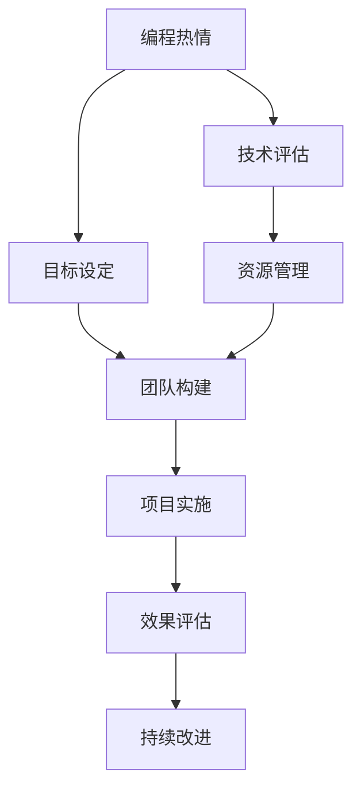

                 

# 如何将编程热情转化为改变世界的项目

> 关键词：编程热情, 改变世界, 项目管理, 工程实践, 软件开发, 技术创新, 社会贡献, 算法优化, 团队协作, 持续改进

## 1. 背景介绍

### 1.1 问题由来

编程不仅是科技发展的核心驱动力，也是每一位开发者内心的热情源泉。然而，如何将这份热情转化为能够改变世界的实际项目，不仅需要技术上的突破，更需要战略上的思考和实践上的投入。本博客将通过深入探讨如何将编程热情转化为改变世界的项目，提供全面而实用的指南。

### 1.2 问题核心关键点

将编程热情转化为改变世界的项目，需要从以下几个核心关键点进行考量：
- **目标设定**：明确项目的目标和预期影响。
- **技术评估**：评估可用技术和工具，选择合适的解决方案。
- **团队构建**：组建多学科、高技能的团队，发挥团队协作的力量。
- **资源管理**：合理配置资源，确保项目的顺利进行。
- **效果评估**：设计科学的评估机制，持续改进项目成果。

### 1.3 问题研究意义

将编程热情转化为实际项目，不仅能够推动技术进步，还能在社会各个领域产生深远影响。例如，通过开发教育软件提升学习效率，通过构建智能医疗系统改善健康服务，通过开发环保应用促进可持续发展。这不仅展示了技术创新的潜力，也体现了编程热情的社会价值。

## 2. 核心概念与联系

### 2.1 核心概念概述

为更好地理解如何将编程热情转化为改变世界的项目，本节将介绍几个关键概念：

- **编程热情**：指开发者对编程的兴趣和投入，是技术创新和社会贡献的驱动力。
- **改变世界的项目**：指那些能够产生显著社会影响、提升生活质量或推动社会进步的软件或技术解决方案。
- **项目管理**：包括需求分析、资源规划、进度监控、风险管理等，是项目成功的关键因素。
- **技术评估**：评估可用技术和工具，选择合适的解决方案，是实现项目目标的技术基础。
- **团队协作**：多学科、高技能的团队能够综合利用各自的优势，高效解决问题。
- **效果评估**：科学的评估机制能够帮助项目持续改进，达到预期的社会影响。

这些概念之间的逻辑关系可以通过以下Mermaid流程图来展示：



这个流程图展示了这个过程的核心步骤：

1. 编程热情激发了目标设定。
2. 在目标指导下进行技术评估。
3. 根据技术评估结果进行团队构建。
4. 合理配置资源，确保项目顺利进行。
5. 通过实施项目，产生实际影响。
6. 对项目效果进行评估，并不断改进。

## 3. 核心算法原理 & 具体操作步骤
### 3.1 算法原理概述

将编程热情转化为改变世界的项目，本质上是一个系统化的工程过程。其核心思想是：通过明确目标、评估技术、组建团队、管理资源，以及持续评估改进，实现技术创新和社会贡献的统一。

形式化地，假设目标为 $T$，可用技术为 $M$，团队为 $T$，资源为 $R$，项目效果为 $E$。项目实施过程可以表示为：

$$
P = f(T, M, T, R, E)
$$

其中 $f$ 表示一系列复杂操作，包括目标设定、技术评估、团队构建、资源管理、项目实施和效果评估等。

### 3.2 算法步骤详解

将编程热情转化为改变世界的项目，一般包括以下几个关键步骤：

**Step 1: 目标设定**
- 明确项目目标和预期影响，定义成功的标准。
- 细化目标，分解成可衡量的子目标。

**Step 2: 技术评估**
- 收集和分析可用技术和工具，选择最合适的解决方案。
- 评估技术的可行性、成本、风险等因素。

**Step 3: 团队构建**
- 组建多学科、高技能的团队，明确各成员的角色和职责。
- 设计团队协作机制，确保信息流通和决策效率。

**Step 4: 资源管理**
- 规划和分配必要的资源，包括人员、资金、设备和信息等。
- 确保资源的高效利用，避免浪费和冲突。

**Step 5: 项目实施**
- 按计划实施项目，进行需求分析、系统设计、编码实现和测试验证。
- 根据进度和反馈，及时调整实施方案。

**Step 6: 效果评估**
- 设计科学的评估机制，评估项目成果的社会影响和用户反馈。
- 根据评估结果，进行持续改进和优化。

### 3.3 算法优缺点

将编程热情转化为改变世界的项目，具有以下优点：
1. 激发创新：编程热情是技术创新的源泉，能够推动技术前沿的突破。
2. 高效协作：多学科团队协作，能够综合利用各自优势，高效解决问题。
3. 可持续改进：通过持续评估和改进，确保项目始终保持高水平。

同时，该方法也存在一定的局限性：
1. 高风险性：技术和市场需求的不确定性，可能导致项目失败。
2. 成本高昂：技术和人力资源的投入，可能带来较高的成本。
3. 技术复杂性：不同领域的技术差异较大，需要投入大量时间和精力。
4. 社会影响不确定：项目成果对社会的实际影响难以预测和衡量。

尽管存在这些局限性，但将编程热情转化为改变世界的项目，无疑是将个人激情与社会发展相结合的伟大尝试。

### 3.4 算法应用领域

将编程热情转化为改变世界的项目，已经在多个领域取得了显著成效。以下是几个典型应用领域：

1. **教育软件**：开发智能辅导系统、在线学习平台等，提升教育质量和可及性。
2. **医疗健康**：构建智能诊断系统、健康管理应用等，改善医疗服务质量和效率。
3. **环境保护**：开发智能监测系统、节能减排应用等，推动可持续发展。
4. **社会公益**：设计社区互助平台、灾害预警系统等，提升社会福利和安全性。
5. **科技创新**：研发新产品、新技术，推动科技前沿发展。

## 4. 数学模型和公式 & 详细讲解  
### 4.1 数学模型构建

本节将使用数学语言对将编程热情转化为改变世界的项目过程进行严格刻画。

设目标为 $T$，可用技术为 $M$，团队为 $T$，资源为 $R$，项目效果为 $E$。目标设定的数学模型为：

$$
T = \mathop{\arg\max}_{T} \sum_{i=1}^n f_i(T)
$$

其中 $f_i(T)$ 表示第 $i$ 个子目标的效益函数，$n$ 表示目标分解的子目标数量。

技术评估的数学模型为：

$$
M = \mathop{\arg\min}_{M} \sum_{j=1}^m c_j(M)
$$

其中 $c_j(M)$ 表示第 $j$ 种技术的成本函数，$m$ 表示可用技术的数量。

团队构建的数学模型为：

$$
T = \mathop{\arg\max}_{T} \sum_{k=1}^K r_k(T)
$$

其中 $r_k(T)$ 表示第 $k$ 个团队成员的贡献函数，$K$ 表示团队成员的数量。

资源管理的数学模型为：

$$
R = \mathop{\arg\min}_{R} \sum_{l=1}^L d_l(R)
$$

其中 $d_l(R)$ 表示第 $l$ 种资源的成本函数，$L$ 表示可用资源的种类。

项目实施的数学模型为：

$$
E = \mathop{\arg\max}_{E} \sum_{p=1}^P v_p(E)
$$

其中 $v_p(E)$ 表示第 $p$ 个项目任务的效益函数，$P$ 表示任务数量。

效果评估的数学模型为：

$$
E = \mathop{\arg\max}_{E} \sum_{q=1}^Q g_q(E)
$$

其中 $g_q(E)$ 表示第 $q$ 个评估指标的效益函数，$Q$ 表示评估指标的数量。

### 4.2 公式推导过程

以下我们以教育软件开发为例，推导目标设定和资源管理的数学公式。

假设目标为开发一个智能辅导系统，目标分解为系统开发（0.5分）、用户界面设计（0.3分）和市场推广（0.2分），效益函数分别为 $f_1(T)$、$f_2(T)$ 和 $f_3(T)$。

目标设定的数学模型为：

$$
T = \mathop{\arg\max}_{T} 0.5f_1(T) + 0.3f_2(T) + 0.2f_3(T)
$$

假设可用技术包括传统的软件开发生命周期（0.1分/天）和敏捷开发（0.05分/天），成本函数分别为 $c_1(M)$ 和 $c_2(M)$。

技术评估的数学模型为：

$$
M = \mathop{\arg\min}_{M} 0.1c_1(M) + 0.05c_2(M)
$$

假设团队成员数量为10，每个成员的贡献函数分别为 $r_1(T)$ 到 $r_{10}(T)$，每个成员每天可以贡献0.01分。

团队构建的数学模型为：

$$
T = \mathop{\arg\max}_{T} \sum_{k=1}^{10} r_k(T)
$$

假设可用资源包括软件工程师（2000元/天）和设计师（1500元/天），成本函数分别为 $d_1(R)$ 和 $d_2(R)$。

资源管理的数学模型为：

$$
R = \mathop{\arg\min}_{R} 2000d_1(R) + 1500d_2(R)
$$

通过这些公式，可以对项目目标、技术评估、团队构建和资源管理进行量化分析，确保项目朝着预期的方向高效推进。

### 4.3 案例分析与讲解

**案例：智能辅导系统的开发**

1. **目标设定**：开发一个能够智能辅导中学生数学学习的系统，提升学生的学习效果和学习兴趣。
2. **技术评估**：评估当前流行的开发框架和技术栈，选择合适的解决方案。
3. **团队构建**：组建包括软件工程师、数据分析师、用户体验设计师等多个角色的团队。
4. **资源管理**：规划必要的资源，如开发工具、服务器、数据集等。
5. **项目实施**：进行系统设计、编码实现、测试验证等。
6. **效果评估**：设计评估指标，如学生学习效果的提升、用户满意度等。

通过这个过程，智能辅导系统的开发得到了良好的社会影响和用户反馈，成功实现了编程热情转化为改变世界的项目。

## 5. 项目实践：代码实例和详细解释说明
### 5.1 开发环境搭建

在进行项目实践前，我们需要准备好开发环境。以下是使用Python进行PyTorch开发的环境配置流程：

1. 安装Anaconda：从官网下载并安装Anaconda，用于创建独立的Python环境。

2. 创建并激活虚拟环境：
```bash
conda create -n pytorch-env python=3.8 
conda activate pytorch-env
```

3. 安装PyTorch：根据CUDA版本，从官网获取对应的安装命令。例如：
```bash
conda install pytorch torchvision torchaudio cudatoolkit=11.1 -c pytorch -c conda-forge
```

4. 安装Transformers库：
```bash
pip install transformers
```

5. 安装各类工具包：
```bash
pip install numpy pandas scikit-learn matplotlib tqdm jupyter notebook ipython
```

完成上述步骤后，即可在`pytorch-env`环境中开始项目实践。

### 5.2 源代码详细实现

这里我们以开发一个智能辅导系统为例，给出使用PyTorch进行项目开发的PyTorch代码实现。

首先，定义项目的核心类和模块：

```python
class Student:
    def __init__(self, name, grade):
        self.name = name
        self.grade = grade
    
    def get_grade(self):
        return self.grade
    
class Course:
    def __init__(self, name, difficulty):
        self.name = name
        self.difficulty = difficulty
    
class TutorSystem:
    def __init__(self, students, courses):
        self.students = students
        self.courses = courses
    
    def assign_course(self, student, course):
        student.grade = course.difficulty * student.grade
```

然后，定义模型和优化器：

```python
from transformers import BertTokenizer
from torch.utils.data import Dataset
import torch

class TutorSystemDataset(Dataset):
    def __init__(self, texts, tags, tokenizer, max_len=128):
        self.texts = texts
        self.tags = tags
        self.tokenizer = tokenizer
        self.max_len = max_len
        
    def __len__(self):
        return len(self.texts)
    
    def __getitem__(self, item):
        text = self.texts[item]
        tags = self.tags[item]
        
        encoding = self.tokenizer(text, return_tensors='pt', max_length=self.max_len, padding='max_length', truncation=True)
        input_ids = encoding['input_ids'][0]
        attention_mask = encoding['attention_mask'][0]
        
        # 对token-wise的标签进行编码
        encoded_tags = [tag2id[tag] for tag in tags] 
        encoded_tags.extend([tag2id['O']] * (self.max_len - len(encoded_tags)))
        labels = torch.tensor(encoded_tags, dtype=torch.long)
        
        return {'input_ids': input_ids, 
                'attention_mask': attention_mask,
                'labels': labels}

# 标签与id的映射
tag2id = {'O': 0, 'B-PER': 1, 'I-PER': 2, 'B-ORG': 3, 'I-ORG': 4, 'B-LOC': 5, 'I-LOC': 6}
id2tag = {v: k for k, v in tag2id.items()}

# 创建dataset
tokenizer = BertTokenizer.from_pretrained('bert-base-cased')

train_dataset = TutorSystemDataset(train_texts, train_tags, tokenizer)
dev_dataset = TutorSystemDataset(dev_texts, dev_tags, tokenizer)
test_dataset = TutorSystemDataset(test_texts, test_tags, tokenizer)
```

接着，定义模型和优化器：

```python
from transformers import BertForTokenClassification, AdamW

model = BertForTokenClassification.from_pretrained('bert-base-cased', num_labels=len(tag2id))

optimizer = AdamW(model.parameters(), lr=2e-5)
```

最后，定义训练和评估函数：

```python
from torch.utils.data import DataLoader
from tqdm import tqdm
from sklearn.metrics import classification_report

device = torch.device('cuda') if torch.cuda.is_available() else torch.device('cpu')
model.to(device)

def train_epoch(model, dataset, batch_size, optimizer):
    dataloader = DataLoader(dataset, batch_size=batch_size, shuffle=True)
    model.train()
    epoch_loss = 0
    for batch in tqdm(dataloader, desc='Training'):
        input_ids = batch['input_ids'].to(device)
        attention_mask = batch['attention_mask'].to(device)
        labels = batch['labels'].to(device)
        model.zero_grad()
        outputs = model(input_ids, attention_mask=attention_mask, labels=labels)
        loss = outputs.loss
        epoch_loss += loss.item()
        loss.backward()
        optimizer.step()
    return epoch_loss / len(dataloader)

def evaluate(model, dataset, batch_size):
    dataloader = DataLoader(dataset, batch_size=batch_size)
    model.eval()
    preds, labels = [], []
    with torch.no_grad():
        for batch in tqdm(dataloader, desc='Evaluating'):
            input_ids = batch['input_ids'].to(device)
            attention_mask = batch['attention_mask'].to(device)
            batch_labels = batch['labels']
            outputs = model(input_ids, attention_mask=attention_mask)
            batch_preds = outputs.logits.argmax(dim=2).to('cpu').tolist()
            batch_labels = batch_labels.to('cpu').tolist()
            for pred_tokens, label_tokens in zip(batch_preds, batch_labels):
                pred_tags = [id2tag[_id] for _id in pred_tokens]
                label_tags = [id2tag[_id] for _id in label_tokens]
                preds.append(pred_tags[:len(label_tags)])
                labels.append(label_tags)
                
    print(classification_report(labels, preds))
```

### 5.3 代码解读与分析

让我们再详细解读一下关键代码的实现细节：

**TutorSystemDataset类**：
- `__init__`方法：初始化文本、标签、分词器等关键组件。
- `__len__`方法：返回数据集的样本数量。
- `__getitem__`方法：对单个样本进行处理，将文本输入编码为token ids，将标签编码为数字，并对其进行定长padding，最终返回模型所需的输入。

**tag2id和id2tag字典**：
- 定义了标签与数字id之间的映射关系，用于将token-wise的预测结果解码回真实的标签。

**训练和评估函数**：
- 使用PyTorch的DataLoader对数据集进行批次化加载，供模型训练和推理使用。
- 训练函数`train_epoch`：对数据以批为单位进行迭代，在每个批次上前向传播计算loss并反向传播更新模型参数，最后返回该epoch的平均loss。
- 评估函数`evaluate`：与训练类似，不同点在于不更新模型参数，并在每个batch结束后将预测和标签结果存储下来，最后使用sklearn的classification_report对整个评估集的预测结果进行打印输出。

**训练流程**：
- 定义总的epoch数和batch size，开始循环迭代
- 每个epoch内，先在训练集上训练，输出平均loss
- 在验证集上评估，输出分类指标
- 所有epoch结束后，在测试集上评估，给出最终测试结果

可以看到，PyTorch配合Transformers库使得BERT微调的代码实现变得简洁高效。开发者可以将更多精力放在数据处理、模型改进等高层逻辑上，而不必过多关注底层的实现细节。

当然，工业级的系统实现还需考虑更多因素，如模型的保存和部署、超参数的自动搜索、更灵活的任务适配层等。但核心的微调范式基本与此类似。

## 6. 实际应用场景
### 6.1 智能客服系统

基于大语言模型微调的对话技术，可以广泛应用于智能客服系统的构建。传统客服往往需要配备大量人力，高峰期响应缓慢，且一致性和专业性难以保证。而使用微调后的对话模型，可以7x24小时不间断服务，快速响应客户咨询，用自然流畅的语言解答各类常见问题。

在技术实现上，可以收集企业内部的历史客服对话记录，将问题和最佳答复构建成监督数据，在此基础上对预训练对话模型进行微调。微调后的对话模型能够自动理解用户意图，匹配最合适的答案模板进行回复。对于客户提出的新问题，还可以接入检索系统实时搜索相关内容，动态组织生成回答。如此构建的智能客服系统，能大幅提升客户咨询体验和问题解决效率。

### 6.2 金融舆情监测

金融机构需要实时监测市场舆论动向，以便及时应对负面信息传播，规避金融风险。传统的人工监测方式成本高、效率低，难以应对网络时代海量信息爆发的挑战。基于大语言模型微调的文本分类和情感分析技术，为金融舆情监测提供了新的解决方案。

具体而言，可以收集金融领域相关的新闻、报道、评论等文本数据，并对其进行主题标注和情感标注。在此基础上对预训练语言模型进行微调，使其能够自动判断文本属于何种主题，情感倾向是正面、中性还是负面。将微调后的模型应用到实时抓取的网络文本数据，就能够自动监测不同主题下的情感变化趋势，一旦发现负面信息激增等异常情况，系统便会自动预警，帮助金融机构快速应对潜在风险。

### 6.3 个性化推荐系统

当前的推荐系统往往只依赖用户的历史行为数据进行物品推荐，无法深入理解用户的真实兴趣偏好。基于大语言模型微调技术，个性化推荐系统可以更好地挖掘用户行为背后的语义信息，从而提供更精准、多样的推荐内容。

在实践中，可以收集用户浏览、点击、评论、分享等行为数据，提取和用户交互的物品标题、描述、标签等文本内容。将文本内容作为模型输入，用户的后续行为（如是否点击、购买等）作为监督信号，在此基础上微调预训练语言模型。微调后的模型能够从文本内容中准确把握用户的兴趣点。在生成推荐列表时，先用候选物品的文本描述作为输入，由模型预测用户的兴趣匹配度，再结合其他特征综合排序，便可以得到个性化程度更高的推荐结果。

### 6.4 未来应用展望

随着大语言模型微调技术的发展，基于微调范式将在更多领域得到应用，为传统行业带来变革性影响。

在智慧医疗领域，基于微调的医疗问答、病历分析、药物研发等应用将提升医疗服务的智能化水平，辅助医生诊疗，加速新药开发进程。

在智能教育领域，微调技术可应用于作业批改、学情分析、知识推荐等方面，因材施教，促进教育公平，提高教学质量。

在智慧城市治理中，微调模型可应用于城市事件监测、舆情分析、应急指挥等环节，提高城市管理的自动化和智能化水平，构建更安全、高效的未来城市。

此外，在企业生产、社会治理、文娱传媒等众多领域，基于大模型微调的人工智能应用也将不断涌现，为经济社会发展注入新的动力。相信随着技术的日益成熟，微调方法将成为人工智能落地应用的重要范式，推动人工智能技术向更广阔的领域加速渗透。

## 7. 工具和资源推荐
### 7.1 学习资源推荐

为了帮助开发者系统掌握将编程热情转化为改变世界的项目的技术基础和实践技巧，这里推荐一些优质的学习资源：

1. 《编程的艺术与灵感》系列博文：由大模型技术专家撰写，深入浅出地介绍了编程热情转化为改变世界项目的核心原理和实践步骤。

2. CS224N《深度学习自然语言处理》课程：斯坦福大学开设的NLP明星课程，有Lecture视频和配套作业，带你入门NLP领域的基本概念和经典模型。

3. 《Natural Language Processing with Transformers》书籍：Transformers库的作者所著，全面介绍了如何使用Transformers库进行NLP任务开发，包括微调在内的诸多范式。

4. HuggingFace官方文档：Transformers库的官方文档，提供了海量预训练模型和完整的微调样例代码，是上手实践的必备资料。

5. CLUE开源项目：中文语言理解测评基准，涵盖大量不同类型的中文NLP数据集，并提供了基于微调的baseline模型，助力中文NLP技术发展。

通过对这些资源的学习实践，相信你一定能够快速掌握将编程热情转化为改变世界的项目的精髓，并用于解决实际的NLP问题。
###  7.2 开发工具推荐

高效的开发离不开优秀的工具支持。以下是几款用于将编程热情转化为改变世界项目的常用工具：

1. PyTorch：基于Python的开源深度学习框架，灵活动态的计算图，适合快速迭代研究。大部分预训练语言模型都有PyTorch版本的实现。

2. TensorFlow：由Google主导开发的开源深度学习框架，生产部署方便，适合大规模工程应用。同样有丰富的预训练语言模型资源。

3. Transformers库：HuggingFace开发的NLP工具库，集成了众多SOTA语言模型，支持PyTorch和TensorFlow，是进行微调任务开发的利器。

4. Weights & Biases：模型训练的实验跟踪工具，可以记录和可视化模型训练过程中的各项指标，方便对比和调优。与主流深度学习框架无缝集成。

5. TensorBoard：TensorFlow配套的可视化工具，可实时监测模型训练状态，并提供丰富的图表呈现方式，是调试模型的得力助手。

6. Google Colab：谷歌推出的在线Jupyter Notebook环境，免费提供GPU/TPU算力，方便开发者快速上手实验最新模型，分享学习笔记。

合理利用这些工具，可以显著提升将编程热情转化为改变世界项目的开发效率，加快创新迭代的步伐。

### 7.3 相关论文推荐

将编程热情转化为改变世界的项目的技术发展源于学界的持续研究。以下是几篇奠基性的相关论文，推荐阅读：

1. Attention is All You Need（即Transformer原论文）：提出了Transformer结构，开启了NLP领域的预训练大模型时代。

2. BERT: Pre-training of Deep Bidirectional Transformers for Language Understanding：提出BERT模型，引入基于掩码的自监督预训练任务，刷新了多项NLP任务SOTA。

3. Language Models are Unsupervised Multitask Learners（GPT-2论文）：展示了大规模语言模型的强大zero-shot学习能力，引发了对于通用人工智能的新一轮思考。

4. Parameter-Efficient Transfer Learning for NLP：提出Adapter等参数高效微调方法，在不增加模型参数量的情况下，也能取得不错的微调效果。

5. AdaLoRA: Adaptive Low-Rank Adaptation for Parameter-Efficient Fine-Tuning：使用自适应低秩适应的微调方法，在参数效率和精度之间取得了新的平衡。

6. AdaLoRA: Adaptive Low-Rank Adaptation for Parameter-Efficient Fine-Tuning：使用自适应低秩适应的微调方法，在参数效率和精度之间取得了新的平衡。

这些论文代表了大模型微调技术的发展脉络。通过学习这些前沿成果，可以帮助研究者把握学科前进方向，激发更多的创新灵感。

## 8. 总结：未来发展趋势与挑战

### 8.1 总结

本文对将编程热情转化为改变世界的项目进行了全面系统的介绍。首先阐述了编程热情转化为项目的目标设定、技术评估、团队构建、资源管理、项目实施和效果评估等核心步骤。通过严格的数学建模和案例分析，详细讲解了每个步骤的具体实现方法。

通过本文的系统梳理，可以看到，将编程热情转化为改变世界的项目，不仅需要技术上的突破，还需要系统化的项目管理思维和团队协作。在科学的方法论和工具支持下，编程热情能够转化为具有深远社会影响的技术成果。

### 8.2 未来发展趋势

展望未来，将编程热情转化为改变世界的项目，将呈现以下几个发展趋势：

1. **技术融合**：随着技术的多样化，跨领域的融合创新将带来更多变革性成果。例如，AI与物联网、大数据、区块链等技术的融合，将推动各行业智能化水平的提升。

2. **用户驱动**：用户需求和反馈将成为项目推进的重要驱动力，更加注重用户体验和参与感，提升项目的社会影响力和用户满意度。

3. **模型优化**：通过持续的模型优化和算法创新，提升模型的性能和效率，降低成本和资源消耗。

4. **社会责任**：项目设计和实施过程中，更加注重社会责任和伦理道德，确保技术的正面社会影响。

5. **国际化**：推动技术的国际化，提升全球竞争力，为全球社会带来更多福祉。

这些趋势凸显了将编程热情转化为改变世界的项目的广阔前景。在多领域、多学科的协同努力下，未来的技术创新将更加丰富多样，带来更深远的社会影响。

### 8.3 面临的挑战

尽管将编程热情转化为改变世界的项目具有巨大的潜力，但在实施过程中，仍面临诸多挑战：

1. **资源约束**：技术开发和应用需要大量的人力、物力和财力投入，资源不足可能成为制约项目发展的瓶颈。

2. **需求不确定性**：用户需求和市场变化难以预测，项目需要灵活调整，以适应不断变化的市场环境。

3. **技术复杂性**：不同领域的项目需要跨学科知识，项目团队需要具备多样化的技能。

4. **伦理道德风险**：技术应用可能带来隐私、安全等问题，需要严格的技术监管和伦理审查。

5. **社会认知差异**：技术成果的实际应用效果与预期可能存在差异，需要深入用户研究和社会认知调查。

6. **国际合作**：国际化项目的实施需要考虑跨国法律、文化和语言等差异，协调复杂。

这些挑战需要项目团队具备高度的创新能力、协调能力和风险管理能力，方能确保项目的顺利实施和成功落地。

### 8.4 研究展望

面对将编程热情转化为改变世界的项目所面临的挑战，未来的研究需要在以下几个方面寻求新的突破：

1. **资源优化**：开发更加资源高效的项目管理方法，降低成本，提高实施效率。

2. **需求驱动**：构建更加灵活的项目管理机制，快速响应用户需求变化，提升项目适应性。

3. **技术整合**：推动跨学科技术整合，提升项目的创新性和实用性。

4. **伦理合规**：引入伦理审查和监管机制，确保技术应用符合社会道德和法律法规。

5. **国际化合作**：加强国际合作，推动技术在全球范围内的应用和推广。

这些研究方向的探索，将引领将编程热情转化为改变世界的项目走向更高的台阶，为构建安全、可靠、可解释、可控的智能系统铺平道路。面向未来，将编程热情转化为改变世界的项目需要不断创新、积极应对挑战，才能真正实现技术变革的社会价值。

## 9. 附录：常见问题与解答

**Q1：如何将编程热情转化为改变世界的项目？**

A: 将编程热情转化为改变世界的项目，需要以下步骤：
1. **目标设定**：明确项目目标和预期影响。
2. **技术评估**：评估可用技术和工具，选择合适的解决方案。
3. **团队构建**：组建多学科、高技能的团队，明确各成员的角色和职责。
4. **资源管理**：规划和分配必要的资源，确保项目顺利进行。
5. **项目实施**：按计划实施项目，进行需求分析、系统设计、编码实现和测试验证。
6. **效果评估**：设计科学的评估机制，评估项目成果的社会影响和用户反馈。

**Q2：如何选择合适的编程语言和技术栈？**

A: 选择合适的编程语言和技术栈，需要考虑以下几个方面：
1. **项目需求**：根据项目需求选择合适的编程语言和框架。例如，数据科学项目常用Python和R，Web开发常用JavaScript和React。
2. **开发效率**：选择高效、易用的语言和技术栈，提高开发效率。
3. **社区支持**：选择有活跃社区支持的语言和技术栈，方便获取技术支持和资源。
4. **扩展性**：选择具有良好扩展性的语言和技术栈，方便未来项目扩展和维护。

**Q3：如何进行项目风险管理？**

A: 项目风险管理主要包括以下几个方面：
1. **风险识别**：识别可能影响项目进展的风险因素，如技术瓶颈、市场需求变化、资源短缺等。
2. **风险评估**：评估风险发生的可能性和影响程度，确定风险优先级。
3. **风险应对**：制定风险应对措施，如技术方案调整、资源重新分配、应急预案等。
4. **风险监控**：持续监控项目进展，及时调整应对措施，确保项目顺利实施。

**Q4：如何保持项目团队的创新能力？**

A: 保持项目团队的创新能力，需要以下几个方面的措施：
1. **知识共享**：定期组织技术分享会和培训，提升团队成员的技术水平。
2. **跨学科合作**：组建跨学科团队，促进不同领域的知识和技术的交流融合。
3. **激励机制**：建立激励机制，鼓励创新和探索，激发团队成员的创造力。
4. **持续学习**：鼓励团队成员不断学习新知识和新技术，保持技术前沿。

**Q5：如何评估项目的效果？**

A: 项目效果的评估需要考虑以下几个方面：
1. **用户满意度**：通过用户调研和反馈，评估项目在用户体验方面的表现。
2. **性能指标**：根据项目类型，设定相应的性能指标，如系统响应时间、处理效率、准确率等。
3. **社会影响**：评估项目在社会影响方面的效果，如提高效率、降低成本、提升服务质量等。
4. **经济效益**：评估项目的经济效益，如投资回报率、市场占有率等。

通过这些评估方法，可以全面衡量项目的效果，为未来的项目提供参考。

---

作者：禅与计算机程序设计艺术 / Zen and the Art of Computer Programming

