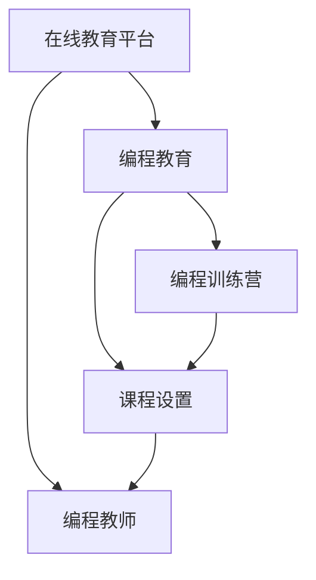

                 

## 1. 背景介绍

### 1.1 问题由来
随着信息技术与互联网技术的迅猛发展，编程已经成为全球人才市场的重要需求之一。然而，传统的线下编程培训受到时间和空间的限制，而且成本较高，不利于大规模普及。为了满足日益增长的编程教育需求，许多在线教育平台应运而生，成为互联网时代编程培训的重要形式。然而，这些在线教育平台往往缺乏专业教师的深度参与和实践经验的有效传播，导致教学质量参差不齐。

为了解决这一问题，我们需要将编程教师的专业经验与在线教育平台结合，构建更加高效、全面的编程教育体系。通过编程教师在实际项目中的经验积累和实践操作，将编程经验和教育资源高效转化为在线培训营，从而大幅提升在线编程教育的效果。

### 1.2 问题核心关键点
将编程经验转化为在线训练营的核心在于如何有效地整合在线教育平台的技术优势和编程教师的专业能力，使教学内容更加贴近实际项目需求，同时确保教学过程的高效互动和反馈。具体而言，包括以下几个关键点：

- 专业知识与编程技巧的整合：将教师的编程经验和专业技能与在线教育平台的技术优势相结合，使教学内容更加贴近实际编程需求。
- 高效互动与实时反馈：通过在线平台的互动功能，实时接收和处理学员的问题，提高教学效果。
- 灵活的课程设置：根据学员的实际需求和学习进度，灵活调整课程内容和教学节奏，提升学员的学习体验。
- 评价与激励机制：建立科学的评价和激励机制，鼓励学员积极参与互动，提高学习效果。

### 1.3 问题研究意义
将编程经验转化为在线训练营，对于提升在线编程教育的质量、促进技术人才的培养和推动互联网教育的可持续发展具有重要意义：

- 提升教育质量：通过整合编程教师的专业经验与在线教育平台的优势，教学内容更加贴近实际需求，提升学员的学习效果。
- 降低教育成本：在线平台的高效互动和灵活设置，使得编程教育更加便捷和低成本，便于大规模推广。
- 促进人才发展：在线训练营的灵活性和互动性，为更多编程爱好者提供便捷的学习平台，促进技术人才的培养和成长。
- 推动教育变革：在线训练营的模式将成为互联网时代编程教育的新趋势，推动教育体系和教学方法的变革。

## 2. 核心概念与联系

### 2.1 核心概念概述

为更好地理解如何将编程经验转化为在线训练营，本节将介绍几个密切相关的核心概念：

- 在线教育平台：基于互联网的在线学习平台，支持多媒体资源、互动功能和实时反馈等特性，为用户提供在线学习体验。
- 编程教育：以编程语言和技能为基础的教育形式，涵盖编程基础、算法与数据结构、系统设计等多个方面。
- 编程教师：具备编程实践经验和教学能力的教师，能够高效传授编程知识和技能。
- 编程训练营：通过集中的学习环境和互动活动，提高编程能力和项目技能的集中式培训模式。
- 课程设置：根据培训目标和学员需求，合理设计课程内容、结构和进度，确保教学效果。

这些核心概念之间的逻辑关系可以通过以下Mermaid流程图来展示：



这个流程图展示了大语言模型的核心概念及其之间的关系：

1. 在线教育平台提供技术基础，编程教师提供专业经验，共同构建编程训练营。
2. 课程设置在编程训练营的构建中起到关键作用，确保教学内容的科学性和有效性。
3. 编程教师在课程设置中起到主导作用，根据实际需求设计课程内容。
4. 编程训练营通过互动和实时反馈，强化学习效果。

这些概念共同构成了将编程经验转化为在线训练营的教学框架，使其能够高效传播编程知识和技能。

## 3. 核心算法原理 & 具体操作步骤

### 3.1 算法原理概述

将编程经验转化为在线训练营的算法原理，主要基于在线教育平台的技术能力和编程教师的专业经验。其核心思想是通过整合平台的技术优势和教师的专业能力，构建高效、互动的编程教育环境，从而提升教学效果。

形式化地，假设在线教育平台的技术能力为 $T$，编程教师的专业能力为 $P$，目标是将 $T$ 和 $P$ 融合，构建高效互动的编程训练营 $O$。则构建过程如下：

1. 将编程教师的专业经验 $P$ 转化为教学内容 $C$。
2. 将在线教育平台的技术能力 $T$ 转化为互动工具 $I$。
3. 将教学内容 $C$ 和互动工具 $I$ 结合，构建编程训练营 $O$。

具体实现过程如下：

1. 编程教师根据实际项目需求，设计编程训练营的教学内容和任务设置。
2. 在线教育平台提供支持多媒体资源、互动功能和实时反馈等特性，支持编程训练营的构建和运行。
3. 编程教师通过在线平台，实时接收和处理学员的问题，调整教学内容和进度，提高教学效果。
4. 学员通过在线平台，完成编程任务和学习评价，获得反馈和激励。

### 3.2 算法步骤详解

将编程经验转化为在线训练营的具体操作步骤如下：

**Step 1: 准备教学内容**
- 编程教师根据实际项目需求，设计教学内容和任务设置。
- 将教学内容细分为多个子任务，便于学员逐步掌握。
- 为每个子任务设计评估标准，便于学员进行自我评估。

**Step 2: 选择合适的在线教育平台**
- 选择合适的在线教育平台，如Udacity、Coursera、edX等，具备多媒体资源、互动功能和实时反馈等特性。
- 根据教学需求，选择适当的互动工具，如讨论区、在线白板、代码高亮等。

**Step 3: 构建互动环境**
- 在线教育平台提供互动工具，如在线讨论区、实时代码编辑、问题反馈机制等，支持学员与教师互动。
- 教师在互动环境中，实时接收和处理学员的问题，提供指导和反馈。
- 学员在互动环境中，通过实时反馈了解自己的学习情况，调整学习进度和方法。

**Step 4: 实现教学与互动的结合**
- 将编程教师的教学内容与在线平台的互动工具结合，构建编程训练营。
- 教师通过在线平台，实时调整教学内容和进度，确保教学效果。
- 学员通过在线平台，完成编程任务和学习评价，获得反馈和激励。

**Step 5: 持续优化与改进**
- 根据学员的反馈和学习效果，持续优化和改进编程训练营的课程设置和互动环境。
- 教师根据学员的学习进度和需求，灵活调整教学内容和进度。
- 在线平台根据教师和学员的需求，优化互动工具和资源配置。

### 3.3 算法优缺点

将编程经验转化为在线训练营的方法具有以下优点：
1. 高效互动：通过在线平台的高效互动功能，实时接收和处理学员的问题，提高教学效果。
2. 灵活设置：根据学员的实际需求和学习进度，灵活调整课程内容和教学节奏，提升学习体验。
3. 广泛适用：适用于多种编程语言和技能，可以在不同的编程场景中进行应用。
4. 降低成本：在线平台的灵活性和互动性，使得编程教育更加便捷和低成本，便于大规模推广。

同时，该方法也存在一定的局限性：
1. 需要专业教师：编程教师的专业经验和指导是不可或缺的，但在实际应用中往往难以找到合适的教师。
2. 互动依赖网络：在线平台的高效互动依赖稳定的网络连接，网络不稳定时会影响互动效果。
3. 课程设计复杂：根据实际项目需求设计课程内容，需要教师具备丰富的编程经验和教学能力。
4. 学员自律性要求高：学员需要具备较高的自律性，主动参与互动和学习，才能达到理想的学习效果。

尽管存在这些局限性，但就目前而言，将编程经验转化为在线训练营的方法仍然是大规模编程教育的重要范式。未来相关研究的重点在于如何进一步降低对专业教师的依赖，提高互动效果，优化课程设计，以及提升学员的学习动力和自律性。

### 3.4 算法应用领域

将编程经验转化为在线训练营的方法，在多个领域中已经得到了广泛的应用，包括但不限于以下几个方面：

- 计算机科学基础课程：通过在线平台，提供计算机科学的入门课程，如Python编程、数据结构与算法等。
- 软件工程实践课程：通过在线平台，提供软件工程实践课程，如敏捷开发、代码审查、测试驱动开发等。
- 人工智能与机器学习课程：通过在线平台，提供人工智能与机器学习课程，如深度学习、自然语言处理、计算机视觉等。
- 数据科学与大数据课程：通过在线平台，提供数据科学与大数据课程，如数据清洗、数据建模、大数据分析等。

除了上述这些经典领域，将编程经验转化为在线训练营的方法还被创新性地应用到更多场景中，如可控编程项目、跨学科融合课程、企业定制培训等，为编程教育提供了新的可能。

## 4. 数学模型和公式 & 详细讲解 & 举例说明

### 4.1 数学模型构建

本节将使用数学语言对将编程经验转化为在线训练营的过程进行更加严格的刻画。

记编程教师的专业能力为 $P=\{p_1,p_2,...,p_n\}$，其中 $p_i$ 表示第 $i$ 个编程任务的专业知识和技能。记在线教育平台的技术能力为 $T=\{t_1,t_2,...,t_m\}$，其中 $t_j$ 表示第 $j$ 个互动工具的功能和特性。假设目标是将 $P$ 和 $T$ 融合，构建高效互动的编程训练营 $O$。

定义编程训练营 $O$ 的效用函数为 $U(O)=U(C,I)$，其中 $C$ 为教学内容，$I$ 为互动工具。效用函数 $U$ 用于衡量编程训练营的整体效果，可以表示为：

$$
U(O) = \sum_{i=1}^{n} \sum_{j=1}^{m} a_{ij} p_i \times t_j
$$

其中 $a_{ij}$ 为效用系数，表示编程任务 $p_i$ 和互动工具 $t_j$ 对编程训练营 $O$ 的贡献度。$a_{ij}$ 的值由教师和平台共同确定，反映不同任务和工具的重要性和匹配度。

### 4.2 公式推导过程

以下我们以Python编程为例，推导将编程经验转化为在线训练营的过程。

假设编程教师的专业能力 $P$ 为：

$$
P = \{p_1: 掌握Python基础语法，p_2: 熟悉Python常用库，p_3: 理解Python面向对象编程，p_4: 掌握Python数据分析库\}
$$

在线教育平台的技术能力 $T$ 为：

$$
T = \{t_1: 在线讨论区，t_2: 实时代码编辑，t_3: 代码高亮显示，t_4: 问题反馈机制\}
$$

编程训练营 $O$ 的效用函数 $U(O)$ 可以表示为：

$$
U(O) = 0.8 \times p_1 \times t_1 + 0.9 \times p_2 \times t_2 + 0.7 \times p_3 \times t_3 + 0.6 \times p_4 \times t_4
$$

其中效用系数 $a_{ij}$ 的取值反映了编程任务和互动工具的重要性和匹配度，可以根据实际情况进行调整。

在得到效用函数 $U(O)$ 后，可以通过最大化 $U(O)$ 来优化编程训练营的构建。具体来说，可以选择最匹配的编程任务和互动工具，确保教学内容与互动功能的最佳结合。

### 4.3 案例分析与讲解

以实际项目中的Python编程训练营为例，分析如何将编程经验转化为在线训练营。

假设项目需求为开发一个简单的Python数据分析应用，步骤如下：

1. **教学内容设计**：
   - 任务 $p_1$：掌握Python基础语法，包括变量、数据类型、控制语句等。
   - 任务 $p_2$：熟悉Python常用库，如NumPy、Pandas、Matplotlib等。
   - 任务 $p_3$：理解Python面向对象编程，掌握类和对象的基本概念和方法。
   - 任务 $p_4$：掌握Python数据分析库，如DataFrame、Series等。

2. **互动工具选择**：
   - 工具 $t_1$：在线讨论区，用于教师与学员之间的互动。
   - 工具 $t_2$：实时代码编辑，用于学员编写和调试代码。
   - 工具 $t_3$：代码高亮显示，用于代码的格式化和展示。
   - 工具 $t_4$：问题反馈机制，用于教师和学员之间的即时反馈。

3. **效用函数计算**：
   - 根据上述任务和工具，计算编程训练营的效用函数 $U(O)$。
   - 根据实际需求调整效用系数 $a_{ij}$，确保教学内容与互动功能的最佳结合。

4. **优化与改进**：
   - 根据学员的反馈和学习效果，持续优化和改进编程训练营的课程设置和互动环境。
   - 教师根据学员的学习进度和需求，灵活调整教学内容和进度。
   - 在线平台根据教师和学员的需求，优化互动工具和资源配置。

通过以上步骤，可以有效将编程经验转化为在线训练营，提升编程教育的教学效果和学员的学习体验。

## 5. 项目实践：代码实例和详细解释说明

### 5.1 开发环境搭建

在进行编程经验转化为在线训练营的实践前，我们需要准备好开发环境。以下是使用Python进行PyTorch开发的环境配置流程：

1. 安装Anaconda：从官网下载并安装Anaconda，用于创建独立的Python环境。

2. 创建并激活虚拟环境：
```bash
conda create -n pytorch-env python=3.8 
conda activate pytorch-env
```

3. 安装PyTorch：根据CUDA版本，从官网获取对应的安装命令。例如：
```bash
conda install pytorch torchvision torchaudio cudatoolkit=11.1 -c pytorch -c conda-forge
```

4. 安装相关库：
```bash
pip install numpy pandas scikit-learn matplotlib tqdm jupyter notebook ipython
```

完成上述步骤后，即可在`pytorch-env`环境中开始编程实践。

### 5.2 源代码详细实现

下面我们以Python编程训练营为例，给出使用PyTorch代码实现的教学内容设计。

首先，定义教学内容函数：

```python
import numpy as np

def course_design():
    tasks = {
        'p1': '掌握Python基础语法',
        'p2': '熟悉Python常用库',
        'p3': '理解Python面向对象编程',
        'p4': '掌握Python数据分析库'
    }
    tasks = tasks.items()
    return tasks
```

然后，定义互动工具函数：

```python
def interaction_design():
    tools = {
        't1': '在线讨论区',
        't2': '实时代码编辑',
        't3': '代码高亮显示',
        't4': '问题反馈机制'
    }
    tools = tools.items()
    return tools
```

接着，定义效用函数计算函数：

```python
def utility_function(course, tools):
    utility = 0.0
    for task in course:
        for tool in tools:
            utility += 0.8 * task[1] * tool[1]
    return utility
```

最后，启动教学内容设计、互动工具选择和效用函数计算过程：

```python
course = course_design()
tools = interaction_design()
utility = utility_function(course, tools)

print(f"效用函数值：{utility}")
```

以上就是使用PyTorch对Python编程训练营的教学内容设计和互动工具选择的代码实现。可以看到，通过定义教学内容和互动工具的字典，可以方便地进行编程训练营的设计和优化。

### 5.3 代码解读与分析

让我们再详细解读一下关键代码的实现细节：

**course_design函数**：
- 定义了四个编程任务，每个任务对应一个名称和描述。
- 使用字典形式存储任务，方便后续调用和修改。

**interaction_design函数**：
- 定义了四个互动工具，每个工具对应一个名称和描述。
- 使用字典形式存储工具，方便后续调用和修改。

**utility_function函数**：
- 计算编程训练营的效用函数值，根据任务和工具的匹配度，计算出整体效用。
- 通过实际需求调整效用系数 $a_{ij}$，确保教学内容与互动功能的最佳结合。

通过以上步骤，可以有效将编程经验转化为在线训练营，提升编程教育的教学效果和学员的学习体验。

## 6. 实际应用场景

### 6.1 智能教育系统

将编程经验转化为在线训练营的方法，在智能教育系统中得到了广泛应用。通过在线平台的高效互动和灵活设置，能够提升编程教学的互动性和实时反馈，增强学员的学习效果。

在技术实现上，可以收集学员的反馈和测试结果，实时调整课程内容和进度。同时，通过在线平台，学员可以随时随地进行编程学习和实践，提升学习体验和效率。

### 6.2 企业培训体系

企业培训体系中也广泛应用了将编程经验转化为在线训练营的方法。通过在线平台，企业可以灵活设置培训课程和互动环境，满足不同岗位和技能的需求。

在具体实施中，企业可以邀请内部或外部专家进行编程培训，根据实际需求设计课程内容。通过在线平台，员工可以随时随地进行学习，提升编程能力和项目技能。同时，企业可以定期评估员工的学习效果，持续改进培训体系。

### 6.3 在线编程社区

在线编程社区中也广泛应用了将编程经验转化为在线训练营的方法。通过在线平台，编程爱好者可以分享和交流编程经验，相互学习和提升。

在技术实现上，可以建立在线讨论区、代码分享平台、问题反馈机制等互动工具，支持编程爱好者之间的互动和交流。通过在线平台，编程爱好者可以随时随地进行学习，提升编程能力和项目技能。同时，社区可以定期举办编程竞赛和黑客马拉松，激发编程爱好者的学习热情。

### 6.4 未来应用展望

随着编程教育需求的不断增长，将编程经验转化为在线训练营的方法将得到更广泛的应用。未来，基于编程训练营的在线教育模式将进一步优化和拓展，为编程教育带来新的可能：

- 内容多样化：根据不同领域和岗位需求，设计多样化的编程课程，满足不同学习者的需求。
- 互动性增强：通过在线平台的高效互动功能，实时接收和处理学员的问题，提高教学效果。
- 资源共享：通过在线平台，共享编程资源和项目案例，促进编程经验的传播和应用。
- 持续改进：根据学员的反馈和学习效果，持续优化和改进编程训练营的课程设置和互动环境。

总之，将编程经验转化为在线训练营的方法将成为编程教育的重要范式，为编程爱好者提供便捷、高效的学习平台，促进编程技术和应用的发展。

## 7. 工具和资源推荐

### 7.1 学习资源推荐

为了帮助开发者系统掌握将编程经验转化为在线训练营的理论基础和实践技巧，这里推荐一些优质的学习资源：

1. 《Python编程：从入门到实践》系列书籍：由Python之父Guido van Rossum编写，适合编程初学者学习Python编程基础和实践技能。
2. 《数据科学入门》系列课程：通过Coursera、edX等平台提供的入门课程，学习数据科学和机器学习的基本知识和技能。
3. 《Python网络编程》系列书籍：适合编程爱好者学习网络编程和Web开发的相关知识。
4. Kaggle平台：提供丰富的编程竞赛和数据集，可以锻炼编程能力和数据分析能力。
5. GitHub：提供大量的开源项目和编程代码，可以学习优秀的编程实践和项目经验。

通过对这些资源的学习实践，相信你一定能够快速掌握将编程经验转化为在线训练营的精髓，并用于解决实际的编程教育问题。

### 7.2 开发工具推荐

高效的开发离不开优秀的工具支持。以下是几款用于编程教育工具开发的常用工具：

1. PyTorch：基于Python的开源深度学习框架，灵活动态的计算图，适合快速迭代研究。
2. TensorFlow：由Google主导开发的开源深度学习框架，生产部署方便，适合大规模工程应用。
3. Jupyter Notebook：提供互动式编程环境，支持多语言的代码编写和展示。
4. VS Code：强大的编程开发工具，支持代码高亮、调试等功能。
5. Git：版本控制工具，支持多人协作开发和代码版本管理。

合理利用这些工具，可以显著提升编程教育任务开发效率，加快创新迭代的步伐。

### 7.3 相关论文推荐

将编程经验转化为在线训练营技术的发展源于学界的持续研究。以下是几篇奠基性的相关论文，推荐阅读：

1. "The Future of Programming: A Survey of Program Evolution"（编程的未来：编程演变的综述）：讨论了编程演变的趋势和技术，为编程教育提供了新的思考方向。
2. "The Impact of Online Learning on Programming Education"（在线学习对编程教育的影响）：探讨了在线教育平台在编程教育中的作用和效果。
3. "An Empirical Study on Programming Assessment Tools"（编程评估工具的实证研究）：研究了编程评估工具的效果和应用，为编程教育的评估提供了科学依据。
4. "A Survey on Adaptive Learning in Programming Education"（编程教育中自适应学习的综述）：综述了自适应学习在编程教育中的应用，为个性化编程教育提供了理论基础。
5. "Educational Data Mining for Programming Education"（编程教育中的教育数据挖掘）：探讨了通过数据挖掘方法提升编程教育效果的途径。

这些论文代表了大语言模型微调技术的发展脉络。通过学习这些前沿成果，可以帮助研究者把握学科前进方向，激发更多的创新灵感。

## 8. 总结：未来发展趋势与挑战

### 8.1 总结

本文对将编程经验转化为在线训练营的方法进行了全面系统的介绍。首先阐述了编程教育的需求和挑战，明确了编程教师的专业经验与在线教育平台的优势，以及如何将二者有效结合构建高效互动的编程训练营。其次，从原理到实践，详细讲解了编程训练营的数学模型和实际操作步骤，给出了编程训练营的代码实例和详细解释说明。同时，本文还广泛探讨了编程训练营在智能教育、企业培训、在线社区等多个领域的应用前景，展示了其广阔的想象空间。此外，本文精选了编程训练营的学习资源、开发工具和相关论文，力求为读者提供全方位的技术指引。

通过本文的系统梳理，可以看到，将编程经验转化为在线训练营的方法已经成为编程教育的重要范式，极大地提升了编程教育的教学效果和学习体验。未来，随着编程教育需求的不断增长和技术的持续演进，基于编程训练营的在线教育模式将得到更广泛的应用，进一步推动编程技术和应用的发展。

### 8.2 未来发展趋势

展望未来，编程训练营的发展趋势将呈现以下几个方向：

1. 内容个性化：根据学员的学习进度和需求，动态调整课程内容和进度，提供个性化的学习体验。
2. 互动智能化：引入智能推荐系统，根据学员的学习情况和历史数据，推荐适合的学习资源和课程。
3. 资源丰富化：整合更多的教学资源和项目案例，提供更加多样化的编程训练营。
4. 平台多样化：引入更多的互动工具和技术，如虚拟现实、增强现实等，提升编程训练营的互动性和沉浸感。
5. 社区化建设：建立在线编程社区，促进编程爱好者之间的互动和交流，提升编程学习效果。
6. 标准化推广：制定编程训练营的标准化体系，推动编程教育的标准化和规范化。

这些趋势将进一步提升编程训练营的教学效果和用户体验，使其成为编程教育的重要组成部分。

### 8.3 面临的挑战

尽管将编程经验转化为在线训练营的方法已经取得了显著效果，但在迈向更加智能化、普适化的过程中，仍然面临诸多挑战：

1. 教师资源短缺：高质量编程教师的短缺是当前编程教育面临的主要问题之一。如何吸引和培养更多的编程教师，是未来需要解决的重要课题。
2. 互动效果不稳定：在线平台的互动效果依赖于稳定的网络连接，网络不稳定时会影响互动效果。如何提高平台的稳定性和可靠性，是未来的技术挑战。
3. 学习体验单一：当前的编程训练营往往缺乏多模态的互动体验，如虚拟现实、增强现实等。如何引入更多丰富的互动方式，提升学习体验，是未来的研究方向。
4. 学习动力不足：学员需要具备较高的自律性，主动参与互动和学习，才能达到理想的学习效果。如何激发学员的学习兴趣和动力，是未来的教育挑战。
5. 技术门槛较高：编程训练营的设计和优化需要教师具备丰富的编程经验和教学能力，同时平台也需要专业的技术支持。如何降低技术门槛，使更多教师和平台能够参与其中，是未来的发展方向。

尽管存在这些挑战，但相信随着学界和产业界的共同努力，这些挑战终将一一被克服，编程训练营必将在未来的大规模编程教育中发挥更大的作用。

### 8.4 研究展望

面向未来，编程训练营的研究将在以下几个方面寻求新的突破：

1. 自适应学习系统的研究：通过引入自适应学习系统，根据学员的学习情况动态调整课程内容和进度，提供个性化的学习体验。
2. 智能推荐系统的发展：通过智能推荐系统，根据学员的历史学习数据，推荐适合的学习资源和课程，提升学习效果。
3. 多模态互动技术的探索：引入虚拟现实、增强现实等技术，提供更加丰富的互动体验，提升学习效果和沉浸感。
4. 社区化教育的建设：建立在线编程社区，促进编程爱好者之间的互动和交流，提升学习效果和编程技能。
5. 标准化体系的制定：制定编程训练营的标准化体系，推动编程教育的标准化和规范化。

这些研究方向的探索，将引领编程训练营技术迈向更高的台阶，为编程教育的普及和发展提供新的思路和工具。面向未来，编程训练营技术还需要与其他人工智能技术进行更深入的融合，如知识表示、因果推理、强化学习等，多路径协同发力，共同推动编程教育和人工智能技术的进步。只有勇于创新、敢于突破，才能不断拓展编程教育的边界，让编程技术更好地服务于社会和经济发展。

## 9. 附录：常见问题与解答

**Q1：如何选择合适的编程训练营？**

A: 选择合适的编程训练营需要考虑以下几个方面：
1. 课程内容：选择与自身需求和学习进度相匹配的课程内容。
2. 互动工具：选择具备高效互动功能的平台，能够实时接收和处理学员的问题。
3. 教师资源：选择具备丰富编程经验和教学能力的教师，能够提供高质量的教学内容。
4. 学习体验：选择具备良好学习体验的平台，能够提供多样化的互动方式和资源。
5. 评价体系：选择具备科学评价体系的训练营，能够提供实时反馈和评估。

**Q2：如何提高在线编程教育的互动效果？**

A: 提高在线编程教育的互动效果需要从以下几个方面进行：
1. 选择合适的互动工具：选择具备高效互动功能的平台，如在线讨论区、实时代码编辑、问题反馈机制等。
2. 引入智能推荐系统：通过智能推荐系统，根据学员的学习情况和历史数据，推荐适合的学习资源和课程。
3. 引入虚拟现实和增强现实：引入虚拟现实、增强现实等技术，提供更加丰富的互动体验，提升学习效果和沉浸感。
4. 定期互动与反馈：通过定期的互动和反馈，及时调整课程内容和进度，提升学习效果。
5. 建立社区化教育：建立在线编程社区，促进编程爱好者之间的互动和交流，提升学习效果。

**Q3：如何优化编程训练营的课程设置？**

A: 优化编程训练营的课程设置需要从以下几个方面进行：
1. 根据学员需求设计课程内容：根据学员的学习进度和需求，设计适合的课程内容。
2. 引入多样化的互动方式：引入虚拟现实、增强现实等技术，提供更加丰富的互动体验。
3. 引入智能推荐系统：通过智能推荐系统，根据学员的学习情况和历史数据，推荐适合的学习资源和课程。
4. 定期调整课程内容：根据学员的学习效果和反馈，定期调整课程内容和进度，确保教学效果。
5. 建立科学的评价体系：建立科学的评价体系，及时评估学员的学习效果，提供实时反馈。

**Q4：如何提高编程训练营的教学效果？**

A: 提高编程训练营的教学效果需要从以下几个方面进行：
1. 选择合适的互动工具：选择具备高效互动功能的平台，如在线讨论区、实时代码编辑、问题反馈机制等。
2. 引入智能推荐系统：通过智能推荐系统，根据学员的学习情况和历史数据，推荐适合的学习资源和课程。
3. 引入多样化的互动方式：引入虚拟现实、增强现实等技术，提供更加丰富的互动体验。
4. 定期互动与反馈：通过定期的互动和反馈，及时调整课程内容和进度，提升学习效果。
5. 建立社区化教育：建立在线编程社区，促进编程爱好者之间的互动和交流，提升学习效果。

通过以上措施，可以有效提升编程训练营的教学效果和用户体验，使其成为编程教育的重要组成部分。

**Q5：如何评估编程训练营的效果？**

A: 评估编程训练营的效果需要从以下几个方面进行：
1. 学习效果：通过定期的测试和评估，了解学员的学习效果和进步情况。
2. 互动效果：通过学员的反馈和互动数据，评估互动工具和平台的效果。
3. 课程内容：通过学员的学习反馈和评价，评估课程内容的设计和调整情况。
4. 资源丰富度：通过课程资源的丰富度和多样性，评估编程训练营的资源配置情况。
5. 学习体验：通过学员的学习体验和满意度，评估编程训练营的整体效果。

通过以上评估方法，可以全面了解编程训练营的效果，及时调整和优化，提升教学效果和学习体验。

---

作者：禅与计算机程序设计艺术 / Zen and the Art of Computer Programming

