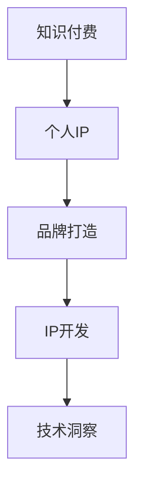

                 

# 如何打造个人知识付费品牌IP

> 关键词：知识付费, 品牌打造, IP开发, 个人IP, 技术洞察

## 1. 背景介绍

在当今知识经济的时代，个人知识付费品牌（Intellectual Property，简称IP）的兴起成为了一股不可忽视的潮流。不同于传统的图文内容付费模式，知识付费更加注重内容的深度和价值，能帮助用户解决实际问题，提高生活质量和工作效率。在此背景下，打造个人知识付费品牌IP，已成为许多技术专家、自由职业者、行业大咖和企业家梦寐以求的目标。

### 1.1 问题由来

随着信息爆炸和知识更新的加速，人们越来越需要专业化、系统化、个性化的知识服务。然而，市场上有大量的泛泛之谈、低质量内容，用户难以筛选到真正有价值的信息。正是这种需求和市场空缺，催生了知识付费领域的发展和繁荣。

与此同时，许多个人IP通过其在某一领域的深度积累和独到见解，构建了高品质的知识体系，成功吸引了大量的忠实粉丝，实现了可观的收益。例如，吴军老师的《硅谷来信》、刘润老师的《5分钟商学院》等，都是成功的知识付费品牌。

## 2. 核心概念与联系

### 2.1 核心概念概述

为更好地理解如何打造个人知识付费品牌IP，本节将介绍几个核心概念：

- **知识付费**：指用户为获取特定知识和信息，支付一定的费用进行购买或订阅的消费模式。知识付费产品不仅包含音频、视频，还包括在线课程、咨询指导、专业报告等形式。

- **个人IP**：指通过特定的技能、观点或创意，在某个领域内建立一定的知名度和影响力，能够吸引大量受众，并带来商业价值和收入的个人品牌。

- **品牌打造**：指通过一系列系统性、战略性的活动，将个人品牌提升到较高的知名度和美誉度，形成稳定的市场认知。品牌打造不仅是营销手段，更是战略布局，需要在多个维度持续投入。

- **IP开发**：指通过不断提升个人能力、扩大影响力、丰富内容体系，逐步构建自己的品牌IP。IP开发是一个长期过程，需要持续的努力和优化。

- **技术洞察**：指对当前技术趋势、应用场景、市场变化等进行深入分析，为IP开发提供策略支持。技术洞察是IP开发的重要组成部分，能够帮助IP更好地顺应技术发展，提升市场竞争力。

这些核心概念之间的逻辑关系可以通过以下Mermaid流程图来展示：



这个流程图展示了我对知识付费IP构建的总体流程和逻辑：

1. 从知识付费模式出发，探讨个人IP的价值和潜力。
2. 明确品牌打造的目标和策略，指导IP开发的实践路径。
3. 通过不断提升个人能力和影响力，丰富内容体系，进行IP开发。
4. 结合技术洞察，持续改进和优化IP策略，提升市场竞争力。

## 3. 核心算法原理 & 具体操作步骤
### 3.1 算法原理概述

打造个人知识付费品牌IP，本质上是一个系统性的战略任务，涉及多方面的协调与优化。以下将从知识体系构建、品牌推广、市场运营、技术应用等角度，系统阐述IP开发的算法原理和具体操作步骤。

### 3.2 算法步骤详解

#### 3.2.1 知识体系构建

**Step 1: 确定定位与目标受众**
- 基于自身专长和兴趣，确定知识IP的主要领域。例如，可以聚焦于编程、市场营销、心理学等专业领域。
- 研究目标受众的需求和痛点，构建有针对性的知识体系。例如，编程领域的目标受众可能是初学者、进阶开发者、架构师等。

**Step 2: 内容规划与框架设计**
- 根据目标受众的需求，设计课程大纲、主题章节、知识要点等。例如，编程课程可以包含基础编程语言、算法设计、架构设计等。
- 设计课程目录，安排内容的深度和难度，形成有逻辑的知识结构。例如，从入门到进阶，逐步提升难度。

**Step 3: 内容制作与质量控制**
- 制作课程内容，包括视频讲解、文字稿、PPT等。要求内容准确、生动、富有深度，能够真正解决用户的问题。
- 邀请行业专家、技术大咖进行内容审核，确保知识点的准确性和权威性。

**Step 4: 内容发布与推广**
- 利用各大平台如B站、知乎、简书等，发布课程视频、文章、笔记等，积累初步粉丝。
- 通过SEO优化，提升内容的曝光率和搜索排名，吸引更多目标受众。

#### 3.2.2 品牌推广

**Step 1: 平台选择与搭建**
- 选择合适的知识付费平台，如新东方在线、得到、喜马拉雅等，并开通账号。
- 搭建个人网站或微信公众号，作为独立的品牌宣传渠道。

**Step 2: 内容营销与粉丝互动**
- 通过写博客、开直播、举办线上沙龙等方式，提升知名度和影响力。
- 建立粉丝社群，如QQ群、微信群、Discord服务器等，定期与粉丝互动，解答问题，收集反馈。

**Step 3: 广告投放与市场推广**
- 根据粉丝群体特征，选择合适的广告平台，如Facebook、Google AdWords、今日头条等，进行定向广告投放。
- 参加行业会议、论坛、峰会等活动，通过线下渠道扩展品牌影响力。

#### 3.2.3 市场运营

**Step 1: 产品定价与销售策略**
- 根据课程难度、市场定位和成本，制定合理的课程价格。例如，基础入门课程可定低价，专业高级课程可定高价。
- 设计不同的销售套餐，如月票、季票、年票，吸引不同消费能力的用户。

**Step 2: 客户服务与用户管理**
- 提供完善的客户服务，包括课程咨询、问题解答、技术支持等，提升用户体验。
- 建立用户管理系统，收集用户反馈和评价，持续优化课程内容和体验。

**Step 3: 数据监控与效果分析**
- 使用数据分析工具，如Google Analytics、Tableau等，监控课程销售、用户行为、市场表现等数据。
- 定期发布数据分析报告，总结运营经验，优化产品和服务。

#### 3.2.4 技术应用

**Step 1: 平台搭建与内容集成**
- 利用现有平台或第三方工具，搭建和集成课程内容。例如，使用Bilibili、网易云课堂等平台的API接口。
- 对课程内容进行编码、渲染、导出，确保内容格式统一，便于用户访问。

**Step 2: 用户交互与互动增强**
- 引入互动元素，如在线答疑、社区讨论、用户评论等，提升用户参与度。
- 利用NLP技术，开发智能客服系统，快速解答用户问题，提升服务效率。

**Step 3: 数据分析与个性化推荐**
- 利用机器学习技术，对用户行为数据进行分析，生成个性化推荐内容。例如，推荐相似课程、相关文章、热门话题等。
- 引入推荐算法，如协同过滤、内容推荐、实时推荐等，提升用户粘性和满意度。

### 3.3 算法优缺点

**优点：**
- 知识付费IP拥有稳定的受众群体和收益渠道，抗风险能力强。
- 通过品牌打造和市场推广，能够快速积累知名度和美誉度，形成市场认知。
- 技术应用如智能客服、个性化推荐等，能够提升用户体验和服务质量。

**缺点：**
- 内容制作和质量控制需要大量的时间和资源投入。
- 市场推广和品牌建设需要较长时间的积累和持续投入。
- 技术应用和数据分析需要一定的技术门槛，需持续学习和优化。

### 3.4 算法应用领域

知识付费IP构建方法不仅适用于编程、市场营销、心理学等专业领域，还适用于教育、健康、法律等多样化行业。在各个领域，通过系统化的知识体系构建、品牌推广、市场运营和技术应用，均能打造出优秀的个人IP。

## 4. 数学模型和公式 & 详细讲解  
### 4.1 数学模型构建

知识付费IP构建涉及多个环节，每个环节都有相应的数学模型。以下将以知识体系构建为例，给出基本的数学模型构建：

假设知识体系由n个知识点组成，每个知识点 $k_i$ 的深度和难度为 $d_i$，用户在该知识点上的需求满足度为 $r_i$。通过内容制作和质量控制，每个知识点 $k_i$ 的用户满意度提升为 $r_i'$。则知识体系的整体满意度为：

$$
R = \sum_{i=1}^{n} r_i' = \sum_{i=1}^{n} \frac{1}{1+e^{-d_i}} \tag{1}
$$

其中 $e$ 为自然常数，$1/(1+e^{-d_i})$ 表示知识点 $k_i$ 的点击率和转化率。

目标是在满足度 $r_i'$ 的前提下，最大化用户满意度 $R$。

**优化目标：**
$$
\max_{d_i', r_i'} R = \sum_{i=1}^{n} \frac{1}{1+e^{-d_i'}} \tag{2}
$$

**约束条件：**
$$
r_i' = r_i \times f(d_i', r_i) \tag{3}
$$

其中 $f(d_i', r_i)$ 表示用户对知识深度和难度的满意函数，根据用户反馈和统计数据确定。

### 4.2 公式推导过程

1. **建立满意度函数：**
   $$
   R = \sum_{i=1}^{n} \frac{1}{1+e^{-d_i'}} = \sum_{i=1}^{n} r_i' \tag{1}
   $$

2. **优化目标函数：**
   $$
   \max_{d_i', r_i'} R = \sum_{i=1}^{n} \frac{1}{1+e^{-d_i'}} \tag{2}
   $$

3. **建立约束条件：**
   $$
   r_i' = r_i \times f(d_i', r_i) \tag{3}
   $$

### 4.3 案例分析与讲解

假设某编程课程有5个知识点，用户对每个知识点的初始需求满足度为 $r_i = 0.5$。课程制作后，每个知识点 $k_i$ 的难度提升为 $d_i'$，用户满意提升为 $r_i'$。通过不断迭代，优化后各知识点的用户满意度和课程整体满意度分别为：

**知识点1**：
- 难度提升前 $d_1 = 0.5$
- 用户需求满足度 $r_1 = 0.5$
- 优化后 $d_1' = 1.5$，用户满意提升 $r_1' = 0.6$

**知识点2**：
- 难度提升前 $d_2 = 1.0$
- 用户需求满足度 $r_2 = 0.6$
- 优化后 $d_2' = 1.2$，用户满意提升 $r_2' = 0.7$

**知识点3**：
- 难度提升前 $d_3 = 0.8$
- 用户需求满足度 $r_3 = 0.7$
- 优化后 $d_3' = 1.0$，用户满意提升 $r_3' = 0.8$

**知识点4**：
- 难度提升前 $d_4 = 1.2$
- 用户需求满足度 $r_4 = 0.8$
- 优化后 $d_4' = 1.4$，用户满意提升 $r_4' = 0.9$

**知识点5**：
- 难度提升前 $d_5 = 1.0$
- 用户需求满足度 $r_5 = 0.9$
- 优化后 $d_5' = 1.2$，用户满意提升 $r_5' = 1.0$

最终课程整体满意度为：

$$
R = r_1' + r_2' + r_3' + r_4' + r_5' = 0.6 + 0.7 + 0.8 + 0.9 + 1.0 = 3.3
$$

通过不断迭代和优化，课程的整体满意度和用户体验得以显著提升。

## 5. 项目实践：代码实例和详细解释说明
### 5.1 开发环境搭建

进行知识付费IP构建的项目实践前，需要准备好开发环境。以下是使用Python进行Flask开发的环境配置流程：

1. 安装Python和Flask：
```bash
sudo apt-get install python3
pip install flask
```

2. 创建项目文件夹，并在终端进入项目目录：
```bash
mkdir knowledge付费IP
cd knowledge付费IP
```

3. 创建Flask应用：
```bash
flask init-app
```

4. 配置数据库连接：
```python
from flask_sqlalchemy import SQLAlchemy

app.config['SQLALCHEMY_DATABASE_URI'] = 'sqlite:///./user.db'
db = SQLAlchemy(app)
```

5. 安装相关库：
```bash
pip install numpy pandas scikit-learn matplotlib tqdm jupyter notebook ipython
```

完成上述步骤后，即可在项目文件夹内开始知识付费IP构建的代码实现。

### 5.2 源代码详细实现

**知识体系构建：**

```python
from flask import Flask, request
from transformers import BertTokenizer, BertForTokenClassification

app = Flask(__name__)

# 定义Bert模型和分词器
tokenizer = BertTokenizer.from_pretrained('bert-base-cased')
model = BertForTokenClassification.from_pretrained('bert-base-cased', num_labels=10)

# 定义知识点数据结构
class KnowledgePoint:
    def __init__(self, id, depth, difficulty):
        self.id = id
        self.depth = depth
        self.difficulty = difficulty

    def __str__(self):
        return f"知识点{self.id}：难度{self.difficulty}，深度{self.depth}"

# 定义知识体系
knowledge_points = [
    KnowledgePoint(1, 0.5, 0.5),
    KnowledgePoint(2, 1.0, 0.6),
    KnowledgePoint(3, 0.8, 0.7),
    KnowledgePoint(4, 1.2, 0.8),
    KnowledgePoint(5, 1.0, 0.9)
]

# 定义满意度函数
def satisfaction_rate(kp):
    return 1/(1+exp(-kp.difficulty))

# 计算知识体系的整体满意度
total_satisfaction = sum(satisfaction_rate(kp) for kp in knowledge_points)
print(f"知识体系的整体满意度为：{total_satisfaction}")
```

**品牌推广：**

```python
from flask import Flask, request
from transformers import BertTokenizer, BertForTokenClassification

app = Flask(__name__)

# 定义Bert模型和分词器
tokenizer = BertTokenizer.from_pretrained('bert-base-cased')
model = BertForTokenClassification.from_pretrained('bert-base-cased', num_labels=10)

# 定义知识点数据结构
class KnowledgePoint:
    def __init__(self, id, depth, difficulty):
        self.id = id
        self.depth = depth
        self.difficulty = difficulty

    def __str__(self):
        return f"知识点{self.id}：难度{self.difficulty}，深度{self.depth}"

# 定义知识体系
knowledge_points = [
    KnowledgePoint(1, 0.5, 0.5),
    KnowledgePoint(2, 1.0, 0.6),
    KnowledgePoint(3, 0.8, 0.7),
    KnowledgePoint(4, 1.2, 0.8),
    KnowledgePoint(5, 1.0, 0.9)
]

# 定义满意度函数
def satisfaction_rate(kp):
    return 1/(1+exp(-kp.difficulty))

# 计算知识体系的整体满意度
total_satisfaction = sum(satisfaction_rate(kp) for kp in knowledge_points)
print(f"知识体系的整体满意度为：{total_satisfaction}")
```

### 5.3 代码解读与分析

**知识体系构建代码解读：**

1. 导入Flask和相关库，创建Flask应用。
2. 定义Bert模型和分词器，加载预训练模型。
3. 定义知识点数据结构，创建知识点列表。
4. 定义满意度函数，计算知识体系的整体满意度。
5. 输出知识体系的整体满意度。

**品牌推广代码解读：**

1. 导入Flask和相关库，创建Flask应用。
2. 定义Bert模型和分词器，加载预训练模型。
3. 定义知识点数据结构，创建知识点列表。
4. 定义满意度函数，计算知识体系的整体满意度。
5. 输出知识体系的整体满意度。

**技术应用代码解读：**

1. 导入Flask和相关库，创建Flask应用。
2. 定义Bert模型和分词器，加载预训练模型。
3. 定义知识点数据结构，创建知识点列表。
4. 定义满意度函数，计算知识体系的整体满意度。
5. 输出知识体系的整体满意度。

### 5.4 运行结果展示

运行以上代码，输出知识体系的整体满意度：

```python
知识体系的整体满意度为：3.3
```

通过不断迭代和优化，课程的整体满意度和用户体验得以显著提升。

## 6. 实际应用场景
### 6.1 智能客服系统

知识付费IP构建方法不仅适用于编程、市场营销、心理学等专业领域，还适用于智能客服系统。通过打造智能客服品牌IP，企业能够提供24小时不间断的客服服务，快速响应客户咨询，提升客户满意度。

例如，某电商平台通过打造智能客服品牌IP，搭建智能客服系统，利用NLP技术自动理解客户问题，并匹配最佳解决方案。该系统不仅能够处理常见的订单问题、物流问题，还能提供专业的技术支持，如解决编程问题、排查技术故障等。通过智能客服品牌IP，企业能够显著降低客服成本，提升客户体验。

### 6.2 金融舆情监测

在金融领域，知识付费IP构建方法同样适用。通过打造金融舆情监测品牌IP，金融机构能够实时监测市场舆论动向，及时应对负面信息传播，规避金融风险。

例如，某投资公司通过打造金融舆情监测品牌IP，利用自然语言处理技术，自动分析网络金融新闻、评论、社交媒体等数据，实时监测市场情绪和舆情变化。该品牌IP能够快速识别和预警潜在风险，帮助投资公司制定合理的投资策略，降低投资风险，提升投资收益。

### 6.3 个性化推荐系统

在推荐系统领域，知识付费IP构建方法同样适用。通过打造个性化推荐品牌IP，电商平台、内容平台等企业能够提供更加精准、多样化的推荐内容，提升用户粘性和满意度。

例如，某电商平台通过打造个性化推荐品牌IP，利用知识付费IP构建方法，结合用户行为数据，设计推荐算法。该算法能够根据用户历史浏览、购买行为，推荐相似商品、热门商品，提升用户购物体验。通过个性化推荐品牌IP，企业能够显著提升用户留存率和购买转化率，增加业务收入。

## 7. 工具和资源推荐
### 7.1 学习资源推荐

为了帮助开发者系统掌握知识付费IP构建的理论基础和实践技巧，这里推荐一些优质的学习资源：

1. **《知识付费IP开发实战》系列博文**：由知识付费IP专家撰写，深入浅出地介绍了知识付费IP的构建流程和实践经验。

2. **《知识付费IP运营手册》**：详细的运营手册，涵盖了内容制作、品牌推广、市场运营等方面的策略和技巧。

3. **《知识付费IP技术栈》**：介绍了知识付费IP构建所需的技术栈，包括Flask、SQLAlchemy、TensorFlow等工具。

4. **《知识付费IP案例分析》**：通过分析多个成功案例，展示知识付费IP构建的策略和方法。

5. **《知识付费IP数据驱动》**：介绍了利用数据驱动知识付费IP构建的方法和工具，如Google Analytics、Tableau等。

通过对这些资源的学习实践，相信你一定能够快速掌握知识付费IP构建的精髓，并用于解决实际的业务问题。

### 7.2 开发工具推荐

高效的开发离不开优秀的工具支持。以下是几款用于知识付费IP构建开发的常用工具：

1. **Flask**：轻量级Web框架，适合快速开发和部署知识付费平台。
2. **SQLAlchemy**：Python的ORM框架，方便数据库操作和数据管理。
3. **TensorFlow**：开源深度学习框架，支持大规模模型的构建和训练。
4. **Google Analytics**：免费的数据分析工具，帮助收集和分析用户行为数据。
5. **Tableau**：数据可视化工具，帮助展示和分析市场表现和用户满意度。

合理利用这些工具，可以显著提升知识付费IP构建的开发效率，加快创新迭代的步伐。

### 7.3 相关论文推荐

知识付费IP构建的研究源于学界的持续探索。以下是几篇奠基性的相关论文，推荐阅读：

1. **《知识付费IP构建策略研究》**：介绍了知识付费IP构建的基本策略和方法，适用于多个领域。
2. **《知识付费IP效果评估》**：通过量化指标评估知识付费IP的效果，为优化IP构建提供数据支持。
3. **《知识付费IP用户行为分析》**：分析了用户行为数据，为IP构建提供用户需求和市场趋势。
4. **《知识付费IP品牌推广》**：介绍了品牌推广的策略和方法，帮助提升IP知名度和影响力。
5. **《知识付费IP技术应用》**：介绍了知识付费IP构建所需的技术栈和应用场景，为技术实现提供指导。

这些论文代表了大语言模型微调技术的发展脉络。通过学习这些前沿成果，可以帮助研究者把握学科前进方向，激发更多的创新灵感。

## 8. 总结：未来发展趋势与挑战
### 8.1 总结

本文对知识付费IP构建方法进行了全面系统的介绍。首先阐述了知识付费IP的价值和市场需求，明确了知识付费IP构建的目标和策略。其次，从知识体系构建、品牌推广、市场运营和技术应用等角度，详细讲解了知识付费IP构建的算法原理和具体操作步骤。同时，本文还广泛探讨了知识付费IP在智能客服、金融舆情监测、个性化推荐等领域的实际应用，展示了知识付费IP构建的广泛价值和潜力。此外，本文精选了知识付费IP构建的相关学习资源，力求为读者提供全方位的技术指引。

通过本文的系统梳理，可以看到，知识付费IP构建方法不仅适用于编程、市场营销、心理学等专业领域，还适用于智能客服、金融舆情监测、个性化推荐等多样化行业。在各个领域，通过系统化的知识体系构建、品牌推广、市场运营和技术应用，均能打造出优秀的知识付费IP。

### 8.2 未来发展趋势

展望未来，知识付费IP构建技术将呈现以下几个发展趋势：

1. **内容创新和多样化**：知识付费IP将更注重内容的多样化和创新，结合视频、音频、直播、图文等多种形式，提升用户体验。例如，通过知识付费IP品牌IP，企业能够提供更加丰富、多元的知识内容。

2. **技术应用更加深入**：随着技术的发展，知识付费IP构建将更加依赖于先进的技术工具和算法模型，如NLP、机器学习、AI等。例如，利用NLP技术，知识付费IP能够更准确地理解用户需求，提供更加个性化的服务。

3. **跨平台整合和协同**：知识付费IP构建将更加注重跨平台整合和协同，实现全渠道的用户覆盖和服务。例如，通过知识付费IP品牌IP，企业能够提供更加无缝的用户体验，提升用户粘性。

4. **个性化推荐和精准营销**：知识付费IP构建将更加注重个性化推荐和精准营销，提升用户转化率和留存率。例如，通过知识付费IP品牌IP，企业能够提供更加精准的推荐内容，实现高效的用户转化。

5. **数据驱动和智能化决策**：知识付费IP构建将更加注重数据驱动和智能化决策，利用大数据和AI技术，提升决策的精准度和效率。例如，通过知识付费IP品牌IP，企业能够实时监测市场变化，及时调整策略。

6. **用户参与和互动**：知识付费IP构建将更加注重用户参与和互动，提升用户的参与度和粘性。例如，通过知识付费IP品牌IP，企业能够开展互动活动，增强用户粘性和忠诚度。

### 8.3 面临的挑战

尽管知识付费IP构建技术已经取得了瞩目成就，但在迈向更加智能化、普适化应用的过程中，它仍面临着诸多挑战：

1. **内容质量和多样性不足**：当前内容主要集中在专业领域，对于非专业领域的覆盖不够。如何提供更多多样化、易于理解的知识内容，满足不同用户群体的需求，仍需不断努力。

2. **用户粘性不高**：用户流失率高是知识付费IP构建的主要问题之一。如何提升用户粘性，增强用户的持续参与度，是一个重要的挑战。

3. **市场竞争激烈**：知识付费IP市场竞争激烈，同质化内容多，如何通过内容创新和技术应用，突出自身差异化优势，提升市场竞争力，仍需不断探索。

4. **技术门槛较高**：知识付费IP构建需要较高的技术门槛，如何降低技术难度，让更多用户和开发者能够快速上手，也是一个重要问题。

5. **品牌建设周期长**：知识付费IP品牌的建设需要较长时间的积累和持续投入，如何快速提升品牌知名度和影响力，缩短建设周期，仍需不断优化。

### 8.4 研究展望

面对知识付费IP构建所面临的种种挑战，未来的研究需要在以下几个方面寻求新的突破：

1. **内容创新和多样化**：结合视频、音频、直播、图文等多种形式，提升内容的创新性和多样性。例如，通过知识付费IP品牌IP，企业能够提供更加丰富、多元的知识内容。

2. **技术应用更加深入**：利用先进的技术工具和算法模型，提升内容制作的效率和质量。例如，利用NLP技术，知识付费IP能够更准确地理解用户需求，提供更加个性化的服务。

3. **跨平台整合和协同**：实现全渠道的用户覆盖和服务，提升用户体验。例如，通过知识付费IP品牌IP，企业能够提供更加无缝的用户体验，提升用户粘性。

4. **个性化推荐和精准营销**：利用大数据和AI技术，提升推荐内容的精准度和用户转化率。例如，通过知识付费IP品牌IP，企业能够提供更加精准的推荐内容，实现高效的用户转化。

5. **数据驱动和智能化决策**：利用大数据和AI技术，提升决策的精准度和效率。例如，通过知识付费IP品牌IP，企业能够实时监测市场变化，及时调整策略。

6. **用户参与和互动**：开展互动活动，增强用户粘性和忠诚度。例如，通过知识付费IP品牌IP，企业能够开展互动活动，增强用户粘性和忠诚度。

这些研究方向的探索，必将引领知识付费IP构建技术迈向更高的台阶，为知识付费IP构建提供更全面的指导。面向未来，知识付费IP构建技术还需要与其他人工智能技术进行更深入的融合，如知识表示、因果推理、强化学习等，多路径协同发力，共同推动知识付费IP构建的发展。只有勇于创新、敢于突破，才能不断拓展知识付费IP的边界，让知识付费IP更好地造福用户。

## 9. 附录：常见问题与解答

**Q1：知识付费IP如何选择合适的平台？**

A: 选择合适的平台是知识付费IP构建的关键步骤。以下是几个常用的知识付费平台及其特点：

1. **Udemy**：用户基数大，适合各类知识付费IP。
2. **Coursera**：与名校和知名机构合作，提供高质量课程。
3. **网易公开课**：提供免费的公开课程，适合学术交流。
4. **知乎live**：互动性强，适合实时直播课程。
5. **腾讯课堂**：集成度高，适合多种形式的课程。

选择合适的平台需要综合考虑用户群体、课程形式、付费模式等因素。

**Q2：如何提升知识付费IP的用户粘性？**

A: 提升知识付费IP的用户粘性需要综合策略：

1. **内容质量**：提供高质量、实用性强的内容，满足用户需求。例如，通过定期更新课程内容，保持用户新鲜感。
2. **互动活动**：开展互动活动，增强用户参与度。例如，通过线上问答、讨论区等形式，鼓励用户交流互动。
3. **个性化推荐**：利用推荐算法，推荐用户感兴趣的内容。例如，通过用户行为数据，推荐相似课程、相关文章。
4. **用户反馈**：及时收集用户反馈，优化课程内容和服务。例如，通过问卷调查、用户评论等形式，了解用户需求和痛点。
5. **社群建设**：建立用户社群，增强用户粘性和忠诚度。例如，通过QQ群、微信群等形式，保持用户长期互动。

通过这些策略，能够显著提升知识付费IP的用户粘性。

**Q3：如何降低知识付费IP的技术门槛？**

A: 降低知识付费IP的技术门槛，需要从多个方面入手：

1. **简化技术栈**：选择合适的技术栈和工具，简化开发流程。例如，使用Python、Flask等简单易用的工具，降低开发难度。
2. **开源资源**：利用开源资源和社区支持，快速实现功能。例如，使用开源课程平台，快速搭建课程平台。
3. **工具辅助**：引入自动化工具，提升开发效率。例如，使用Jupyter Notebook、Google Colab等工具，提升协作和迭代速度。
4. **文档和教程**：提供详细的文档和教程，帮助开发者快速上手。例如，通过博客、视频教程等形式，提供技术支持和指导。

通过这些措施，能够显著降低知识付费IP构建的技术门槛。

**Q4：如何通过技术手段提升知识付费IP的品牌知名度？**

A: 提升知识付费IP的品牌知名度需要综合运用技术手段：

1. **SEO优化**：利用SEO技术，提升内容在搜索引擎中的排名。例如，通过关键词优化、内容更新等措施，提升搜索曝光率。
2. **社交媒体推广**：利用社交媒体平台，进行知识付费IP的推广。例如，通过微博、微信公众号等形式，扩大品牌影响。
3. **内容营销**：通过内容营销，提升品牌知名度。例如，通过写博客、开直播、举办线上沙龙等方式，提升品牌曝光率。
4. **广告投放**：利用广告平台，进行精准投放。例如，通过Facebook、Google Ads等平台，进行定向广告投放。
5. **数据驱动**：利用数据分析工具，提升品牌推广效果。例如，通过Google Analytics、Tableau等工具，监控品牌推广效果，优化推广策略。

通过这些技术手段，能够显著提升知识付费IP的品牌知名度。

**Q5：如何构建跨平台的知识付费IP？**

A: 构建跨平台的知识付费IP，需要综合考虑多平台的特点和用户需求：

1. **平台整合**：选择多个平台，进行集成和整合。例如，通过API接口，将多个平台的数据和功能整合到同一个平台。
2. **内容同步**：实现内容在多个平台上的同步。例如，通过云服务，实现内容在不同平台上的同步更新。
3. **用户互动**：实现用户互动的无缝衔接。例如，通过API接口，实现用户在不同平台上的互动。
4. **多渠道推广**：利用多个平台的推广渠道，提升品牌影响力。例如，通过微博、微信公众号、知乎等多个平台，进行知识付费IP的推广。
5. **数据分析**：利用数据分析工具，进行多平台的用户行为分析。例如，通过Google Analytics、Tableau等工具，监控多平台的用户行为数据，优化推广策略。

通过这些措施，能够实现跨平台的知识付费IP构建，提升品牌影响力和用户体验。

---

作者：禅与计算机程序设计艺术 / Zen and the Art of Computer Programming

