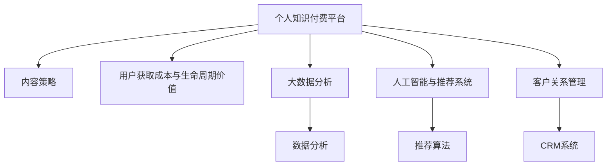

                 

# 如何打造个人知识付费商业帝国

> 关键词：知识付费, 商业模型, 人工智能, 大数据, 数据分析, 客户关系管理, 个性化推荐

## 1. 背景介绍

### 1.1 问题由来
随着知识经济的崛起，个人知识付费市场正迅速发展。作为知识生产者和传播者的个人，如何利用这一市场契机，打造属于自己的商业帝国？本专题将系统探讨构建个人知识付费平台的关键要素，涵盖商业模式、市场运营、技术支撑、客户关系等多方面内容。

### 1.2 问题核心关键点
构建个人知识付费平台的核心关键点包括：
- 确定目标客户群。选择最有价值的客户群体，并明确其需求。
- 制定清晰的商业模式。合理定价，平衡用户获取成本与收入。
- 构建高效的技术平台。利用大数据、人工智能等技术提升用户体验。
- 精准数据分析与客户管理。利用数据驱动决策，优化平台运营。
- 差异化内容策略。打造独特、有价值的内容，提升市场竞争力。
- 商业合作与生态建设。通过跨领域合作，拓展平台影响力。

通过明确这些关键点，我们将逐步揭开个人知识付费商业帝国的构建之路。

### 1.3 问题研究意义
个人知识付费平台不仅为个人创造经济价值，还推动了知识传播与教育事业的发展。构建个人知识付费平台，能够使知识生产者与消费者实现双赢，提升社会整体知识水平。同时，构建智能商业帝国，还将对人工智能、大数据等技术产生巨大的需求，促进相关产业的发展。

## 2. 核心概念与联系

### 2.1 核心概念概述

为更好地理解个人知识付费平台的构建过程，本节将介绍几个核心概念：

- 个人知识付费平台：指以个人为知识生产者的平台，提供定制化、高质量的知识产品，并通过付费模式实现盈利。
- 内容策略：指平台对知识内容的设计、组织、推广策略，以吸引和保留用户。
- 用户获取成本与生命周期价值（CAC & LTV）：衡量用户获取和维持的成本与价值，是制定价格策略的重要依据。
- 大数据分析：指利用大数据技术，从用户行为数据中挖掘出有价值的信息，用于优化产品和服务。
- 人工智能与推荐系统：通过机器学习算法，推荐用户感兴趣的个性化内容，提升用户体验和平台粘性。
- 客户关系管理（CRM）：指通过技术手段管理用户信息，维护与用户的长期关系，实现个性化服务和精准营销。

这些概念之间的逻辑关系可以通过以下Mermaid流程图来展示：



这个流程图展示了个人知识付费平台的各个关键组件及其之间的关系：

1. 平台作为知识生产和传播的载体，内容策略是吸引用户的关键。
2. 用户获取成本与生命周期价值是定价和盈利策略的基础。
3. 大数据分析为个性化推荐和精准营销提供了数据支撑。
4. 人工智能与推荐系统利用数据提升用户体验和平台粘性。
5. 客户关系管理维护用户关系，提升长期价值。

这些概念共同构成了个人知识付费平台的框架，帮助我们系统地思考和构建平台。

## 3. 核心算法原理 & 具体操作步骤
### 3.1 算法原理概述

个人知识付费平台的成功不仅依赖于优秀的商业模式，还依赖于高效的技术支撑。本文重点介绍其中的核心算法原理和具体操作步骤。

### 3.2 算法步骤详解

个人知识付费平台的构建可以分为以下几个关键步骤：

**Step 1: 确定目标客户群**
- 调研目标市场，选择最有潜力的客户群体。
- 分析客户需求，确定核心内容和服务的方向。

**Step 2: 设计内容策略**
- 制定内容形式和主题，如视频、文章、音频等。
- 确定内容生成和发布频率，如每日、每周等。
- 设计内容定价策略，如按次付费、按月付费等。

**Step 3: 构建技术平台**
- 选择合适的技术栈，如使用Python进行后端开发，React进行前端开发。
- 搭建数据存储和处理系统，如使用MySQL或NoSQL数据库。
- 集成支付系统，如支付宝、微信支付等。

**Step 4: 大数据分析与人工智能**
- 收集用户行为数据，如观看时长、点击率等。
- 利用大数据分析工具，如Apache Hadoop或Spark，进行数据挖掘和分析。
- 构建推荐系统，利用机器学习算法，推荐个性化内容。

**Step 5: 客户关系管理**
- 收集用户信息，如姓名、联系方式等。
- 使用CRM系统管理用户数据，如Salesforce或Zoho。
- 设计营销策略，如邮件营销、社交媒体营销等。

### 3.3 算法优缺点

个人知识付费平台的算法具有以下优点：
- 个性化推荐：通过个性化推荐，提高用户粘性和平台活跃度。
- 精准营销：利用大数据分析，实现精准用户定位和推广。
- 高效内容分发：利用推荐系统和数据分析，提高内容分发效率。

同时，该算法也存在一定的局限性：
- 数据依赖性强：平台的成功高度依赖于高质量的数据。
- 模型复杂度高：推荐系统和大数据分析模型需要较高的技术门槛。
- 隐私和安全问题：用户数据的收集和处理需要严格遵守隐私保护法规。

尽管存在这些局限性，但就目前而言，基于数据和算法的推荐范式仍是大规模个人知识付费平台的核心竞争力。未来相关研究的重点在于如何进一步降低数据依赖，提高模型的可解释性，同时兼顾隐私和安全等因素。

### 3.4 算法应用领域

基于数据和算法的推荐范式，已经在大规模知识付费平台中得到广泛应用，如得到、好未来等。通过这些平台，用户可以轻松获取自己感兴趣的高质量内容，知识生产者也可以根据用户反馈持续改进内容质量。同时，推荐系统还在电商、社交媒体等诸多领域展现出强大的应用潜力。

## 4. 数学模型和公式 & 详细讲解 & 举例说明

### 4.1 数学模型构建

本节将使用数学语言对个人知识付费平台的推荐系统进行更加严格的刻画。

设用户集为 $U$，内容集为 $I$。设用户对内容的评分向量为 $R \in \mathbb{R}^{|I|}$，内容向量为 $X \in \mathbb{R}^{|I|}$。推荐系统的目标是最大化预测值与真实评分的均方误差：

$$
\min_{R,X} \frac{1}{|U|} \sum_{u \in U} \sum_{i \in I} (r_{ui} - \hat{r}_{ui})^2
$$

其中 $r_{ui}$ 为用户 $u$ 对内容 $i$ 的评分，$\hat{r}_{ui}$ 为预测评分。

推荐模型 $f$ 可以表示为 $X$ 的线性组合，即：

$$
\hat{r}_{ui} = f(X)
$$

在实际应用中，通常使用矩阵分解方法（如SVD）或者深度神经网络来拟合推荐模型。

### 4.2 公式推导过程

以矩阵分解方法为例，设 $R_{ui} = \sum_{j=1}^k X_{uj} \times X_{ij}$，其中 $k$ 为因子数。则目标函数可以重写为：

$$
\min_{X} \frac{1}{2|U|} \sum_{u \in U} \sum_{i \in I} (R_{ui} - \hat{r}_{ui})^2
$$

通过梯度下降等优化算法，可以求解出最优的 $X$。

在得到推荐模型后，可以通过余弦相似度、欧氏距离等方法计算用户之间的相似度，从而推荐相似用户感兴趣的内容。

### 4.3 案例分析与讲解

假设有一个个人知识付费平台，平台上有200万用户和100万个内容。平台通过用户行为数据，构建了推荐模型，并对外提供内容推荐服务。为了评估推荐效果，平台抽取了1000个用户，对每个用户推荐了20个内容，并记录了用户对这些内容的评分。通过均方误差和准确率等指标，评估推荐系统的性能。

## 5. 项目实践：代码实例和详细解释说明
### 5.1 开发环境搭建

在进行项目实践前，我们需要准备好开发环境。以下是使用Python进行Flask开发的环境配置流程：

1. 安装Python：从官网下载并安装Python，建议安装最新版本。
2. 安装Flask：
```bash
pip install Flask
```

3. 安装SQLAlchemy：
```bash
pip install SQLAlchemy
```

4. 安装Flask-WTF：
```bash
pip install Flask-WTF
```

5. 安装Flask-Login：
```bash
pip install Flask-Login
```

6. 安装Jinja2：
```bash
pip install Jinja2
```

7. 安装Gunicorn：
```bash
pip install Gunicorn
```

完成上述步骤后，即可在开发环境中开始项目实践。

### 5.2 源代码详细实现

下面我们以推荐系统为例，给出使用Flask构建推荐系统的PyTorch代码实现。

```python
from flask import Flask, render_template, request, jsonify
from flask_sqlalchemy import SQLAlchemy
from sqlalchemy import create_engine
import pandas as pd
from sklearn.decomposition import TruncatedSVD
import numpy as np
from sklearn.metrics.pairwise import cosine_similarity

app = Flask(__name__)

# 配置数据库
app.config['SQLALCHEMY_DATABASE_URI'] = 'sqlite:///recommendation.db'
db = SQLAlchemy(app)

# 定义数据表
class User(db.Model):
    id = db.Column(db.Integer, primary_key=True)
    name = db.Column(db.String(100))
    email = db.Column(db.String(100))
    activities = db.relationship('Activity', backref='user', lazy='dynamic')

class Activity(db.Model):
    id = db.Column(db.Integer, primary_key=True)
    user_id = db.Column(db.Integer, db.ForeignKey('user.id', ondelete='CASCADE', nullable=False))
    timestamp = db.Column(db.DateTime)
    action = db.Column(db.String(100))

    def to_dict(self):
        return {
            'id': self.id,
            'timestamp': self.timestamp.isoformat(),
            'action': self.action,
            'user_id': self.user_id
        }

# 创建数据表
db.create_all()

# 加载数据
data = pd.read_csv('user_activities.csv')

# 填充活动表
activities = data[['user_id', 'timestamp', 'action']]
for index, row in activities.iterrows():
    user_id = row['user_id']
    timestamp = row['timestamp']
    action = row['action']
    activity = Activity(user_id=user_id, timestamp=timestamp, action=action)
    db.session.add(activity)
    db.session.commit()

# 构建推荐模型
def svd_model(R, k):
    U, S, V = np.linalg.svd(R)
    return U, S, V

def predict(user_id, k):
    U, S, V = svd_model(R, k)
    similarity = cosine_similarity(U[user_id], V)
    return pd.DataFrame(similarity).rename(columns={i: 'user_{}'.format(i)})

# 推荐函数
@app.route('/recommend', methods=['GET'])
def recommend():
    user_id = request.args.get('user_id')
    k = 10
    similarity = predict(user_id, k)
    recommendations = {}
    for i in range(k):
        recommendations[i] = similarity['user_{}'.format(i)].index[i]
    return jsonify(recommendations)

if __name__ == '__main__':
    app.run(debug=True)
```

在上述代码中，我们首先配置了Flask应用的SQLAlchemy数据库，创建了用户和活动数据表。然后，我们加载了用户行为数据，并构建了基于矩阵分解的推荐模型。最后，我们定义了一个推荐函数，用于根据用户ID推荐相似用户感兴趣的内容。

### 5.3 代码解读与分析

让我们再详细解读一下关键代码的实现细节：

**Flask应用配置**：
- 配置数据库为SQLite，方便本地开发测试。
- 定义数据表，包括用户和活动数据表。

**数据加载与填充**：
- 从CSV文件中加载用户行为数据。
- 填充活动表，将数据存入数据库。

**推荐模型构建**：
- 使用TruncatedSVD进行矩阵分解。
- 计算用户之间的相似度，得到推荐结果。

**推荐函数**：
- 接收用户ID作为输入。
- 调用预测函数，返回推荐结果。
- 将推荐结果转换为JSON格式，返回给客户端。

可以看到，Flask与SQLAlchemy的结合，使得数据管理变得更加简单高效。代码实现过程中，我们充分利用了Python的数据处理和机器学习库，构建了一个基础的推荐系统。

## 6. 实际应用场景

### 6.1 智能教育平台

个人知识付费平台可以应用于智能教育领域，为学生提供定制化的学习资源和辅导服务。通过分析学生的学习行为数据，平台可以推荐最适合的学习内容和习题，提升学习效率。同时，平台还可以提供答疑服务，解答学生在学习过程中遇到的问题。

### 6.2 健康管理平台

个人知识付费平台可以应用于健康管理领域，为用户提供个性化的健康建议和指导。通过分析用户的健康数据，平台可以推荐适合的运动、饮食、生活方式等内容。同时，平台还可以提供在线咨询和远程诊疗服务，提升用户的健康管理水平。

### 6.3 职业培训平台

个人知识付费平台可以应用于职业培训领域，为职业人士提供专业的技能培训和职业规划服务。通过分析用户的职业背景和需求，平台可以推荐适合的课程和培训资源，提升职业竞争力。同时，平台还可以提供职业发展建议和简历优化服务，帮助用户实现职业转型和提升。

### 6.4 未来应用展望

随着技术的不断进步，个人知识付费平台将具有更广阔的应用前景：

1. 跨领域融合：平台将不仅仅局限于某一领域，而是跨越教育、医疗、职业培训等多个领域，成为综合性知识服务平台。
2. 实时交互：通过AI技术，平台可以实现实时问答、互动讨论等功能，提升用户体验。
3. 多渠道推广：平台将通过社交媒体、搜索引擎等渠道进行推广，扩大用户群体。
4. 全球化布局：平台将面向全球用户，提供多语言、多文化的内容和服务。
5. 跨平台集成：平台将与其他平台和应用进行集成，实现数据的互联互通和资源共享。

总之，未来个人知识付费平台将更加智能化、普适化，能够更好地满足用户的多样化需求，创造更大的社会和经济价值。

## 7. 工具和资源推荐

### 7.1 学习资源推荐

为了帮助开发者系统掌握个人知识付费平台的构建技术，这里推荐一些优质的学习资源：

1. 《Python数据科学手册》：全面介绍Python在数据分析、机器学习等方面的应用，是学习数据科学的经典教材。
2. 《深度学习》：由Ian Goodfellow等专家合著，介绍了深度学习的基础理论和最新进展。
3. 《推荐系统实战》：介绍了推荐系统的构建和优化方法，结合实际案例进行讲解。
4. 《Flask Web Development》：介绍Flask框架的开发实践，包含大量的实例代码和应用场景。
5. 《SQLAlchemy文档》：提供SQLAlchemy数据库的详细使用指南，包括CRUD操作和高级功能。

通过对这些资源的学习实践，相信你一定能够快速掌握个人知识付费平台的构建技术和关键算法。

### 7.2 开发工具推荐

高效的开发离不开优秀的工具支持。以下是几款用于个人知识付费平台开发的常用工具：

1. Jupyter Notebook：一个强大的交互式编程环境，支持Python、R等多种语言，方便调试和文档编写。
2. GitHub：一个代码托管平台，支持版本控制和协作开发，方便版本管理和代码共享。
3. Docker：一个容器化平台，方便打包和部署应用，支持跨平台和环境一致性。
4. AWS / Google Cloud：云平台提供了强大的计算资源和灵活的弹性伸缩能力，适合大规模应用部署。
5. Kubernetes：一个容器编排平台，支持应用的自动部署、扩展和管理，提高运维效率。

合理利用这些工具，可以显著提升开发效率和应用部署的便捷性。

### 7.3 相关论文推荐

个人知识付费平台的发展离不开学界的持续研究。以下是几篇奠基性的相关论文，推荐阅读：

1. Recommender Systems Handbook：一本系统介绍推荐系统的经典书籍，涵盖各类推荐算法和应用案例。
2. Adaptive Regularization in Online Learning: Balancing Exploration and Exploitation：介绍在线学习中的适应性正则化技术，用于提升推荐系统的鲁棒性和可解释性。
3. Transfer Learning in NLP：介绍迁移学习在自然语言处理中的应用，拓展了推荐系统的应用范围。
4. Attention Is All You Need：介绍Transformer结构，为推荐系统提供新的深度学习范式。
5. A Multi-Task Learning Framework for Online Recommendations：介绍多任务学习在推荐系统中的应用，提升推荐效果。

这些论文代表了大规模个人知识付费平台的发展脉络。通过学习这些前沿成果，可以帮助研究者把握学科前进方向，激发更多的创新灵感。

## 8. 总结：未来发展趋势与挑战

### 8.1 总结

本文对个人知识付费平台的构建方法进行了全面系统的介绍。首先阐述了平台的背景和核心关键点，明确了平台构建的关键步骤和算法原理。其次，通过代码实例和详细解释，展示了平台构建的实际操作过程。同时，本文还探讨了平台在教育、健康、职业培训等领域的广泛应用前景。

通过本文的系统梳理，可以看到，个人知识付费平台不仅能够带来巨大的经济价值，还能推动知识传播和教育事业的发展。未来，随着技术的不断进步，平台将具有更广阔的应用前景，为知识付费市场注入新的活力。

### 8.2 未来发展趋势

展望未来，个人知识付费平台将呈现以下几个发展趋势：

1. 个性化推荐：推荐系统将更加智能化，能够根据用户行为和偏好，提供更加精准、个性化的内容。
2. 跨领域融合：平台将拓展到教育、医疗、职业培训等多个领域，成为综合性知识服务平台。
3. 实时交互：平台将通过AI技术，实现实时问答、互动讨论等功能，提升用户体验。
4. 多渠道推广：平台将通过社交媒体、搜索引擎等渠道进行推广，扩大用户群体。
5. 全球化布局：平台将面向全球用户，提供多语言、多文化的内容和服务。
6. 跨平台集成：平台将与其他平台和应用进行集成，实现数据的互联互通和资源共享。

以上趋势凸显了个人知识付费平台的广阔前景。这些方向的探索发展，必将进一步提升平台的价值和影响力，为知识付费市场带来更多的创新和机遇。

### 8.3 面临的挑战

尽管个人知识付费平台具有巨大的发展潜力，但在迈向更加智能化、普适化应用的过程中，它仍面临诸多挑战：

1. 数据隐私和安全：用户数据的收集和处理需要严格遵守隐私保护法规。
2. 推荐系统复杂性：推荐系统需要处理海量数据，模型的训练和维护复杂度高。
3. 用户粘性问题：如何保持用户长期活跃，增加用户粘性，是平台运营的重要挑战。
4. 平台成本问题：平台的运营和维护成本较高，如何降低成本，提高收益，是平台商业化的关键。
5. 市场竞争激烈：平台需要面对来自同类应用和传统教育机构的激烈竞争。

面对这些挑战，平台需要在技术、商业、运营等多个方面进行全面优化，才能实现长期稳定发展。

### 8.4 研究展望

未来，个人知识付费平台的研究方向将更加多样化，重点包括：

1. 推荐系统优化：进一步提升推荐系统的效率和准确性，探索更高效的模型和算法。
2. 用户行为分析：深入挖掘用户行为数据，提供更精准的内容推荐和个性化服务。
3. 平台商业化：探索更多的盈利模式，实现平台商业化和可持续发展。
4. 数据隐私保护：建立数据隐私保护机制，保障用户数据安全。
5. 跨领域融合：拓展平台应用领域，提升平台的影响力和价值。

这些研究方向的探索，将推动个人知识付费平台向更加智能化、普适化和商业化的方向发展，为知识付费市场带来更多的创新和突破。

## 9. 附录：常见问题与解答

**Q1：如何选择合适的推荐算法？**

A: 推荐算法的选择取决于平台的具体需求和数据特点。常用的推荐算法包括协同过滤、内容过滤、混合推荐等。协同过滤算法适用于用户行为数据较多的平台，而内容过滤适用于用户对内容偏好明显的平台。混合推荐算法则是结合了协同过滤和内容过滤的优点，适用于复杂的推荐场景。

**Q2：如何优化推荐系统？**

A: 推荐系统的优化可以从以下几个方面入手：
1. 数据预处理：清洗、归一化数据，提高数据质量。
2. 特征工程：提取和构造更有意义的特征，提升模型的预测能力。
3. 模型选择：根据数据特点和业务需求，选择合适的推荐算法和模型。
4. 评估指标：选择适合的评估指标，如均方误差、准确率、召回率等。
5. 在线学习：实时更新推荐模型，提高推荐效果。

**Q3：如何保证推荐系统的可解释性？**

A: 推荐系统的可解释性是用户体验的重要组成部分。可以通过以下方法提高推荐系统的可解释性：
1. 推荐理由展示：在推荐结果中展示推荐理由，如用户评分、内容标签等。
2. 用户反馈机制：允许用户反馈推荐结果，平台根据反馈优化推荐算法。
3. 人工干预：在关键推荐场景中，允许人工介入推荐结果，提高推荐准确性。

**Q4：如何处理推荐系统的冷启动问题？**

A: 推荐系统的冷启动问题指的是新用户或新内容缺乏足够的历史行为数据，导致推荐效果差。可以通过以下方法解决冷启动问题：
1. 基于内容的推荐：根据内容特征，推荐相似内容。
2. 基于图嵌入的推荐：利用图嵌入技术，捕捉用户和内容之间的隐含关系。
3. 利用先验知识：利用外部知识库或领域专家知识，补充用户和内容的隐含信息。

这些方法可以在一定程度上缓解冷启动问题，提高推荐系统的初始效果。

**Q5：如何维护用户关系？**

A: 用户关系的维护是平台长期稳定的关键。可以通过以下方法维护用户关系：
1. 个性化服务：提供个性化的内容和推荐，满足用户需求。
2. 用户反馈机制：定期收集用户反馈，改进服务和产品。
3. 社区建设：建立用户社区，增强用户粘性和互动。
4. 奖励机制：设计奖励机制，激励用户参与平台活动。

合理维护用户关系，能够增强用户粘性，提升平台的用户活跃度和留存率。

---

作者：禅与计算机程序设计艺术 / Zen and the Art of Computer Programming

