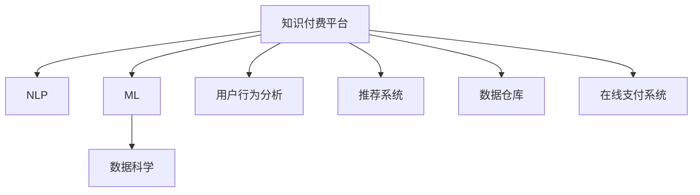

                 

# 如何打造个人知识付费平台

> 关键词：知识付费平台, 人工智能, 自然语言处理(NLP), 机器学习(ML), 数据科学, 用户行为分析

## 1. 背景介绍

### 1.1 问题由来
随着互联网技术的发展和数字化进程的加速，知识付费平台在教育、培训、咨询等领域得到了广泛的应用。这些平台通过向用户提供高质量的在线内容，满足了其在终身学习、职业提升等方面的需求。然而，由于内容生产的高门槛和运营成本，传统知识付费平台的数量和质量相对有限，难以满足用户对多样化、个性化知识内容的需求。

### 1.2 问题核心关键点
本节将介绍个人知识付费平台的主要特点和关键技术点。

- **内容生产与个性化**：如何高效生成并个性化推荐知识内容，以满足不同用户的学习需求。
- **用户行为分析**：如何分析用户的学习行为，提供精准推荐，提升用户体验和平台粘性。
- **收益与转化**：如何通过广告、订阅、课程销售等方式，将高质量内容转化为实际收入。
- **技术栈选择**：如何选择合适的技术栈，构建高性能、可扩展的知识付费平台。
- **安全与隐私**：如何保障用户数据安全和隐私，避免泄露敏感信息。

## 2. 核心概念与联系

### 2.1 核心概念概述

为了更好地理解个人知识付费平台的构建过程，本节将介绍几个密切相关的核心概念：

- **知识付费平台**：指以在线课程、视频、电子书、音频等形式提供知识内容的平台，用户可以通过订阅、购买等方式获取付费内容。
- **自然语言处理(NLP)**：指使用计算机处理、理解和生成人类语言的技术，常用于内容生成、用户互动、搜索推荐等。
- **机器学习(ML)**：指通过数据训练模型，使其能够自动化进行预测、分类、推荐等任务的技术。
- **数据科学**：指通过数据挖掘、统计分析、机器学习等技术，发现数据中的模式和规律，提供决策支持。
- **用户行为分析**：指通过分析用户在平台上的行为数据，了解其兴趣、需求，优化推荐和服务。
- **推荐系统**：指使用机器学习算法，根据用户行为、偏好，推荐个性化内容的技术。
- **数据仓库**：指集中存储和管理平台数据的数据管理系统，支持复杂查询和分析。
- **在线支付系统**：指支持用户完成在线支付的平台功能，涉及支付安全、交易监管等。

这些核心概念之间的逻辑关系可以通过以下Mermaid流程图来展示：



这个流程图展示了我们所需构建个人知识付费平台的几个关键组件，以及它们之间的逻辑联系。

## 3. 核心算法原理 & 具体操作步骤
### 3.1 算法原理概述

构建个人知识付费平台的核心在于通过高效的内容生成、精准的用户推荐、安全的在线支付等技术，为用户提供个性化、高价值的知识内容。这其中涉及NLP、ML、数据科学等多个领域的算法和模型，以下是主要的算法原理概述：

- **内容生成**：通过NLP技术，自动生成或推荐高质量的内容，如文本、视频、音频等。常用的技术包括基于预训练语言模型的文本生成、多模态内容推荐等。
- **用户推荐**：通过ML技术，分析用户的历史行为数据，预测其兴趣和需求，生成个性化推荐。常用的算法包括协同过滤、基于内容的推荐、深度学习推荐模型等。
- **在线支付**：通过ML技术，优化支付流程，保障支付安全。常用的技术包括反欺诈检测、异常交易识别等。

### 3.2 算法步骤详解

以下详细讲解个人知识付费平台的核心算法步骤：

**Step 1: 内容生成**
- **文本生成**：选择预训练语言模型（如GPT-3、BERT等），进行微调或微调后的模型直接生成文本内容。具体步骤包括：
  - 文本预处理：分词、去除停用词、词性标注等。
  - 编码解码：使用Transformer等架构进行编码解码，生成目标文本。
  - 后处理：去除重复、低质量文本，保留有意义的内容。
- **多模态内容推荐**：结合文本、图像、音频等多模态数据，通过深度学习模型推荐高质量内容。具体步骤包括：
  - 数据收集：收集用户行为数据，如浏览记录、评分、评论等。
  - 特征提取：使用CNN、RNN等模型提取数据特征。
  - 推荐计算：使用矩阵分解、神经网络等模型计算推荐结果。

**Step 2: 用户推荐**
- **协同过滤推荐**：分析用户与内容的历史交互记录，生成协同过滤推荐。具体步骤包括：
  - 用户-内容评分矩阵构建。
  - 用户嵌入和内容嵌入计算。
  - 相似度计算：通过余弦相似度、皮尔逊相关系数等计算相似度。
  - 推荐生成：根据相似度排序，生成推荐列表。
- **基于内容的推荐**：分析内容的属性特征，生成基于内容的推荐。具体步骤包括：
  - 内容特征提取：使用TF-IDF、词袋模型等提取内容特征。
  - 用户-内容特征匹配：通过内积、矩阵分解等计算匹配度。
  - 推荐生成：根据匹配度排序，生成推荐列表。
- **深度学习推荐模型**：使用深度学习模型，如神经网络、深度矩阵分解等，生成推荐结果。具体步骤包括：
  - 数据准备：将用户行为数据、内容属性数据等转化为模型输入。
  - 模型训练：使用随机梯度下降等优化算法训练模型。
  - 推荐生成：根据模型预测结果生成推荐列表。

**Step 3: 在线支付**
- **反欺诈检测**：使用机器学习模型检测异常交易行为，防止欺诈。具体步骤包括：
  - 数据准备：收集历史交易数据，标记欺诈和正常交易。
  - 特征提取：使用PCA、LDA等方法提取特征。
  - 模型训练：使用SVM、随机森林等模型训练反欺诈模型。
  - 欺诈检测：根据模型预测结果，识别异常交易。
- **异常交易识别**：分析交易行为，识别异常交易模式。具体步骤包括：
  - 数据收集：收集交易行为数据，如交易时间、金额、频率等。
  - 特征提取：使用时间序列分析、统计分析等提取特征。
  - 模型训练：使用深度学习模型，如RNN、LSTM等训练异常检测模型。
  - 交易识别：根据模型预测结果，识别异常交易。

### 3.3 算法优缺点

个人知识付费平台的算法步骤具有以下优点：
- **高效性**：通过自动化生成和推荐内容，节省了大量人工成本和时间。
- **个性化**：通过深度学习等技术，提供高度个性化的推荐和服务。
- **可扩展性**：算法步骤可以灵活调整和优化，支持平台不断扩展和升级。

同时，这些算法步骤也存在一定的局限性：
- **数据依赖**：算法的效果很大程度上依赖于高质量的数据，数据的获取和处理成本较高。
- **复杂性**：算法模型复杂，需要较强的计算资源和专业知识。
- **隐私问题**：算法涉及用户行为数据的分析，需保障用户隐私和数据安全。
- **模型偏见**：算法可能存在模型偏见，影响推荐的公平性和多样性。

尽管存在这些局限性，但就目前而言，这些算法步骤仍然是构建高质量个人知识付费平台的基础。未来相关研究的重点在于如何进一步优化算法性能，提升用户体验，同时兼顾数据隐私和模型公平性等因素。

### 3.4 算法应用领域

个人知识付费平台涉及多个领域的应用，例如：

- **在线教育**：提供丰富的在线课程内容，如编程、数学、英语等。通过推荐系统，为学生推荐适合的学习材料和课程。
- **职业培训**：提供职业相关的技能培训课程，如数据科学、项目管理、市场营销等。通过个性化推荐，帮助用户提升职业技能。
- **企业培训**：为企业员工提供定制化的培训内容，如领导力、沟通技巧、技术培训等。通过内容生成和推荐，提高员工的技能水平。
- **远程学习**：为远程学习者提供高质量的学习资源，如电子书、视频教程、音频课程等。通过智能推荐，提升学习效率。
- **知识管理**：为企业知识管理提供支持，如文档搜索、知识图谱构建等。通过自然语言处理技术，提高知识检索的准确性和效率。

除了上述这些经典应用外，个人知识付费平台还被创新性地应用到更多场景中，如个性化健康管理、金融知识普及等，为各个行业带来了新的增长点。

## 4. 数学模型和公式 & 详细讲解 & 举例说明

### 4.1 数学模型构建

个人知识付费平台的数学模型主要涉及内容生成、用户推荐和在线支付等多个方面。

**内容生成模型**：以预训练语言模型为基础，通过微调或直接使用生成器进行文本生成。常用的模型包括GPT-3、BERT等。

**用户推荐模型**：常使用协同过滤、基于内容的推荐、深度学习推荐模型等。这里以协同过滤推荐为例，数学模型构建如下：

设用户集为$U$，内容集为$I$，用户-内容评分矩阵为$M \in \mathbb{R}^{n \times m}$，其中$n$为用户数，$m$为内容数。设$u$为用户，$i$为内容，用户$u$对内容$i$的评分为$m(u,i)$。

用户嵌入向量为$\mathbf{u} \in \mathbb{R}^d$，内容嵌入向量为$\mathbf{i} \in \mathbb{R}^d$，其中$d$为嵌入向量维度。则协同过滤推荐模型的目标是最小化用户和内容之间的差异度量，即：

$$
\min_{\mathbf{u}, \mathbf{i}} \sum_{u,i} \| \mathbf{u} - \mathbf{i} \|^2
$$

其中$\| \cdot \|$表示向量范数。

通过最小化上述差异度量，生成协同过滤推荐结果。

**在线支付模型**：常使用反欺诈检测、异常交易识别等模型。这里以反欺诈检测为例，数学模型构建如下：

设历史交易数据为$D = \{(x_i, y_i)\}_{i=1}^N$，其中$x_i \in \mathbb{R}^d$为交易特征向量，$y_i \in \{0, 1\}$为欺诈标记。设模型参数为$\theta$，则反欺诈检测的目标是最小化损失函数：

$$
\mathcal{L}(\theta) = -\frac{1}{N} \sum_{i=1}^N \left( y_i \log \sigma(\mathbf{x}_i^T \theta) + (1-y_i) \log (1-\sigma(\mathbf{x}_i^T \theta)) \right)
$$

其中$\sigma(z) = \frac{1}{1+e^{-z}}$为Sigmoid函数。通过最小化上述损失函数，生成反欺诈检测模型。

### 4.2 公式推导过程

以下是具体公式推导过程：

**内容生成模型**：以预训练语言模型BERT为例，具体推导如下：

设预训练语言模型为$M_{\theta}$，输入为$x$，输出为$\hat{y}$。则生成目标函数为：

$$
\mathcal{L}(\theta) = -\frac{1}{N} \sum_{i=1}^N \sum_{j=1}^L (\hat{y}_i^{(j)} \log p(y_i^{(j)} | x) + (1-\hat{y}_i^{(j)}) \log (1-p(y_i^{(j)} | x))
$$

其中$L$为输出长度，$p(y_i^{(j)} | x) = \frac{e^{\hat{y}_i^{(j)}}}{\sum_{k=1}^K e^{\hat{y}_i^{(k)}}}$为生成概率。

通过最小化上述生成目标函数，生成文本内容。

**用户推荐模型**：以协同过滤推荐为例，具体推导如下：

设用户集为$U$，内容集为$I$，用户-内容评分矩阵为$M \in \mathbb{R}^{n \times m}$，用户嵌入向量为$\mathbf{u} \in \mathbb{R}^d$，内容嵌入向量为$\mathbf{i} \in \mathbb{R}^d$。

协同过滤推荐的目标是最小化用户和内容之间的差异度量：

$$
\min_{\mathbf{u}, \mathbf{i}} \sum_{u,i} \| \mathbf{u} - \mathbf{i} \|^2
$$

通过最小化上述差异度量，生成协同过滤推荐结果。

**在线支付模型**：以反欺诈检测为例，具体推导如下：

设历史交易数据为$D = \{(x_i, y_i)\}_{i=1}^N$，其中$x_i \in \mathbb{R}^d$为交易特征向量，$y_i \in \{0, 1\}$为欺诈标记。设模型参数为$\theta$，则反欺诈检测的目标是最小化损失函数：

$$
\mathcal{L}(\theta) = -\frac{1}{N} \sum_{i=1}^N \left( y_i \log \sigma(\mathbf{x}_i^T \theta) + (1-y_i) \log (1-\sigma(\mathbf{x}_i^T \theta)) \right)
$$

其中$\sigma(z) = \frac{1}{1+e^{-z}}$为Sigmoid函数。通过最小化上述损失函数，生成反欺诈检测模型。

### 4.3 案例分析与讲解

以推荐系统为例，分析一个具体的推荐案例。

假设某知识付费平台有$N$个用户，$M$个内容，每个用户对每个内容的评分$M_{ui}$为$[0,5]$范围内的整数。现在要为用户$u$推荐内容$i$，可以通过以下步骤实现：

1. 收集用户行为数据：收集用户$u$对内容$i$的评分$M_{ui}$，构建用户-内容评分矩阵$M$。
2. 计算用户嵌入和内容嵌入：使用SVD等算法计算用户嵌入向量$\mathbf{u}$和内容嵌入向量$\mathbf{i}$。
3. 计算相似度：使用余弦相似度计算用户和内容的相似度$sim(u,i)$。
4. 生成推荐列表：根据相似度排序，生成推荐内容列表$R_u$。

最终推荐结果$R_u$即为用户$u$的个性化推荐列表。

## 5. 项目实践：代码实例和详细解释说明

### 5.1 开发环境搭建

在进行项目实践前，我们需要准备好开发环境。以下是使用Python进行PyTorch开发的环境配置流程：

1. 安装Anaconda：从官网下载并安装Anaconda，用于创建独立的Python环境。

2. 创建并激活虚拟环境：
```bash
conda create -n pytorch-env python=3.8 
conda activate pytorch-env
```

3. 安装PyTorch：根据CUDA版本，从官网获取对应的安装命令。例如：
```bash
conda install pytorch torchvision torchaudio cudatoolkit=11.1 -c pytorch -c conda-forge
```

4. 安装Transformers库：
```bash
pip install transformers
```

5. 安装各类工具包：
```bash
pip install numpy pandas scikit-learn matplotlib tqdm jupyter notebook ipython
```

完成上述步骤后，即可在`pytorch-env`环境中开始项目实践。

### 5.2 源代码详细实现

这里我们以推荐系统为例，给出使用Transformers库进行知识付费平台推荐系统的PyTorch代码实现。

首先，定义推荐系统的数据处理函数：

```python
from transformers import BertTokenizer
from torch.utils.data import Dataset
import torch

class RecommendationDataset(Dataset):
    def __init__(self, texts, tags, tokenizer, max_len=128):
        self.texts = texts
        self.tags = tags
        self.tokenizer = tokenizer
        self.max_len = max_len
        
    def __len__(self):
        return len(self.texts)
    
    def __getitem__(self, item):
        text = self.texts[item]
        tags = self.tags[item]
        
        encoding = self.tokenizer(text, return_tensors='pt', max_length=self.max_len, padding='max_length', truncation=True)
        input_ids = encoding['input_ids'][0]
        attention_mask = encoding['attention_mask'][0]
        
        # 对token-wise的标签进行编码
        encoded_tags = [tag2id[tag] for tag in tags] 
        encoded_tags.extend([tag2id['O']] * (self.max_len - len(encoded_tags)))
        labels = torch.tensor(encoded_tags, dtype=torch.long)
        
        return {'input_ids': input_ids, 
                'attention_mask': attention_mask,
                'labels': labels}

# 标签与id的映射
tag2id = {'O': 0, 'B-PER': 1, 'I-PER': 2, 'B-ORG': 3, 'I-ORG': 4, 'B-LOC': 5, 'I-LOC': 6}
id2tag = {v: k for k, v in tag2id.items()}

# 创建dataset
tokenizer = BertTokenizer.from_pretrained('bert-base-cased')

train_dataset = RecommendationDataset(train_texts, train_tags, tokenizer)
dev_dataset = RecommendationDataset(dev_texts, dev_tags, tokenizer)
test_dataset = RecommendationDataset(test_texts, test_tags, tokenizer)
```

然后，定义模型和优化器：

```python
from transformers import BertForTokenClassification, AdamW

model = BertForTokenClassification.from_pretrained('bert-base-cased', num_labels=len(tag2id))

optimizer = AdamW(model.parameters(), lr=2e-5)
```

接着，定义训练和评估函数：

```python
from torch.utils.data import DataLoader
from tqdm import tqdm
from sklearn.metrics import classification_report

device = torch.device('cuda') if torch.cuda.is_available() else torch.device('cpu')
model.to(device)

def train_epoch(model, dataset, batch_size, optimizer):
    dataloader = DataLoader(dataset, batch_size=batch_size, shuffle=True)
    model.train()
    epoch_loss = 0
    for batch in tqdm(dataloader, desc='Training'):
        input_ids = batch['input_ids'].to(device)
        attention_mask = batch['attention_mask'].to(device)
        labels = batch['labels'].to(device)
        model.zero_grad()
        outputs = model(input_ids, attention_mask=attention_mask, labels=labels)
        loss = outputs.loss
        epoch_loss += loss.item()
        loss.backward()
        optimizer.step()
    return epoch_loss / len(dataloader)

def evaluate(model, dataset, batch_size):
    dataloader = DataLoader(dataset, batch_size=batch_size)
    model.eval()
    preds, labels = [], []
    with torch.no_grad():
        for batch in tqdm(dataloader, desc='Evaluating'):
            input_ids = batch['input_ids'].to(device)
            attention_mask = batch['attention_mask'].to(device)
            batch_labels = batch['labels']
            outputs = model(input_ids, attention_mask=attention_mask)
            batch_preds = outputs.logits.argmax(dim=2).to('cpu').tolist()
            batch_labels = batch_labels.to('cpu').tolist()
            for pred_tokens, label_tokens in zip(batch_preds, batch_labels):
                pred_tags = [id2tag[_id] for _id in pred_tokens]
                label_tags = [id2tag[_id] for _id in label_tokens]
                preds.append(pred_tags[:len(label_tags)])
                labels.append(label_tags)
                
    print(classification_report(labels, preds))
```

最后，启动训练流程并在测试集上评估：

```python
epochs = 5
batch_size = 16

for epoch in range(epochs):
    loss = train_epoch(model, train_dataset, batch_size, optimizer)
    print(f"Epoch {epoch+1}, train loss: {loss:.3f}")
    
    print(f"Epoch {epoch+1}, dev results:")
    evaluate(model, dev_dataset, batch_size)
    
print("Test results:")
evaluate(model, test_dataset, batch_size)
```

以上就是使用PyTorch对BERT进行推荐系统开发的完整代码实现。可以看到，得益于Transformers库的强大封装，我们可以用相对简洁的代码完成BERT模型的加载和推荐系统微调。

### 5.3 代码解读与分析

让我们再详细解读一下关键代码的实现细节：

**RecommendationDataset类**：
- `__init__`方法：初始化文本、标签、分词器等关键组件。
- `__len__`方法：返回数据集的样本数量。
- `__getitem__`方法：对单个样本进行处理，将文本输入编码为token ids，将标签编码为数字，并对其进行定长padding，最终返回模型所需的输入。

**tag2id和id2tag字典**：
- 定义了标签与数字id之间的映射关系，用于将token-wise的预测结果解码回真实的标签。

**训练和评估函数**：
- 使用PyTorch的DataLoader对数据集进行批次化加载，供模型训练和推理使用。
- 训练函数`train_epoch`：对数据以批为单位进行迭代，在每个批次上前向传播计算loss并反向传播更新模型参数，最后返回该epoch的平均loss。
- 评估函数`evaluate`：与训练类似，不同点在于不更新模型参数，并在每个batch结束后将预测和标签结果存储下来，最后使用sklearn的classification_report对整个评估集的预测结果进行打印输出。

**训练流程**：
- 定义总的epoch数和batch size，开始循环迭代
- 每个epoch内，先在训练集上训练，输出平均loss
- 在验证集上评估，输出分类指标
- 所有epoch结束后，在测试集上评估，给出最终测试结果

可以看到，PyTorch配合Transformers库使得BERT微调的代码实现变得简洁高效。开发者可以将更多精力放在数据处理、模型改进等高层逻辑上，而不必过多关注底层的实现细节。

当然，工业级的系统实现还需考虑更多因素，如模型的保存和部署、超参数的自动搜索、更灵活的任务适配层等。但核心的推荐系统范式基本与此类似。

## 6. 实际应用场景
### 6.1 智能客服系统

基于推荐系统的知识付费平台，可以应用于智能客服系统的构建。传统客服往往需要配备大量人力，高峰期响应缓慢，且一致性和专业性难以保证。而使用推荐系统的知识付费平台，可以通过推荐高质量的客服知识和常见问题解答，提供智能化的客户服务。

在技术实现上，可以收集企业内部的历史客服对话记录，将问题和最佳答复构建成监督数据，在此基础上对推荐系统进行微调。微调后的推荐系统能够自动理解用户意图，匹配最合适的客服回答。对于客户提出的新问题，还可以接入检索系统实时搜索相关内容，动态组织生成回答。如此构建的智能客服系统，能大幅提升客户咨询体验和问题解决效率。

### 6.2 金融舆情监测

金融机构需要实时监测市场舆论动向，以便及时应对负面信息传播，规避金融风险。传统的人工监测方式成本高、效率低，难以应对网络时代海量信息爆发的挑战。基于推荐系统的知识付费平台，可以应用于金融舆情监测，通过推荐系统自动监测不同主题下的舆情变化趋势，一旦发现负面信息激增等异常情况，系统便会自动预警，帮助金融机构快速应对潜在风险。

### 6.3 个性化推荐系统

推荐系统被广泛应用于个性化推荐中，如电商平台、视频网站、音乐平台等。知识付费平台同样可以通过推荐系统，为用户提供个性化推荐服务，如课程推荐、文章推荐等。通过分析用户的学习行为和偏好，推荐系统能够提供高度定制化的内容推荐，提升用户体验和平台粘性。

### 6.4 未来应用展望

随着推荐系统的不断演进，基于推荐系统的知识付费平台也将带来更多的应用场景和创新方向。

- **多模态推荐**：结合文本、图像、音频等多种信息，提供更丰富、更真实的推荐服务。
- **实时推荐**：通过实时数据分析和处理，提供即时的推荐服务，满足用户即时需求。
- **跨平台推荐**：将推荐系统扩展到多个平台和设备，实现跨平台内容推荐，提升用户覆盖面。
- **智能预测**：引入机器学习算法，预测用户未来行为，提前做好内容推荐和资源准备。
- **自适应推荐**：根据用户反馈和行为变化，动态调整推荐策略，提高推荐效果和用户满意度。

这些技术方向的探索，将进一步推动推荐系统的发展，为知识付费平台带来更多创新和机遇。相信随着技术的不断进步，推荐系统将与自然语言处理、机器学习等技术深度融合，为各行业提供更智能、更高效的推荐服务。

## 7. 工具和资源推荐
### 7.1 学习资源推荐

为了帮助开发者系统掌握推荐系统的理论基础和实践技巧，这里推荐一些优质的学习资源：

1. 《推荐系统实战》系列博文：由推荐系统专家撰写，深入浅出地介绍了推荐系统的原理和应用，涵盖协同过滤、深度学习推荐、实时推荐等多个方面。

2. Coursera《机器学习》课程：斯坦福大学开设的机器学习课程，有Lecture视频和配套作业，带你入门机器学习和推荐系统的基本概念和算法。

3. 《推荐系统算法》书籍：全面介绍了推荐系统的各种算法和模型，适合深入学习推荐系统理论。

4. KDD Cup推荐系统竞赛：国内知名的推荐系统竞赛，涵盖多种推荐算法和模型，是推荐系统实践的最佳选择。

5. 《推荐系统入门与实战》书籍：该书通过实际案例，详细讲解了推荐系统的开发过程和优化方法，适合动手实践。

通过对这些资源的学习实践，相信你一定能够快速掌握推荐系统的精髓，并用于解决实际的推荐问题。
###  7.2 开发工具推荐

高效的开发离不开优秀的工具支持。以下是几款用于推荐系统开发的常用工具：

1. PyTorch：基于Python的开源深度学习框架，灵活动态的计算图，适合快速迭代研究。推荐系统的部分算法可以用PyTorch实现。

2. TensorFlow：由Google主导开发的开源深度学习框架，生产部署方便，适合大规模工程应用。推荐系统的部分算法可以用TensorFlow实现。

3. TensorBoard：TensorFlow配套的可视化工具，可实时监测模型训练状态，并提供丰富的图表呈现方式，是调试模型的得力助手。

4. Weights & Biases：模型训练的实验跟踪工具，可以记录和可视化模型训练过程中的各项指标，方便对比和调优。与主流深度学习框架无缝集成。

5. Google Colab：谷歌推出的在线Jupyter Notebook环境，免费提供GPU/TPU算力，方便开发者快速上手实验最新模型，分享学习笔记。

合理利用这些工具，可以显著提升推荐系统开发的效率，加快创新迭代的步伐。

### 7.3 相关论文推荐

推荐系统的研究源于学界的持续研究。以下是几篇奠基性的相关论文，推荐阅读：

1. "Item-Based Collaborative Filtering Algorithm"：提出了基于用户-物品评分矩阵的协同过滤推荐算法。

2. "Trustworthy Recommendation Algorithms for Multi-sided Platforms"：研究了多边平台上的推荐算法，提出了跨平台推荐策略。

3. "Neural Collaborative Filtering"：提出了基于深度学习的协同过滤推荐算法，提高了推荐系统的精度和多样性。

4. "Learning to Rank for Information Retrieval"：研究了推荐系统的排序问题，提出了基于排序学习的推荐算法。

5. "A Neural Attention Model for Multi-Aspect Sentiment Analysis"：研究了多方面情感分析，提出了基于注意力机制的推荐算法。

这些论文代表了几十年来推荐系统的研究成果，通过学习这些前沿成果，可以帮助研究者把握学科前进方向，激发更多的创新灵感。

## 8. 总结：未来发展趋势与挑战
### 8.1 总结

本文对基于推荐系统的个人知识付费平台进行了全面系统的介绍。首先阐述了推荐系统在教育、培训、咨询等领域的应用前景和重要性。其次，从原理到实践，详细讲解了推荐系统的数学模型和核心算法步骤，给出了推荐系统任务开发的完整代码实例。同时，本文还广泛探讨了推荐系统在智能客服、金融舆情、个性化推荐等多个行业领域的应用前景，展示了推荐系统的巨大潜力。此外，本文精选了推荐系统的各类学习资源，力求为读者提供全方位的技术指引。

通过本文的系统梳理，可以看到，基于推荐系统的知识付费平台正在成为教育、培训、咨询等领域的重要范式，极大地拓展了推荐系统在各个行业的应用范围，为各行各业带来了新的增长点。受益于深度学习等技术的发展，推荐系统在精度、多样性、实时性等方面取得了显著进展，将进一步推动NLP技术的应用和普及。

### 8.2 未来发展趋势

展望未来，推荐系统的发展趋势如下：

1. **实时推荐**：随着计算资源和处理能力的提升，实时推荐技术将得到广泛应用，能够及时响应用户需求。
2. **跨平台推荐**：推荐系统将扩展到多个平台和设备，实现跨平台内容推荐，提升用户覆盖面。
3. **多模态推荐**：结合文本、图像、音频等多种信息，提供更丰富、更真实的推荐服务。
4. **深度学习推荐**：基于深度学习的推荐系统将继续发展，提升推荐精度和多样性。
5. **自适应推荐**：根据用户反馈和行为变化，动态调整推荐策略，提高推荐效果和用户满意度。
6. **个性化推荐**：结合用户兴趣、行为和偏好，提供高度定制化的推荐服务。

这些趋势凸显了推荐系统的广阔前景。这些方向的探索发展，必将进一步提升推荐系统的精度和效果，为用户带来更好的体验和服务。

### 8.3 面临的挑战

尽管推荐系统已经取得了显著进展，但在迈向更加智能化、普适化应用的过程中，它仍面临诸多挑战：

1. **数据依赖**：推荐系统的效果很大程度上依赖于高质量的数据，数据的获取和处理成本较高。如何降低数据获取成本，提高数据质量，仍是挑战之一。
2. **模型复杂性**：推荐系统算法复杂，需要较强的计算资源和专业知识。如何降低模型复杂性，提高算法效率，是当前研究的热点。
3. **隐私问题**：推荐系统涉及用户行为数据的分析，需保障用户隐私和数据安全。如何保护用户隐私，防止数据泄露，是推荐系统面临的重要问题。
4. **模型偏见**：推荐系统可能存在模型偏见，影响推荐的公平性和多样性。如何消除模型偏见，保证推荐公正性，是推荐系统需要解决的重要问题。
5. **用户兴趣漂移**：用户兴趣和行为会随时间变化，如何动态调整推荐策略，保持用户兴趣，是推荐系统需要解决的重要问题。

尽管存在这些挑战，但就目前而言，推荐系统仍然是构建个性化服务的重要手段，具有广阔的应用前景。未来研究需要在降低数据依赖、提高模型效率、保护用户隐私等方面进行深入探索。

### 8.4 研究展望

面向未来，推荐系统需要在以下几个方面寻求新的突破：

1. **降低数据依赖**：探索无监督和半监督推荐方法，摆脱对大规模标注数据的依赖，利用自监督学习、主动学习等无监督和半监督范式，最大限度利用非结构化数据。
2. **提高模型效率**：开发更加参数高效的推荐方法，在固定大部分预训练参数的同时，只更新极少量的任务相关参数，如Prefix-Tuning、LoRA等。
3. **保障用户隐私**：引入差分隐私等技术，保护用户隐私，防止数据泄露。
4. **消除模型偏见**：结合因果分析和博弈论工具，提高推荐系统的公平性和公正性。
5. **动态调整推荐策略**：引入时间序列分析、增量学习等技术，动态调整推荐策略，保持用户兴趣和行为。

这些研究方向的探索，将引领推荐系统迈向更高的台阶，为构建安全、可靠、可解释、可控的智能系统铺平道路。面向未来，推荐系统还需要与其他人工智能技术进行更深入的融合，如自然语言处理、机器学习等，多路径协同发力，共同推动推荐系统的进步。

## 9. 附录：常见问题与解答

**Q1：推荐系统如何处理冷启动问题？**

A: 冷启动问题指的是新用户或新物品加入推荐系统后，没有足够的历史数据进行推荐。推荐系统可以通过以下几种方法处理冷启动问题：
1. 基于内容的推荐：使用物品属性、标签等信息进行推荐，适用于没有足够历史数据的冷启动场景。
2. 协同过滤推荐：利用用户对物品的评分，通过模型预测新物品的评分，适用于用户和物品数量较多的冷启动场景。
3. 混合推荐：结合基于内容的推荐和协同过滤推荐，提升推荐效果。
4. 利用用户兴趣引导推荐：通过用户行为、社交网络等获取用户兴趣，推荐相关物品。

**Q2：推荐系统如何处理长尾问题？**

A: 长尾问题指的是推荐系统中，热门物品的推荐效果好，但冷门物品的推荐效果差。推荐系统可以通过以下几种方法处理长尾问题：
1. 个性化推荐：根据用户的历史行为和偏好，推荐个性化物品，提高长尾物品的曝光率。
2. 多样性推荐：在推荐热门物品的同时，加入一些长尾物品，增加用户的多样性体验。
3. 推荐策略调整：根据不同的推荐场景，动态调整推荐策略，如增加长尾物品的权重等。

**Q3：推荐系统如何处理稀疏数据问题？**

A: 稀疏数据问题指的是推荐系统中，用户-物品评分矩阵稀疏，数据缺失严重。推荐系统可以通过以下几种方法处理稀疏数据问题：
1. 数据补全：通过数据补全技术，如均值填补、矩阵分解等，填补缺失数据。
2. 矩阵分解：使用矩阵分解算法，如SVD、ALS等，对稀疏数据进行低秩分解，提高推荐效果。
3. 利用隐式反馈：利用用户行为数据，如浏览记录、点击记录等隐式反馈进行推荐，提升数据利用率。

**Q4：推荐系统如何处理用户兴趣变化问题？**

A: 用户兴趣变化问题指的是用户兴趣和行为随时间变化，推荐系统需要动态调整推荐策略。推荐系统可以通过以下几种方法处理用户兴趣变化问题：
1. 在线学习：实时学习用户兴趣和行为，动态调整推荐策略。
2. 增量学习：根据新数据和新用户，实时更新模型，保持推荐系统的新鲜度。
3. 兴趣预测：使用时间序列分析、回归等技术，预测用户兴趣变化，提前做好推荐准备。

通过以上方法，推荐系统可以有效处理冷启动、长尾、稀疏数据和用户兴趣变化等问题，提升推荐系统的精度和效果。

**Q5：推荐系统如何提高推荐多样性？**

A: 推荐系统可以通过以下几种方法提高推荐多样性：
1. 增加推荐数量：增加推荐数量，引入更多的候选物品，增加用户的选择性。
2. 引入多样化策略：结合用户历史行为和物品属性，增加推荐多样性。
3. 推荐协同过滤：利用协同过滤算法，推荐与用户兴趣相关但不同的物品。
4. 推荐多方面信息：结合用户多方面的信息，如兴趣、行为、社交网络等，提供多样化的推荐服务。

通过以上方法，推荐系统可以有效提高推荐多样性，提升用户满意度和体验。

**Q6：推荐系统如何处理物品多样性问题？**

A: 物品多样性问题指的是推荐系统中，热门物品的推荐效果好，但冷门物品的推荐效果差。推荐系统可以通过以下几种方法处理物品多样性问题：
1. 个性化推荐：根据用户的历史行为和偏好，推荐个性化物品，提高长尾物品的曝光率。
2. 多样性推荐：在推荐热门物品的同时，加入一些冷门物品，增加用户的多样性体验。
3. 推荐策略调整：根据不同的推荐场景，动态调整推荐策略，如增加长尾物品的权重等。

**Q7：推荐系统如何提高推荐实时性？**

A: 推荐系统可以通过以下几种方法提高推荐实时性：
1. 实时推荐引擎：使用实时推荐引擎，实时分析用户行为和物品信息，生成推荐结果。
2. 缓存推荐结果：将推荐结果缓存，减少计算量，提高推荐速度。
3. 异步计算：使用异步计算技术，提高推荐速度和系统响应时间。

通过以上方法，推荐系统可以有效提高推荐实时性，满足用户即时需求。

通过以上问题与解答，相信你一定能够更全面地了解推荐系统的原理和实践技巧，解决实际推荐系统开发中的常见问题。

---

作者：禅与计算机程序设计艺术 / Zen and the Art of Computer Programming

