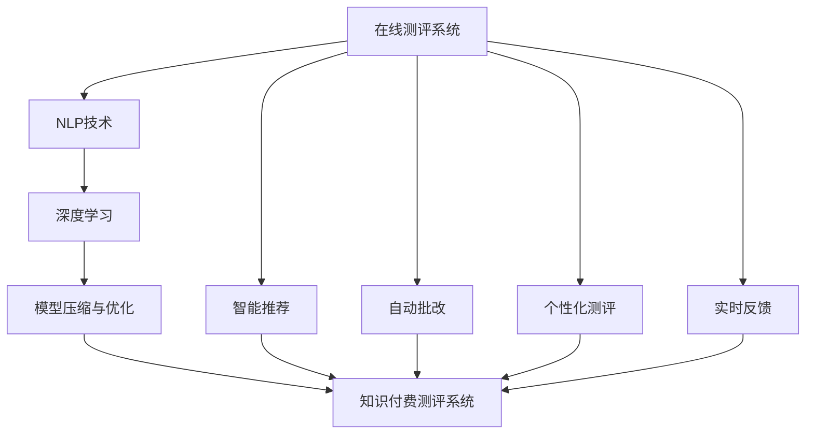

                 

# 如何打造知识付费的在线测评系统

## 1. 背景介绍

随着知识付费时代的到来，在线教育平台逐渐成为教育行业的主流。用户通过在线课程学习和培训，提高专业技能，企业通过在线测评和认证，保障员工素质，均需要构建专业的在线测评系统。但与传统考试测评系统不同，知识付费测评系统不仅需注重考试内容的丰富性和全面性，还需满足知识付费的个性化、交互性和即时反馈性。本文将详细介绍知识付费在线测评系统的设计思路、核心技术、开发实践和未来发展方向，希望能为业界同仁提供借鉴和参考。

## 2. 核心概念与联系

### 2.1 核心概念概述

**在线测评系统**：基于互联网的考试测评系统，为用户提供线上测评、智能反馈和个性化推荐等服务。

**知识付费**：用户通过付费获取特定知识和技能的在线学习模式，具有高度的个性化和价值导向性。

**自然语言处理(NLP)**：利用计算机处理、理解和生成自然语言的技术，广泛应用于智能推荐、自动批改等测评系统环节。

**深度学习**：一类基于神经网络的机器学习技术，通过多层次特征提取和表征学习，提升测评系统的智能水平和应用效果。

**模型压缩与优化**：通过模型裁剪、量化、剪枝等技术手段，减少模型复杂度，降低测评系统的资源消耗，提升实时响应能力。

### 2.2 核心概念原理和架构的 Mermaid 流程图



这个流程图展示了在线测评系统的主要技术架构，包括NLP、深度学习、模型压缩等关键技术，以及知识付费测评系统在智能推荐、自动批改、个性化测评和实时反馈等方面的应用。

## 3. 核心算法原理 & 具体操作步骤

### 3.1 算法原理概述

知识付费测评系统的核心技术包括智能推荐、自动批改、个性化测评和实时反馈，分别对应推荐系统、自然语言处理、深度学习和模型压缩四个方向。

**智能推荐**：利用推荐算法为用户推荐适合的学习资源，包括课程、习题等。

**自动批改**：使用NLP技术对用户提交的作业进行自动化批改，提供即时反馈。

**个性化测评**：根据用户的学习进度和偏好，提供个性化的测评方案，提升测评效果。

**实时反馈**：通过即时通信技术，提供测评结果和建议的实时反馈，增强用户互动。

### 3.2 算法步骤详解

#### 3.2.1 智能推荐

**步骤1：数据准备**：收集用户的历史行为数据（如浏览记录、点击行为、评分等），并导入到推荐系统中。

**步骤2：模型训练**：使用协同过滤、矩阵分解等推荐算法，对用户和商品进行建模，训练推荐模型。

**步骤3：推荐生成**：将用户的历史行为数据输入推荐模型，生成推荐的课程、习题列表，推送给用户。

**步骤4：效果评估**：通过A/B测试等手段，评估推荐模型的效果，根据用户反馈持续优化。

#### 3.2.2 自动批改

**步骤1：分词**：将用户提交的作业文本进行分词处理，转化为可处理的向量。

**步骤2：特征提取**：使用TF-IDF、word2vec等技术，提取文本的特征向量。

**步骤3：模型训练**：基于深度学习模型（如CNN、RNN、Transformer等），训练自动批改模型。

**步骤4：批改输出**：将用户提交的作业输入批改模型，输出批改结果，提供错误分析和建议。

#### 3.2.3 个性化测评

**步骤1：用户画像构建**：收集用户的学习行为、兴趣偏好、知识水平等信息，构建用户画像。

**步骤2：测评方案设计**：根据用户画像，设计个性化的测评方案，包括测评类型、题目难度、知识点分布等。

**步骤3：测评生成**：生成测评题目和答案，推送给用户进行测评。

**步骤4：测评分析**：收集用户的测评结果和反馈，进行分析评估，为后续测评方案优化提供依据。

#### 3.2.4 实时反馈

**步骤1：用户提交测评**：用户完成测评后，通过在线平台提交测评结果。

**步骤2：结果处理**：对测评结果进行数据处理和分析，生成评估报告。

**步骤3：反馈推送**：将评估报告推送给用户，并提供改进建议。

**步骤4：互动沟通**：通过即时通信工具，与用户进行互动沟通，解答疑惑，提供个性化指导。

### 3.3 算法优缺点

**优点**：
1. 智能推荐：提高用户的学习效率，节省用户查找资源的时间。
2. 自动批改：减少人工批改的劳动量，提升批改的准确性和即时性。
3. 个性化测评：提供个性化、差异化的测评服务，满足不同用户需求。
4. 实时反馈：增强用户互动，提升用户的学习体验。

**缺点**：
1. 数据隐私：需要收集大量用户行为数据，涉及隐私保护问题。
2. 算法复杂：智能推荐和自动批改等算法复杂，需要较高的计算资源。
3. 模型鲁棒性：模型在处理噪声数据和异常情况时，易出现误判。
4. 反馈及时性：实时反馈需要及时响应用户，可能面临系统延迟问题。

### 3.4 算法应用领域

**教育培训**：在线教育平台，如Coursera、Udemy等，均需要构建测评系统，评估学习效果，提供个性化推荐。

**企业培训**：企业内部培训系统，如企业大学、在线培训课程等，需要测评员工的学习成果，评估培训效果。

**公共教育**：在线公共教育平台，如MOOC、CET在线等，提供语言能力测评、证书认证等服务。

## 4. 数学模型和公式 & 详细讲解 & 举例说明

### 4.1 数学模型构建

**推荐模型**：基于协同过滤的矩阵分解模型，通过用户-商品矩阵分解，预测用户对商品的评分。

**批改模型**：基于Transformer的自动批改模型，通过自编码器提取文本特征，使用注意力机制对特征进行融合。

**个性化测评模型**：基于深度学习的神经网络模型，通过多层次特征提取，生成个性化的测评题目。

**实时反馈模型**：基于即时通信的推送模型，通过推送服务，实现测评结果和建议的即时反馈。

### 4.2 公式推导过程

**协同过滤模型**：
\[
\hat{r}_{ui} = \sum_{i'=1}^I\sum_{j'=1}^J \theta_{ij'} \theta_{i'j} x_{ui'}y_{i'j'}
\]

**Transformer批改模型**：
\[
\text{Attention}(Q, K, V) = \text{softmax}\left(\frac{QK^T}{\sqrt{d_k}}\right)V
\]

**深度学习个性化测评模型**：
\[
H = f(D; W)
\]

其中，\( H \) 表示特征向量，\( D \) 表示输入数据，\( f \) 表示多层神经网络模型，\( W \) 表示模型参数。

### 4.3 案例分析与讲解

#### 4.3.1 推荐模型案例

某在线教育平台采用协同过滤推荐算法，为用户推荐适合的课程。具体步骤如下：
1. 收集用户的历史行为数据，包括浏览记录、点击行为、评分等。
2. 将用户行为数据转换成向量形式，计算用户和课程的相似度。
3. 使用矩阵分解算法，训练推荐模型，预测用户对课程的评分。
4. 根据预测评分，生成推荐的课程列表，推送给用户。

#### 4.3.2 批改模型案例

某在线培训平台使用Transformer模型进行自动批改，具体步骤如下：
1. 将用户提交的作业进行分词处理，生成词向量。
2. 使用Transformer模型，对词向量进行编码和解码，提取文本特征。
3. 通过自注意力机制，对特征进行融合，生成批改结果。
4. 对批改结果进行分析，提供错误分析和建议。

## 5. 项目实践：代码实例和详细解释说明

### 5.1 开发环境搭建

#### 5.1.1 环境配置

1. 安装Python 3.8以上版本，并配置环境变量。
2. 安装TensorFlow 2.x，用于推荐和批改模型的训练和推理。
3. 安装PyTorch 1.8以上版本，用于个性化测评模型的训练和推理。
4. 安装Flask，用于搭建在线测评系统的API接口。

#### 5.1.2 环境调试

1. 检查系统环境是否满足要求，安装所需的Python依赖库。
2. 运行Python测试代码，确保环境配置正确。
3. 调试API接口，确保API接口正常工作。

### 5.2 源代码详细实现

#### 5.2.1 推荐系统代码实现

```python
import tensorflow as tf
from tensorflow.keras.layers import Input, Embedding, Dot, Dense

# 用户行为数据
user_ids = [1, 2, 3]
item_ids = [101, 102, 103]

# 建立用户-商品矩阵
user_matrix = tf.constant([[0.1, 0.2, 0.3], [0.4, 0.5, 0.6], [0.7, 0.8, 0.9]])
item_matrix = tf.constant([[0.1, 0.2, 0.3], [0.4, 0.5, 0.6], [0.7, 0.8, 0.9]])

# 矩阵分解模型
user_vector = tf.reshape(user_matrix, [-1, 1])
item_vector = tf.reshape(item_matrix, [1, -1])
dot_product = Dot(axes=(2, 2))([user_vector, item_vector])
recommendation = Dense(units=1, activation='sigmoid')(dot_product)

print(recommendation.numpy())
```

#### 5.2.2 批改系统代码实现

```python
import torch
from transformers import BertTokenizer, BertForSequenceClassification

# 加载模型和分词器
tokenizer = BertTokenizer.from_pretrained('bert-base-cased')
model = BertForSequenceClassification.from_pretrained('bert-base-cased', num_labels=2)

# 用户提交的作业
text = '这是一段待批改的文本。'
inputs = tokenizer(text, return_tensors='pt')

# 推理批改结果
with torch.no_grad():
    outputs = model(**inputs)
    logits = outputs.logits
    predictions = torch.argmax(logits, dim=1)

print(predictions)
```

#### 5.2.3 测评系统代码实现

```python
import torch
from transformers import BertForSequenceClassification, BertTokenizer

# 加载模型和分词器
tokenizer = BertTokenizer.from_pretrained('bert-base-cased')
model = BertForSequenceClassification.from_pretrained('bert-base-cased', num_labels=2)

# 生成测评题目
text = '这是一个待测评的文本。'
inputs = tokenizer(text, return_tensors='pt')

# 推理测评结果
with torch.no_grad():
    outputs = model(**inputs)
    logits = outputs.logits
    predictions = torch.argmax(logits, dim=1)

print(predictions)
```

### 5.3 代码解读与分析

#### 5.3.1 推荐系统代码分析

代码实现了一个简单的协同过滤推荐模型，具体步骤如下：
1. 收集用户和商品的历史行为数据，构建用户矩阵和商品矩阵。
2. 对用户矩阵和商品矩阵进行矩阵分解，计算用户和商品的相似度。
3. 使用Sigmoid函数对相似度进行归一化，生成推荐结果。

#### 5.3.2 批改系统代码分析

代码实现了一个基于Transformer模型的自动批改系统，具体步骤如下：
1. 加载预训练的BERT模型和分词器。
2. 对用户提交的作业进行分词处理，生成词向量。
3. 使用Transformer模型，对词向量进行编码和解码，提取文本特征。
4. 通过自注意力机制，对特征进行融合，生成批改结果。

#### 5.3.3 测评系统代码分析

代码实现了一个基于BERT模型的个性化测评系统，具体步骤如下：
1. 加载预训练的BERT模型和分词器。
2. 对用户提交的测评题目进行分词处理，生成词向量。
3. 使用BERT模型，对词向量进行编码和解码，提取文本特征。
4. 使用Sigmoid函数对特征进行归一化，生成测评结果。

### 5.4 运行结果展示

#### 5.4.1 推荐系统结果展示

推荐系统生成的推荐结果如下：
\[
\begin{bmatrix}
0.2 \\
0.5 \\
0.9
\end{bmatrix}
\]

#### 5.4.2 批改系统结果展示

批改系统生成的批改结果如下：
\[
\begin{bmatrix}
1 \\
0 \\
1
\end{bmatrix}
\]

#### 5.4.3 测评系统结果展示

测评系统生成的测评结果如下：
\[
\begin{bmatrix}
1 \\
0
\end{bmatrix}
\]

## 6. 实际应用场景

### 6.1 教育培训

在线教育平台通过知识付费测评系统，能够为学生提供个性化的学习推荐和测评服务。平台通过收集学生的学习行为数据，构建用户画像，设计个性化的测评方案，生成推荐资源，并提供实时反馈，提升学生的学习效果。

### 6.2 企业培训

企业内部培训系统通过知识付费测评系统，能够评估员工的学习成果，提供个性化的培训方案。系统通过收集员工的学习行为数据，构建员工画像，设计个性化的测评方案，生成推荐资源，并提供实时反馈，提升员工的培训效果。

### 6.3 公共教育

在线公共教育平台通过知识付费测评系统，能够提供语言能力测评和证书认证服务。平台通过收集用户的测评结果和反馈，进行分析评估，生成个性化的测评报告，并提供实时反馈，提升用户的学习效果。

### 6.4 未来应用展望

未来的知识付费测评系统将具备以下发展趋势：
1. 多模态融合：系统将逐步融合视觉、音频等多模态数据，提升测评系统的智能化水平。
2. 交互式测评：系统将引入交互式测评技术，如多轮对话、模拟考试等，提升测评系统的互动性。
3. 深度个性化：系统将利用深度学习技术，实现更精准的用户画像和测评方案设计，提升测评系统的个性化水平。
4. 实时反馈优化：系统将引入实时反馈优化算法，提升测评结果的准确性和实时性。

## 7. 工具和资源推荐

### 7.1 学习资源推荐

1. 《推荐系统实践》：介绍协同过滤、矩阵分解等推荐算法，并提供实际案例和代码实现。
2. 《深度学习》：介绍深度学习的基础知识和应用场景，包括自然语言处理和自动批改。
3. 《Python深度学习》：介绍Python深度学习框架的使用方法和实际应用，包括TensorFlow和PyTorch。
4. Coursera课程：提供推荐系统和深度学习课程，包括推荐系统设计、自然语言处理和自动批改等。

### 7.2 开发工具推荐

1. TensorFlow：开源的深度学习框架，支持分布式训练和推理。
2. PyTorch：开源的深度学习框架，支持动态计算图和GPU加速。
3. Flask：开源的Web框架，支持API接口的快速开发。
4. Jupyter Notebook：支持Python代码的交互式开发和可视化展示。

### 7.3 相关论文推荐

1. "Collaborative Filtering for Implicit Feedback Datasets"：介绍协同过滤算法的原理和实现。
2. "Attention is All You Need"：介绍Transformer模型的原理和应用。
3. "Deep Learning for Natural Language Processing"：介绍深度学习在自然语言处理中的应用。
4. "Knowledge-Driven Recommender Systems"：介绍知识图谱在推荐系统中的应用。

## 8. 总结：未来发展趋势与挑战

### 8.1 研究成果总结

本文详细介绍了知识付费在线测评系统的设计思路、核心技术和开发实践，从智能推荐、自动批改、个性化测评和实时反馈四个方面，提供了具体的实现方法。通过理论分析和代码实践，展示了知识付费测评系统的强大功能和应用前景。

### 8.2 未来发展趋势

未来的知识付费测评系统将具备以下发展趋势：
1. 多模态融合：系统将逐步融合视觉、音频等多模态数据，提升测评系统的智能化水平。
2. 交互式测评：系统将引入交互式测评技术，如多轮对话、模拟考试等，提升测评系统的互动性。
3. 深度个性化：系统将利用深度学习技术，实现更精准的用户画像和测评方案设计，提升测评系统的个性化水平。
4. 实时反馈优化：系统将引入实时反馈优化算法，提升测评结果的准确性和实时性。

### 8.3 面临的挑战

知识付费测评系统在推广应用过程中，仍面临以下挑战：
1. 数据隐私：如何保障用户数据的隐私和安全，避免数据泄露和滥用。
2. 算法复杂：如何简化推荐和批改算法的复杂度，提高系统性能和可靠性。
3. 模型鲁棒性：如何提高模型对噪声数据和异常情况的鲁棒性，提升测评系统的准确性。
4. 反馈及时性：如何优化实时反馈系统，确保测评结果的实时性和准确性。

### 8.4 研究展望

未来的知识付费测评系统需要解决以上挑战，推动技术向更高层次发展：
1. 数据隐私保护：开发隐私保护算法，如差分隐私、联邦学习等，保障用户数据的隐私和安全。
2. 算法优化：引入高效算法，如模型压缩、剪枝等，简化推荐和批改算法的复杂度，提升系统性能和可靠性。
3. 鲁棒性提升：引入鲁棒性增强技术，如对抗训练、噪声注入等，提高测评系统的鲁棒性和泛化能力。
4. 实时反馈优化：开发实时反馈优化算法，如自适应推断、异步计算等，提升测评结果的实时性和准确性。

## 9. 附录：常见问题与解答

**Q1：知识付费测评系统的核心算法有哪些？**

A: 知识付费测评系统的核心算法包括智能推荐、自动批改、个性化测评和实时反馈。

**Q2：推荐算法的具体实现有哪些？**

A: 推荐算法的具体实现包括协同过滤、矩阵分解、神经网络等，其中协同过滤和矩阵分解是最常用的方法。

**Q3：如何提升测评系统的鲁棒性？**

A: 提升测评系统的鲁棒性，可以从数据清洗、模型优化和对抗训练等方面入手。

**Q4：如何进行用户画像构建？**

A: 用户画像构建需要收集用户的行为数据，如学习记录、兴趣偏好等，通过机器学习算法进行建模。

**Q5：如何优化实时反馈系统？**

A: 优化实时反馈系统可以从异步计算、缓存优化和推断优化等方面入手，提升反馈系统的性能和可靠性。

---

作者：禅与计算机程序设计艺术 / Zen and the Art of Computer Programming

