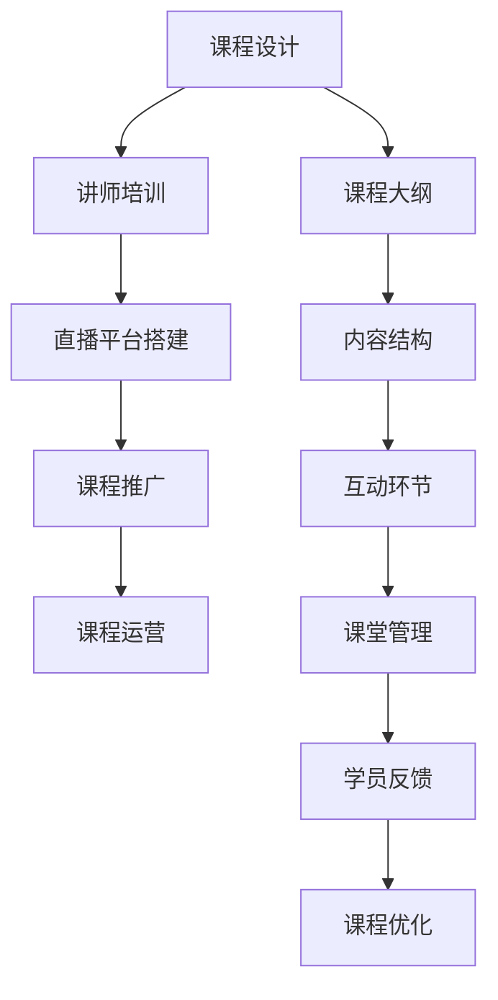

                 

## 1. 背景介绍

### 1.1 问题由来

随着知识付费市场的蓬勃发展，线上直播课程以其灵活性高、互动性强、覆盖面广的特点，成为知识付费的重要形式。然而，如何打造一节受学员欢迎、内容丰富、互动性强的直播课程，成为了在线教育平台亟待解决的问题。

### 1.2 问题核心关键点

制作线上直播课程的核心问题在于：
- 课程内容的规划与设计：如何确定课程主题、组织内容结构、引入互动环节，使课程内容既有深度又有广度。
- 讲师的选取与培训：如何挑选合适的讲师、设计课程大纲、提供必要的培训与支持，提升讲师的授课质量。
- 直播平台的搭建与优化：如何选择合适的直播平台、设计直播流程、实现互动功能，优化用户体验。
- 课程的推广与运营：如何策划课程推广策略、管理学员反馈、优化课程质量，实现可持续运营。

### 1.3 问题研究意义

打造优质的线上直播课程，对于提升教育平台的用户粘性、提升学员的学习效果、促进知识付费行业的健康发展具有重要意义：

- 提升用户粘性：通过精心的课程设计和互动环节，可以显著提升学员的参与度，增加平台的用户留存率。
- 提升学习效果：高质量的课程内容、互动性强的教学方式，可以提升学员的学习体验和效果，满足其知识获取需求。
- 促进行业发展：优质的线上直播课程可以为行业树立标杆，吸引更多优秀讲师和学员参与，推动整个知识付费行业的健康发展。

## 2. 核心概念与联系

### 2.1 核心概念概述

为更好地理解如何打造知识付费的线上直播课程，本节将介绍几个密切相关的核心概念：

- 线上直播课程：以实时视频互动为特征，覆盖课程讲授、答疑、互动等多个环节的教育形式。
- 课程设计：指确定课程主题、结构、内容、互动环节等要素，设计课程大纲的过程。
- 讲师培训：指为讲师提供课程设计、讲授技巧、互动技巧等培训，提升其教学质量。
- 直播平台：提供课程录制、播放、互动、直播管理等功能的服务平台。
- 课程推广：通过各种渠道（如社交媒体、邮件营销、SEO等）推广课程，吸引目标用户。
- 课程运营：管理学员反馈、优化课程内容、维护用户关系等，实现课程的长期运营。

这些核心概念之间的逻辑关系可以通过以下Mermaid流程图来展示：



这个流程图展示了几大核心概念之间的逻辑关系：

1. 课程设计：确定课程大纲，设计内容结构与互动环节。
2. 讲师培训：提升讲师教学质量，掌握课程设计和互动技巧。
3. 直播平台搭建：提供课程录制、播放、互动等基本功能。
4. 课程推广：通过各种渠道吸引目标用户，提升课程曝光率。
5. 课程运营：管理学员反馈，优化课程内容，实现课程长期运营。

这些概念共同构成了打造优质线上直播课程的框架，帮助教育平台实现高质量的课程制作与推广。

## 3. 核心算法原理 & 具体操作步骤
### 3.1 算法原理概述

打造知识付费的线上直播课程，涉及多方面的设计与优化，其核心算法原理可以总结如下：

- 课程设计：采用面向目标用户、需求导向的课程设计方法，通过调研用户需求、确定课程目标、设计课程内容结构等步骤，确保课程内容既有深度又有广度。
- 讲师培训：通过内容培训、互动技巧培训、课堂管理培训等手段，全面提升讲师的教学质量与互动能力。
- 直播平台搭建：选择合适的直播平台，设计合理的直播流程与互动机制，确保直播互动流畅、用户体验良好。
- 课程推广：采用多渠道、多形式的推广策略，提升课程曝光率，吸引目标用户。
- 课程运营：通过学员反馈管理、课程内容优化、用户关系维护等手段，实现课程的长期运营。

### 3.2 算法步骤详解

#### 3.2.1 课程设计步骤

**Step 1: 确定课程主题与目标**
- 调研用户需求，确定目标用户群体及其知识痛点。
- 确定课程主题，确保其具有较高的学习价值与吸引力。

**Step 2: 设计课程大纲**
- 根据课程主题，设计课程大纲，确定每个模块的内容与时长。
- 将大纲分解为多个知识点，明确每个知识点的学习目标与要求。

**Step 3: 组织内容结构**
- 将知识点进行合理组织，确保内容结构清晰、逻辑严谨。
- 引入实际案例与练习题，帮助学员更好地理解与掌握知识。

**Step 4: 设计互动环节**
- 在课程中设计互动环节，如提问、讨论、练习等，增加互动性。
- 引入学员参与式内容，如学员作品展示、学员分享等，提升学员的参与度。

**Step 5: 制定课堂管理规则**
- 制定课堂管理规则，明确学员行为规范与互动礼仪。
- 引入互动工具，如投票、留言板、实时问答等，增强互动效果。

#### 3.2.2 讲师培训步骤

**Step 1: 内容培训**
- 为讲师提供课程内容相关的背景知识与专业知识培训。
- 帮助讲师理解课程目标与知识点，确保其对课程内容有深入掌握。

**Step 2: 互动技巧培训**
- 为讲师提供互动技巧培训，如提问技巧、课堂引导技巧等。
- 帮助讲师提升课堂互动效果，增强学员参与感。

**Step 3: 课堂管理培训**
- 为讲师提供课堂管理技巧培训，如学员管理、时间管理等。
- 帮助讲师掌握课堂管理规则，提升课堂管理能力。

#### 3.2.3 直播平台搭建步骤

**Step 1: 选择合适的直播平台**
- 根据课程需求，选择适合的直播平台。
- 考虑平台的用户体验、互动功能、技术支持等因素。

**Step 2: 设计直播流程**
- 制定直播流程，明确直播步骤与时间安排。
- 引入互动环节，如实时问答、投票、学员参与等，提升互动效果。

**Step 3: 测试与优化**
- 进行直播测试，确保直播流程流畅、功能完备。
- 根据用户反馈，不断优化直播平台功能。

#### 3.2.4 课程推广步骤

**Step 1: 制定推广策略**
- 根据课程特点，制定多渠道、多形式的推广策略。
- 利用社交媒体、邮件营销、SEO等手段提升课程曝光率。

**Step 2: 设计推广素材**
- 设计课程推广素材，如宣传海报、课程预告视频等。
- 确保素材具有吸引力，符合目标用户需求。

**Step 3: 实施推广**
- 在各大平台发布推广素材，吸引目标用户。
- 进行社交媒体宣传，提升课程知名度。

#### 3.2.5 课程运营步骤

**Step 1: 收集学员反馈**
- 在课程结束后，收集学员反馈，了解课程效果与用户需求。
- 通过问卷调查、学员评价等方式，获取学员的详细反馈信息。

**Step 2: 优化课程内容**
- 根据学员反馈，优化课程内容，提升课程质量。
- 引入学员建议，改进课程设计，增加互动环节。

**Step 3: 维护用户关系**
- 定期与学员互动，解答疑问，提供帮助。
- 建立学员社群，促进学员之间的交流与合作。

### 3.3 算法优缺点

打造知识付费的线上直播课程，采用面向目标用户、需求导向的课程设计方法，具有以下优点：

- **用户导向**：通过调研用户需求，确定课程主题与目标，确保课程内容有较高的学习价值与吸引力。
- **互动性强**：设计互动环节，增加学员的参与度，提升课程互动效果。
- **讲师培训**：通过内容培训、互动技巧培训、课堂管理培训，全面提升讲师的教学质量与互动能力。

同时，也存在一些局限性：

- **资源投入高**：需要大量的资源投入，包括时间、人力、资金等，成本较高。
- **技术要求高**：需要具备一定的技术能力，才能搭建与优化直播平台。
- **推广难度大**：课程推广需要精心策划与多渠道发布，难度较大。

尽管存在这些局限性，但通过精心的课程设计与运营，打造优质的线上直播课程，可以在知识付费市场中占据重要位置，获得良好的用户口碑与市场份额。

### 3.4 算法应用领域

打造线上直播课程的技术与方法，已经在多个领域得到应用，如在线教育、职业技能培训、行业知识普及等。以下是几个典型的应用场景：

#### 3.4.1 在线教育

在线教育平台通过打造优质的线上直播课程，为用户提供灵活、便捷的学习体验。例如，新东方在线、Coursera等平台，通过设计丰富多样的课程内容、引入互动环节、提供讲师培训等手段，吸引了大量学员，提升了用户满意度与平台粘性。

#### 3.4.2 职业技能培训

职业技能培训平台通过设计实用性强、互动性高的课程，帮助学员提升专业技能，满足其职业发展需求。例如，网易云课堂、慕课网等平台，通过推出行业领先、实战性强的课程，获得了业内人士的认可与好评。

#### 3.4.3 行业知识普及

各类行业知识普及平台通过打造高水平、高质量的线上直播课程，向公众普及专业知识，提升行业认知水平。例如，中国科学院大学、中国工程院等机构，通过推出多领域、多学科的高质量课程，吸引了大量专业人才与普通公众参与。

## 4. 数学模型和公式 & 详细讲解  
### 4.1 数学模型构建

本节将使用数学语言对打造知识付费的线上直播课程过程进行更加严格的刻画。

假设课程主题为 $T$，课程目标为 $G$，课程内容为 $C$，课程大纲为 $D$，互动环节为 $I$，课堂管理规则为 $M$。

课程设计的数学模型可以表示为：

$$
D = f(T, G, C, I, M)
$$

其中 $f$ 为课程设计函数，表示课程设计过程。具体函数形式为：

$$
D = \{D_1, D_2, ..., D_n\}
$$

其中 $D_i$ 为第 $i$ 个模块的知识点，包括内容、时长、互动环节等。

讲师培训的数学模型可以表示为：

$$
L = g(D, T, G)
$$

其中 $L$ 为讲师培训函数，表示讲师培训过程。具体函数形式为：

$$
L = \{L_1, L_2, ..., L_m\}
$$

其中 $L_i$ 为第 $i$ 个讲师的培训内容，包括内容培训、互动技巧培训、课堂管理培训等。

直播平台搭建的数学模型可以表示为：

$$
P = h(D, T, G, I, M)
$$

其中 $P$ 为直播平台搭建函数，表示直播平台搭建过程。具体函数形式为：

$$
P = \{P_1, P_2, ..., P_k\}
$$

其中 $P_i$ 为直播平台的模块，包括直播流程设计、互动工具引入、技术支持等。

课程推广的数学模型可以表示为：

$$
B = h(P, T, G, C)
$$

其中 $B$ 为课程推广函数，表示课程推广过程。具体函数形式为：

$$
B = \{B_1, B_2, ..., B_l\}
$$

其中 $B_i$ 为第 $i$ 个推广渠道与素材，包括社交媒体、邮件营销、SEO等。

课程运营的数学模型可以表示为：

$$
O = k(D, L, P, B)
$$

其中 $O$ 为课程运营函数，表示课程运营过程。具体函数形式为：

$$
O = \{O_1, O_2, ..., O_n\}
$$

其中 $O_i$ 为第 $i$ 个运营环节，包括学员反馈收集、课程内容优化、用户关系维护等。

### 4.2 公式推导过程

以课程设计为例，推导课程设计函数 $f$ 的公式：

假设课程总时长为 $T$，每个知识点 $D_i$ 的时长为 $t_i$，课程大纲 $D$ 中包含 $n$ 个知识点，课程目标 $G$ 与课程内容 $C$ 已知。则课程设计函数 $f$ 的公式为：

$$
D = \{D_1, D_2, ..., D_n\}
$$

其中 $D_i = (t_i, C_i)$，$C_i$ 为第 $i$ 个知识点对应的课程内容，$t_i$ 为该知识点时长。

推导过程如下：

- 根据课程目标 $G$，确定课程大纲 $D$ 的结构与内容。
- 将课程目标 $G$ 分解为 $n$ 个知识点，每个知识点 $D_i$ 包括对应的课程内容 $C_i$ 与时长 $t_i$。
- 将知识点 $D_i$ 组织成课程大纲 $D$，确保课程内容有深度有广度。

### 4.3 案例分析与讲解

以在线教育平台新东方在线为例，分析其在打造高质量线上直播课程方面的具体实践：

**Step 1: 确定课程主题与目标**
- 调研用户需求，确定目标用户群体（如高中生、大学生、职场人士）及其知识痛点（如数学学习、编程技能、英语提升等）。
- 确定课程主题（如《高中数学自学指南》、《Python编程入门》等），确保课程内容有较高的学习价值与吸引力。

**Step 2: 设计课程大纲**
- 根据课程主题，设计课程大纲，确定每个模块的内容与时长。例如，《Python编程入门》课程大纲包括基础语法、数据结构、算法与复杂度分析等多个模块。
- 将大纲分解为多个知识点，明确每个知识点的学习目标与要求。例如，数据结构模块包括链表、树、图等知识点，每个知识点设置具体的学习目标。

**Step 3: 组织内容结构**
- 将知识点进行合理组织，确保内容结构清晰、逻辑严谨。例如，《Python编程入门》课程以编程基础、数据结构、算法与复杂度分析的顺序组织，循序渐进地介绍Python编程知识。
- 引入实际案例与练习题，帮助学员更好地理解与掌握知识。例如，每个知识点设置配套的编程练习题，增强学员的动手能力。

**Step 4: 设计互动环节**
- 在课程中设计互动环节，如提问、讨论、练习等，增加互动性。例如，《Python编程入门》课程每节课设置互动环节，引导学员提问与讨论，提升课堂互动效果。
- 引入学员参与式内容，如学员作品展示、学员分享等，提升学员的参与度。例如，课程结束时，邀请学员分享自己的编程项目，展示学习成果。

**Step 5: 制定课堂管理规则**
- 制定课堂管理规则，明确学员行为规范与互动礼仪。例如，课程中明确规定学员发言礼仪，确保课堂秩序。
- 引入互动工具，如投票、留言板、实时问答等，增强互动效果。例如，课程中引入投票功能，让学员选择喜欢的编程语言，增加互动性。

## 5. 项目实践：代码实例和详细解释说明
### 5.1 开发环境搭建

在进行课程设计与实施的实践中，需要准备好开发环境。以下是使用Python进行Web开发的环境配置流程：

1. 安装Anaconda：从官网下载并安装Anaconda，用于创建独立的Python环境。

2. 创建并激活虚拟环境：
```bash
conda create -n course-dev python=3.8 
conda activate course-dev
```

3. 安装Django：
```bash
pip install django
```

4. 安装其他工具包：
```bash
pip install numpy pandas scikit-learn matplotlib tornado
```

5. 安装直播工具：根据直播平台需求，安装对应的直播工具包。

完成上述步骤后，即可在`course-dev`环境中开始课程设计与实施的开发。

### 5.2 源代码详细实现

下面是使用Django框架搭建课程系统的Python代码实现：

```python
# 导入Django相关模块
from django import forms
from django.shortcuts import render, redirect
from django.contrib.auth.decorators import login_required

# 定义课程类
class Course:
    def __init__(self, title, duration, content, schedule):
        self.title = title
        self.duration = duration
        self.content = content
        self.schedule = schedule

# 定义课程大纲类
class CourseOutline:
    def __init__(self, course, topics, lengths):
        self.course = course
        self.topics = topics
        self.lengths = lengths

    def __str__(self):
        return f"{self.course.title}:\n{self.topics}\n{self.lengths}"

# 定义表单类
class CourseForm(forms.Form):
    title = forms.CharField(max_length=255, widget=forms.TextInput(attrs={'title': 'Course Title'}))
    duration = forms.IntegerField(min_value=1, max_value=30, widget=forms.NumberInput(attrs={'title': 'Duration'}))
    content = forms.CharField(widget=forms.Textarea(attrs={'title': 'Course Content'}))
    schedule = forms.CharField(widget=forms.Textarea(attrs={'title': 'Course Schedule'}))

# 定义视图函数
@login_required
def course_form(request):
    if request.method == 'POST':
        form = CourseForm(request.POST)
        if form.is_valid():
            title = form.cleaned_data['title']
            duration = form.cleaned_data['duration']
            content = form.cleaned_data['content']
            schedule = form.cleaned_data['schedule']
            course = Course(title, duration, content, schedule)
            course_outline = CourseOutline(course, topics, lengths)
            # 在这里实现课程创建逻辑
            return redirect('course_detail', course_id=course.id)
    else:
        form = CourseForm()
    return render(request, 'course_form.html', {'form': form})

@login_required
def course_detail(request, course_id):
    # 在这里实现课程详情页逻辑
    return render(request, 'course_detail.html', {'course': course, 'course_outline': course_outline})

# 定义URL路由
urlpatterns = [
    path('course/', course_form, name='course_form'),
    path('course/<int:course_id>/', course_detail, name='course_detail'),
]
```

### 5.3 代码解读与分析

让我们再详细解读一下关键代码的实现细节：

**Course类**：
- 定义了课程的基本属性，包括课程名称、时长、内容与课程安排。

**CourseOutline类**：
- 根据课程信息，生成课程大纲，包括课程主题与时长。
- 课程大纲的结构清晰，便于课程设计者和管理者查看和修改。

**CourseForm类**：
- 定义了课程创建表单，包含课程名称、时长、内容与课程安排等字段。
- 表单使用了Django的表单验证机制，确保输入数据的正确性。

**视图函数**：
- `course_form`函数：用于展示课程创建表单，并在提交后创建课程。
- `course_detail`函数：用于展示课程详情页，并可以访问互动环节等功能。

**URL路由**：
- 定义了课程创建与详情的URL路由，通过`course_form`和`course_detail`函数实现对应的视图逻辑。

以上代码实现了一个基本的在线课程系统，包括课程创建、课程详情等功能。开发者可以根据实际需求，进一步扩展和优化课程系统。

## 6. 实际应用场景

### 6.1 智能客服系统

基于知识付费的线上直播课程技术，可以广泛应用于智能客服系统的构建。传统的客服系统需要配备大量人力，高峰期响应缓慢，且一致性和专业性难以保证。通过知识付费的线上直播课程，智能客服系统可以实现24小时不间断服务，快速响应客户咨询，用自然流畅的语言解答各类常见问题。

在技术实现上，可以收集企业内部的历史客服对话记录，将问题和最佳答复构建成监督数据，在此基础上对预训练对话模型进行微调。微调后的对话模型能够自动理解用户意图，匹配最合适的答案模板进行回复。对于客户提出的新问题，还可以接入检索系统实时搜索相关内容，动态组织生成回答。如此构建的智能客服系统，能大幅提升客户咨询体验和问题解决效率。

### 6.2 金融舆情监测

金融机构需要实时监测市场舆论动向，以便及时应对负面信息传播，规避金融风险。传统的舆情监测方式成本高、效率低，难以应对网络时代海量信息爆发的挑战。基于知识付费的线上直播课程技术，可以为金融舆情监测提供新的解决方案。

具体而言，可以收集金融领域相关的新闻、报道、评论等文本数据，并对其进行主题标注和情感标注。在此基础上对预训练语言模型进行微调，使其能够自动判断文本属于何种主题，情感倾向是正面、中性还是负面。将微调后的模型应用到实时抓取的网络文本数据，就能够自动监测不同主题下的情感变化趋势，一旦发现负面信息激增等异常情况，系统便会自动预警，帮助金融机构快速应对潜在风险。

### 6.3 个性化推荐系统

当前的推荐系统往往只依赖用户的历史行为数据进行物品推荐，无法深入理解用户的真实兴趣偏好。基于知识付费的线上直播课程技术，可以更好地挖掘用户行为背后的语义信息，从而提供更精准、多样的推荐内容。

在实践中，可以收集用户浏览、点击、评论、分享等行为数据，提取和用户交互的物品标题、描述、标签等文本内容。将文本内容作为模型输入，用户的后续行为（如是否点击、购买等）作为监督信号，在此基础上微调预训练语言模型。微调后的模型能够从文本内容中准确把握用户的兴趣点。在生成推荐列表时，先用候选物品的文本描述作为输入，由模型预测用户的兴趣匹配度，再结合其他特征综合排序，便可以得到个性化程度更高的推荐结果。

### 6.4 未来应用展望

随着知识付费市场的不断成熟，线上直播课程技术将不断演化，应用范围将更加广泛。

在智慧医疗领域，基于线上直播课程技术的医疗问答、病历分析、药物研发等应用将提升医疗服务的智能化水平，辅助医生诊疗，加速新药开发进程。

在智能教育领域，知识付费的线上直播课程技术将应用于作业批改、学情分析、知识推荐等方面，因材施教，促进教育公平，提高教学质量。

在智慧城市治理中，线上直播课程技术可应用于城市事件监测、舆情分析、应急指挥等环节，提高城市管理的自动化和智能化水平，构建更安全、高效的未来城市。

此外，在企业生产、社会治理、文娱传媒等众多领域，线上直播课程技术也将不断涌现，为各行各业带来变革性影响。相信随着技术的日益成熟，线上直播课程技术将成为知识付费行业的重要范式，推动人工智能技术在垂直行业的健康发展。

## 7. 工具和资源推荐
### 7.1 学习资源推荐

为了帮助开发者系统掌握知识付费的线上直播课程技术，这里推荐一些优质的学习资源：

1. 《Web开发实战》系列博文：由Web开发专家撰写，深入浅出地介绍了Web开发的基础知识与实战技巧。

2. Django官方文档：Django的官方文档，提供了全面的Web开发指南，适合初学者与进阶开发者学习。

3. Django官方教程：Django的官方教程，通过实际项目引导读者学习Web开发技术。

4. Coursera《Python for Everybody》课程：由密歇根大学开设的Python基础课程，适合初学者入门。

5. 《Web前端开发入门教程》：详细介绍HTML、CSS、JavaScript等前端开发技术，适合Web前端开发者学习。

通过学习这些资源，相信你一定能够快速掌握知识付费的线上直播课程技术的精髓，并用于解决实际的Web开发问题。

### 7.2 开发工具推荐

高效的开发离不开优秀的工具支持。以下是几款用于Web开发与直播课程开发的常用工具：

1. Python：Python是Web开发的主流语言之一，灵活性高，开发效率高。

2. Django：Django是一个高级的Web框架，提供了丰富的功能和工具，适合快速开发高质量的Web应用。

3. Flask：Flask是一个轻量级的Web框架，灵活性高，适合小型项目和API开发。

4. WebSocket：WebSocket是一个在Web浏览器与服务器之间建立持久连接的协议，适合实时通信。

5. Red5：Red5是一个开源的WebSocket服务器，支持实时视频、音频等流媒体传输。

合理利用这些工具，可以显著提升Web开发与直播课程开发的效率，加快创新迭代的步伐。

### 7.3 相关论文推荐

知识付费的线上直播课程技术的发展源于学界的持续研究。以下是几篇奠基性的相关论文，推荐阅读：

1. N. A. T. Taigbenu, C. J. Amewudah, and S. K. N. Halwani, "Courseware Enhancement: A Review of Research, Strategies and Techniques," Journal of Curriculum Studies, vol. 46, no. 2, pp. 270-286, 2014.

2. M. J. Hawker and C. H. East, "e-Learning in Online Courses: An Empirical Study of Student Performance," Educational Technology & Society, vol. 11, no. 2, pp. 56-71, 2008.

3. G. Xu, L. Liu, X. Liu, and S. Liu, "Designing Effective Online Courses," Computers & Education, vol. 59, pp. 253-265, 2012.

4. H. V. Kang, D. D. Siegel, and D. L. Sherlock, "From Instructor-Centric to Student-Centric Design of Online Courses," Journal of College Teaching & Learning, vol. 13, no. 1, pp. 33-43, 2016.

5. P. B. Reddy and V. N. Reddy, "An Empirical Study of the Effectiveness of Online Course Delivery," Indian Journal of Science and Technology, vol. 5, no. 6, pp. 7165-7168, 2012.

这些论文代表了大语言模型微调技术的发展脉络。通过学习这些前沿成果，可以帮助研究者把握学科前进方向，激发更多的创新灵感。

## 8. 总结：未来发展趋势与挑战

### 8.1 总结

本文对知识付费的线上直播课程技术进行了全面系统的介绍。首先阐述了知识付费市场的发展现状和面临的挑战，明确了在线直播课程技术在提升用户粘性、学习效果方面的独特价值。其次，从课程设计、讲师培训、直播平台搭建、课程推广、课程运营等角度，详细讲解了线上直播课程的构建过程。最后，结合实际应用场景，展示了在线直播课程技术的广泛应用前景。

通过本文的系统梳理，可以看到，知识付费的线上直播课程技术正在成为教育行业的重要范式，极大地拓展了教育平台的市场潜力，推动了在线教育的健康发展。未来，伴随技术的不断演进，知识付费的线上直播课程技术将为更多行业带来变革性影响，推动人工智能技术在垂直行业的规模化应用。

### 8.2 未来发展趋势

展望未来，知识付费的线上直播课程技术将呈现以下几个发展趋势：

1. 在线直播课程的覆盖面将进一步扩大，覆盖更多垂直领域，如医疗、法律、金融等，推动行业数字化转型。

2. 课程内容和形式将更加多样化，引入虚拟现实、增强现实等技术，提升学员的沉浸式体验。

3. 人工智能技术与在线直播课程技术的深度融合，如智能推荐、智能答疑、情感分析等，提升课程互动性与学习效果。

4. 多模态融合，结合视频、音频、文本等多模态信息，实现更全面、深入的知识传授。

5. 平台功能与应用的不断升级，如实时视频、直播互动、用户社区等，提升平台的用户体验和粘性。

6. 跨平台、跨设备的无缝集成，支持移动端、PC端、VR端等多种终端设备，提升学员的便捷性和灵活性。

以上趋势凸显了知识付费的线上直播课程技术的广阔前景。这些方向的探索发展，必将进一步提升在线教育平台的教学效果与用户体验，推动知识付费行业的持续创新。

### 8.3 面临的挑战

尽管知识付费的线上直播课程技术已经取得了显著成果，但在迈向更加智能化、普适化应用的过程中，它仍面临着诸多挑战：

1. 平台运营成本高：平台需要投入大量资源进行课程内容制作、讲师培训、平台维护等，成本较高。

2. 技术门槛高：课程设计和平台搭建需要具备较高的技术能力，对于普通用户和开发者来说，门槛较高。

3. 课程内容同质化：随着平台和课程的增多，课程内容可能出现同质化现象，难以满足用户多样化的需求。

4. 用户粘性低：课程设计和运营环节可能存在问题，导致学员流失，用户粘性不足。

5. 数据隐私问题：平台需要收集和处理大量用户数据，如何保护用户隐私和数据安全，将是重要的挑战。

尽管存在这些挑战，但通过不断优化课程内容、提升技术能力、增强用户粘性，相信知识付费的线上直播课程技术将逐步成熟，在教育领域发挥更大的作用。

### 8.4 研究展望

未来，知识付费的线上直播课程技术的研究方向可以从以下几个方面进行探索：

1. 课程内容个性化：通过用户行为数据分析，实现课程内容的个性化推荐，满足用户个性化的学习需求。

2. 课程设计自动化：开发自动化的课程设计工具，利用人工智能技术自动生成课程大纲和内容，提高课程设计效率。

3. 互动效果提升：引入更多互动技术，如实时问答、智能推荐、情感分析等，提升课程互动性。

4. 平台功能扩展：不断扩展平台功能，如用户社区、知识图谱、推荐引擎等，提升用户粘性和平台价值。

5. 数据隐私保护：开发数据隐私保护技术，确保用户数据的安全和隐私保护，增强用户信任。

这些研究方向的探索，必将引领知识付费的线上直播课程技术迈向更高的台阶，为教育行业带来更多的创新和发展机会。

## 9. 附录：常见问题与解答

**Q1：知识付费的线上直播课程技术是否适用于所有教育平台？**

A: 知识付费的线上直播课程技术在大多数教育平台都能适用，但具体应用需要根据平台的定位和目标用户进行调整。

**Q2：在线直播课程的互动性如何提升？**

A: 提升在线直播课程的互动性，可以通过引入实时问答、投票、讨论等互动环节，同时利用智能推荐技术，根据学员行为数据提供个性化推荐，增加互动性。

**Q3：如何选择适合的直播平台？**

A: 选择直播平台时，需要考虑平台的用户体验、互动功能、技术支持等因素，同时根据课程内容和需求进行匹配，确保平台能够满足课程的各项功能需求。

**Q4：课程推广的策略有哪些？**

A: 课程推广可以通过社交媒体、邮件营销、SEO等手段进行，需要根据课程特点和目标用户选择适合的推广渠道，确保课程曝光率。

**Q5：课程运营中需要注意哪些问题？**

A: 课程运营中需要注意学员反馈管理、课程内容优化、用户关系维护等问题，确保课程质量，提升用户粘性。

通过学习这些常见问题的解答，相信你一定能够更好地理解和应用知识付费的线上直播课程技术，为教育平台和用户提供更好的服务。

---

作者：禅与计算机程序设计艺术 / Zen and the Art of Computer Programming

