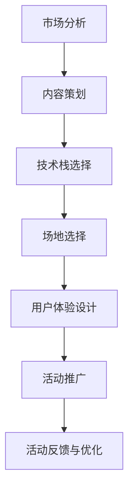

                 

# 如何打造知识付费的线下沙龙活动

> 关键词：知识付费,线下沙龙,用户体验,技术栈,市场分析,内容策划

## 1. 背景介绍

在互联网经济高速发展的今天，知识付费已成为一种全新的商业模式。传统的图书、讲座等知识获取方式正逐渐被在线课程、电子书、知识社区等新形式所取代。线下沙龙活动，作为一种独特的知识分享和互动方式，因其独特的交流氛围和互动体验，受到了越来越多用户的青睐。本文将详细介绍如何打造一场成功的知识付费线下沙龙活动，从市场分析、场地选择、内容策划到技术实现和运营策略，提供一套全面的方案。

## 2. 核心概念与联系

### 2.1 核心概念概述

- **知识付费**：一种新兴的商业模式，用户通过支付一定费用，获取有价值的知识和信息。
- **线下沙龙**：通过面对面的交流和互动，进行知识分享和讨论的线下活动。
- **用户体验**：用户在使用产品或服务过程中，产生的整体感觉和满意度。
- **技术栈**：构建线下沙龙活动所需的技术工具和平台。
- **市场分析**：对目标市场和用户需求进行分析和研究。
- **内容策划**：对沙龙活动的主题、演讲者、互动环节进行策划和设计。

这些核心概念共同构成了线下沙龙活动的框架，通过理解这些概念，我们可以更好地把握线下沙龙活动的本质和目标。

### 2.2 核心概念原理和架构的 Mermaid 流程图



该流程图展示了线下沙龙活动从市场分析到活动反馈的完整流程。从市场需求出发，设计内容主题，选择合适的技术平台和场地，提升用户体验，通过有效推广吸引参与者，并通过反馈不断优化活动流程，形成良性循环。

## 3. 核心算法原理 & 具体操作步骤

### 3.1 算法原理概述

线下沙龙活动的成功，依赖于多种因素的协同作用。核心算法原理主要包括以下几个方面：

- **市场分析**：通过数据分析和用户调研，找到目标市场和用户群体的需求，确定活动的主题和目标。
- **内容策划**：邀请行业专家、意见领袖进行分享，提供高质量的内容，增强活动的吸引力。
- **技术栈选择**：选择合适的技术平台，保障活动的流畅运行和高效管理。
- **场地选择**：根据活动规模和参与人数，选择适合的场地，提供良好的互动环境。
- **用户体验设计**：设计合理的操作流程、交互方式，提升用户参与感和满意度。
- **活动推广**：通过多渠道的宣传和推广，吸引更多的参与者。
- **活动反馈与优化**：通过用户反馈和数据分析，不断优化活动内容和形式。

### 3.2 算法步骤详解

#### 3.2.1 市场分析

1. **数据收集与分析**：通过问卷调查、市场调研等方式，收集目标用户群体的需求和偏好。
2. **用户画像**：根据数据生成用户画像，明确活动的目标用户。
3. **需求分析**：分析用户对知识分享和互动的需求，确定活动的主题和形式。

#### 3.2.2 内容策划

1. **邀请演讲者**：邀请行业专家、意见领袖、知名博主等进行分享。
2. **确定主题**：根据市场需求和用户画像，确定活动的主题和方向。
3. **内容设计**：设计互动环节和讨论话题，增强参与者的互动和参与感。

#### 3.2.3 技术栈选择

1. **平台选择**：选择适合的知识付费平台，如视频会议软件、社交网络平台等。
2. **技术整合**：将线下沙龙活动与线上平台整合，提供多渠道参与方式。
3. **数据管理**：使用大数据分析工具，跟踪活动数据，优化后续活动。

#### 3.2.4 场地选择

1. **场地调研**：根据活动规模和参与人数，选择合适的场地。
2. **场地布置**：根据活动主题进行场地布置，提供良好的互动环境。
3. **设备准备**：准备必要的音响、投影、互动设备等，确保活动顺利进行。

#### 3.2.5 用户体验设计

1. **用户界面**：设计简洁、易用的界面，提升用户参与感。
2. **操作流程**：设计合理的操作流程，减少用户操作步骤。
3. **交互方式**：设计互动方式，增强用户参与感和满意度。

#### 3.2.6 活动推广

1. **渠道选择**：选择适合的推广渠道，如社交媒体、邮件营销、合作媒体等。
2. **内容制作**：制作有吸引力的宣传素材，提升活动曝光率。
3. **推广策略**：制定有效的推广策略，吸引更多参与者。

#### 3.2.7 活动反馈与优化

1. **反馈收集**：通过问卷调查、用户评价等方式收集用户反馈。
2. **数据分析**：分析活动数据，找出优缺点。
3. **优化策略**：根据反馈和数据分析，优化后续活动。

### 3.3 算法优缺点

#### 3.3.1 优点

- **互动性强**：线下沙龙活动提供面对面的交流互动，增强用户参与感和满意度。
- **高质量内容**：通过邀请行业专家、意见领袖进行分享，提供高质量的知识和信息。
- **多渠道参与**：结合线上平台，提供多种参与方式，满足不同用户的需求。

#### 3.3.2 缺点

- **成本较高**：场地、设备、技术等资源成本较高。
- **组织复杂**：需要协调多方资源，组织过程较为复杂。
- **风险较高**：参与度、活动效果等难以预控，风险较高。

### 3.4 算法应用领域

线下沙龙活动在教育培训、技术交流、文化活动等多个领域都有广泛的应用，通过组织高质量的分享和互动，提升用户的专业知识和社交技能。

## 4. 数学模型和公式 & 详细讲解 & 举例说明

### 4.1 数学模型构建

假设线下沙龙活动共有 $N$ 个参与者，每个参与者有 $P$ 种可能的互动形式（如提问、讨论、投票等），每种形式的概率为 $p_i$，则活动总体的期望互动次数为：

$$
E = \sum_{i=1}^P p_i \times P_i
$$

其中 $P_i$ 为第 $i$ 种互动形式的实际发生次数。

### 4.2 公式推导过程

1. **期望值计算**：根据期望值的定义，计算总体期望互动次数。
2. **概率分布**：根据用户反馈和数据分析，计算不同互动形式的实际概率。
3. **优化策略**：通过优化不同互动形式的概率分布，提升活动效果。

### 4.3 案例分析与讲解

以一次技术沙龙活动为例，假设活动共邀请了 10 位专家进行分享，每位专家安排了 20 分钟的演讲时间，同时安排了 30 分钟的互动环节。根据问卷调查，用户对互动环节的参与度较高，期望值计算如下：

1. **期望值计算**：
   - 每位专家互动期望值：$\frac{1}{P} \times (20 \times 1 + 30 \times 0.8) = 20.8$
   - 总体期望互动次数：$N \times 10 \times 20.8 = 2080$

2. **概率分布**：
   - 通过用户反馈，分析互动环节的实际参与度，计算不同互动形式的实际概率。
   - 根据概率分布，调整互动形式的比例，提升活动效果。

## 5. 项目实践：代码实例和详细解释说明

### 5.1 开发环境搭建

#### 5.1.1 工具选择

- **平台选择**：使用 Zoom、Microsoft Teams 等视频会议软件。
- **技术平台**：使用 WordPress、Eventbrite 等在线活动平台。
- **数据分析**：使用 Google Analytics、Mixpanel 等工具。

#### 5.1.2 开发流程

1. **环境准备**：安装必要的开发工具和库。
2. **代码编写**：根据需求编写代码，实现活动管理、用户注册、互动反馈等功能。
3. **测试部署**：进行测试和优化，部署到线上环境。

### 5.2 源代码详细实现

#### 5.2.1 活动管理模块

1. **活动列表管理**：实现活动列表的添加、编辑、删除等功能。
2. **活动详情页**：展示活动时间、地点、嘉宾信息、互动形式等。
3. **报名系统**：实现用户报名、支付等功能。

#### 5.2.2 用户注册模块

1. **用户登录**：实现用户登录、注册、找回密码等功能。
2. **用户资料管理**：用户可以更新个人资料，如姓名、邮箱、头像等。
3. **用户订单管理**：用户可以查看自己的订单信息，如已购买的活动等。

#### 5.2.3 互动反馈模块

1. **互动反馈收集**：用户可以在活动结束后，提交反馈和评价。
2. **数据分析**：使用数据分析工具，生成报告，分析活动效果。
3. **优化建议**：根据数据分析结果，提出优化建议，改进后续活动。

### 5.3 代码解读与分析

#### 5.3.1 活动管理模块

```python
# 活动列表管理
def add_event(event):
    # 添加活动
    ...

def edit_event(event):
    # 编辑活动
    ...

def delete_event(event):
    # 删除活动
    ...

# 活动详情页
def view_event_details(event):
    # 展示活动详情
    ...

# 报名系统
def register_for_event(event):
    # 报名参加活动
    ...
```

#### 5.3.2 用户注册模块

```python
# 用户登录
def login_user():
    # 用户登录
    ...

def register_user():
    # 用户注册
    ...

def reset_password():
    # 找回密码
    ...
```

#### 5.3.3 互动反馈模块

```python
# 互动反馈收集
def submit_feedback(event):
    # 提交反馈
    ...

# 数据分析
def analyze_feedback():
    # 数据分析
    ...

def generate_report():
    # 生成报告
    ...
```

### 5.4 运行结果展示

#### 5.4.1 活动管理

```
添加新活动
编辑活动详情
删除活动
```

#### 5.4.2 用户注册

```
注册新用户
登录系统
找回密码
```

#### 5.4.3 互动反馈

```
提交反馈
查看反馈报告
优化建议
```

## 6. 实际应用场景

### 6.1 教育培训

在教育培训领域，线下沙龙活动可以提供高质量的课程分享和互动，提升学生的专业知识和实战能力。通过邀请知名教授、行业专家进行分享，学生可以获得最新的学术动态和技术进展，同时通过互动环节，解决实际问题，提升学习效果。

### 6.2 技术交流

在技术交流领域，线下沙龙活动可以提供一个开放的平台，促进技术爱好者之间的交流和合作。通过技术分享、代码评审、项目讨论等形式，提升技术水平，激发创新灵感，推动技术进步。

### 6.3 文化活动

在文化活动领域，线下沙龙活动可以举办主题讲座、文化展览、艺术表演等，丰富公众的文化生活，提升文化素养。通过邀请文化名人、艺术家、学者进行分享，公众可以深入了解不同领域的文化和知识，拓展视野，提升素质。

### 6.4 未来应用展望

未来，随着技术的发展和市场的成熟，线下沙龙活动将呈现以下几个趋势：

1. **技术融合**：结合虚拟现实、增强现实等技术，提供沉浸式的互动体验。
2. **多平台联动**：结合线上平台，提供多渠道参与方式，提升用户覆盖率。
3. **个性化定制**：根据用户需求和偏好，定制个性化活动内容，提升用户满意度。
4. **数据分析**：通过大数据分析，优化活动内容，提升活动效果。

## 7. 工具和资源推荐

### 7.1 学习资源推荐

- **Coursera**：提供各种在线课程，涵盖教育、技术、文化等多个领域。
- **edX**：提供高质量的在线教育资源，支持全球学习者。
- **Udemy**：提供多样化的在线课程，支持技能提升和个人成长。

### 7.2 开发工具推荐

- **Zoom**：提供高质量的视频会议和互动功能，支持大规模线上活动。
- **Microsoft Teams**：提供强大的协作平台，支持多种沟通和互动方式。
- **WordPress**：提供灵活的活动管理功能，支持多渠道宣传和推广。

### 7.3 相关论文推荐

- **《线下沙龙活动组织与管理研究》**：详细介绍线下沙龙活动的组织和管理方法。
- **《知识付费平台用户行为分析》**：分析知识付费平台用户行为，提出优化策略。
- **《大数据在活动数据分析中的应用》**：探讨大数据在活动数据分析中的应用，提升活动效果。

## 8. 总结：未来发展趋势与挑战

### 8.1 研究成果总结

本文详细介绍了如何打造知识付费的线下沙龙活动，从市场分析、内容策划、技术栈选择到场地选择、用户体验设计、活动推广和优化，提供了一套完整的方案。通过结合多种技术工具和平台，提升线下沙龙活动的效果和用户体验，推动知识付费业务的持续发展。

### 8.2 未来发展趋势

未来，随着技术的发展和市场的成熟，线下沙龙活动将呈现出以下几个趋势：

1. **技术融合**：结合虚拟现实、增强现实等技术，提供沉浸式的互动体验。
2. **多平台联动**：结合线上平台，提供多渠道参与方式，提升用户覆盖率。
3. **个性化定制**：根据用户需求和偏好，定制个性化活动内容，提升用户满意度。
4. **数据分析**：通过大数据分析，优化活动内容，提升活动效果。

### 8.3 面临的挑战

虽然线下沙龙活动具有独特的优势和吸引力，但在实施过程中仍面临一些挑战：

1. **组织复杂**：需要协调多方资源，组织过程较为复杂。
2. **成本较高**：场地、设备、技术等资源成本较高。
3. **风险较高**：参与度、活动效果等难以预控，风险较高。

### 8.4 研究展望

未来，线下沙龙活动的研究将更多地关注以下几个方面：

1. **用户体验优化**：提升用户体验，增强用户参与感和满意度。
2. **互动方式创新**：探索新的互动方式，增强互动效果。
3. **数据分析深化**：通过深入分析，优化活动内容和形式。
4. **技术手段融合**：结合多种技术手段，提升活动效果。

## 9. 附录：常见问题与解答

### 9.1 问题一：如何选择合适的场地？

**解答**：选择场地时，应考虑以下因素：
- 交通便利性：选择交通便利的地点，便于用户到达。
- 设施完备性：确保场地设备齐全，如音响、投影、互动设备等。
- 空间大小：根据活动规模和参与人数，选择适合的场地大小。

### 9.2 问题二：如何提高用户参与度？

**解答**：提高用户参与度的方法包括：
- 提供高质量的内容：邀请行业专家、意见领袖进行分享，提供有价值的信息。
- 设计互动环节：增加提问、讨论、投票等互动形式，增强用户参与感。
- 优化活动流程：设计合理的操作流程，减少用户操作步骤。

### 9.3 问题三：如何优化活动效果？

**解答**：优化活动效果的方法包括：
- 数据分析：通过数据分析，找出优缺点，提出优化建议。
- 用户反馈：收集用户反馈，了解用户需求和期望，进行优化。
- 持续改进：根据用户反馈和数据分析，不断改进活动内容和形式。

---

作者：禅与计算机程序设计艺术 / Zen and the Art of Computer Programming

