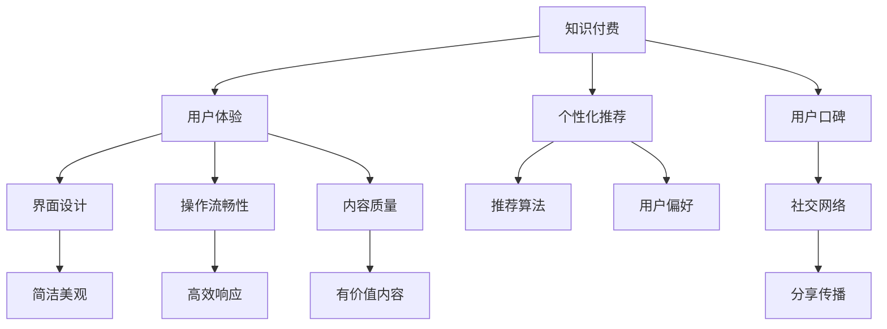

                 

# 如何提高知识付费产品的用户口碑

> 关键词：知识付费,用户体验,产品迭代,用户行为分析,个性化推荐,口碑管理,社交网络

## 1. 背景介绍

### 1.1 问题由来
随着知识付费市场的热度持续升温，越来越多的内容生产者和平台方开始深入探索如何吸引用户、提升用户黏性，从而实现商业变现。然而，尽管平台上内容质量上乘，但用户流失和口碑下降问题依然频发。究其根本，主要在于缺乏对用户需求和行为深层次的理解，内容推荐方式和用户体验设计有待提升。

### 1.2 问题核心关键点
通过提升知识付费产品的用户体验和口碑，可以促进平台用户数量增长、提高用户活跃度和留存率，最终提升平台商业收益。具体措施包括：
- 深入分析用户行为，优化产品设计，提升用户体验。
- 实现个性化推荐，让用户接触到的内容更有价值。
- 强化口碑管理，通过用户口碑传播提升产品知名度和用户忠诚度。

## 2. 核心概念与联系

### 2.1 核心概念概述

为更好地理解如何提高知识付费产品的用户口碑，本节将介绍几个密切相关的核心概念：

- 知识付费：指用户通过付费购买知识内容，以提升自身知识和技能，实现个人或职业发展的过程。
- 用户体验(UX)：指用户使用产品或服务时的主观感受和体验，包括界面设计、操作流畅性、内容质量等多个方面。
- 个性化推荐系统：通过用户历史行为和偏好信息，推荐适合用户兴趣和需求的内容，提升用户满意度。
- 用户口碑：指用户对产品或服务的满意程度及其传播，通过社交网络、评价系统等方式体现。
- 社交网络(Social Network)：指用户通过关系网络分享和传播内容，增强产品影响力和用户粘性。

这些核心概念之间的逻辑关系可以通过以下Mermaid流程图来展示：



这个流程图展示了一些核心概念之间的联系：

1. 知识付费产品的用户体验(UX)直接影响用户满意度。
2. 个性化推荐系统能提升用户满意度，从而提升用户口碑。
3. 用户口碑通过社交网络传播，进一步影响新用户转化。
4. 界面设计、操作流畅性和内容质量是提升用户体验的关键因素。
5. 推荐算法和用户偏好则是实现个性化推荐的核心。

这些概念共同构成了知识付费产品的用户体验和口碑管理框架，帮助内容生产者和平台方更好地优化产品和服务，提升用户忠诚度和商业收益。

## 3. 核心算法原理 & 具体操作步骤
### 3.1 算法原理概述

提升知识付费产品的用户口碑，主要通过优化用户体验、个性化推荐和口碑管理三个方面来实现。

1. **用户体验优化**：通过界面设计、操作流畅性和内容质量等方面的改进，提升用户在使用知识付费产品时的整体满意度。
2. **个性化推荐**：结合用户历史行为和偏好信息，通过算法推荐适合用户的内容，增强用户对平台的粘性。
3. **口碑管理**：通过鼓励用户分享和传播，提升产品知名度，并通过评价和反馈系统及时改进产品。

### 3.2 算法步骤详解

#### 用户体验优化

1. **界面设计**：优化产品的界面布局，使用简洁美观的设计风格，降低用户学习成本，提升使用愉悦感。
2. **操作流畅性**：优化用户的操作路径，减少等待时间和操作步骤，确保在各种设备上均能流畅运行。
3. **内容质量**：引入专业编辑和质量审核机制，保证内容的专业性和权威性，满足用户的学习需求。

#### 个性化推荐

1. **用户行为分析**：收集用户的浏览记录、购买历史、评价反馈等数据，通过数据分析工具如K-means、LDA等，发现用户的兴趣和偏好。
2. **推荐算法构建**：选择适当的推荐算法如协同过滤、内容推荐、混合推荐等，并结合用户历史数据进行模型训练。
3. **推荐效果评估**：通过A/B测试、用户满意度调查等手段，评估个性化推荐的实际效果，及时调整算法参数。

#### 口碑管理

1. **社交网络激励**：提供用户评价和分享的功能，通过积分、优惠券等激励措施，鼓励用户分享有价值的内容。
2. **用户反馈系统**：建立反馈渠道，收集用户对产品功能、内容等的意见和建议，快速迭代产品。
3. **口碑传播策略**：利用社交媒体、社区论坛等平台，进行用户口碑的传播和营销，提升产品知名度和用户黏性。

### 3.3 算法优缺点

#### 用户体验优化

**优点**：
- 通过优化界面设计和操作流畅性，提升用户体验，使用户更愿意付费使用产品。
- 提升内容质量，保证用户获得有价值的学习资源，提高用户满意度和忠诚度。

**缺点**：
- 界面设计、操作流畅性和内容质量的提升需要较长时间和较大成本投入。
- 需要对用户行为进行深入分析，设计复杂，且需要持续迭代优化。

#### 个性化推荐

**优点**：
- 提高用户对平台的粘性，增加用户使用时长和频率。
- 提升用户满意度，通过高质量的推荐内容增强用户黏性。

**缺点**：
- 需要收集大量用户数据，涉及用户隐私保护，可能引发用户隐私顾虑。
- 算法模型复杂，需要持续优化调整，技术门槛较高。

#### 口碑管理

**优点**：
- 通过用户口碑传播，快速提升产品知名度，增加用户曝光度。
- 鼓励用户反馈，不断改进产品，提升用户满意度和忠诚度。

**缺点**：
- 口碑传播受到外部环境影响，难以控制传播效果。
- 用户反馈信息量大，需要有效处理和分析，才能转化为产品改进的动力。

### 3.4 算法应用领域

个性化推荐和用户体验优化在知识付费产品中的应用已经非常广泛，尤其在在线教育平台、知识社区、电子书阅读器等垂直领域。具体应用包括：

- 在线教育平台：根据用户历史学习数据，推荐适合的课程和教材，提升用户学习效率。
- 知识社区：推荐用户感兴趣的文章、论坛贴子、书籍等，增强用户粘性。
- 电子书阅读器：根据用户阅读历史，推荐相关的电子书和章节，提升阅读体验。

此外，社交网络在用户口碑传播中也发挥了重要作用，通过建立社区、组织活动等方式，帮助知识付费产品形成良好的口碑效应。未来，随着推荐算法和社交网络技术的不断进步，知识付费产品将更加注重用户体验和口碑管理，为内容生产者和平台方带来更多用户和收益。

## 4. 数学模型和公式 & 详细讲解 & 举例说明

### 4.1 数学模型构建

#### 用户行为分析

- 用户行为数据可以表示为矩阵$R \in \mathbb{R}^{N \times M}$，其中$N$为用户数，$M$为物品数。$R_{ij}$表示用户$i$对物品$j$的评分。
- 通过矩阵分解技术如奇异值分解(SVD)，可以将用户行为矩阵分解为两个低维矩阵$U$和$V$：
$$
R \approx UV^T
$$
其中$U \in \mathbb{R}^{N \times K}$，$V \in \mathbb{R}^{K \times M}$，$K$为潜在因子数。

#### 个性化推荐算法

- 协同过滤算法(Collaborative Filtering)通过计算用户之间或物品之间的相似度，推荐用户未尝试过的物品。
- 内容推荐算法(Content-Based Filtering)根据用户历史浏览和评价记录，推荐类似内容或相关物品。
- 混合推荐算法(Mixed Recommendation)结合协同过滤和内容推荐，提升推荐效果。

#### 用户满意度评估

- 用户满意度可以通过评分系统来表示，$S \in \mathbb{R}^{N}$，$S_i$为用户$i$对产品的总体满意度评分。
- 通过回归模型$S_i = f(\text{特征向量}_i)$，可以预测用户满意度，并优化推荐算法和用户体验设计。

### 4.2 公式推导过程

#### 用户行为分析

假设用户行为数据$R_{ij}$服从伯努利分布，即：
$$
P(R_{ij} = 1) = \theta_{ij}
$$
其中$\theta_{ij}$为$(i, j)$的潜在因子值。通过对$R$进行奇异值分解，可以得到：
$$
U = A^\top, V = B^\top
$$
其中$A \in \mathbb{R}^{N \times K}$，$B \in \mathbb{R}^{M \times K}$。将$R$重构为：
$$
R_{ij} \approx \sum_{k=1}^K A_{ik} B_{kj}
$$

#### 个性化推荐算法

协同过滤算法中的用户相似度计算公式为：
$$
\cos \theta = \frac{\sum_{i=1}^N \sum_{j=1}^M \theta_{ij} \theta_{ij'}}{\sqrt{\sum_{i=1}^N (\sum_{j=1}^M \theta_{ij}^2)} \sqrt{\sum_{i'=1}^{N'} (\sum_{j'=1}^{M'} \theta_{i'j'}^2)}}
$$
其中$\theta$为用户$i$和$i'$的相似度。根据相似度排序推荐物品$j'$。

内容推荐算法中，可以使用TF-IDF等技术计算物品相似度：
$$
\text{similarity}_{ij} = \frac{TF_i \cdot IDF_j}{\sqrt{TF_i} \cdot \sqrt{IDF_j}}
$$
其中$TF_i$为物品$i$的词频，$IDF_j$为物品$j$的逆文档频率。

#### 用户满意度评估

用户满意度可以通过线性回归模型进行预测，如：
$$
S_i = \beta_0 + \sum_{k=1}^K \beta_k f_k(\text{特征向量}_i)
$$
其中$\beta_k$为回归系数，$f_k$为特征函数。

### 4.3 案例分析与讲解

#### 案例：知识付费平台个性化推荐

假设某知识付费平台收集了大量用户行为数据，使用协同过滤算法进行个性化推荐。

1. **用户行为数据收集**：收集用户浏览课程、购买教材、评价反馈等数据，构建用户行为矩阵$R$。
2. **奇异值分解**：对$R$进行奇异值分解，得到用户和物品的潜在因子$U$和$V$。
3. **相似度计算**：计算用户$i$和$i'$的相似度$\cos \theta$，排序推荐物品$j'$。
4. **推荐效果评估**：通过A/B测试，评估推荐效果，调整相似度计算公式和推荐算法参数。

## 5. 项目实践：代码实例和详细解释说明

### 5.1 开发环境搭建

进行知识付费产品的用户口碑优化和个性化推荐开发，需要准备好Python开发环境，具体步骤如下：

1. 安装Anaconda：从官网下载并安装Anaconda，用于创建独立的Python环境。

2. 创建并激活虚拟环境：
```bash
conda create -n knowledge-payment python=3.8 
conda activate knowledge-payment
```

3. 安装必要的Python库：
```bash
pip install numpy pandas scikit-learn joblib matplotlib
```

### 5.2 源代码详细实现

#### 用户行为分析

```python
from sklearn.decomposition import TruncatedSVD
from sklearn.metrics.pairwise import cosine_similarity

# 加载用户行为矩阵
R = np.array([[0, 0, 1, 0], [0, 1, 0, 0], [1, 0, 0, 1]])

# 奇异值分解
svd = TruncatedSVD(n_components=2)
U, V = svd.fit_transform(R)

# 计算用户相似度
cosine_similarity(V.T, U.T)
```

#### 个性化推荐

```python
from scipy.spatial.distance import cosine

# 加载用户行为矩阵
R = np.array([[0, 0, 1, 0], [0, 1, 0, 0], [1, 0, 0, 1]])

# 计算用户相似度
U, V = svd.fit_transform(R)
similarity_matrix = 1 - cosine(U.T, U)

# 根据相似度排序推荐物品
top_n = 2
recommended_items = np.argsort(similarity_matrix)[0][-top_n:]
```

### 5.3 代码解读与分析

#### 用户行为分析

使用Scikit-learn的TruncatedSVD进行奇异值分解，得到用户和物品的潜在因子$U$和$V$。通过计算余弦相似度，得到用户之间的相似度矩阵，根据相似度排序推荐物品。

#### 个性化推荐

计算用户之间的余弦相似度，排序推荐与目标用户相似度最高的物品。可以使用更复杂的相似度计算方法如Jaccard距离、欧几里得距离等，以及优化算法如Surprise库中的ALS算法。

### 5.4 运行结果展示

通过上述代码实现，可以实现基于协同过滤的个性化推荐。实际应用中，可以使用真实用户行为数据，进一步优化算法参数和推荐效果。

## 6. 实际应用场景

### 6.1 在线教育平台

在线教育平台通过个性化推荐，提升用户学习效率和平台黏性。具体场景包括：
- 用户根据学习历史和评价反馈，推荐适合的课程和教材。
- 通过学习分析和进度跟踪，推荐相似内容的习题和作业。

### 6.2 知识社区

知识社区通过个性化推荐和用户互动，增强用户粘性。具体场景包括：
- 根据用户关注和阅读行为，推荐相关文章、论坛贴子、书籍等。
- 通过社区活动和话题讨论，促进用户互动和分享。

### 6.3 电子书阅读器

电子书阅读器通过个性化推荐，提升阅读体验和用户满意度。具体场景包括：
- 根据用户阅读历史和评分反馈，推荐相关的电子书和章节。
- 通过分章节推荐和个性化书单，提升阅读兴趣和理解深度。

### 6.4 未来应用展望

随着推荐算法和社交网络技术的不断发展，知识付费产品将更加注重用户体验和口碑管理，为内容生产者和平台方带来更多用户和收益。未来，预计以下方向将得到进一步探索和应用：

1. 引入更多用户行为特征：通过分析用户的社交网络、地理位置、时间习惯等信息，提升个性化推荐效果。
2. 优化推荐算法模型：开发更高效、更准确的推荐算法，提升推荐效果和用户体验。
3. 强化社交网络互动：通过社交网络激励机制，增强用户分享和传播，提升产品知名度和用户黏性。
4. 引入更多外部数据源：利用外部数据源如知识图谱、新闻热点等，提升推荐内容的时效性和相关性。
5. 实现跨平台整合：通过API接口和用户数据共享，实现多平台无缝衔接，提升用户体验和平台互操作性。

## 7. 工具和资源推荐

### 7.1 学习资源推荐

为帮助开发者系统掌握个性化推荐和用户口碑管理的技术基础，推荐以下学习资源：

1. 《推荐系统实战》：介绍了推荐系统的原理、算法和应用，适合深入了解推荐技术。
2. 《用户体验设计》：介绍用户界面设计、用户体验优化的方法和技巧，提升产品设计水平。
3. 《数据挖掘与统计学习基础》：深入讲解数据分析、回归模型、协同过滤等技术，适合初学者和进阶学习者。
4. 《NLP技术与应用》：介绍自然语言处理技术在推荐系统和社交网络中的应用，提升推荐效果和用户互动性。
5. Kaggle竞赛平台：通过参加推荐系统竞赛，实践和验证推荐算法效果，积累经验。

通过以上学习资源，可以全面掌握个性化推荐和用户口碑管理的核心技术和方法，提升产品设计和开发能力。

### 7.2 开发工具推荐

进行个性化推荐和用户体验优化的开发，推荐以下工具：

1. Python：开源编程语言，支持丰富的数据处理和机器学习库，适合实现推荐算法和数据分析。
2. Scikit-learn：提供多种机器学习算法，适合进行数据预处理和模型训练。
3. TensorFlow和PyTorch：支持深度学习算法，适合开发复杂的推荐模型。
4. K-means和LDA：常用的聚类和主题模型算法，适合进行用户行为分析。
5. Apache Spark：分布式计算框架，适合处理大规模数据集，加速推荐算法训练。

### 7.3 相关论文推荐

个性化推荐和用户口碑管理的技术发展源于学界的持续研究。以下是几篇奠基性的相关论文，推荐阅读：

1. "Collaborative Filtering for Implicit Feedback Datasets"：介绍协同过滤算法的基本原理和实现方法。
2. "A Farewell to Frequentist Regression"：介绍内容推荐算法的核心思想和技术细节。
3. "Social Recommendation Frameworks and Algorithms: A Survey"：总结社会化推荐算法的现状和未来发展方向。
4. "User-aware Social Recommendations"：介绍社交网络在推荐系统中的应用，提升用户推荐效果。
5. "Online Learning and Online Learning Algorithms"：介绍在线学习算法在个性化推荐中的优势和实现方法。

这些论文代表了大数据推荐系统和社交网络推荐技术的最新进展，通过学习这些前沿成果，可以帮助研究者掌握推荐算法和社交网络技术的最新发展，激发更多的创新灵感。

## 8. 总结：未来发展趋势与挑战

### 8.1 研究成果总结

本文对提高知识付费产品用户口碑的方法进行了全面系统的介绍。首先阐述了提升用户口碑的重要性，明确了个性化推荐和用户体验优化的核心作用。其次，从算法原理到具体操作步骤，详细讲解了个性化推荐和用户体验优化的核心技术。同时，本文还探讨了社交网络在用户口碑管理中的应用，展示了个性化推荐和用户体验优化技术的巨大潜力。

### 8.2 未来发展趋势

展望未来，个性化推荐和用户口碑管理技术将呈现以下几个发展趋势：

1. 数据驱动的推荐系统：随着数据采集技术的进步，推荐系统将更加依赖于用户行为数据的深入分析，提升推荐效果。
2. 跨模态推荐技术：结合图像、视频、文本等多模态数据，提升推荐内容的多样性和相关性。
3. 实时推荐系统：通过实时数据流处理和机器学习模型更新，实现动态推荐，提升用户体验。
4. 个性化社交网络：利用用户社交网络信息，实现更精准的推荐和互动。
5. 在线学习和强化学习：通过在线学习和强化学习，不断优化推荐算法和用户行为模型，提升推荐效果。

以上趋势凸显了个性化推荐和用户口碑管理技术的广阔前景。这些方向的探索发展，必将进一步提升推荐系统的精度和用户满意度，为知识付费产品带来更多用户和收益。

### 8.3 面临的挑战

尽管个性化推荐和用户口碑管理技术已经取得了瞩目成就，但在迈向更加智能化、普适化应用的过程中，它仍面临着诸多挑战：

1. 数据隐私保护：收集和分析用户数据时，需要严格遵守隐私保护法规，避免数据泄露风险。
2. 推荐算法偏见：推荐算法可能受到训练数据偏见的影响，导致推荐结果不公平。
3. 冷启动问题：新用户缺乏历史数据，难以进行个性化推荐。
4. 系统复杂性：推荐系统涉及多个模块和算法，系统设计和维护复杂度较高。
5. 用户满意度波动：推荐系统性能和用户满意度受多种因素影响，难以稳定保持。

### 8.4 研究展望

面对个性化推荐和用户口碑管理所面临的种种挑战，未来的研究需要在以下几个方面寻求新的突破：

1. 优化推荐算法：开发更高效、更公平、更鲁棒的推荐算法，提升推荐效果和用户体验。
2. 强化数据隐私保护：在推荐算法设计和数据处理过程中，引入隐私保护机制，确保用户数据安全。
3. 解决冷启动问题：引入用户画像、兴趣预测等技术，解决新用户推荐难题。
4. 简化系统设计：通过模块化和组件化设计，降低推荐系统的设计和维护复杂度。
5. 提升系统稳定性：引入系统监控和异常检测机制，确保推荐系统性能稳定可靠。

这些研究方向的探索，必将引领个性化推荐和用户口碑管理技术迈向更高的台阶，为知识付费产品带来更多用户和收益。相信随着学界和产业界的共同努力，这些技术难题终将一一被克服，知识付费产品必将在市场上大放异彩。

## 9. 附录：常见问题与解答

**Q1：个性化推荐系统如何处理冷启动问题？**

A: 个性化推荐系统处理冷启动问题的方法包括：
- 用户画像：通过采集用户的背景信息、行为数据等，构建用户画像，用于推荐初期阶段。
- 兴趣预测：利用协同过滤、协同矩阵分解等技术，预测新用户的潜在兴趣，生成初始推荐列表。
- 物品推荐：通过引入热门物品或随机推荐，增加用户对平台的曝光和互动，帮助新用户快速进入推荐循环。

**Q2：推荐系统如何进行多目标优化？**

A: 推荐系统多目标优化可以采用以下方法：
- 加权平均法：根据不同目标的重要程度，加权计算综合得分，进行推荐。
- Pareto优化：通过多目标优化算法，找到最优推荐结果集合，满足多个目标的均衡。
- 目标适应性调整：根据用户反馈和行为变化，动态调整推荐目标，提升推荐效果。

**Q3：推荐系统如何处理用户行为数据缺失问题？**

A: 推荐系统处理用户行为数据缺失问题的方法包括：
- 数据补全：利用用户历史数据、用户画像等，补全缺失的行为数据。
- 协同过滤算法：在协同过滤中，可以使用矩阵补全技术，预测缺失的用户行为数据。
- 稀疏化处理：通过矩阵分解和低秩逼近，减少数据稀疏度，提升推荐效果。

**Q4：如何提升推荐系统的鲁棒性？**

A: 提升推荐系统鲁棒性的方法包括：
- 数据清洗：处理异常数据和噪声，确保数据的准确性和可靠性。
- 鲁棒性评估：通过测试和A/B实验，评估推荐系统的鲁棒性，发现和修复潜在问题。
- 多模型集成：构建多个推荐模型，通过模型融合提升系统的鲁棒性。

**Q5：推荐系统如何进行用户满意度评估？**

A: 推荐系统用户满意度评估可以采用以下方法：
- 评分系统：通过用户评分系统，评估推荐结果的满意度。
- 行为分析：通过用户行为数据，分析推荐结果的使用情况，评估推荐效果。
- 反馈系统：通过用户反馈和评价，及时改进推荐算法和内容推荐。

通过回答这些常见问题，希望能进一步帮助开发者深入理解个性化推荐和用户体验优化的核心技术，提升知识付费产品的用户口碑和商业价值。

