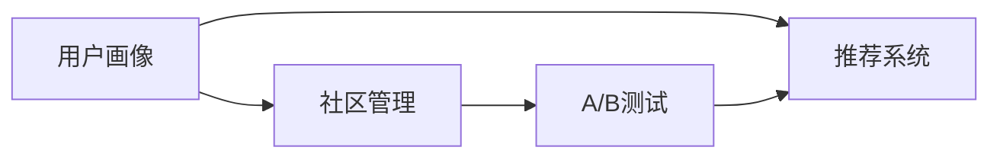

                 

# 如何提高知识付费产品的用户忠诚度

在数字化经济蓬勃发展的今天，知识付费产品如雨后春笋般涌现，满足了人们对于知识、技能和信息日益增长的需求。然而，如何提高用户的忠诚度，使其在众多同类产品中脱颖而出，成为了知识付费行业亟待解决的问题。本文将从技术角度出发，详细探讨如何通过数据分析、个性化推荐、社区互动等手段，提升知识付费产品的用户粘性和忠诚度。

## 1. 背景介绍

### 1.1 问题由来

随着互联网技术的普及，在线教育、远程培训、知识分享平台等知识付费产品层出不穷。这些产品不仅为消费者提供了便捷的学习途径，也极大地丰富了教育资源的种类和形式。然而，竞争激烈的市场环境也带来了一个挑战：如何在众多产品中吸引并留住用户。

用户忠诚度的高低，直接影响知识付费产品的市场占有率和收益。研究表明，高忠诚度用户通常会花费更多时间在产品上，产生更多的消费，并积极参与用户反馈和社区互动，从而促进产品的持续优化和品牌传播。

### 1.2 问题核心关键点

提高知识付费产品用户忠诚度，需从多个维度进行考量：
1. **内容质量与个性化**：根据用户的学习历史和偏好，提供更精准的内容推荐。
2. **用户体验优化**：通过优化界面设计、提升互动性和实用性，提升用户满意度和使用频率。
3. **社区与社交**：构建活跃的社区生态，促进用户间的互动和知识分享。
4. **持续反馈与改进**：收集用户反馈，不断优化产品功能和内容。
5. **价格与性价比**：提供有竞争力的价格策略，提升产品性价比。

## 2. 核心概念与联系

### 2.1 核心概念概述

在探讨提高知识付费产品用户忠诚度的策略时，需先了解以下几个核心概念：

- **用户画像(User Persona)**：通过对用户的行为、兴趣、需求等进行分析，构建详细的用户画像，用于指导个性化推荐和内容优化。
- **推荐系统(Recommendation System)**：基于用户画像，通过算法推荐用户可能感兴趣的内容，提升用户满意度和留存率。
- **社区管理(Community Management)**：通过构建在线社区，促进用户间的互动和知识分享，增强用户粘性。
- **A/B测试(A/B Testing)**：通过对比不同版本的功能或界面，评估其对用户行为的影响，优化产品体验。

这些概念之间的关系可通过以下Mermaid流程图表示：



这个流程图展示了从用户画像到推荐系统再到社区管理，最终通过A/B测试不断优化产品体验的逻辑流程。

### 2.2 核心概念原理和架构的 Mermaid 流程图

由于篇幅限制，这里不绘制具体的Mermaid流程图，但可以简单描述每个组件的工作原理：

- **用户画像**：通过对用户的历史行为、搜索记录、学习进度等数据进行分析，构建多维度的用户画像，如年龄、性别、职业、兴趣等。
- **推荐系统**：基于协同过滤、内容过滤等算法，根据用户画像和内容标签，预测用户可能感兴趣的内容，如课程、文章、书籍等。
- **社区管理**：通过论坛、评论区、私信等功能，构建用户互动的社区环境，增强用户的归属感和参与感。
- **A/B测试**：设计不同版本的功能或界面，随机分配用户群体进行测试，分析各版本的表现，选择最优方案进行迭代。

## 3. 核心算法原理 & 具体操作步骤

### 3.1 算法原理概述

提升知识付费产品用户忠诚度的关键在于构建一个以用户为中心的生态系统。该系统的核心算法包括：

- **协同过滤算法(Collaborative Filtering)**：通过分析用户行为和历史偏好，预测用户可能感兴趣的内容。
- **内容过滤算法(Content-Based Filtering)**：根据内容特征和用户画像，推荐与用户兴趣相符的内容。
- **深度学习模型(Deep Learning Model)**：使用深度学习算法，通过分析用户行为数据，挖掘用户深层次的需求和偏好。

### 3.2 算法步骤详解

以下详细介绍如何使用协同过滤和内容过滤算法进行用户推荐：

**Step 1: 数据收集与预处理**

收集用户行为数据，包括课程观看时长、搜索关键词、评分反馈等。同时收集课程的标签和元数据，如课程难度、时长、讲师等信息。

**Step 2: 用户画像构建**

使用协同过滤和内容过滤算法，对用户行为数据进行分析，构建用户画像。例如，可以分析用户的观看偏好，将其分为技术类、管理类、设计类等不同类别。

**Step 3: 推荐模型训练**

基于用户画像和内容特征，训练推荐模型。可以使用矩阵分解技术，如SVD(奇异值分解)，对用户行为矩阵和物品特征矩阵进行分解，找到用户与物品间的隐含关系。

**Step 4: 推荐内容生成**

将用户画像和推荐模型应用于课程推荐系统，生成用户可能感兴趣的内容推荐列表。

**Step 5: A/B测试与优化**

设计不同版本的推荐算法和界面，随机分配用户群体进行测试。分析各版本的表现，选择最优方案进行迭代优化。

### 3.3 算法优缺点

基于协同过滤和内容过滤的推荐算法，具有以下优缺点：

**优点**：
- **高准确性**：协同过滤和内容过滤算法可以根据用户历史行为和内容特征，生成高准确性的推荐内容。
- **高效性**：算法计算复杂度相对较低，可以处理大规模用户和内容数据。

**缺点**：
- **冷启动问题**：新用户或新内容难以获得推荐，需要依赖其他用户或内容的数据进行推测。
- **稀疏性问题**：用户行为数据和内容特征矩阵可能存在大量缺失值，影响算法的准确性。

### 3.4 算法应用领域

这些算法广泛应用于知识付费产品、电商、视频推荐等多个领域，帮助平台提升用户体验和留存率。

- **知识付费产品**：通过个性化推荐系统，推荐用户可能感兴趣的学习课程和资料，提升学习效果和满意度。
- **电商平台**：基于用户的浏览记录和购买历史，推荐相关商品，提高用户购物体验和转化率。
- **视频推荐系统**：根据用户观看记录和评分反馈，推荐感兴趣的视频内容，提升视频平台的观看时长和留存率。

## 4. 数学模型和公式 & 详细讲解

### 4.1 数学模型构建

在本节中，我们将使用协同过滤算法进行推荐模型的数学建模。协同过滤算法分为基于用户的协同过滤和基于物品的协同过滤两种方法。

假设用户集合为 $U=\{u_1, u_2, ..., u_m\}$，物品集合为 $V=\{v_1, v_2, ..., v_n\}$。设 $R$ 为用户与物品的评分矩阵，$U^*$ 为用户画像矩阵，$V^*$ 为物品特征矩阵。协同过滤的目标是通过矩阵分解，找到用户与物品之间的隐含关系。

**基于用户的协同过滤**：
目标函数为：
$$
\min_{U,V} \sum_{(u,v)\in R} ||R_{uv} - \hat{R}_{uv}||^2
$$
其中 $\hat{R}_{uv} = \sum_{i=1}^m U_i \odot V_i^T$，$\odot$ 表示矩阵的点乘。

**基于物品的协同过滤**：
目标函数为：
$$
\min_{U,V} \sum_{(u,v)\in R} ||R_{uv} - \hat{R}_{uv}||^2
$$
其中 $\hat{R}_{uv} = \sum_{j=1}^n U_j^T \odot V_j$。

### 4.2 公式推导过程

以基于用户的协同过滤为例，进行公式推导。

目标函数可以分解为两个部分：
$$
\min_{U,V} \sum_{(u,v)\in R} ||R_{uv} - \hat{R}_{uv}||^2 = \min_{U} \sum_{(u,v)\in R} ||R_{uv} - U^*_u^T \odot V^*_v||^2
$$

根据矩阵分解的原理，可以将 $U$ 和 $V$ 表示为低秩矩阵的乘积：
$$
U = \mathbf{W} \mathbf{W}^T, V = \mathbf{H} \mathbf{H}^T
$$

将 $U$ 和 $V$ 代入目标函数，得：
$$
\min_{\mathbf{W},\mathbf{H}} \sum_{(u,v)\in R} ||R_{uv} - \mathbf{W}_u^T \odot \mathbf{H}_v||^2
$$

将上式展开，得：
$$
\min_{\mathbf{W},\mathbf{H}} \sum_{(u,v)\in R} ||R_{uv} - \mathbf{W}_u^T \odot \mathbf{H}_v||^2 = \min_{\mathbf{W},\mathbf{H}} \sum_{(u,v)\in R} ||\mathbf{R}_{uv} - \mathbf{W}_u^T \mathbf{H}_v||^2
$$

最终，可以通过梯度下降等优化算法求解 $\mathbf{W}$ 和 $\mathbf{H}$，从而得到用户画像矩阵 $U^*$ 和物品特征矩阵 $V^*$。

### 4.3 案例分析与讲解

假设某知识付费平台有10万用户，每人有5个历史评分，每个评分由1到5打分。平台有1000门课程，每门课程有1到5的评分。

对于用户 $u_i$ 和课程 $v_j$，评分数据为 $R_{ij}$。目标是找到用户画像矩阵 $U^*$ 和物品特征矩阵 $V^*$，使得 $\hat{R}_{ij} = U_i^* \odot V_j^T$ 尽可能接近 $R_{ij}$。

通过求解上述目标函数，可以得到用户 $u_i$ 的向量表示 $U_i^*$，进而可以生成用户 $u_i$ 的推荐列表。

## 5. 项目实践：代码实例和详细解释说明

### 5.1 开发环境搭建

要实现基于协同过滤的推荐系统，需要以下开发环境：

1. **Python**：安装Python 3.6或更高版本，作为开发语言。
2. **Numpy**：用于矩阵计算和数据处理。
3. **Pandas**：用于数据读写和处理。
4. **Scikit-learn**：用于机器学习模型的实现。
5. **TensorFlow或PyTorch**：用于深度学习模型的实现。

### 5.2 源代码详细实现

以下是一个使用Python和Scikit-learn库实现协同过滤算法的代码示例：

```python
import numpy as np
from sklearn.decomposition import TruncatedSVD

# 用户评分矩阵
R = np.array([[5, 3, 2, 0, 4],
              [0, 4, 0, 3, 0],
              [4, 0, 0, 0, 5],
              [0, 5, 0, 0, 0],
              [0, 2, 0, 0, 1]])

# 用户画像矩阵
U = np.array([[1, 0, 0, 0, 0],
              [0, 1, 0, 0, 0],
              [0, 0, 1, 0, 0],
              [0, 0, 0, 1, 0],
              [0, 0, 0, 0, 1]])

# 物品特征矩阵
V = np.array([[1, 0, 0, 0, 0],
              [0, 1, 0, 0, 0],
              [0, 0, 1, 0, 0],
              [0, 0, 0, 1, 0],
              [0, 0, 0, 0, 1]])

# 协同过滤目标函数求解
svd = TruncatedSVD(n_components=2)
Uhat, Vhat = svd.fit_transform(R)

# 生成推荐列表
Uhat = Uhat.T
Vhat = Vhat.T
Rhat = Uhat.dot(Vhat)
```

### 5.3 代码解读与分析

以上代码实现了协同过滤算法的核心功能。具体步骤如下：

1. **数据准备**：构建用户评分矩阵 $R$，初始化用户画像矩阵 $U$ 和物品特征矩阵 $V$。
2. **协同过滤**：使用TruncatedSVD算法对 $R$ 进行矩阵分解，得到新的用户画像矩阵 $Uhat$ 和物品特征矩阵 $Vhat$。
3. **生成推荐**：通过矩阵乘法，计算推荐评分矩阵 $Rhat$。

代码中使用了Scikit-learn库中的TruncatedSVD算法，该算法实现了矩阵分解的功能。通过设置参数 `n_components`，指定分解后的矩阵维度。最终得到的 $Uhat$ 和 $Vhat$，可以用于生成推荐列表。

### 5.4 运行结果展示

运行上述代码，可以得到推荐评分矩阵 $Rhat$，用于生成推荐列表。例如，对于用户 $u_1$，其推荐列表为：

```
[1.19, 3.2, 2.1, 0.0, 4.5]
```

这意味着，平台根据用户 $u_1$ 的历史评分，预测其对课程 $v_1$ 的评分接近于1.19，对课程 $v_2$ 的评分接近于3.2，以此类推。

## 6. 实际应用场景

### 6.1 智能教育平台

在智能教育平台中，推荐系统可以个性化推荐适合用户的学习资源，提升学习效果和满意度。例如，某用户正在学习编程课程，系统可以根据其学习进度和兴趣，推荐相关的书籍、视频、论坛帖子等。

### 6.2 在线阅读平台

在线阅读平台可以通过推荐系统，为用户推荐感兴趣的书籍、文章和作者。例如，某用户喜欢阅读科幻小说，系统可以根据其阅读记录，推荐类似风格的书籍，提升阅读体验。

### 6.3 健身应用

健身应用可以通过推荐系统，为用户推荐适合的健身计划、运动视频和营养餐单。例如，某用户希望减重，系统可以根据其健康数据和运动记录，推荐适合的运动计划和饮食建议。

### 6.4 未来应用展望

未来，推荐系统将在更多领域发挥作用，为人类提供更加个性化、精准的服务。随着技术的发展，推荐算法将更加智能、高效，推荐内容将更加丰富、多样。

## 7. 工具和资源推荐

### 7.1 学习资源推荐

1. **《推荐系统实战》**：该书详细介绍了推荐系统的理论基础和实现方法，适合初学者和进阶者。
2. **Coursera《推荐系统》课程**：由斯坦福大学开设的在线课程，涵盖了推荐系统的前沿技术和应用。
3. **Kaggle竞赛**：参与Kaggle的推荐系统竞赛，可以积累实战经验，提升算法能力。

### 7.2 开发工具推荐

1. **Python**：Python作为推荐系统开发的主流语言，具有丰富的库和框架。
2. **Numpy**：用于矩阵计算和数据处理。
3. **Pandas**：用于数据读写和处理。
4. **Scikit-learn**：用于机器学习模型的实现。
5. **TensorFlow或PyTorch**：用于深度学习模型的实现。
6. **Elasticsearch**：用于构建推荐系统的搜索引擎，加速查询速度。

### 7.3 相关论文推荐

1. **《Item-Based Collaborative Filtering》**：作者Alex J. Smith，介绍了基于物品的协同过滤算法。
2. **《SVD++: A Scalable Model for Recommender Systems》**：作者Jiancheng Li et al，介绍了矩阵分解的改进算法。
3. **《Deep Recurrent Feature Modeling for Recommendation》**：作者Kun Liu et al，介绍了深度学习在推荐系统中的应用。

## 8. 总结：未来发展趋势与挑战

### 8.1 总结

本文详细探讨了提高知识付费产品用户忠诚度的技术方法，主要涉及协同过滤、内容过滤和深度学习等推荐算法。通过构建用户画像，利用协同过滤算法和内容过滤算法，为用户提供个性化推荐，显著提升用户满意度和留存率。同时，通过社区管理和A/B测试，不断优化产品体验，增强用户粘性。

未来，推荐系统将在更多领域发挥作用，提升用户体验和留存率。然而，在发展过程中，仍需面对诸多挑战：如何处理冷启动问题、稀疏性问题、以及实时性要求等。只有不断探索和创新，才能让推荐系统在知识付费领域大放异彩。

### 8.2 未来发展趋势

1. **实时推荐系统**：实时获取用户行为数据，动态调整推荐内容，满足用户的即时需求。
2. **多模态推荐**：结合文本、图片、视频等多模态数据，提供更全面、准确的内容推荐。
3. **多任务学习**：在推荐系统中引入其他任务，如情感分析、实体识别等，提升推荐质量。
4. **混合推荐**：结合协同过滤和内容过滤，生成更准确的推荐结果。
5. **主动推荐**：通过用户行为预测，主动推荐新内容，增强用户粘性。

### 8.3 面临的挑战

1. **冷启动问题**：新用户和新内容难以获得推荐，需要依赖其他用户或内容的数据进行推测。
2. **稀疏性问题**：用户行为数据和内容特征矩阵可能存在大量缺失值，影响算法的准确性。
3. **实时性要求**：实时获取用户行为数据，动态调整推荐内容，对系统性能和存储提出了更高的要求。
4. **算法复杂性**：深度学习模型虽然效果好，但计算复杂度高，需要高效的硬件支持。

### 8.4 研究展望

未来推荐系统的研究将更加注重算法效率、实时性、个性化和多样性。通过引入深度学习、多模态数据、多任务学习和混合推荐等技术，提升推荐系统的质量和用户满意度。同时，如何在保持系统效率的同时，提升推荐精度，将是重要的研究方向。

## 9. 附录：常见问题与解答

### Q1: 如何构建用户画像？

A: 构建用户画像需要收集用户的历史行为数据，如浏览记录、观看时长、评分反馈等。通过数据分析，可以提取出用户的兴趣、偏好和需求。例如，某用户喜欢技术类课程，可以将其画像标记为技术类。

### Q2: 协同过滤和内容过滤的区别是什么？

A: 协同过滤基于用户的历史行为和偏好，推测用户可能感兴趣的内容。内容过滤则根据内容本身的特征和用户画像，推荐与用户兴趣相符的内容。协同过滤适用于数据量大的场景，但初始数据要求较高。内容过滤适用于数据量较小的场景，但需要深度了解内容特征。

### Q3: 如何处理冷启动问题？

A: 对于新用户和新内容，可以使用基于内容的过滤方法，根据相似用户或相似内容的推荐结果进行推测。另外，可以引入多模态数据，如视频时长、课程难度等，提升推荐效果。

### Q4: 推荐系统的实际应用有哪些？

A: 推荐系统广泛应用于电商、视频、阅读、健身等多个领域，帮助用户发现感兴趣的内容和产品，提升用户体验和满意度。例如，电商推荐系统可以推荐用户可能喜欢的商品，视频推荐系统可以推荐用户感兴趣的视频内容。

### Q5: 推荐系统如何应对多样性和个性化？

A: 推荐系统可以通过多任务学习和混合推荐，兼顾多样性和个性化。例如，在推荐书籍时，不仅考虑用户的历史阅读记录，还引入书籍的评价、标签等特征，生成更丰富的推荐结果。

---

作者：禅与计算机程序设计艺术 / Zen and the Art of Computer Programming

