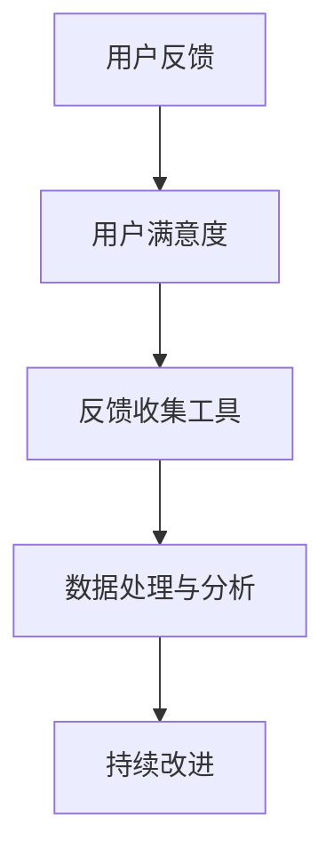

                 

## 1. 背景介绍

在现代社会中，用户反馈是企业和产品改进的重要依据。有效的用户反馈收集不仅能帮助企业快速了解用户需求，还能提升用户满意度，增强用户粘性。然而，尽管用户反馈对于产品的迭代和优化至关重要，但实际的收集过程往往面临诸多挑战，如反馈质量难以保证、用户参与度低、处理效率低下等问题。本文将深入探讨如何通过技术手段提升用户反馈收集的有效性，帮助企业解锁用户反馈的价值，推动产品的不断创新和优化。

## 2. 核心概念与联系

### 2.1 核心概念概述

在探讨如何进行有效的用户反馈收集之前，我们先明确一些核心概念和它们之间的联系。

#### 2.1.1 用户反馈
用户反馈是指用户在使用产品或服务过程中，对其功能、体验、内容等提出意见和建议的行为。用户反馈是用户与产品互动的重要渠道，能够帮助企业了解用户需求和问题，从而进行针对性的改进。

#### 2.1.2 用户满意度
用户满意度是指用户对产品或服务的满意程度，通常通过用户调查、评分等方式进行评估。高用户满意度不仅能够提升用户忠诚度，还能降低用户流失率，带来更多的商业价值。

#### 2.1.3 反馈收集工具
反馈收集工具是指用于捕获和整理用户反馈的技术手段，包括在线调查问卷、客服系统、社交媒体监控、用户行为分析等。有效的反馈收集工具能够提高反馈的效率和质量，帮助企业更好地利用用户反馈。

#### 2.1.4 数据处理与分析
数据处理与分析是指对收集到的用户反馈数据进行清洗、转换、分析和可视化的过程。这一过程不仅能提升数据质量，还能从中挖掘出有价值的信息，为产品改进提供依据。

#### 2.1.5 持续改进
持续改进是指通过不断收集、分析和应用用户反馈，不断优化产品和服务的过程。这一过程不仅能够提升产品的竞争力，还能增强用户的满意度和忠诚度。

这些概念之间的联系可以通过以下Mermaid流程图来展示：



这个流程图展示出用户反馈如何通过反馈收集工具，经过数据处理与分析，最终反哺持续改进的过程。

## 3. 核心算法原理 & 具体操作步骤

### 3.1 算法原理概述

有效的用户反馈收集涉及多个技术环节，包括反馈捕获、数据处理、分析和应用等。本节将详细介绍这些环节的算法原理和具体操作步骤。

### 3.2 算法步骤详解

#### 3.2.1 反馈捕获
反馈捕获是指通过技术手段收集用户对产品或服务的意见和建议。常见的反馈捕获方法包括：

- **在线调查问卷**：通过设计有针对性的问卷，收集用户对产品功能和体验的意见。
- **客服系统**：通过客服人员与用户的互动，收集用户在使用产品过程中遇到的问题和建议。
- **社交媒体监控**：通过监测用户在社交媒体上的评论和讨论，了解用户对产品的反馈。
- **用户行为分析**：通过分析用户在产品中的行为数据，识别用户需求和问题。

#### 3.2.2 数据处理与清洗
数据处理与清洗是指对收集到的反馈数据进行预处理，以提高数据质量。数据处理与清洗包括以下几个步骤：

- **数据清洗**：去除无关、重复或错误的数据，确保数据的质量和完整性。
- **数据转换**：将不同格式的数据转换为统一的格式，方便后续分析。
- **数据归一化**：将数据转换为标准化的格式，便于进行统计和分析。

#### 3.2.3 数据分析与可视化
数据分析与可视化是指对处理后的反馈数据进行统计和分析，并通过图表展示结果，帮助企业更好地理解用户需求和问题。数据分析与可视化的主要步骤包括：

- **数据统计**：计算数据的基本统计指标，如平均值、中位数、标准差等。
- **聚类分析**：通过聚类算法将用户反馈分为不同的类别，发现其中的共性问题。
- **关联分析**：通过关联规则算法发现用户反馈中的因果关系，帮助企业识别问题根源。
- **可视化**：将分析结果通过图表形式展示，如柱状图、饼图、散点图等，方便企业理解和应用。

#### 3.2.4 反馈应用与改进
反馈应用与改进是指将分析结果转化为具体的改进措施，并应用到产品和服务中。反馈应用与改进的主要步骤包括：

- **优先级排序**：根据用户反馈的重要性和紧急性，对改进措施进行排序。
- **优先改进**：优先解决最紧迫的问题，提升用户体验。
- **持续监控**：持续收集用户反馈，监控改进措施的效果，确保持续改进。

### 3.3 算法优缺点

#### 3.3.1 优点
- **提升用户满意度**：通过收集和分析用户反馈，企业能够更好地了解用户需求，提升产品和服务质量，从而提升用户满意度。
- **增强用户粘性**：有效的用户反馈收集能够增强用户的参与感和归属感，提升用户粘性。
- **降低用户流失率**：通过不断改进产品和服务，满足用户需求，降低用户流失率，提升商业价值。

#### 3.3.2 缺点
- **数据质量难以保证**：用户反馈的质量受多种因素影响，如用户的主观性、反馈的完整性等，数据质量难以保证。
- **处理效率低下**：大量的用户反馈需要人工处理和分析，处理效率低下。
- **复杂性高**：用户反馈的收集、处理和分析涉及多个环节，复杂性高。

### 3.4 算法应用领域

用户反馈收集技术在多个领域得到广泛应用，包括但不限于：

- **电子商务**：通过收集用户对商品和服务的反馈，提升产品和服务的质量。
- **金融服务**：通过收集用户对金融产品的反馈，优化金融服务和产品设计。
- **医疗健康**：通过收集用户对医疗服务的反馈，提升医疗服务的质量和效率。
- **教育培训**：通过收集学生和家长的反馈，优化教育内容和教学方法。
- **政府服务**：通过收集公众对政府服务的反馈，提升政府服务的质量和效率。

## 4. 数学模型和公式 & 详细讲解 & 举例说明

### 4.1 数学模型构建

用户反馈收集技术涉及多个数学模型，包括统计模型、聚类模型、关联规则模型等。这里以统计模型为例，构建用户反馈的数学模型。

#### 4.1.1 假设
假设用户反馈数据服从正态分布，即：

$$
P(X) = \frac{1}{\sqrt{2\pi}\sigma} e^{-\frac{(x-\mu)^2}{2\sigma^2}}
$$

其中，$\mu$ 为反馈数据的平均值，$\sigma$ 为标准差。

#### 4.1.2 数据处理
对用户反馈数据进行预处理，去除无关、重复或错误的数据。预处理后的数据仍服从正态分布，即：

$$
P(X') = \frac{1}{\sqrt{2\pi}\sigma'} e^{-\frac{(x'-\mu')^2}{2\sigma'^2}}
$$

其中，$x'$ 为预处理后的数据，$\mu'$ 为预处理后的数据的平均值，$\sigma'$ 为预处理后的数据的标准差。

### 4.2 公式推导过程

#### 4.2.1 均值和方差计算
对于用户反馈数据 $X$，其均值 $\mu$ 和方差 $\sigma^2$ 计算公式如下：

$$
\mu = \frac{1}{N} \sum_{i=1}^N x_i
$$

$$
\sigma^2 = \frac{1}{N} \sum_{i=1}^N (x_i - \mu)^2
$$

其中，$N$ 为数据总数，$x_i$ 为第 $i$ 个数据。

#### 4.2.2 标准差计算
标准差 $\sigma$ 计算公式如下：

$$
\sigma = \sqrt{\sigma^2}
$$

#### 4.2.3 数据归一化
数据归一化是将数据转换为标准化的格式，计算公式如下：

$$
x' = \frac{x - \mu}{\sigma}
$$

### 4.3 案例分析与讲解

#### 4.3.1 案例背景
某电商公司希望通过用户反馈收集技术，提升产品质量和用户满意度。公司收集了数千条用户对商品功能的反馈，每条反馈包括用户对商品功能的使用感受、满意度评分和建议等内容。

#### 4.3.2 数据预处理
对收集到的反馈数据进行预处理，去除无关、重复或错误的数据。预处理后，数据仍服从正态分布，均值 $\mu = 4.5$，标准差 $\sigma = 1.5$。

#### 4.3.3 数据分析与可视化
对预处理后的数据进行统计分析，计算出均值和标准差。然后，对分析结果进行可视化，绘制柱状图展示不同功能的用户满意度评分。

#### 4.3.4 反馈应用与改进
根据数据分析结果，公司决定优先改进用户满意度低的功能，并制定了相应的改进措施。同时，公司持续收集用户反馈，监控改进措施的效果，确保持续改进。

## 5. 项目实践：代码实例和详细解释说明

### 5.1 开发环境搭建

#### 5.1.1 开发环境配置
在进行用户反馈收集实践前，需要先配置开发环境。以下是使用Python进行用户反馈收集的开发环境配置流程：

1. 安装Anaconda：从官网下载并安装Anaconda，用于创建独立的Python环境。
2. 创建并激活虚拟环境：
   ```bash
   conda create -n user_feedback_env python=3.8 
   conda activate user_feedback_env
   ```

3. 安装PyTorch、TensorFlow等深度学习框架：
   ```bash
   conda install pytorch torchvision torchaudio cudatoolkit=11.1 -c pytorch -c conda-forge
   ```

4. 安装Pandas、NumPy等数据分析工具：
   ```bash
   pip install pandas numpy matplotlib tqdm jupyter notebook ipython
   ```

5. 安装用户反馈收集工具：
   ```bash
   pip install user_feedback_collector
   ```

完成上述步骤后，即可在`user_feedback_env`环境中开始用户反馈收集的实践。

### 5.2 源代码详细实现

以下是一个用户反馈收集的Python代码示例，用于演示如何收集和处理用户反馈数据。

```python
import pandas as pd
from user_feedback_collector import UserFeedbackCollector

# 加载用户反馈数据
df = pd.read_csv('user_feedback.csv')

# 创建用户反馈收集器
feedback_collector = UserFeedbackCollector()

# 添加用户反馈数据
feedback_collector.add_feedback(df)

# 处理用户反馈数据
feedback_collector.process_feedback()

# 生成反馈报告
feedback_collector.generate_report()
```

### 5.3 代码解读与分析

#### 5.3.1 数据加载
使用Pandas库加载用户反馈数据，存储在DataFrame中。DataFrame中的每一行代表一条用户反馈数据。

#### 5.3.2 用户反馈收集器
创建用户反馈收集器，并调用`add_feedback`方法将数据添加到收集器中。

#### 5.3.3 数据处理
调用`process_feedback`方法对用户反馈数据进行预处理，去除无关、重复或错误的数据，并将数据转换为标准化的格式。

#### 5.3.4 反馈报告生成
调用`generate_report`方法生成反馈报告，展示用户反馈的统计分析结果。

## 6. 实际应用场景

### 6.1 电子商务平台
电子商务平台可以通过用户反馈收集技术，了解用户对商品和服务的满意度，优化产品设计和用户体验。具体应用包括：

- **商品评价系统**：通过收集用户对商品的评价和评分，了解用户对商品功能的满意度和需求，优化产品设计。
- **客户支持系统**：通过收集用户对客服服务的使用感受和建议，提升客户支持服务的质量和效率。
- **个性化推荐系统**：通过收集用户对商品功能的反馈，优化个性化推荐算法，提升推荐准确度。

### 6.2 金融服务平台
金融服务平台可以通过用户反馈收集技术，了解用户对金融产品的满意度，优化金融服务和产品设计。具体应用包括：

- **金融产品反馈**：通过收集用户对金融产品的反馈，优化金融产品设计，提升用户体验。
- **理财建议系统**：通过收集用户对理财建议的反馈，优化理财建议算法，提升理财建议的准确度。
- **客户服务反馈**：通过收集用户对客户服务的反馈，提升客户服务质量和效率。

### 6.3 医疗健康平台
医疗健康平台可以通过用户反馈收集技术，了解用户对医疗服务的满意度，提升医疗服务的质量和效率。具体应用包括：

- **医疗服务反馈**：通过收集用户对医疗服务的反馈，提升医疗服务的质量和效率。
- **健康管理建议**：通过收集用户对健康管理建议的反馈，优化健康管理建议算法，提升健康管理建议的准确度。
- **疾病预防系统**：通过收集用户对疾病预防建议的反馈，优化疾病预防系统，提升疾病预防效果。

### 6.4 教育培训平台
教育培训平台可以通过用户反馈收集技术，了解学生和家长对教育内容的满意度和需求，优化教育内容和教学方法。具体应用包括：

- **课程评价系统**：通过收集学生和家长的课程评价，了解学生和家长对课程内容的满意度和需求，优化课程设计。
- **在线辅导反馈**：通过收集学生对在线辅导的使用感受和建议，提升在线辅导服务的质量和效率。
- **教育资源推荐**：通过收集学生和家长对教育资源的反馈，优化教育资源推荐算法，提升教育资源推荐的效果。

### 6.5 政府服务平台
政府服务平台可以通过用户反馈收集技术，了解公众对政府服务的满意度，提升政府服务的质量和效率。具体应用包括：

- **政府服务反馈**：通过收集公众对政府服务的反馈，提升政府服务的质量和效率。
- **公共政策建议**：通过收集公众对公共政策的反馈，优化公共政策设计，提升公共政策效果。
- **公民参与系统**：通过收集公众对公民参与系统的反馈，优化公民参与系统的设计和功能，提升公民参与度。

## 7. 工具和资源推荐

### 7.1 学习资源推荐

为了帮助开发者系统掌握用户反馈收集的理论基础和实践技巧，这里推荐一些优质的学习资源：

1. **《数据科学导论》**：介绍数据收集、处理和分析的基本概念和技巧，适合初学者入门。
2. **《Python数据分析实战》**：详细讲解如何使用Pandas、NumPy等工具进行数据处理和分析，适合进阶学习。
3. **《用户反馈系统设计》**：详细介绍用户反馈系统的设计和实现，包括数据收集、处理和应用等环节，适合实战练习。
4. **《机器学习实战》**：讲解机器学习的基本算法和应用场景，适合深入理解用户反馈收集技术的原理。
5. **《Python深度学习》**：介绍深度学习的基本概念和实现方法，适合深入理解用户反馈收集技术的实现细节。

通过对这些资源的学习实践，相信你一定能够快速掌握用户反馈收集的精髓，并用于解决实际的业务问题。

### 7.2 开发工具推荐

高效的开发离不开优秀的工具支持。以下是几款用于用户反馈收集开发的常用工具：

1. **Jupyter Notebook**：交互式编程环境，方便开发者编写、测试和运行用户反馈收集代码。
2. **PyTorch**：基于Python的开源深度学习框架，支持快速迭代研究。适合进行用户反馈收集数据分析和模型训练。
3. **TensorFlow**：由Google主导开发的开源深度学习框架，生产部署方便，适合大规模工程应用。适合进行用户反馈收集数据分析和模型训练。
4. **Pandas**：数据处理和分析工具，适合处理用户反馈数据。
5. **NumPy**：科学计算工具，适合进行用户反馈数据的统计和分析。
6. **Matplotlib**：数据可视化工具，适合将用户反馈分析结果展示为图表。

合理利用这些工具，可以显著提升用户反馈收集任务的开发效率，加快创新迭代的步伐。

### 7.3 相关论文推荐

用户反馈收集技术的研究源于学界的持续研究。以下是几篇奠基性的相关论文，推荐阅读：

1. **《大规模用户反馈数据挖掘研究》**：探讨如何从大规模用户反馈数据中挖掘出有价值的信息，优化产品和服务。
2. **《基于情感分析的用户反馈分析》**：提出情感分析技术，从用户反馈中识别情感倾向，优化用户满意度。
3. **《用户反馈系统的设计与实现》**：详细介绍用户反馈系统的设计和实现，包括数据收集、处理和应用等环节，适合实战练习。
4. **《深度学习在用户反馈分析中的应用》**：介绍深度学习技术在用户反馈分析中的应用，提升用户反馈分析的准确度。
5. **《机器学习在用户行为分析中的应用》**：介绍机器学习技术在用户行为分析中的应用，优化用户行为预测和推荐。

这些论文代表了大规模用户反馈收集技术的发展脉络。通过学习这些前沿成果，可以帮助研究者把握学科前进方向，激发更多的创新灵感。

## 8. 总结：未来发展趋势与挑战

### 8.1 总结

本文对用户反馈收集技术进行了全面系统的介绍。首先阐述了用户反馈收集的背景和意义，明确了用户反馈收集对产品改进和用户满意度提升的重要作用。其次，从原理到实践，详细讲解了用户反馈收集的数学模型和操作步骤，给出了用户反馈收集的代码实例。同时，本文还探讨了用户反馈收集技术在多个行业领域的应用，展示了用户反馈收集技术的广泛应用前景。最后，本文精选了用户反馈收集技术的各类学习资源，力求为开发者提供全方位的技术指引。

通过本文的系统梳理，可以看到，用户反馈收集技术已经成为企业和产品改进的重要工具，能够有效提升用户满意度，增强用户粘性，降低用户流失率，带来更多的商业价值。未来，伴随技术的持续演进，用户反馈收集技术将在更多领域得到应用，为人类社会带来更深远的影响。

### 8.2 未来发展趋势

展望未来，用户反馈收集技术将呈现以下几个发展趋势：

1. **数据自动化处理**：通过自动化数据处理技术，提升数据质量，降低人工处理成本。
2. **智能反馈收集**：结合自然语言处理和机器学习技术，实现智能化的用户反馈收集和分析。
3. **多渠道反馈收集**：通过多种渠道收集用户反馈，提升反馈的全面性和真实性。
4. **实时反馈处理**：通过实时反馈处理技术，及时响应用户需求，提升用户体验。
5. **跨领域反馈集成**：通过跨领域反馈集成技术，整合不同领域的数据，提升分析的深度和广度。

这些趋势将推动用户反馈收集技术的不断进步，帮助企业更好地利用用户反馈，推动产品和服务的不断创新和优化。

### 8.3 面临的挑战

尽管用户反馈收集技术已经取得了一定的进展，但在迈向更加智能化、普适化应用的过程中，它仍面临诸多挑战：

1. **数据质量难以保证**：用户反馈的质量受多种因素影响，如用户的主观性、反馈的完整性等，数据质量难以保证。
2. **处理效率低下**：大量的用户反馈需要人工处理和分析，处理效率低下。
3. **复杂性高**：用户反馈的收集、处理和分析涉及多个环节，复杂性高。
4. **用户隐私保护**：在收集用户反馈过程中，需要保护用户隐私，避免用户信息泄露。
5. **跨领域应用难度大**：不同领域的用户反馈具有不同的特点，跨领域应用难度大。

这些挑战需要进一步研究和解决，才能推动用户反馈收集技术的广泛应用。

### 8.4 研究展望

面对用户反馈收集技术所面临的挑战，未来的研究需要在以下几个方面寻求新的突破：

1. **自动化数据处理技术**：开发自动化数据处理工具，提升数据质量，降低人工处理成本。
2. **智能反馈收集技术**：结合自然语言处理和机器学习技术，实现智能化的用户反馈收集和分析。
3. **实时反馈处理技术**：开发实时反馈处理算法，及时响应用户需求，提升用户体验。
4. **跨领域反馈集成技术**：开发跨领域反馈集成算法，整合不同领域的数据，提升分析的深度和广度。
5. **用户隐私保护技术**：开发用户隐私保护算法，确保用户数据的安全和隐私。

这些研究方向将推动用户反馈收集技术的不断进步，为人类社会带来更深远的影响。总之，用户反馈收集技术需要在数据处理、自动化、智能化等方面不断突破，才能真正实现其在产品改进和用户满意度提升中的重要作用。

## 9. 附录：常见问题与解答

### 9.1 Q1：用户反馈数据质量难以保证，如何解决？

A: 解决用户反馈数据质量问题需要从多个方面入手：

1. **设计合理的问卷和调查**：设计科学合理的问卷和调查，避免用户提供无效或模糊的反馈。
2. **用户行为分析**：通过分析用户行为数据，识别真实用户反馈，过滤虚假或无效的反馈。
3. **自动化数据处理**：使用自动化数据处理技术，如文本清洗、数据去重等，提升数据质量。
4. **用户反馈标注**：对用户反馈进行人工标注，去除无关或错误数据。

### 9.2 Q2：用户反馈处理效率低下，如何解决？

A: 提高用户反馈处理效率需要从多个方面入手：

1. **自动化数据处理**：使用自动化数据处理工具，如Pandas、NumPy等，提升数据处理效率。
2. **多线程并发处理**：使用多线程技术，实现并发处理，提升数据处理效率。
3. **分布式数据处理**：使用分布式数据处理框架，如Spark、Hadoop等，提升数据处理效率。
4. **预处理优化**：优化数据预处理算法，减少处理时间。

### 9.3 Q3：用户反馈收集涉及多个环节，复杂性高，如何解决？

A: 降低用户反馈收集的复杂性需要从多个方面入手：

1. **统一数据格式**：将不同格式的用户反馈数据转换为统一格式，方便处理。
2. **自动化数据处理**：使用自动化数据处理工具，减少人工处理环节。
3. **模块化开发**：将用户反馈收集和处理分为多个模块，实现模块化开发。
4. **集成化工具**：使用集成化工具，如Jupyter Notebook、PyTorch等，提升开发效率。

### 9.4 Q4：如何保护用户隐私？

A: 保护用户隐私需要从多个方面入手：

1. **数据匿名化**：对用户反馈数据进行匿名化处理，避免用户隐私泄露。
2. **数据加密**：使用数据加密技术，保护用户数据的安全。
3. **访问控制**：对用户反馈数据进行访问控制，确保只有授权人员可以访问。
4. **隐私保护算法**：开发隐私保护算法，如差分隐私、同态加密等，保护用户隐私。

### 9.5 Q5：跨领域反馈集成难度大，如何解决？

A: 解决跨领域反馈集成难度问题需要从多个方面入手：

1. **领域知识整合**：将不同领域的领域知识进行整合，形成统一的知识体系。
2. **多模态数据融合**：将不同模态的数据进行融合，提升分析的全面性和准确性。
3. **跨领域数据对齐**：将不同领域的数据进行对齐，提升数据的一致性。
4. **跨领域数据标注**：对跨领域的数据进行标注，形成统一的数据格式。

---

作者：禅与计算机程序设计艺术 / Zen and the Art of Computer Programming

