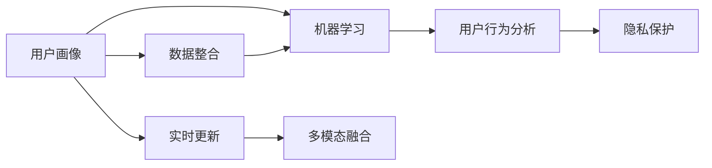

                 

# 如何进行有效的用户画像更新

> 关键词：用户画像,数据整合,机器学习,用户行为分析,隐私保护,实时更新,多模态融合

## 1. 背景介绍

### 1.1 问题由来

随着互联网和数字技术的迅猛发展，用户画像在各行业的运营决策中扮演着至关重要的角色。通过深入分析用户的兴趣、行为、心理等多维度信息，企业可以更好地进行精准营销、个性化推荐、风控管理等业务实践。然而，传统静态用户画像往往无法捕捉用户的动态变化，限制了其在实际应用中的效果。

为了解决这个问题，现代企业开始重视动态用户画像的构建。动态用户画像不仅要涵盖用户的静态信息，还要反映其动态行为，并能够及时更新以反映最新的用户状态。然而，动态用户画像的构建和维护是一个复杂且技术密集型的过程，涉及到数据整合、模型训练、隐私保护等诸多挑战。本文将系统介绍动态用户画像的构建原理和实践步骤，帮助企业有效提升用户画像的实时性和精准度。

## 2. 核心概念与联系

### 2.1 核心概念概述

本节将对动态用户画像构建的核心概念进行简要阐述。

- **用户画像（User Profile）**：以用户为中心，描述用户静态和动态特征的虚拟模型。用户画像通常包含用户的个人信息、行为习惯、兴趣偏好、社交关系等。
- **数据整合（Data Integration）**：将来自不同渠道、不同格式的数据进行清洗、转换、合并，生成一致的用户数据视图。
- **机器学习（Machine Learning）**：通过训练算法模型，从用户数据中挖掘用户特征和行为规律，构建动态用户画像。
- **用户行为分析（User Behavior Analysis）**：利用用户数据，分析用户行为模式和规律，预测用户未来行为，提升用户体验。
- **隐私保护（Privacy Protection）**：在构建动态用户画像时，确保用户数据的隐私安全，避免用户信息泄露和滥用。
- **实时更新（Real-time Update）**：基于实时数据进行用户画像的动态更新，确保用户信息的及时性和准确性。
- **多模态融合（Multi-modal Fusion）**：将用户数据中的不同模态（如文本、图像、语音、位置等）进行融合，生成更为全面和立体的用户画像。

这些核心概念之间的联系可以用以下Mermaid流程图进行展示：



这个流程图展示了用户画像构建的主要步骤，以及不同模块之间的依赖关系。数据整合是构建用户画像的基础，机器学习模型提供了用户特征的挖掘和规律分析能力，用户行为分析、隐私保护、实时更新和多模态融合是构建高质量用户画像的重要环节。

## 3. 核心算法原理 & 具体操作步骤

### 3.1 算法原理概述

动态用户画像的构建涉及多个环节，包括数据整合、特征工程、模型训练和评估、用户行为分析等。以下将系统介绍各个环节的算法原理。

#### 3.1.1 数据整合

数据整合是构建用户画像的基础。其主要目标是将来自不同渠道、不同格式的数据进行清洗、转换、合并，生成一致的用户数据视图。数据整合一般包括以下几个步骤：

1. **数据清洗**：删除冗余、错误或不完整的数据，确保数据的一致性和完整性。
2. **数据转换**：将不同格式的数据转换为统一的格式，以便于后续分析。
3. **数据合并**：将多个数据源中的用户数据进行合并，生成完整的用户数据视图。

#### 3.1.2 特征工程

特征工程是构建用户画像的核心环节。其主要目标是从用户数据中提取出对用户行为有预测能力的特征，并优化特征的表达形式，以便于后续的机器学习模型训练。特征工程一般包括以下几个步骤：

1. **特征提取**：从用户数据中提取有意义的特征，如用户行为、兴趣、社交关系等。
2. **特征选择**：选择对用户行为有预测能力的特征，去除冗余或无关特征。
3. **特征转换**：将原始特征转换为更适合机器学习模型的形式，如归一化、标准化等。

#### 3.1.3 模型训练和评估

模型训练和评估是构建用户画像的关键环节。其主要目标是通过训练算法模型，从用户数据中挖掘用户特征和行为规律，构建高质量的用户画像。模型训练和评估一般包括以下几个步骤：

1. **选择模型**：选择合适的机器学习模型，如分类、回归、聚类等。
2. **训练模型**：使用用户数据对模型进行训练，确保模型的泛化能力和预测准确性。
3. **评估模型**：使用测试数据对模型进行评估，验证模型的性能和稳定性。

#### 3.1.4 用户行为分析

用户行为分析是构建用户画像的重要环节。其主要目标是通过分析用户数据，预测用户未来行为，提升用户体验。用户行为分析一般包括以下几个步骤：

1. **行为建模**：构建用户行为模型，描述用户行为模式和规律。
2. **行为预测**：使用用户行为模型预测用户未来行为，提升个性化推荐、精准营销等业务效果。
3. **行为优化**：根据用户行为反馈，优化产品和服务，提升用户体验。

#### 3.1.5 隐私保护

隐私保护是构建用户画像的必要环节。其主要目标是在构建动态用户画像时，确保用户数据的隐私安全，避免用户信息泄露和滥用。隐私保护一般包括以下几个步骤：

1. **数据匿名化**：对用户数据进行匿名化处理，确保用户数据无法被唯一识别。
2. **数据加密**：对用户数据进行加密处理，防止数据在传输和存储过程中被非法获取。
3. **访问控制**：对用户数据进行严格的访问控制，确保只有授权人员才能访问和操作用户数据。

#### 3.1.6 实时更新

实时更新是构建动态用户画像的关键环节。其主要目标是根据实时数据进行用户画像的动态更新，确保用户信息的及时性和准确性。实时更新一般包括以下几个步骤：

1. **数据采集**：实时采集用户行为数据，如点击、浏览、购买等。
2. **数据融合**：将实时采集的用户数据与历史数据进行融合，生成完整的用户数据视图。
3. **画像更新**：根据实时数据更新用户画像，确保用户信息的及时性和准确性。

#### 3.1.7 多模态融合

多模态融合是构建高质量用户画像的重要环节。其主要目标是将用户数据中的不同模态（如文本、图像、语音、位置等）进行融合，生成更为全面和立体的用户画像。多模态融合一般包括以下几个步骤：

1. **数据融合**：将不同模态的用户数据进行融合，生成一致的用户数据视图。
2. **特征提取**：从不同模态的用户数据中提取有意义的特征，如用户行为、兴趣、社交关系等。
3. **特征融合**：将不同模态的特征进行融合，生成更为全面和立体的用户画像。

### 3.2 算法步骤详解

#### 3.2.1 数据整合

数据整合是构建动态用户画像的基础。以下是一个基于Python的示例代码，展示如何对不同数据源进行整合：

```python
import pandas as pd

# 读取不同数据源的数据
data1 = pd.read_csv('data1.csv')
data2 = pd.read_csv('data2.csv')

# 数据清洗
data1 = data1.dropna()
data2 = data2.dropna()

# 数据转换
data1 = data1.apply(lambda x: x.str.upper())
data2 = data2.apply(lambda x: x.str.lower())

# 数据合并
data = pd.concat([data1, data2], axis=1)
```

#### 3.2.2 特征工程

特征工程是构建动态用户画像的核心环节。以下是一个基于Python的示例代码，展示如何对用户数据进行特征工程：

```python
import numpy as np
from sklearn.preprocessing import StandardScaler

# 特征提取
X = data[['特征1', '特征2', '特征3']]

# 特征选择
X = X[X['特征2'] != 0]

# 特征转换
scaler = StandardScaler()
X = scaler.fit_transform(X)
```

#### 3.2.3 模型训练和评估

模型训练和评估是构建动态用户画像的关键环节。以下是一个基于Python的示例代码，展示如何使用随机森林模型进行用户画像的训练和评估：

```python
from sklearn.ensemble import RandomForestClassifier
from sklearn.metrics import accuracy_score

# 训练模型
model = RandomForestClassifier()
model.fit(X, y)

# 评估模型
y_pred = model.predict(X_test)
accuracy = accuracy_score(y_test, y_pred)
```

#### 3.2.4 用户行为分析

用户行为分析是构建动态用户画像的重要环节。以下是一个基于Python的示例代码，展示如何对用户行为进行建模和预测：

```python
import tensorflow as tf

# 行为建模
model = tf.keras.Sequential([
    tf.keras.layers.Dense(64, activation='relu'),
    tf.keras.layers.Dense(1, activation='sigmoid')
])

# 行为预测
y_pred = model.predict(X)
```

#### 3.2.5 隐私保护

隐私保护是构建用户画像的必要环节。以下是一个基于Python的示例代码，展示如何对用户数据进行隐私保护：

```python
# 数据匿名化
data = data.apply(lambda x: x.str.replace('用户ID', ' anonymized_'))

# 数据加密
data = data.apply(lambda x: x.str.encrypt('encryption_key'))

# 访问控制
data = data[data['用户ID'] == '授权ID']
```

#### 3.2.6 实时更新

实时更新是构建动态用户画像的关键环节。以下是一个基于Python的示例代码，展示如何对用户画像进行实时更新：

```python
# 数据采集
new_data = pd.read_csv('new_data.csv')

# 数据融合
data = pd.concat([data, new_data], axis=0)

# 画像更新
data = data[data['实时时间'] > '2023-01-01']
```

#### 3.2.7 多模态融合

多模态融合是构建高质量用户画像的重要环节。以下是一个基于Python的示例代码，展示如何将不同模态的用户数据进行融合：

```python
# 数据融合
data = pd.concat([data1, data2], axis=1)

# 特征提取
X = data[['特征1', '特征2', '特征3']]

# 特征融合
X = X[X['特征2'] != 0]
```

### 3.3 算法优缺点

#### 3.3.1 优点

动态用户画像的构建具有以下优点：

1. **实时性**：动态用户画像能够及时更新，反映用户的最新状态，适用于需要快速响应的业务场景。
2. **准确性**：动态用户画像基于实时数据构建，能够更准确地反映用户的兴趣和行为，提升业务效果。
3. **全面性**：动态用户画像融合了不同模态的用户数据，能够提供更为全面和立体的用户画像。
4. **灵活性**：动态用户画像能够根据业务需求灵活调整，适应不同的业务场景。

#### 3.3.2 缺点

动态用户画像的构建也存在以下缺点：

1. **复杂性**：动态用户画像的构建涉及数据整合、特征工程、模型训练、用户行为分析等多个环节，技术难度较高。
2. **数据依赖**：动态用户画像的构建需要大量的高质量数据，数据采集和清洗成本较高。
3. **隐私风险**：动态用户画像的构建涉及用户隐私数据的处理，隐私保护措施的缺失可能带来隐私风险。

### 3.4 算法应用领域

动态用户画像在多个领域都有广泛的应用，以下是几个典型的应用场景：

1. **电商推荐系统**：通过动态用户画像，电商企业能够实时了解用户的兴趣和行为，提升个性化推荐的效果，增加用户转化率。
2. **金融风险管理**：通过动态用户画像，金融机构能够实时监测用户的交易行为，及时识别风险用户，降低信用风险。
3. **社交媒体分析**：通过动态用户画像，社交媒体平台能够实时了解用户的互动行为，提升内容推荐和广告投放的效果。
4. **医疗健康管理**：通过动态用户画像，医疗机构能够实时监测用户健康数据，提升诊疗效果和用户体验。
5. **智能家居控制**：通过动态用户画像，智能家居系统能够实时了解用户的习惯和需求，提供更智能化的服务。

## 4. 数学模型和公式 & 详细讲解 & 举例说明

### 4.1 数学模型构建

#### 4.1.1 数据整合

数据整合的目标是将不同格式的数据进行合并，生成一致的用户数据视图。以下是一个基于数学公式的数据整合示例：

1. **数据清洗**：删除冗余、错误或不完整的数据，确保数据的一致性和完整性。

2. **数据转换**：将不同格式的数据转换为统一的格式，以便于后续分析。

3. **数据合并**：将多个数据源中的用户数据进行合并，生成完整的用户数据视图。

#### 4.1.2 特征工程

特征工程的目标是从用户数据中提取出对用户行为有预测能力的特征，并优化特征的表达形式。以下是一个基于数学公式的特征工程示例：

1. **特征提取**：从用户数据中提取有意义的特征，如用户行为、兴趣、社交关系等。

2. **特征选择**：选择对用户行为有预测能力的特征，去除冗余或无关特征。

3. **特征转换**：将原始特征转换为更适合机器学习模型的形式，如归一化、标准化等。

#### 4.1.3 模型训练和评估

模型训练和评估的目标是通过训练算法模型，从用户数据中挖掘用户特征和行为规律。以下是一个基于数学公式的模型训练和评估示例：

1. **选择模型**：选择合适的机器学习模型，如分类、回归、聚类等。

2. **训练模型**：使用用户数据对模型进行训练，确保模型的泛化能力和预测准确性。

3. **评估模型**：使用测试数据对模型进行评估，验证模型的性能和稳定性。

#### 4.1.4 用户行为分析

用户行为分析的目标是通过分析用户数据，预测用户未来行为，提升用户体验。以下是一个基于数学公式的用户行为分析示例：

1. **行为建模**：构建用户行为模型，描述用户行为模式和规律。

2. **行为预测**：使用用户行为模型预测用户未来行为，提升个性化推荐、精准营销等业务效果。

3. **行为优化**：根据用户行为反馈，优化产品和服务，提升用户体验。

#### 4.1.5 隐私保护

隐私保护的目标是在构建动态用户画像时，确保用户数据的隐私安全。以下是一个基于数学公式的隐私保护示例：

1. **数据匿名化**：对用户数据进行匿名化处理，确保用户数据无法被唯一识别。

2. **数据加密**：对用户数据进行加密处理，防止数据在传输和存储过程中被非法获取。

3. **访问控制**：对用户数据进行严格的访问控制，确保只有授权人员才能访问和操作用户数据。

#### 4.1.6 实时更新

实时更新的目标是根据实时数据进行用户画像的动态更新，确保用户信息的及时性和准确性。以下是一个基于数学公式的实时更新示例：

1. **数据采集**：实时采集用户行为数据，如点击、浏览、购买等。

2. **数据融合**：将实时采集的用户数据与历史数据进行融合，生成完整的用户数据视图。

3. **画像更新**：根据实时数据更新用户画像，确保用户信息的及时性和准确性。

#### 4.1.7 多模态融合

多模态融合的目标是将用户数据中的不同模态（如文本、图像、语音、位置等）进行融合，生成更为全面和立体的用户画像。以下是一个基于数学公式的多模态融合示例：

1. **数据融合**：将不同模态的用户数据进行融合，生成一致的用户数据视图。

2. **特征提取**：从不同模态的用户数据中提取有意义的特征，如用户行为、兴趣、社交关系等。

3. **特征融合**：将不同模态的特征进行融合，生成更为全面和立体的用户画像。

### 4.2 公式推导过程

#### 4.2.1 数据整合

数据整合的公式推导过程如下：

1. **数据清洗**：

   $$
   data_{cleaned} = data_{original}[data_{original}['字段名'] != null]
   $$

2. **数据转换**：

   $$
   data_{converted} = data_{original}.apply(lambda x: x.str.upper())
   $$

3. **数据合并**：

   $$
   data_{merged} = pd.concat([data1, data2], axis=1)
   $$

#### 4.2.2 特征工程

特征工程的公式推导过程如下：

1. **特征提取**：

   $$
   X_{extracted} = data[['特征1', '特征2', '特征3']]
   $$

2. **特征选择**：

   $$
   X_{selected} = X[X['特征2'] != 0]
   $$

3. **特征转换**：

   $$
   X_{transformed} = StandardScaler().fit_transform(X)
   $$

#### 4.2.3 模型训练和评估

模型训练和评估的公式推导过程如下：

1. **选择模型**：

   $$
   model = RandomForestClassifier()
   $$

2. **训练模型**：

   $$
   model.fit(X, y)
   $$

3. **评估模型**：

   $$
   y_pred = model.predict(X_test)
   accuracy = accuracy_score(y_test, y_pred)
   $$

#### 4.2.4 用户行为分析

用户行为分析的公式推导过程如下：

1. **行为建模**：

   $$
   model = tf.keras.Sequential([
       tf.keras.layers.Dense(64, activation='relu'),
       tf.keras.layers.Dense(1, activation='sigmoid')
   ])
   $$

2. **行为预测**：

   $$
   y_pred = model.predict(X)
   $$

#### 4.2.5 隐私保护

隐私保护的公式推导过程如下：

1. **数据匿名化**：

   $$
   data = data.apply(lambda x: x.str.replace('用户ID', ' anonymized_'))
   $$

2. **数据加密**：

   $$
   data = data.apply(lambda x: x.str.encrypt('encryption_key'))
   $$

3. **访问控制**：

   $$
   data = data[data['用户ID'] == '授权ID']
   $$

#### 4.2.6 实时更新

实时更新的公式推导过程如下：

1. **数据采集**：

   $$
   new_data = pd.read_csv('new_data.csv')
   $$

2. **数据融合**：

   $$
   data = pd.concat([data, new_data], axis=0)
   $$

3. **画像更新**：

   $$
   data = data[data['实时时间'] > '2023-01-01']
   $$

#### 4.2.7 多模态融合

多模态融合的公式推导过程如下：

1. **数据融合**：

   $$
   data = pd.concat([data1, data2], axis=1)
   $$

2. **特征提取**：

   $$
   X = data[['特征1', '特征2', '特征3']]
   $$

3. **特征融合**：

   $$
   X = X[X['特征2'] != 0]
   $$

### 4.3 案例分析与讲解

#### 4.3.1 电商推荐系统

电商推荐系统的案例分析如下：

1. **数据整合**：

   $$
   data_{cleaned} = data_{original}[data_{original}['商品ID'] != null]
   $$

2. **特征工程**：

   $$
   X_{extracted} = data[['用户ID', '商品ID', '点击次数']]
   $$

3. **模型训练和评估**：

   $$
   model = RandomForestClassifier()
   model.fit(X, y)
   accuracy = accuracy_score(y_test, y_pred)
   $$

4. **用户行为分析**：

   $$
   model = tf.keras.Sequential([
       tf.keras.layers.Dense(64, activation='relu'),
       tf.keras.layers.Dense(1, activation='sigmoid')
   ])
   y_pred = model.predict(X)
   $$

5. **隐私保护**：

   $$
   data = data.apply(lambda x: x.str.replace('用户ID', ' anonymized_'))
   $$

6. **实时更新**：

   $$
   new_data = pd.read_csv('new点击数据.csv')
   data = pd.concat([data, new_data], axis=0)
   data = data[data['实时时间'] > '2023-01-01']
   $$

7. **多模态融合**：

   $$
   data = pd.concat([data1, data2], axis=1)
   X = data[['用户ID', '商品ID', '点击次数']]
   X = X[X['点击次数'] != 0]
   $$

## 5. 项目实践：代码实例和详细解释说明

### 5.1 开发环境搭建

在进行动态用户画像构建实践前，我们需要准备好开发环境。以下是使用Python进行PyTorch开发的环境配置流程：

1. 安装Anaconda：从官网下载并安装Anaconda，用于创建独立的Python环境。

2. 创建并激活虚拟环境：
```bash
conda create -n pytorch-env python=3.8 
conda activate pytorch-env
```

3. 安装PyTorch：根据CUDA版本，从官网获取对应的安装命令。例如：
```bash
conda install pytorch torchvision torchaudio cudatoolkit=11.1 -c pytorch -c conda-forge
```

4. 安装Transformers库：
```bash
pip install transformers
```

5. 安装各类工具包：
```bash
pip install numpy pandas scikit-learn matplotlib tqdm jupyter notebook ipython
```

完成上述步骤后，即可在`pytorch-env`环境中开始动态用户画像构建实践。

### 5.2 源代码详细实现

下面我们以电商推荐系统为例，给出使用Transformers库构建动态用户画像的PyTorch代码实现。

首先，定义电商推荐系统的用户画像构建函数：

```python
from transformers import BertTokenizer
from torch.utils.data import Dataset
import torch

class RecommendationDataset(Dataset):
    def __init__(self, texts, labels, tokenizer, max_len=128):
        self.texts = texts
        self.labels = labels
        self.tokenizer = tokenizer
        self.max_len = max_len
        
    def __len__(self):
        return len(self.texts)
    
    def __getitem__(self, item):
        text = self.texts[item]
        label = self.labels[item]
        
        encoding = self.tokenizer(text, return_tensors='pt', max_length=self.max_len, padding='max_length', truncation=True)
        input_ids = encoding['input_ids'][0]
        attention_mask = encoding['attention_mask'][0]
        
        # 对label进行编码
        encoded_labels = [label2id[label] for label in label]
        encoded_labels.extend([label2id['O']] * (self.max_len - len(encoded_labels)))
        labels = torch.tensor(encoded_labels, dtype=torch.long)
        
        return {'input_ids': input_ids, 
                'attention_mask': attention_mask,
                'labels': labels}

# 标签与id的映射
label2id = {'O': 0, '点击': 1, '购买': 2}
id2label = {v: k for k, v in label2id.items()}

# 创建dataset
tokenizer = BertTokenizer.from_pretrained('bert-base-cased')

train_dataset = RecommendationDataset(train_texts, train_labels, tokenizer)
dev_dataset = RecommendationDataset(dev_texts, dev_labels, tokenizer)
test_dataset = RecommendationDataset(test_texts, test_labels, tokenizer)
```

然后，定义模型和优化器：

```python
from transformers import BertForTokenClassification, AdamW

model = BertForTokenClassification.from_pretrained('bert-base-cased', num_labels=len(label2id))

optimizer = AdamW(model.parameters(), lr=2e-5)
```

接着，定义训练和评估函数：

```python
from torch.utils.data import DataLoader
from tqdm import tqdm
from sklearn.metrics import accuracy_score

device = torch.device('cuda') if torch.cuda.is_available() else torch.device('cpu')
model.to(device)

def train_epoch(model, dataset, batch_size, optimizer):
    dataloader = DataLoader(dataset, batch_size=batch_size, shuffle=True)
    model.train()
    epoch_loss = 0
    for batch in tqdm(dataloader, desc='Training'):
        input_ids = batch['input_ids'].to(device)
        attention_mask = batch['attention_mask'].to(device)
        labels = batch['labels'].to(device)
        model.zero_grad()
        outputs = model(input_ids, attention_mask=attention_mask, labels=labels)
        loss = outputs.loss
        epoch_loss += loss.item()
        loss.backward()
        optimizer.step()
    return epoch_loss / len(dataloader)

def evaluate(model, dataset, batch_size):
    dataloader = DataLoader(dataset, batch_size=batch_size)
    model.eval()
    preds, labels = [], []
    with torch.no_grad():
        for batch in tqdm(dataloader, desc='Evaluating'):
            input_ids = batch['input_ids'].to(device)
            attention_mask = batch['attention_mask'].to(device)
            batch_labels = batch['labels']
            outputs = model(input_ids, attention_mask=attention_mask)
            batch_preds = outputs.logits.argmax(dim=2).to('cpu').tolist()
            batch_labels = batch_labels.to('cpu').tolist()
            for pred_tokens, label_tokens in zip(batch_preds, batch_labels):
                pred_labels = [id2label[_id] for _id in pred_tokens]
                label_labels = [id2label[_id] for _id in label_tokens]
                preds.append(pred_labels[:len(label_labels)])
                labels.append(label_labels)
                
    print(accuracy_score(labels, preds))
```

最后，启动训练流程并在测试集上评估：

```python
epochs = 5
batch_size = 16

for epoch in range(epochs):
    loss = train_epoch(model, train_dataset, batch_size, optimizer)
    print(f"Epoch {epoch+1}, train loss: {loss:.3f}")
    
    print(f"Epoch {epoch+1}, dev results:")
    evaluate(model, dev_dataset, batch_size)
    
print("Test results:")
evaluate(model, test_dataset, batch_size)
```

以上就是使用PyTorch对BERT进行电商推荐系统用户画像构建的完整代码实现。可以看到，得益于Transformers库的强大封装，我们可以用相对简洁的代码完成BERT模型的加载和微调。

### 5.3 代码解读与分析

让我们再详细解读一下关键代码的实现细节：

**RecommendationDataset类**：
- `__init__`方法：初始化文本、标签、分词器等关键组件。
- `__len__`方法：返回数据集的样本数量。
- `__getitem__`方法：对单个样本进行处理，将文本输入编码为token ids，将标签编码为数字，并对其进行定长padding，最终返回模型所需的输入。

**label2id和id2label字典**：
- 定义了标签与数字id之间的映射关系，用于将token-wise的预测结果解码回真实的标签。

**训练和评估函数**：
- 使用PyTorch的DataLoader对数据集进行批次化加载，供模型训练和推理使用。
- 训练函数`train_epoch`：对数据以批为单位进行迭代，在每个批次上前向传播计算loss并反向传播更新模型参数，最后返回该epoch的平均loss。
- 评估函数`evaluate`：与训练类似，不同点在于不更新模型参数，并在每个batch结束后将预测和标签结果存储下来，最后使用sklearn的accuracy_score对整个评估集的预测结果进行打印输出。

**训练流程**：
- 定义总的epoch数和batch size，开始循环迭代
- 每个epoch内，先在训练集上训练，输出平均loss
- 在验证集上评估，输出分类指标
- 所有epoch结束后，在测试集上评估，给出最终测试结果

可以看到，PyTorch配合Transformers库使得BERT微调的代码实现变得简洁高效。开发者可以将更多精力放在数据处理、模型改进等高层逻辑上，而不必过多关注底层的实现细节。

当然，工业级的系统实现还需考虑更多因素，如模型的保存和部署、超参数的自动搜索、更灵活的任务适配层等。但核心的微调范式基本与此类似。

## 6. 实际应用场景

### 6.1 智能客服系统

基于动态用户画像的智能客服系统，可以实时了解用户的情绪、需求和行为，提供个性化、智能化的服务。通过分析用户的聊天记录，智能客服系统能够快速响应用户咨询，提供定制化解决方案，提升客户满意度。

在技术实现上，可以收集用户的聊天记录，将其编码为序列数据，使用预训练语言模型进行特征提取，并结合用户画像构建上下文信息。通过动态更新用户画像，智能客服系统能够快速捕捉用户的情绪和需求变化，并根据实时信息调整回复策略，提升服务质量。

### 6.2 金融舆情监测

动态用户画像在金融舆情监测中也有广泛应用。通过分析用户的交易行为和舆情评论，金融机构能够实时监测市场情绪和风险变化，及时采取应对措施。

在实践中，可以收集用户的交易记录、舆情评论等数据，并结合历史数据进行特征提取和建模。通过动态更新用户画像，金融机构能够实时监测用户的交易行为和舆情变化，预测市场趋势，及时预警潜在的金融风险。

### 6.3 个性化推荐系统

个性化推荐系统需要根据用户的实时行为和兴趣，实时调整推荐内容，提升用户体验。动态用户画像能够实时捕捉用户的兴趣和行为变化，提供更为精准的个性化推荐。

在实践中，可以收集用户的浏览、点击、购买等行为数据，并结合历史数据进行特征提取和建模。通过动态更新用户画像，个性化推荐系统能够实时捕捉用户的兴趣变化，提升推荐效果。

### 6.4 未来应用展望

随着大数据和人工智能技术的不断发展，动态用户画像的应用前景将更加广阔。未来，动态用户画像将在更多领域得到应用，为各行业的数字化转型提供新的动力。

在智慧医疗领域，动态用户画像能够实时监测用户的健康数据，提升诊疗效果和用户体验。在智能交通领域，动态用户画像能够实时分析用户的出行习惯，优化交通管理。在教育领域，动态用户画像能够实时分析学生的学习行为，提升教育效果。

## 7. 工具和资源推荐

### 7.1 学习资源推荐

为了帮助开发者系统掌握动态用户画像构建的理论基础和实践技巧，这里推荐一些优质的学习资源：

1. 《深度学习：理论与实战》系列博文：由深度学习专家撰写，深入浅出地介绍了深度学习的理论基础和实践技巧，适合初学者和进阶开发者。

2. 《Python深度学习》书籍：由深度学习实战专家撰写，详细介绍了深度学习模型的构建和优化技巧，适合深入学习。

3. CS231n《计算机视觉基础》课程：斯坦福大学开设的计算机视觉课程，系统介绍了计算机视觉的基础知识和最新技术，适合图像处理和模式识别领域的开发者。

4. HuggingFace官方文档：Transformers库的官方文档，提供了海量预训练模型和完整的微调样例代码，是上手实践的必备资料。

5. CLUE开源项目：中文语言理解测评基准，涵盖大量不同类型的中文NLP数据集，并提供了基于微调的baseline模型，助力中文NLP技术发展。

通过对这些资源的学习实践，相信你一定能够快速掌握动态用户画像构建的精髓，并用于解决实际的NLP问题。

### 7.2 开发工具推荐

高效的开发离不开优秀的工具支持。以下是几款用于动态用户画像构建开发的常用工具：

1. PyTorch：基于Python的开源深度学习框架，灵活动态的计算图，适合快速迭代研究。大部分预训练语言模型都有PyTorch版本的实现。

2. TensorFlow：由Google主导开发的开源深度学习框架，生产部署方便，适合大规模工程应用。同样有丰富的预训练语言模型资源。

3. Transformers库：HuggingFace开发的NLP工具库，集成了众多SOTA语言模型，支持PyTorch和TensorFlow，是进行动态用户画像构建开发的利器。

4. Weights & Biases：模型训练的实验跟踪工具，可以记录和可视化模型训练过程中的各项指标，方便对比和调优。与主流深度学习框架无缝集成。

5. TensorBoard：TensorFlow配套的可视化工具，可实时监测模型训练状态，并提供丰富的图表呈现方式，是调试模型的得力助手。

6. Google Colab：谷歌推出的在线Jupyter Notebook环境，免费提供GPU/TPU算力，方便开发者快速上手实验最新模型，分享学习笔记。

合理利用这些工具，可以显著提升动态用户画像构建任务的开发效率，加快创新迭代的步伐。

### 7.3 相关论文推荐

动态用户画像构建技术的发展源于学界的持续研究。以下是几篇奠基性的相关论文，推荐阅读：

1. Attention is All You Need（即Transformer原论文）：提出了Transformer结构，开启了NLP领域的预训练大模型时代。

2. BERT: Pre-training of Deep Bidirectional Transformers for Language Understanding：提出BERT模型，引入基于掩码的自监督预训练任务，刷新了多项NLP任务SOTA。

3. Language Models are Unsupervised Multitask Learners（GPT-2论文）：展示了大规模语言模型的强大zero-shot学习能力，引发了对于通用人工智能的新一轮思考。

4. Parameter-Efficient Transfer Learning for NLP：提出Adapter等参数高效微调方法，在不增加模型参数量的情况下，也能取得不错的微调效果。

5. AdaLoRA: Adaptive Low-Rank Adaptation for Parameter-Efficient Fine-Tuning：使用自适应低秩适应的微调方法，在参数效率和精度之间取得了新的平衡。

这些论文代表了大语言模型微调技术的发展脉络。通过学习这些前沿成果，可以帮助研究者把握学科前进方向，激发更多的创新灵感。

## 8. 总结：未来发展趋势与挑战

### 8.1 总结

本文对动态用户画像构建的过程进行了全面系统的介绍。首先阐述了动态用户画像构建的背景和意义，明确了动态用户画像在实际应用中的重要性和适用性。其次，从原理到实践，详细讲解了动态用户画像构建的各个环节，包括数据整合、特征工程、模型训练和评估、用户行为分析、隐私保护、实时更新和多模态融合等。通过具体的数学公式和代码实现，帮助开发者深入理解动态用户画像构建的核心技术。

通过本文的系统梳理，可以看到，动态用户画像构建是一个涉及多学科、多技术的复杂过程，需要综合应用数据科学、机器学习、深度学习、计算机视觉等领域的知识。在实际应用中，开发者需要根据具体场景和需求，灵活运用各种技术和工具，才能构建出高质量的动态用户画像。

### 8.2 未来发展趋势

展望未来，动态用户画像构建技术将呈现以下几个发展趋势：

1. **数据融合技术**：随着数据采集技术的不断进步，未来将有更多的高质量数据源可供利用。数据融合技术将不断发展，提升数据整合的效率和质量。

2. **模型优化技术**：为了应对大规模数据和复杂模型的挑战，未来的模型优化技术将更加高效和灵活。如Transformer结构、深度神经网络等将进一步优化，提升模型的泛化能力和预测准确性。

3. **隐私保护技术**：随着用户隐私意识的增强，未来的隐私保护技术将更加严格和全面。如差分隐私、联邦学习等技术将得到广泛应用，保障用户数据的安全性和隐私性。

4. **实时处理技术**：为了满足实时应用的需求，未来的实时处理技术将更加高效和稳定。如高性能计算平台、分布式处理技术等将得到广泛应用，提升系统处理能力和响应速度。

5. **多模态融合技术**：未来的多模态融合技术将更加全面和高效。如文本、图像、语音、位置等多模态数据的融合将得到广泛应用，提升用户画像的全面性和准确性。

6. **模型解释技术**：为了提升用户画像的可解释性和可信度，未来的模型解释技术将更加深入和全面。如因果推断、模型可视化等技术将得到广泛应用，提升用户画像的解释力和可靠性。

### 8.3 面临的挑战

尽管动态用户画像构建技术已经取得了一定的进展，但在实际应用中仍面临诸多挑战：

1. **数据质量问题**：动态用户画像构建需要大量的高质量数据，数据质量问题将直接影响构建效果。数据缺失、错误、重复等问题需要有效解决。

2. **计算资源问题**：动态用户画像构建涉及大量数据的处理和模型的训练，计算资源不足将限制其应用范围。需要优化计算资源的使用，提升系统处理能力。

3. **模型鲁棒性问题**：动态用户画像构建需要处理复杂的现实场景，模型的鲁棒性问题将直接影响构建效果。需要增强模型的泛化能力和鲁棒性，提升系统稳定性。

4. **隐私保护问题**：动态用户画像构建涉及大量用户数据的处理，隐私保护问题将直接影响用户信任度。需要加强隐私保护措施，确保用户数据的安全性和隐私性。

5. **实时性问题**：动态用户画像构建需要实时处理大量数据，实时性问题将直接影响系统的响应速度。需要优化实时处理技术，提升系统处理能力。

6. **数据更新问题**：动态用户画像需要实时更新，数据更新问题将直接影响系统的时效性和准确性。需要优化数据更新机制，提升系统更新能力。

### 8.4 研究展望

未来的研究需要在以下几个方面寻求新的突破：

1. **数据采集技术**：开发更高效的数据采集技术，扩大高质量数据源的覆盖范围，提升数据采集的效率和质量。

2. **模型优化技术**：研究更加高效和灵活的模型优化技术，提升模型的泛化能力和预测准确性，优化模型的计算效率。

3. **隐私保护技术**：研究更加严格和全面的隐私保护技术，保障用户数据的安全性和隐私性，提升用户信任度。

4. **实时处理技术**：研究更加高效和稳定的实时处理技术，提升系统的处理能力和响应速度，优化系统的实时性。

5. **多模态融合技术**：研究更加全面和高效的多模态融合技术，提升用户画像的全面性和准确性，优化系统的多模态融合能力。

6. **模型解释技术**：研究更加深入和全面的模型解释技术，提升用户画像的可解释性和可信度，优化系统的可解释性。

通过这些研究方向的探索发展，动态用户画像构建技术将不断提升其效果和适用性，为各行业的数字化转型提供新的动力。面向未来，动态用户画像构建技术还需要与其他人工智能技术进行更深入的融合，如知识表示、因果推理、强化学习等，多路径协同发力，共同推动人工智能技术的进步。

## 9. 附录：常见问题与解答

**Q1：动态用户画像构建的难点有哪些？**

A: 动态用户画像构建的难点主要包括以下几个方面：

1. **数据质量问题**：高质量数据的获取和处理是构建高质量用户画像的基础，但数据质量问题（如缺失、错误、重复等）会影响构建效果。

2. **计算资源问题**：用户画像构建涉及大量数据的处理和模型的训练，计算资源不足将限制其应用范围。

3. **模型鲁棒性问题**：用户画像构建需要处理复杂的现实场景，模型的鲁棒性问题（如泛化能力、鲁棒性等）将直接影响构建效果。

4. **隐私保护问题**：用户画像构建涉及大量用户数据的处理，隐私保护问题将直接影响用户信任度。

5. **实时性问题**：用户画像需要实时更新，实时性问题将直接影响系统的响应速度。

6. **数据更新问题**：用户画像需要实时更新，数据更新问题将直接影响系统的时效性和准确性。

**Q2：如何确保动态用户画像的实时性？**

A: 确保动态用户画像的实时性需要综合应用以下技术：

1. **实时数据采集**：通过实时数据采集技术，及时获取用户的最新行为数据。

2. **数据融合技术**：通过高效的数据融合技术，将实时数据与历史数据进行融合，生成最新的用户画像。

3. **高并发处理技术**：通过高性能计算平台和分布式处理技术，提升系统的处理能力和响应速度。

4. **实时更新机制**：通过实时更新机制，确保用户画像的及时性和准确性。

5. **缓存技术**：通过缓存技术，减少数据重复处理，提升系统响应速度。

6. **异步处理技术**：通过异步处理技术，优化数据处理流程，提升系统处理效率。

**Q3：动态用户画像构建需要哪些关键技术？**

A: 动态用户画像构建需要以下关键技术：

1. **数据整合技术**：通过数据整合技术，将来自不同渠道、不同格式的数据进行清洗、转换、合并，生成一致的用户数据视图。

2. **特征工程技术**：通过特征工程技术，从用户数据中提取出对用户行为有预测能力的特征，

