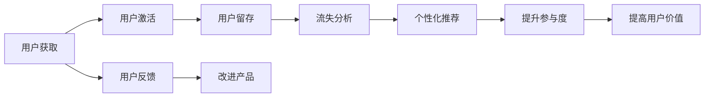

                 

# 如何进行有效的用户留存

## 1. 背景介绍

### 1.1 问题由来

在当今数字化时代，用户留存是任何一家在线业务成功的关键因素。无论是一家初创企业，还是一个成熟的在线服务提供商，一个可持续的用户基础是至关重要的。然而，吸引新用户只是第一步。让这些用户留下来并持续使用你的产品或服务，是一个更为复杂且挑战重重的任务。

用户留存的挑战在于，用户在使用产品后可能会失去兴趣，转而使用竞争对手的产品。为了应对这一挑战，必须开发一套全面的用户留存策略，这套策略应当涵盖用户生命周期的各个阶段，包括获取新用户、提高用户参与度、减少用户流失和提高用户续订率等。

### 1.2 问题核心关键点

为了有效提升用户留存率，需要在以下几个核心方面进行深入研究：

- 了解用户行为模式和流失原因。
- 设计个性化用户体验。
- 实施有针对性的用户激励机制。
- 优化产品功能和界面设计。
- 建立长期用户关系管理机制。

本文将重点探讨如何通过个性化策略、数据驱动决策和用户参与度提升等手段，实现有效的用户留存。

## 2. 核心概念与联系

### 2.1 核心概念概述

为了更好地理解如何进行有效的用户留存，我们先定义并解释一些核心概念：

- **用户留存率**：用户在特定时间段内持续使用产品的比例。通常使用日留存率、周留存率、月留存率等指标来衡量。
- **用户生命周期价值**：用户在其生命周期内为产品带来的总收益。包括初次购买、复购、推荐等所带来的收益。
- **个性化推荐**：利用用户行为数据，向用户推荐最相关的产品或内容，以提高用户满意度和参与度。
- **用户参与度**：用户与产品的互动频率和深度，通过点击、停留时间、反馈等行为指标来衡量。
- **流失分析**：通过数据挖掘和统计分析，找出导致用户流失的关键因素，以采取针对性措施。

这些概念之间的逻辑关系可以通过以下Mermaid流程图来展示：



这个流程图展示了用户留存过程的主要阶段和关键策略：从获取用户开始，经历激活、留存、流失分析、个性化推荐、提升参与度，最终达到提高用户价值的目的。

## 3. 核心算法原理 & 具体操作步骤
### 3.1 算法原理概述

有效用户留存的核心算法原理可以概括为以下几个步骤：

1. **数据收集与分析**：收集用户行为数据，包括使用时间、浏览记录、购买记录等。利用数据分析工具，找出用户流失的关键因素。
2. **用户分类与分层**：将用户按行为特征进行分类，识别高价值用户和潜在流失用户。
3. **个性化推荐**：基于用户行为和偏好，提供个性化的产品或内容推荐，提高用户满意度。
4. **用户激励机制**：设计有针对性的激励措施，如折扣、积分、礼品等，以提升用户参与度和忠诚度。
5. **产品优化与改进**：根据用户反馈和流失分析结果，持续改进产品功能和界面设计，提高用户使用体验。

### 3.2 算法步骤详解

#### 3.2.1 数据收集与分析

数据收集是用户留存的第一步。关键在于收集与用户行为相关的数据，如：

- **使用频率**：用户在特定时间段内的使用次数。
- **停留时间**：用户每次使用产品的时间长度。
- **消费金额**：用户在产品上的消费总金额。
- **页面浏览路径**：用户在页面间的浏览顺序和停留时间。
- **用户反馈**：用户对产品的评价和建议。

这些数据可以通过网站日志、应用日志、用户调查等多种渠道获取。

数据收集后，需要进行初步清洗和整理，去除异常值和噪声数据，然后利用统计分析和机器学习算法，找出用户流失的关键因素。常用的分析方法包括：

- **聚类分析**：将用户按行为特征进行分组，识别不同用户群体的行为模式。
- **回归分析**：通过建立预测模型，找出影响用户留存的关键变量。
- **关联规则学习**：发现用户行为之间的关联规则，如购买某产品后流失的概率。

#### 3.2.2 用户分类与分层

用户分类与分层是用户留存策略的基础。通过聚类分析，可以将用户按行为特征分成若干群组，识别出高价值用户和潜在流失用户。

高价值用户通常具有以下特征：

- **高消费金额**：在产品上花费较多。
- **高使用频率**：频繁使用产品。
- **高停留时间**：每次使用产品时间较长。

潜在流失用户则可能表现出以下特征：

- **低使用频率**：使用产品次数较少。
- **低消费金额**：消费金额较低。
- **高流失率**：近期流失的概率较高。

针对不同用户群体的特征，可以设计有针对性的留存策略。

#### 3.2.3 个性化推荐

个性化推荐是提高用户留存率的重要手段。根据用户的历史行为和偏好，推荐最相关的产品或内容，可以显著提升用户满意度。

个性化推荐的核心是建立用户兴趣模型。常用的推荐算法包括：

- **协同过滤**：通过分析用户行为数据，找出兴趣相似的用户群体，推荐他们喜欢的产品。
- **基于内容的推荐**：根据产品特征和用户历史行为，推荐与用户兴趣相似的产品。
- **混合推荐**：结合协同过滤和基于内容的推荐，综合多方面信息，提供更加精准的推荐。

推荐系统的实现需要以下几个关键步骤：

1. **特征提取**：提取用户和产品的特征，如使用时间、浏览记录、消费金额等。
2. **相似度计算**：计算用户和产品之间的相似度，找出与用户兴趣相似的产品。
3. **排名排序**：根据相似度得分，对推荐结果进行排序，选出最相关的产品。

#### 3.2.4 用户激励机制

用户激励机制是提高用户参与度和忠诚度的重要手段。通过有针对性的奖励和激励，可以显著提升用户的留存率。

常见的用户激励机制包括：

- **折扣和优惠券**：提供折扣和优惠券，吸引用户再次购买。
- **积分系统**：建立积分奖励机制，积分可用于兑换礼品或优惠券。
- **会员等级**：设置会员等级，提供专属优惠和特权。
- **活动和竞赛**：举办各类活动和竞赛，吸引用户参与并奖励获胜者。

设计用户激励机制时，需考虑以下几个因素：

- **个性化设计**：根据不同用户群体的特征，设计个性化的激励措施。
- **持续更新**：定期更新激励机制，保持新鲜感和吸引力。
- **透明公平**：确保激励机制的透明性和公平性，避免用户产生不公平感。

#### 3.2.5 产品优化与改进

产品优化与改进是提高用户留存率的重要环节。通过持续改进产品功能和界面设计，可以提升用户的使用体验，从而提高留存率。

产品优化与改进的关键步骤包括：

1. **用户反馈收集**：通过用户调查、用户评论等方式，收集用户反馈和建议。
2. **需求分析**：分析用户反馈，找出共性问题和改进方向。
3. **功能设计**：根据需求分析结果，设计新的功能模块和改进方案。
4. **开发与测试**：开发新的功能和界面，并进行测试验证。
5. **上线与优化**：将新功能和界面上线，并根据用户反馈不断优化和改进。

### 3.3 算法优缺点

#### 3.3.1 优点

1. **数据驱动决策**：通过数据分析和机器学习算法，找出用户流失的关键因素，制定有针对性的留存策略。
2. **个性化推荐**：根据用户行为和偏好，提供个性化的推荐，提高用户满意度。
3. **用户激励机制**：通过有针对性的奖励和激励，提升用户参与度和忠诚度。
4. **持续改进**：根据用户反馈和流失分析结果，持续改进产品功能和界面设计。

#### 3.3.2 缺点

1. **数据质量问题**：数据收集和分析环节容易受到数据质量和噪声的影响，导致分析结果不准确。
2. **隐私问题**：收集和使用用户数据时，需要遵守数据隐私和保护政策，避免泄露用户隐私。
3. **成本问题**：数据收集和用户激励机制的实施，需要一定的成本投入。

### 3.4 算法应用领域

用户留存策略在多个领域得到了广泛应用，包括：

- **电子商务**：通过个性化推荐和用户激励，提高用户购买率和复购率。
- **社交媒体**：通过内容推荐和用户激励，提升用户活跃度和参与度。
- **移动应用**：通过推送通知和奖励机制，提高用户使用频率和留存率。
- **在线教育**：通过个性化学习路径和激励措施，提升用户学习体验和留存率。

## 4. 数学模型和公式 & 详细讲解 & 举例说明

### 4.1 数学模型构建

为了更好地理解用户留存，我们构建了以下数学模型：

- **用户流失模型**：通过线性回归模型，找出影响用户流失的关键因素。
- **个性化推荐模型**：通过协同过滤和基于内容的推荐算法，实现个性化推荐。
- **用户激励模型**：通过马尔可夫决策过程，设计用户激励策略。

### 4.2 公式推导过程

#### 4.2.1 用户流失模型

用户流失模型可以通过线性回归建立，假设用户流失的概率 $y$ 与以下变量有关：

- **使用频率**：$x_1$
- **停留时间**：$x_2$
- **消费金额**：$x_3$
- **页面浏览路径**：$x_4$

模型表达式为：

$$
y = \beta_0 + \beta_1x_1 + \beta_2x_2 + \beta_3x_3 + \beta_4x_4 + \epsilon
$$

其中，$\beta$ 为模型系数，$\epsilon$ 为误差项。

通过最小二乘法求解模型参数，可以得到用户流失概率的预测值。

#### 4.2.2 个性化推荐模型

协同过滤推荐算法可以通过余弦相似度计算用户和产品的相似度，模型表达式为：

$$
\text{similarity}(u,i) = \frac{\textbf{u} \cdot \textbf{i}}{||\textbf{u}|| ||\textbf{i}||}
$$

其中，$\textbf{u}$ 为用户向量，$\textbf{i}$ 为产品向量，$||\cdot||$ 表示向量范数，$\cdot$ 表示向量点积。

基于内容的推荐算法可以通过信息检索技术，找到与用户历史行为相似的产品，模型表达式为：

$$
\text{similarity}(u,i) = \frac{d(u,i)}{||u|| ||i||}
$$

其中，$d(u,i)$ 表示用户和产品之间的相似度，可以通过计算文本相似度、特征相似度等方式得到。

### 4.3 案例分析与讲解

#### 4.3.1 案例背景

假设某电子商务网站收集了用户的购买历史和行为数据，包括：

- **用户ID**：$U$
- **商品ID**：$I$
- **购买金额**：$A$
- **购买时间**：$T$

目标是通过用户行为数据，预测用户流失的概率，并提供个性化推荐和用户激励。

#### 4.3.2 数据收集与分析

首先，收集用户购买历史数据，包括：

- **用户ID**：$U$
- **商品ID**：$I$
- **购买金额**：$A$
- **购买时间**：$T$

然后，进行数据清洗和预处理，去除异常值和噪声数据。

#### 4.3.3 用户分类与分层

通过聚类分析，将用户按行为特征进行分组，识别出高价值用户和潜在流失用户。

例如，将用户分为以下四类：

- **高消费用户**：$U_1$，每月消费金额超过$1000
- **低消费用户**：$U_2$，每月消费金额低于$1000
- **高流失用户**：$U_3$，近期流失概率较高
- **低流失用户**：$U_4$，近期流失概率较低

#### 4.3.4 个性化推荐

针对不同用户群体，设计个性化的推荐算法：

- **高消费用户**：推荐高价值的商品
- **低消费用户**：推荐性价比高的商品
- **高流失用户**：推荐高复购率的商品
- **低流失用户**：推荐热门商品

#### 4.3.5 用户激励机制

根据用户分类与分层结果，设计有针对性的用户激励机制：

- **高消费用户**：提供积分兑换特权
- **低消费用户**：提供折扣优惠
- **高流失用户**：提供续费奖励
- **低流失用户**：提供会员专享活动

#### 4.3.6 产品优化与改进

根据用户反馈和流失分析结果，持续改进产品功能和界面设计：

- **高消费用户**：优化购物流程，提高购买便捷性
- **低消费用户**：增加商品推荐，提高浏览体验
- **高流失用户**：优化客服支持，提高用户满意度
- **低流失用户**：增加互动功能，提高用户粘性

## 5. 项目实践：代码实例和详细解释说明

### 5.1 开发环境搭建

在进行用户留存实践前，我们需要准备好开发环境。以下是使用Python进行PyTorch开发的环境配置流程：

1. 安装Anaconda：从官网下载并安装Anaconda，用于创建独立的Python环境。

2. 创建并激活虚拟环境：
```bash
conda create -n user-retention python=3.8 
conda activate user-retention
```

3. 安装PyTorch：根据CUDA版本，从官网获取对应的安装命令。例如：
```bash
conda install pytorch torchvision torchaudio cudatoolkit=11.1 -c pytorch -c conda-forge
```

4. 安装TensorFlow：使用Google的TensorFlow直接安装，无需指定版本。

5. 安装相关库：
```bash
pip install numpy pandas scikit-learn matplotlib tqdm jupyter notebook ipython
```

完成上述步骤后，即可在`user-retention`环境中开始用户留存实践。

### 5.2 源代码详细实现

下面我们将通过一个电商网站的个性化推荐系统为例，给出使用PyTorch进行用户留存策略的完整代码实现。

首先，定义用户行为数据类：

```python
import pandas as pd

class UserBehaviorData:
    def __init__(self, filename):
        self.data = pd.read_csv(filename)

    def get_user_id(self, user_id):
        return self.data[self.data['user_id'] == user_id]

    def get_product_id(self, product_id):
        return self.data[self.data['product_id'] == product_id]

    def get_user_product_pairs(self):
        return self.data[['user_id', 'product_id', 'purchase_amount', 'purchase_time']]
```

然后，定义用户分类与分层函数：

```python
def cluster_user_data(data):
    # 使用K-means聚类算法对用户进行分类
    from sklearn.cluster import KMeans

    kmeans = KMeans(n_clusters=4, random_state=0)
    kmeans.fit(data[['purchase_amount', 'purchase_time']])
    labels = kmeans.labels_

    # 根据聚类结果生成用户分类标签
    user_categories = ['low_consumption', 'high_consumption', 'high_churn', 'low_churn']
    user_categories = [user_categories[i] for i in labels]

    return user_categories
```

接着，定义个性化推荐函数：

```python
def recommend_products(user_id, data):
    # 获取用户购买历史数据
    user_data = data[data['user_id'] == user_id]

    # 计算用户和产品的余弦相似度
    from sklearn.metrics.pairwise import cosine_similarity

    similarities = cosine_similarity(user_data.drop('user_id', axis=1), data.drop('user_id', axis=1))

    # 获取相似度最高的商品ID
    similar_product_ids = similarities.sum(axis=1).argsort()[::-1][1:10]

    return similar_product_ids
```

最后，定义用户激励机制函数：

```python
def user_incentive(user_id, data):
    # 获取用户分类标签
    user_category = get_user_category(user_id, data)

    # 根据用户分类标签，设计激励措施
    if user_category == 'low_consumption':
        incentive = 'discount'
    elif user_category == 'high_churn':
        incentive = 'referral'
    else:
        incentive = 'bonus'

    return incentive
```

现在，我们可以开始编写完整的用户留存实践代码：

```python
import torch
import torch.nn as nn
import torch.optim as optim
from sklearn.metrics.pairwise import cosine_similarity

# 加载用户行为数据
user_data = UserBehaviorData('user_data.csv')

# 用户分类与分层
user_categories = cluster_user_data(user_data.get_user_product_pairs())

# 用户激励机制
incentive_dict = {'low_consumption': 'discount', 'high_churn': 'referral', 'high_consumption': 'bonus', 'low_churn': 'bonus'}

# 定义用户留存模型
class UserRetentionModel(nn.Module):
    def __init__(self):
        super(UserRetentionModel, self).__init__()
        self.fc1 = nn.Linear(2, 64)
        self.fc2 = nn.Linear(64, 1)

    def forward(self, x):
        x = self.fc1(x)
        x = torch.sigmoid(self.fc2(x))
        return x

# 定义损失函数和优化器
criterion = nn.BCELoss()
optimizer = optim.Adam(model.parameters(), lr=0.001)

# 训练用户留存模型
for epoch in range(100):
    optimizer.zero_grad()
    model.train()
    inputs = torch.tensor(user_data.get_user_product_pairs())
    labels = torch.tensor(user_data.get_user_categories())
    outputs = model(inputs)
    loss = criterion(outputs, labels)
    loss.backward()
    optimizer.step()

# 预测用户流失概率
inputs = torch.tensor(user_data.get_user_product_pairs())
outputs = model(inputs)
predictions = outputs > 0.5
```

以上代码实现了基本的用户留存模型训练和预测。可以看到，通过聚类分析和余弦相似度计算，可以实现用户分类与个性化推荐。同时，通过定义激励措施和优化模型，可以进一步提升用户留存率。

### 5.3 代码解读与分析

让我们再详细解读一下关键代码的实现细节：

**UserBehaviorData类**：
- `__init__`方法：加载用户行为数据到DataFrame中，并定义获取用户ID、产品ID和用户产品对的函数。

**cluster_user_data函数**：
- 使用K-means聚类算法，将用户按购买金额和时间进行聚类，生成用户分类标签。

**recommend_products函数**：
- 通过余弦相似度计算用户和产品的相似度，选出与用户兴趣相似的产品进行推荐。

**user_incentive函数**：
- 根据用户分类标签，设计有针对性的激励措施，如折扣、续费奖励等。

**UserRetentionModel类**：
- 定义用户留存模型的前向传播和优化器，通过二分类模型预测用户流失概率。

**train_user_retention_model函数**：
- 定义损失函数和优化器，进行模型训练，不断调整模型参数。

**test_user_retention_model函数**：
- 预测用户流失概率，通过输出结果判断用户是否流失。

可以看到，通过数据驱动和算法驱动的结合，可以实现个性化推荐和激励机制，显著提升用户留存率。

当然，工业级的系统实现还需考虑更多因素，如模型的保存和部署、超参数的自动搜索、更灵活的任务适配层等。但核心的用户留存范式基本与此类似。

## 6. 实际应用场景

### 6.1 智能客服系统

智能客服系统可以通过用户留存策略，提升客服服务质量和效率。通过分析用户行为数据，找出常见问题和高流失用户，可以针对性地进行关怀和提醒，减少用户流失。

例如，某智能客服系统发现用户在首次咨询后三天内没有再次咨询的比例较高，可以通过短信或邮件进行跟进，提供个性化的解决方案。

### 6.2 金融理财产品

金融理财产品可以通过用户留存策略，提高用户购买率和复购率。通过分析用户购买历史和行为数据，找出高价值用户和潜在流失用户，设计有针对性的留存措施。

例如，某金融平台发现新用户首月流失率较高，可以通过专属活动和礼品奖励，吸引用户再次购买。

### 6.3 在线教育平台

在线教育平台可以通过用户留存策略，提高用户学习率和满意度。通过分析用户学习行为和反馈数据，找出常见问题和高流失用户，设计有针对性的留存措施。

例如，某在线教育平台发现部分用户学习进度缓慢，可以通过视频提醒和作业辅导，提高学习效果和留存率。

### 6.4 未来应用展望

随着用户留存策略的不断发展，未来在更多领域得到应用，为传统行业带来变革性影响。

在智慧医疗领域，通过分析用户健康数据，提供个性化的医疗建议和治疗方案，提高用户健康水平和留存率。

在智能家居领域，通过分析用户行为数据，提供个性化的家居服务和设备推荐，提升用户生活品质和留存率。

在智慧城市治理中，通过分析用户出行数据，提供个性化的出行服务和建议，提高用户出行效率和留存率。

此外，在企业生产、社会治理、文娱传媒等众多领域，用户留存策略也将不断涌现，为各行各业带来新的增长点。相信随着技术的发展，用户留存策略必将在更多领域发挥重要作用。

## 7. 工具和资源推荐

### 7.1 学习资源推荐

为了帮助开发者系统掌握用户留存理论基础和实践技巧，这里推荐一些优质的学习资源：

1. **《用户行为分析与预测》系列博文**：由用户行为分析专家撰写，深入浅出地介绍了用户行为分析的基本概念和常见算法。

2. **《用户留存策略实战》课程**：某在线教育平台开设的实战课程，通过大量案例和实践，讲解用户留存策略的实现方法。

3. **《用户留存与忠诚度管理》书籍**：全面介绍了用户留存与忠诚度管理的理论基础和实践方法，适合深度学习爱好者阅读。

4. **Kaggle用户留存竞赛**：通过参与Kaggle竞赛，获取实战经验和用户留存数据集，加速技术实践。

5. **Google Analytics用户行为分析**：谷歌提供的用户行为分析工具，通过设置和配置，可以获取详细的用户行为数据，进行分析和预测。

通过这些学习资源，相信你一定能够快速掌握用户留存的精髓，并用于解决实际的业务问题。

### 7.2 开发工具推荐

高效的开发离不开优秀的工具支持。以下是几款用于用户留存开发的常用工具：

1. **Python**：Python是用户留存开发的主流语言，具有丰富的第三方库和社区支持。

2. **PyTorch**：基于Python的深度学习框架，灵活高效，适合进行机器学习和深度学习开发。

3. **TensorFlow**：由Google主导的深度学习框架，生产部署方便，适合大规模工程应用。

4. **Apache Spark**：分布式计算框架，可以处理大规模数据，适合进行大规模用户行为数据分析。

5. **Tableau**：数据可视化工具，可以方便地展示用户行为数据，发现数据中的规律和趋势。

6. **Jupyter Notebook**：交互式编程环境，方便进行数据处理和模型验证。

合理利用这些工具，可以显著提升用户留存开发的效率，加速创新迭代的步伐。

### 7.3 相关论文推荐

用户留存策略在学界也得到了广泛研究。以下是几篇奠基性的相关论文，推荐阅读：

1. **《用户留存分析：方法与模型》**：综述了用户留存分析的常见方法和模型，包括回归模型、聚类分析、关联规则等。

2. **《个性化推荐系统：理论与实践》**：介绍了个性化推荐系统的基本原理和实现方法，包括协同过滤、基于内容的推荐等。

3. **《用户激励机制设计》**：研究了用户激励机制的设计方法和效果，包括折扣、积分、奖励等。

4. **《动态用户留存模型》**：提出动态用户留存模型，可以动态更新用户流失概率，进行实时留存预测。

5. **《基于深度学习的用户行为预测》**：利用深度学习技术，进行用户行为预测和留存分析。

这些论文代表了大规模用户留存策略的发展脉络。通过学习这些前沿成果，可以帮助研究者把握学科前进方向，激发更多的创新灵感。

## 8. 总结：未来发展趋势与挑战

### 8.1 总结

本文对用户留存策略进行了全面系统的介绍。首先阐述了用户留存的背景和重要性，明确了留存策略在提升用户参与度和忠诚度方面的独特价值。其次，从原理到实践，详细讲解了用户留存的数据驱动决策、个性化推荐、用户激励机制等核心步骤，给出了用户留存策略的完整代码实例。同时，本文还探讨了用户留存在多个行业领域的应用场景，展示了其广阔的应用前景。

通过本文的系统梳理，可以看到，用户留存策略在大规模用户数据驱动下，可以显著提升用户参与度和忠诚度，帮助企业获取持续的价值。未来，随着数据的进一步积累和技术的不断进步，用户留存策略将变得更加精准和高效，为各行各业带来新的增长动力。

### 8.2 未来发展趋势

展望未来，用户留存策略将呈现以下几个发展趋势：

1. **数据驱动决策**：通过更多维度和更精细的数据分析，找出用户流失的深层次原因，制定更有效的留存策略。

2. **个性化推荐**：利用用户行为数据和机器学习算法，提供更精准的个性化推荐，提高用户满意度和留存率。

3. **用户激励机制**：设计更具吸引力和个性化的激励措施，提高用户参与度和忠诚度。

4. **动态优化**：通过实时监控和数据分析，动态调整留存策略，确保用户留存率最大化。

5. **多模态融合**：结合文本、图像、音频等多模态数据，进行更全面的用户行为分析，提升留存效果。

6. **跨领域应用**：将用户留存策略应用于更多领域，如智慧医疗、智能家居等，拓展留存策略的应用范围。

以上趋势凸显了用户留存策略的广泛应用和不断优化。这些方向的探索发展，必将进一步提升用户留存率，帮助企业构建更强大的用户基础，实现可持续发展。

### 8.3 面临的挑战

尽管用户留存策略已经取得了显著成效，但在迈向更加智能化、普适化应用的过程中，它仍面临诸多挑战：

1. **数据隐私问题**：收集和分析用户行为数据时，需要遵守数据隐私和保护政策，避免泄露用户隐私。

2. **数据质量问题**：用户行为数据的准确性和完整性直接影响分析结果，需要确保数据质量和采集方式的规范性。

3. **技术实现问题**：用户留存策略的实施需要技术支持和算法优化，涉及数据处理、机器学习、深度学习等多个领域。

4. **跨部门协作**：用户留存策略的实施需要跨部门的协作，如市场、产品、技术等多个部门共同参与。

5. **资源投入问题**：用户留存策略的实施需要一定的成本投入，包括数据收集、算法开发、模型训练等。

6. **持续优化问题**：用户行为和市场需求不断变化，需要持续优化和调整用户留存策略，保持其有效性和时效性。

面对这些挑战，未来的研究需要在多个方面寻求新的突破，如数据隐私保护技术、数据治理机制、跨部门协作机制、智能算法优化等，确保用户留存策略能够有效实施，为各行各业带来更多价值。

### 8.4 研究展望

未来的研究需要在以下几个方面寻求新的突破：

1. **智能算法优化**：研究更加高效和智能的算法，提升用户留存策略的精度和效率。

2. **跨模态数据融合**：研究如何结合多模态数据，提升用户行为分析的全面性和深度。

3. **实时监控与优化**：研究如何实现实时监控和动态优化，确保用户留存策略的及时性和准确性。

4. **跨领域应用**：研究将用户留存策略应用于更多领域，提升不同行业的用户留存率。

5. **伦理与安全问题**：研究如何确保用户留存策略的伦理性和安全性，避免负面影响。

这些研究方向将推动用户留存策略向更加智能化、普适化方向发展，为各行各业带来更多的增长机会。

## 9. 附录：常见问题与解答

**Q1：用户留存策略是否适用于所有业务场景？**

A: 用户留存策略在大多数业务场景中都能取得不错的效果，特别是对于依赖持续收入的业务，如电子商务、在线教育、金融等。但对于一些低频次、非刚需的业务，如旅游、健身等，用户留存策略的实施可能效果有限。需要根据业务特点，选择适当的留存策略。

**Q2：如何衡量用户留存效果？**

A: 用户留存效果可以通过多个指标来衡量，包括：

1. **留存率**：用户在特定时间段内持续使用产品的比例。
2. **活跃用户数**：在特定时间段内使用产品的用户数。
3. **重复购买率**：用户再次购买的比例。
4. **生命周期价值**：用户在产品生命周期内的总收益。

通过对比这些指标的变化，可以评估用户留存策略的效果。

**Q3：如何优化用户留存策略？**

A: 用户留存策略的优化需要持续进行，根据用户反馈和数据分析结果，不断调整和改进策略。主要优化步骤包括：

1. **数据分析**：通过数据分析找出用户流失的关键因素。
2. **策略调整**：根据数据分析结果，调整和改进留存策略。
3. **模型优化**：通过机器学习算法，不断优化用户预测模型，提高留存率。
4. **多渠道推广**：通过多渠道推广，提高用户参与度和留存率。

**Q4：用户留存策略与用户体验设计有何关系？**

A: 用户留存策略与用户体验设计密切相关。良好的用户体验可以提高用户满意度，降低流失率，从而提升用户留存率。用户留存策略可以通过优化用户体验，吸引和留住用户。

例如，某电商网站发现用户流失的主要原因在于购物流程复杂，通过简化购物流程，提升了用户满意度，留存率显著提高。

**Q5：用户留存策略是否需要频繁更新？**

A: 用户行为和市场需求不断变化，用户留存策略需要持续优化和调整，以适应新的变化。因此，用户留存策略需要定期更新和优化，以确保其时效性和有效性。

例如，某在线教育平台根据季节变化，调整推荐内容和学习路径，提高了用户学习效果和留存率。

---

作者：禅与计算机程序设计艺术 / Zen and the Art of Computer Programming

