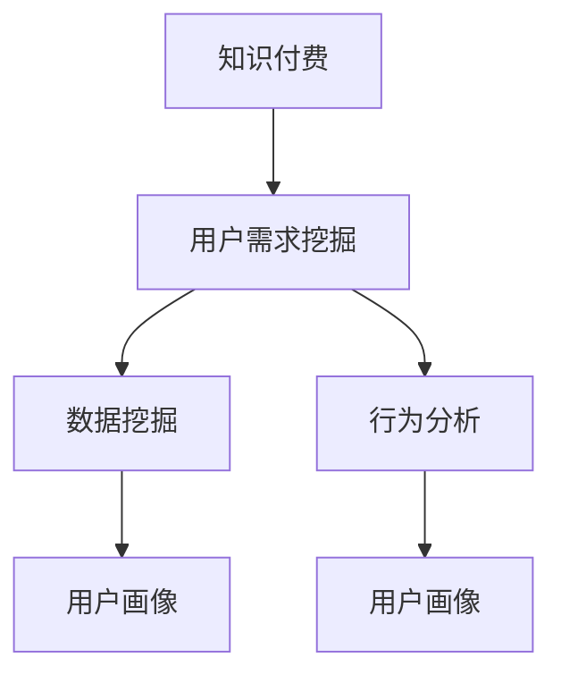

                 

# 如何进行知识付费的用户需求挖掘

> 关键词：知识付费,用户需求挖掘,产品设计,用户体验,行为分析

## 1. 背景介绍

### 1.1 问题由来

随着信息爆炸和知识经济的发展，知识付费日益成为个人提升和组织发展的重要方式。然而，市场上的知识付费产品众多，如何准确识别用户需求，设计出能够满足用户期望的产品，成为亟待解决的问题。需求挖掘不仅关系到产品能否成功落地，也直接影响用户体验和用户粘性。

### 1.2 问题核心关键点

用户需求挖掘是知识付费产品设计的基础，旨在通过深入分析用户行为数据和反馈信息，精准把握用户的痛点和期望，从而指导产品的功能定位、内容设计和推广策略。这一过程包括数据收集、数据预处理、数据分析和结果验证等多个环节，是知识付费领域的重要环节。

## 2. 核心概念与联系

### 2.1 核心概念概述

为了更好地理解知识付费的用户需求挖掘过程，本节将介绍几个密切相关的核心概念：

- 知识付费：通过付费获得高质量内容，如电子书、在线课程、专家讲座等，以提升自我或组织的专业水平。
- 用户需求挖掘：通过数据分析、行为观察等方式，识别用户真实需求的过程，是知识付费产品设计的核心。
- 数据挖掘：从大量数据中提取出有用的信息和知识，用于支持决策和分析。
- 行为分析：研究用户的行为模式和偏好，为产品优化提供依据。
- 用户画像：构建用户个体的全面特征描述，用于指导个性化推荐和内容定制。

这些核心概念之间的逻辑关系可以通过以下Mermaid流程图来展示：



这个流程图展示了这个领域的关键概念及其之间的关系：

1. 知识付费作为背景，驱动用户需求挖掘过程。
2. 用户需求挖掘基于数据挖掘和行为分析，挖掘出关键信息。
3. 数据挖掘和行为分析的成果用于构建用户画像，支撑个性化推荐和内容定制。

## 3. 核心算法原理 & 具体操作步骤

### 3.1 算法原理概述

用户需求挖掘过程主要基于数据挖掘和行为分析技术，通过收集用户行为数据和反馈信息，识别用户兴趣和需求。其核心算法包括聚类分析、关联规则挖掘、分类器训练等，通过这些技术手段，从数据中提取用户画像，用于指导产品设计和内容定制。

### 3.2 算法步骤详解

1. **数据收集**：收集用户注册信息、学习行为、支付记录、反馈评价等多维度数据，涵盖用户的兴趣偏好、购买历史、互动行为等。

2. **数据预处理**：对收集的数据进行清洗、去重、填充缺失值、归一化等预处理步骤，确保数据质量。

3. **数据挖掘**：
   - **聚类分析**：通过K-means、层次聚类等算法，将用户分成不同的群体，识别出不同群体的特征和需求。
   - **关联规则挖掘**：使用Apriori、FP-Growth等算法，发现用户行为之间的关联规则，如某类用户更倾向于购买某类课程。
   - **分类器训练**：采用决策树、SVM、神经网络等算法，构建用户分类模型，预测新用户可能的兴趣类型。

4. **用户画像构建**：
   - **基本画像**：基于人口统计学信息、学习行为、支付习惯等基本数据，构建用户的基本画像。
   - **兴趣画像**：通过兴趣标签、内容偏好、互动记录等数据，构建用户的兴趣画像。
   - **行为画像**：分析用户的互动频率、学习时长、付费意愿等行为特征，构建行为画像。

5. **需求识别**：
   - **热点需求**：通过分析聚类结果和分类器输出，识别出用户群体的热点需求。
   - **个体需求**：针对每个用户，分析其兴趣画像和行为画像，识别出个性化的需求。

6. **结果验证与优化**：
   - **验证**：通过A/B测试、问卷调查等手段，验证需求挖掘结果的准确性和有效性。
   - **优化**：根据验证结果，调整算法参数、数据处理方式等，不断优化需求挖掘模型。

### 3.3 算法优缺点

用户需求挖掘算法具有以下优点：
1. 数据驱动：基于用户行为数据，可以更客观地识别用户需求，避免主观偏见。
2. 全面性：涵盖用户的多个维度和多个时间点，能够提供更全面的用户画像。
3. 动态更新：随着新数据的不断产生，需求挖掘模型可以动态调整，保持最新。

同时，该算法也存在一定的局限性：
1. 数据质量依赖：数据挖掘结果的质量直接依赖于数据的完整性和准确性，数据缺失或不准确会导致结果偏差。
2. 隐私风险：大量个人数据的收集和分析可能涉及隐私问题，需要严格的隐私保护措施。
3. 模型复杂度：构建复杂的用户画像和分类模型可能增加计算复杂度，影响效率。

### 3.4 算法应用领域

用户需求挖掘算法在知识付费领域的应用广泛，包括但不限于以下场景：

- **课程推荐**：根据用户画像和兴趣画像，推荐相关课程和专家讲座，提升用户粘性和满意度。
- **学习路径定制**：结合用户行为和反馈，设计个性化的学习路径，帮助用户更高效地掌握知识。
- **内容优化**：通过用户反馈和行为数据，指导内容优化和更新，提高内容质量和用户吸引力。
- **定价策略调整**：分析不同用户群体的支付意愿和价值，制定差异化的定价策略，提高收益。
- **用户体验改进**：通过行为分析识别用户痛点，优化产品界面和功能，提升用户体验。

## 4. 数学模型和公式 & 详细讲解 & 举例说明

### 4.1 数学模型构建

用户需求挖掘过程涉及多个数学模型和算法，这里将以聚类分析和关联规则挖掘为例，详细讲解模型构建和推导。

#### 聚类分析
假设收集到N个用户的行为数据，每个数据有D个特征。将这N个数据视为N个点，聚类分析的目的是将这N个点分成K个簇，使得同一簇内的点相似度尽可能高，不同簇内的点相似度尽可能低。

- **K-means算法**：通过迭代优化，将N个点分为K个簇。公式如下：
  $$
  C_k = \arg\min_{C_k} \sum_{i=1}^{N} || x_i - \mu_k ||^2 \text{  } (k = 1, 2, ..., K)
  $$
  其中，$x_i$ 为第i个用户的行为数据，$\mu_k$ 为第k簇的中心点。

- **层次聚类算法**：将N个点逐步合并成K个簇。公式如下：
  $$
  D(A_k, B_k) = \sum_{i=1}^{n_A} \sum_{j=1}^{n_B} d(x_{A_i}, x_{B_j})
  $$
  其中，$A_k$ 和 $B_k$ 为两个簇，$d(x_{A_i}, x_{B_j})$ 为点之间的距离。

#### 关联规则挖掘
关联规则挖掘旨在从大量事务数据中提取关联规则，比如“用户购买了课程A，倾向于购买课程B”。

- **Apriori算法**：通过候选集的生成和剪枝，逐步挖掘出频繁项集和关联规则。公式如下：
  $$
  f(I) = \frac{\text{Support}(I)}{\text{Support}(I-1)}
  $$
  其中，$I$ 为候选项集，$\text{Support}(I)$ 为项集的支持度。

- **FP-Growth算法**：基于FP-Tree数据结构，加速频繁项集的挖掘。公式如下：
  $$
  f(I) = \text{count}(I) \times \text{count}(I-1) / \text{count}(I-2)
  $$
  其中，$\text{count}(I)$ 为项集I的出现次数。

### 4.2 公式推导过程

- **K-means算法推导**：
  - 初始化K个簇的中心点$\mu_k$。
  - 对每个数据点$x_i$，计算其与各中心点的距离，将其分配到最近的簇C_k。
  - 更新各簇的中心点$\mu_k$，计算新中心点的平均值。
  - 重复迭代直至收敛。

  公式推导如下：
  $$
  \mu_k = \frac{1}{|C_k|} \sum_{x \in C_k} x
  $$

- **Apriori算法推导**：
  - 首先生成所有1-项频繁项集L_1。
  - 然后生成所有2-项候选集C_2，剪枝得到2-项频繁项集L_2。
  - 重复生成候选集C_k，剪枝得到k-项频繁项集L_k。
  - 最后，根据L_k生成关联规则R。

  公式推导如下：
  $$
  L_1 = \{ x \in D | \text{count}(x) \geq \text{min_supp} \}
  $$
  $$
  C_k = \{ (x_1, x_2, ..., x_k) | x_i \in L_{k-1}, x_i \cap x_j = \varnothing \text{  } (1 \leq i < j \leq k) \}
  $$
  $$
  L_k = \{ x \in C_k | \text{count}(x) \geq \text{min_supp} \}
  $$

### 4.3 案例分析与讲解

**案例1：课程推荐**

- **数据收集**：收集用户注册信息、学习行为、课程评价等数据，构建用户画像。
- **数据预处理**：清洗数据，删除重复记录，填补缺失值，归一化数据。
- **聚类分析**：通过K-means算法，将用户分成活跃用户、中等用户和低活跃用户三个簇。
- **关联规则挖掘**：使用Apriori算法，挖掘出活跃用户倾向于购买计算机编程和数据科学相关课程的规则。
- **用户画像构建**：根据聚类和关联规则结果，构建用户画像，指导课程推荐。

**案例2：学习路径定制**

- **数据收集**：记录用户的课程学习进度、答题情况、成绩等数据。
- **数据预处理**：清洗数据，删除无效记录，填补缺失值。
- **行为分析**：通过分析用户的答题时间、错误类型等行为特征，识别出用户的学习困难点。
- **分类器训练**：使用SVM算法，构建用户学习障碍模型。
- **学习路径定制**：根据用户画像和分类器输出，推荐针对性的习题和强化训练课程。

## 5. 项目实践：代码实例和详细解释说明

### 5.1 开发环境搭建

在进行用户需求挖掘实践前，我们需要准备好开发环境。以下是使用Python进行Scikit-learn开发的计算环境配置流程：

1. 安装Anaconda：从官网下载并安装Anaconda，用于创建独立的Python环境。

2. 创建并激活虚拟环境：
```bash
conda create -n sklearn-env python=3.8 
conda activate sklearn-env
```

3. 安装Scikit-learn：从官网获取对应的安装命令。例如：
```bash
conda install scikit-learn scikit-cluster scikit-learn-contrib
```

4. 安装各类工具包：
```bash
pip install numpy pandas scipy matplotlib tqdm joblib seaborn jupyter notebook ipython
```

完成上述步骤后，即可在`sklearn-env`环境中开始用户需求挖掘实践。

### 5.2 源代码详细实现

下面我们以用户聚类分析为例，给出使用Scikit-learn库对用户数据进行聚类的Python代码实现。

```python
from sklearn.cluster import KMeans
from sklearn.decomposition import PCA
import pandas as pd
import numpy as np

# 加载用户数据
data = pd.read_csv('user_data.csv')

# 数据预处理
# 这里省略数据预处理步骤

# 数据降维
pca = PCA(n_components=2)
data_pca = pca.fit_transform(data)

# 聚类分析
kmeans = KMeans(n_clusters=3)
kmeans.fit(data_pca)

# 可视化聚类结果
import matplotlib.pyplot as plt
plt.scatter(data_pca[:,0], data_pca[:,1], c=kmeans.labels_)
plt.show()
```

### 5.3 代码解读与分析

让我们再详细解读一下关键代码的实现细节：

**用户数据加载**：
- 使用`pandas`库的`read_csv`方法，读取用户行为数据。

**数据预处理**：
- 数据清洗、去重、填补缺失值、归一化等预处理步骤。

**数据降维**：
- 使用`sklearn.decomposition.PCA`方法进行降维，将高维数据映射到二维空间。

**聚类分析**：
- 使用`sklearn.cluster.KMeans`方法进行聚类分析，将用户分成不同的簇。

**可视化聚类结果**：
- 使用`matplotlib`库的`scatter`方法，将聚类结果可视化。

可以看到，Scikit-learn库提供了丰富的数据挖掘和聚类算法，使得用户需求挖掘的代码实现变得简洁高效。开发者可以根据具体需求，进一步使用关联规则挖掘、分类器训练等算法，完成更全面的需求挖掘。

## 6. 实际应用场景

### 6.1 智能课程推荐

用户需求挖掘技术在智能课程推荐中应用广泛。通过分析用户的课程学习行为和评价反馈，可以构建用户画像，指导课程推荐算法设计。

具体而言，可以收集用户的学习记录、评价数据、互动行为等，构建用户画像。通过K-means聚类算法，将用户分成不同的兴趣群体。使用Apriori算法挖掘关联规则，发现不同群体的兴趣偏好，指导课程推荐系统推荐相关课程。例如，对于活跃用户群体，推荐热门编程课程；对于中等用户群体，推荐中级数据分析课程；对于低活跃用户群体，推荐兴趣拓展课程。

### 6.2 个性化学习路径定制

用户需求挖掘技术还可以用于个性化学习路径的定制。通过分析用户的学习行为和效果，可以识别出用户的薄弱环节，指导学习路径的个性化设计。

例如，可以收集用户的学习记录、答题情况、成绩数据等，构建用户行为画像。使用分类器算法，分析用户的学习障碍点。根据行为画像和分类器输出，设计个性化的学习路径，推荐针对性的习题和强化训练课程，帮助用户克服学习障碍，提高学习效率。

### 6.3 内容优化和定价策略调整

用户需求挖掘技术还可以用于内容优化和定价策略调整。通过分析用户的行为和反馈，可以识别出用户对内容的需求和偏好，指导内容的优化和定价策略的设计。

例如，可以收集用户的内容浏览记录、购买记录、评价反馈等，构建用户画像。通过K-means聚类算法，将用户分成不同的兴趣群体。使用分类器算法，分析用户的支付意愿和价值。根据画像和分类器输出，优化内容质量，调整定价策略，满足不同用户群体的需求，提高平台收益。

### 6.4 未来应用展望

随着用户需求挖掘技术的不断进步，其在知识付费领域的应用也将更加广泛和深入。

未来，用户需求挖掘技术将逐步实现自动化和智能化，通过机器学习和深度学习算法，更精准地识别用户需求，优化产品设计和内容推荐。同时，将更多领域的数据和知识融合，构建更全面、更动态的用户画像，推动知识付费产品的不断升级和迭代。

## 7. 工具和资源推荐

### 7.1 学习资源推荐

为了帮助开发者系统掌握用户需求挖掘的理论基础和实践技巧，这里推荐一些优质的学习资源：

1. 《数据挖掘：概念与技术》书籍：系统介绍了数据挖掘的基本概念和常用算法，适合初学者入门。
2. 《Python数据科学手册》书籍：全面讲解了数据预处理、数据可视化、机器学习等技术，是数据分析领域的经典书籍。
3. 《机器学习实战》课程：由Google工程师编写，深入浅出地讲解了机器学习算法，提供大量实例代码。
4. Coursera《数据科学导论》课程：斯坦福大学开设的入门课程，涵盖数据科学的基本概念和方法，适合零基础学习。
5. Kaggle：数据科学竞赛平台，提供海量数据集和Kaggle竞赛题目，适合动手实践。

通过对这些资源的学习实践，相信你一定能够快速掌握用户需求挖掘的精髓，并用于解决实际的业务问题。

### 7.2 开发工具推荐

高效的开发离不开优秀的工具支持。以下是几款用于用户需求挖掘开发的常用工具：

1. Jupyter Notebook：交互式编程环境，支持Python等语言，适合数据分析和可视化。
2. Pandas：数据处理库，支持大规模数据集的处理和分析。
3. Scikit-learn：机器学习库，提供丰富的数据挖掘和聚类算法。
4. Matplotlib：绘图库，支持多种绘图方式，适合数据可视化。
5. Seaborn：基于Matplotlib的高级绘图库，支持更丰富的统计图表。
6. TensorBoard：可视化工具，支持机器学习模型的性能监测和调试。

合理利用这些工具，可以显著提升用户需求挖掘的开发效率，加快创新迭代的步伐。

### 7.3 相关论文推荐

用户需求挖掘技术的发展源于学界的持续研究。以下是几篇奠基性的相关论文，推荐阅读：

1. K-means算法（1967）：D. S. Duda, P. E. Hart, D. G. Stork. 《Pattern Recognition and Machine Learning》。
2. Apriori算法（1994）：A. R. Kriegman, C. J. Kleinberg, K. Motwani. 《Frequent Pattern Growth》。
3. FP-Growth算法（1998）：A. J. Bricklin, J. Han, Y. Zhao. 《Algorithm 910: MFP-Tree: an Optimized FP-Tree Construction Algorithm for Large Databases》。
4. 数据挖掘的挑战与趋势（2017）：J. Han, M. Kamber, J. Pei. 《Data Mining: Concepts and Techniques》。

这些论文代表了大规模数据挖掘技术的发展脉络。通过学习这些前沿成果，可以帮助研究者把握学科前进方向，激发更多的创新灵感。

## 8. 总结：未来发展趋势与挑战

### 8.1 总结

本文对用户需求挖掘过程进行了全面系统的介绍。首先阐述了用户需求挖掘在知识付费产品设计中的重要性，明确了需求挖掘在产品功能定位、内容定制、定价策略等方面的指导作用。其次，从原理到实践，详细讲解了聚类分析、关联规则挖掘等核心算法，给出了用户需求挖掘任务开发的完整代码实例。同时，本文还探讨了用户需求挖掘技术在智能课程推荐、个性化学习路径定制、内容优化和定价策略调整等多个领域的应用前景，展示了需求挖掘技术的广泛潜力。

通过本文的系统梳理，可以看到，用户需求挖掘技术在知识付费领域的应用，不仅能有效识别用户需求，优化产品设计，还能提高用户粘性和平台收益，成为知识付费产品设计的重要基石。未来，伴随技术的不断进步，用户需求挖掘将为知识付费产业带来更多创新，推动NLP技术的产业化进程。

### 8.2 未来发展趋势

展望未来，用户需求挖掘技术将呈现以下几个发展趋势：

1. 自动化水平提升：随着自动化机器学习（AutoML）技术的发展，用户需求挖掘过程将更加自动化和智能化，通过自动化模型训练和参数调优，减少人工干预。
2. 数据源多样化：未来将更多地结合多种数据源，如社交媒体、电商平台、视频网站等，构建更全面、动态的用户画像，支撑多场景需求挖掘。
3. 多模态融合：用户需求挖掘将逐步引入视觉、语音、生理等多种模态信息，构建更立体、全面的用户画像。
4. 实时化需求挖掘：随着实时数据流的增加，用户需求挖掘将实现实时化，及时捕捉用户需求变化，提供更即时化的服务。
5. 联邦学习：在保护用户隐私的前提下，通过联邦学习技术，实现跨平台、跨机构的数据协同挖掘，提升挖掘效果。

以上趋势凸显了用户需求挖掘技术的广阔前景。这些方向的探索发展，必将进一步提升知识付费产品的智能水平，为用户带来更优质的体验，推动知识付费产业的蓬勃发展。

### 8.3 面临的挑战

尽管用户需求挖掘技术已经取得了瞩目成就，但在迈向更加智能化、普适化应用的过程中，它仍面临诸多挑战：

1. 数据隐私保护：在用户需求挖掘过程中，涉及大量个人数据的收集和处理，隐私保护问题亟需解决。
2. 数据质量问题：用户行为数据的质量直接影响到需求挖掘的效果，数据缺失或不准确可能导致结果偏差。
3. 算法复杂度：大规模数据集和复杂用户画像的构建，导致算法复杂度增加，影响挖掘效率。
4. 用户模型更新：用户需求和行为是动态变化的，如何保持用户模型的及时更新和动态调整，是技术实现的难点。
5. 跨平台协同：不同平台和系统间的数据协同挖掘，存在数据格式、接口等多方面的挑战。

正视需求挖掘面临的这些挑战，积极应对并寻求突破，将是大规模数据挖掘技术走向成熟的必由之路。相信随着学界和产业界的共同努力，这些挑战终将一一被克服，用户需求挖掘技术必将在构建智能化的知识付费生态中扮演越来越重要的角色。

### 8.4 研究展望

面对用户需求挖掘所面临的种种挑战，未来的研究需要在以下几个方面寻求新的突破：

1. 探索更高效的聚类算法：开发更快速、更稳定的聚类算法，提升数据挖掘效率。
2. 研究多模态数据挖掘技术：将视觉、语音、生理等多种模态数据融合到需求挖掘中，构建更立体、全面的用户画像。
3. 引入联邦学习：通过联邦学习技术，实现跨平台、跨机构的数据协同挖掘，提升挖掘效果。
4. 优化数据质量控制：引入数据清洗、异常检测等技术，提升数据质量，减少结果偏差。
5. 开发实时化需求挖掘系统：实现实时化数据处理和需求挖掘，及时捕捉用户需求变化，提供即时化的服务。

这些研究方向的探索，必将引领用户需求挖掘技术迈向更高的台阶，为知识付费产业带来更多创新，推动智能产品的持续迭代和升级。总之，需求挖掘需要开发者从多个维度协同发力，不断优化算法和技术，方能得到理想的效果。

## 9. 附录：常见问题与解答

**Q1：用户需求挖掘是否适用于所有知识付费产品？**

A: 用户需求挖掘技术在大多数知识付费产品中都能取得较好的效果，特别是在数据量较大、用户行为多样化的场景下。但对于一些特殊领域的产品，如特定领域的专家讲座，可能需要更多领域专家的指导和专业知识，通过专家知识与机器学习的结合，提升需求挖掘的准确性和深度。

**Q2：如何降低数据质量对需求挖掘的影响？**

A: 数据质量对需求挖掘的效果有重要影响。以下是一些降低数据质量影响的方法：
1. 数据预处理：清洗数据，删除无效记录，填补缺失值，归一化数据。
2. 异常检测：使用统计方法或机器学习算法，识别并处理异常数据点。
3. 数据增强：通过数据扩充和合成，增加数据量，减少数据稀疏性。
4. 模型评估：使用交叉验证等方法，评估和优化模型效果。

**Q3：用户需求挖掘与用户画像构建的关系是什么？**

A: 用户需求挖掘和用户画像构建是紧密关联的。用户需求挖掘的目的是通过分析用户行为数据，识别出用户需求和兴趣，构建用户画像。用户画像包括用户基本信息、兴趣偏好、行为特征等，是指导产品设计和内容推荐的基础。通过用户画像，可以更好地理解用户需求，设计更符合用户期望的产品和内容，提升用户体验和粘性。

**Q4：用户需求挖掘在实际应用中应注意哪些问题？**

A: 用户需求挖掘在实际应用中需要注意以下问题：
1. 数据隐私：确保数据收集和处理过程中，用户隐私得到保护，遵守相关法律法规。
2. 数据真实性：确保数据来源可靠，防止数据污染和篡改。
3. 算法鲁棒性：选择鲁棒性较强的算法，防止因数据偏差导致挖掘结果不准确。
4. 用户反馈：及时获取用户反馈，验证和优化挖掘结果。
5. 算法透明性：确保算法透明性，便于用户理解和信任算法结果。

这些问题的解决，需要综合考虑技术、法律、伦理等多个方面，确保用户需求挖掘的公平性、准确性和可信性。

---

作者：禅与计算机程序设计艺术 / Zen and the Art of Computer Programming

