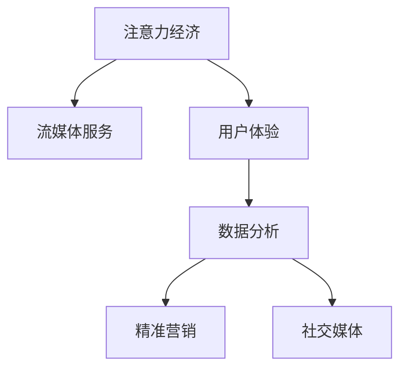

                 

# 娱乐产业在注意力经济中的转型

## 1. 背景介绍

### 1.1 问题由来

在互联网时代，传统的媒体产业面临着巨大挑战。随着数字媒体和流媒体服务的兴起，用户注意力成为重要的市场资源。电视、广播、报纸等传统媒体的受众流失，广告收入锐减，生存空间被互联网平台不断蚕食。如何在注意力经济中寻找新的商业模式和竞争优势，成为传统媒体转型升级的关键问题。

### 1.2 问题核心关键点

注意力经济是指在数字时代，注意力成为稀缺资源，商家通过争夺和引导用户注意力实现商业价值的过程。在注意力经济中，传统媒体面临的挑战包括：

- 受众减少：随着互联网普及，年轻用户偏好在线娱乐，传统媒体的电视、报纸等受众数量下降。
- 广告收入下降：传统广告模式依赖于受众规模，互联网平台的兴起导致传统媒体广告收入减少。
- 用户体验变差：传统媒体内容单一，无法满足用户多样化的需求，用户体验下滑。

### 1.3 问题研究意义

解决这些问题，推动传统媒体在注意力经济中的转型，具有重要意义：

- 拓展生存空间：通过数字化和内容创新，传统媒体可以重新吸引年轻受众，保持竞争力。
- 提升广告收入：利用大数据和智能算法，精准投放广告，提升广告效果和收益。
- 改善用户体验：结合用户反馈和数据分析，提供更加个性化的内容和互动体验，提升用户粘性。

## 2. 核心概念与联系

### 2.1 核心概念概述

为更好地理解娱乐产业在注意力经济中的转型，本节将介绍几个关键概念：

- 注意力经济：在数字时代，用户注意力成为稀缺资源，商家通过争夺和引导用户注意力实现商业价值的过程。
- 流媒体服务：提供视频、音频等多媒体内容的在线平台，如Netflix、Bilibili等。
- 用户体验：用户与媒体产品交互时的心理感受，包括内容质量、界面设计、操作便捷性等。
- 数据分析：通过数据收集和分析，了解用户行为和偏好，为产品优化提供依据。
- 精准营销：基于用户行为和兴趣标签，实现广告的精准投放，提升广告效果。
- 社交媒体：提供用户互动交流的平台，如微博、微信等，促进用户之间的连接和传播。

这些核心概念之间的逻辑关系可以通过以下Mermaid流程图来展示：



这个流程图展示了几类关键概念之间的联系：

1. 注意力经济是整体背景，流媒体服务、用户体验、数据分析和精准营销都是注意力经济中的重要组成部分。
2. 流媒体服务提供内容平台，是用户体验的基础。
3. 数据分析是用户行为理解的工具，精准营销是基于数据的用户画像和行为预测。
4. 社交媒体促进用户互动，增强内容传播和反馈。

## 3. 核心算法原理 & 具体操作步骤
### 3.1 算法原理概述

娱乐产业在注意力经济中的转型，主要依赖于用户注意力分析和个性化推荐算法的应用。算法原理可以概括为以下几个步骤：

1. **用户行为分析**：通过数据分析手段，收集用户的行为数据，如观看时长、点击次数、收藏偏好等。
2. **用户画像构建**：根据用户行为数据，构建用户兴趣和偏好的画像，形成用户标签。
3. **内容推荐优化**：基于用户画像和标签，优化推荐算法，提升推荐准确性和个性化程度。
4. **用户体验反馈**：通过用户反馈，不断优化内容和推荐算法，提升用户体验。

### 3.2 算法步骤详解

**Step 1: 数据收集与清洗**

- 收集用户行为数据，如观看时长、播放次数、收藏记录等。
- 清洗数据，去除重复、异常、不完整的数据。

**Step 2: 用户画像构建**

- 使用机器学习算法，如协同过滤、内容推荐算法等，构建用户画像，生成用户兴趣标签。
- 将用户画像转化为向量表示，便于后续的相似度计算和推荐。

**Step 3: 推荐算法设计**

- 设计推荐算法，如基于协同过滤的矩阵分解算法、基于内容的标签匹配算法等。
- 引入深度学习模型，如序列推荐模型、深度神经网络等，提升推荐效果。

**Step 4: 推荐结果生成**

- 根据用户画像和推荐算法，生成推荐结果。
- 使用A/B测试等方法评估推荐效果，优化推荐策略。

**Step 5: 用户体验反馈**

- 收集用户对推荐结果的反馈，如评分、评价等。
- 分析用户反馈，优化推荐算法和内容，提升用户体验。

### 3.3 算法优缺点

基于用户注意力和个性化推荐的算法具有以下优点：

- 提升用户体验：个性化推荐可以满足用户多样化需求，提升用户粘性和满意度。
- 增加广告收入：精准营销可以根据用户兴趣投放广告，提升广告效果和收益。
- 快速适应市场变化：基于数据的动态调整和优化，可以及时适应市场变化和用户需求。

但该算法也存在以下缺点：

- 数据隐私问题：用户数据的收集和处理可能引发隐私问题，需要严格的数据保护措施。
- 数据稀疏性问题：用户行为数据可能存在稀疏性，影响推荐效果。
- 推荐冷启动问题：新用户或冷门内容可能面临推荐效果差的问题。

### 3.4 算法应用领域

基于用户注意力和个性化推荐的算法已经在多个领域得到应用，例如：

- 流媒体平台：如Netflix、Bilibili等，通过推荐算法提升用户观看时长和付费率。
- 电商网站：如Amazon、淘宝等，通过推荐算法提升用户购买率和复购率。
- 新闻媒体：通过个性化推荐提升用户阅读量和粘性。
- 社交网络：如微博、微信等，通过内容推荐优化用户体验和用户互动。

## 4. 数学模型和公式 & 详细讲解 & 举例说明
### 4.1 数学模型构建

本节将使用数学语言对个性化推荐算法进行更加严格的刻画。

记用户画像向量为 $u_i$，推荐内容向量为 $v_j$，内容-用户评分矩阵为 $R$，其中 $R_{ij}$ 表示用户 $i$ 对内容 $j$ 的评分。设推荐算法输出的用户 $i$ 对内容 $j$ 的推荐分数为 $p_{ij}$，则推荐模型可表示为：

$$
p_{ij} = \phi(u_i, v_j)
$$

其中 $\phi$ 为推荐函数，常用的推荐函数包括：

- 协同过滤：基于用户历史评分，通过矩阵分解或用户-物品的共现矩阵计算推荐分数。
- 基于内容的推荐：基于内容的标签匹配和相似度计算，生成推荐分数。
- 深度推荐模型：使用深度神经网络，对用户行为和内容进行建模，生成推荐分数。

### 4.2 公式推导过程

以协同过滤为例，推荐函数 $\phi$ 可表示为：

$$
p_{ij} = \langle u_i, v_j \rangle \frac{\sigma(z)}{\sum_k \sigma(z_k)}
$$

其中 $\langle u_i, v_j \rangle$ 为向量内积，$z = \langle u_i, v_j \rangle + b$，$\sigma(z)$ 为激活函数，如sigmoid函数。推荐分数 $p_{ij}$ 的值介于0和1之间，表示用户 $i$ 对内容 $j$ 的兴趣程度。

在实际应用中，推荐算法还需要结合用户行为和内容标签，进行多维度优化。例如，可以使用深度学习模型，通过多层神经网络对用户行为和内容进行建模，生成推荐分数。设用户行为数据为 $X_i$，内容数据为 $V_j$，推荐模型为 $f(X_i, V_j)$，则推荐分数可以表示为：

$$
p_{ij} = \phi(f(X_i, V_j))
$$

### 4.3 案例分析与讲解

以Netflix的推荐系统为例，Netflix通过协同过滤和深度学习模型，构建了强大的个性化推荐系统。Netflix用户行为数据包括观看时长、评分、收藏、播放次数等，内容数据包括电影、电视剧、综艺等标签信息。Netflix使用基于矩阵分解的协同过滤算法，构建用户-内容评分矩阵，计算推荐分数，同时结合深度学习模型，对用户行为进行建模，提升推荐效果。Netflix的推荐系统不仅提高了用户观看时长和满意度，还显著增加了订阅用户数量和收入。

## 5. 项目实践：代码实例和详细解释说明
### 5.1 开发环境搭建

在进行个性化推荐系统开发前，我们需要准备好开发环境。以下是使用Python进行PyTorch开发的环境配置流程：

1. 安装Anaconda：从官网下载并安装Anaconda，用于创建独立的Python环境。

2. 创建并激活虚拟环境：
```bash
conda create -n pytorch-env python=3.8 
conda activate pytorch-env
```

3. 安装PyTorch：根据CUDA版本，从官网获取对应的安装命令。例如：
```bash
conda install pytorch torchvision torchaudio cudatoolkit=11.1 -c pytorch -c conda-forge
```

4. 安装TensorFlow：
```bash
pip install tensorflow
```

5. 安装TensorBoard：
```bash
pip install tensorboard
```

6. 安装Pandas、NumPy、Scikit-learn、Matplotlib、Seaborn等工具包：
```bash
pip install pandas numpy scikit-learn matplotlib seaborn
```

完成上述步骤后，即可在`pytorch-env`环境中开始推荐系统开发。

### 5.2 源代码详细实现

这里以协同过滤推荐系统为例，展示使用TensorFlow进行个性化推荐系统的实现。

首先，定义协同过滤推荐系统的输入输出：

```python
import tensorflow as tf
import pandas as pd
import numpy as np

def load_data(data_path):
    data = pd.read_csv(data_path)
    return data

def save_data(data, data_path):
    data.to_csv(data_path, index=False)

def create_tensor(data):
    return tf.convert_to_tensor(data.values, dtype=tf.float32)
```

然后，构建协同过滤推荐模型：

```python
def build_cf_model(user_data, item_data):
    user_data = tf.convert_to_tensor(user_data, dtype=tf.float32)
    item_data = tf.convert_to_tensor(item_data, dtype=tf.float32)
    
    user_item = tf.matmul(user_data, item_data, transpose_b=True)
    user_b = tf.reduce_sum(user_data, axis=1, keepdims=True)
    item_b = tf.reduce_sum(item_data, axis=0, keepdims=True)
    
    user_score = user_item + user_b - item_b
    user_score = tf.maximum(user_score, 0.01)  # 避免负数
    
    return user_score
```

最后，进行模型训练和评估：

```python
def train_cf_model(user_data, item_data, data_path):
    user_score = build_cf_model(user_data, item_data)
    
    # 将用户评分转化为二值化标签
    train_data = tf.where(tf.equal(user_score, 0), 0, 1)
    
    # 定义损失函数
    loss = tf.losses.sparse_softmax_cross_entropy(labels=train_data, logits=user_score)
    
    # 定义优化器
    optimizer = tf.optimizers.Adam(learning_rate=0.01)
    
    # 定义训练循环
    for i in range(1000):
        with tf.GradientTape() as tape:
            loss = loss(user_score)
        grads = tape.gradient(loss, [user_score])
        optimizer.apply_gradients(zip(grads, [user_score]))
        
        # 打印训练结果
        print(f"Epoch {i+1}, Loss: {loss.numpy()}")

def evaluate_cf_model(user_data, item_data, data_path):
    user_score = build_cf_model(user_data, item_data)
    
    # 将用户评分转化为二值化标签
    train_data = tf.where(tf.equal(user_score, 0), 0, 1)
    
    # 定义评估指标
    accuracy = tf.reduce_mean(tf.cast(tf.equal(user_score, train_data), tf.float32))
    
    # 打印评估结果
    print(f"Accuracy: {accuracy.numpy()}")
```

现在，在开发环境中运行代码：

```bash
# 准备数据集
data_path = "path/to/data.csv"
user_data = load_data(data_path)["user_id"]
item_data = load_data(data_path)["item_id"]

# 训练模型
train_cf_model(user_data, item_data, data_path)

# 评估模型
evaluate_cf_model(user_data, item_data, data_path)
```

以上就是使用TensorFlow进行协同过滤推荐系统的完整代码实现。可以看到，TensorFlow提供了强大的张量计算能力，使得推荐算法的实现变得简洁高效。

### 5.3 代码解读与分析

让我们再详细解读一下关键代码的实现细节：

**load_data和save_data函数**：
- 定义了加载和保存数据的方法，用于从CSV文件中读取和写入数据。

**create_tensor函数**：
- 将Pandas DataFrame转化为TensorFlow张量，方便进行张量运算。

**build_cf_model函数**：
- 构建协同过滤推荐模型，将用户评分矩阵转化为推荐分数。
- 使用矩阵分解公式，计算用户对内容的评分。

**train_cf_model函数**：
- 定义损失函数和优化器，进行模型训练。
- 在每次迭代中计算损失函数和梯度，使用优化器更新模型参数。

**evaluate_cf_model函数**：
- 定义评估指标，计算模型预测准确率。
- 使用TensorFlow的计算图功能，方便进行张量运算和模型评估。

可以看到，TensorFlow提供了强大的工具和库，使得推荐算法的实现变得容易，同时确保了高效和可扩展性。

## 6. 实际应用场景
### 6.1 智能视频推荐

智能视频推荐是流媒体平台的核心应用之一，通过个性化推荐系统，可以提升用户观看时长和满意度。

在技术实现上，流媒体平台可以收集用户观看记录、评分、收藏等信息，构建用户-内容评分矩阵，使用协同过滤算法生成推荐分数。同时，流媒体平台还可以结合深度学习模型，对用户行为进行建模，提升推荐效果。

### 6.2 电子商务推荐

电子商务网站也广泛应用个性化推荐算法，通过精准营销提升用户购买率和复购率。

在技术实现上，电子商务网站可以收集用户浏览记录、点击次数、购买信息等，构建用户-商品评分矩阵，使用协同过滤算法生成推荐分数。同时，电子商务网站还可以结合深度学习模型，对用户行为进行建模，提升推荐效果。

### 6.3 新闻媒体推荐

新闻媒体通过个性化推荐系统，可以提升用户阅读量和粘性。

在技术实现上，新闻媒体可以收集用户阅读记录、收藏信息、分享次数等，构建用户-新闻评分矩阵，使用协同过滤算法生成推荐分数。同时，新闻媒体还可以结合深度学习模型，对用户行为进行建模，提升推荐效果。

### 6.4 社交媒体推荐

社交媒体平台通过个性化推荐系统，可以提升用户互动和内容传播。

在技术实现上，社交媒体平台可以收集用户发布内容、评论、点赞等信息，构建用户-内容评分矩阵，使用协同过滤算法生成推荐分数。同时，社交媒体平台还可以结合深度学习模型，对用户行为进行建模，提升推荐效果。

## 7. 工具和资源推荐
### 7.1 学习资源推荐

为了帮助开发者系统掌握个性化推荐算法的理论基础和实践技巧，这里推荐一些优质的学习资源：

1. 《推荐系统实践》系列博文：由大模型技术专家撰写，深入浅出地介绍了推荐系统原理、协同过滤、深度学习等前沿话题。

2. CS4780《推荐系统》课程：斯坦福大学开设的推荐系统明星课程，涵盖算法设计、评价指标、系统架构等内容。

3. 《推荐系统实战》书籍：推荐系统实战经典，涵盖协同过滤、深度学习、推荐引擎等内容，是推荐系统开发的必备资料。

4. Kaggle推荐系统竞赛：参加Kaggle推荐系统竞赛，可以积累实战经验，了解推荐系统工程实践。

5. PyTorch官方文档：PyTorch深度学习框架的官方文档，提供了丰富的推荐系统样例代码，是推荐系统开发的重要参考。

通过对这些资源的学习实践，相信你一定能够快速掌握个性化推荐算法的精髓，并用于解决实际的推荐问题。

### 7.2 开发工具推荐

高效的开发离不开优秀的工具支持。以下是几款用于推荐系统开发的常用工具：

1. PyTorch：基于Python的开源深度学习框架，灵活动态的计算图，适合快速迭代研究。TensorFlow等深度学习框架也提供了丰富的推荐系统工具。

2. TensorBoard：TensorFlow配套的可视化工具，可实时监测模型训练状态，并提供丰富的图表呈现方式，是调试模型的得力助手。

3. Scikit-learn：Python科学计算库，提供简单易用的机器学习算法，适合推荐系统开发。

4. Pandas：Python数据处理库，提供高性能的数据处理和分析功能，适合数据预处理和模型训练。

5. NumPy：Python数值计算库，提供高效的数组运算功能，适合数据科学和机器学习。

合理利用这些工具，可以显著提升推荐系统的开发效率，加快创新迭代的步伐。

### 7.3 相关论文推荐

推荐系统的发展源于学界的持续研究。以下是几篇奠基性的相关论文，推荐阅读：

1. Matrix Factorization Techniques for Recommender Systems（SVD算法）：提出了矩阵分解算法，是协同过滤算法的经典方法。

2. Recommender Systems in Collaborative Filtering：综述了协同过滤算法的原理和实现，是推荐系统的重要参考。

3. Large-scale collaborative filtering for recommendation systems（BigMatrix算法）：提出了分布式协同过滤算法，解决了大规模数据集上的推荐问题。

4. A Neural Probabilistic Language Model（NPLM）：提出神经概率语言模型，为深度学习推荐算法提供了理论基础。

5. Factorization Machines with Deep Feature Interaction（FM+Deep模型）：提出深度特征交互模型，提升了推荐系统的效果。

这些论文代表了个性化推荐技术的发展脉络。通过学习这些前沿成果，可以帮助研究者把握学科前进方向，激发更多的创新灵感。

## 8. 总结：未来发展趋势与挑战
### 8.1 总结

本文对基于用户注意力和个性化推荐的算法进行了全面系统的介绍。首先阐述了注意力经济在娱乐产业中的重要性，明确了推荐系统在提升用户体验、增加广告收入等方面的独特价值。其次，从原理到实践，详细讲解了推荐算法的数学模型和实现步骤，给出了推荐系统开发的完整代码实例。同时，本文还探讨了推荐系统在流媒体、电商、新闻、社交媒体等多个领域的应用前景，展示了推荐系统的广泛应用潜力。

通过本文的系统梳理，可以看到，基于用户注意力和个性化推荐的算法在娱乐产业中具有重要意义。推荐系统通过数据分析和机器学习技术，能够实现对用户行为的精准理解和预测，提升用户体验和商业价值。未来，随着算法的不断优化和数据技术的进步，推荐系统将在更多领域发挥作用，为娱乐产业带来更大的创新和变革。

### 8.2 未来发展趋势

展望未来，推荐系统将在以下方面呈现新的发展趋势：

1. 多模态推荐：结合用户的多维度数据，如文本、图像、视频等，提升推荐效果和用户体验。
2. 深度学习应用：引入深度学习模型，提升推荐系统的复杂度和表现力。
3. 实时推荐：通过实时数据分析和动态调整，提升推荐系统的响应速度和精准度。
4. 用户行为预测：通过时间序列分析和机器学习，预测用户行为和兴趣变化，提升推荐效果。
5. 冷启动和动态推荐：针对新用户和冷门内容，设计更有效的推荐策略，提升推荐效果和用户体验。
6. 自适应推荐：根据用户反馈和行为变化，动态调整推荐策略，提升推荐效果和用户满意度。

以上趋势凸显了推荐系统技术的广阔前景。这些方向的探索发展，必将进一步提升推荐系统的性能和应用范围，为娱乐产业带来更多的创新和变革。

### 8.3 面临的挑战

尽管推荐系统技术已经取得了瞩目成就，但在迈向更加智能化、普适化应用的过程中，它仍面临着诸多挑战：

1. 数据隐私问题：用户数据的收集和处理可能引发隐私问题，需要严格的数据保护措施。
2. 数据稀疏性问题：用户行为数据可能存在稀疏性，影响推荐效果。
3. 推荐冷启动问题：新用户或冷门内容可能面临推荐效果差的问题。
4. 实时推荐问题：实时推荐需要高效的数据处理和计算能力，对系统资源提出了较高要求。
5. 用户行为预测问题：用户行为预测的准确性对推荐效果有重要影响，需要更复杂的模型和数据处理技术。

### 8.4 研究展望

面对推荐系统面临的挑战，未来的研究需要在以下几个方面寻求新的突破：

1. 数据隐私保护：研究如何在保护用户隐私的前提下，收集和利用用户行为数据。
2. 数据稀疏性处理：研究如何处理数据稀疏性问题，提升推荐系统效果。
3. 推荐冷启动方法：研究针对新用户和冷门内容的推荐方法，提升推荐效果。
4. 实时推荐算法：研究高效的数据处理和计算方法，提升实时推荐性能。
5. 用户行为预测模型：研究更复杂、更准确的预测模型，提升推荐系统效果。

这些研究方向的探索，必将引领推荐系统技术迈向更高的台阶，为娱乐产业带来更多的创新和变革。相信随着学界和产业界的共同努力，推荐系统必将在更多领域发挥作用，为娱乐产业带来更大的创新和变革。

## 9. 附录：常见问题与解答

**Q1：推荐系统是否适用于所有娱乐产业场景？**

A: 推荐系统在大多数娱乐产业场景中都能取得不错的效果，特别是对于数据量较大的场景。但对于一些特定场景，如小型企业、个性化程度很高的领域，推荐系统可能效果有限。

**Q2：推荐系统的学习曲线是否陡峭？**

A: 推荐系统的学习曲线相对陡峭，需要一定的数据科学和机器学习基础。但随着技术的不断成熟，现有的工具和库使得推荐系统的实现变得容易。

**Q3：推荐系统是否需要大规模数据集？**

A: 推荐系统需要一定量的用户行为数据，但可以通过数据增强和预处理等技术，逐步提升推荐效果。对于小规模数据集，可以使用迁移学习等方法，提升推荐效果。

**Q4：推荐系统在推荐冷启动时是否存在问题？**

A: 推荐系统在推荐冷启动时可能存在推荐效果差的问题，可以通过结合领域知识、人工标注等方法，提升推荐效果。同时，可以使用多模态数据和协同过滤算法，提升推荐效果。

**Q5：推荐系统是否需要持续优化？**

A: 推荐系统需要持续优化，不断根据用户反馈和行为变化，动态调整推荐策略，提升推荐效果和用户体验。

总之，推荐系统需要开发者根据具体场景，不断迭代和优化算法、数据和模型，方能得到理想的效果。只有从数据、算法、工程、业务等多个维度协同发力，才能真正实现推荐系统的商业价值。

