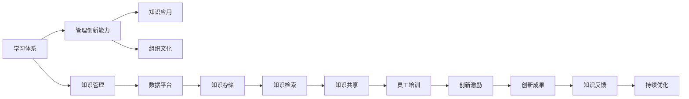

                 

# 学习体系与管理创新能力的培养

## 1. 背景介绍

### 1.1 问题由来
在现代企业中，创新能力被广泛认为是推动企业发展的关键因素之一。然而，创新的实现并不仅仅是技术问题，更是一个复杂的组织管理问题。如何构建一个既能激发员工创造力，又能有效管理创新过程的体系，成为了众多企业面临的挑战。

近年来，随着全球科技竞争的加剧，企业对创新的需求日益增长。传统的以结果为导向的管理模式，已无法满足快速变化的商业环境。如何建立一套有效的学习体系，以培养和提升管理创新能力，已成为众多企业亟需解决的问题。

### 1.2 问题核心关键点
本文将围绕以下核心问题进行探讨：

- 什么是学习体系？学习体系与管理创新能力之间有何联系？
- 如何构建有效的学习体系？
- 学习体系在企业创新管理中的应用场景是什么？
- 未来学习体系与管理创新能力的培养趋势和挑战是什么？

### 1.3 问题研究意义
通过深入探讨学习体系与管理创新能力的培养，本文旨在为企业管理者提供一套系统化、可操作化的解决方案，以提升企业的创新能力，增强市场竞争力。具体意义如下：

1. 优化企业创新管理：帮助企业构建以学习和创新为中心的管理体系，促进知识的传递与共享，提升创新效率。
2. 提升员工创造力：通过学习体系的建设，激发员工的创造力，鼓励他们提出新的创意和解决方案。
3. 加速创新落地：学习体系能够促进知识在企业内部快速传播和应用，加速创新成果的转化和落地。
4. 增强企业韧性：通过持续学习和创新，企业能够更好地应对市场变化和挑战，提升自身韧性。

## 2. 核心概念与联系

### 2.1 核心概念概述

为更好地理解学习体系与管理创新能力之间的关系，本文将介绍几个关键概念：

- **学习体系(Learning System)**：指企业为促进员工持续学习而建立的系统化、结构化的学习和培训体系。包括学习资源、学习平台、学习评估等要素，旨在提升员工的知识水平和技能。

- **管理创新能力(Management Innovation Capability)**：指企业通过管理手段激发创新，推进创新项目落地，最终实现创新的过程和能力。

- **知识管理(Knowledge Management)**：通过系统化管理企业的知识资源，促进知识的获取、共享和应用，提升企业的创新能力。

- **组织文化(Organizational Culture)**：指企业内部成员共同遵守的行为准则和价值观，对员工的创新行为具有重要影响。

这些概念之间通过学习体系与管理创新能力的构建和应用相联系，形成一个完整的企业创新管理框架。

### 2.2 核心概念原理和架构的 Mermaid 流程图(Mermaid 流程节点中不要有括号、逗号等特殊字符)



这个流程图展示了学习体系与管理创新能力之间的联系和相互作用。学习体系通过知识管理，为企业员工提供丰富的学习资源和培训机会；而管理创新能力则通过知识应用和组织文化建设，推动创新成果的转化和落地。

## 3. 核心算法原理 & 具体操作步骤

### 3.1 算法原理概述

构建学习体系与管理创新能力培养的算法原理主要包括以下几个方面：

1. **需求分析**：通过调查和访谈，明确企业对创新能力的需求和现状，识别出提升创新能力的关键因素。

2. **目标设定**：根据需求分析结果，设定明确的学习体系和管理创新能力提升目标，如提高员工的创新能力、缩短创新项目周期等。

3. **体系设计**：基于目标设定，设计学习体系和管理创新能力的各项要素，包括学习内容、学习平台、学习评估等。

4. **资源整合**：整合企业内外的学习资源，如培训课程、在线学习平台、行业报告等，构建系统化的学习体系。

5. **创新激励**：设计创新激励机制，鼓励员工提出和实现创新项目，如奖励机制、创新奖金、晋升机会等。

6. **效果评估**：通过定期评估学习体系和管理创新能力的效果，识别不足和改进点，持续优化学习体系。

### 3.2 算法步骤详解

#### 步骤1：需求分析

需求分析是构建学习体系的首要步骤。主要包括以下几个步骤：

1. **调查与访谈**：通过问卷调查、面对面访谈等方式，收集企业员工和管理层的意见和建议，了解他们对创新的看法和需求。

2. **数据分析**：对收集到的数据进行整理和分析，识别出影响创新能力的关键因素，如知识水平、技术能力、文化氛围等。

3. **需求优先级排序**：根据数据分析结果，对各个需求进行优先级排序，确定哪些需求最为紧迫，需要优先解决。

#### 步骤2：目标设定

目标设定是构建学习体系和管理创新能力提升的具体指导。主要包括以下几个步骤：

1. **制定具体目标**：根据需求分析结果，制定明确的学习体系和管理创新能力提升目标。如提高员工的技术能力、缩短创新项目周期等。

2. **确定评估指标**：为每个目标设定具体的评估指标，如员工创新项目数量、创新项目完成时间等。

3. **设定时间表**：根据目标和评估指标，制定详细的实施时间表，确保各项工作按时完成。

#### 步骤3：体系设计

体系设计是构建学习体系和管理创新能力的核心步骤。主要包括以下几个方面：

1. **学习内容设计**：根据目标设定，设计适合员工的学习内容，包括技术培训、软技能培训、创新方法培训等。

2. **学习平台搭建**：搭建一个适合企业员工使用的学习平台，如企业内网、线上课程平台等，提供丰富的学习资源。

3. **学习评估体系**：设计科学的学习评估体系，对员工的学习效果进行评估，如考试、作业、项目实践等。

#### 步骤4：资源整合

资源整合是确保学习体系和管理创新能力提升的具体措施。主要包括以下几个方面：

1. **外部资源引入**：引入外部优质的学习资源，如知名高校的课程、行业专家的讲座等。

2. **内部资源优化**：优化企业内部的学习资源，如内部培训课程、技术文档、专家经验等。

3. **资源共享机制**：建立资源共享机制，鼓励员工和专家分享学习成果和经验，促进知识的传递和共享。

#### 步骤5：创新激励

创新激励是激发员工创新热情的具体手段。主要包括以下几个方面：

1. **奖励机制设计**：设计合理的奖励机制，对提出创新项目和实现创新项目的员工进行奖励，如奖金、晋升机会等。

2. **创新氛围营造**：通过组织创新活动、创新比赛等方式，营造良好的创新氛围，激发员工的创新热情。

3. **成果展示平台**：建立创新成果展示平台，让员工分享他们的创新成果，激励更多员工参与创新。

#### 步骤6：效果评估

效果评估是持续改进学习体系和管理创新能力的具体措施。主要包括以下几个方面：

1. **评估工具设计**：设计科学的评估工具，对学习体系和管理创新能力的效果进行评估。

2. **数据收集与分析**：定期收集评估数据，进行分析，识别出学习体系和管理创新能力的不足之处。

3. **持续优化**：根据评估结果，持续优化学习体系和管理创新能力，确保其有效性。

### 3.3 算法优缺点

#### 优点

1. **系统化、结构化**：通过需求分析、目标设定、体系设计等步骤，构建了一个系统化、结构化的学习体系，确保各项工作有序进行。

2. **动态调整**：通过效果评估和持续优化，学习体系能够动态调整，适应企业不断变化的创新需求。

3. **员工激励**：通过创新激励机制，激发员工的创新热情，提升企业的创新能力。

#### 缺点

1. **资源投入大**：构建学习体系和管理创新能力提升需要较大的资源投入，包括时间、人力、资金等。

2. **实施难度高**：构建和实施学习体系和管理创新能力提升需要较高的专业水平，对企业的人力资源和管理能力提出了较高要求。

3. **效果评估复杂**：学习体系和管理创新能力的效果评估需要科学的方法和工具，评估过程较为复杂。

### 3.4 算法应用领域

学习体系与管理创新能力培养的算法原理和操作步骤广泛应用于以下几个领域：

1. **制造业**：通过学习体系和管理创新能力的提升，优化生产流程，提高产品质量和生产效率。

2. **零售业**：通过学习体系和管理创新能力的提升，优化供应链管理，提升客户体验和服务质量。

3. **金融业**：通过学习体系和管理创新能力的提升，开发新的金融产品和服务，提升客户满意度和市场竞争力。

4. **医疗健康**：通过学习体系和管理创新能力的提升，开发新的医疗技术和治疗方法，提升医疗服务的质量和效率。

5. **教育培训**：通过学习体系和管理创新能力的提升，提升教师的教学水平和学生的学习效果，推动教育质量的提升。

## 4. 数学模型和公式 & 详细讲解 & 举例说明

### 4.1 数学模型构建

本文将构建一个简化的数学模型，用于说明学习体系与管理创新能力的关系。假设企业有 $n$ 个员工，每个员工的学习效果为 $x_i$，管理创新能力为 $y_i$。则学习体系和管理创新能力的关系可以表示为：

$$
y_i = f(x_i)
$$

其中 $f$ 为非线性函数，表示学习效果对管理创新能力的影响。

### 4.2 公式推导过程

为了简化问题，我们假设 $f(x_i)$ 为线性函数，即：

$$
y_i = \alpha x_i + \beta
$$

其中 $\alpha$ 和 $\beta$ 为模型参数。根据学习体系和管理创新能力的关系，我们可以进一步构建学习体系与创新能力的数学模型。假设企业提供了 $k$ 种学习资源，每个员工选择的资源数量为 $c_i$，则员工的学习效果 $x_i$ 可以表示为：

$$
x_i = \sum_{j=1}^k w_jc_i
$$

其中 $w_j$ 为第 $j$ 种学习资源的权重。因此，学习体系与管理创新能力的关系可以表示为：

$$
y_i = \alpha \sum_{j=1}^k w_jc_i + \beta
$$

### 4.3 案例分析与讲解

假设某企业有 100 名员工，企业提供了 5 种学习资源，每个员工选择的资源数量为 3。通过学习效果和创新能力的关系模型，可以预测每个员工的管理创新能力。例如，如果选择资源 1、2 和 3 的员工数量为 40、30 和 30，则学习体系与创新能力的关系可以表示为：

$$
y_i = \alpha (0.4 \times 1 + 0.3 \times 2 + 0.3 \times 3) + \beta
$$

通过求解上述方程，可以得到每个员工的管理创新能力预测值，从而指导企业制定更有效的学习策略和创新激励机制。

## 5. 项目实践：代码实例和详细解释说明

### 5.1 开发环境搭建

为了实现学习体系与管理创新能力培养的算法原理和操作步骤，我们首先需要搭建开发环境。以下是Python和PyTorch开发环境的配置步骤：

1. 安装Anaconda：从官网下载并安装Anaconda，用于创建独立的Python环境。

2. 创建并激活虚拟环境：
```bash
conda create -n learning-env python=3.8 
conda activate learning-env
```

3. 安装PyTorch：根据CUDA版本，从官网获取对应的安装命令。例如：
```bash
conda install pytorch torchvision torchaudio cudatoolkit=11.1 -c pytorch -c conda-forge
```

4. 安装TensorFlow：
```bash
conda install tensorflow
```

5. 安装各类工具包：
```bash
pip install numpy pandas scikit-learn matplotlib tqdm jupyter notebook ipython
```

完成上述步骤后，即可在`learning-env`环境中开始实践。

### 5.2 源代码详细实现

我们以制造业为例，提供一个简单的学习体系与管理创新能力提升的Python代码实现。

```python
import numpy as np
from sklearn.linear_model import LinearRegression

# 假设企业有 100 名员工，提供了 5 种学习资源
n = 100
k = 5
c = np.random.randint(1, 4, size=n)  # 每个员工选择资源的数量为 1 到 3

# 假设资源 1、2、3、4、5 的权重分别为 0.2、0.3、0.4、0.1、0.1
w = [0.2, 0.3, 0.4, 0.1, 0.1]

# 假设学习效果与创新能力的关系为线性函数
alpha = 0.5
beta = 0

# 计算每个员工的学习效果
x = np.dot(c, w)

# 计算每个员工的管理创新能力
y = alpha * x + beta

# 输出每个员工的管理创新能力预测值
print(y)
```

### 5.3 代码解读与分析

这段代码实现了假设企业员工选择资源与创新能力之间的关系模型，计算了每个员工的管理创新能力预测值。通过简单的代码实现，我们可以直观地理解学习体系与管理创新能力之间的关系。

在实际应用中，企业需要根据自身实际情况，选择更复杂的学习效果与创新能力的关系模型，并进行适当的参数调整和优化。同时，还需要引入更多的数据和变量，如员工的学习时间、参与创新活动的次数等，以更准确地预测和管理创新能力。

## 6. 实际应用场景

### 6.1 制造业

在制造业中，学习体系与管理创新能力培养的应用场景主要包括：

1. **产品创新**：通过学习体系提升员工的技术水平和创新能力，开发新产品，提升产品竞争力。

2. **生产流程优化**：通过学习体系提升员工的知识水平和技能，优化生产流程，提高生产效率和产品质量。

3. **设备维护**：通过学习体系提升员工的设备维护技能，延长设备寿命，减少生产中断。

### 6.2 零售业

在零售业中，学习体系与管理创新能力培养的应用场景主要包括：

1. **供应链优化**：通过学习体系提升员工的知识水平和技能，优化供应链管理，提高供应链的灵活性和效率。

2. **顾客体验提升**：通过学习体系提升员工的客户服务技能，提升顾客满意度，提高顾客忠诚度。

3. **新业务开发**：通过学习体系提升员工的创新能力，开发新的业务模式，拓展市场。

### 6.3 金融业

在金融业中，学习体系与管理创新能力培养的应用场景主要包括：

1. **产品创新**：通过学习体系提升员工的技术水平和创新能力，开发新的金融产品，提升客户满意度和市场竞争力。

2. **风险管理**：通过学习体系提升员工的风险管理能力，提高风险控制水平，保障企业安全运营。

3. **客户服务优化**：通过学习体系提升员工的客户服务技能，提升客户满意度，提高客户忠诚度。

### 6.4 未来应用展望

未来，学习体系与管理创新能力培养将呈现以下几个发展趋势：

1. **个性化学习**：通过大数据和机器学习技术，实现个性化学习推荐，满足员工多样化的学习需求。

2. **实时反馈**：通过实时学习效果评估，及时调整学习策略，提高学习效果。

3. **跨部门协作**：建立跨部门的学习平台，促进知识共享和协作，提高企业的整体创新能力。

4. **线上线下融合**：将线上学习和线下培训相结合，实现更灵活、更高效的学习方式。

5. **虚拟现实**：通过虚拟现实技术，提供沉浸式学习体验，提升学习效果和体验感。

## 7. 工具和资源推荐

### 7.1 学习资源推荐

为了帮助开发者系统掌握学习体系与管理创新能力的培养方法，以下是一些推荐的学习资源：

1. **《学习型组织：建立持续学习的组织》**：这本书介绍了学习型组织的理论基础和实践方法，帮助企业建立系统化的学习体系。

2. **《创新管理》**：这本书介绍了创新管理的理论和方法，帮助企业管理者提升创新能力。

3. **Coursera《创新管理与领导力》课程**：斯坦福大学开设的创新管理课程，提供系统化的创新管理知识，帮助企业提升创新能力。

4. **《知识管理与组织创新》**：这本书介绍了知识管理与组织创新的理论和实践，帮助企业构建知识管理系统。

5. **HBR（哈佛商业评论）文章**：哈佛商业评论网站提供了大量关于学习体系和管理创新能力的优秀文章，值得深入阅读。

### 7.2 开发工具推荐

以下是一些用于学习体系与管理创新能力培养开发的常用工具：

1. **Jupyter Notebook**：开源的交互式计算环境，支持Python、R等语言，便于数据可视化和代码调试。

2. **TensorFlow**：由Google主导开发的深度学习框架，提供丰富的机器学习工具和算法，支持构建复杂的数学模型。

3. **PyTorch**：由Facebook主导开发的深度学习框架，提供灵活的动态计算图，便于快速迭代实验。

4. **Tableau**：数据可视化工具，支持大数据分析，帮助企业进行数据挖掘和决策支持。

5. **Trello**：项目管理工具，支持任务分配和进度跟踪，帮助企业组织和管理创新项目。

### 7.3 相关论文推荐

学习体系与管理创新能力培养的研究方向涉及多个领域，以下是一些推荐的相关论文：

1. **《学习型组织的理论框架》**：论文介绍了学习型组织的理论基础和实践方法，为建立学习体系提供了理论指导。

2. **《管理创新与组织绩效》**：论文研究了管理创新对企业绩效的影响，提供了管理创新能力的实证分析。

3. **《知识管理与组织创新能力》**：论文研究了知识管理对组织创新能力的影响，提供了知识管理的理论和方法。

4. **《学习体系与企业创新》**：论文研究了学习体系对企业创新的影响，提供了系统的分析框架和实践建议。

5. **《创新管理与领导力》**：论文介绍了创新管理与领导力的关系，提供了创新管理的理论和方法。

## 8. 总结：未来发展趋势与挑战

### 8.1 研究成果总结

本文详细探讨了学习体系与管理创新能力培养的方法，通过系统化的步骤和数学模型，帮助企业构建和优化学习体系，提升管理创新能力。通过数据分析和案例分析，我们明确了学习体系与管理创新能力之间的关系，为企业的创新管理提供了理论指导和实践方案。

### 8.2 未来发展趋势

未来学习体系与管理创新能力培养将呈现以下几个发展趋势：

1. **数据驱动**：利用大数据和机器学习技术，实现个性化学习推荐和实时反馈，提高学习效果。

2. **跨部门协作**：建立跨部门的学习平台，促进知识共享和协作，提高企业的整体创新能力。

3. **线上线下融合**：将线上学习和线下培训相结合，实现更灵活、更高效的学习方式。

4. **虚拟现实**：通过虚拟现实技术，提供沉浸式学习体验，提升学习效果和体验感。

### 8.3 面临的挑战

尽管学习体系与管理创新能力培养的研究取得了一些进展，但仍面临诸多挑战：

1. **资源投入高**：构建和实施学习体系需要较大的资源投入，包括时间、人力、资金等，可能对企业造成较大压力。

2. **实施难度大**：学习体系和管理创新能力培养需要较高的专业水平，对企业的人力资源和管理能力提出了较高要求。

3. **效果评估复杂**：学习体系和管理创新能力的效果评估需要科学的方法和工具，评估过程较为复杂。

4. **知识共享难度大**：建立跨部门的知识共享机制，促进知识的传递和共享，仍需克服一些困难和挑战。

### 8.4 研究展望

未来的研究需要在以下几个方面寻求新的突破：

1. **大数据与机器学习**：利用大数据和机器学习技术，实现个性化学习推荐和实时反馈，提高学习效果。

2. **跨部门协作**：建立跨部门的学习平台，促进知识共享和协作，提高企业的整体创新能力。

3. **线上线下融合**：将线上学习和线下培训相结合，实现更灵活、更高效的学习方式。

4. **虚拟现实**：通过虚拟现实技术，提供沉浸式学习体验，提升学习效果和体验感。

## 9. 附录：常见问题与解答

**Q1：如何构建学习体系？**

A: 构建学习体系需要系统化的设计和实施。主要包括以下几个步骤：

1. 需求分析：通过调查和访谈，明确企业对学习体系的需求和现状，识别出需要提升的关键因素。

2. 目标设定：根据需求分析结果，设定明确的学习体系提升目标，如提高员工的知识水平和技能。

3. 体系设计：设计学习体系的具体内容，包括学习资源、学习平台、学习评估等。

4. 资源整合：整合企业内外的学习资源，提供丰富的学习资源和培训机会。

5. 创新激励：设计创新激励机制，激发员工的创新热情，提升企业的创新能力。

6. 效果评估：通过定期评估学习体系的效果，识别不足和改进点，持续优化学习体系。

**Q2：学习体系与管理创新能力的关系如何？**

A: 学习体系与管理创新能力之间的关系主要体现在以下几个方面：

1. 学习体系提供员工所需的知识和技能，提升员工的创新能力。

2. 管理创新能力通过创新激励机制，激发员工的创新热情，推动创新项目的落地。

3. 学习体系与创新能力的提升，需要企业构建系统化的管理框架和组织文化，才能实现可持续的创新。

**Q3：学习体系在企业创新管理中的应用场景是什么？**

A: 学习体系在企业创新管理中的应用场景主要包括：

1. 产品创新：通过学习体系提升员工的技术水平和创新能力，开发新产品，提升产品竞争力。

2. 生产流程优化：通过学习体系提升员工的知识水平和技能，优化生产流程，提高生产效率和产品质量。

3. 设备维护：通过学习体系提升员工的设备维护技能，延长设备寿命，减少生产中断。

4. 供应链优化：通过学习体系提升员工的知识水平和技能，优化供应链管理，提高供应链的灵活性和效率。

5. 顾客体验提升：通过学习体系提升员工的客户服务技能，提升顾客满意度，提高顾客忠诚度。

**Q4：未来学习体系与管理创新能力的培养趋势和挑战是什么？**

A: 未来学习体系与管理创新能力的培养趋势主要包括以下几个方面：

1. 数据驱动：利用大数据和机器学习技术，实现个性化学习推荐和实时反馈，提高学习效果。

2. 跨部门协作：建立跨部门的学习平台，促进知识共享和协作，提高企业的整体创新能力。

3. 线上线下融合：将线上学习和线下培训相结合，实现更灵活、更高效的学习方式。

4. 虚拟现实：通过虚拟现实技术，提供沉浸式学习体验，提升学习效果和体验感。

面临的挑战主要包括以下几个方面：

1. 资源投入高：构建和实施学习体系需要较大的资源投入，包括时间、人力、资金等，可能对企业造成较大压力。

2. 实施难度大：学习体系和管理创新能力培养需要较高的专业水平，对企业的人力资源和管理能力提出了较高要求。

3. 效果评估复杂：学习体系和管理创新能力的效果评估需要科学的方法和工具，评估过程较为复杂。

4. 知识共享难度大：建立跨部门的知识共享机制，促进知识的传递和共享，仍需克服一些困难和挑战。

---

作者：禅与计算机程序设计艺术 / Zen and the Art of Computer Programming

