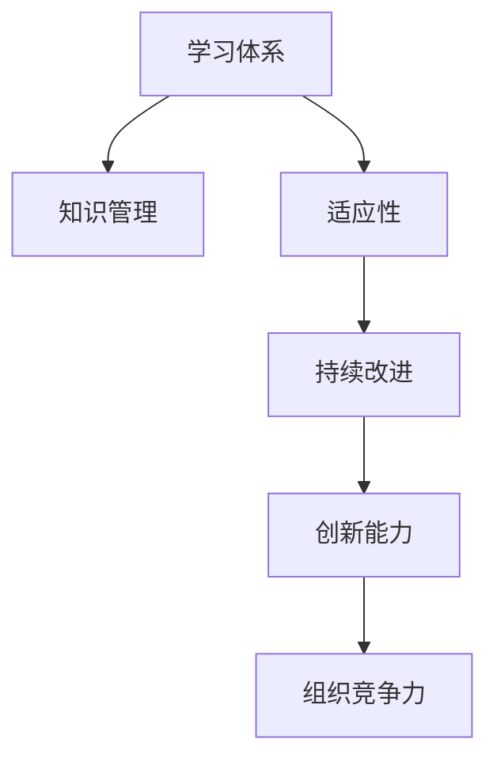

                 

## 1. 背景介绍

在当今快速变化的商业环境中，组织的适应性成为了其能否生存和发展的关键。学习体系作为一种推动组织发展的关键要素，正在日益受到企业和研究者的关注。通过对学习体系的研究，可以深刻理解其对组织适应性的提升作用，并指导企业在构建和优化学习体系时做出有针对性的决策。

### 1.1 学习体系的定义与重要性
学习体系通常指企业内部和外部的知识获取、传递、应用和创新的整体机制。它不仅仅是一个简单的教育或培训项目，更是一个全面的、持续改进的系统。学习体系通过持续的教育和学习活动，提升员工的知识水平和技能，进而提升组织的能力和竞争力。

### 1.2 适应性对组织的意义
适应性指的是组织能够快速响应外部环境变化的能力。在复杂的商业环境中，适应性强的组织更能抓住市场机会，避免风险，实现持续发展。适应性不仅体现在企业对新技术、新市场趋势的快速响应上，还体现在员工对变化的快速适应和创新能力上。

## 2. 核心概念与联系

### 2.1 核心概念概述

为了更好地理解学习体系对组织适应性的提升作用，需要首先了解与之相关的几个核心概念：

- **学习体系**：涵盖企业内外部的知识获取、传递、应用和创新机制，包括培训、教育、实践、反馈等环节。
- **适应性**：指组织能够快速响应环境变化的能力，包括市场、技术、文化等方面的变化。
- **知识管理**：通过制度和技术手段，有效管理和利用组织内的知识资源。
- **持续改进**：指组织不断优化和提升自身的流程、产品和服务，以适应外部环境的变化。
- **创新能力**：指组织在技术、产品、流程等方面的创新能力，推动组织向更高价值创造转型。

### 2.2 核心概念原理和架构的 Mermaid 流程图



这个流程图展示了学习体系与其他核心概念之间的关系：

- 学习体系通过知识管理获取和传递知识，提升员工的适应性和创新能力。
- 适应性强的员工和组织能够更快地响应市场和技术变化，进行持续改进。
- 持续改进增强了组织的创新能力，推动其向更高价值创造转型。
- 创新能力是组织竞争力的重要来源，决定其能否在激烈的市场竞争中脱颖而出。

## 3. 核心算法原理 & 具体操作步骤

### 3.1 算法原理概述

学习体系对组织适应性的提升作用主要体现在以下几个方面：

- **知识传递效率**：通过高效的培训和教育系统，将最新的知识和技能传递给员工，提升其适应性。
- **知识应用能力**：通过实践和反馈机制，将理论知识转化为实际操作能力，增强员工解决实际问题的能力。
- **创新激励机制**：通过奖励和认可机制，鼓励员工进行创新，推动组织的持续改进。

### 3.2 算法步骤详解

以下是构建一个高效学习体系的详细步骤：

**Step 1: 需求分析**
- 确定组织当前和未来的业务目标，明确需要学习的内容和技能。
- 分析员工当前的知识水平和技能差距，制定培训和学习计划。

**Step 2: 设计与实施培训课程**
- 设计包含理论知识、实践技能和软技能的培训课程，确保全面覆盖需求。
- 选择合适的培训方法，如线上课程、面对面培训、工作坊等。
- 建立灵活的培训时间表，确保员工能够参与。

**Step 3: 知识管理与传递**
- 建立知识库和文档管理系统，收集和整理组织的知识资源。
- 提供在线学习平台，方便员工随时随地获取和应用知识。
- 建立内部知识共享机制，鼓励员工之间相互学习和交流。

**Step 4: 实践与反馈**
- 通过实际项目和任务，让员工将所学知识应用到工作中。
- 定期收集员工反馈，评估培训效果，进行必要的调整和优化。
- 建立持续改进机制，不断提升培训课程的质量和效果。

**Step 5: 激励与认可**
- 设计激励机制，鼓励员工进行持续学习和创新。
- 定期进行绩效评估，对表现优秀的员工进行奖励和认可。
- 建立创新文化，营造鼓励创新的工作环境。

### 3.3 算法优缺点

学习体系在提升组织适应性方面具有以下优点：

- **全面提升能力**：通过系统化的培训和学习，全面提升员工的知识水平和技能。
- **快速响应变化**：通过灵活的培训时间和机制，快速响应市场和技术变化。
- **持续改进与创新**：通过激励机制和反馈机制，推动持续改进和创新。

同时，学习体系也存在一些局限：

- **成本高**：系统化的培训和知识管理需要投入大量时间和资源。
- **难以量化**：学习效果难以直接量化，评估复杂。
- **文化适应性**：不同文化背景的员工对学习体系的接受度可能存在差异。

### 3.4 算法应用领域

学习体系的应用领域非常广泛，几乎涵盖了所有类型的组织。以下是几个典型的应用场景：

- **高科技企业**：如Google、Facebook等，通过持续学习和创新，保持技术领先。
- **金融行业**：如摩根大通、JP摩根等，通过培训和教育，提升金融服务质量。
- **制造业**：如汽车制造商、电子产品制造商等，通过技能培训，提升生产效率。
- **服务业**：如酒店、零售、医疗服务等，通过服务培训，提升服务质量。
- **教育行业**：如大学、培训机构等，通过系统化的教育体系，培养高素质人才。

## 4. 数学模型和公式 & 详细讲解

### 4.1 数学模型构建

为了更好地理解和量化学习体系对组织适应性的提升作用，可以构建一个简单的数学模型。

设 $L$ 为学习体系对组织适应性的提升程度，$K$ 为组织内部知识的获取和传递效率，$A$ 为组织的适应性，$I$ 为创新能力，$C$ 为持续改进机制的有效性。则数学模型可以表示为：

$$
L = K \times A \times I \times C
$$

其中 $K$、$A$、$I$ 和 $C$ 均为正数，且每个变量的取值范围在 0 到 1 之间。

### 4.2 公式推导过程

根据上述模型，可以推导出各个变量之间的关系：

- 当 $K$ 增大时，学习体系的知识传递效率提高，从而提升 $L$。
- 当 $A$ 增大时，组织的适应性增强，从而提升 $L$。
- 当 $I$ 增大时，创新能力增强，从而提升 $L$。
- 当 $C$ 增大时，持续改进机制的有效性增强，从而提升 $L$。

### 4.3 案例分析与讲解

以一家制造企业为例，分析学习体系如何提升其适应性：

- **需求分析**：企业发现其生产效率低下，需提升员工的技能水平。
- **设计与实施培训课程**：企业设计和实施了针对生产线的技能培训课程，提升员工的操作技能和知识。
- **知识管理与传递**：企业建立了知识库和文档管理系统，方便员工随时获取技术资料。
- **实践与反馈**：企业通过生产实际项目，让员工应用所学知识，定期收集反馈进行改进。
- **激励与认可**：企业设立了技能提升奖，对表现优异的员工进行奖励，营造了持续改进和创新的文化。

通过这些措施，企业员工的技能水平显著提升，适应性增强，生产效率大幅提升，最终实现了持续的创新和发展。

## 5. 项目实践：代码实例和详细解释说明

### 5.1 开发环境搭建

为了更好地进行学习体系的设计和实施，需要搭建一个开发环境，包括但不限于以下工具和平台：

- **学习管理系统(LMS)**：如Moodle、Canvas等，用于管理培训课程和学习资料。
- **在线协作平台**：如Slack、Microsoft Teams等，用于知识共享和团队协作。
- **数据分析工具**：如Tableau、Power BI等，用于评估学习效果和持续改进。
- **编程开发环境**：如Jupyter Notebook、PyCharm等，用于开发培训课程和学习系统。

### 5.2 源代码详细实现

以下是一个简单的学习管理系统示例代码，用于跟踪员工的学习进度和评估学习效果：

```python
from flask import Flask, render_template, request, redirect

app = Flask(__name__)

# 定义学习记录表
learning_records = []

@app.route('/')
def index():
    return render_template('index.html', records=learning_records)

@app.route('/add_record', methods=['POST'])
def add_record():
    record = request.form.get('record')
    learning_records.append(record)
    return redirect('/')

@app.route('/delete_record', methods=['POST'])
def delete_record():
    record_id = request.form.get('record_id')
    for record in learning_records:
        if record['id'] == record_id:
            learning_records.remove(record)
    return redirect('/')

if __name__ == '__main__':
    app.run(debug=True)
```

### 5.3 代码解读与分析

上述代码实现了一个简单的学习管理系统，主要功能包括：

- 显示所有学习记录。
- 添加新的学习记录。
- 删除指定的学习记录。

通过这个简单的示例，可以理解如何利用编程工具构建学习体系的管理系统，方便对学习进度和效果的跟踪和评估。

### 5.4 运行结果展示

在实际运行时，可以通过浏览器访问 http://localhost:5000/ 查看学习记录，进行添加和删除操作。

```html
<!DOCTYPE html>
<html lang="en">
<head>
    <meta charset="UTF-8">
    <title>Learning Management System</title>
</head>
<body>
    <h1>Learning Records</h1>
    <ul>
        
        <li>
            {{ record['name'] }} - {{ record['progress'] }}
            <button onclick="deleteRecord({{ record['id']}})">Delete</button>
        </li>
        
    </ul>
    <form onsubmit="addRecord()">
        <label for="name">Name:</label>
        <input type="text" id="name" name="name">
        <label for="progress">Progress:</label>
        <input type="number" id="progress" name="progress">
        <button type="submit">Add Record</button>
    </form>
    <script>
        function addRecord() {
            var name = document.getElementById('name').value;
            var progress = document.getElementById('progress').value;
            var record = {name: name, progress: progress};
            fetch('/add_record', {method: 'POST', body: JSON.stringify(record)})
                .then(response => response.json())
                .then(data => console.log(data));
        }
        function deleteRecord(id) {
            fetch('/delete_record', {method: 'POST', body: JSON.stringify({id: id})})
                .then(response => response.json())
                .then(data => console.log(data));
        }
    </script>
</body>
</html>
```

## 6. 实际应用场景

### 6.1 智能制造

在智能制造领域，学习体系对提升组织的适应性尤为重要。智能制造企业需要不断引入新技术、新工艺，提升生产效率和产品质量。通过系统化的培训和学习，员工能够迅速掌握新技术，提升工作效率和质量。

例如，某智能制造企业通过引入工业4.0技术，进行了大规模的培训和学习，使员工在短时间内掌握了新技术的应用，大幅提升了生产效率和产品质量，实现了企业的快速转型。

### 6.2 金融科技

在金融科技领域，学习体系对提升组织的适应性同样重要。金融科技企业需要不断更新金融知识和技术，提升金融服务质量。通过系统化的培训和学习，员工能够迅速掌握最新的金融知识和技能，提升服务质量。

例如，某金融科技企业通过构建知识共享和在线学习平台，使得员工能够随时随地获取和应用最新的金融知识和技术，提升了企业的金融服务质量和市场竞争力。

### 6.3 医疗健康

在医疗健康领域，学习体系对提升组织的适应性至关重要。医疗健康企业需要不断引入新技术、新方法，提升医疗服务质量和效率。通过系统化的培训和学习，医护人员能够迅速掌握新技术，提升服务质量和效率。

例如，某医疗健康企业通过构建在线学习平台和实践平台，使得医护人员能够随时随地获取和应用最新的医疗知识和技能，提升了医疗服务质量和患者满意度。

## 7. 工具和资源推荐

### 7.1 学习资源推荐

为了帮助企业系统地构建和优化学习体系，以下是一些优质的学习资源：

1. **《学习型组织》（《Learning Organizations》）**：由彼得·圣吉（Peter Senge）所著，深入探讨了学习型组织的构建和运行机制，是学习体系设计的经典之作。
2. **《企业大学》（《Corporate University》）**：由迈克尔·奥斯汀（Michael Austin）所著，介绍了企业大学的设计和运营，提供了实用的案例和建议。
3. **《培训与发展》（《Training and Development》）**：由本杰明·布鲁克（Benjamin Bloom）所著，详细介绍了培训和发展的各个环节和最佳实践。
4. **Coursera在线课程**：提供了众多系统化的学习课程，涵盖从基础到高级的培训内容，方便企业员工随时随地学习。
5. **LinkedIn Learning**：提供了丰富的在线课程和培训资源，帮助员工提升技能和知识。

通过这些学习资源，企业可以全面了解学习体系的构建和优化方法，提升组织的适应性和竞争力。

### 7.2 开发工具推荐

为了更好地设计和实施学习体系，以下是一些常用的开发工具：

1. **Moodle**：一个广泛使用的学习管理系统，支持在线课程和培训管理，提供了丰富的功能和扩展性。
2. **Canvas**：另一个流行的学习管理系统，提供了强大的学习内容管理和在线协作功能。
3. **Slack**：一个强大的在线协作平台，支持团队沟通和知识共享，方便员工之间的交流和协作。
4. **Microsoft Teams**：另一个常用的在线协作平台，支持视频会议、文件共享等功能，方便团队协作和知识传递。
5. **Tableau**：一个强大的数据分析工具，可以用于评估学习效果和持续改进。
6. **Power BI**：另一个常用的数据分析工具，支持数据可视化和实时分析，方便管理层和员工进行决策。

这些工具可以帮助企业更高效地构建和优化学习体系，提升组织的适应性和竞争力。

### 7.3 相关论文推荐

为了深入了解学习体系的理论和实践，以下是一些推荐的相关论文：

1. **《学习型组织：构建可持续竞争优势的关键》（《Learning Organizations: The Source of Sustainable Competitive Advantage》）**：由迈克尔·奥斯汀（Michael Austin）所著，探讨了学习型组织的构建和运行机制。
2. **《从培训到学习：提升组织适应性的关键》（《From Training to Learning: The Critical Role of Employee Development in Organizational Resilience》）**：由理查德·诺兰（Richard Nolan）所著，探讨了员工发展对组织适应性的影响。
3. **《知识管理：组织能力的构建与提升》（《Knowledge Management: Building and Enhancing Organizational Capabilities》）**：由伊丽莎白·明格（Elizabeth Minge）所著，探讨了知识管理对组织能力提升的作用。
4. **《持续改进：组织适应性的关键》（《Continuous Improvement: The Key to Organizational Resilience》）**：由大卫·阿德尔（David Ader）所著，探讨了持续改进对组织适应性的提升作用。
5. **《创新能力：组织适应性的源泉》（《Innovation Capability: The Source of Organizational Resilience》）**：由约翰·霍恩（John Horn）所著，探讨了创新能力对组织适应性的影响。

这些论文提供了丰富的理论支持和实践经验，帮助企业更好地构建和优化学习体系。

## 8. 总结：未来发展趋势与挑战

### 8.1 研究成果总结

通过对学习体系的研究，可以总结出以下几个关键点：

- 学习体系是提升组织适应性的关键因素之一，通过全面、系统化的培训和学习，能够显著提升员工的适应性。
- 学习体系的设计和实施需要考虑多个关键因素，包括需求分析、培训课程设计、知识管理、实践与反馈、激励与认可等。
- 学习体系在多个行业领域都得到了广泛应用，展示了其强大的适应性和生命力。

### 8.2 未来发展趋势

未来学习体系的发展趋势主要体现在以下几个方面：

1. **技术化与智能化**：随着技术的进步，学习体系将越来越多地利用AI和数据科学，提升学习效果和效率。
2. **个性化与定制化**：根据员工的需求和学习进度，提供个性化的学习计划和资源，提升学习体验和效果。
3. **跨界融合**：与其他业务系统（如人力资源、绩效管理等）进行深度融合，形成更全面的学习生态。
4. **实时反馈与评估**：实时收集学习效果数据，提供及时的反馈和改进建议，帮助员工不断提升。
5. **全球化与本地化**：在全球范围内共享优质学习资源，同时结合本地文化和工作环境，提供符合实际需求的培训内容。

### 8.3 面临的挑战

尽管学习体系对提升组织适应性具有重要作用，但在实际应用中仍面临以下挑战：

1. **资源投入高**：系统化的培训和学习需要大量的资源投入，包括人力、时间、资金等。
2. **效果难以量化**：学习效果难以直接量化，评估复杂，难以精确衡量培训效果。
3. **文化适应性**：不同文化背景的员工对学习体系的接受度可能存在差异，需要灵活应对。
4. **激励与认可机制**：激励与认可机制的设计需要考虑多方面的因素，如公平性、多样性等，确保其有效性。

### 8.4 研究展望

未来的研究需要在以下几个方面进行深入探索：

1. **学习效果的量化与评估**：探索更加科学、客观的学习效果评估方法，提供量化的反馈和改进建议。
2. **个性化学习路径**：利用AI和大数据分析，提供个性化的学习计划和资源，提升学习效果和体验。
3. **跨界融合与协同创新**：与其他业务系统进行深度融合，形成协同创新机制，提升整体业务能力。
4. **全球化与本地化结合**：在全球范围内共享优质学习资源，同时结合本地文化和工作环境，提供符合实际需求的培训内容。
5. **学习体系的可持续发展**：探索持续改进和优化的方法，确保学习体系的长期有效性和适应性。

总之，学习体系作为提升组织适应性的重要手段，需要在多个维度进行深入探索和优化。只有在系统化的培训和学习体系下，组织才能更好地适应市场和技术变化，实现持续发展。

---

作者：禅与计算机程序设计艺术 / Zen and the Art of Computer Programming

