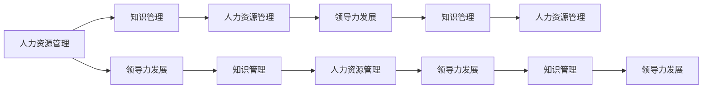

                 

# 学习体系对组织适应性的提升作用

> 关键词：组织适应性, 学习体系, 人力资源管理, 知识管理, 领导力发展

## 1. 背景介绍

在全球化、信息化快速发展的背景下，企业面临的竞争环境和挑战日趋复杂多样。如何提升组织的适应性，使其能够快速响应市场变化，捕捉新机遇，成为每个企业都必须关注的问题。学习体系作为一种组织变革的关键工具，已经成为提升企业适应性的重要手段。本文将从多个角度深入探讨学习体系如何通过增强人力资源管理、知识管理和领导力发展，从而全面提升组织的适应性。

## 2. 核心概念与联系

### 2.1 核心概念概述

学习体系（Learning System）是企业为了适应外部环境变化，推动组织内部知识流动与创新，而构建的一套系统化的、面向全体员工的学习机制。其核心内容包括但不限于：

- **人力资源管理**：通过培训、教育等方式，提高员工的技能水平和工作效率。
- **知识管理**：促进企业内部知识的收集、共享、应用与创新，增强企业的核心竞争力。
- **领导力发展**：通过系统化的培训和发展计划，提升领导层的战略视野和管理能力，带动组织的整体进步。

这三个核心概念相辅相成，共同构成了学习体系的整体框架。如下图所示，这些概念通过相互促进和支持，共同驱动组织的适应性和创新能力。



### 2.2 核心概念原理和架构的 Mermaid 流程图

在具体实施学习体系的过程中，需要将其分解为多个子系统，如下所示：

```mermaid
graph LR
    A[人力资源管理] --> B[培训子系统]
    A --> C[招聘子系统]
    A --> D[绩效评估子系统]
    B --> E[知识管理子系统]
    C --> F[入职培训]
    D --> G[学习路径定制]
    E --> H[内部知识库]
    F --> I[继续教育]
    G --> J[技能认证]
    H --> K[员工知识记录]
    I --> L[能力模型匹配]
    J --> M[职业技能提升]
    K --> N[知识搜索与共享]
    L --> O[领导力培养计划]
    M --> P[专业技能培训]
    N --> Q[知识应用与创新]
    O --> R[高层领导发展计划]
    P --> S[团队协作与沟通]
    Q --> T[知识管理评估]
    R --> U[战略视野培养]
    S --> V[团队学习与发展]
    T --> W[学习效果反馈]
    U --> X[企业战略与创新]
    V --> Y[跨部门合作与交流]
    W --> Z[学习活动调整]
    X --> [组织适应性与竞争力]
    Y --> AA[多维知识网络]
    Z --> AB[学习资源优化]
    AA --> AC[业务流程改进]
    AB --> AD[组织文化建设]
```

## 3. 核心算法原理 & 具体操作步骤

### 3.1 算法原理概述

学习体系的核心原理主要体现在以下几个方面：

1. **输入-输出模型**：通过系统的输入（员工需求、企业战略、外部环境变化等），经过一系列的算法和流程处理，输出员工的学习需求、知识结构调整、领导力提升等结果。
2. **反馈控制机制**：通过持续的反馈和评估，调整学习体系的各个环节，确保其适应性和有效性。
3. **系统化培训与发展**：将学习体系构建为系统化、标准化的流程，确保每位员工都有明确的成长路径和目标。

### 3.2 算法步骤详解

以下是学习体系构建和实施的主要步骤：

1. **需求分析**：通过调查问卷、面谈等方式，了解企业内部员工的学习需求、技能缺口和发展目标。
2. **系统设计**：根据需求分析的结果，设计学习体系的整体框架和子系统。
3. **内容开发**：开发适合企业内外部的学习内容，包括课程、案例、工具等。
4. **平台建设**：搭建学习管理系统（LMS），实现内容的在线化、移动化。
5. **实施与推广**：通过宣传、培训等方式，将学习体系推广至全体员工。
6. **持续优化**：定期收集反馈，调整和优化学习体系，确保其适应性和有效性。

### 3.3 算法优缺点

学习体系的优势在于：

- **提高员工技能**：通过有针对性的培训，提升员工的专业技能和工作效率。
- **促进知识共享**：通过知识管理平台，促进内部知识的流动和应用。
- **增强领导力**：通过系统的领导力培训，培养高层领导的管理能力和战略视野。

然而，学习体系也存在以下缺点：

- **实施难度大**：构建和实施学习体系需要大量的人力、物力投入，且实施过程复杂。
- **资源需求高**：需要大量的学习资源和资金投入，特别是初期建设阶段。
- **效果周期长**：学习体系的效果往往需要较长时间才能显现，短期内难以见效。

### 3.4 算法应用领域

学习体系在多个领域都具有广泛的应用：

- **制造业**：通过技能培训和知识管理，提升生产效率和产品质量。
- **金融业**：通过金融知识和技能培训，提升员工的专业水平和服务质量。
- **医疗健康**：通过医学知识和技能培训，提升医疗服务质量和患者满意度。
- **IT与科技**：通过技术培训和创新能力培养，推动企业技术进步和产品创新。

## 4. 数学模型和公式 & 详细讲解 & 举例说明

### 4.1 数学模型构建

我们可以使用数学模型来描述学习体系的运作过程。假设企业的学习需求为 $D$，知识库为 $K$，员工技能为 $S$，则学习体系的数学模型可以表示为：

$$
S = f(D, K, P)
$$

其中 $f$ 表示学习体系的功能函数，$P$ 为培训和知识管理策略。

### 4.2 公式推导过程

为了具体化上述模型，我们假设学习体系的功能函数 $f$ 包含三个子函数：

1. $f_1(D, K, P)$：表示培训子系统，将学习需求 $D$ 和知识库 $K$ 通过培训策略 $P$ 映射为员工技能 $S_1$。
2. $f_2(D, K, P)$：表示知识管理子系统，将学习需求 $D$ 和知识库 $K$ 通过知识管理策略 $P$ 映射为员工技能 $S_2$。
3. $f_3(D, K, P)$：表示领导力发展子系统，将学习需求 $D$ 和知识库 $K$ 通过领导力培养策略 $P$ 映射为员工技能 $S_3$。

则总的功能函数 $f$ 可以表示为：

$$
f(D, K, P) = f_1(D, K, P) + f_2(D, K, P) + f_3(D, K, P)
$$

### 4.3 案例分析与讲解

假设某制造企业需要提升其生产线的自动化水平，其学习需求 $D$ 为“自动化技术应用”，知识库 $K$ 包括“自动化技术培训课程”、“机器人操作手册”等。通过培训子系统 $f_1$ 和知识管理子系统 $f_2$，员工获得了必要的自动化技能 $S_1$ 和知识 $S_2$。通过领导力发展子系统 $f_3$，高层领导对自动化战略有了更深入的理解和支持。最终，整个企业生产线的自动化水平得到了显著提升。

## 5. 项目实践：代码实例和详细解释说明

### 5.1 开发环境搭建

本节将以一个简化版的学习管理系统（LMS）为例，展示如何使用Python和Django框架搭建学习平台。

1. 安装Python和Django：
```bash
pip install django
```

2. 创建Django项目：
```bash
django-admin startproject learning_system
cd learning_system
```

3. 创建Django应用：
```bash
python manage.py startapp courses
```

4. 配置数据库：
```python
# settings.py
DATABASES = {
    'default': {
        'ENGINE': 'django.db.backends.sqlite3',
        'NAME': BASE_DIR / 'db.sqlite3',
    }
}
```

### 5.2 源代码详细实现

首先，定义课程模型：

```python
# models.py
from django.db import models

class Course(models.Model):
    name = models.CharField(max_length=100)
    description = models.TextField()
    duration = models.IntegerField()
    instructor = models.ForeignKey('Instructor', on_delete=models.CASCADE)
```

然后，定义学生模型：

```python
# models.py
class Student(models.Model):
    name = models.CharField(max_length=100)
    email = models.EmailField(unique=True)
    courses_enrolled = models.ManyToManyField(Course)
```

接着，定义讲师模型：

```python
# models.py
class Instructor(models.Model):
    name = models.CharField(max_length=100)
    courses = models.ManyToManyField(Course)
```

最后，定义视图和路由：

```python
# views.py
from django.shortcuts import render, redirect

def course_list(request):
    courses = Course.objects.all()
    return render(request, 'courses/course_list.html', {'courses': courses})

def enroll_course(request, course_id):
    course = Course.objects.get(pk=course_id)
    student = Student.objects.get(email=request.user.email)
    student.courses_enrolled.add(course)
    return redirect('course_list')
```

### 5.3 代码解读与分析

上述代码展示了如何通过Django框架搭建一个简单的课程管理系统，包括课程列表、课程报名等功能。

- **模型定义**：使用Django的模型系统，定义了Course、Student和Instructor三种模型，分别表示课程、学生和讲师。
- **视图与路由**：定义了两个视图函数，分别用于展示课程列表和报名课程。

### 5.4 运行结果展示

运行上述代码，可以在浏览器中访问`localhost:8000`，看到课程列表和课程报名页面。

```html
# courses/course_list.html



  <h1>Available Courses</h1>
  <ul>
  
    <li><a href="">{{ course.name }} - {{ course.description }}</a></li>
  
  </ul>

```

## 6. 实际应用场景

### 6.1 智能制造

在智能制造领域，学习体系可以通过技能培训和知识管理，提升员工的技能水平和生产效率。例如，某制造业企业通过学习体系，对生产线工人进行机器人操作、智能设备维护等方面的培训，同时建立了内部知识库，供员工查询和学习。

### 6.2 金融科技

在金融科技领域，学习体系可以提升金融工作人员的专业技能和服务质量。例如，某银行通过学习体系，对客户经理进行金融产品知识、客户服务技巧等方面的培训，并建立了金融市场动态、投资策略等知识库，提升员工的业务能力。

### 6.3 医疗健康

在医疗健康领域，学习体系可以提升医护人员的技能水平和医疗服务质量。例如，某医院通过学习体系，对医护人员进行先进医疗设备操作、急救技能等方面的培训，并建立了医学知识库，供员工查询和学习。

### 6.4 未来应用展望

未来，学习体系在以下领域将有更广阔的应用前景：

- **教育培训**：通过智能化的学习平台，提供个性化学习路径，提升学生的学习效果。
- **人力资源管理**：通过自动化的招聘和培训系统，优化人力资源管理流程，提升招聘效率和员工满意度。
- **企业创新**：通过知识管理平台，促进企业内部的知识流动和创新，推动企业技术进步和产品创新。

## 7. 工具和资源推荐

### 7.1 学习资源推荐

以下是几个优秀的学习资源推荐：

1. **Coursera**：提供来自世界顶尖大学和企业的在线课程，涵盖多个领域，包括计算机科学、商业管理等。
2. **Udacity**：提供实战导向的课程，涵盖编程、数据科学、人工智能等。
3. **edX**：提供全球顶尖大学和机构的在线课程，涵盖计算机科学、心理学等。

### 7.2 开发工具推荐

以下是几款用于学习管理系统开发的工具：

1. **Django**：开源的Python web框架，适合构建复杂的学习管理系统。
2. **MySQL**：开源的关系型数据库，适合存储学习管理系统中的数据。
3. **JIRA**：项目管理工具，适合跟踪学习任务和进度。

### 7.3 相关论文推荐

以下是几篇关于学习体系和知识管理的经典论文：

1. **《组织学习与组织适应性》**：探讨了组织学习对组织适应性的影响，提出了组织学习模型。
2. **《知识管理与企业绩效》**：分析了知识管理对企业绩效的影响，提出了知识管理策略。
3. **《领导力发展与组织变革》**：研究了领导力发展对组织变革的作用，提出了领导力培养模型。

## 8. 总结：未来发展趋势与挑战

### 8.1 研究成果总结

本文从多个角度探讨了学习体系对组织适应性的提升作用。通过提升人力资源管理、知识管理和领导力发展，学习体系可以帮助企业更好地适应外部环境变化，提升核心竞争力。

### 8.2 未来发展趋势

未来的学习体系将呈现以下趋势：

1. **智能化与自动化**：通过人工智能和大数据技术，实现学习体系的智能化和自动化，提升学习效果和效率。
2. **个性化学习**：根据员工的学习需求和背景，提供个性化的学习路径和资源，提升学习体验和效果。
3. **跨界融合**：将学习体系与其他管理工具（如绩效管理、项目管理）进行融合，实现多系统的协同工作。

### 8.3 面临的挑战

学习体系在发展过程中也面临以下挑战：

1. **技术复杂度**：构建和维护学习体系需要较高的技术水平和资源投入。
2. **数据隐私**：学习平台需要处理大量用户数据，如何保护用户隐私和数据安全是一个重要问题。
3. **效果评估**：学习效果评估是一个复杂的过程，如何科学有效地评估学习效果是一个挑战。

### 8.4 研究展望

未来的研究可以集中在以下方向：

1. **智能学习算法**：开发更加智能化的学习算法，提升学习效果和效率。
2. **大数据分析**：利用大数据技术，对学习效果进行深入分析，优化学习策略。
3. **跨学科研究**：将学习体系与其他学科（如心理学、社会学）的研究结合，提升其科学性和普适性。

## 9. 附录：常见问题与解答

**Q1: 学习体系如何与企业战略结合？**

A: 学习体系的构建需要与企业的战略规划紧密结合，明确学习目标和方向。通过将学习体系的目标与企业战略对齐，可以确保学习资源和投入的有效性，提升企业的核心竞争力。

**Q2: 学习体系的效果如何衡量？**

A: 学习体系的效果可以通过多种方式进行衡量，如员工技能提升率、知识库使用率、员工满意度等。具体衡量指标需要根据企业的实际情况进行设定。

**Q3: 如何提升学习体系的参与度？**

A: 提升学习体系的参与度需要从多个方面入手，如提供多样化的学习内容、灵活的学习方式、及时的激励和反馈等。通过营造积极的学习氛围，激发员工的参与积极性。

**Q4: 学习体系中的知识管理如何实施？**

A: 知识管理是学习体系中的重要环节，需要建立内部知识库、制定知识管理策略、定期评估和优化知识库内容等。通过知识管理的系统化，提升企业内部的知识流动和应用。

**Q5: 学习体系与HRM（人力资源管理）的协同如何实现？**

A: 学习体系与HRM的协同可以通过建立员工学习路径、结合绩效管理系统、进行员工能力评估等方式实现。通过协同工作，提升HRM的效果和效率，促进企业的人才发展。

---

作者：禅与计算机程序设计艺术 / Zen and the Art of Computer Programming

