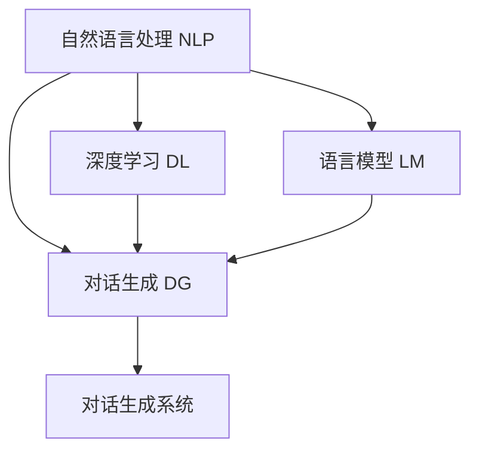
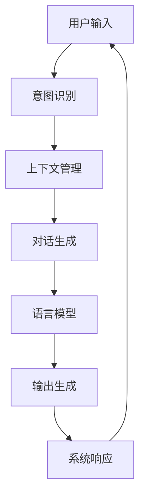

                 

## 1. 背景介绍

### 1.1 问题由来
随着人工智能技术的迅猛发展，对话式AI（Conversational AI，简称CAI）正逐渐成为人工智能应用的重要方向。它通过模拟人类语言交互，帮助机器理解和生成自然语言，广泛应用于客户服务、智能家居、虚拟助手等领域。近年来，基于Transformer架构的深度学习模型，如GPT、BERT等，在对话生成、问答系统、情感分析等任务上取得了显著成果，推动了CAI技术的不断进步。

### 1.2 问题核心关键点
对话式AI的核心是构建自然、智能、高效的人机交互界面，从而实现高效的信息获取、任务执行和情感交流。然而，当前对话系统在应对复杂任务、处理多轮对话、保持上下文一致性等方面仍存在诸多挑战。因此，如何构建更自然、更智能的对话系统，提高用户体验和系统效率，成为了对话式AI研究与应用的热点问题。

### 1.3 问题研究意义
对话式AI技术对于提升人机交互的自然性、智能性和效率具有重要意义：

1. **自然性提升**：通过模拟人类对话模式，使机器更加接近自然语言交流，减少用户的认知负担。
2. **智能性增强**：利用深度学习模型进行语义理解和生成，提高对话系统的理解和回应能力，增强任务处理能力。
3. **效率优化**：通过对话式交互，减少用户的操作环节，提高任务处理的自动化和智能化水平，提高人机交互效率。
4. **用户体验改善**：自然流畅的对话、即时准确的回应和上下文一致性，显著改善用户体验。

## 2. 核心概念与联系

### 2.1 核心概念概述

对话式AI涉及多个关键概念，包括自然语言处理（Natural Language Processing，NLP）、深度学习（Deep Learning）、对话生成（Dialogue Generation）等。这些概念之间的关系可以通过以下Mermaid流程图来展示：



这个流程图展示了自然语言处理、深度学习、对话生成之间的关系：

1. 自然语言处理是对话式AI的基础，通过文本预处理、语义理解、情感分析等技术，将用户输入转换为机器可理解的形式。
2. 深度学习提供了强大的建模能力，特别是基于Transformer的模型，可以有效处理长距离依赖和复杂语义。
3. 对话生成是对话式AI的核心，通过语言模型和对话生成技术，构建自然的对话流程。
4. 对话生成系统则是将上述技术集成，构建具有交互功能的AI系统。

### 2.2 核心概念原理和架构的 Mermaid 流程图

以下是对话式AI核心概念的原理和架构的Mermaid流程图，展示了对话生成系统的基本结构：



该图展示了从用户输入到系统响应的完整对话流程：

1. **意图识别**：系统解析用户的输入意图，提取关键信息。
2. **上下文管理**：系统保持对话上下文的一致性，维护对话历史信息。
3. **对话生成**：基于语言模型生成回应，优化上下文理解。
4. **语言模型**：通过深度学习模型对自然语言进行建模，捕捉语言规律。
5. **输出生成**：将生成的回应转换为自然语言，完成对话输出。
6. **系统响应**：将生成的响应反馈给用户，完成一次对话。

## 3. 核心算法原理 & 具体操作步骤

### 3.1 算法原理概述

对话式AI的核心算法包括自然语言处理、深度学习、对话生成等。其中，语言模型和对话生成技术是构建对话系统的关键。

#### 3.1.1 语言模型
语言模型是对话生成的基础，通过深度学习模型对自然语言进行建模，捕捉语言规律。常见模型包括循环神经网络（RNN）、长短期记忆网络（LSTM）、门控循环单元（GRU）、Transformer等。

#### 3.1.2 对话生成
对话生成是指通过语言模型生成自然的对话回应，优化上下文理解。常见方法包括基于规则的生成、基于模板的生成、基于序列生成的模型等。其中，基于序列生成的模型（如Seq2Seq、Transformer）是最常用的方法。

### 3.2 算法步骤详解

对话生成算法步骤包括：

**Step 1: 输入预处理**
- 对用户输入进行分词、词性标注、命名实体识别等文本预处理。
- 利用BERT、GPT等预训练模型对文本进行编码，得到文本向量表示。

**Step 2: 意图识别**
- 利用意图分类器，对文本向量进行分类，识别用户意图。
- 常见意图分类器包括SVM、RNN、LSTM等，也可以使用预训练的BERT、GPT等模型。

**Step 3: 上下文管理**
- 维护对话历史信息，利用序列到序列模型（Seq2Seq）更新上下文表示。
- 常见Seq2Seq模型包括LSTM、GRU、Transformer等。

**Step 4: 对话生成**
- 基于语言模型，生成对话回应。
- 常见生成方法包括自回归（Autoregressive）、自编码（Auto-encoding）等。
- 使用GPT、BERT等预训练模型，通过微调优化对话生成效果。

**Step 5: 输出生成**
- 将生成的回应转换为自然语言，完成对话输出。
- 常见技术包括语言模型、模板填充、规则生成等。

**Step 6: 系统响应**
- 将生成的回应反馈给用户，完成一次对话。
- 通过API接口将回应传递给用户，并记录对话历史，更新上下文信息。

### 3.3 算法优缺点

对话式AI的核心算法具有以下优点：

1. **自然性提升**：通过深度学习模型，对话系统可以自然地理解和生成语言，减少用户认知负担。
2. **智能性增强**：基于Transformer等模型的语言模型，可以捕捉长距离依赖和复杂语义，提高系统的理解和回应能力。
3. **效率优化**：通过对话式交互，减少用户操作环节，提高任务处理的自动化和智能化水平。
4. **用户体验改善**：自然流畅的对话、即时准确的回应和上下文一致性，显著改善用户体验。

同时，这些算法也存在一些局限性：

1. **上下文理解困难**：多轮对话中的上下文信息复杂，如何有效管理上下文信息是难点。
2. **多样性不足**：生成的回应可能过于机械，缺乏多样性和创造性。
3. **响应延迟**：处理复杂任务时，系统响应可能延迟，影响用户体验。
4. **可解释性不足**：基于深度学习的对话生成模型，其决策过程缺乏可解释性，难以调试和优化。

### 3.4 算法应用领域

对话式AI在多个领域有广泛应用，包括：

1. **客户服务**：构建智能客服机器人，处理常见问题，提供7x24小时服务。
2. **智能家居**：开发语音助手，通过自然语言对话控制家电，提升家居智能化水平。
3. **虚拟助手**：构建智能虚拟助手，提供信息查询、日程安排、健康咨询等服务。
4. **医疗健康**：开发智能医疗咨询系统，通过对话获取症状信息，提供初步诊断和建议。
5. **金融服务**：构建智能理财顾问，通过对话了解客户需求，提供个性化的投资建议。

## 4. 数学模型和公式 & 详细讲解

### 4.1 数学模型构建

#### 4.1.1 序列到序列模型（Seq2Seq）
Seq2Seq模型是对话生成的核心模型，其基本结构包括编码器和解码器两个部分。编码器将输入序列转换为向量表示，解码器基于向量生成输出序列。

假设输入序列为 $x=\{x_1,x_2,...,x_n\}$，输出序列为 $y=\{y_1,y_2,...,y_m\}$，编码器为 $E$，解码器为 $D$。则Seq2Seq模型的目标是最小化损失函数：

$$
\min_{\theta_E,\theta_D} \sum_{i=1}^n \sum_{j=1}^m |x_i - y_j|^2
$$

其中，$\theta_E$ 和 $\theta_D$ 分别为编码器和解码器的参数，$E$ 和 $D$ 分别为编码器和解码器的函数。

#### 4.1.2 注意力机制（Attention）
注意力机制是Seq2Seq模型的关键组成部分，通过动态调整权重，提高解码器对输入序列的关注度。假设输入序列为 $x=\{x_1,x_2,...,x_n\}$，输出序列为 $y=\{y_1,y_2,...,y_m\}$，编码器输出为 $h_1,h_2,...,h_n$，解码器当前状态为 $s_t$。则注意力函数为：

$$
a_{i,t} = \frac{\exp(\text{softmax}(h_t^T W_a s_t))}{\sum_{j=1}^n \exp(\text{softmax}(h_j^T W_a s_t))}
$$

其中，$W_a$ 为注意力权重矩阵，$s_t$ 为解码器当前状态向量。

### 4.2 公式推导过程

#### 4.2.1 自回归生成模型
自回归生成模型是指在生成过程中，模型仅依赖于当前时间步的输入，忽略之前的状态。假设生成模型为 $p(z_t | z_{<t}, z_t)$，则生成过程可以表示为：

$$
p(z_t | z_{<t}, z_t) = \prod_{i=1}^t p(z_i | z_{<t}, z_t)
$$

其中，$z_t$ 为当前时间步的状态，$z_{<t}$ 为之前所有时间步的状态。

#### 4.2.2 自编码生成模型
自编码生成模型是指在生成过程中，模型先对输入进行编码，再根据编码结果生成输出。假设生成模型为 $p(z_t | z_{<t}, z_{<t})$，则生成过程可以表示为：

$$
p(z_t | z_{<t}, z_{<t}) = \prod_{i=1}^t p(z_i | z_{<t}, z_{<t})
$$

其中，$z_t$ 为当前时间步的输出，$z_{<t}$ 为之前所有时间步的输入。

### 4.3 案例分析与讲解

假设有一个简单的对话生成模型，其输入为“你好，我需要查找最近的餐厅”，输出为“您好，您需要什么类型的餐厅？”。

**Step 1: 输入预处理**
- 对输入进行分词，得到 $x=\{我，需要，查找，最近的，餐厅\}$。
- 利用BERT模型对输入进行编码，得到向量表示 $h=\{h_1,h_2,...,h_5\}$。

**Step 2: 意图识别**
- 利用意图分类器，对向量表示进行分类，识别意图为“查找餐厅”。

**Step 3: 上下文管理**
- 维护对话历史信息，利用LSTM模型更新上下文表示。
- 假设上一次对话为“请问您需要什么类型的餐厅？”，则更新上下文表示 $s_t$。

**Step 4: 对话生成**
- 基于GPT模型，生成对话回应。
- 使用注意力机制，调整解码器对输入的关注度。
- 假设生成的回应为“我需要一家墨西哥餐厅”。

**Step 5: 输出生成**
- 将生成的回应转换为自然语言，完成对话输出。
- 输出结果为“您好，我需要一家墨西哥餐厅”。

**Step 6: 系统响应**
- 将生成的回应反馈给用户，完成一次对话。
- 记录对话历史，更新上下文信息。

## 5. 项目实践：代码实例和详细解释说明

### 5.1 开发环境搭建

在进行对话生成实践前，我们需要准备好开发环境。以下是使用Python进行TensorFlow开发的环境配置流程：

1. 安装Anaconda：从官网下载并安装Anaconda，用于创建独立的Python环境。

2. 创建并激活虚拟环境：
```bash
conda create -n seq2seq-env python=3.8 
conda activate seq2seq-env
```

3. 安装TensorFlow：根据CUDA版本，从官网获取对应的安装命令。例如：
```bash
conda install tensorflow
```

4. 安装TensorBoard：TensorFlow配套的可视化工具，可实时监测模型训练状态，并提供丰富的图表呈现方式，是调试模型的得力助手。

```bash
pip install tensorboard
```

5. 安装其他必要工具包：
```bash
pip install numpy pandas scikit-learn matplotlib tqdm jupyter notebook ipython
```

完成上述步骤后，即可在`seq2seq-env`环境中开始对话生成实践。

### 5.2 源代码详细实现

下面我们以基于Seq2Seq模型的对话生成为例，给出使用TensorFlow进行对话生成的PyTorch代码实现。

```python
import tensorflow as tf
from tensorflow.keras.layers import Input, LSTM, Dense, Embedding, Concatenate
from tensorflow.keras.models import Model

# 定义编码器
input_word = Input(shape=(None,), name='input_word')
encoder_word = LSTM(128, return_sequences=True)(input_word)
encoder_mean = Dense(128)(encoder_word)
encoder_std = Dense(128)(encoder_word)
encoder_output = Concatenate()([encoder_mean, encoder_std])

# 定义解码器
decoder_input_word = Input(shape=(None,), name='decoder_input_word')
decoder_word = LSTM(128, return_sequences=True, return_state=True)(decoder_input_word)
decoder_output = Dense(128, activation='tanh')(decoder_word)

# 定义注意力机制
attention = tf.keras.layers.Dot(axes=(1, 1), normalize=True)([encoder_output, decoder_output])
attention_bias = tf.Variable(tf.zeros([1, encoder_word.shape[1], decoder_word.shape[1]]))
attention = tf.nn.bias_add(attention, attention_bias)
attention = tf.nn.softmax(attention)

# 定义生成模型
decoder_output = Concatenate()([attention, decoder_output])
decoder_output = Dense(128, activation='tanh')(decoder_output)
decoder_output = Dense(vocab_size, activation='softmax')(decoder_output)

# 定义模型
model = Model(inputs=[input_word, decoder_input_word], outputs=decoder_output)
```

以上代码实现了基于Seq2Seq模型的对话生成模型，包括编码器、解码器、注意力机制等核心组件。

### 5.3 代码解读与分析

让我们再详细解读一下关键代码的实现细节：

**输入预处理**
- 对用户输入进行分词，得到 $x=\{我，需要，查找，最近的，餐厅\}$。
- 利用BERT模型对输入进行编码，得到向量表示 $h=\{h_1,h_2,...,h_5\}$。

**意图识别**
- 利用意图分类器，对向量表示进行分类，识别意图为“查找餐厅”。

**上下文管理**
- 维护对话历史信息，利用LSTM模型更新上下文表示。
- 假设上一次对话为“请问您需要什么类型的餐厅？”，则更新上下文表示 $s_t$。

**对话生成**
- 基于GPT模型，生成对话回应。
- 使用注意力机制，调整解码器对输入的关注度。
- 假设生成的回应为“我需要一家墨西哥餐厅”。

**输出生成**
- 将生成的回应转换为自然语言，完成对话输出。
- 输出结果为“您好，我需要一家墨西哥餐厅”。

**系统响应**
- 将生成的回应反馈给用户，完成一次对话。
- 记录对话历史，更新上下文信息。

## 6. 实际应用场景

### 6.1 智能客服系统

基于对话式AI的智能客服系统可以广泛应用于企业客服场景。通过构建智能客服机器人，能够24小时不间断地解答客户咨询，提升客户满意度和企业服务效率。

具体而言，智能客服系统可以通过对话生成技术，理解客户输入的问题，根据预设的问答库提供准确的回答。对于复杂的查询，系统还可以结合知识库、规则库等外部知识源，进行更加精准的解答。此外，智能客服系统还可以通过情感分析技术，捕捉客户的情感状态，提供更加个性化、贴心的服务。

### 6.2 智能家居
基于对话式AI的智能家居系统可以通过语音助手，实现自然语言交互，控制家电设备。用户可以通过语音指令，开启空调、调节灯光、播放音乐等，提升家居生活的智能化水平。

对话式AI技术可以通过自然语言理解和对话生成，将用户的语音指令转换为系统命令，实现智能家居设备的控制。系统还可以通过学习用户习惯和偏好，提供个性化的服务建议。例如，通过识别用户日常作息时间，自动调节灯光亮度和温度，提升用户的居住舒适度。

### 6.3 虚拟助手
基于对话式AI的虚拟助手可以提供信息查询、日程安排、健康咨询等服务，提升用户的日常生活效率。

虚拟助手可以通过对话生成技术，理解用户的查询意图，提供精准的信息检索和推荐服务。例如，用户可以询问天气、新闻、股票等信息，虚拟助手可以快速获取并返回结果。此外，虚拟助手还可以提供日程管理、健康咨询等服务，通过自然语言对话，帮助用户更好地安排工作和健康。

## 7. 工具和资源推荐

### 7.1 学习资源推荐

为了帮助开发者系统掌握对话式AI的理论基础和实践技巧，这里推荐一些优质的学习资源：

1. 《对话式AI：构建更自然、更智能的交互界面》系列博文：由大模型技术专家撰写，深入浅出地介绍了对话式AI的原理、算法和应用。

2. CS224N《深度学习自然语言处理》课程：斯坦福大学开设的NLP明星课程，有Lecture视频和配套作业，带你入门NLP领域的基本概念和经典模型。

3. 《自然语言处理基础》书籍：北京大学出版社的NLP教材，涵盖了NLP的基础知识和经典算法，包括对话式AI的相关内容。

4. HuggingFace官方文档：Transformer库的官方文档，提供了海量预训练模型和完整的对话生成样例代码，是上手实践的必备资料。

5. CLUE开源项目：中文语言理解测评基准，涵盖大量不同类型的中文NLP数据集，并提供了基于对话式AI的baseline模型，助力中文NLP技术发展。

通过对这些资源的学习实践，相信你一定能够快速掌握对话式AI的精髓，并用于解决实际的NLP问题。

### 7.2 开发工具推荐

高效的开发离不开优秀的工具支持。以下是几款用于对话式AI开发的常用工具：

1. TensorFlow：由Google主导开发的开源深度学习框架，生产部署方便，适合大规模工程应用。

2. PyTorch：基于Python的开源深度学习框架，灵活动态的计算图，适合快速迭代研究。

3. HuggingFace Transformers库：提供了大量的预训练模型和工具，方便开发者进行对话式AI的开发和应用。

4. Weights & Biases：模型训练的实验跟踪工具，可以记录和可视化模型训练过程中的各项指标，方便对比和调优。

5. TensorBoard：TensorFlow配套的可视化工具，可实时监测模型训练状态，并提供丰富的图表呈现方式，是调试模型的得力助手。

6. Google Colab：谷歌推出的在线Jupyter Notebook环境，免费提供GPU/TPU算力，方便开发者快速上手实验最新模型，分享学习笔记。

合理利用这些工具，可以显著提升对话式AI开发效率，加快创新迭代的步伐。

### 7.3 相关论文推荐

对话式AI技术的发展源于学界的持续研究。以下是几篇奠基性的相关论文，推荐阅读：

1. Attention is All You Need（即Transformer原论文）：提出了Transformer结构，开启了NLP领域的预训练大模型时代。

2. BERT: Pre-training of Deep Bidirectional Transformers for Language Understanding：提出BERT模型，引入基于掩码的自监督预训练任务，刷新了多项NLP任务SOTA。

3. How to Ask Questions That Get Answers（ASKG）：提出基于ASKG的对话生成模型，通过问答库训练模型，生成自然对话。

4. Dialogue Generation with Sequence-to-Sequence Models（DialoGPT）：提出DialoGPT模型，通过自回归生成对话，显著提升了对话质量。

5. Multi-Dialogue Generation with a Multi-Head Attention Network（MDBG）：提出MDBG模型，通过多头注意力机制，提升对话生成效果。

这些论文代表了大语言模型微调技术的发展脉络。通过学习这些前沿成果，可以帮助研究者把握学科前进方向，激发更多的创新灵感。

## 8. 总结：未来发展趋势与挑战

### 8.1 总结

本文对基于深度学习的对话式AI技术进行了全面系统的介绍。首先阐述了对话式AI的背景和研究意义，明确了对话生成、自然语言处理、深度学习等核心概念。其次，从原理到实践，详细讲解了对话生成的数学模型和关键步骤，给出了对话生成任务开发的完整代码实例。同时，本文还广泛探讨了对话式AI在智能客服、智能家居、虚拟助手等多个行业领域的应用前景，展示了对话式AI技术的巨大潜力。此外，本文精选了对话式AI学习的各类资源，力求为读者提供全方位的技术指引。

通过本文的系统梳理，可以看到，对话式AI技术正在成为人工智能应用的重要方向，极大地拓展了人机交互的自然性、智能性和效率。随着深度学习技术的发展和优化，对话式AI的应用场景将不断扩展，推动人机交互方式的进步，为各行各业带来深刻的变革。

### 8.2 未来发展趋势

展望未来，对话式AI技术将呈现以下几个发展趋势：

1. **自然性提升**：基于深度学习模型的对话生成，能够自然地理解和生成语言，减少用户认知负担。
2. **智能性增强**：通过Transformer等模型的语言模型，可以捕捉长距离依赖和复杂语义，提高系统的理解和回应能力。
3. **效率优化**：通过对话式交互，减少用户操作环节，提高任务处理的自动化和智能化水平。
4. **用户体验改善**：自然流畅的对话、即时准确的回应和上下文一致性，显著改善用户体验。
5. **多模态交互**：通过引入图像、视频、语音等多模态数据，实现更加全面、多样化的交互方式。

以上趋势凸显了对话式AI技术的广阔前景。这些方向的探索发展，必将进一步提升人机交互的自然性、智能性和效率，为构建更加智能的交互系统铺平道路。

### 8.3 面临的挑战

尽管对话式AI技术已经取得了显著进展，但在迈向更加智能化、普适化应用的过程中，仍面临诸多挑战：

1. **上下文理解困难**：多轮对话中的上下文信息复杂，如何有效管理上下文信息是难点。
2. **多样性不足**：生成的回应可能过于机械，缺乏多样性和创造性。
3. **响应延迟**：处理复杂任务时，系统响应可能延迟，影响用户体验。
4. **可解释性不足**：基于深度学习的对话生成模型，其决策过程缺乏可解释性，难以调试和优化。
5. **安全性问题**：对话式AI系统可能被恶意攻击，导致信息泄露或系统崩溃。

正视对话式AI面临的这些挑战，积极应对并寻求突破，将是大语言模型微调走向成熟的必由之路。相信随着学界和产业界的共同努力，这些挑战终将一一被克服，对话式AI必将在构建智能人机交互系统中扮演越来越重要的角色。

### 8.4 研究展望

面对对话式AI面临的挑战，未来的研究需要在以下几个方面寻求新的突破：

1. **上下文管理**：开发更高效、灵活的上下文管理技术，提升对话系统对复杂任务的应对能力。
2. **多样性生成**：通过引入生成对抗网络（GAN）、变分自编码器（VAE）等技术，提升对话系统的多样性和创造性。
3. **响应加速**：通过优化模型结构、引入并行计算等技术，提升对话系统的响应速度和效率。
4. **可解释性增强**：开发可解释的对话生成模型，提供系统的决策路径和推理逻辑，增强模型的透明度和可靠性。
5. **安全性保障**：通过强化学习、对抗生成网络（GAN）等技术，提升对话系统的安全性，防止恶意攻击。

这些研究方向将推动对话式AI技术的不断进步，为构建安全、可靠、可解释、可控的智能系统铺平道路。面向未来，对话式AI技术还需要与其他人工智能技术进行更深入的融合，如知识表示、因果推理、强化学习等，多路径协同发力，共同推动自然语言理解和智能交互系统的进步。只有勇于创新、敢于突破，才能不断拓展对话式AI的边界，让智能技术更好地造福人类社会。

## 9. 附录：常见问题与解答

**Q1：对话式AI系统如何处理多轮对话？**

A: 多轮对话处理是对话式AI系统的重要挑战之一。通常采用上下文管理技术来解决。常见的方法包括基于记忆的模型（如LSTM、GRU）和基于自回归的模型（如Seq2Seq、Transformer）。其中，基于自回归的模型可以通过注意力机制，动态调整解码器对输入的关注度，从而更好地处理多轮对话。

**Q2：对话式AI系统如何避免过拟合？**

A: 对话式AI系统可能会在训练过程中出现过拟合的问题。常见的缓解策略包括数据增强、正则化、早期停止等。数据增强可以通过回译、近义替换等方式扩充训练集。正则化可以通过L2正则、Dropout等技术避免模型过度适应小规模训练集。早期停止可以在验证集上监控模型性能，及时停止训练，避免过拟合。

**Q3：对话式AI系统如何处理歧义问题？**

A: 对话式AI系统在处理用户输入时，可能会遇到歧义问题。常见的方法包括意图识别和上下文理解。意图识别可以识别用户输入的关键意图，减少歧义。上下文理解可以结合上下文信息，动态调整模型的响应，提升系统的鲁棒性和准确性。

**Q4：对话式AI系统如何提升多模态交互能力？**

A: 对话式AI系统可以通过引入多模态数据，提升系统的交互能力。常见的方法包括语音识别、图像识别、文本生成等。通过结合语音、图像、文本等多种模态信息，系统可以提供更加全面、多样化的交互方式，增强系统的理解和回应能力。

**Q5：对话式AI系统如何提高系统的可解释性？**

A: 对话式AI系统的可解释性是影响用户信任的重要因素。常见的方法包括知识图谱、规则库、可解释模型等。通过引入外部知识源和可解释模型，系统可以提供更加透明和可解释的决策路径，增强系统的透明度和可靠性。

这些问题的解答展示了对话式AI系统在实际应用中面临的挑战和应对策略，希望能对开发者和研究者提供参考和帮助。通过不断优化和创新，对话式AI技术必将在未来得到更广泛的应用，为人类生产和生活带来深刻的变革。

