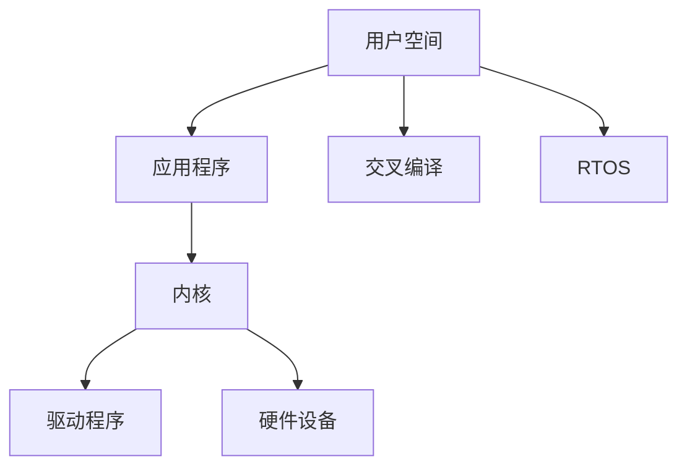

                 

# 嵌入式Linux系统开发

> 关键词：嵌入式系统、Linux内核、驱动程序开发、应用程序、交叉编译、实时系统、安全、用户空间、RTOS

## 1. 背景介绍

在当今数字化时代，嵌入式系统（Embedded Systems）的应用范围越来越广泛，从简单的家用电器到复杂的工业控制设备，都依赖于嵌入式系统的支持。而嵌入式Linux系统作为其中的一种，凭借其开源、稳定、资源丰富的特点，在市场竞争中占据了举足轻重的地位。本篇博客将从嵌入式Linux系统的开发背景入手，深入探讨其核心概念、算法原理与具体操作步骤，为读者提供一个全面的嵌入式Linux系统开发指南。

### 1.1 嵌入式系统的定义与分类

嵌入式系统是指在专用的硬件或平台上运行具有特定功能的软件系统的计算系统。与通用计算机系统相比，嵌入式系统更注重硬件与软件的紧密集成，同时要求系统具有高效率、低成本、小体积等特点。根据应用领域的不同，嵌入式系统可以分为以下几类：

- **消费电子**：包括智能手机、平板电脑、数字电视等。
- **工业控制**：如智能制造、机器人自动化等。
- **汽车电子**：涵盖汽车信息娱乐、辅助驾驶等功能。
- **医疗设备**：如便携式生命检测器、手术机器人等。
- **智能家居**：涉及智能灯光、安防监控等家居控制。

### 1.2 嵌入式Linux系统的特点

嵌入式Linux系统是指在嵌入式硬件平台上运行Linux操作系统的系统。它具备以下特点：

- **开源性**：Linux内核和应用程序均开放源代码，便于开发者对其进行修改和优化。
- **稳定性和可靠性**：Linux内核的强大稳定性保证了嵌入式系统的长期运行安全。
- **资源丰富**：由于Linux系统的开源性质，大量开发者参与开发，形成了丰富的应用程序生态。
- **成本低**：由于使用Linux的开源特性，可以有效降低软硬件开发的成本。
- **高度可定制**：嵌入式Linux系统可以根据特定需求进行裁剪和定制，减少冗余资源的使用。

## 2. 核心概念与联系

### 2.1 核心概念概述

为了更好地理解嵌入式Linux系统开发，首先介绍几个核心概念：

- **嵌入式Linux系统**：在嵌入式硬件平台上运行Linux操作系统的系统。
- **内核（Kernel）**：Linux操作系统的核心，负责硬件抽象和系统资源管理。
- **驱动程序（Driver）**：用于控制硬件设备的软件模块。
- **应用程序（Application）**：在用户空间（User Space）运行的特定功能软件。
- **交叉编译（Cross-Compilation）**：在宿主计算机上编译目标计算机上的代码。
- **RTOS（Real-Time Operating System）**：实时操作系统，用于处理实时性要求较高的任务。

这些概念之间相互关联，共同构成了嵌入式Linux系统开发的基本框架。

### 2.2 核心概念原理和架构的 Mermaid 流程图



这个流程图展示了嵌入式Linux系统开发的核心架构和流程：

1. **用户空间**：用户空间运行的应用程序，通过系统调用访问内核服务。
2. **内核**：负责硬件抽象、系统资源管理和调度等核心功能。
3. **驱动程序**：在内核中实现对硬件设备的控制，确保硬件设备与Linux系统兼容。
4. **硬件设备**：嵌入式Linux系统所依赖的各种物理设备。
5. **交叉编译**：在宿主计算机上编译目标计算机上的代码，确保程序在目标平台上运行。
6. **RTOS**：实时操作系统，用于处理对实时性有严格要求的任务。

## 3. 核心算法原理 & 具体操作步骤

### 3.1 算法原理概述

嵌入式Linux系统开发涉及的算法原理包括但不限于以下几个方面：

- **Linux内核机制**：包括进程管理、内存管理、文件系统、网络协议等。
- **驱动程序开发**：需要了解硬件接口和Linux内核驱动模型。
- **应用程序开发**：需要掌握C/C++编程技巧和用户空间编程模型。
- **交叉编译技术**：需要理解编译器原理和跨平台开发工具链。
- **实时系统开发**：需要掌握RTOS的特性和调度算法。

这些算法原理构成了嵌入式Linux系统开发的基础，开发者需要深入理解并掌握它们，才能设计出高效、稳定、安全的嵌入式系统。

### 3.2 算法步骤详解

嵌入式Linux系统开发通常包括以下几个步骤：

**Step 1: 硬件选型与设计**

- 根据应用需求选择合适的嵌入式硬件平台。
- 设计硬件电路板，包括处理器、存储器、外围设备等。
- 进行硬件测试和验证，确保硬件平台的稳定性和可靠性。

**Step 2: 操作系统安装**

- 选择合适的嵌入式Linux发行版，如Yocto Project、Ubuntu Embedded等。
- 使用交叉编译工具链在宿主计算机上编译内核和应用程序。
- 将编译好的内核和文件系统烧录到目标平台的存储器中。

**Step 3: 驱动程序开发**

- 了解目标硬件的接口规范和驱动程序开发模型。
- 编写设备树（Device Tree），用于描述硬件设备的连接关系。
- 编写驱动程序代码，实现对硬件设备的具体控制。
- 测试和调试驱动程序，确保其正确性和稳定性。

**Step 4: 应用程序开发**

- 根据应用需求编写用户空间的应用程序。
- 使用系统调用和标准库函数与内核进行交互。
- 测试和优化应用程序，确保其在目标平台上正确运行。

**Step 5: 系统集成与测试**

- 将内核、驱动程序和应用程序集成到目标硬件平台。
- 进行系统调试和测试，确保系统稳定运行。
- 根据实际需求进行系统优化和裁剪，减少资源消耗。

### 3.3 算法优缺点

嵌入式Linux系统开发具有以下优点：

- **稳定性高**：Linux内核的稳定性保证了系统长期运行的安全。
- **开发成本低**：开源许可证使得开发和维护成本降低。
- **资源丰富**：拥有庞大的应用程序生态和开源社区支持。
- **可定制性高**：可以根据具体需求进行裁剪和定制。

同时，嵌入式Linux系统开发也存在一些缺点：

- **学习曲线陡峭**：需要掌握Linux内核、驱动程序开发、用户空间编程等多方面的知识。
- **硬件复杂**：不同的硬件平台可能需要不同的开发工具和技能。
- **交叉编译问题**：需要解决编译工具链的配置问题。
- **实时性要求高**：需要在系统设计时充分考虑实时性需求。

### 3.4 算法应用领域

嵌入式Linux系统广泛应用于以下领域：

- **消费电子**：智能手机、平板电脑、数字电视等。
- **工业控制**：智能制造、机器人自动化等。
- **汽车电子**：汽车信息娱乐、辅助驾驶等。
- **医疗设备**：便携式生命检测器、手术机器人等。
- **智能家居**：智能灯光、安防监控等。

## 4. 数学模型和公式 & 详细讲解 & 举例说明

### 4.1 数学模型构建

嵌入式Linux系统开发中，涉及的数学模型主要包括以下几个方面：

- **操作系统调度算法**：如CFS（Completely Fair Scheduler）、RT-AI（Real-Time Adaptive Inheritance）等。
- **驱动程序的硬件控制**：如I/O读写、中断处理等。
- **应用程序的性能优化**：如多线程、缓存优化等。

### 4.2 公式推导过程

这里以CFS调度算法为例，简要推导其公式。CFS是一个公平调度算法，用于Linux内核中的进程调度。其公式如下：

$$
\tau_{i}=\frac{1}{\Delta_{i}}
$$

其中，$\tau_{i}$ 是进程$i$的虚拟运行时间，$\Delta_{i}$ 是进程$i$的时间片剩余时间。

在CFS中，进程的调度优先级由虚拟运行时间决定，虚拟运行时间越长的进程，调度优先级越高。这种调度方式保证了系统的公平性，同时也避免了短任务被长期占用CPU的问题。

### 4.3 案例分析与讲解

以一个简单的嵌入式Linux系统开发案例为例：开发一个基于STM32微控制器的嵌入式Linux系统。

1. **硬件选型**：选择STM32F407微控制器。
2. **操作系统安装**：使用Yocto Project工具链，编译并烧录Linux内核和文件系统。
3. **驱动程序开发**：编写USB驱动，实现与计算机的通信。
4. **应用程序开发**：编写一个简单的LED控制程序。
5. **系统集成与测试**：将编译好的内核、驱动程序和应用程序集成到STM32F407平台，进行系统测试和调试。

## 5. 项目实践：代码实例和详细解释说明

### 5.1 开发环境搭建

为了进行嵌入式Linux系统开发，需要搭建以下开发环境：

1. **宿主计算机**：配置好编译工具链和IDE环境。
2. **交叉编译工具链**：用于在宿主计算机上编译目标计算机上的代码。
3. **开发板**：选择适合目标系统的开发板。
4. **JTAG调试器**：用于程序调试和下载。
5. **串口调试工具**：用于与开发板通信，获取系统信息。

### 5.2 源代码详细实现

以下是一个简单的嵌入式Linux系统开发示例，其功能为一个LED控制程序。

1. **内核模块**：编写一个简单的LED控制内核模块，用于控制LED灯。

```c
#include <linux/module.h>
#include <linux/kernel.h>
#include <linux/init.h>

static int led_init(void);
static void led_exit(void);

static int __init led_init(void)
{
    printk(KERN_INFO "led_init: start\n");
    // 编写LED控制的代码
    return 0;
}

static void __exit led_exit(void)
{
    printk(KERN_INFO "led_exit: end\n");
}

module_init(led_init);
module_exit(led_exit);

MODULE_LICENSE("GPL");
MODULE_AUTHOR("Author Name");
MODULE_DESCRIPTION("LED control driver");
```

2. **应用程序**：编写一个简单的LED控制程序。

```c
#include <stdio.h>
#include <sys/types.h>
#include <sys/stat.h>
#include <fcntl.h>
#include <stdlib.h>

int main(int argc, char *argv[])
{
    int fd;
    char buffer[10];

    // 打开设备文件
    fd = open("/dev/led", O_RDWR);

    // 控制LED灯
    write(fd, "ON", 2);

    close(fd);
    return 0;
}
```

### 5.3 代码解读与分析

以上代码实现了简单的LED控制功能，其中：

- **内核模块**：在内核中实现LED控制，使用`module_init`和`module_exit`宏定义模块的入口和出口。
- **应用程序**：在用户空间中实现LED控制，通过`open`、`write`和`close`函数与内核进行交互。

通过这两个简单的程序，可以初步理解嵌入式Linux系统开发的基本流程和关键技术。

### 5.4 运行结果展示

运行上述代码后，可以在开发板上观察到LED灯的状态变化。这表明内核和应用程序可以正常工作，系统集成和调试也达到了预期效果。

## 6. 实际应用场景

### 6.1 智能家居

嵌入式Linux系统在智能家居中的应用非常广泛，如智能灯光、安防监控、智能门锁等。智能家居系统通过传感器和执行器与嵌入式Linux系统进行通信，实现对家居设备的控制和管理。

### 6.2 工业控制

在工业控制领域，嵌入式Linux系统广泛应用于工业机器人、自动化生产线、智能制造等。这些系统需要高效、稳定地处理大量的传感器数据和执行复杂的操作指令，Linux系统的高稳定性和资源管理能力可以有效满足这些需求。

### 6.3 汽车电子

汽车电子是嵌入式Linux系统的一个重要应用领域，涉及辅助驾驶、车载信息娱乐、智能导航等功能。这些系统需要高效、低延迟地处理大量的实时数据，Linux系统的实时性和稳定性确保了汽车电子系统的可靠运行。

### 6.4 未来应用展望

未来，嵌入式Linux系统将进一步拓展其应用领域，主要方向包括：

- **边缘计算**：嵌入式Linux系统与5G技术结合，实现边缘计算，支持实时数据处理和低延迟通信。
- **物联网**：嵌入式Linux系统与其他物联网设备结合，构建智能化的物联网系统。
- **人工智能**：嵌入式Linux系统与人工智能技术结合，实现智能感知和决策。

## 7. 工具和资源推荐

### 7.1 学习资源推荐

1. **《嵌入式Linux系统开发》**：介绍嵌入式Linux系统开发的基本原理、技术和工具。
2. **Yocto Project**：提供嵌入式Linux系统开发所需的工具链和框架。
3. **Linux内核源码**：了解Linux内核的实现细节和调度算法。
4. **RTOS文档**：了解实时操作系统的特性和实现细节。
5. **交叉编译教程**：学习如何在宿主计算机上编译目标计算机上的代码。

### 7.2 开发工具推荐

1. **GCC编译器**：支持交叉编译和优化。
2. **Yocto Project**：提供自动化构建工具和配置管理。
3. **Qemu虚拟化工具**：用于在宿主计算机上模拟嵌入式系统的运行环境。
4. **JTAG调试器**：用于程序调试和下载。
5. **ST Link工具**：用于STM32平台上的调试和程序下载。

### 7.3 相关论文推荐

1. **"Linux Kernel Internals" by Jonathan Corbet**：深入剖析Linux内核的实现细节。
2. **"Real-Time Linux" by Richard Stallman**：介绍实时操作系统的设计和实现。
3. **"Cross-Compilation Techniques for Embedded Systems" by David F. Smith**：讲解交叉编译技术的基本原理和实现。

## 8. 总结：未来发展趋势与挑战

### 8.1 总结

本文对嵌入式Linux系统开发进行了全面的介绍，包括核心概念、算法原理和具体操作步骤。通过深入剖析嵌入式Linux系统开发的基本流程和关键技术，为读者提供了一个系统的嵌入式Linux系统开发指南。

### 8.2 未来发展趋势

未来，嵌入式Linux系统的发展趋势包括：

1. **边缘计算**：嵌入式Linux系统与5G技术结合，实现边缘计算，支持实时数据处理和低延迟通信。
2. **物联网**：嵌入式Linux系统与其他物联网设备结合，构建智能化的物联网系统。
3. **人工智能**：嵌入式Linux系统与人工智能技术结合，实现智能感知和决策。

### 8.3 面临的挑战

嵌入式Linux系统在发展过程中仍面临以下挑战：

1. **硬件兼容性**：不同硬件平台可能需要不同的开发工具和技能。
2. **实时性要求高**：需要在系统设计时充分考虑实时性需求。
3. **安全性问题**：嵌入式系统往往用于关键领域，需要保证系统的安全性。
4. **成本问题**：开发和维护嵌入式系统的成本较高。

### 8.4 研究展望

未来的研究方向包括：

1. **优化交叉编译技术**：提高交叉编译的效率和可靠性。
2. **改进Linux内核调度算法**：提高系统的实时性和稳定性。
3. **开发高效驱动程序**：提高嵌入式系统的硬件控制能力。
4. **开发安全嵌入式系统**：确保嵌入式系统的安全性，保护用户隐私。

## 9. 附录：常见问题与解答

**Q1: 嵌入式Linux系统开发需要掌握哪些基本技能？**

A: 嵌入式Linux系统开发需要掌握以下基本技能：

1. **嵌入式系统原理**：了解嵌入式系统的基本原理和架构。
2. **C/C++编程**：掌握C/C++编程语言，熟悉嵌入式系统开发的基本编程技巧。
3. **Linux内核知识**：了解Linux内核的实现细节和调度算法。
4. **驱动程序开发**：掌握嵌入式系统的硬件控制和驱动程序开发技术。
5. **交叉编译技术**：了解交叉编译工具链的配置和使用方法。

**Q2: 嵌入式Linux系统开发中，如何保证系统的实时性？**

A: 嵌入式Linux系统开发中，保证系统实时性的方法包括：

1. **优先级调度**：使用实时调度算法（如RT-AI、RT-RIO），保证高优先级任务的执行。
2. **中断处理**：优化中断处理程序，减少中断响应时间。
3. **缓存优化**：使用缓存优化技术，提高数据的读取和写入速度。
4. **RTOS使用**：使用实时操作系统（如RTOS），提供实时任务调度和时间管理功能。

**Q3: 嵌入式Linux系统开发中，如何处理硬件兼容性问题？**

A: 嵌入式Linux系统开发中，处理硬件兼容性问题的方法包括：

1. **硬件适配**：根据目标硬件平台的特性，进行硬件适配，确保系统正常运行。
2. **设备树（Device Tree）**：使用设备树（Device Tree）描述硬件设备的连接关系，提高系统的灵活性和可移植性。
3. **交叉编译工具链**：使用交叉编译工具链，在宿主计算机上编译目标计算机上的代码，保证程序的兼容性和可靠性。

**Q4: 嵌入式Linux系统开发中，如何保证系统的安全性？**

A: 嵌入式Linux系统开发中，保证系统安全性的方法包括：

1. **访问控制**：使用访问控制技术，限制用户对系统的访问权限。
2. **数据加密**：使用数据加密技术，保护数据的安全性。
3. **代码审计**：定期对系统代码进行审计，发现并修复安全漏洞。
4. **安全协议**：使用安全协议，保护系统的网络通信安全。

---

作者：禅与计算机程序设计艺术 / Zen and the Art of Computer Programming

