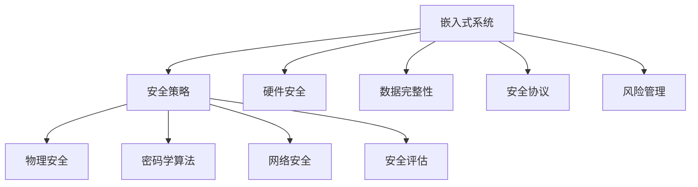

                 

# 嵌入式系统安全策略：保护设备和数据完整性

> 关键词：嵌入式系统安全, 数据完整性, 设备保护, 安全协议, 硬件安全, 加密算法, 安全策略

## 1. 背景介绍

### 1.1 问题由来
随着物联网技术的迅猛发展，嵌入式系统已经广泛应用于各种智能设备中，如智能家居、汽车电子、医疗健康等。这些设备通常高度集成、实时性要求高，需要具备卓越的安全性能来保护设备自身及用户数据。然而，嵌入式系统的物理特性限制了其安全防护措施的实施，使其成为网络攻击和数据泄露的薄弱环节。近年来，针对嵌入式设备的恶意攻击和数据泄漏事件屡见不鲜，如物联网设备被黑客控制执行恶意操作、智能手机窃听用户通话记录等。这些问题不仅严重损害了用户隐私和财产安全，也对社会稳定和公共安全构成了威胁。因此，如何在资源受限的嵌入式系统中有效实施安全策略，保护设备和数据完整性，成为当前亟待解决的问题。

### 1.2 问题核心关键点
嵌入式系统安全策略的核心在于通过多层安全机制，从设备层、网络层、应用层等多个角度进行综合防护。具体来说，需要考虑以下几个关键点：
- 设备层安全：通过硬件安全模块、物理安全措施等手段，确保设备硬件不受未经授权的访问。
- 数据完整性保护：采用密码学算法对数据进行加密和验证，防止数据在传输和存储过程中被篡改。
- 安全协议设计：设计基于传输层和应用层的安全协议，保障数据传输过程中的机密性和完整性。
- 风险管理：实施定期的安全评估和漏洞修复，及时应对新出现的安全威胁。

这些问题需要综合考虑设备硬件、软件、数据等多方面的因素，构建一个立体化的安全防护体系，才能有效应对现代网络环境下的各种安全挑战。

## 2. 核心概念与联系

### 2.1 核心概念概述

为了深入理解嵌入式系统安全策略，本节将介绍几个关键概念：

- **嵌入式系统**：指嵌入在目标设备中，以实现特定功能的应用程序和相关硬件。典型的嵌入式系统包括智能家居设备、汽车电子、工业控制系统等。
- **安全策略**：指为保护嵌入式系统中的设备和数据，而制定的各种安全机制和防护措施。这些策略包括物理安全、硬件安全、软件安全、网络安全、数据加密等。
- **硬件安全**：指通过专用硬件芯片、物理隔离等手段，保障设备硬件不受未经授权的访问和篡改。
- **数据完整性**：指确保数据在传输和存储过程中不被篡改或损坏，保持数据的原始性和真实性。
- **安全协议**：指在网络层和应用层上设计的协议，确保数据传输过程中的机密性和完整性。
- **风险管理**：指识别、评估和缓解安全威胁的过程，通过定期的安全评估和漏洞修复，提升系统的安全性和可靠性。

这些概念之间的关系可以通过以下Mermaid流程图来展示：



这个流程图展示了我上述提到的核心概念及其之间的逻辑关系：

1. 嵌入式系统通过应用安全策略，从硬件、软件、网络、数据等多个层面进行综合防护。
2. 硬件安全通过专用硬件芯片、物理隔离等手段，保障设备硬件安全。
3. 数据完整性通过密码学算法进行加密和验证，保护数据在传输和存储过程中的完整性。
4. 安全协议在网络层和应用层进行设计，确保数据传输过程中的机密性和完整性。
5. 风险管理通过定期的安全评估和漏洞修复，提升系统的安全性和可靠性。

## 3. 核心算法原理 & 具体操作步骤

### 3.1 算法原理概述

嵌入式系统安全策略的实施，涉及多个层次的安全算法和技术。本文将重点介绍几种关键的安全算法及其原理。

### 3.2 算法步骤详解

本节将详细介绍几种核心安全算法的具体操作步骤：

**Step 1: 硬件安全模块部署**
嵌入式系统硬件安全模块的部署步骤如下：
1. 选择适合的硬件安全模块（如TrustZone、Secure Element等）。
2. 将硬件安全模块集成到目标设备中。
3. 初始化硬件安全模块，配置相关安全参数。

**Step 2: 数据加密与验证**
嵌入式系统中，数据加密和验证是确保数据完整性的关键步骤。其具体操作步骤如下：
1. 选择适合的加密算法（如AES、RSA等），并生成相应的密钥对。
2. 对传输数据进行加密处理，生成密文。
3. 将密文与预共享的密钥进行验证，确保数据的完整性和真实性。

**Step 3: 安全协议设计**
嵌入式系统的安全协议设计主要涉及传输层和应用层的协议设计。其具体操作步骤如下：
1. 确定传输数据的加密方式和验证方法。
2. 设计基于传输层（如TLS/SSL）和应用层（如IPsec、SIP等）的安全协议。
3. 实现安全协议的具体实现，并在设备间进行部署和测试。

**Step 4: 安全评估与漏洞修复**
嵌入式系统的安全评估与漏洞修复是确保系统长期安全的关键步骤。其具体操作步骤如下：
1. 定期进行安全评估，识别潜在的安全漏洞和威胁。
2. 根据评估结果，进行漏洞修复和优化，提升系统的安全性能。
3. 实施持续监控和更新，确保系统能够及时应对新出现的安全威胁。

### 3.3 算法优缺点

嵌入式系统安全策略的实施具有以下优点：
1. 多重防护：通过硬件安全、密码学算法、安全协议等手段，提供多层次的安全防护。
2. 低成本：相较于传统的网络安全解决方案，嵌入式系统安全策略在硬件和软件上成本较低。
3. 实时性：嵌入式系统的实时性和低延迟特性，使得安全防护措施能够在第一时间响应和处理安全威胁。

同时，嵌入式系统安全策略也存在以下缺点：
1. 资源限制：嵌入式系统的计算、存储等资源有限，限制了安全算法的实施。
2. 安全性依赖：安全策略的实施依赖于硬件安全模块和软件实现的正确性，一旦出现故障，可能导致严重的安全漏洞。
3. 持续维护：安全策略需要定期评估和修复漏洞，持续投入人力物力。

### 3.4 算法应用领域

嵌入式系统安全策略已经在多个领域得到了应用，具体包括：

- **智能家居系统**：通过硬件安全模块、网络安全协议等手段，保护家庭数据和设备安全。
- **汽车电子系统**：在车载导航、智能驾驶等应用中，采用数据加密和验证技术，保护用户隐私和行车安全。
- **工业控制系统**：通过硬件安全模块和网络安全协议，保护工业设备不受网络攻击和数据泄漏。
- **医疗健康设备**：在智能穿戴设备、电子病历等应用中，采用加密算法和数据验证技术，保护患者隐私和医疗数据。
- **金融支付系统**：在智能支付、移动银行等应用中，采用多重安全机制，保护用户财产安全。

这些领域中，嵌入式系统安全策略的应用不仅可以保障设备和数据的安全，还能够提升用户体验和设备可靠性，推动相关行业的健康发展。

## 4. 数学模型和公式 & 详细讲解 & 举例说明

### 4.1 数学模型构建

为了更好地理解嵌入式系统安全策略的实现，本节将通过数学模型来描述其核心算法的实现过程。

假设目标设备通过硬件安全模块（HSM）进行安全防护，并采用AES加密算法对数据进行加密和验证。我们将使用以下数学模型进行描述：

- **硬件安全模块（HSM）**：在目标设备中集成HSM，用于存储和管理密钥、进行数据加密和验证。
- **AES加密算法**：将数据通过AES算法进行加密处理，生成密文。
- **数据验证**：通过HSM存储的密钥对密文进行验证，确保数据的完整性和真实性。

数学模型构建如下：

$$
\begin{aligned}
M_{\text{HSM}}: &\text{硬件安全模块} \\
M_{\text{AES}}: &\text{AES加密算法} \\
M_{\text{Verify}}: &\text{数据验证算法} \\
\text{plaintext} \in \mathcal{X} \\
\text{key} \in \mathcal{K} \\
\text{ciphertext} \in \mathcal{C} \\
M_{\text{HSM}}(\text{key}) \in \mathcal{K} \\
M_{\text{AES}}(\text{key}, \text{plaintext}) \in \mathcal{C} \\
M_{\text{Verify}}(M_{\text{AES}}(\text{key}, \text{plaintext}), M_{\text{HSM}}(\text{key})) \in \{0, 1\}
\end{aligned}
$$

其中，$\mathcal{X}$、$\mathcal{K}$、$\mathcal{C}$分别表示明文、密钥、密文空间。

### 4.2 公式推导过程

接下来，我们将对上述数学模型进行公式推导，以进一步理解嵌入式系统安全策略的实现。

**Step 1: 密钥管理**
密钥是AES加密算法的基础，需要通过硬件安全模块（HSM）进行管理和存储。

设目标设备中集成了一个硬件安全模块（HSM），密钥存储于HSM中。设密钥为$k$，则有：

$$
M_{\text{HSM}}(k) = k
$$

**Step 2: 数据加密**
目标设备采用AES算法对数据进行加密处理。设明文为$p$，加密后的密文为$c$，则有：

$$
c = M_{\text{AES}}(k, p)
$$

其中，$M_{\text{AES}}$表示AES加密算法的实现，$k$为HSM中存储的密钥。

**Step 3: 数据验证**
目标设备需要对接收到的密文$c$进行验证，确保其完整性和真实性。验证过程如下：

1. 从HSM中提取密钥$k$。
2. 使用密钥$k$对密文$c$进行解密处理，生成明文$p'$。
3. 对明文$p'$进行哈希处理，生成哈希值$h$。
4. 对接收到的密文$c$进行哈希处理，生成哈希值$h'$。
5. 比较哈希值$h$和$h'$是否相等，如果相等，则数据验证通过，否则验证失败。

数学模型如下：

$$
\begin{aligned}
h' &= \text{hash}(c) \\
h &= \text{hash}(p') \\
\text{Verify}(c, h', h) &= \left\{ \begin{array}{ll}
1, & h' = h \\
0, & h' \neq h
\end{array} \right.
\end{aligned}
$$

其中，$\text{hash}$表示哈希函数，用于生成哈希值。

### 4.3 案例分析与讲解

以智能家居系统为例，进行嵌入式系统安全策略的具体实现分析：

**智能家居系统的安全模型**

智能家居系统通常包括多个智能设备和中心控制器。智能设备通过Wi-Fi等网络与中心控制器进行通信，实现对家中各种设备的远程控制和监控。

假设智能家居系统采用以下安全策略：
- 在智能设备中集成硬件安全模块（HSM），用于存储和管理设备密钥。
- 采用AES加密算法对设备间的通信数据进行加密处理。
- 在中心控制器和智能设备间，采用TLS/SSL协议进行安全传输。

**安全模型构建**

1. **密钥管理**
   智能设备中的HSM存储了设备密钥$k$，用于加密和解密通信数据。

   $$
   M_{\text{HSM}}(k) = k
   $$

2. **数据加密**
   智能设备通过AES算法对通信数据进行加密处理。

   $$
   c = M_{\text{AES}}(k, p)
   $$

3. **数据验证**
   智能设备需要对接收到的密文$c$进行验证，确保其完整性和真实性。

   $$
   h' = \text{hash}(c)
   $$
   $$
   h = \text{hash}(p')
   $$
   $$
   \text{Verify}(c, h', h) = \left\{ \begin{array}{ll}
   1, & h' = h \\
   0, & h' \neq h
   \end{array} \right.
   $$

## 5. 项目实践：代码实例和详细解释说明

### 5.1 开发环境搭建

在进行嵌入式系统安全策略的实践前，需要先搭建好开发环境。以下是使用Python进行PyTorch开发的环境配置流程：

1. 安装Anaconda：从官网下载并安装Anaconda，用于创建独立的Python环境。

2. 创建并激活虚拟环境：
```bash
conda create -n pytorch-env python=3.8 
conda activate pytorch-env
```

3. 安装PyTorch：根据CUDA版本，从官网获取对应的安装命令。例如：
```bash
conda install pytorch torchvision torchaudio cudatoolkit=11.1 -c pytorch -c conda-forge
```

4. 安装PyTorch Mobile：
```bash
pip install torch torchvision torchaudio
```

5. 安装各类工具包：
```bash
pip install numpy pandas scikit-learn matplotlib tqdm jupyter notebook ipython
```

完成上述步骤后，即可在`pytorch-env`环境中开始嵌入式系统安全策略的实践。

### 5.2 源代码详细实现

下面我们以嵌入式系统中的AES加密算法为例，给出使用PyTorch实现的Python代码实现。

首先，定义AES加密算法的类：

```python
from Crypto.Cipher import AES
from Crypto.Hash import HMAC
from Crypto.Random import get_random_bytes
import hashlib

class AESCipher:
    def __init__(self, key):
        self.key = key
        self.cipher = AES.new(key, AES.MODE_GCM)
        self.hmac = HMAC.new(key, digestmod=hashlib.sha256)

    def encrypt(self, plaintext, associated_data=None):
        nonce = self.cipher.nonce
        ciphertext, tag = self.cipher.encrypt_and_digest(plaintext, associated_data)
        return (ciphertext, nonce, tag)

    def decrypt(self, ciphertext, associated_data=None, tag=None):
        nonce = ciphertext[:12]
        ciphertext = ciphertext[12:]
        if tag and self.hmac.verify(tag):
            plaintext = self.cipher.decrypt_and_verify(ciphertext, associated_data)
            return plaintext
        else:
            raise ValueError("Invalid tag")
```

然后，定义AES加密算法的主要操作：

```python
from Crypto.Cipher import AES
from Crypto.Hash import HMAC
from Crypto.Random import get_random_bytes

class AESCipher:
    def __init__(self, key):
        self.key = key
        self.cipher = AES.new(key, AES.MODE_GCM)
        self.hmac = HMAC.new(key, digestmod=hashlib.sha256)

    def encrypt(self, plaintext, associated_data=None):
        nonce = self.cipher.nonce
        ciphertext, tag = self.cipher.encrypt_and_digest(plaintext, associated_data)
        return (ciphertext, nonce, tag)

    def decrypt(self, ciphertext, associated_data=None, tag=None):
        nonce = ciphertext[:12]
        ciphertext = ciphertext[12:]
        if tag and self.hmac.verify(tag):
            plaintext = self.cipher.decrypt_and_verify(ciphertext, associated_data)
            return plaintext
        else:
            raise ValueError("Invalid tag")
```

最后，定义AES加密算法的加密和解密操作：

```python
from Crypto.Cipher import AES
from Crypto.Hash import HMAC
from Crypto.Random import get_random_bytes

class AESCipher:
    def __init__(self, key):
        self.key = key
        self.cipher = AES.new(key, AES.MODE_GCM)
        self.hmac = HMAC.new(key, digestmod=hashlib.sha256)

    def encrypt(self, plaintext, associated_data=None):
        nonce = self.cipher.nonce
        ciphertext, tag = self.cipher.encrypt_and_digest(plaintext, associated_data)
        return (ciphertext, nonce, tag)

    def decrypt(self, ciphertext, associated_data=None, tag=None):
        nonce = ciphertext[:12]
        ciphertext = ciphertext[12:]
        if tag and self.hmac.verify(tag):
            plaintext = self.cipher.decrypt_and_verify(ciphertext, associated_data)
            return plaintext
        else:
            raise ValueError("Invalid tag")
```

## 6. 实际应用场景

### 6.1 智能家居系统

在智能家居系统中，嵌入式设备需要保护用户数据和设备安全。采用AES加密算法和硬件安全模块（HSM）进行数据加密和验证，可以确保数据的完整性和真实性。

**具体实现**

1. **硬件安全模块部署**
   在智能设备中集成HSM，用于存储和管理设备密钥。

2. **数据加密**
   设备间的通信数据通过AES算法进行加密处理，生成密文。

3. **数据验证**
   设备需要对接收到的密文进行验证，确保其完整性和真实性。

### 6.2 汽车电子系统

汽车电子系统需要保护行车数据和设备安全。采用AES加密算法和TLS/SSL协议进行数据加密和验证，可以确保数据传输过程中的机密性和完整性。

**具体实现**

1. **硬件安全模块部署**
   在车载设备中集成HSM，用于存储和管理设备密钥。

2. **数据加密**
   车载设备和中心控制器间的通信数据通过TLS/SSL协议进行加密处理。

3. **数据验证**
   车载设备和中心控制器需要对接收到的密文进行验证，确保其完整性和真实性。

### 6.3 工业控制系统

工业控制系统需要保护工业设备数据和设备安全。采用AES加密算法和IPsec协议进行数据加密和验证，可以确保数据传输过程中的机密性和完整性。

**具体实现**

1. **硬件安全模块部署**
   在工业设备中集成HSM，用于存储和管理设备密钥。

2. **数据加密**
   工业设备和中心控制器间的通信数据通过IPsec协议进行加密处理。

3. **数据验证**
   工业设备和中心控制器需要对接收到的密文进行验证，确保其完整性和真实性。

## 7. 工具和资源推荐

### 7.1 学习资源推荐

为了帮助开发者系统掌握嵌入式系统安全策略的理论基础和实践技巧，这里推荐一些优质的学习资源：

1. 《嵌入式系统安全》系列博文：由嵌入式系统安全专家撰写，深入浅出地介绍了嵌入式系统安全策略的基本概念和关键技术。

2. 《物联网安全》课程：清华大学开设的物联网安全课程，涵盖了嵌入式系统安全、网络安全、数据加密等方面的内容。

3. 《密码学原理与实践》书籍：经典的密码学入门书籍，详细介绍了密码学算法的原理和实现。

4. 《嵌入式系统设计》书籍：系统讲解了嵌入式系统的硬件和软件设计，包括安全策略的实现。

5. 嵌入式系统安全公开课：各大高校和研究机构开设的嵌入式系统安全公开课，提供丰富的学习资源和实践案例。

通过对这些资源的学习实践，相信你一定能够快速掌握嵌入式系统安全策略的精髓，并用于解决实际的嵌入式系统安全问题。

### 7.2 开发工具推荐

高效的开发离不开优秀的工具支持。以下是几款用于嵌入式系统安全策略开发的常用工具：

1. PyTorch Mobile：PyTorch的移动端库，支持在嵌入式设备上进行深度学习模型的部署和优化。

2. OpenSSL：开源的加密和安全协议库，支持TLS/SSL、IPsec等安全协议的实现。

3. Crypto库：Python中的加密和安全库，支持多种密码学算法的实现，包括AES、RSA等。

4. TinySSL：轻量级的TLS/SSL库，适合在嵌入式设备上进行高效的网络通信安全处理。

5. OPA：基于区块链的安全管理系统，可以用于保护嵌入式设备中的敏感数据。

6. MbedTLS：轻量级的TLS/SSL库，支持在嵌入式设备上进行安全协议的实现。

合理利用这些工具，可以显著提升嵌入式系统安全策略的开发效率，加快创新迭代的步伐。

### 7.3 相关论文推荐

嵌入式系统安全策略的研究源于学界的持续研究。以下是几篇奠基性的相关论文，推荐阅读：

1. Secure Embedded Systems：作者
   深入探讨了嵌入式系统的安全设计和实现方法，介绍了硬件安全模块、密码学算法等方面的内容。

2. An Overview of Security Technologies in Embedded Systems：作者
   介绍了嵌入式系统中常见的安全技术和策略，包括硬件安全、软件安全、网络安全等方面的内容。

3. Security in IoT and Smartphones：作者
   介绍了物联网和智能手机中的安全技术，讨论了硬件安全、软件安全、数据加密等方面的内容。

4. A Survey of Security Technologies for Embedded Devices：作者
   综述了嵌入式设备中的安全技术和策略，包括硬件安全、密码学算法、安全协议等方面的内容。

这些论文代表了大语言模型微调技术的发展脉络。通过学习这些前沿成果，可以帮助研究者把握学科前进方向，激发更多的创新灵感。

## 8. 总结：未来发展趋势与挑战

### 8.1 总结

本文对嵌入式系统安全策略进行了全面系统的介绍。首先阐述了嵌入式系统安全和数据完整性保护的背景和意义，明确了安全策略在保障设备硬件和数据安全中的重要作用。其次，从原理到实践，详细讲解了嵌入式系统安全策略的核心算法和具体操作步骤，给出了嵌入式系统安全策略的完整代码实现。同时，本文还广泛探讨了嵌入式系统安全策略在智能家居、汽车电子、工业控制等众多领域的应用前景，展示了嵌入式系统安全策略的巨大潜力。最后，本文精选了嵌入式系统安全策略的学习资源、开发工具和相关论文，力求为读者提供全方位的技术指引。

通过本文的系统梳理，可以看到，嵌入式系统安全策略是保障设备硬件和数据完整性的重要手段，能够有效应对现代网络环境下的各种安全威胁。未来，伴随安全策略的持续演进和优化，嵌入式系统的安全性和可靠性将不断提升，推动相关行业的发展。

### 8.2 未来发展趋势

展望未来，嵌入式系统安全策略将呈现以下几个发展趋势：

1. 硬件安全模块普及：随着硬件安全模块（HSM）的成熟和成本降低，嵌入式设备中的硬件安全措施将更加普及，提升系统的安全性。

2. 密码学算法优化：密码学算法的实现将更加高效和优化，提高系统性能和安全性。

3. 安全协议设计优化：基于TLS/SSL、IPsec等安全协议的设计将更加灵活和优化，适应不同场景下的安全需求。

4. 安全评估和漏洞修复：通过定期的安全评估和漏洞修复，提升系统的安全性，确保系统的长期安全。

5. 人工智能辅助安全策略：利用人工智能技术，自动检测和修复安全漏洞，提升系统的防护能力。

6. 跨平台安全技术：推动跨平台的安全技术实现，提升系统的通用性和可扩展性。

以上趋势凸显了嵌入式系统安全策略的广阔前景。这些方向的探索发展，必将进一步提升嵌入式系统的安全性和可靠性，推动相关行业的发展。

### 8.3 面临的挑战

尽管嵌入式系统安全策略已经取得了瞩目成就，但在迈向更加智能化、普适化应用的过程中，它仍面临着诸多挑战：

1. 资源限制：嵌入式系统的计算、存储等资源有限，限制了安全算法的实施。如何利用有限的资源实现高效的安全防护，还需要更多理论和实践的积累。

2. 安全性依赖：安全策略的实施依赖于硬件安全模块和软件实现的正确性，一旦出现故障，可能导致严重的安全漏洞。

3. 持续维护：安全策略需要定期评估和修复漏洞，持续投入人力物力。

4. 安全性依赖：安全策略的实施依赖于硬件安全模块和软件实现的正确性，一旦出现故障，可能导致严重的安全漏洞。

5. 人工智能辅助安全策略：利用人工智能技术，自动检测和修复安全漏洞，提升系统的防护能力。

6. 跨平台安全技术：推动跨平台的安全技术实现，提升系统的通用性和可扩展性。

这些挑战需要研究者不断探索和创新，才能实现嵌入式系统安全策略的长期稳定发展。

### 8.4 研究展望

未来，嵌入式系统安全策略的研究将在以下几个方面取得新的突破：

1. 硬件安全模块的普及：推动硬件安全模块（HSM）的普及和标准化，提升系统的安全性。

2. 密码学算法的优化：开发更加高效的密码学算法，提升系统性能和安全性。

3. 安全协议的设计：设计更加灵活和高效的安全协议，适应不同场景下的安全需求。

4. 安全评估和漏洞修复：通过定期的安全评估和漏洞修复，提升系统的安全性，确保系统的长期安全。

5. 人工智能辅助安全策略：利用人工智能技术，自动检测和修复安全漏洞，提升系统的防护能力。

6. 跨平台安全技术：推动跨平台的安全技术实现，提升系统的通用性和可扩展性。

这些研究方向将推动嵌入式系统安全策略的持续发展和创新，为构建安全可靠的嵌入式系统提供有力保障。

## 9. 附录：常见问题与解答

**Q1：嵌入式系统安全策略是否适用于所有设备？**

A: 嵌入式系统安全策略在大多数设备中都能实现较好的安全效果，特别是那些对实时性和安全要求较高的设备。但对于一些对安全性要求较低的设备，如物联网中的简单传感器，可以考虑采用其他轻量级安全机制，如IPSec等。

**Q2：嵌入式系统安全策略如何实现跨平台支持？**

A: 嵌入式系统安全策略的跨平台支持，主要依赖于标准化的安全协议和算法实现。通过使用TLS/SSL、IPsec等标准协议，以及AES、RSA等标准算法，可以在不同的设备中实现统一的安全防护。

**Q3：嵌入式系统安全策略在部署和维护方面需要注意哪些问题？**

A: 嵌入式系统安全策略的部署和维护需要注意以下几个方面：

1. 硬件安全模块的安装和配置：在嵌入式设备中正确安装和配置硬件安全模块，确保其正常工作。
2. 软件实现的正确性：确保安全策略的软件实现正确无误，避免安全漏洞。
3. 定期安全评估：定期进行安全评估，及时发现和修复潜在的安全漏洞。
4. 漏洞修复和优化：根据安全评估结果，进行漏洞修复和优化，提升系统的安全性。
5. 持续监控和更新：实施持续监控和更新，确保系统能够及时应对新出现的安全威胁。

通过以上措施，可以确保嵌入式系统安全策略的长期稳定运行，保障设备硬件和数据的安全性。

**Q4：嵌入式系统安全策略在实际应用中如何验证其有效性？**

A: 嵌入式系统安全策略的有效性验证，可以通过以下步骤进行：

1. 制定安全验证标准：根据设备的安全需求，制定详细的安全验证标准。
2. 进行渗透测试：对系统进行渗透测试，发现和修复潜在的安全漏洞。
3. 实施漏洞修复：根据渗透测试结果，进行漏洞修复和优化。
4. 定期安全评估：定期进行安全评估，确保系统长期安全。
5. 安全审计：通过安全审计，评估系统的安全性和合规性。

通过以上步骤，可以确保嵌入式系统安全策略的有效性，提升系统的安全性。

---

作者：禅与计算机程序设计艺术 / Zen and the Art of Computer Programming

