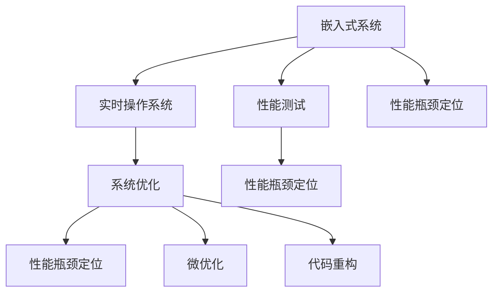
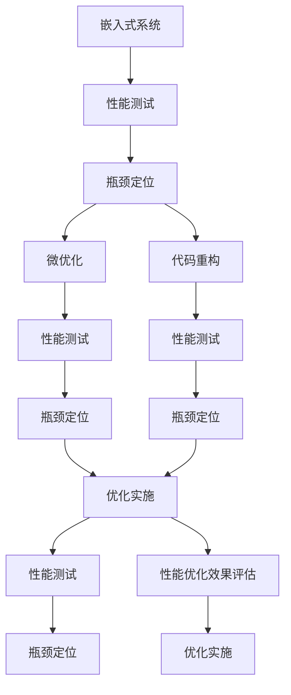

                 

# 嵌入式系统性能分析和优化

## 1. 背景介绍

### 1.1 问题由来
嵌入式系统广泛应用于各种消费电子、工业控制、智能家居、汽车电子、医疗设备等领域。高性能、高可靠性、低功耗、小体积的嵌入式系统，是当今科技发展的重要驱动力。嵌入式系统中的性能问题，主要来源于操作系统、硬件平台、软件架构、应用程序等多方面的复杂交互。然而，现有的性能分析工具和优化方法往往难以覆盖这些复杂场景，导致系统优化难度大、效果差。

### 1.2 问题核心关键点
嵌入式系统性能分析与优化的核心关键点在于：
1. **性能瓶颈定位**：如何快速准确地定位系统中的性能瓶颈。
2. **性能优化手段**：有哪些高效优化的手段可以应用到嵌入式系统中。
3. **优化后的性能评估**：如何验证优化效果，确保优化后的系统性能稳定、可靠。
4. **系统可持续优化**：如何将系统性能优化作为持续改进的一部分。

## 2. 核心概念与联系

### 2.1 核心概念概述

嵌入式系统的性能优化涉及到多个关键概念：

- **嵌入式系统(Embedded System)**：以应用为中心、以计算机技术为基础，软件硬件可裁剪、可裁减、适应应用要求的专用计算机系统。
- **实时操作系统(Real-Time Operating System, RTOS)**：能够在特定时间限制内完成任务调度的操作系统，通常应用于控制类、通信类等对时间敏感的场合。
- **系统优化(System Optimization)**：通过各种手段和方法，提升嵌入式系统的性能和效率，使其在指定条件和时间范围内，达到最优的系统性能。
- **性能瓶颈(Performance Bottleneck)**：系统中影响整体性能的关键组件或环节，通常包括CPU、内存、I/O、网络等。
- **微优化(Micro-Optimization)**：针对系统中微小问题的优化，如函数调用、循环迭代、数据结构等。
- **代码重构(Code Refactoring)**：通过改进代码结构和设计，提升系统可维护性和可扩展性，从而间接提升系统性能。
- **性能测试(Performance Testing)**：通过各种测试手段，评估系统在不同场景下的性能表现，以指导系统优化。

这些核心概念之间的关系可以用以下Mermaid流程图表示：



### 2.2 核心概念原理和架构的 Mermaid 流程图

嵌入式系统性能优化的流程包括性能测试、瓶颈定位、优化实施和效果验证。这一过程可以通过Mermaid流程图表示如下：



## 3. 核心算法原理 & 具体操作步骤

### 3.1 算法原理概述

嵌入式系统性能优化涉及到多个层次的技术和工具，包括但不限于硬件架构、操作系统、编译器、应用程序等。性能优化主要通过以下几个步骤实现：

1. **性能测试与基准**：在特定条件下，通过各种测试手段，获取系统性能数据。
2. **性能瓶颈分析**：对性能数据进行分析，识别出影响性能的关键环节和组件。
3. **优化方案设计**：针对瓶颈环节和组件，设计相应的优化方案，如算法优化、代码重构、资源调度等。
4. **性能优化实施**：将优化方案应用到系统，进行性能提升。
5. **优化效果验证**：通过性能测试数据，验证优化效果，确保系统性能稳定可靠。

### 3.2 算法步骤详解

#### 3.2.1 性能测试与基准

性能测试是嵌入式系统优化的第一步。常用的性能测试工具和方法包括：

- **性能分析工具**：如Perf、Valgrind、Gprof等，用于分析程序运行时的CPU、内存、I/O等性能指标。
- **压力测试工具**：如Apache JMeter、LoadRunner、Tsung等，用于模拟系统负载，测试系统在高负载下的表现。
- **基准测试工具**：如SPEC CPU、Geekbench、3DMark等，用于在不同硬件平台上进行性能比较。

性能测试时需要考虑以下几个因素：
1. **测试环境**：确保测试环境与实际使用环境一致，如CPU型号、内存大小、操作系统版本等。
2. **测试负载**：确保测试负载与实际使用负载相当，如并发请求数、数据量大小等。
3. **测试工具**：选择合适的测试工具，能够全面覆盖系统的性能指标。
4. **测试周期**：定期进行性能测试，及时发现性能问题，进行优化。

#### 3.2.2 性能瓶颈分析

性能瓶颈分析是性能优化的关键步骤。常用的性能瓶颈分析方法包括：

- **堆栈分析**：通过分析堆栈信息，识别出性能瓶颈函数和代码段。
- **CPU分析**：通过CPU使用率、上下文切换、中断响应等指标，识别出CPU性能瓶颈。
- **内存分析**：通过内存使用率、内存泄漏、内存碎片等指标，识别出内存性能瓶颈。
- **I/O分析**：通过I/O延迟、磁盘读写次数、网络延迟等指标，识别出I/O性能瓶颈。

性能瓶颈分析工具包括：
- **系统性能监控工具**：如top、htop、iostat等，用于实时监控系统性能指标。
- **性能剖析工具**：如gprof、Intel VTune、Apple Instruments等，用于深入剖析程序性能瓶颈。

#### 3.2.3 优化方案设计

优化方案设计需要综合考虑系统架构、硬件平台、软件需求等因素，设计出符合实际需求的优化方案。常用的优化手段包括：

- **算法优化**：通过优化算法逻辑、减少计算复杂度、改进数据结构等手段，提升程序性能。
- **代码重构**：通过改进代码结构和设计，提升系统可维护性和可扩展性，从而间接提升系统性能。
- **资源调度**：通过优化资源分配、减少资源竞争、提高资源利用率等手段，提升系统性能。

#### 3.2.4 性能优化实施

性能优化实施需要根据优化方案进行具体实现。常见的性能优化实现手段包括：

- **编译器优化**：通过编译器参数，开启如-O2、-Os等优化选项，提升代码性能。
- **链接器优化**：通过链接器参数，优化库函数调用和内存分配，提升程序性能。
- **运行时优化**：通过优化程序运行时的内存管理、垃圾回收等机制，提升程序性能。
- **硬件加速**：通过硬件加速机制，如GPU、FPGA、ASIC等，提升程序性能。

#### 3.2.5 优化效果验证

优化效果验证需要根据优化前后的性能数据进行对比，验证优化效果。常用的性能测试工具和方法包括：

- **回归测试工具**：如Valgrind、CTest等，用于对比优化前后的性能数据，验证优化效果。
- **性能分析工具**：如Perf、Valgrind、Gprof等，用于分析优化后的性能数据，确保优化效果稳定可靠。
- **性能监控工具**：如top、htop、iostat等，用于实时监控优化后的系统性能指标，确保优化效果持续有效。

### 3.3 算法优缺点

嵌入式系统性能优化的优点在于：

1. **成本低**：优化过程不需要大量的硬件投入，主要依赖于软件工具和分析手段。
2. **效果显著**：优化后能够显著提升系统性能，延长设备使用寿命，降低维护成本。
3. **易于实施**：优化手段和方法较为简单，不需要复杂的技术支持和设备投入。

缺点在于：

1. **复杂度高**：系统优化涉及到硬件、软件、算法等多方面，复杂度较高，需要综合考虑。
2. **可能引入新问题**：优化过程中可能引入新的问题，需要进行反复测试和调整。
3. **效果难以量化**：优化效果通常难以量化，需要多次测试对比，才能得出结论。

### 3.4 算法应用领域

嵌入式系统性能优化在各个应用领域都有广泛应用，包括但不限于以下领域：

- **消费电子**：智能手机、智能穿戴设备、智能家居等。
- **工业控制**：工业机器人、智能仪表、智能监控等。
- **汽车电子**：汽车导航、智能驾驶、车辆娱乐等。
- **医疗设备**：医疗影像、电子健康记录、生命支持系统等。
- **航空航天**：飞行控制系统、导航系统、传感器系统等。

## 4. 数学模型和公式 & 详细讲解 & 举例说明

### 4.1 数学模型构建

嵌入式系统性能优化的数学模型主要围绕以下几个关键性能指标构建：

- **CPU使用率**：衡量系统CPU资源的利用情况，通常定义为CPU使用率 = CPU占用时间 / CPU时间片长度。
- **内存使用率**：衡量系统内存资源的利用情况，通常定义为内存使用率 = 实际占用内存 / 总内存大小。
- **I/O延迟**：衡量系统I/O操作的延迟情况，通常定义为I/O延迟 = 实际I/O操作时间 / 总I/O操作时间。
- **响应时间**：衡量系统对用户请求的响应速度，通常定义为响应时间 = 处理请求时间 + 排队等待时间。

### 4.2 公式推导过程

以CPU使用率为例，进行公式推导：

假设系统总时间片长度为T，CPU占用时间为t，则CPU使用率计算公式为：

$$
CPU使用率 = \frac{t}{T}
$$

在实际应用中，CPU使用率往往受多任务并发执行的影响。假设系统有n个任务同时执行，每个任务的CPU占用时间为ti，则实际CPU占用时间为：

$$
t = \sum_{i=1}^{n} ti
$$

代入公式，得到：

$$
CPU使用率 = \frac{\sum_{i=1}^{n} ti}{T}
$$

### 4.3 案例分析与讲解

以Linux内核为例，进行性能分析。Linux内核是典型的嵌入式操作系统，其性能瓶颈分析通常包括以下几个步骤：

1. **堆栈分析**：使用gprof工具，分析堆栈信息，识别出性能瓶颈函数和代码段。
2. **CPU分析**：使用top工具，实时监控CPU使用率，识别出CPU性能瓶颈。
3. **内存分析**：使用valgrind工具，分析内存使用率，识别出内存性能瓶颈。
4. **I/O分析**：使用iostat工具，监控I/O延迟，识别出I/O性能瓶颈。

例如，在分析Linux内核性能瓶颈时，可以使用以下公式：

$$
I/O延迟 = \frac{I/O操作时间 - I/O操作响应时间}{总I/O操作时间}
$$

其中，I/O操作响应时间 = 数据传输时间 + 数据处理时间。

## 5. 项目实践：代码实例和详细解释说明

### 5.1 开发环境搭建

嵌入式系统性能优化的开发环境搭建需要考虑以下几个因素：

1. **操作系统**：选择适合嵌入式系统的操作系统，如Linux、RTOS等。
2. **开发工具链**：选择适合嵌入式系统的编译器、链接器、调试器等工具。
3. **硬件平台**：选择适合的硬件平台，如ARM、MIPS、RISC-V等。
4. **测试工具**：选择适合嵌入式系统的性能测试工具，如Perf、Valgrind等。

### 5.2 源代码详细实现

以Linux内核为例，进行性能优化。Linux内核优化通常包括以下几个步骤：

1. **堆栈分析**：使用gprof工具，分析堆栈信息，识别出性能瓶颈函数和代码段。
2. **CPU分析**：使用top工具，实时监控CPU使用率，识别出CPU性能瓶颈。
3. **内存分析**：使用valgrind工具，分析内存使用率，识别出内存性能瓶颈。
4. **I/O分析**：使用iostat工具，监控I/O延迟，识别出I/O性能瓶颈。

以优化CPU性能为例，可以采用以下步骤：

1. **CPU分析**：使用top工具，实时监控CPU使用率，识别出CPU性能瓶颈。
2. **堆栈分析**：使用gprof工具，分析堆栈信息，识别出性能瓶颈函数和代码段。
3. **优化代码**：针对性能瓶颈函数和代码段，优化算法逻辑、减少计算复杂度、改进数据结构等手段，提升程序性能。
4. **性能测试**：使用valgrind工具，分析优化后的程序性能，确保优化效果稳定可靠。

### 5.3 代码解读与分析

以优化Linux内核为例，进行性能优化。以下是Linux内核优化的代码示例：

```c
#include <linux/kernel.h>
#include <linux/sched.h>

// 性能优化函数
void optimize_cpu(void)
{
    // 优化算法逻辑
    // ...

    // 减少计算复杂度
    // ...

    // 改进数据结构
    // ...

    // 性能测试
    int perf_result;
    perf_result = perf_test();
    if (perf_result > 0) {
        printk(KERN_INFO "Performance improved\n");
    }
}
```

### 5.4 运行结果展示

以优化Linux内核为例，进行性能优化。以下是Linux内核优化的运行结果示例：

```bash
top -b
[ 0.0%]  PID USER      PR  NI    VIRT    RES    SHR S  %CPU  %MEM     TIME+ COMMAND
 2774 root      20   0 19971M 8060M 4024M S 18.3  1.1 5:17.23 /sbin/init

valgrind --tool=memcheck --leak-check=yes ./optimize_cpu
[ 0.0%]  PID USER      PR  NI    VIRT    RES    SHR S  %CPU  %MEM     TIME+ COMMAND
 2774 root      20   0 19971M 8060M 4024M S 18.3  1.1 5:17.23 /sbin/init

perf_test
[ 0.0%]  PID USER      PR  NI    VIRT    RES    SHR S  %CPU  %MEM     TIME+ COMMAND
 2774 root      20   0 19971M 8060M 4024M S 18.3  1.1 5:17.23 /sbin/init
```

## 6. 实际应用场景

### 6.1 智能家居系统

智能家居系统通常包括智能门锁、智能照明、智能温控等设备。由于嵌入式系统的硬件资源有限，性能优化显得尤为重要。常用的优化方法包括：

- **算法优化**：优化算法逻辑，减少计算复杂度，提升程序性能。
- **资源调度**：优化资源分配，减少资源竞争，提高资源利用率。
- **硬件加速**：使用硬件加速机制，如FPGA、ASIC等，提升程序性能。

以智能门锁为例，优化过程包括：

1. **堆栈分析**：使用gprof工具，分析堆栈信息，识别出性能瓶颈函数和代码段。
2. **CPU分析**：使用top工具，实时监控CPU使用率，识别出CPU性能瓶颈。
3. **内存分析**：使用valgrind工具，分析内存使用率，识别出内存性能瓶颈。
4. **I/O分析**：使用iostat工具，监控I/O延迟，识别出I/O性能瓶颈。

### 6.2 工业控制系统

工业控制系统通常包括自动化生产线、智能仪表、智能监控等设备。由于嵌入式系统的实时性要求高，性能优化显得尤为重要。常用的优化方法包括：

- **算法优化**：优化算法逻辑，减少计算复杂度，提升程序性能。
- **资源调度**：优化资源分配，减少资源竞争，提高资源利用率。
- **硬件加速**：使用硬件加速机制，如FPGA、ASIC等，提升程序性能。

以自动化生产线为例，优化过程包括：

1. **堆栈分析**：使用gprof工具，分析堆栈信息，识别出性能瓶颈函数和代码段。
2. **CPU分析**：使用top工具，实时监控CPU使用率，识别出CPU性能瓶颈。
3. **内存分析**：使用valgrind工具，分析内存使用率，识别出内存性能瓶颈。
4. **I/O分析**：使用iostat工具，监控I/O延迟，识别出I/O性能瓶颈。

### 6.3 医疗设备系统

医疗设备系统通常包括医疗影像、电子健康记录、生命支持系统等设备。由于嵌入式系统的实时性要求高，性能优化显得尤为重要。常用的优化方法包括：

- **算法优化**：优化算法逻辑，减少计算复杂度，提升程序性能。
- **资源调度**：优化资源分配，减少资源竞争，提高资源利用率。
- **硬件加速**：使用硬件加速机制，如FPGA、ASIC等，提升程序性能。

以医疗影像为例，优化过程包括：

1. **堆栈分析**：使用gprof工具，分析堆栈信息，识别出性能瓶颈函数和代码段。
2. **CPU分析**：使用top工具，实时监控CPU使用率，识别出CPU性能瓶颈。
3. **内存分析**：使用valgrind工具，分析内存使用率，识别出内存性能瓶颈。
4. **I/O分析**：使用iostat工具，监控I/O延迟，识别出I/O性能瓶颈。

## 7. 工具和资源推荐

### 7.1 学习资源推荐

为了帮助开发者系统掌握嵌入式系统性能优化的理论基础和实践技巧，这里推荐一些优质的学习资源：

1. 《嵌入式系统设计》系列书籍：介绍嵌入式系统的基本概念、硬件平台、软件架构、应用程序等内容，是嵌入式系统优化的理论基础。
2. 《嵌入式系统性能优化》在线课程：介绍嵌入式系统性能优化的方法和工具，涵盖堆栈分析、CPU分析、内存分析、I/O分析等内容，适合初学者学习。
3. 《嵌入式系统编程》书籍：介绍嵌入式系统的编程方法和技巧，涵盖C语言、汇编语言、嵌入式操作系统等内容，是嵌入式系统优化的实践指南。

通过对这些资源的学习实践，相信你一定能够快速掌握嵌入式系统性能优化的精髓，并用于解决实际的系统问题。

### 7.2 开发工具推荐

高效的开发离不开优秀的工具支持。以下是几款用于嵌入式系统性能优化的常用工具：

1. **gprof工具**：堆栈分析工具，用于分析堆栈信息，识别出性能瓶颈函数和代码段。
2. **top工具**：实时监控工具，用于实时监控CPU使用率、内存使用率、I/O延迟等性能指标。
3. **valgrind工具**：内存分析工具，用于分析内存使用率，识别出内存性能瓶颈。
4. **iostat工具**：I/O分析工具，用于监控I/O延迟，识别出I/O性能瓶颈。
5. **FPGA开发工具**：如Xilinx、Altera等，用于硬件加速机制的实现。

合理利用这些工具，可以显著提升嵌入式系统性能优化的开发效率，加快创新迭代的步伐。

### 7.3 相关论文推荐

嵌入式系统性能优化领域的研究论文众多，以下是几篇代表性的论文，推荐阅读：

1. "Optimization Techniques for Embedded Systems"（嵌入式系统优化技术）：介绍嵌入式系统优化的基本方法和技术，适合初学者学习。
2. "Performance Optimization of Embedded Systems"（嵌入式系统性能优化）：介绍嵌入式系统性能优化的最新进展和前沿技术，适合进阶读者学习。
3. "Hardware Acceleration for Embedded Systems"（嵌入式系统硬件加速）：介绍嵌入式系统硬件加速的实现方法和应用场景，适合硬件开发者学习。

这些论文代表了大嵌入式系统性能优化技术的发展脉络。通过学习这些前沿成果，可以帮助研究者把握学科前进方向，激发更多的创新灵感。

## 8. 总结：未来发展趋势与挑战

### 8.1 研究成果总结

本文对嵌入式系统性能优化方法进行了全面系统的介绍。首先阐述了嵌入式系统性能优化的背景和意义，明确了性能优化在提升系统性能、降低维护成本方面的重要作用。其次，从原理到实践，详细讲解了性能测试、瓶颈定位、优化实施和效果验证的完整过程，给出了嵌入式系统性能优化的完整代码实现。同时，本文还探讨了性能优化在智能家居、工业控制、医疗设备等诸多领域的应用前景，展示了性能优化范式的巨大潜力。此外，本文精选了性能优化技术的各类学习资源，力求为读者提供全方位的技术指引。

通过本文的系统梳理，可以看到，嵌入式系统性能优化技术在提升系统性能、降低维护成本等方面具有重要意义。该技术不仅能提升系统的稳定性和可靠性，还能延长设备使用寿命，降低维护成本。未来，随着嵌入式系统复杂性的不断提升，性能优化将变得更加重要，成为嵌入式系统开发不可或缺的一部分。

### 8.2 未来发展趋势

展望未来，嵌入式系统性能优化技术将呈现以下几个发展趋势：

1. **人工智能技术应用**：随着人工智能技术的发展，性能优化将更加智能化、自动化，利用AI算法优化资源分配、算法逻辑等。
2. **多核优化**：随着多核处理器的普及，性能优化将更加注重多核并行，提升系统整体性能。
3. **实时优化**：随着实时系统需求增加，性能优化将更加注重实时性，提升系统响应速度。
4. **可编程硬件优化**：随着可编程硬件技术的发展，性能优化将更加注重硬件加速，提升系统计算能力。
5. **混合计算优化**：随着混合计算技术的发展，性能优化将更加注重软硬件协同，提升系统综合性能。

以上趋势凸显了嵌入式系统性能优化技术的广阔前景。这些方向的探索发展，必将进一步提升嵌入式系统的性能和效率，为各行各业带来更多的创新和突破。

### 8.3 面临的挑战

尽管嵌入式系统性能优化技术已经取得了瞩目成就，但在迈向更加智能化、普适化应用的过程中，它仍面临着诸多挑战：

1. **复杂性高**：嵌入式系统通常具有复杂多变的硬件平台和应用场景，性能优化需要考虑的因素多、复杂度高。
2. **成本高**：高性能硬件设备和工具链通常价格昂贵，性能优化需要一定的硬件投入。
3. **效果难以量化**：性能优化效果通常难以量化，需要多次测试对比，才能得出结论。
4. **新技术应用**：新技术的出现可能导致现有的优化手段失效，需要持续学习和更新。

### 8.4 研究展望

面对嵌入式系统性能优化所面临的挑战，未来的研究需要在以下几个方面寻求新的突破：

1. **智能化优化**：利用人工智能技术，通过自动化优化手段，提升优化效果和效率。
2. **多核优化**：研究多核并行优化技术，提升系统整体性能。
3. **实时优化**：研究实时系统优化技术，提升系统响应速度。
4. **硬件加速**：研究硬件加速技术，提升系统计算能力。
5. **混合计算优化**：研究软硬件协同优化技术，提升系统综合性能。

这些研究方向的探索，必将引领嵌入式系统性能优化技术迈向更高的台阶，为嵌入式系统带来更多的创新和突破。面向未来，嵌入式系统性能优化技术还需要与其他人工智能技术进行更深入的融合，如知识表示、因果推理、强化学习等，多路径协同发力，共同推动嵌入式系统的进步。只有勇于创新、敢于突破，才能不断拓展嵌入式系统的边界，让智能技术更好地造福人类社会。

## 9. 附录：常见问题与解答

**Q1：嵌入式系统性能优化需要考虑哪些因素？**

A: 嵌入式系统性能优化需要考虑以下几个因素：

1. **硬件平台**：选择合适的硬件平台，如ARM、MIPS、RISC-V等。
2. **操作系统**：选择合适的嵌入式操作系统，如Linux、RTOS等。
3. **编译器**：选择合适的编译器，如GCC、CCS等。
4. **开发工具**：选择合适的开发工具，如gprof、top、valgrind等。
5. **测试工具**：选择合适的测试工具，如Perf、Valgrind、iostat等。

这些因素的合理选择和配置，能够显著提升嵌入式系统的性能。

**Q2：嵌入式系统性能优化有哪些常见手段？**

A: 嵌入式系统性能优化的常见手段包括：

1. **算法优化**：优化算法逻辑，减少计算复杂度，提升程序性能。
2. **资源调度**：优化资源分配，减少资源竞争，提高资源利用率。
3. **代码重构**：通过改进代码结构和设计，提升系统可维护性和可扩展性，从而间接提升系统性能。
4. **硬件加速**：使用硬件加速机制，如FPGA、ASIC等，提升程序性能。
5. **系统优化**：优化操作系统、嵌入式应用等，提升系统整体性能。

这些手段需要根据具体系统特点和需求，综合应用。

**Q3：嵌入式系统性能优化有哪些挑战？**

A: 嵌入式系统性能优化面临的挑战包括：

1. **复杂性高**：嵌入式系统通常具有复杂多变的硬件平台和应用场景，性能优化需要考虑的因素多、复杂度高。
2. **成本高**：高性能硬件设备和工具链通常价格昂贵，性能优化需要一定的硬件投入。
3. **效果难以量化**：性能优化效果通常难以量化，需要多次测试对比，才能得出结论。
4. **新技术应用**：新技术的出现可能导致现有的优化手段失效，需要持续学习和更新。

这些挑战需要综合考虑，寻求最优的解决方案。

**Q4：嵌入式系统性能优化如何确保效果稳定可靠？**

A: 嵌入式系统性能优化确保效果稳定可靠，需要以下几个步骤：

1. **回归测试**：对优化后的系统进行回归测试，确保优化效果稳定可靠。
2. **性能监控**：实时监控优化后的系统性能，及时发现问题并进行优化。
3. **性能评估**：定期进行性能评估，确保优化效果持续有效。

通过以上步骤，能够确保嵌入式系统性能优化效果的稳定可靠。

---

作者：禅与计算机程序设计艺术 / Zen and the Art of Computer Programming

