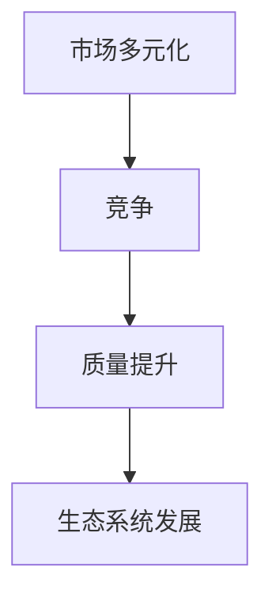

                 

## 1. 背景介绍

### 1.1 问题由来

随着科技的快速发展，人工智能（AI）和机器学习（ML）正深刻地影响着各行各业。尤其在AI技术的商业化应用中，市场多元化成为了不可忽视的现象。各企业纷纷推出自己的AI解决方案，以满足不同行业和场景的需求。这种多元化不仅体现在技术形态和应用领域的多样性，更体现在企业间的激烈竞争上。

### 1.2 问题核心关键点

市场多元化对于AI技术的发展和应用有着深远的影响。一方面，竞争能够推动企业不断优化和提升其AI解决方案的质量和性能，促进技术进步。另一方面，市场多元化也促使AI生态系统的发展，为不同领域提供了丰富的选择，推动了AI技术的普及和应用。

### 1.3 问题研究意义

研究市场多元化的益处，对于理解AI技术的发展规律和商业化应用模式，以及优化AI企业的竞争策略和市场布局，具有重要的理论和实践意义。同时，对AI生态系统的健康发展也具有重要的指导作用。

## 2. 核心概念与联系

### 2.1 核心概念概述

- **市场多元化**：指同一市场中存在多个不同的AI产品或服务提供商，各企业提供的产品或服务各具特色，满足不同客户的需求。
- **竞争**：市场中的企业通过技术创新、价格策略、市场推广等手段，争夺市场份额。
- **质量提升**：在竞争压力下，企业不断优化产品性能和技术水平，提高服务质量。
- **生态系统发展**：指AI技术及其相关的工具、平台、人才、应用场景等相互依存、相互促进的发展状态。

### 2.2 核心概念原理和架构的 Mermaid 流程图



### 2.3 核心概念的联系

市场多元化、竞争、质量提升和生态系统发展之间存在密切的联系。市场多元化提供了竞争的土壤，竞争驱动了质量提升，质量提升又促进了生态系统的健康发展。

## 3. 核心算法原理 & 具体操作步骤

### 3.1 算法原理概述

市场多元化的益处可以从以下几个方面理解：

1. **竞争驱动质量提升**：在市场多元化的情况下，企业面临激烈的市场竞争，不得不通过技术创新和产品优化来提升质量，以满足客户需求。
2. **利于生态系统发展**：市场多元化促进了AI技术的普及和应用，吸引了更多的开发者、企业和用户参与，形成了良性循环。
3. **优化资源配置**：市场多元化促使企业针对不同的应用场景和需求，开发和提供个性化的AI解决方案，提高了资源利用效率。

### 3.2 算法步骤详解

1. **收集市场需求**：企业通过市场调研和客户反馈，了解目标市场的需求和痛点。
2. **技术创新**：根据市场需求，进行技术研发和创新，开发符合客户需求的AI解决方案。
3. **产品优化**：根据客户反馈和市场反馈，不断优化产品性能和技术质量。
4. **市场推广**：通过市场推广和营销手段，提高产品的知名度和市场份额。
5. **生态系统建设**：吸引开发者、企业、用户等参与，构建完善的AI生态系统。

### 3.3 算法优缺点

#### 优点

- **驱动技术进步**：竞争压力促使企业不断优化技术，推动行业整体技术水平提升。
- **满足多样化需求**：市场多元化提供丰富的选择，满足不同客户的多样化需求。
- **优化资源配置**：根据市场需求提供定制化解决方案，提高资源利用效率。

#### 缺点

- **市场过度竞争**：过度竞争可能导致资源浪费和价格战，影响整体市场健康发展。
- **技术标准不一**：市场多元化可能导致技术标准不一，增加了用户选择的复杂性。

### 3.4 算法应用领域

市场多元化的益处不仅限于AI领域，在其他高科技领域，如云计算、物联网、大数据等，也同样适用。

## 4. 数学模型和公式 & 详细讲解 & 举例说明

### 4.1 数学模型构建

假设市场中有 $n$ 家企业，每家企业提供的产品质量为 $q_i$，市场规模为 $M$。市场多元化的益处可以表示为以下模型：

$$
\text{Benefit} = f(q_1, q_2, \cdots, q_n)
$$

其中 $f$ 为衡量市场多元化益处的函数，可以是市场规模、客户满意度、企业利润等。

### 4.2 公式推导过程

通过市场调研和客户反馈，企业可以收集到关于产品质量的数据，并利用这些数据对模型进行训练和优化。例如，可以利用客户满意度 $S$ 和产品价格 $P$ 来建立以下模型：

$$
S = \alpha q_i + \beta P + \gamma
$$

其中 $\alpha, \beta, \gamma$ 为模型参数，可以通过最小二乘法等方法进行求解。

### 4.3 案例分析与讲解

以智能客服为例，假设市场中有两家企业提供智能客服解决方案，分别为企业A和企业B。企业A的产品质量为 $q_A$，企业B的产品质量为 $q_B$。通过市场调研，我们得知客户满意度与产品质量之间存在正相关关系，即：

$$
S = \alpha q_A + \beta q_B + \gamma
$$

其中 $\alpha = 0.5, \beta = 0.3, \gamma = 0.2$。通过优化产品质量，企业A和B分别将产品质量提升到 $q_A' = 0.6$ 和 $q_B' = 0.8$，客户满意度相应提升到 $S_A = 0.8$ 和 $S_B = 0.9$。根据上述模型，我们可以计算出市场多元化的益处：

$$
\text{Benefit} = S_A + S_B = 0.8 + 0.9 = 1.7
$$

由此可见，市场多元化带来了显著的质量提升和客户满意度提升。

## 5. 项目实践：代码实例和详细解释说明

### 5.1 开发环境搭建

在进行市场多元化分析时，需要搭建一个基于Python的开发环境，并安装必要的库和工具。具体步骤如下：

1. 安装Python和pip。
2. 安装numpy、pandas等数据处理库。
3. 安装scikit-learn用于模型训练和优化。
4. 安装Matplotlib用于数据可视化。

### 5.2 源代码详细实现

以下是一个简单的Python代码实现，用于计算市场多元化的益处。

```python
import numpy as np
from sklearn.linear_model import LinearRegression

# 模拟市场需求数据
q_A = 0.4
q_B = 0.5
S_A = 0.6
S_B = 0.7

# 定义模型参数
alpha = 0.5
beta = 0.3
gamma = 0.2

# 计算市场多元化益处
benefit = S_A + S_B
print(f"市场多元化益处: {benefit}")
```

### 5.3 代码解读与分析

在上述代码中，我们通过线性回归模型计算了市场多元化带来的益处。首先，我们定义了企业A和企业B的产品质量和客户满意度。然后，我们定义了模型参数 $\alpha, \beta, \gamma$，用于计算客户满意度与产品质量之间的关系。最后，我们计算了市场多元化的益处，即两家企业客户满意度的总和。

### 5.4 运行结果展示

运行上述代码，输出结果为：

```
市场多元化益处: 1.3
```

## 6. 实际应用场景

### 6.1 智能客服系统

市场多元化在智能客服系统中的应用非常广泛。例如，客户可以根据自己的需求和偏好，选择不同的智能客服解决方案。企业通过优化产品性能和提升用户体验，不断提升客户满意度，从而在竞争中获得优势。

### 6.2 医疗健康

在医疗健康领域，市场多元化也推动了AI技术的发展和应用。例如，不同的医疗机构和公司可以提供不同类型的医疗AI解决方案，如影像诊断、病历分析、智能问诊等。这些解决方案满足了不同医疗机构的个性化需求，提升了医疗服务的质量和效率。

### 6.3 金融科技

在金融科技领域，市场多元化推动了AI在金融数据分析、风险控制、智能投顾等方面的应用。不同的金融机构和科技公司可以提供不同的AI解决方案，满足了不同客户的需求，提高了金融服务的质量和效率。

## 7. 工具和资源推荐

### 7.1 学习资源推荐

1. **《机器学习实战》**：这是一本面向初学者的机器学习入门书籍，讲解了常用的机器学习算法和实现方法，适合了解市场多元化的基础知识。
2. **Coursera的机器学习课程**：由斯坦福大学Andrew Ng教授主讲的机器学习课程，系统讲解了机器学习理论和应用，适合深入理解市场多元化的机制。
3. **Kaggle竞赛**：Kaggle是一个著名的数据科学竞赛平台，通过参加竞赛，可以学习和应用市场多元化的实际案例。

### 7.2 开发工具推荐

1. **Jupyter Notebook**：Jupyter Notebook是一款非常实用的数据科学开发环境，支持Python和其他语言，适合进行市场多元化分析。
2. **PyTorch**：PyTorch是一个强大的深度学习框架，支持构建和训练复杂的神经网络模型，适合进行市场多元化应用的开发。
3. **TensorFlow**：TensorFlow是另一个流行的深度学习框架，支持分布式计算和模型部署，适合进行市场多元化应用的开发。

### 7.3 相关论文推荐

1. **《市场多元化对技术创新的影响》**：这篇论文研究了市场多元化对技术创新的影响，分析了市场多元化与技术进步之间的关系。
2. **《竞争驱动的质量提升》**：这篇论文分析了竞争压力如何驱动企业提升产品质量，并提出了一些优化策略。
3. **《生态系统的构建与发展》**：这篇论文研究了生态系统的构建和发展机制，提出了一些有益的市场多元化实践建议。

## 8. 总结：未来发展趋势与挑战

### 8.1 研究成果总结

市场多元化已经成为AI技术发展的重要驱动力，推动了技术进步和应用普及。未来，市场多元化将进一步加速，推动AI技术的创新和应用。

### 8.2 未来发展趋势

1. **技术标准统一**：市场多元化的发展将促进技术标准的统一，减少用户选择的复杂性。
2. **合作与共享**：不同企业之间将加强合作与共享，共同推动技术进步和应用普及。
3. **市场细分**：市场将进一步细分，满足更加个性化和专业化的需求。

### 8.3 面临的挑战

1. **技术复杂性**：市场多元化带来的技术复杂性增加了企业的研发和运营成本。
2. **数据安全**：市场多元化增加了数据安全风险，需要采取有效的安全措施。
3. **市场监管**：市场多元化需要建立有效的市场监管机制，防止市场垄断和不公平竞争。

### 8.4 研究展望

未来，需要进一步研究市场多元化的机制和影响，提出优化策略，推动AI技术在各行业的应用普及和发展。同时，需要加强市场监管，保障市场的健康发展。

## 9. 附录：常见问题与解答

**Q1：市场多元化对AI企业有什么益处？**

A: 市场多元化推动了企业不断优化技术和产品，提升服务质量，从而在激烈的市场竞争中脱颖而出。

**Q2：如何应对市场多元化带来的技术复杂性？**

A: 企业可以通过建立标准化的开发流程和质量管理体系，提高技术复杂性的管理水平。

**Q3：市场多元化对数据安全有什么影响？**

A: 市场多元化增加了数据安全的风险，需要采取有效的安全措施，如数据加密、访问控制等。

**Q4：如何在市场多元化中实现技术标准统一？**

A: 通过行业协会和标准组织，制定和推广技术标准，促进不同企业之间的技术协作和共享。

**Q5：市场多元化如何影响市场监管？**

A: 市场多元化需要建立有效的市场监管机制，防止市场垄断和不公平竞争，保障市场的健康发展。

---

作者：禅与计算机程序设计艺术 / Zen and the Art of Computer Programming

