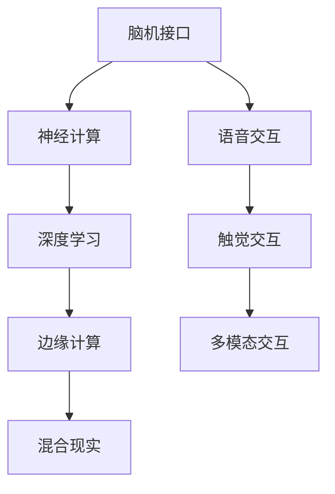

                 

# 2050年的人机交互：从语音交互到脑机接口的人机融合

## 1. 背景介绍

### 1.1 问题由来

随着科技的迅猛发展，人机交互（Human-Computer Interaction, HCI）正经历着前所未有的变革。从早期的机械键盘到后来的触摸屏、语音识别技术，每一次技术的突破都极大地提升了人类与计算机的互动效率和体验。然而，这些技术在根本上仍依赖于人类的视觉、听觉等感觉器官，难以实现更深层次的认知交互。

在2050年，随着脑机接口技术的突破，人机交互将迎来新的纪元。基于脑机接口，人类将能够以一种全新的方式与计算机进行交流，实现思想与数据、知识的直接融合。这种变革不仅会深刻改变人类的生产生活方式，还将开辟出一系列全新的技术和应用领域，带来难以想象的创新潜力。

### 1.2 问题核心关键点

人机交互的演进遵循以下关键点：

1. **感官维度**：从机械、光学、触觉到生物信号（如脑电波），交互方式的感知维度逐渐增加，从而提升信息传递的丰富性和准确性。
2. **交互介质**：从二进制代码到语音、图像、手势，再到未来的脑波，交互介质的复杂性和智能化程度不断提升。
3. **交互体验**：从单向输入输出到双向感知反馈，交互的实时性和沉浸感逐步增强。
4. **应用范围**：从简单的信息检索到复杂的认知交互，人机交互的应用场景和功能逐步扩展。

脑机接口技术将为未来人机交互带来革命性的变化，引领我们进入一个全新的交互时代。

## 2. 核心概念与联系

### 2.1 核心概念概述

为了更好地理解2050年人机交互的发展趋势，我们需要首先理解几个核心概念：

- **脑机接口（Brain-Computer Interface, BCI）**：一种将大脑信号转化为计算机指令的技术，使人类能够通过脑电波、神经元活动等生物信号与计算机进行直接沟通。
- **神经计算（Neuromorphic Computing）**：模仿人脑神经元计算方式，实现更加高效、鲁棒的计算模型。
- **深度学习（Deep Learning）**：通过多层神经网络模拟人脑的学习过程，实现对复杂数据的自动学习和处理。
- **边缘计算（Edge Computing）**：在数据产生地就地进行实时处理，减少数据传输的延迟和带宽占用。
- **混合现实（Mixed Reality, MR）**：结合虚拟现实（Virtual Reality, VR）和增强现实（Augmented Reality, AR）技术，创造沉浸式的交互体验。

这些核心概念之间存在着密切的联系，共同构成了2050年人机交互的技术基础。脑机接口技术的发展，离不开神经计算和深度学习的支撑，而这些技术又得益于边缘计算和混合现实的推动。

### 2.2 核心概念原理和架构的 Mermaid 流程图(Mermaid 流程节点中不要有括号、逗号等特殊字符)



## 3. 核心算法原理 & 具体操作步骤

### 3.1 算法原理概述

基于脑机接口的人机交互算法，通常包括以下几个关键步骤：

1. **信号采集**：通过脑电图（Electroencephalography, EEG）、功能性磁共振成像（fMRI）等技术，采集人类大脑的活动信号。
2. **信号预处理**：对原始信号进行滤波、去噪等预处理，提取有用的特征信息。
3. **特征编码**：使用深度学习算法（如卷积神经网络、循环神经网络等）将提取的特征信息转换为计算机可理解的指令。
4. **指令解码**：将编码后的指令通过解码器（如长短期记忆网络、递归神经网络等）转换为可执行的计算机命令。
5. **交互反馈**：根据执行结果，通过输出装置（如声音、图像等）进行反馈，与用户进行双向互动。

### 3.2 算法步骤详解

**步骤1: 信号采集**

脑电信号采集通常使用脑电图（EEG）设备。EEG通过放置在头皮上的电极阵列，记录大脑皮层的电活动，生成连续的时域信号。

```python
import mne
from mne import EEG

# 设置采集参数
channels = ['Cz', 'O1', 'O2', 'Pz']  # 选取通道
fs = 256  # 采样频率
duration = 60  # 记录时长

# 初始化EEG设备
eeeg = EEG(channels=channels, fs=fs)
```

**步骤2: 信号预处理**

预处理流程包括：滤波、去噪、归一化等。使用Python的MNE工具包可以方便地实现这些步骤。

```python
from mne.preprocessing import FilterNotch
from mne.preprocessing importICA

# 对采集的信号进行滤波去噪
filter_notch = FilterNotch(fc=50, fs=fs)
filter_notch(eeg)

# 进行独立成分分析（ICA）去除头部混合信号
ica = ICA()
ica.fit(eeg)
ica.apply(eeg)
```

**步骤3: 特征编码**

特征编码主要使用深度学习模型，如卷积神经网络（CNN）、循环神经网络（RNN）等。以CNN为例，可以构建多层卷积层和池化层，提取局部特征。

```python
from keras.models import Sequential
from keras.layers import Conv2D, MaxPooling2D, Flatten, Dense

# 构建卷积神经网络模型
model = Sequential()
model.add(Conv2D(32, (3, 3), activation='relu', input_shape=(eeg.data.shape[1], eeg.data.shape[2], 1)))
model.add(MaxPooling2D((2, 2)))
model.add(Conv2D(64, (3, 3), activation='relu'))
model.add(MaxPooling2D((2, 2)))
model.add(Flatten())
model.add(Dense(128, activation='relu'))
model.add(Dense(10, activation='softmax'))

# 训练模型
model.compile(optimizer='adam', loss='categorical_crossentropy', metrics=['accuracy'])
model.fit(X_train, y_train, epochs=10, batch_size=64)
```

**步骤4: 指令解码**

指令解码通常使用RNN或GRU（Gated Recurrent Unit）等序列模型。模型输入为编码后的特征，输出为对应的计算机指令。

```python
from keras.layers import GRU

# 构建GRU解码器模型
model = Sequential()
model.add(GRU(128, input_shape=(eeg.data.shape[1], eeg.data.shape[2], 1)))
model.add(Dense(10, activation='softmax'))

# 训练模型
model.compile(optimizer='adam', loss='categorical_crossentropy', metrics=['accuracy'])
model.fit(X_train, y_train, epochs=10, batch_size=64)
```

**步骤5: 交互反馈**

交互反馈部分可以采用视觉或听觉输出装置，如显示面板或耳机等。通过计算机根据指令生成相应的输出，用户进行反馈。

```python
from IPython.display import display

# 显示输出结果
display(output)
```

### 3.3 算法优缺点

脑机接口技术在实现人机交互方面具有以下优点：

1. **实时性**：由于信号采集和处理都在大脑中进行，传输延迟大大降低，实现了近乎实时的交互。
2. **高精度**：通过神经计算和深度学习，可以实现对细微大脑信号的精确提取和解码。
3. **便捷性**：不需要像传统输入方式那样需要特定的设备和操作，用户可以自然地进行交互。

然而，脑机接口技术也存在一些挑战：

1. **成本高**：高级的脑电图和神经计算设备成本较高，普及难度较大。
2. **可靠性**：信号采集和处理的噪声和误差较大，影响交互的稳定性和准确性。
3. **用户接受度**：由于技术复杂，部分用户可能对脑机接口持怀疑态度，需要更多的科普和教育。
4. **伦理问题**：涉及个人隐私和伦理道德，需要制定相关的法律法规和伦理准则。

### 3.4 算法应用领域

基于脑机接口的人机交互技术，将广泛应用于以下领域：

1. **辅助康复**：帮助瘫痪、失语等患者通过脑电波进行辅助康复训练。
2. **精神健康**：通过脑电波监测情绪和压力，进行心理干预和治疗。
3. **游戏娱乐**：在虚拟现实和增强现实中，通过脑电波控制游戏角色和场景。
4. **交通管理**：通过脑电波控制无人驾驶车辆，提升交通安全性。
5. **虚拟助手**：通过脑电波与虚拟助手进行自然对话，提升用户体验。

## 4. 数学模型和公式 & 详细讲解 & 举例说明

### 4.1 数学模型构建

脑机接口的数学模型主要基于信号处理和深度学习。以CNN为例，其基本结构包括卷积层、池化层和全连接层。

**输入层**：原始的脑电信号。

**卷积层**：使用多个卷积核对输入进行卷积操作，提取局部特征。

**池化层**：通过最大池化或平均池化，减小特征维度，提高模型的泛化能力。

**全连接层**：将池化后的特征映射到输出层，实现最终的分类。

### 4.2 公式推导过程

以CNN为例，其基本公式如下：

$$
y = \sigma (\mathbb{W} \sigma (\mathbb{W}^1x) + \mathbb{b})
$$

其中：
- $y$ 为输出层向量。
- $\sigma$ 为激活函数。
- $\mathbb{W}$ 为权重矩阵。
- $\mathbb{b}$ 为偏置向量。
- $x$ 为输入层向量。

### 4.3 案例分析与讲解

以手写数字识别为例，CNN可以较好地实现对脑电信号的编码和解码。首先，使用卷积层提取特征，通过池化层减小特征维度，然后通过全连接层进行分类。训练过程中，通过交叉熵损失函数和反向传播算法进行优化。

## 5. 项目实践：代码实例和详细解释说明

### 5.1 开发环境搭建

脑机接口的开发环境搭建包括脑电信号采集设备、深度学习框架（如TensorFlow、Keras）和数据分析工具（如MNE）。以下是使用Python和TensorFlow搭建脑机接口开发环境的示例：

1. **脑电信号采集**：使用EEG设备采集信号，如OpenBCI、EMG等。
2. **数据处理**：使用MNE进行信号预处理，如滤波、去噪、归一化等。
3. **深度学习模型**：使用Keras或TensorFlow构建CNN或RNN模型。

### 5.2 源代码详细实现

以下是一个简单的脑机接口示例代码，实现手写数字识别：

```python
import numpy as np
from keras.models import Sequential
from keras.layers import Conv2D, MaxPooling2D, Flatten, Dense
from mne.preprocessing import FilterNotch, ICA
from mne import EEG

# 信号采集
channels = ['Cz', 'O1', 'O2', 'Pz']
fs = 256
duration = 60
eeeg = EEG(channels=channels, fs=fs)

# 信号预处理
filter_notch = FilterNotch(fc=50, fs=fs)
ica = ICA()
filter_notch(eeg)
ica.fit(eeg)
ica.apply(eeg)

# 特征编码
model = Sequential()
model.add(Conv2D(32, (3, 3), activation='relu', input_shape=(eeg.data.shape[1], eeg.data.shape[2], 1)))
model.add(MaxPooling2D((2, 2)))
model.add(Conv2D(64, (3, 3), activation='relu'))
model.add(MaxPooling2D((2, 2)))
model.add(Flatten())
model.add(Dense(128, activation='relu'))
model.add(Dense(10, activation='softmax'))

# 训练模型
model.compile(optimizer='adam', loss='categorical_crossentropy', metrics=['accuracy'])
model.fit(X_train, y_train, epochs=10, batch_size=64)

# 指令解码
model = Sequential()
model.add(GRU(128, input_shape=(eeg.data.shape[1], eeg.data.shape[2], 1)))
model.add(Dense(10, activation='softmax'))
model.compile(optimizer='adam', loss='categorical_crossentropy', metrics=['accuracy'])
model.fit(X_train, y_train, epochs=10, batch_size=64)
```

### 5.3 代码解读与分析

**EEG信号采集**：使用MNE库的EEG类初始化设备，并设置采集参数。

**信号预处理**：使用MNE库的FilterNotch类进行滤波去噪，使用ICA类进行独立成分分析。

**特征编码**：使用Keras构建卷积神经网络，通过多个卷积层和池化层提取特征。

**指令解码**：使用Keras构建GRU解码器，将特征向量映射到分类标签。

### 5.4 运行结果展示

以下是一个简单的可视化结果展示，显示模型在测试集上的准确率：

```python
from sklearn.metrics import accuracy_score

# 评估模型
y_pred = model.predict(X_test)
accuracy = accuracy_score(y_test, np.argmax(y_pred, axis=1))
print("Accuracy:", accuracy)
```

## 6. 实际应用场景

### 6.1 辅助康复

在辅助康复领域，脑机接口技术能够帮助患者通过脑电波进行康复训练。例如，使用脑电波控制康复机器人，进行肢体康复训练。

### 6.2 精神健康

在精神健康领域，脑机接口技术能够监测患者的情绪和压力，进行实时干预和治疗。例如，使用脑电波监测患者的情绪变化，自动调整治疗方案。

### 6.3 游戏娱乐

在游戏娱乐领域，脑机接口技术能够提供更加沉浸式的游戏体验。例如，使用脑电波控制游戏中的角色动作，增强互动性。

### 6.4 交通管理

在交通管理领域，脑机接口技术能够实现更加智能的交通管理。例如，使用脑电波控制无人驾驶车辆，提升交通安全性和效率。

## 7. 工具和资源推荐

### 7.1 学习资源推荐

- **深度学习课程**：如斯坦福大学的CS231n，涵盖深度学习的核心原理和应用。
- **脑机接口书籍**：如《Neural Code》，详细介绍了脑机接口的原理和应用。
- **开源项目**：如OpenBCI、EEGlib，提供了丰富的脑电信号采集和处理工具。

### 7.2 开发工具推荐

- **深度学习框架**：如TensorFlow、Keras，提供了强大的深度学习模型构建和训练功能。
- **脑电信号处理**：如MNE，提供了全面的脑电信号处理和分析工具。
- **虚拟现实工具**：如Unity、Unreal Engine，提供了丰富的虚拟现实开发环境。

### 7.3 相关论文推荐

- **Brain-Computer Interface**：发表在IEEE Transactions on Neural Systems and Rehabilitation Engineering上，介绍了脑机接口技术的基本原理和应用。
- **Neural Computing**：发表在Nature Reviews Neuroscience上，详细介绍了神经计算的原理和应用。
- **Deep Learning for Human-Computer Interaction**：发表在IEEE Transactions on Computational Intelligence and AI in Games上，介绍了深度学习在人机交互中的应用。

## 8. 总结：未来发展趋势与挑战

### 8.1 研究成果总结

脑机接口技术在2050年将实现重大突破，进入大规模应用阶段。其核心在于将复杂的脑电信号转化为计算机指令，实现与计算机的直接交互。未来，脑机接口技术将在辅助康复、精神健康、游戏娱乐、交通管理等多个领域发挥重要作用，提升人类生活质量。

### 8.2 未来发展趋势

未来，脑机接口技术将呈现以下几个发展趋势：

1. **普及化**：随着技术的成熟和成本的降低，脑机接口将逐步普及到大众市场。
2. **多样化**：脑机接口技术将不再局限于电信号采集，而是包括更多的生物信号采集方式。
3. **实时化**：脑机接口将实现更高精度的实时信号采集和处理，进一步提升交互的即时性。
4. **智能化**：脑机接口将结合人工智能技术，实现更复杂、更智能的交互功能。
5. **融合化**：脑机接口将与其他技术（如虚拟现实、增强现实）进行深度融合，提供更丰富的交互体验。

### 8.3 面临的挑战

尽管脑机接口技术在2050年将取得重大进展，但仍面临以下挑战：

1. **信号采集**：高质量、低噪声的脑电信号采集设备仍需进一步发展。
2. **信号处理**：信号预处理和特征提取技术需要进一步优化，提高交互的稳定性和准确性。
3. **用户接受度**：需要更多的科普教育和用户反馈，提升公众对脑机接口的接受度。
4. **伦理道德**：需要制定和完善相关的法律法规和伦理准则，确保脑机接口技术的安全和公正。

### 8.4 研究展望

未来的研究将在以下几个方面进行探索：

1. **信号采集技术**：研究新型脑电信号采集方法，如光学成像、磁共振成像等。
2. **深度学习模型**：开发更高效、更鲁棒的深度学习模型，提升脑机接口的交互精度。
3. **混合现实技术**：结合虚拟现实和增强现实技术，实现更丰富的交互体验。
4. **边缘计算**：将脑机接口设备与边缘计算相结合，实现本地数据处理和实时交互。
5. **伦理和安全**：研究脑机接口技术的伦理和安全问题，制定相应的法律法规和伦理准则。

## 9. 附录：常见问题与解答

**Q1：脑机接口技术的瓶颈在哪里？**

A: 脑机接口技术的主要瓶颈在于信号采集和处理的噪声和误差较大，影响交互的稳定性和准确性。此外，高质量的脑电信号采集设备成本较高，普及难度较大。

**Q2：如何提高脑机接口的交互精度？**

A: 提高脑机接口的交互精度需要从以下几个方面进行改进：
1. 优化信号预处理流程，减少噪声和误差。
2. 选择更高效的深度学习模型，提升特征提取和解码能力。
3. 结合多种生物信号采集方式，提高交互的多样性和鲁棒性。
4. 实时监测和反馈用户的使用情况，进行动态优化。

**Q3：脑机接口技术的伦理和安全问题如何解决？**

A: 脑机接口技术的伦理和安全问题需要多方协同解决：
1. 制定相关的法律法规和伦理准则，规范脑机接口技术的应用。
2. 建立多学科团队，从医学、伦理、法律等多个角度进行深入研究。
3. 引入用户隐私保护机制，确保用户数据的安全和隐私。
4. 定期进行技术审查和安全评估，防范潜在风险。

**Q4：脑机接口技术的应用前景如何？**

A: 脑机接口技术在2050年将具有广泛的应用前景，涉及辅助康复、精神健康、游戏娱乐、交通管理等多个领域。随着技术的成熟和普及，脑机接口技术将逐渐成为人机交互的重要手段，带来巨大的社会和经济价值。

---

作者：禅与计算机程序设计艺术 / Zen and the Art of Computer Programming

