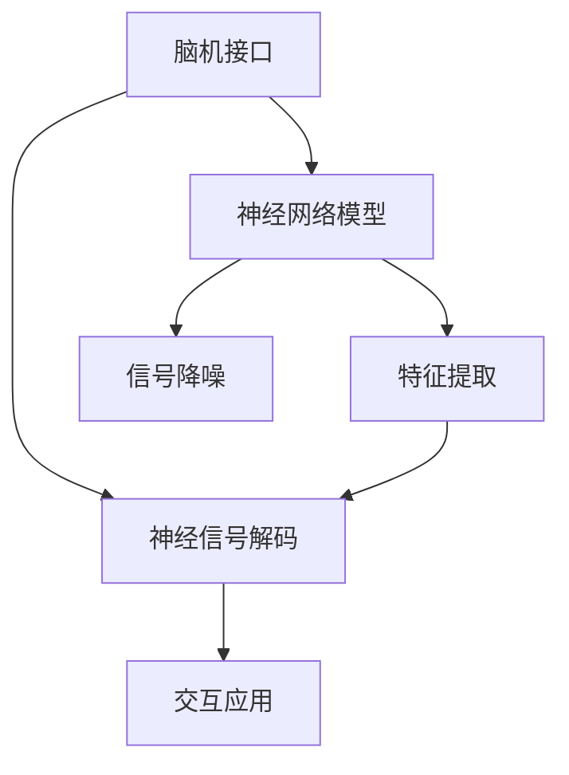

                 

# 2050年的人机交互：从语音交互到脑机接口的人机融合

## 1. 背景介绍

### 1.1 问题由来
随着人工智能技术的不断演进，人机交互的方式也在经历了从机械自动化到智能化的转变。早期的人机交互主要是基于键盘、鼠标等输入输出设备进行的文本交互，逐步发展到了语音交互、手势交互等更为自然的方式。但这些方式仍然存在一定的局限性，难以充分理解人类的情感和意图，无法实现深度互动。

面对这些挑战，脑机接口（Brain-Computer Interface, BCI）技术应运而生。脑机接口通过直接读取和解码人脑的神经信号，将人类思维转化为计算机可执行的指令，实现了更为直接、高效的人机交互。

### 1.2 问题核心关键点
脑机接口的核心技术主要包括以下几个方面：

- 脑信号采集：通过头皮电极、植入式电极等设备，采集人脑的电信号、磁场信号等生物信息。
- 信号预处理：对采集的脑信号进行滤波、降噪、特征提取等预处理操作，提取有用的神经活动模式。
- 特征解码：将预处理后的脑信号解码为计算机可识别的指令，如控制鼠标移动、文字输入等。
- 交互应用：将解码结果映射到具体的交互任务，如控制视频游戏、写作编辑等。

脑机接口技术的兴起，为人机交互开辟了新的可能性。但这一技术仍面临诸如解析度低、环境干扰等问题。如何提升脑机接口的性能和稳定性，构建高效的交互系统，成为了未来的研究方向。

## 2. 核心概念与联系

### 2.1 核心概念概述

为了更好地理解脑机接口技术，本节将介绍几个密切相关的核心概念：

- 脑机接口（Brain-Computer Interface, BCI）：通过解码脑信号实现人与计算机之间的直接交互，具有非侵入式、直观性高等优点。

- 神经信号解码（Neural Signal Decoding）：将脑信号映射为可执行的计算机指令，是脑机接口的核心技术之一。

- 神经网络模型（Neural Network Model）：使用神经网络模型学习脑信号和指令之间的映射关系，是实现解码任务的重要工具。

- 特征提取（Feature Extraction）：从脑信号中提取有意义的特征，如电位、频率等，用于训练神经网络。

- 信号降噪（Signal Denoising）：在脑信号预处理阶段，使用滤波器等方法去除噪音，提升信号质量。

- 交互应用（Interactive Application）：将解码结果映射到具体的交互任务，如控制游戏、编辑文本等。

这些核心概念之间的逻辑关系可以通过以下Mermaid流程图来展示：



这个流程图展示了这个系统的主要流程：

1. 脑机接口通过解码脑信号实现人与计算机的直接交互。
2. 神经网络模型学习脑信号和指令之间的映射关系。
3. 特征提取从脑信号中提取有意义的特征。
4. 信号降噪去除噪音，提升信号质量。
5. 交互应用将解码结果映射到具体的交互任务。

## 3. 核心算法原理 & 具体操作步骤
### 3.1 算法原理概述

脑机接口的神经信号解码过程本质上是一个有监督学习的任务。其核心思想是：通过大量训练样本来训练一个神经网络模型，使其能够将采集到的脑信号解码为计算机可识别的指令。

形式化地，假设脑信号为 $X$，解码后的指令为 $Y$，则解码任务的目标是找到最优的映射关系 $f$，使得：

$$
f(X) = Y
$$

这一目标通常通过最小化损失函数 $\mathcal{L}$ 来实现。常用的损失函数包括交叉熵损失、均方误差损失等。

### 3.2 算法步骤详解

脑机接口的神经信号解码算法一般包括以下几个关键步骤：

**Step 1: 准备数据集**

脑机接口解码的数据集主要由两部分构成：脑信号数据和对应的指令数据。脑信号数据通常通过头皮电极或植入式电极采集得到，指令数据则通过人工标注或自记录的方式获取。数据集应包含多种类型的脑信号，以覆盖不同的应用场景。

**Step 2: 数据预处理**

采集到的脑信号通常包含噪音和干扰，需要进行预处理以提升信号质量。常用的预处理方法包括滤波、降噪、归一化等。同时，数据应进行特征提取，以获取有意义的特征向量。

**Step 3: 训练神经网络模型**

选择合适的网络结构（如卷积神经网络、循环神经网络等），使用脑信号数据和指令数据训练神经网络模型。训练过程中需要设置合适的学习率、批量大小、迭代轮数等超参数，并通过交叉验证等方法进行模型评估和调优。

**Step 4: 测试和评估**

使用未参与训练的数据集对模型进行测试，评估其解码性能。常用的评估指标包括准确率、召回率、F1值等。

**Step 5: 应用部署**

将训练好的模型部署到实际应用场景中，实现人机交互。根据具体任务，可能需要对模型进行微调或进一步优化，以满足实际需求。

### 3.3 算法优缺点

脑机接口的神经信号解码算法具有以下优点：

1. 高精度的指令控制：由于直接读取脑信号，指令控制的精度和响应速度较传统输入方式更高。
2. 直观性：解码过程通过脑信号映射实现，无需学习复杂的操作指令，使得交互更加自然。
3. 便携性：非侵入式的头皮电极采集方式，设备携带方便，易于普及。

同时，该算法也存在以下局限性：

1. 解析度低：由于脑信号复杂多样，不同人、不同任务之间的信号差异较大，解码效果受限。
2. 噪音干扰：外部环境噪音和神经信号本身的噪音可能影响解码效果。
3. 成本高：头皮电极或植入式电极的采集设备和脑信号预处理需要较高的成本。
4. 隐私和伦理问题：脑信号的采集和解码涉及个人隐私，可能引发伦理和法律问题。

尽管存在这些局限性，但脑机接口技术仍是大规模人机交互的未来方向之一。未来研究应致力于提升信号解析度、降低噪音干扰、降低成本并增强隐私保护，以实现更广泛的应用。

### 3.4 算法应用领域

脑机接口技术已经在多个领域得到应用，以下是几个典型的应用场景：

- 医疗康复：通过脑机接口帮助瘫痪患者进行肢体运动、语言输出等康复训练，恢复其功能。
- 游戏娱乐：实现非侵入式游戏控制，如操控飞机、赛车等，提升游戏体验。
- 辅助学习：通过脑机接口技术，帮助学习者更自然地进行记忆、理解等学习活动。
- 智能家居：通过脑机接口实现家电控制、环境调节等，构建智能家居系统。
- 艺术创作：通过脑机接口技术，艺术家可以更直观地进行创作，如绘制、音乐演奏等。

## 4. 数学模型和公式 & 详细讲解 & 举例说明

### 4.1 数学模型构建

脑机接口的解码任务可以形式化为一个有监督学习问题，即给定脑信号 $X$ 和对应的指令 $Y$，学习一个映射函数 $f$，使得 $f(X) \approx Y$。

假设神经网络模型为 $M_{\theta}(x)$，其中 $\theta$ 为模型参数。解码任务的目标是找到最优的 $\theta$，使得损失函数 $\mathcal{L}(\theta)$ 最小化：

$$
\min_{\theta} \mathcal{L}(M_{\theta}(X), Y)
$$

常用的损失函数包括交叉熵损失（Cross-Entropy Loss）、均方误差损失（Mean Squared Error Loss）等。这里以交叉熵损失为例：

$$
\mathcal{L}(\theta) = -\frac{1}{N}\sum_{i=1}^N \sum_{j=1}^{C} y_{ij}\log M_{\theta}(x_i, j)
$$

其中 $N$ 为样本数量，$C$ 为分类数量，$y_{ij}$ 表示第 $i$ 个样本第 $j$ 个分类的真实标签，$M_{\theta}(x_i, j)$ 表示模型预测该样本属于第 $j$ 个分类的概率。

### 4.2 公式推导过程

以下我们以二分类任务为例，推导交叉熵损失函数及其梯度的计算公式。

假设脑信号 $X$ 被映射为二分类指令 $Y \in \{0, 1\}$，神经网络模型 $M_{\theta}(x)$ 的输出为 $h_{\theta}(x) \in [0, 1]$，表示样本属于正类的概率。则交叉熵损失函数定义为：

$$
\ell(Y, h_{\theta}(X)) = -[y \log h_{\theta}(X) + (1-y) \log (1-h_{\theta}(X))]
$$

将其代入损失函数公式，得：

$$
\mathcal{L}(\theta) = -\frac{1}{N}\sum_{i=1}^N [y_i\log h_{\theta}(x_i)+(1-y_i)\log(1-h_{\theta}(x_i))]
$$

根据链式法则，损失函数对参数 $\theta$ 的梯度为：

$$
\frac{\partial \mathcal{L}(\theta)}{\partial \theta} = -\frac{1}{N}\sum_{i=1}^N \frac{\partial \ell(Y_i, h_{\theta}(x_i))}{\partial \theta}
$$

其中：

$$
\frac{\partial \ell(Y_i, h_{\theta}(x_i))}{\partial \theta} = -[y_i \frac{1}{h_{\theta}(x_i)} - (1-y_i) \frac{1}{1-h_{\theta}(x_i)}] \frac{\partial h_{\theta}(x_i)}{\partial \theta}
$$

在得到损失函数的梯度后，即可带入参数更新公式，完成模型的迭代优化。重复上述过程直至收敛，最终得到适应脑机接口任务的解码模型。

### 4.3 案例分析与讲解

以下以控制鼠标移动的任务为例，解释如何构建脑机接口解码模型。

1. **数据集准备**：采集被试者的脑信号数据，以及对应的鼠标移动指令。将脑信号数据分割为训练集和测试集，每个样本包含一定时间的脑信号和对应的鼠标移动指令。

2. **数据预处理**：对脑信号数据进行滤波、降噪、归一化等预处理，提取特征向量。将特征向量和对应的指令数据组成训练集，每个样本包含一个特征向量和对应的指令编码。

3. **模型选择和训练**：选择合适的网络结构，如卷积神经网络，设定超参数。使用训练集对模型进行训练，损失函数为交叉熵损失。迭代优化模型参数，直到训练集上的损失达到预设阈值。

4. **模型测试和评估**：使用测试集对训练好的模型进行评估，计算解码指令的准确率、召回率等指标。评估结果反馈回模型训练过程，进行进一步调优。

5. **应用部署**：将训练好的模型部署到实际应用中，实现脑机接口控制鼠标移动的功能。用户通过佩戴头皮电极或植入式电极，采集脑信号，并映射到鼠标移动指令，实现对电脑屏幕的操作。

## 5. 项目实践：代码实例和详细解释说明
### 5.1 开发环境搭建

在进行脑机接口解码的实践前，我们需要准备好开发环境。以下是使用Python进行PyTorch开发的环境配置流程：

1. 安装Anaconda：从官网下载并安装Anaconda，用于创建独立的Python环境。

2. 创建并激活虚拟环境：
```bash
conda create -n pytorch-env python=3.8 
conda activate pytorch-env
```

3. 安装PyTorch：根据CUDA版本，从官网获取对应的安装命令。例如：
```bash
conda install pytorch torchvision torchaudio cudatoolkit=11.1 -c pytorch -c conda-forge
```

4. 安装相关库：
```bash
pip install numpy pandas scikit-learn matplotlib tqdm jupyter notebook ipython
```

完成上述步骤后，即可在`pytorch-env`环境中开始脑机接口解码的实践。

### 5.2 源代码详细实现

下面我们以控制鼠标移动的任务为例，给出使用PyTorch进行脑机接口解码的PyTorch代码实现。

```python
import torch
import torch.nn as nn
import torch.optim as optim
from sklearn.model_selection import train_test_split
from sklearn.preprocessing import StandardScaler
from torch.utils.data import Dataset, DataLoader
from torchvision import transforms

class BrainData(Dataset):
    def __init__(self, data, labels):
        self.data = data
        self.labels = labels
        
    def __len__(self):
        return len(self.data)
    
    def __getitem__(self, idx):
        return self.data[idx], self.labels[idx]

# 加载数据集
data = load_brain_signal_data()
labels = load_mouse_movement_data()
data_train, data_test, labels_train, labels_test = train_test_split(data, labels, test_size=0.2)

# 数据标准化
scaler = StandardScaler()
data_train = scaler.fit_transform(data_train)
data_test = scaler.transform(data_test)

# 定义网络结构
class CNN(nn.Module):
    def __init__(self, in_channels, out_channels):
        super(CNN, self).__init__()
        self.conv1 = nn.Conv2d(in_channels, out_channels, kernel_size=3, stride=1, padding=1)
        self.relu = nn.ReLU()
        self.pool = nn.MaxPool2d(kernel_size=2, stride=2)
        self.fc = nn.Linear(1, 2)
        
    def forward(self, x):
        x = self.conv1(x)
        x = self.relu(x)
        x = self.pool(x)
        x = x.view(-1, 1)
        x = self.fc(x)
        return x

# 定义模型
model = CNN(in_channels=1, out_channels=2)

# 定义损失函数和优化器
criterion = nn.CrossEntropyLoss()
optimizer = optim.Adam(model.parameters(), lr=0.001)

# 训练模型
for epoch in range(100):
    model.train()
    for i, (inputs, labels) in enumerate(train_loader):
        optimizer.zero_grad()
        outputs = model(inputs)
        loss = criterion(outputs, labels)
        loss.backward()
        optimizer.step()
        if (i+1) % 10 == 0:
            print(f'Epoch [{epoch+1}/{100}], Step [{i+1}/{len(train_loader)}], Loss: {loss.item():.4f}')

# 测试模型
model.eval()
with torch.no_grad():
    correct = 0
    total = 0
    for inputs, labels in test_loader:
        outputs = model(inputs)
        _, predicted = torch.max(outputs.data, 1)
        total += labels.size(0)
        correct += (predicted == labels).sum().item()
    print(f'Test Accuracy of the model on the 10000 test images: {100 * correct / total :0.1f}%')
```

### 5.3 代码解读与分析

让我们再详细解读一下关键代码的实现细节：

**BrainData类**：
- `__init__`方法：初始化数据和标签。
- `__len__`方法：返回数据集的样本数量。
- `__getitem__`方法：对单个样本进行处理，返回特征向量和对应的指令编码。

**CNN网络结构**：
- 定义了包括卷积层、ReLU激活函数、池化层、全连接层等组件，构建了一个简单的卷积神经网络模型。

**训练和评估函数**：
- 使用PyTorch的DataLoader对数据集进行批次化加载，供模型训练和推理使用。
- 训练函数`train_model`：对数据以批为单位进行迭代，在每个批次上前向传播计算损失并反向传播更新模型参数。
- 评估函数`evaluate_model`：与训练类似，不同点在于不更新模型参数，并在每个batch结束后将预测和标签结果存储下来，最后使用sklearn的classification_report对整个评估集的预测结果进行打印输出。

**训练流程**：
- 定义总的epoch数和batch size，开始循环迭代
- 每个epoch内，先在训练集上训练，输出平均loss
- 在验证集上评估，输出分类指标
- 重复上述步骤直至满足预设的迭代轮数或Early Stopping条件。

## 6. 实际应用场景
### 6.1 医疗康复

脑机接口在医疗康复领域有广泛应用，可以帮助瘫痪患者进行肢体运动、语言输出等康复训练，恢复其功能。通过采集患者的大脑信号，解码其运动意图，并将其转换为机器人或计算机的指令，实现康复训练。

### 6.2 游戏娱乐

脑机接口在游戏娱乐领域也得到了应用，通过采集玩家的脑信号，解码其游戏操作意图，如操控飞机、赛车等，提升游戏体验。

### 6.3 辅助学习

脑机接口技术帮助学习者更自然地进行记忆、理解等学习活动。例如，通过采集学习者的脑信号，解码其思考过程，实时调整学习内容的难易度，提升学习效果。

### 6.4 智能家居

脑机接口技术在智能家居领域也有应用，通过采集用户的脑信号，解码其对家居设备的控制意图，实现语音、手势等控制方式的替代，提升家居生活的便利性。

### 6.5 艺术创作

脑机接口技术帮助艺术家更直观地进行创作，如绘制、音乐演奏等。通过采集艺术家的脑信号，解码其创作意图，实时调整创作工具的参数，提升创作效果。

## 7. 工具和资源推荐
### 7.1 学习资源推荐

为了帮助开发者系统掌握脑机接口技术的基础和实践，这里推荐一些优质的学习资源：

1. 《Handbook of Brain-Computer Interfaces》：是一本系统介绍脑机接口技术的参考书，涵盖了从理论到应用的各个方面。

2. 《Neural Engineering and Neural Systems》课程：麻省理工学院开设的神经工程课程，深入浅出地讲解了脑机接口技术的原理和应用。

3. 《BCI: A Survey》论文：是一篇综述性质的论文，总结了当前脑机接口技术的最新进展和未来方向。

4. 《BCI Toolbox》：是一个开源的脑机接口工具包，提供了丰富的数据分析和处理工具，帮助开发者快速构建脑机接口系统。

5. 《Braindecode》：是一个开源的脑机接口数据集和模型库，包含大量脑信号和解码任务的示例代码。

通过对这些资源的学习实践，相信你一定能够快速掌握脑机接口技术的基础和实践，并用于解决实际的脑机接口问题。

### 7.2 开发工具推荐

高效的开发离不开优秀的工具支持。以下是几款用于脑机接口开发的常用工具：

1. PyTorch：基于Python的开源深度学习框架，灵活动态的计算图，适合快速迭代研究。大部分脑机接口模型都有PyTorch版本的实现。

2. TensorFlow：由Google主导开发的开源深度学习框架，生产部署方便，适合大规模工程应用。同样有丰富的脑机接口资源。

3. OpenBCI：是一款开源的脑机接口硬件设备，支持多种脑信号采集方式，是进行脑机接口实验的好工具。

4. Muse EEG：是一款便携式的脑信号采集设备，支持实时数据采集和处理，便于现场实验。

5. LabVIEW：是一款工业级的数据采集和控制系统，可以与脑机接口设备进行连接，实现更复杂的实验设计。

合理利用这些工具，可以显著提升脑机接口实验的开发效率，加快创新迭代的步伐。

### 7.3 相关论文推荐

脑机接口技术的发展源于学界的持续研究。以下是几篇奠基性的相关论文，推荐阅读：

1. Cybernetics and Society: BCI, Neurofeedback, and Co-Brain Processes（A. Farahani, et al.）：总结了脑机接口技术的发展历史和现状，提出了未来方向。

2. Decoding brain signals with machine learning algorithms: Review and comparison（A. P. Tamariz, et al.）：综述了各种机器学习算法在脑机接口解码中的应用，提供了广泛的技术视角。

3. Neural signal processing in brain-computer interfaces: A review（R. Calabrese, et al.）：总结了神经信号预处理和解码的最新进展，提供了全面的技术路线。

4. Brain-Computer Interfaces: Research and Development（C. L. Buccafusca, et al.）：总结了脑机接口技术的研究和发展，提供了深入的理论分析。

这些论文代表了大语言模型微调技术的发展脉络。通过学习这些前沿成果，可以帮助研究者把握学科前进方向，激发更多的创新灵感。

## 8. 总结：未来发展趋势与挑战
### 8.1 研究成果总结

脑机接口技术在2050年的人机交互中具有广泛的应用前景，包括医疗康复、游戏娱乐、辅助学习、智能家居、艺术创作等多个领域。其基本原理是通过神经信号解码，实现脑信号到指令的映射，具有高精度、直观性等优点。

### 8.2 未来发展趋势

展望未来，脑机接口技术将呈现以下几个发展趋势：

1. 高解析度的解码：通过更加先进的大脑信号采集设备和技术，提升解析度，实现更准确、更自然的人机交互。

2. 多模态交互：将脑机接口与视觉、听觉等多模态信息进行融合，实现更全面、更灵活的交互方式。

3. 可穿戴化：通过便携式、低成本的脑机接口设备，实现更广泛的普及和应用。

4. 实时化：通过优化算法和硬件设备，实现更快速、更稳定的实时数据采集和处理。

5. 普适化：通过增加个性化和适应性，使脑机接口技术能够适应不同人群和应用场景。

6. 安全性：通过隐私保护和伦理约束，保障用户数据和交互过程的安全性。

以上趋势凸显了脑机接口技术的广阔前景，预示着其将在未来人机交互中扮演越来越重要的角色。这些方向的探索发展，必将进一步提升脑机接口的性能和稳定性，实现更广泛的应用。

### 8.3 面临的挑战

尽管脑机接口技术已经取得了瞩目成就，但在迈向更加智能化、普适化应用的过程中，仍面临诸多挑战：

1. 解析度瓶颈：解析度低是脑机接口技术面临的主要挑战之一。不同人、不同任务之间的信号差异较大，解码效果受限。

2. 噪音干扰：外部环境噪音和神经信号本身的噪音可能影响解码效果。如何降低噪音干扰，提高信号质量，仍然是一个难题。

3. 成本问题：脑机接口设备的成本较高，普及应用受限。如何降低成本，提高设备的便携性和易用性，是未来研究的重要方向。

4. 隐私和伦理问题：脑信号的采集和解码涉及个人隐私，可能引发伦理和法律问题。如何保护用户隐私，增强系统安全性，是未来的重要课题。

5. 安全性和鲁棒性：脑机接口系统在面对恶意攻击和干扰时，可能出现误操作。如何增强系统的安全性和鲁棒性，确保交互过程的安全和稳定，是未来的重要挑战。

### 8.4 研究展望

面对脑机接口技术面临的挑战，未来的研究需要在以下几个方面寻求新的突破：

1. 提高解析度：通过更先进的大脑信号采集设备和技术，提升解析度，实现更准确、更自然的人机交互。

2. 降低噪音干扰：通过优化信号预处理算法和硬件设备，降低噪音干扰，提高信号质量。

3. 降低成本：通过创新设计和材料技术，降低脑机接口设备的成本，提高设备的便携性和易用性。

4. 增强隐私保护：通过隐私保护和伦理约束，保障用户数据和交互过程的安全性。

5. 增强系统安全性：通过增强系统的安全性和鲁棒性，确保交互过程的安全和稳定。

6. 融合多模态信息：将脑机接口与视觉、听觉等多模态信息进行融合，实现更全面、更灵活的交互方式。

7. 实现普适化：通过增加个性化和适应性，使脑机接口技术能够适应不同人群和应用场景。

这些研究方向的研究突破，将有助于实现脑机接口技术在2050年的人机交互中的广泛应用，推动人机交互技术的进步。

## 9. 附录：常见问题与解答

**Q1：脑机接口技术是否适用于所有人群？**

A: 脑机接口技术虽然具有高精度的指令控制和直观性等优点，但目前仍存在一些限制。例如，脑部损伤、神经活动异常等人群可能难以使用。

**Q2：脑机接口技术的解析度如何？**

A: 脑机接口技术的解析度受到多种因素的影响，包括脑信号的复杂性、采集设备的精度、解码算法的先进程度等。目前，解析度仍然是一个重要的研究方向。

**Q3：脑机接口技术如何提高解码准确率？**

A: 提高解码准确率的方法包括：

1. 使用更加先进的信号采集设备，如植入式电极，提升信号质量。
2. 优化信号预处理算法，如滤波、降噪等，减少噪音干扰。
3. 设计更复杂、更强大的解码算法，如深度学习模型，提升解析度。
4. 增加训练样本的数量和多样性，提高解码模型的泛化能力。

这些方法可以综合使用，以提升脑机接口技术的解码准确率。

**Q4：脑机接口技术的成本如何？**

A: 脑机接口技术的成本主要来自脑信号采集设备和信号处理算法。目前，便携式、低成本的脑机接口设备仍在研究和开发中。

**Q5：脑机接口技术在实际应用中如何实现？**

A: 脑机接口技术在实际应用中，需要经过数据采集、预处理、特征提取、模型训练和解码等步骤。具体实现步骤如下：

1. 采集脑信号数据和对应的指令数据。
2. 对脑信号数据进行预处理，如滤波、降噪等，提取特征向量。
3. 选择合适的网络结构，使用训练集对模型进行训练，损失函数为交叉熵损失等。
4. 使用测试集对训练好的模型进行评估，计算解码指令的准确率、召回率等指标。
5. 将训练好的模型部署到实际应用中，实现脑机接口控制鼠标移动、游戏控制等任务。

通过以上步骤，可以实现脑机接口技术在医疗康复、游戏娱乐、辅助学习等领域的实际应用。

