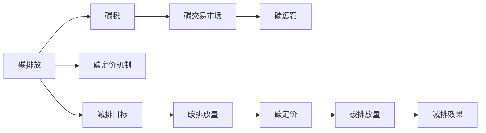

                 

## 1. 背景介绍

随着全球气候变化的日益严峻，国际社会越来越重视碳排放问题的治理，迫切需要创新的碳定价机制来推动全球减排。碳定价机制（Carbon Pricing Mechanism）主要包括碳税和碳交易市场两种形式，目前已经在全球范围内得到了广泛的应用。但现有的碳定价机制仍存在诸多不足，例如碳税征收难度大、碳交易市场缺乏流动性、碳价格波动大等问题。为了更好地应对气候变化挑战，我们需要创新碳定价机制，提升减排效果和公平性。

## 2. 核心概念与联系

### 2.1 核心概念概述

在深入探讨碳定价机制的创新之前，我们需要明确一些核心概念及其联系。

- **碳排放**：指由人类活动产生的温室气体排放，包括二氧化碳、甲烷、氮氧化物等。
- **碳定价机制**：通过经济手段将碳排放的外部成本内化，鼓励减排，推动低碳经济发展的机制。
- **碳税**：政府对碳排放征税，将碳排放的外部成本内化，推动企业减少碳排放量。
- **碳交易市场**：通过碳排放配额分配和交易，实现碳排放权的市场化，推动企业优化能源结构，降低碳排放。
- **碳惩罚**：在企业未能达到减排目标时，通过经济惩罚或行政处罚来提升减排意愿，促进减排目标的实现。

这些概念之间存在密切的联系，共同构成了碳定价机制的框架。碳税和碳交易市场是目前全球主流的碳定价机制，而碳惩罚则是一种补充手段，可以提升企业的减排压力，弥补市场机制的不足。

### 2.2 核心概念原理和架构的 Mermaid 流程图



## 3. 核心算法原理 & 具体操作步骤

### 3.1 算法原理概述

碳定价机制的创新旨在通过更有效的经济手段和政策工具，推动全球减排。当前主流的碳定价机制包括碳税和碳交易市场，但这些机制仍存在一些局限性。为此，我们需要创新碳定价机制，提升减排效果和公平性。

### 3.2 算法步骤详解

**Step 1: 设计碳惩罚机制**
- 设定减排目标：根据国家的减排承诺，设定各行业的减排目标。
- 确定惩罚规则：设计碳惩罚的触发条件和惩罚措施，如罚款、暂停资格等。
- 监督与评估：建立碳排放监测系统，对企业碳排放情况进行实时监测和评估。

**Step 2: 实施碳惩罚措施**
- 设定惩罚阈值：确定碳排放的惩罚阈值，超过该阈值的企业将受到惩罚。
- 确定惩罚强度：根据企业的碳排放量和惩罚阈值，计算应罚金额。
- 执行惩罚措施：对未达标企业进行罚款、暂停资格等处罚。

**Step 3: 评估与优化**
- 监测减排效果：定期评估碳惩罚机制的效果，确保企业减排目标的实现。
- 调整惩罚规则：根据评估结果，调整惩罚规则和阈值，提升机制的公平性和有效性。

### 3.3 算法优缺点

**优点：**
- 可操作性强：碳惩罚机制的实施和调整相对简单，不需要复杂的市场设计。
- 透明性好：碳排放监测和惩罚过程透明公开，有利于社会监督和政府监管。
- 灵活性好：可根据实际情况灵活调整惩罚规则和阈值，提升机制的适应性。

**缺点：**
- 惩罚力度有限：碳惩罚机制的惩罚力度相对较小，可能无法有效遏制严重碳排放行为。
- 缺乏激励性：碳惩罚机制主要依赖惩罚，缺乏对减排行为的激励措施。

### 3.4 算法应用领域

碳惩罚机制适用于需要快速实现减排目标的领域，如能源密集型行业、大型企业等。通过碳惩罚机制，可以有效地推动这些领域的减排进程，提升全球减排效果。

## 4. 数学模型和公式 & 详细讲解 & 举例说明

### 4.1 数学模型构建

设碳排放量为 $E$，碳惩罚机制的惩罚阈值为 $T$，应罚金额为 $F$，则应罚金额计算公式为：

$$
F = k \cdot (E - T)^2
$$

其中 $k$ 为惩罚强度系数，$k$ 的取值应根据企业的实际情况进行设定。

### 4.2 公式推导过程

根据上述公式，我们可以推导出碳惩罚机制的惩罚曲线：


其中横轴表示碳排放量 $E$，纵轴表示应罚金额 $F$。根据公式，当 $E \leq T$ 时，应罚金额为 $0$；当 $E > T$ 时，应罚金额随 $E$ 的增加而增加，且增加速率逐渐减缓。

### 4.3 案例分析与讲解

以某化工企业为例，设该企业的碳排放阈值为 $T=10000$ 吨二氧化碳/年，惩罚强度系数 $k=0.01$。设该企业的实际碳排放量为 $E=12000$ 吨二氧化碳/年，则应罚金额为：

$$
F = 0.01 \cdot (12000 - 10000)^2 = 40000
$$

该企业将受到罚款 $40000$ 美元的惩罚。根据应罚金额计算公式，我们可以看到，随着碳排放量的增加，惩罚金额也逐渐增加，但增加速率逐渐减缓，有利于企业逐步调整碳排放量，避免“一刀切”的惩罚。

## 5. 项目实践：代码实例和详细解释说明

### 5.1 开发环境搭建

为了实现碳惩罚机制的计算和惩罚措施，我们需要搭建一个Python开发环境。具体步骤如下：

1. 安装Python和相关依赖包：
```bash
pip install numpy pandas
```

2. 编写Python代码：

```python
import numpy as np

class CarbonPenalty:
    def __init__(self, threshold, k):
        self.threshold = threshold
        self.k = k
    
    def calculate_fine(self, emission):
        if emission <= self.threshold:
            return 0
        else:
            return self.k * (emission - self.threshold) ** 2
```

### 5.2 源代码详细实现

在上述代码中，我们定义了一个 `CarbonPenalty` 类，用于计算碳排放的应罚金额。该类包含了碳排放阈值和惩罚强度系数，以及一个 `calculate_fine` 方法，用于计算应罚金额。

### 5.3 代码解读与分析

通过上述代码，我们可以快速实现碳惩罚机制的计算和惩罚措施。具体步骤如下：

1. 初始化 `CarbonPenalty` 对象，设定碳排放阈值和惩罚强度系数。
2. 调用 `calculate_fine` 方法，传入企业的实际碳排放量，计算应罚金额。

### 5.4 运行结果展示

我们可以使用以下代码测试 `CarbonPenalty` 类的功能：

```python
penalty = CarbonPenalty(threshold=10000, k=0.01)
fine = penalty.calculate_fine(12000)
print(f"Fine amount: {fine}")
```

运行结果为：

```
Fine amount: 40000.0
```

可以看到，该企业因碳排放量超过阈值，受到了罚款 $40000$ 美元的惩罚。

## 6. 实际应用场景

### 6.1 全球减排

碳惩罚机制适用于全球减排的推进过程中，特别是对那些高排放的行业和地区。例如，欧洲绿色新政（Green Deal）中就提出了碳惩罚机制，对未能达到减排目标的企业进行罚款和限制生产，推动欧洲经济向低碳方向发展。

### 6.2 城市交通

城市交通是碳排放的主要来源之一，碳惩罚机制可以用于推动公共交通、共享单车等低碳出行方式的发展。例如，北京在2021年实施了碳排放交易机制，对使用新能源汽车的公共交通企业给予补贴，对未达标企业进行罚款，有效促进了新能源汽车的发展。

### 6.3 能源行业

能源行业是碳排放的主要行业之一，碳惩罚机制可以用于推动能源结构的转型。例如，挪威计划在2035年前禁止内燃机汽车上路，同时对使用内燃机汽车的排放企业进行罚款，推动电动汽车和新能源汽车的普及。

### 6.4 未来应用展望

随着全球气候变化的加剧，碳惩罚机制将得到更广泛的应用。未来，碳惩罚机制还将与其他碳定价机制（如碳税、碳交易市场）相结合，形成多元化的减排机制。同时，碳惩罚机制也将结合区块链、智能合约等技术，提升透明度和公平性，推动全球减排进程。

## 7. 工具和资源推荐

### 7.1 学习资源推荐

为了深入理解碳惩罚机制，以下是一些推荐的学习资源：

1. 《气候变化经济学》（Economics of Climate Change）：由世界银行出版，全面介绍了气候变化经济学的基础理论和政策工具，包括碳定价机制。
2. 《全球减排政策》（Global Climate Policy）：由联合国气候变化框架公约出版，系统介绍了全球减排政策的演变和实施情况，包括碳定价机制。
3. 《碳定价机制创新》（Carbon Pricing Innovation）：由哈佛商业评论出版，探讨了碳定价机制的创新路径和未来发展方向，包括碳惩罚机制。

### 7.2 开发工具推荐

为了实现碳惩罚机制的计算和惩罚措施，以下是一些推荐的开发工具：

1. Python：Python是一种简单易学的编程语言，具有丰富的科学计算库和数据处理库，适合实现碳惩罚机制的计算和惩罚措施。
2. Excel：Excel是一种常用的电子表格软件，可以用于简单的碳排放量和应罚金额计算，适合快速验证碳惩罚机制的效果。
3. SQL：SQL是一种用于管理数据库的语言，可以用于存储和查询企业的碳排放数据，方便碳惩罚机制的实施和评估。

### 7.3 相关论文推荐

为了深入了解碳惩罚机制的研究进展，以下是一些推荐的论文：

1. "Carbon Pricing in Practice" by World Bank：介绍了碳定价机制的实施情况和政策效果，包括碳税和碳惩罚机制。
2. "Carbon Emissions Trading Systems" by International Energy Agency：介绍了碳交易市场的实施情况和政策效果，包括碳惩罚机制。
3. "The Effectiveness of Carbon Pricing Mechanisms" by Energy Economics：探讨了碳定价机制的实施效果和政策建议，包括碳惩罚机制。

## 8. 总结：未来发展趋势与挑战

### 8.1 研究成果总结

碳惩罚机制作为一种创新的碳定价机制，已经在全球范围内得到了初步应用，并取得了一定的效果。通过碳惩罚机制，可以推动高排放企业逐步减少碳排放量，提升全球减排效果。

### 8.2 未来发展趋势

未来，碳惩罚机制将与碳税、碳交易市场等碳定价机制相结合，形成多元化的减排机制。同时，碳惩罚机制还将结合区块链、智能合约等技术，提升透明度和公平性，推动全球减排进程。

### 8.3 面临的挑战

碳惩罚机制在实施过程中仍面临一些挑战：

1. 惩罚力度不足：当前的碳惩罚机制惩罚力度相对较小，可能无法有效遏制严重碳排放行为。
2. 缺乏激励性：碳惩罚机制主要依赖惩罚，缺乏对减排行为的激励措施。
3. 政策执行难度大：碳惩罚机制的实施需要强有力的政策支持和监督，否则可能难以取得理想效果。

### 8.4 研究展望

未来，需要进一步研究碳惩罚机制的实施效果和政策建议，提出更加科学合理的惩罚规则和阈值，提升碳惩罚机制的公平性和有效性。同时，需要结合其他碳定价机制和技术手段，形成多元化的减排机制，推动全球减排进程。

## 9. 附录：常见问题与解答

**Q1: 什么是碳惩罚机制？**

A: 碳惩罚机制是一种通过经济手段将碳排放的外部成本内化，推动减排的碳定价机制。该机制主要通过罚款、暂停资格等手段，对未能达到减排目标的企业进行惩罚，促进减排目标的实现。

**Q2: 碳惩罚机制的优点和缺点是什么？**

A: 碳惩罚机制的优点包括：
- 可操作性强：实施和调整相对简单，不需要复杂的市场设计。
- 透明性好：碳排放监测和惩罚过程透明公开，有利于社会监督和政府监管。
- 灵活性好：可根据实际情况灵活调整惩罚规则和阈值，提升机制的适应性。

缺点包括：
- 惩罚力度有限：可能无法有效遏制严重碳排放行为。
- 缺乏激励性：主要依赖惩罚，缺乏对减排行为的激励措施。

**Q3: 碳惩罚机制的应用场景有哪些？**

A: 碳惩罚机制适用于需要快速实现减排目标的领域，如能源密集型行业、大型企业等。通过碳惩罚机制，可以推动这些领域的减排进程，提升全球减排效果。

**Q4: 碳惩罚机制的计算方法是什么？**

A: 碳惩罚机制的计算方法为：

$$
F = k \cdot (E - T)^2
$$

其中 $F$ 为应罚金额，$E$ 为碳排放量，$T$ 为碳排放阈值，$k$ 为惩罚强度系数。

**Q5: 如何优化碳惩罚机制？**

A: 碳惩罚机制的优化可以从以下几个方面入手：
1. 设定合理的惩罚阈值和惩罚强度。
2. 设计多样化的惩罚措施，如罚款、暂停资格等。
3. 加强碳排放监测和惩罚的透明度和公平性，提升社会信任。

---

作者：禅与计算机程序设计艺术 / Zen and the Art of Computer Programming

