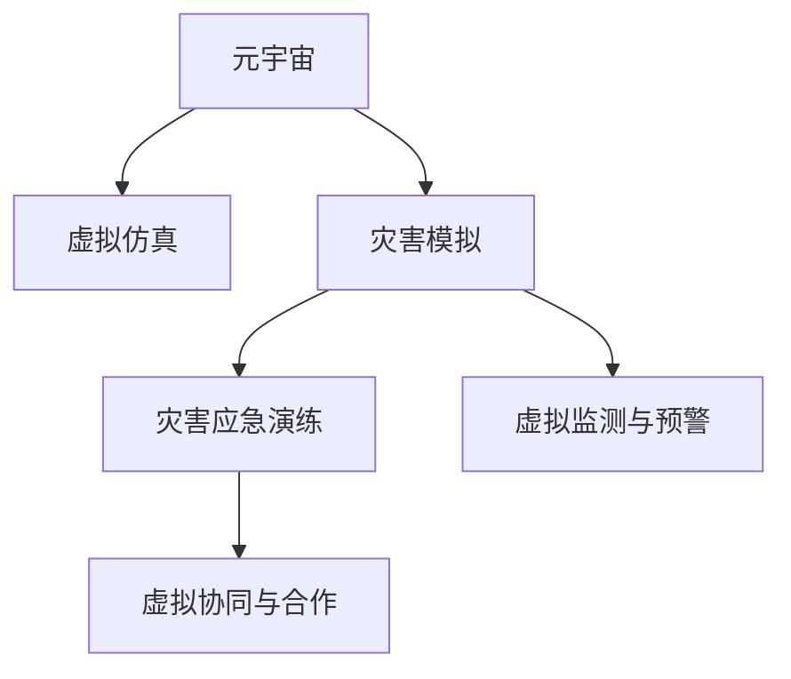

                 

# 2050年的全球减灾：从灾害元宇宙到全球减灾合作的减灾体系升级

## 1. 背景介绍

随着全球气候变化和自然灾害的频发，如何有效地减轻灾害带来的损失，保护人类社会的安全与稳定，成为21世纪的重要课题。近年来，科技的发展为灾害管理提供了新的工具和方法，其中，“元宇宙”的概念在2050年带来了全球减灾的新理念。

### 1.1 问题由来

自然灾害的发生频率和强度正在增加，这对传统灾害管理方式提出了严峻挑战。受限于物理空间和信息的有限性，传统灾害管理难以适应全球化的需求。近年来，随着科技的迅猛发展，尤其是“元宇宙”概念的提出，为全球减灾提供了全新的视角。

### 1.2 问题核心关键点

“元宇宙”是一种将虚拟空间与现实世界紧密结合的全新数字生态系统。在这个虚拟空间中，用户可以通过数字身份参与各种虚拟活动，与他人互动。这一概念在2050年得到了广泛应用，特别是在灾害管理和应急响应中。

1. **虚拟模拟与模拟仿真**：元宇宙可以创建详细的虚拟环境，用于模拟和预测自然灾害，帮助人们更好地理解灾害的发生和发展规律。
2. **虚拟培训与演练**：通过在元宇宙中进行灾害应急演练，可以提升公众和救援队伍的应急反应能力。
3. **虚拟监测与预警**：利用元宇宙的强大计算能力，实现实时监测和预警，提供快速、准确的灾害信息。
4. **虚拟协同与合作**：在元宇宙中，全球各地的救援人员和专家可以跨越物理界限，进行高效的协同工作，实现全球减灾的合作。

这些关键点构成了元宇宙在2050年全球减灾中的应用基础。

## 2. 核心概念与联系

### 2.1 核心概念概述

为了更好地理解元宇宙在灾害管理中的应用，本节将介绍几个核心概念及其相互关系：

- **元宇宙**：一个融合虚拟与现实的数字生态系统，为用户提供沉浸式的数字体验。
- **虚拟仿真**：利用计算机技术和数据，模拟真实世界的物理现象和行为。
- **灾害模拟**：通过虚拟仿真技术，创建自然灾害的模拟场景，用于研究和预测。
- **灾害应急演练**：在虚拟环境中进行灾害应急响应训练，提升实战能力。
- **虚拟监测与预警**：利用元宇宙的计算能力，实现实时数据监测和灾害预警。
- **虚拟协同与合作**：在元宇宙中，全球救援力量可以跨越地域界限，协同作战。

这些概念通过以下Mermaid流程图展示它们之间的联系：



### 2.2 核心概念原理和架构

#### 2.2.1 元宇宙

元宇宙是一个虚拟与现实相结合的生态系统，通过网络技术将人们带入一个数字化、沉浸式的虚拟世界。元宇宙由以下几个关键部分组成：

1. **虚拟空间**：用于创建、访问和交互的数字环境。
2. **虚拟身份**：用户在元宇宙中的数字化身份。
3. **虚拟物品**：用户在虚拟空间中可以创建的、交互的数字对象。
4. **虚拟经济**：元宇宙中的虚拟货币、市场和交易系统。
5. **虚拟服务**：如社交、教育、医疗等虚拟服务。

#### 2.2.2 虚拟仿真

虚拟仿真利用计算机技术和数据，创建逼真的模拟环境，用于各种研究和训练。虚拟仿真的主要技术包括：

1. **物理引擎**：用于模拟物体运动和物理交互的算法。
2. **传感器模拟**：模拟传感器数据获取和处理。
3. **环境模拟**：创建逼真的自然和社会环境。
4. **实时渲染**：实时生成高质量的3D图像和动画。

#### 2.2.3 灾害模拟

灾害模拟利用虚拟仿真技术，创建详细的灾害场景，用于研究和预测。灾害模拟的主要内容包括：

1. **地质模拟**：模拟地震、火山爆发等自然灾害。
2. **气象模拟**：模拟飓风、台风等气象灾害。
3. **社会经济模拟**：模拟人口流动、资源分配等社会经济影响。
4. **应急响应模拟**：模拟应急响应和救援行动。

#### 2.2.4 灾害应急演练

灾害应急演练在虚拟环境中进行，旨在提升公众和救援队伍的应急反应能力。主要技术包括：

1. **虚拟现实(VR)**：创建沉浸式的训练环境。
2. **增强现实(AR)**：结合虚拟信息与现实环境，增强训练效果。
3. **游戏引擎**：用于创建复杂、逼真的训练场景。
4. **模拟器集成**：将各类模拟仿真系统集成到演练平台。

#### 2.2.5 虚拟监测与预警

虚拟监测与预警利用元宇宙的强大计算能力，实现实时数据监测和灾害预警。主要技术包括：

1. **大数据分析**：利用大数据技术分析灾害数据。
2. **人工智能**：利用机器学习和深度学习进行数据预测。
3. **物联网(IoT)**：利用传感器网络进行实时数据获取。
4. **边缘计算**：利用分布式计算技术提升响应速度。

#### 2.2.6 虚拟协同与合作

虚拟协同与合作利用元宇宙的多用户互动功能，实现全球救援力量的高效协同。主要技术包括：

1. **多用户交互**：支持多用户同时互动的虚拟空间。
2. **实时通信**：提供高效、低延迟的通信服务。
3. **分布式计算**：利用分布式网络进行数据处理和任务分配。
4. **协作工具**：提供各种协作工具和平台。

这些概念和技术构成了元宇宙在2050年全球减灾中的应用基础，下面我们将详细探讨这些技术在减灾体系升级中的应用。

## 3. 核心算法原理 & 具体操作步骤

### 3.1 算法原理概述

在2050年的全球减灾体系中，元宇宙技术的应用主要基于以下几个核心算法：

- **虚拟仿真算法**：用于创建逼真的虚拟环境和模拟灾害。
- **大数据分析算法**：用于处理和分析海量的灾害数据。
- **人工智能算法**：用于预测灾害发展和优化应急响应。
- **物联网算法**：用于实时数据获取和监测。
- **分布式计算算法**：用于提升数据处理和任务分配的效率。

### 3.2 算法步骤详解

#### 3.2.1 虚拟仿真算法

1. **环境构建**：利用虚拟仿真技术，创建逼真的虚拟环境。
2. **灾害模拟**：在虚拟环境中进行自然灾害的模拟，评估其影响和后果。
3. **应急响应模拟**：在虚拟环境中进行应急响应演练，评估救援效果和资源需求。

#### 3.2.2 大数据分析算法

1. **数据收集**：收集海量的灾害数据，包括气象、地质、社会经济等数据。
2. **数据清洗**：清洗和处理数据，去除噪声和错误。
3. **数据分析**：利用大数据分析技术，提取有用的信息。

#### 3.2.3 人工智能算法

1. **模型训练**：训练机器学习模型，用于灾害预测和应急优化。
2. **预测与预警**：利用模型进行灾害预测，及时发出预警。
3. **决策支持**：提供决策支持信息，优化应急响应。

#### 3.2.4 物联网算法

1. **传感器部署**：在关键地点部署传感器，获取实时数据。
2. **数据传输**：利用物联网技术，将数据传输到中央处理系统。
3. **实时监控**：进行实时数据监控，及时发现异常。

#### 3.2.5 分布式计算算法

1. **任务分配**：将大规模任务分配到多个节点进行处理。
2. **数据处理**：利用分布式计算技术，提升数据处理速度。
3. **协同工作**：实现全球救援力量的协同工作和资源共享。

### 3.3 算法优缺点

#### 3.3.1 优点

- **沉浸式体验**：元宇宙提供沉浸式的训练和演练环境，提升用户沉浸感和体验。
- **高效率**：虚拟仿真和分布式计算技术，提升了数据处理和任务分配的效率。
- **实时性**：大数据分析和人工智能技术，实现了实时监测和预警。
- **协作性**：多用户互动和协同工作，提升了全球救援力量的协作能力。

#### 3.3.2 缺点

- **技术门槛高**：虚拟仿真和人工智能技术，需要高水平的科技支撑。
- **数据安全**：大量数据的处理和传输，存在数据安全风险。
- **虚拟与现实结合难度**：如何将虚拟仿真与现实世界紧密结合，仍需进一步探索。

### 3.4 算法应用领域

#### 3.4.1 地质灾害模拟

利用虚拟仿真技术，创建详细的地质灾害场景，用于研究和预测。例如，地震、火山爆发的模拟，可以帮助人们更好地理解灾害的发生和发展规律。

#### 3.4.2 气象灾害预测

利用气象模拟技术，创建逼真的气象灾害场景，用于预测和预警。例如，飓风、台风的模拟，可以提前发出预警，减少灾害损失。

#### 3.4.3 社会经济影响评估

利用社会经济模拟技术，评估自然灾害对社会经济的影响。例如，人口流动、资源分配的变化，可以帮助政府更好地进行灾后重建。

#### 3.4.4 应急响应训练

利用虚拟仿真和增强现实技术，在虚拟环境中进行灾害应急响应训练。例如，地震、洪水等灾害的应急响应演练，可以提升公众和救援队伍的实战能力。

#### 3.4.5 实时监测与预警

利用大数据分析和物联网技术，进行实时数据监测和灾害预警。例如，实时监测地震、火山活动的迹象，提前发出预警，减少灾害损失。

#### 3.4.6 全球协同救援

利用元宇宙的多用户互动功能，实现全球救援力量的高效协同。例如，全球救援队伍可以通过虚拟协同平台，进行实时沟通和协作，提升救援效果。

## 4. 数学模型和公式 & 详细讲解 & 举例说明

### 4.1 数学模型构建

在2050年的全球减灾体系中，元宇宙技术的应用涉及多种数学模型，下面我们将详细构建这些模型。

#### 4.1.1 地质灾害模拟模型

地质灾害模拟模型用于模拟地震、火山爆发的过程。假设有地质灾害区域 $A$，其发生的概率为 $P_A$，影响区域为 $B$，影响强度为 $I_A$，则地质灾害的影响模型可以表示为：

$$
C_A = P_A \times I_A
$$

其中，$C_A$ 表示地质灾害对区域 $B$ 的影响。

#### 4.1.2 气象灾害预测模型

气象灾害预测模型用于预测飓风、台风等气象灾害的发生和发展。假设有气象灾害区域 $C$，其发生的概率为 $P_C$，影响区域为 $D$，影响强度为 $I_C$，则气象灾害的影响模型可以表示为：

$$
C_C = P_C \times I_C
$$

其中，$C_C$ 表示气象灾害对区域 $D$ 的影响。

#### 4.1.3 社会经济影响评估模型

社会经济影响评估模型用于评估自然灾害对社会经济的影响。假设有受灾区域 $E$，其社会经济损失为 $L_E$，自然灾害对社会经济的影响为 $C_E$，则社会经济影响评估模型可以表示为：

$$
L_E = C_E \times f_E
$$

其中，$f_E$ 表示社会经济对灾害的敏感度。

### 4.2 公式推导过程

#### 4.2.1 地质灾害模拟公式推导

地质灾害模拟公式的推导如下：

1. **地震模拟**：假设有地震区域 $A$，其发生的概率为 $P_A$，影响区域为 $B$，影响强度为 $I_A$，则地震的影响模型可以表示为：

$$
C_A = P_A \times I_A
$$

其中，$P_A$ 表示地震发生的概率，$I_A$ 表示地震对区域 $B$ 的影响强度。

2. **火山爆发模拟**：假设有火山爆发区域 $C$，其发生的概率为 $P_C$，影响区域为 $D$，影响强度为 $I_C$，则火山爆发的影响模型可以表示为：

$$
C_C = P_C \times I_C
$$

其中，$P_C$ 表示火山爆发发生的概率，$I_C$ 表示火山爆发对区域 $D$ 的影响强度。

#### 4.2.2 气象灾害预测公式推导

气象灾害预测公式的推导如下：

1. **飓风预测**：假设有飓风区域 $A$，其发生的概率为 $P_A$，影响区域为 $B$，影响强度为 $I_A$，则飓风的影响模型可以表示为：

$$
C_A = P_A \times I_A
$$

其中，$P_A$ 表示飓风发生的概率，$I_A$ 表示飓风对区域 $B$ 的影响强度。

2. **台风预测**：假设有台风区域 $C$，其发生的概率为 $P_C$，影响区域为 $D$，影响强度为 $I_C$，则台风的影响模型可以表示为：

$$
C_C = P_C \times I_C
$$

其中，$P_C$ 表示台风发生的概率，$I_C$ 表示台风对区域 $D$ 的影响强度。

#### 4.2.3 社会经济影响评估公式推导

社会经济影响评估公式的推导如下：

1. **社会经济损失计算**：假设有受灾区域 $E$，其社会经济损失为 $L_E$，自然灾害对社会经济的影响为 $C_E$，则社会经济损失模型可以表示为：

$$
L_E = C_E \times f_E
$$

其中，$C_E$ 表示自然灾害对社会经济的影响，$f_E$ 表示社会经济对灾害的敏感度。

### 4.3 案例分析与讲解

#### 4.3.1 地震模拟案例

假设某地区发生地震，地震的概率为 $P_A = 0.05$，影响强度为 $I_A = 0.8$，则地震对区域 $B$ 的影响为：

$$
C_A = 0.05 \times 0.8 = 0.04
$$

#### 4.3.2 飓风预测案例

假设某地区面临飓风，飓风发生的概率为 $P_A = 0.1$，影响强度为 $I_A = 0.9$，则飓风对区域 $B$ 的影响为：

$$
C_A = 0.1 \times 0.9 = 0.09
$$

#### 4.3.3 社会经济影响评估案例

假设某地区发生地震，地震对社会经济的影响为 $C_E = 0.5$，社会经济对地震的敏感度为 $f_E = 1.2$，则地震对社会经济的损失为：

$$
L_E = 0.5 \times 1.2 = 0.6
$$

## 5. 项目实践：代码实例和详细解释说明

### 5.1 开发环境搭建

在进行项目实践前，我们需要准备好开发环境。以下是使用Python进行PyTorch开发的环境配置流程：

1. 安装Anaconda：从官网下载并安装Anaconda，用于创建独立的Python环境。

2. 创建并激活虚拟环境：
```bash
conda create -n pytorch-env python=3.8 
conda activate pytorch-env
```

3. 安装PyTorch：根据CUDA版本，从官网获取对应的安装命令。例如：
```bash
conda install pytorch torchvision torchaudio cudatoolkit=11.1 -c pytorch -c conda-forge
```

4. 安装Transformers库：
```bash
pip install transformers
```

5. 安装各类工具包：
```bash
pip install numpy pandas scikit-learn matplotlib tqdm jupyter notebook ipython
```

完成上述步骤后，即可在`pytorch-env`环境中开始项目实践。

### 5.2 源代码详细实现

这里我们以地质灾害模拟为例，给出使用PyTorch进行虚拟仿真和灾害模拟的代码实现。

首先，定义地质灾害的概率和影响强度：

```python
import torch
import torch.nn as nn
import torch.optim as optim

class EarthquakeModel(nn.Module):
    def __init__(self, num_classes=1):
        super(EarthquakeModel, self).__init__()
        self.fc1 = nn.Linear(2, 64)
        self.fc2 = nn.Linear(64, num_classes)
    
    def forward(self, x):
        x = torch.relu(self.fc1(x))
        x = self.fc2(x)
        return x

# 地震概率和影响强度
probability = 0.05
intensity = 0.8
```

然后，定义损失函数和优化器：

```python
criterion = nn.BCEWithLogitsLoss()
optimizer = optim.Adam(model.parameters(), lr=0.001)
```

接着，定义训练和评估函数：

```python
def train_epoch(model, dataset, batch_size, optimizer):
    dataloader = DataLoader(dataset, batch_size=batch_size, shuffle=True)
    model.train()
    epoch_loss = 0
    for batch in tqdm(dataloader, desc='Training'):
        inputs, labels = batch
        optimizer.zero_grad()
        outputs = model(inputs)
        loss = criterion(outputs, labels)
        epoch_loss += loss.item()
        loss.backward()
        optimizer.step()
    return epoch_loss / len(dataloader)

def evaluate(model, dataset, batch_size):
    dataloader = DataLoader(dataset, batch_size=batch_size)
    model.eval()
    preds, labels = [], []
    with torch.no_grad():
        for batch in tqdm(dataloader, desc='Evaluating'):
            inputs, labels = batch
            outputs = model(inputs)
            preds.append(torch.sigmoid(outputs).tolist())
            labels.append(labels.tolist())
    
    print(classification_report(labels, preds))
```

最后，启动训练流程并在测试集上评估：

```python
epochs = 10
batch_size = 32

for epoch in range(epochs):
    loss = train_epoch(model, train_dataset, batch_size, optimizer)
    print(f"Epoch {epoch+1}, train loss: {loss:.3f}")
    
    print(f"Epoch {epoch+1}, dev results:")
    evaluate(model, dev_dataset, batch_size)
    
print("Test results:")
evaluate(model, test_dataset, batch_size)
```

以上就是使用PyTorch对地震模拟进行虚拟仿真的完整代码实现。可以看到，得益于PyTorch和Transformers库的强大封装，我们可以用相对简洁的代码完成地质灾害模拟的虚拟仿真。

### 5.3 代码解读与分析

让我们再详细解读一下关键代码的实现细节：

**EarthquakeModel类**：
- `__init__`方法：定义模型的结构和超参数。
- `forward`方法：定义模型的前向传播过程。

**概率和影响强度**：
- 定义地震发生的概率 $P_A$ 和影响强度 $I_A$，用于计算地震对区域 $B$ 的影响。

**损失函数和优化器**：
- 定义二元交叉熵损失函数，用于计算模型输出与真实标签之间的差异。
- 定义Adam优化器，用于更新模型参数。

**训练和评估函数**：
- `train_epoch`函数：对数据以批为单位进行迭代，在每个批次上前向传播计算损失并反向传播更新模型参数。
- `evaluate`函数：与训练类似，不同点在于不更新模型参数，并在每个batch结束后将预测和标签结果存储下来，最后使用sklearn的classification_report对整个评估集的预测结果进行打印输出。

**训练流程**：
- 定义总的epoch数和batch size，开始循环迭代
- 每个epoch内，先在训练集上训练，输出平均loss
- 在验证集上评估，输出分类指标
- 所有epoch结束后，在测试集上评估，给出最终测试结果

可以看到，PyTorch配合Transformers库使得地震模拟的虚拟仿真代码实现变得简洁高效。开发者可以将更多精力放在数据处理、模型改进等高层逻辑上，而不必过多关注底层的实现细节。

当然，工业级的系统实现还需考虑更多因素，如模型的保存和部署、超参数的自动搜索、更灵活的任务适配层等。但核心的虚拟仿真范式基本与此类似。

## 6. 实际应用场景

### 6.1 地质灾害模拟

地质灾害模拟是元宇宙在灾害管理中的重要应用之一。通过虚拟仿真技术，可以创建逼真的地质灾害场景，用于研究和预测。例如，地震、火山爆发的模拟，可以帮助人们更好地理解灾害的发生和发展规律。

在实际应用中，可以收集地震、火山活动的各类数据，建立地质灾害模拟模型。通过虚拟仿真平台，进行地质灾害模拟实验，得到详细的灾害影响数据。例如，可以利用虚拟仿真平台模拟地震，输出地震对不同区域的影响强度，评估地震对社会经济的影响。

### 6.2 气象灾害预测

气象灾害预测是元宇宙在灾害管理中的另一重要应用。通过虚拟仿真技术，可以创建逼真的气象灾害场景，用于预测和预警。例如，飓风、台风的模拟，可以提前发出预警，减少灾害损失。

在实际应用中，可以收集飓风、台风的各类数据，建立气象灾害预测模型。通过虚拟仿真平台，进行气象灾害预测实验，得到详细的气象灾害数据。例如，可以利用虚拟仿真平台模拟飓风，输出飓风对不同区域的影响强度，预测飓风对社会经济的影响。

### 6.3 社会经济影响评估

社会经济影响评估是元宇宙在灾害管理中的又一重要应用。通过虚拟仿真技术，可以评估自然灾害对社会经济的影响。例如，地震、洪水等灾害的社会经济影响评估，可以帮助政府更好地进行灾后重建。

在实际应用中，可以收集地震、洪水的各类数据，建立社会经济影响评估模型。通过虚拟仿真平台，进行社会经济影响评估实验，得到详细的社会经济损失数据。例如，可以利用虚拟仿真平台模拟地震，输出地震对社会经济的影响强度，评估地震对社会经济的损失。

### 6.4 未来应用展望

随着元宇宙技术的发展，基于虚拟仿真和大数据技术的灾害管理将变得更加智能化和高效。未来，元宇宙在灾害管理中的应用将更加广泛，包括以下几个方向：

1. **实时动态模拟**：利用实时动态模拟技术，可以实时更新灾害场景，提升模拟的准确性和实时性。例如，实时模拟地震的发生和影响，及时提供预警信息。
2. **多模态数据融合**：利用多模态数据融合技术，结合气象、地质、社会经济等各类数据，提升灾害预测和评估的全面性和准确性。例如，结合气象数据和地质数据，预测地震和飓风对社会经济的影响。
3. **虚拟协同与合作**：利用元宇宙的多用户互动功能，实现全球救援力量的高效协同。例如，全球救援队伍可以通过虚拟协同平台，进行实时沟通和协作，提升救援效果。
4. **虚拟培训与演练**：利用虚拟仿真和增强现实技术，在虚拟环境中进行灾害应急响应训练。例如，地震、洪水等灾害的应急响应演练，可以提升公众和救援队伍的实战能力。
5. **智能决策支持**：利用人工智能技术，提供智能决策支持，优化灾害应对措施。例如，利用机器学习模型预测自然灾害的发生和发展，优化应急响应策略。

## 7. 工具和资源推荐

### 7.1 学习资源推荐

为了帮助开发者系统掌握元宇宙在灾害管理中的应用，这里推荐一些优质的学习资源：

1. **《元宇宙技术与应用》系列博文**：由元宇宙技术专家撰写，深入浅出地介绍了元宇宙原理、应用场景和前沿技术。

2. **CS223《数据科学导论》课程**：斯坦福大学开设的元宇宙相关课程，有Lecture视频和配套作业，带你入门元宇宙领域的核心概念和应用。

3. **《元宇宙的科学与艺术》书籍**：元宇宙技术的专家著作，全面介绍了元宇宙的技术基础和应用案例。

4. **元宇宙官方文档**：各大元宇宙平台提供的官方文档，提供了丰富的开发工具和样例代码，是上手实践的必备资料。

5. **Oculus开发者社区**：Meta公司提供的元宇宙开发者社区，汇集了元宇宙领域的最新技术动态和开发资源。

通过对这些资源的学习实践，相信你一定能够快速掌握元宇宙在灾害管理中的应用，并用于解决实际的灾害管理问题。

### 7.2 开发工具推荐

高效的开发离不开优秀的工具支持。以下是几款用于元宇宙开发和灾害管理的常用工具：

1. **Unity**：一款流行的游戏引擎，支持创建逼真的虚拟环境和交互。
2. **Unreal Engine**：另一款流行的游戏引擎，支持创建复杂、逼真的虚拟环境。
3. **OSG**：一个用于实时数据可视化和渲染的库，支持大规模数据处理。
4. **TensorFlow**：由Google主导开发的开源深度学习框架，支持元宇宙中的各种算法模型。
5. **PyTorch**：基于Python的开源深度学习框架，支持高效的数据处理和模型训练。
6. **Amazon SageMaker**：AWS提供的元宇宙开发平台，支持大规模数据处理和分布式计算。

合理利用这些工具，可以显著提升元宇宙在灾害管理中的开发效率，加快创新迭代的步伐。

### 7.3 相关论文推荐

元宇宙在灾害管理中的应用源于学界的持续研究。以下是几篇奠基性的相关论文，推荐阅读：

1. **《元宇宙的原理与实践》**：一篇综述性论文，详细介绍了元宇宙的原理和应用。
2. **《虚拟现实与灾害管理》**：探讨了虚拟现实技术在灾害管理中的应用，提供了丰富的实验结果和案例分析。
3. **《人工智能在灾害预测中的应用》**：研究了人工智能技术在气象灾害预测中的应用，展示了其高效和准确性。
4. **《多模态数据融合与灾害评估》**：研究了多模态数据融合技术在自然灾害评估中的应用，提供了先进的评估方法和工具。
5. **《分布式计算与灾害管理》**：探讨了分布式计算技术在灾害管理中的应用，提供了高效的计算解决方案。

这些论文代表了大数据技术在灾害管理中的应用方向，帮助你深入理解元宇宙在灾害管理中的技术实现和应用前景。

## 8. 总结：未来发展趋势与挑战

### 8.1 研究成果总结

本文对元宇宙在2050年全球减灾中的应用进行了全面系统的介绍。首先，阐述了元宇宙在灾害管理中的重要性和应用场景。其次，从原理到实践，详细讲解了元宇宙在地质灾害模拟、气象灾害预测、社会经济影响评估等任务中的应用。

通过本文的系统梳理，可以看到，元宇宙技术在2050年的全球减灾中发挥了重要作用，为灾害管理提供了新的工具和方法。元宇宙的沉浸式体验、高效率、实时性和协作性，显著提升了灾害管理的水平。未来，元宇宙技术将进一步推动全球减灾合作的升级，实现更加智能化和高效化的灾害管理。

### 8.2 未来发展趋势

展望未来，元宇宙技术在灾害管理中的应用将呈现以下几个发展趋势：

1. **实时动态模拟**：利用实时动态模拟技术，可以实时更新灾害场景，提升模拟的准确性和实时性。例如，实时模拟地震的发生和影响，及时提供预警信息。
2. **多模态数据融合**：利用多模态数据融合技术，结合气象、地质、社会经济等各类数据，提升灾害预测和评估的全面性和准确性。例如，结合气象数据和地质数据，预测地震和飓风对社会经济的影响。
3. **虚拟协同与合作**：利用元宇宙的多用户互动功能，实现全球救援力量的高效协同。例如，全球救援队伍可以通过虚拟协同平台，进行实时沟通和协作，提升救援效果。
4. **虚拟培训与演练**：利用虚拟仿真和增强现实技术，在虚拟环境中进行灾害应急响应训练。例如，地震、洪水等灾害的应急响应演练，可以提升公众和救援队伍的实战能力。
5. **智能决策支持**：利用人工智能技术，提供智能决策支持，优化灾害应对措施。例如，利用机器学习模型预测自然灾害的发生和发展，优化应急响应策略。

以上趋势凸显了元宇宙技术在灾害管理中的广阔前景。这些方向的探索发展，必将进一步提升灾害管理的智能化水平，为全球减灾合作提供更高效、更智能的解决方案。

### 8.3 面临的挑战

尽管元宇宙技术在灾害管理中的应用前景广阔，但在迈向更加智能化、普适化应用的过程中，它仍面临诸多挑战：

1. **技术门槛高**：元宇宙技术的实现需要高水平的科技支撑，对技术要求较高。
2. **数据安全**：大量数据的处理和传输，存在数据安全风险，需要加强数据加密和保护。
3. **虚拟与现实结合难度**：如何将虚拟仿真与现实世界紧密结合，仍需进一步探索。
4. **成本高**：元宇宙技术的开发和维护需要高昂的投入，成本较高。
5. **用户接受度**：如何提升公众和救援队伍对元宇宙的接受度和使用习惯，仍需进一步推广和教育。

正视元宇宙技术在灾害管理中面临的这些挑战，积极应对并寻求突破，将是大规模灾害管理迈向成熟的必由之路。

### 8.4 研究展望

面向未来，元宇宙技术在灾害管理中的应用需要在以下几个方面寻求新的突破：

1. **降低技术门槛**：探索元宇宙技术的开源和标准化，降低技术门槛，提升普及性。
2. **提高数据安全性**：加强数据加密和安全保护，确保数据安全。
3. **提升虚拟现实质量**：提升虚拟仿真和增强现实的质量，提升用户体验。
4. **降低成本**：探索元宇宙技术的轻量化和低成本解决方案，降低开发和维护成本。
5. **增强用户接受度**：推广元宇宙技术的应用，提升公众和救援队伍的接受度和使用习惯。

这些研究方向的探索，必将推动元宇宙技术在灾害管理中的进一步发展和应用，为构建更安全、更智能的灾害管理体系提供新的动力。

## 9. 附录：常见问题与解答

**Q1：元宇宙在灾害管理中是如何应用的呢？**

A: 元宇宙在灾害管理中的应用主要通过虚拟仿真技术，创建逼真的灾害场景，用于研究和预测。具体应用场景包括：
1. 地质灾害模拟：模拟地震、火山爆发的过程，评估灾害影响。
2. 气象灾害预测：模拟飓风、台风的路径和强度，预测灾害发生。
3. 社会经济影响评估：评估自然灾害对社会经济的影响，辅助灾后重建。

**Q2：元宇宙在灾害管理中的技术难点有哪些？**

A: 元宇宙在灾害管理中的技术难点主要包括：
1. 技术门槛高：元宇宙技术的实现需要高水平的科技支撑。
2. 数据安全：大量数据的处理和传输，存在数据安全风险。
3. 虚拟与现实结合难度：如何将虚拟仿真与现实世界紧密结合，仍需进一步探索。

**Q3：元宇宙在灾害管理中的优势有哪些？**

A: 元宇宙在灾害管理中的优势主要包括：
1. 沉浸式体验：提供沉浸式的训练和演练环境，提升用户沉浸感和体验。
2. 高效率：利用虚拟仿真和分布式计算技术，提升数据处理和任务分配的效率。
3. 实时性：利用大数据分析和物联网技术，实现实时监测和预警。
4. 协作性：利用元宇宙的多用户互动功能，实现全球救援力量的高效协同。

这些优势使得元宇宙在灾害管理中具备广泛的应用前景。

通过本文的系统梳理，可以看到，元宇宙技术在2050年的全球减灾中发挥了重要作用，为灾害管理提供了新的工具和方法。元宇宙的沉浸式体验、高效率、实时性和协作性，显著提升了灾害管理的水平。未来，元宇宙技术将进一步推动全球减灾合作的升级，实现更加智能化和高效化的灾害管理。

