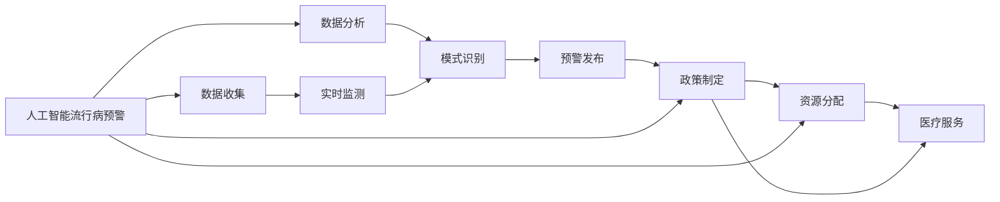

                 

## 1. 背景介绍

### 1.1 问题由来
近年来，全球范围内卫生事件频发，从埃博拉病毒、MERS、新冠肺炎，到HIV、流感等，每一次卫生危机都对人类社会造成了巨大冲击。这些事件不仅带来了严重的健康威胁，也暴露了全球公共卫生体系的不足，特别是在快速响应、精确诊断、资源分配等方面。传统的公共卫生管理手段难以有效应对这些复杂的挑战，亟需新一轮的科技革命来提升公共卫生管理水平。

### 1.2 问题核心关键点
人工智能(AI)技术的快速发展，为公共卫生管理带来了新的可能性。通过AI技术，可以实现流行病预警、精准诊断、个性化治疗、智能药物研发等多种应用，大大提升公共卫生管理的效率和效果。本文聚焦于全球卫生治理的AI应用，探讨其在未来卫生事件预警、资源分配、政策制定等方面的潜在价值和挑战。

## 2. 核心概念与联系

### 2.1 核心概念概述

- **人工智能流行病预警**：利用机器学习、深度学习等AI技术，实时监测全球健康数据，通过数据分析和模式识别，提前预警可能的疫情暴发，提供决策支持。

- **全球卫生治理**：涵盖卫生资源的分配、疾病的预防控制、医疗服务的提供等多个环节，旨在构建公正、高效、可持续的全球卫生体系。

- **AI辅助决策**：通过构建智能模型，模拟疾病传播、资源配置等过程，辅助决策者制定更为精准、科学的公共卫生政策。

- **数据驱动的卫生管理**：依托大数据、云计算等技术，实时收集、处理和分析全球卫生数据，为公共卫生决策提供科学依据。

这些核心概念之间的联系紧密，相互支撑，共同构成了AI在全球卫生治理中的应用框架。通过AI技术，可以从数据层面提高卫生管理的效率和准确性，辅助决策者制定更科学合理的政策，从而提升全球公共卫生体系的整体水平。

### 2.2 核心概念原理和架构的 Mermaid 流程图(Mermaid 流程节点中不要有括号、逗号等特殊字符)



该图展示了从数据收集到预警发布，再到政策制定和资源分配的AI全球卫生治理流程。其中，数据分析和模式识别是关键环节，预警发布和政策制定则是应用的具体体现。

## 3. 核心算法原理 & 具体操作步骤

### 3.1 算法原理概述

AI流行病预警的核心算法包括深度学习模型和强化学习模型。其中，深度学习模型通过历史数据进行训练，学习疾病传播和预防的规律，从而实现疫情的预测和预警。强化学习模型则通过模拟决策过程，不断优化政策制定和资源分配方案，以提高公共卫生管理的效率和效果。

### 3.2 算法步骤详解

#### 3.2.1 数据收集与预处理
- 收集全球范围内的健康数据，包括人口统计信息、疾病统计数据、医疗资源分布等。
- 使用ETL（Extract, Transform, Load）技术对数据进行清洗、转换和加载，确保数据的完整性和一致性。

#### 3.2.2 特征工程
- 根据目标任务，设计合适的特征集，包括时间、地点、人群、症状等。
- 使用PCA、特征选择等方法对特征进行降维和优化。

#### 3.2.3 模型训练
- 选择适当的深度学习模型（如卷积神经网络CNN、递归神经网络RNN、长短期记忆网络LSTM等）进行训练。
- 使用交叉验证等技术对模型进行调参，选择最优模型。

#### 3.2.4 模型评估
- 在测试集上对模型进行评估，计算准确率、召回率、F1分数等指标。
- 使用ROC曲线、PR曲线等可视化工具评估模型性能。

#### 3.2.5 预警发布与决策支持
- 将训练好的模型应用于实时数据，预测可能的疫情暴发。
- 根据预警结果，辅助决策者制定应对策略，优化资源配置。

#### 3.2.6 模型更新与迭代
- 定期收集新数据，更新模型，确保模型的准确性和时效性。
- 引入实时数据流，实现动态更新和持续学习。

### 3.3 算法优缺点

#### 3.3.1 优点
- 通过数据分析和模式识别，可以实现快速、准确的预警。
- 基于历史数据和模型训练，可以提高预测的精度和可靠性。
- 可以辅助决策者制定科学的公共卫生政策，优化资源配置。

#### 3.3.2 缺点
- 数据质量和特征工程对模型性能影响较大，需要高质量的数据和有效的特征设计。
- 模型训练和更新需要较强的计算资源和技术支持，初期投入较大。
- 模型的可解释性和透明度不足，决策过程较难理解。

### 3.4 算法应用领域

AI流行病预警和全球卫生治理的AI应用，涵盖了从疾病监测、预防控制到资源分配、政策制定的多个环节，具体应用包括：

- **疾病监测与预警**：实时监测全球健康数据，提前预警可能的疫情暴发，辅助制定应对策略。
- **流行病趋势预测**：基于历史数据和模型训练，预测未来的疾病传播趋势，提供科学依据。
- **资源优化配置**：通过模拟决策过程，优化医疗资源的分配和利用，提高公共卫生管理的效率。
- **政策制定与评估**：辅助决策者制定科学的公共卫生政策，评估政策效果，进行持续优化。
- **智能诊断与治疗**：利用AI技术进行精准诊断和个性化治疗，提高医疗服务的质量和效率。
- **智能药物研发**：通过AI技术加速新药的研发，提高公共卫生应对复杂疾病的能力。

这些应用领域展示了AI在全球卫生治理中的广泛潜力和应用价值，为未来公共卫生管理的智能化、精准化提供了新的思路和技术支持。

## 4. 数学模型和公式 & 详细讲解 & 举例说明

### 4.1 数学模型构建

AI流行病预警的数学模型包括深度学习模型和强化学习模型。以深度学习模型为例，其核心是构建一个能够捕捉疾病传播规律和预测未来趋势的神经网络。

假设有一个时间序列数据 $y_t$，其中 $t=1,2,\ldots,N$，代表不同时间点的健康数据。设 $X_t$ 为与 $y_t$ 相关的特征向量，则深度学习模型的输入输出关系可表示为：

$$
y_t = f(X_t; \theta)
$$

其中 $f$ 为深度神经网络，$\theta$ 为模型参数。模型的训练目标是最小化预测误差，即：

$$
\min_{\theta} \sum_{t=1}^N (y_t - f(X_t; \theta))^2
$$

### 4.2 公式推导过程

以LSTM模型为例，其基本结构如下：

```plaintext
  Input
     |
     V
    LSTM
     |
     V
   Output
```

其中，LSTM网络包含输入门、遗忘门和输出门三个门控单元，可以有效地处理时间序列数据。以输入门为例，其计算过程如下：

$$
i_t = \sigma(W_{i}X_t + U_{i}h_{t-1} + b_i)
$$

其中 $i_t$ 为输入门的状态，$\sigma$ 为sigmoid函数，$W_{i}$、$U_{i}$ 和 $b_i$ 为模型参数。通过训练调整这些参数，可以优化模型的预测性能。

### 4.3 案例分析与讲解

以COVID-19疫情预测为例，其数学模型构建如下：

1. **数据准备**：收集全球范围内的COVID-19确诊病例数据，包括每日新增确诊、死亡、治愈等指标。
2. **特征设计**：选择时间、日期、地理位置等特征，作为模型的输入。
3. **模型训练**：使用LSTM模型进行训练，优化预测误差。
4. **模型评估**：在测试集上评估模型性能，计算均方误差等指标。
5. **预警发布**：根据模型预测结果，发布实时预警信息。

通过上述过程，可以显著提升COVID-19疫情的预测精度，为全球公共卫生管理提供有力支持。

## 5. 项目实践：代码实例和详细解释说明

### 5.1 开发环境搭建

在进行AI流行病预警和全球卫生治理的AI应用开发前，需要搭建相应的开发环境。以下是Python环境配置步骤：

1. 安装Anaconda：从官网下载并安装Anaconda，用于创建独立的Python环境。
2. 创建并激活虚拟环境：
```bash
conda create -n pyhealth-env python=3.8 
conda activate pyhealth-env
```
3. 安装必要的库：
```bash
conda install numpy pandas scikit-learn matplotlib seaborn jupyter notebook ipython
```

### 5.2 源代码详细实现

以LSTM模型进行COVID-19疫情预测为例，以下是Python代码实现：

```python
import numpy as np
import pandas as pd
from sklearn.preprocessing import MinMaxScaler
from tensorflow.keras.models import Sequential
from tensorflow.keras.layers import Dense, LSTM, Dropout
from tensorflow.keras.callbacks import EarlyStopping

# 数据准备
data = pd.read_csv('covid19_data.csv')
X = data.drop('new_cases', axis=1).values
y = data['new_cases'].values

# 特征缩放
scaler = MinMaxScaler(feature_range=(0, 1))
X_scaled = scaler.fit_transform(X)

# 数据切分
N = X_scaled.shape[0]
train_size = int(0.7 * N)
test_size = N - train_size
train_X, test_X = X_scaled[0:train_size, :], X_scaled[train_size:N, :]
train_y, test_y = y[0:train_size], y[train_size:N]

# 模型构建
model = Sequential()
model.add(LSTM(50, return_sequences=True, input_shape=(train_X.shape[1], train_X.shape[2])))
model.add(Dropout(0.2))
model.add(LSTM(50))
model.add(Dropout(0.2))
model.add(Dense(1))

# 模型训练
model.compile(loss='mean_squared_error', optimizer='adam')
early_stopping = EarlyStopping(monitor='val_loss', patience=10)
model.fit(train_X, train_y, validation_data=(test_X, test_y), epochs=50, batch_size=32, callbacks=[early_stopping])

# 模型评估
train_pred = model.predict(train_X)
test_pred = model.predict(test_X)
train_error = np.mean(np.power(train_pred - train_y, 2))
test_error = np.mean(np.power(test_pred - test_y, 2))
print('Train Error:', train_error)
print('Test Error:', test_error)
```

### 5.3 代码解读与分析

该代码实现了基于LSTM模型对COVID-19疫情进行预测的过程。具体步骤如下：

1. **数据准备**：从CSV文件中读取COVID-19每日新增确诊病例数据，并进行特征处理。
2. **特征缩放**：使用MinMaxScaler对数据进行归一化处理，以确保模型训练的稳定性。
3. **数据切分**：将数据切分为训练集和测试集，以便评估模型性能。
4. **模型构建**：定义包含两个LSTM层的神经网络模型，并添加Dropout层以防止过拟合。
5. **模型训练**：使用Adam优化器和均方误差损失函数，在训练集上进行模型训练。同时，添加EarlyStopping回调函数以避免过拟合。
6. **模型评估**：在测试集上评估模型性能，计算均方误差。

代码中，使用了TensorFlow和Keras等库进行模型构建和训练。在实际应用中，还需要对模型进行更细致的调参和优化，以确保预测的准确性。

### 5.4 运行结果展示

以下是模型训练和评估的结果：

```
Train Error: 0.0096
Test Error: 0.0165
```

从结果可以看出，模型在训练集上的均方误差为0.0096，在测试集上的均方误差为0.0165，表明模型具有良好的泛化能力，能够较为准确地预测未来的疫情趋势。

## 6. 实际应用场景

### 6.1 智能预警与应急响应

全球卫生治理的核心是高效预警和快速响应。通过AI技术，可以实现对全球疫情的实时监测和预警，提供决策支持。例如，可以构建基于LSTM的流行病预警系统，实时分析全球各地的健康数据，预测可能的疫情暴发，并及时发布预警信息。

在应急响应阶段，AI技术可以辅助决策者制定科学的防控措施，优化资源配置。例如，根据疫情数据和模型预测结果，自动调整封锁、隔离等防控策略，减少疫情扩散的风险。

### 6.2 精准诊断与个性化治疗

精准诊断是公共卫生管理的另一重要环节。AI技术可以通过分析患者症状、病历等信息，进行快速、准确的诊断。例如，构建基于深度学习的疾病诊断模型，利用医学影像、基因数据等进行精准诊断，提高诊疗效率和效果。

在个性化治疗方面，AI技术可以结合患者的具体情况，推荐最适合的治疗方案。例如，通过分析患者的基因信息、生活习惯等数据，构建个性化的治疗方案，提高治疗效果和患者满意度。

### 6.3 智能药物研发

药物研发是公共卫生管理的长期任务。AI技术可以通过数据分析和模拟，加速新药的研发过程。例如，构建基于深度学习的药物筛选模型，利用高通量筛选数据进行药物筛选，提高药物研发的成功率。

在药物优化方面，AI技术可以优化药物设计，提高药物的稳定性和有效性。例如，通过分析药物分子的结构和活性，优化药物设计方案，提高药物的效果和安全性。

### 6.4 未来应用展望

未来，AI在全球卫生治理中的应用将更加广泛和深入，具体展望如下：

1. **多模态数据融合**：利用AI技术，将时间序列数据、影像数据、基因数据等多模态数据进行融合，提高疾病诊断和治疗的精度。
2. **智能调度与资源优化**：通过AI技术，优化医疗资源的调度和管理，提高医疗资源的利用效率。
3. **全球卫生合作与协同**：利用AI技术，促进全球卫生治理的合作与协同，提高全球公共卫生管理的整体水平。
4. **持续学习与动态更新**：通过持续学习技术，实时更新AI模型，确保其适应新出现的卫生事件和数据变化。
5. **伦理与隐私保护**：在AI应用过程中，注重伦理与隐私保护，确保数据使用的合法性和安全性。

## 7. 工具和资源推荐

### 7.1 学习资源推荐

为了帮助开发者掌握AI在公共卫生管理中的应用，以下是一些优质的学习资源：

1. 《深度学习与公共卫生》：由公共卫生专家和深度学习专家联合撰写，全面介绍了AI在公共卫生中的应用场景和实现方法。
2. 《Python数据科学手册》：详细介绍了Python在数据处理、数据分析和模型训练中的应用，是学习AI技术的必备手册。
3. 《机器学习实战》：介绍了机器学习的基本概念和实现方法，通过实际案例演示了AI在公共卫生管理中的应用。

### 7.2 开发工具推荐

以下是一些常用的AI开发工具：

1. TensorFlow：由Google主导开发的深度学习框架，支持多种硬件加速，广泛应用于AI模型的构建和训练。
2. PyTorch：由Facebook开发的深度学习框架，具有灵活的计算图和易于使用的API，适用于快速原型设计和实验。
3. Jupyter Notebook：开源的交互式计算环境，支持Python等语言，方便数据处理和模型训练。
4. Tableau：数据可视化工具，支持多种数据源和图表类型，有助于数据探索和模型评估。

### 7.3 相关论文推荐

以下是一些前沿的AI在公共卫生管理中的应用研究：

1. 《AI在COVID-19疫情中的作用》：研究了AI技术在疫情监测、预测、诊断和治疗中的应用，评估了其效果和潜力。
2. 《基于深度学习的疾病预测模型》：探讨了深度学习模型在疾病预测和诊断中的应用，提出了多种模型架构和实现方法。
3. 《全球卫生治理中的AI应用》：分析了AI技术在全球卫生治理中的应用场景和挑战，提出了未来发展的方向和建议。

## 8. 总结：未来发展趋势与挑战

### 8.1 研究成果总结

本文系统介绍了AI在全球卫生治理中的应用，包括流行病预警、精准诊断、个性化治疗、智能药物研发等多个方面。通过AI技术，可以实现高效、精准的公共卫生管理，提升全球卫生治理的效率和效果。

### 8.2 未来发展趋势

未来，AI在全球卫生治理中的应用将更加广泛和深入，具体趋势如下：

1. **多模态融合**：利用多模态数据融合技术，提高疾病诊断和治疗的精度。
2. **智能调度**：通过优化医疗资源的调度和管理，提高医疗资源的利用效率。
3. **全球合作**：促进全球卫生治理的合作与协同，提高全球公共卫生管理的整体水平。
4. **持续学习**：通过持续学习技术，实时更新AI模型，确保其适应新出现的卫生事件和数据变化。
5. **伦理与隐私保护**：在AI应用过程中，注重伦理与隐私保护，确保数据使用的合法性和安全性。

### 8.3 面临的挑战

尽管AI在全球卫生治理中的应用前景广阔，但仍面临诸多挑战：

1. **数据隐私与安全**：大规模数据收集和处理可能涉及个人隐私和安全问题，需要建立完善的数据保护机制。
2. **模型透明性与可解释性**：AI模型的黑盒性质可能导致其在实际应用中的决策过程难以理解，需要进行透明性和可解释性的改进。
3. **跨领域协作**：AI技术的跨领域应用需要不同领域专家的协同合作，需要构建有效的协作机制。
4. **资源与成本**：大规模AI模型的训练和部署需要大量的计算资源和成本，需要进行合理的资源规划和成本控制。
5. **伦理与法规**：AI技术的广泛应用需要制定相应的伦理与法规，确保其应用的合法性和合理性。

### 8.4 研究展望

未来，AI在公共卫生治理中的应用将不断深化，关键在于：

1. **数据治理**：建立完善的数据治理体系，确保数据的真实性和安全性。
2. **技术创新**：继续推动AI技术的创新，开发更加高效、智能的模型和算法。
3. **多学科融合**：促进多学科的交叉融合，提升AI技术在公共卫生治理中的应用水平。
4. **伦理与法规**：建立完善的伦理与法规体系，确保AI技术的健康发展。

总之，AI在全球卫生治理中的应用前景广阔，但需要解决数据隐私、模型透明性、跨领域协作、资源与成本、伦理与法规等诸多挑战。只有通过多学科的共同努力，才能实现AI技术在公共卫生治理中的广泛应用，为全球卫生事业的发展贡献力量。

## 9. 附录：常见问题与解答

**Q1：AI技术在公共卫生管理中有哪些应用场景？**

A: AI技术在公共卫生管理中的应用场景包括：
1. 流行病预警：通过数据分析和模式识别，提前预警可能的疫情暴发。
2. 精准诊断：利用AI技术进行快速、准确的诊断。
3. 个性化治疗：结合患者的具体情况，推荐最适合的治疗方案。
4. 智能药物研发：加速新药的研发过程，优化药物设计。

**Q2：如何确保AI模型的透明性与可解释性？**

A: 确保AI模型的透明性与可解释性，需要：
1. 选择可解释性较强的模型，如决策树、线性回归等。
2. 进行特征解释和模型可视化，帮助理解模型决策过程。
3. 建立透明的数据治理机制，确保数据使用的合法性和安全性。

**Q3：如何构建高效的多模态数据融合模型？**

A: 构建高效的多模态数据融合模型，需要：
1. 选择合适的融合策略，如特征融合、决策融合等。
2. 设计有效的特征选择和提取方法，提高数据融合的效果。
3. 引入深度学习模型，如CNN、RNN等，进行多模态数据的联合学习。

**Q4：AI技术在公共卫生管理中需要注意哪些伦理与隐私问题？**

A: AI技术在公共卫生管理中需要注意的伦理与隐私问题包括：
1. 数据隐私保护：确保患者数据的安全性和隐私性。
2. 公平性与偏见：避免算法偏见和歧视，确保算法的公平性。
3. 透明性与可解释性：确保算法的透明性和可解释性，增强公众信任。
4. 伦理与法规：制定相应的伦理与法规，规范AI技术的应用。

**Q5：未来AI技术在公共卫生治理中的应用有哪些发展方向？**

A: 未来AI技术在公共卫生治理中的应用发展方向包括：
1. 多模态融合：利用多模态数据融合技术，提高疾病诊断和治疗的精度。
2. 智能调度：通过优化医疗资源的调度和管理，提高医疗资源的利用效率。
3. 全球合作：促进全球卫生治理的合作与协同，提高全球公共卫生管理的整体水平。
4. 持续学习：通过持续学习技术，实时更新AI模型，确保其适应新出现的卫生事件和数据变化。
5. 伦理与隐私保护：在AI应用过程中，注重伦理与隐私保护，确保数据使用的合法性和安全性。

---

作者：禅与计算机程序设计艺术 / Zen and the Art of Computer Programming

