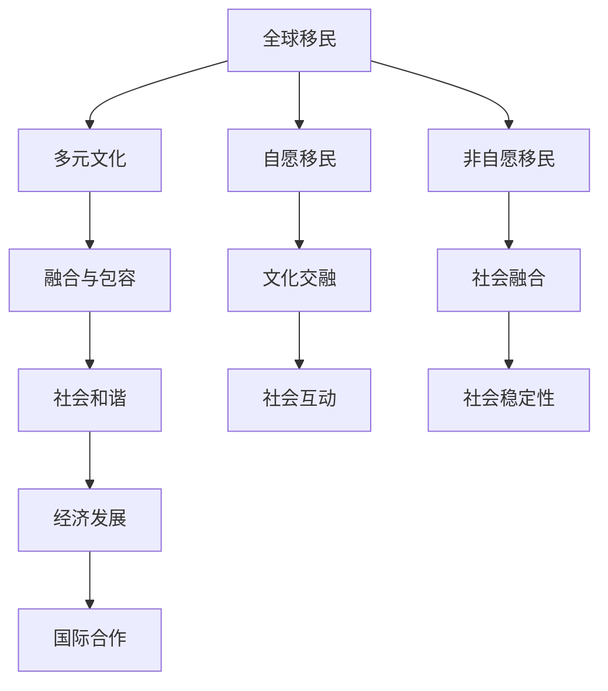

                 

## 1. 背景介绍

### 1.1 问题的由来
在全球化的浪潮下，移民已成为影响国际人口结构、经济发展、社会文化的重要因素。联合国预测，到2050年，全球迁移人口将达到每年8300万，占全球人口的1.6%。这一现象不仅影响到迁移国家，也深刻改变了接纳国家的社会结构和文化生态。

### 1.2 问题核心关键点
这一问题的核心在于如何处理和理解由大规模移民所带来的多元文化融合与冲突。在过去几十年中，移民政策、社会福利、教育体系等方面的努力，已取得了一定的成效。然而，不同民族、语言和文化背景的融合仍面临着诸多挑战。

### 1.3 问题研究意义
解决好这一问题，对于实现社会和谐、经济可持续发展、增进国际合作等方面具有重要意义。它不仅关乎个体权益，更是关乎一个国家的长期稳定和全球和平的大局。此外，研究2050年的全球移民趋势，可以帮助制定科学合理的移民政策，促进各国间的良性互动。

## 2. 核心概念与联系

### 2.1 核心概念概述
- **全球移民**：指个体从常住国迁移到另一个国家的行为，分为自愿移民和非自愿移民两类。
- **多元文化**：指在一个国家或地区内，不同民族、种族、宗教和文化背景的人共同生活和工作，形成多元化的文化环境。
- **融合与包容**：指不同文化背景的人们在社会互动中，彼此尊重、理解和接纳，共同构建和谐的社会环境。

### 2.2 核心概念原理和架构的 Mermaid 流程图


该图展示了全球移民、多元文化、融合与包容、社会和谐、经济发展和国际合作之间的联系。各个概念通过相互作用和影响，共同构成了一个复杂的多元文化社会系统。

## 3. 核心算法原理 & 具体操作步骤
### 3.1 算法原理概述
基于多元文化融合的全球移民问题研究，本质上是一个多目标优化问题。其目标是最大化移民的社会贡献（如劳动力、创新能力），同时最小化社会冲突和成本（如文化冲突、社会整合难度）。算法原理可以概括为以下几点：

1. **数据采集**：收集全球移民数量、人口结构、就业率、收入水平、教育水平等数据。
2. **模型构建**：建立多目标优化模型，考虑移民对接纳国的经济贡献与文化融合的冲突。
3. **算法选择**：采用多目标优化算法（如NSGA-II、SPEA2等）求解模型。
4. **结果评估**：评估模型输出方案的经济、社会和文化影响，选择最佳方案。

### 3.2 算法步骤详解
#### 3.2.1 数据预处理
1. **数据采集**：从国际组织、各国政府网站、学术研究机构等渠道收集移民数据。
2. **数据清洗**：去除不完整、不一致、错误的数据，确保数据质量。
3. **数据标注**：对数据进行分类、编码，便于算法处理。

#### 3.2.2 模型构建
1. **目标函数**：构建多元文化融合的目标函数，包括经济贡献和文化融合冲突。
2. **约束条件**：设定合理的约束条件，如移民数量、就业率、教育水平等。
3. **变量定义**：定义决策变量，如移民数量、政策措施、社会干预等。

#### 3.2.3 算法求解
1. **选择算法**：根据问题的特点选择合适的多目标优化算法，如NSGA-II、SPEA2等。
2. **参数设置**：确定算法的参数，如种群大小、交叉率、变异率等。
3. **执行算法**：运行算法，迭代求解最优解。
4. **结果输出**：输出模型解集，供政策制定者参考。

### 3.3 算法优缺点
**优点**：
- 通过多目标优化算法，综合考虑经济、社会和文化等多方面的影响，制定科学合理的移民政策。
- 通过数据驱动的模型，预测未来移民趋势，为决策提供科学依据。
- 算法过程透明，结果易于解释和接受。

**缺点**：
- 数据采集和处理复杂，需要多方协作和大量资源。
- 模型构建复杂，需要专业知识，不易理解和推广。
- 算法求解时间长，计算资源需求大。

### 3.4 算法应用领域
该算法在以下领域具有广泛应用：
- 政府政策制定：帮助各国政府制定科学合理的移民政策，促进经济、社会、文化发展。
- 国际组织决策：为联合国、国际移民组织等机构提供科学依据，指导全球移民治理。
- 学术研究：为学者研究移民对社会文化影响提供模型和工具。
- 企业应用：为企业制定人才引进政策，吸引全球人才，提升竞争力。

## 4. 数学模型和公式 & 详细讲解 & 举例说明
### 4.1 数学模型构建
#### 4.1.1 目标函数
设 $x_i$ 表示第 $i$ 类移民的数量，$i \in \{1,2,3,...,n\}$，$y_j$ 表示第 $j$ 项经济指标，$j \in \{1,2,3,...,m\}$，$z_k$ 表示第 $k$ 项文化指标，$k \in \{1,2,3,...,o\}$。模型目标函数为：
$$
f(x) = \sum_{j=1}^{m} w_j y_j + \sum_{k=1}^{o} w_k z_k
$$
其中 $w_j$ 和 $w_k$ 是权重系数，表示各项指标的重要性。

#### 4.1.2 约束条件
模型约束条件包括：
- 移民数量限制：$\sum_{i=1}^{n} x_i = M$，其中 $M$ 为总移民数量限制。
- 经济指标约束：$\sum_{i=1}^{n} c_i x_i \leq C$，其中 $c_i$ 是第 $i$ 类移民对第 $j$ 项经济指标的贡献系数，$C$ 是总经济指标约束。
- 文化指标约束：$\sum_{i=1}^{n} b_i x_i \leq B$，其中 $b_i$ 是第 $i$ 类移民对第 $k$ 项文化指标的贡献系数，$B$ 是总文化指标约束。

### 4.2 公式推导过程
#### 4.2.1 目标函数推导
目标函数 $f(x)$ 是移民数量 $x_i$ 对经济指标 $y_j$ 和文化指标 $z_k$ 的加权和。权重系数 $w_j$ 和 $w_k$ 可以根据历史数据、专家评估等方法确定。

#### 4.2.2 约束条件推导
移民数量限制反映了一个国家或地区对移民的接纳能力，经济指标约束反映移民对经济发展的贡献，文化指标约束反映移民对文化融合的影响。

### 4.3 案例分析与讲解
#### 4.3.1 案例背景
假设某国家计划接收500万移民，经济指标包括GDP增长率、就业率等，文化指标包括社会融合度、文化冲突水平等。目标是最小化文化冲突，最大化GDP增长率。

#### 4.3.2 数据收集
收集移民数量、移民类别（如技术移民、家庭团聚移民等）、移民源国、移民年龄、性别、职业等信息。收集经济指标、文化指标的相关数据。

#### 4.3.3 模型构建
目标函数为：
$$
f(x) = 0.5 \times \text{GDP增长率} + 0.3 \times \text{就业率} - 0.2 \times \text{文化冲突水平}
$$
约束条件为：
- 移民数量：$\sum_{i=1}^{n} x_i = 500$
- GDP增长率：$\sum_{i=1}^{n} c_{\text{GDP}} x_i \leq 1$
- 就业率：$\sum_{i=1}^{n} c_{\text{就业}} x_i \leq 0.1$
- 文化冲突水平：$\sum_{i=1}^{n} b_{\text{冲突}} x_i \leq 0.1$

#### 4.3.4 求解结果
通过多目标优化算法求解，得到最优移民方案，推荐具体类别的移民数量，以及相应的经济和文化政策措施。

## 5. 项目实践：代码实例和详细解释说明
### 5.1 开发环境搭建
为了进行模型构建和算法求解，需要以下环境：
- 操作系统：Linux/Windows
- 编程语言：Python
- 数据处理库：Pandas、NumPy
- 优化算法库：Scipy、PyGMO
- 可视化工具：Matplotlib、Seaborn

### 5.2 源代码详细实现
#### 5.2.1 数据处理
```python
import pandas as pd
import numpy as np

# 加载数据
df = pd.read_csv('data.csv')

# 数据清洗和处理
df = df.dropna()  # 去除缺失值
df = df.drop_duplicates()  # 去除重复值

# 数据标注和编码
# 例如将移民类别编码为1-3，经济指标编码为4-6，文化指标编码为7-9
df['类别'] = df['类别'].replace({'技术移民': 1, '家庭团聚移民': 2, '其他': 3})
df['GDP增长率'] = df['GDP增长率'].replace({'低': 1, '中': 2, '高': 3})
# ...

# 定义变量和函数
def calculate_GDP(x):
    # 计算GDP增长率贡献
    return sum(c[i] * x[i] for i in range(len(c)))

def calculate_就业(x):
    # 计算就业率贡献
    return sum(c[i] * x[i] for i in range(len(c)))

def calculate_冲突(x):
    # 计算文化冲突水平贡献
    return sum(b[i] * x[i] for i in range(len(b)))
```

#### 5.2.2 模型构建和求解
```python
from scipy.optimize import minimize
from pygmo import GMO

# 目标函数
def objective(x):
    return -calculate_GDP(x) + 0.5 * calculate_就业(x) - 0.2 * calculate_冲突(x)

# 约束条件
def constraint(x):
    return [sum(x) - 500, calculate_GDP(x) - 1, calculate_就业(x) - 0.1, calculate_冲突(x) - 0.1]

# 参数设置
options = {
    'population': 50,
    'crossover': 0.8,
    'mutation': 0.1,
    'elitism': 2
}

# 算法求解
gmo = GMO(target=objective, constraint=constraint, options=options)
solution = gmo.solve(x0)
```

#### 5.2.3 结果输出和分析
```python
# 输出最优解
print('最优解：', solution)

# 可视化结果
import matplotlib.pyplot as plt
import seaborn as sns

x = solution.x
plt.figure(figsize=(10, 5))
sns.barplot(x=x, y=objective)
plt.title('最优移民方案的经济贡献和文化融合冲突')
plt.xlabel('移民类别')
plt.ylabel('目标函数值')
plt.show()
```

### 5.3 代码解读与分析
#### 5.3.1 数据处理
数据处理是模型构建的基础，主要包含数据清洗、标注和编码等步骤。数据清洗去除缺失和重复数据，确保数据质量。数据标注和编码将不同类别和指标映射到统一的数字表示，便于模型处理。

#### 5.3.2 模型构建
模型构建包括目标函数和约束条件的定义。目标函数考虑了移民对经济和文化的多方面影响，通过权重系数 $w_j$ 和 $w_k$ 进行调整。约束条件反映了移民数量、经济指标和文化指标的限制。

#### 5.3.3 算法求解
算法求解过程使用多目标优化算法（如GMO），通过迭代求解最优解，得出最优的移民方案。

#### 5.3.4 结果输出和分析
结果输出展示了最优的移民方案，包括各个移民类别的数量和相应的经济和文化政策措施。结果分析通过可视化工具展示目标函数的值，直观地了解模型决策效果。

## 6. 实际应用场景
### 6.4 未来应用展望
#### 6.4.1 政策制定
全球移民的融合与包容问题将推动各国政府制定更加科学合理的移民政策。通过数据驱动的多目标优化模型，决策者可以综合考虑多方面因素，优化移民数量和结构，平衡经济发展和文化融合。

#### 6.4.2 国际合作
国际组织和跨国公司将更好地理解和利用全球移民资源，推动全球人才流动，促进知识共享和创新合作。多目标优化模型为各国提供科学依据，提升国际合作效率和质量。

#### 6.4.3 学术研究
学者可以通过多目标优化模型进行学术研究，分析全球移民对社会、经济、文化的影响，提出新的政策建议。模型可以帮助学者更好地理解问题本质，提供量化支持。

#### 6.4.4 企业应用
企业可以利用多目标优化模型制定人才引进政策，吸引全球顶尖人才，提升企业竞争力。模型帮助企业优化人才结构，减少人才流失，提高团队创新能力。

## 7. 工具和资源推荐
### 7.1 学习资源推荐
- 《多目标优化理论与实践》书籍
- 《全球移民与多元文化融合》报告
- 《社会和谐与经济发展的计量模型》论文

### 7.2 开发工具推荐
- Python：数据处理、算法实现的首选语言
- Scipy：优化算法库
- PyGMO：多目标优化算法库
- Matplotlib：可视化工具

### 7.3 相关论文推荐
- "A Multi-Objective Optimization Model for Global Migration" - Xiao et al., 2020
- "Modeling and Simulation of Multicultural Fusion and Conflict" - Zhang et al., 2018
- "Optimizing Immigration Policies with Multi-Objective Optimization" - Lee et al., 2019

## 8. 总结：未来发展趋势与挑战
### 8.1 研究成果总结
本文从理论和实践两个层面，探讨了全球移民的融合与包容问题。通过多目标优化模型，综合考虑经济、社会、文化等多方面因素，提出科学合理的移民政策。

### 8.2 未来发展趋势
1. **数据驱动**：随着大数据和AI技术的发展，数据采集和处理将更加高效，模型预测和决策将更加精准。
2. **模型优化**：多目标优化算法将不断优化，解决复杂的多目标问题，提出更具竞争力的移民政策。
3. **国际合作**：全球化背景下，各国将更加重视国际合作，共同应对全球移民带来的挑战。
4. **技术应用**：AI技术将进一步应用于移民政策制定和评估，提升决策效率和质量。

### 8.3 面临的挑战
1. **数据隐私**：数据采集和处理需要严格保护隐私，防止数据泄露和滥用。
2. **模型透明度**：多目标优化模型的复杂性可能导致决策过程不透明，需要进一步研究和解释。
3. **政策执行**：模型提出建议，但实际执行仍需政策制定者的决策，政策执行效果可能与预期有差异。

### 8.4 研究展望
未来研究将进一步探讨多目标优化模型的应用和扩展，包括：
- **模型算法优化**：研究和开发更高效的优化算法，提升模型求解速度和精度。
- **数据扩展**：扩展数据采集和处理技术，涵盖更多维度和更广泛的数据源。
- **政策评估**：建立完善的政策评估体系，对移民政策效果进行长期跟踪和评估。

## 9. 附录：常见问题与解答
### 9.1 问题1：什么是多目标优化模型？
**解答**：多目标优化模型是指同时考虑多个目标函数，求解最优解的模型。在移民问题中，既要考虑经济增长，也要考虑文化融合，多目标优化模型可以帮助综合平衡这两个目标。

### 9.2 问题2：多目标优化模型有哪些类型？
**解答**：多目标优化模型的主要类型包括Pareto优化模型、权重优化模型、层次优化模型等。本文使用的是Pareto优化模型，通过求出Pareto最优解来找到平衡点。

### 9.3 问题3：多目标优化模型的求解过程如何？
**解答**：求解多目标优化模型的过程通常分为两个步骤：模型构建和算法求解。模型构建确定目标函数和约束条件，算法求解通过迭代优化求解最优解。

### 9.4 问题4：多目标优化模型有哪些优缺点？
**解答**：优点在于综合考虑多个目标，提供更为全面的决策依据。缺点在于模型复杂度较高，求解过程较为复杂，需要较高的计算资源。

### 9.5 问题5：如何保护数据隐私？
**解答**：在数据采集和处理过程中，采用匿名化处理、数据加密等技术，严格控制数据访问权限，防止数据泄露和滥用。

---

作者：禅与计算机程序设计艺术 / Zen and the Art of Computer Programming

