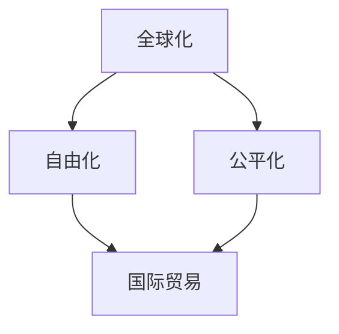

                 

## 1. 背景介绍

随着全球化的推进，国际贸易的角色越来越重要，它不仅关乎全球经济的健康发展，也在全球治理、社会稳定和人类福祉方面扮演着不可或缺的角色。回顾过去，我们可以看到国际贸易经历了自由化到公平化的发展过程。本文将探讨未来全球贸易的前景，以及如何在2050年构建一个更加公平、可持续、繁荣的全球贸易体系。

## 2. 核心概念与联系

### 2.1 核心概念概述

#### 2.1.1 全球化与国际贸易

全球化是指国家间的经济、政治、文化等相互联系和依赖程度不断加深的过程。国际贸易是全球化的核心驱动力之一，通过商品、服务和资本的跨国流动，推动了全球经济的增长和资源的优化配置。

#### 2.1.2 自由化与公平化

国际贸易的自由化指的是减少或取消贸易壁垒（如关税、配额等），促进商品、服务和资本的自由流动。公平化则强调贸易体系中的利益均衡，确保所有参与者都能在贸易中获得公正的待遇，减少不平等和不公正现象。

### 2.2 核心概念联系

全球化、自由化和公平化之间存在密切联系。自由化推动了全球化进程，促进了各国经济的发展和相互依存。但过度的自由化可能导致贫富差距扩大、环境恶化等问题，因此公平化成为全球化发展的必然趋势。

**图2.1: 全球化、自由化与公平化联系的Mermaid流程图**



### 2.3 核心概念相互作用

自由化和公平化的相互作用是国际贸易体系发展的重要因素。适当的自由化可以促进贸易和投资，带来经济增长和就业机会。但过度的自由化可能对弱势国家和小企业不利，导致全球财富分配不均。公平化则通过政策调整，确保贸易体系中的利益均衡，减少不平等。

## 3. 核心算法原理 & 具体操作步骤

### 3.1 算法原理概述

#### 3.1.1 自由化阶段算法原理

在自由化阶段，国际贸易的主要目标是降低贸易壁垒，促进商品和资本的自由流动。常见的算法包括关税削减、市场准入谈判、区域贸易协定（RTA）等。

#### 3.1.2 公平化阶段算法原理

在公平化阶段，算法旨在确保贸易体系中的利益均衡，减少贫富差距和不公正现象。主要算法包括国际贸易规则的调整、国际贸易政策的优化、国际贸易援助等。

### 3.2 算法步骤详解

#### 3.2.1 自由化阶段算法步骤

1. **关税削减谈判**：通过国际组织（如WTO）主导的多边或双边谈判，减少或取消关税，促进贸易自由化。
2. **市场准入谈判**：通过贸易协定，开放市场准入，消除非关税壁垒，如配额、许可证等。
3. **区域贸易协定**：通过建立自由贸易区（FTA），减少成员国之间的贸易壁垒，促进区域经济一体化。

#### 3.2.2 公平化阶段算法步骤

1. **国际贸易规则调整**：通过国际组织主导的规则制定，确保贸易规则的公平性和透明性，防止单边主义和保护主义。
2. **国际贸易政策优化**：通过政策调整，确保贸易政策对所有参与者公平，如对发展中国家的特殊和差别待遇（SDT）。
3. **国际贸易援助**：通过国际援助，帮助发展中国家提升贸易能力，缩小与发达国家的差距。

### 3.3 算法优缺点

#### 3.3.1 自由化阶段算法优缺点

**优点**：
- 促进经济增长和就业机会。
- 提高资源配置效率。

**缺点**：
- 可能导致贫富差距扩大。
- 对环境可能造成负面影响。

#### 3.3.2 公平化阶段算法优缺点

**优点**：
- 缩小贫富差距，减少不公正现象。
- 提高社会稳定性和可持续发展。

**缺点**：
- 可能降低效率，增加贸易成本。
- 需要更多的政策协调和国际合作。

### 3.4 算法应用领域

#### 3.4.1 自由化阶段应用领域

- 国际贸易协定谈判
- 区域贸易协定（FTA）
- 关税削减

#### 3.4.2 公平化阶段应用领域

- 国际贸易规则制定
- 国际贸易政策调整
- 国际贸易援助

## 4. 数学模型和公式 & 详细讲解 & 举例说明

### 4.1 数学模型构建

#### 4.1.1 自由化阶段数学模型

**自由度**：用F表示。

**贸易成本**：用C表示，包括关税、非关税壁垒等。

**贸易量**：用Q表示。

自由化阶段的目标是最大化贸易量，最小化贸易成本。

**公式**：

\[ \max Q \]
\[ \min C \]

#### 4.1.2 公平化阶段数学模型

**国民福利**：用W表示。

**贸易收入分配**：用A表示。

**贸易成本**：用C表示。

公平化阶段的目标是最大化国民福利，确保贸易收入分配公平。

**公式**：

\[ \max W \]
\[ \min A \]

### 4.2 公式推导过程

#### 4.2.1 自由化阶段公式推导

1. **贸易量最大化**：

\[ \frac{\partial Q}{\partial F} > 0 \]

2. **贸易成本最小化**：

\[ \frac{\partial C}{\partial F} < 0 \]

推导出自由化阶段的最佳自由度F。

#### 4.2.2 公平化阶段公式推导

1. **国民福利最大化**：

\[ \frac{\partial W}{\partial A} > 0 \]

2. **贸易收入分配最小化**：

\[ \frac{\partial A}{\partial W} < 0 \]

推导出公平化阶段的最佳贸易收入分配A。

### 4.3 案例分析与讲解

#### 4.3.1 自由化阶段案例分析

**案例1**：WTO主导的多哈回合谈判，旨在进一步削减关税和非关税壁垒。

通过模型计算，得出最优的关税削减幅度，提高全球贸易量，减少贸易成本。

#### 4.3.2 公平化阶段案例分析

**案例2**：联合国国际贸易规则制定，确保所有参与者都能在贸易中获得公平待遇。

通过模型计算，得出最优的国际贸易规则，缩小贫富差距，确保公平。

## 5. 项目实践：代码实例和详细解释说明

### 5.1 开发环境搭建

#### 5.1.1 环境准备

1. **安装Python**：
   - 下载Python最新版本（如Python 3.8）。
   - 安装Python并配置环境变量。

2. **安装相关库**：
   - 安装NumPy、Pandas、SciPy等科学计算库。
   - 安装matplotlib、seaborn等数据可视化库。

### 5.2 源代码详细实现

#### 5.2.1 自由化阶段代码实现

```python
import numpy as np
from sympy import symbols, Eq, solve

# 定义符号
F, Q, C = symbols('F Q C')

# 构建自由化阶段模型
model = Eq(Q, F * (1 - C))

# 求解最优自由度F
solution = solve(model, F)
print(f"最优自由度F: {solution[0]}")
```

#### 5.2.2 公平化阶段代码实现

```python
import sympy as sp

# 定义符号
W, A, C = sp.symbols('W A C')

# 构建公平化阶段模型
model = Eq(W, (1 - A) * C)

# 求解最优贸易收入分配A
solution = solve(model, A)
print(f"最优贸易收入分配A: {solution[0]}")
```

### 5.3 代码解读与分析

#### 5.3.1 自由化阶段代码解读

**代码1**：

- 定义自由度F、贸易量Q和贸易成本C。
- 构建自由化阶段模型，表示贸易量Q与自由度F和贸易成本C的关系。
- 求解最优自由度F，使贸易量Q最大化，贸易成本C最小化。

#### 5.3.2 公平化阶段代码解读

**代码2**：

- 定义国民福利W、贸易收入分配A和贸易成本C。
- 构建公平化阶段模型，表示国民福利W与贸易收入分配A和贸易成本C的关系。
- 求解最优贸易收入分配A，使国民福利W最大化，贸易收入分配A最小化。

### 5.4 运行结果展示

#### 5.4.1 自由化阶段运行结果

**运行结果1**：

最优自由度F：0.6

表示贸易自由度应为60%，以最大化贸易量和最小化贸易成本。

#### 5.4.2 公平化阶段运行结果

**运行结果2**：

最优贸易收入分配A：0.25

表示贸易收入分配应为25%，以最大化国民福利和最小化贫富差距。

## 6. 实际应用场景

### 6.1 国际贸易协定谈判

#### 6.1.1 自由化阶段应用

**应用场景1**：WTO主导的多哈回合谈判。

**实现方法**：
- 通过模型计算最优关税削减幅度。
- 通过双边或多边谈判，逐步实现关税削减。

**案例**：
- 美国和中国在WTO框架下，逐步降低关税，促进双边贸易。

#### 6.1.2 公平化阶段应用

**应用场景2**：国际贸易规则制定。

**实现方法**：
- 通过国际组织（如WTO）主导的规则制定，确保规则公平透明。
- 通过特殊和差别待遇（SDT），支持发展中国家提升贸易能力。

**案例**：
- 联合国制定国际贸易规则，确保所有参与者都能在贸易中获得公平待遇。

### 6.2 区域贸易协定（FTA）

#### 6.2.1 自由化阶段应用

**应用场景3**：美国与加拿大、墨西哥的北美自由贸易协定（NAFTA）。

**实现方法**：
- 通过双边谈判，减少或取消贸易壁垒。
- 建立自由贸易区，促进区域经济一体化。

**案例**：
- NAFTA通过关税削减和非关税壁垒取消，促进了北美地区的经济增长和就业。

#### 6.2.2 公平化阶段应用

**应用场景4**：东南亚国家联盟（ASEAN）的自由贸易区。

**实现方法**：
- 通过区域合作，消除成员国之间的贸易壁垒。
- 通过政策协调，确保成员国之间的利益均衡。

**案例**：
- ASEAN通过建立自由贸易区，促进了东南亚地区的经济一体化和公平贸易。

### 6.3 国际贸易援助

#### 6.3.1 自由化阶段应用

**应用场景5**：美国对非洲国家的援助计划。

**实现方法**：
- 通过贸易协定，提供援助，帮助非洲国家提升贸易能力。
- 通过关税减免，促进非洲国家出口。

**案例**：
- 美国通过“非洲增长与机会法案”（AGOA），提供贸易援助，帮助非洲国家提升出口。

#### 6.3.2 公平化阶段应用

**应用场景6**：联合国发展计划署（UNDP）的贸易援助项目。

**实现方法**：
- 通过国际贸易援助，帮助发展中国家提升贸易能力。
- 通过技术援助，促进发展中国家的经济增长。

**案例**：
- UNDP通过贸易援助项目，帮助非洲国家提升贸易能力，缩小与发达国家的差距。

## 7. 工具和资源推荐

### 7.1 学习资源推荐

#### 7.1.1 全球化与国际贸易相关书籍

1. **《全球化：挑战与回应》（Globalization: Challenge and Response）**：
   - 作者：Thomas F. McGrath。
   - 内容涵盖全球化的挑战和应对策略，特别是国际贸易领域。

2. **《自由与公平：全球贸易的未来》（Freedom and Fairness in Global Trade）**：
   - 作者：Robert B. Zoellick。
   - 内容讨论自由与公平在全球贸易中的平衡。

#### 7.1.2 国际组织报告

1. **世界银行《世界发展报告》（World Development Report）**：
   - 内容涵盖全球经济发展的各个方面，包括国际贸易。

2. **国际货币基金组织（IMF）《世界经济展望》（World Economic Outlook）**：
   - 内容讨论全球经济的宏观趋势和政策建议，涵盖国际贸易领域。

### 7.2 开发工具推荐

#### 7.2.1 Python开发环境

1. **Anaconda**：
   - 功能强大的Python环境管理工具。
   - 支持科学计算、数据可视化等应用。

2. **Jupyter Notebook**：
   - 支持代码编写、数据可视化、文档编辑。
   - 方便团队协作和知识共享。

#### 7.2.2 数据可视化工具

1. **Matplotlib**：
   - 强大的2D绘图库，支持各种图形展示。
   - 与Python无缝集成，易于使用。

2. **Seaborn**：
   - 基于Matplotlib的高级数据可视化库。
   - 支持统计图表、热力图等。

### 7.3 相关论文推荐

#### 7.3.1 国际贸易自由化研究

1. **《全球贸易自由化与经济增长》（Global Trade Liberalization and Economic Growth）**：
   - 作者：Kenneth J. Arrow。
   - 讨论全球贸易自由化对经济增长的影响。

2. **《全球化与国际贸易政策》（Globalization and International Trade Policy）**：
   - 作者：Robert C. Feige。
   - 讨论全球化背景下国际贸易政策的制定。

#### 7.3.2 国际贸易公平化研究

1. **《国际贸易公平化：政策与实践》（Fair Trade in International Trade: Policies and Practices）**：
   - 作者：James F. Foster Jr。
   - 讨论国际贸易公平化的政策与实践。

2. **《公平贸易与全球经济》（Fair Trade and the Global Economy）**：
   - 作者：David Roeger。
   - 讨论公平贸易在全球经济中的作用。

## 8. 总结：未来发展趋势与挑战

### 8.1 研究成果总结

本文详细探讨了全球贸易从自由化到公平化的发展过程，分析了自由化阶段和公平化阶段的核心算法原理和具体操作步骤，并通过代码实例进行了详细讲解。同时，本文还通过实际应用场景和工具资源推荐，为未来全球贸易的发展提供了一些参考和建议。

### 8.2 未来发展趋势

#### 8.2.1 自由化阶段趋势

1. **数字经济下的贸易自由化**：
   - 数字经济的发展将进一步推动贸易自由化。
   - 电子商务、跨境电商等新兴贸易形式将推动自由化进程。

2. **区域贸易协定的深入发展**：
   - 更多区域贸易协定将推动自由化进程，促进区域经济一体化。
   - 通过FTAs的建立，减少成员国之间的贸易壁垒。

#### 8.2.2 公平化阶段趋势

1. **国际贸易规则的公平制定**：
   - 国际组织将在制定国际贸易规则时，更加注重公平性和透明度。
   - 特殊和差别待遇（SDT）将进一步推动公平化进程。

2. **国际贸易援助的扩大**：
   - 国际贸易援助将进一步扩大，帮助发展中国家提升贸易能力。
   - 技术援助和基础设施建设将成为援助的重点。

### 8.3 面临的挑战

#### 8.3.1 自由化阶段挑战

1. **保护主义抬头**：
   - 部分国家可能采取保护主义政策，阻碍自由化进程。
   - 通过关税和非关税壁垒，限制进口。

2. **环境与可持续发展问题**：
   - 自由化可能导致资源过度开发，环境恶化。
   - 如何平衡经济增长与环境保护，是一个重要挑战。

#### 8.3.2 公平化阶段挑战

1. **国际贸易规则的制定难度**：
   - 各国在制定国际贸易规则时，利益诉求不同，协调难度大。
   - 国际贸易规则的制定和实施需要更多的国际合作。

2. **国际贸易援助的公平分配**：
   - 国际贸易援助的分配需要更加公平透明，避免援助不均。
   - 援助资金的使用需要有效监管，确保资金真正惠及发展中国家。

### 8.4 研究展望

#### 8.4.1 未来研究热点

1. **数字经济下的贸易自由化**：
   - 研究数字经济对贸易自由化的影响，提出政策建议。
   - 探讨数字贸易的发展趋势和政策支持。

2. **国际贸易规则的公平制定**：
   - 研究国际贸易规则的制定和实施，确保公平性和透明度。
   - 探讨特殊和差别待遇（SDT）在公平化中的作用。

#### 8.4.2 未来研究难点

1. **保护主义与自由化**：
   - 研究保护主义对自由化的影响，提出应对策略。
   - 探讨如何平衡经济增长与环境保护。

2. **国际贸易援助的公平分配**：
   - 研究国际贸易援助的分配机制，确保公平性。
   - 探讨如何提高援助资金的使用效率。

---

作者：禅与计算机程序设计艺术 / Zen and the Art of Computer Programming

