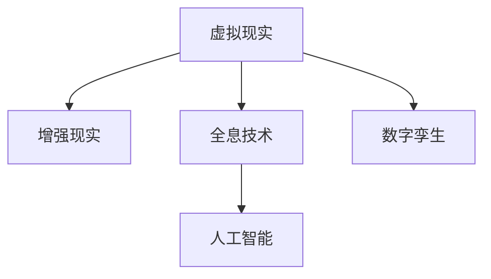

                 

## 1. 背景介绍

在数字时代，人工智能、虚拟现实、全息技术等新兴技术正在深刻改变着我们的生活方式和娱乐方式。未来，我们将在虚拟直播、全息互动表演、数字孪生剧场等多个维度上，看到数字创意娱乐的全新可能性。本篇文章将围绕这些前沿技术，探讨2050年数字创意娱乐的发展方向和应用场景。

### 1.1 数字创意娱乐的背景

数字创意娱乐是指将数字技术应用于娱乐产业，通过虚拟现实、增强现实、全息投影、人工智能等技术手段，创造沉浸式、互动性强的娱乐体验。从虚拟直播到全息互动表演，再到数字孪生剧场，这些技术正在推动娱乐形式的多样化，重新定义了人们的生活体验。

### 1.2 数字创意娱乐的发展历程

从早期的电子游戏、数字音乐到如今的虚拟现实、全息互动表演，数字创意娱乐已经经历了多次迭代，逐步从平面媒介转向立体体验。20世纪90年代，虚拟现实技术初步萌芽，人们开始尝试在数字空间中进行模拟体验。随着硬件和软件技术的不断进步，数字创意娱乐开始向更加沉浸、互动的方向发展。

### 1.3 数字创意娱乐的未来展望

展望未来，数字创意娱乐将走向更加沉浸、个性化、交互式的方向。通过虚拟现实、全息技术等手段，数字创意娱乐将提供全新的观赏体验，满足人们日益增长的精神文化需求。此外，随着5G、物联网等技术的普及，数字创意娱乐将进一步融入现实世界，成为人们生活的一部分。

## 2. 核心概念与联系

### 2.1 核心概念概述

为了更好地理解数字创意娱乐，本节将介绍几个关键概念：

- **虚拟现实(Virtual Reality, VR)**：利用计算机技术生成一个模拟环境，让用户能够在虚拟空间中进行沉浸式互动。
- **增强现实(Augmented Reality, AR)**：将虚拟信息叠加到现实世界中，通过增强现实技术提供交互式体验。
- **全息技术(Holography)**：利用3D图像生成技术，将物体以立体形式展现，实现三维可视化。
- **人工智能(Artificial Intelligence, AI)**：通过机器学习、深度学习等技术，使计算机具备一定的智能，能够模拟人类行为。
- **数字孪生(Digital Twin)**：通过虚拟与现实的双向映射，构建虚拟世界与物理世界之间的桥梁，实现全生命周期管理。

这些核心概念之间的关系可以通过以下Mermaid流程图来展示：



这个流程图展示了虚拟现实、增强现实、全息技术、人工智能和数字孪生之间的关系：

1. 虚拟现实是基础，通过生成虚拟环境，为增强现实和全息技术提供平台。
2. 增强现实在虚拟现实的基础上，通过虚拟信息的叠加，增强现实体验。
3. 全息技术利用3D可视化，使虚拟现实和增强现实更加立体。
4. 人工智能提供了智能化的交互方式，提升用户体验。
5. 数字孪生通过虚拟与现实的结合，实现全生命周期管理。

这些核心概念共同构成了数字创意娱乐的技术基础，使得我们能够实现沉浸式、互动性的娱乐体验。

## 3. 核心算法原理 & 具体操作步骤

### 3.1 算法原理概述

数字创意娱乐的核心算法原理主要基于虚拟现实、增强现实、全息技术和人工智能等技术手段。这些技术通过模拟、增强和重构现实世界，创造全新的娱乐体验。

虚拟现实通过生成三维空间，使用户能够在虚拟环境中自由移动和交互。增强现实则通过虚拟信息的叠加，增强用户对现实世界的感知。全息技术利用3D可视化，使虚拟现实和增强现实更加立体。人工智能通过模拟人类行为，实现智能化的互动和体验。

### 3.2 算法步骤详解

数字创意娱乐的实现涉及多个步骤，包括内容创作、体验设计、技术实现和用户体验优化。

#### 3.2.1 内容创作

内容创作是数字创意娱乐的基础。需要根据不同的应用场景，创作虚拟空间、虚拟角色、虚拟物品等内容。

- **虚拟空间创作**：使用3D建模软件，创建虚拟场景，包括建筑、自然环境等。
- **虚拟角色设计**：设计虚拟角色的外观、动作和行为逻辑，使用动画软件进行制作。
- **虚拟物品创作**：设计虚拟物品的形态、材质和交互方式，使用3D建模软件进行创作。

#### 3.2.2 体验设计

体验设计是实现数字创意娱乐的核心环节。需要根据不同的应用场景，设计用户交互方式和娱乐体验。

- **互动方式设计**：设计用户与虚拟环境的交互方式，包括点击、拖拽、语音交互等。
- **游戏规则设计**：设计游戏规则和任务目标，使用户能够在虚拟环境中进行互动。
- **情感体验设计**：设计情感元素和音效，增强用户的沉浸感和情感共鸣。

#### 3.2.3 技术实现

技术实现是将内容创作和体验设计转化为可用的数字创意娱乐产品的过程。

- **虚拟现实技术实现**：使用VR头盔、VR控制器等设备，实现虚拟现实体验。
- **增强现实技术实现**：使用AR眼镜、AR移动设备等，实现增强现实体验。
- **全息技术实现**：使用全息投影设备，实现全息投影体验。
- **人工智能技术实现**：使用深度学习、自然语言处理等技术，实现智能化的互动和体验。

#### 3.2.4 用户体验优化

用户体验优化是确保数字创意娱乐产品能够满足用户需求的关键步骤。

- **用户反馈收集**：通过问卷调查、用户访谈等方式，收集用户反馈和建议。
- **体验迭代优化**：根据用户反馈，不断优化用户体验，提升产品的吸引力和趣味性。
- **技术升级更新**：根据技术进步，升级产品的技术实现，提升用户体验和性能。

### 3.3 算法优缺点

数字创意娱乐的算法原理和技术实现具有以下优缺点：

#### 3.3.1 优点

1. **沉浸式体验**：通过虚拟现实和增强现实技术，创造沉浸式、互动性强的娱乐体验。
2. **个性化定制**：用户可以根据自己的喜好，选择不同的虚拟空间、虚拟角色和虚拟物品，实现个性化体验。
3. **互动性强**：通过人工智能技术，实现智能化的互动和体验，增强用户参与感。
4. **创新性强**：数字创意娱乐技术不断发展，为娱乐形式带来了更多的可能性。

#### 3.3.2 缺点

1. **硬件成本高**：虚拟现实、增强现实、全息技术等设备较为昂贵，用户门槛较高。
2. **内容制作复杂**：虚拟空间、虚拟角色和虚拟物品的制作过程较为复杂，需要较高专业技能。
3. **技术实现难度大**：数字创意娱乐涉及多种技术的融合，技术实现难度较大。
4. **用户体验有限**：目前数字创意娱乐技术还处于发展初期，用户体验和内容丰富度有待提升。

### 3.4 算法应用领域

数字创意娱乐技术已经应用于多个领域，包括虚拟直播、全息互动表演、数字孪生剧场等。

#### 3.4.1 虚拟直播

虚拟直播是指通过虚拟现实、增强现实等技术手段，将现实世界中的场景重现于虚拟空间中。

- **应用场景**：演唱会、体育赛事、教育培训等。
- **技术实现**：使用VR头盔、VR控制器等设备，将主播和观众置于虚拟空间中。
- **用户体验**：观众能够自由移动，与主播进行互动，增强参与感和沉浸感。

#### 3.4.2 全息互动表演

全息互动表演是指通过全息投影技术，将虚拟角色和物品投射到现实世界中，实现互动性强的表演体验。

- **应用场景**：主题公园、展览馆、文化活动等。
- **技术实现**：使用全息投影设备，将虚拟角色和物品投射到现实空间中。
- **用户体验**：观众能够与虚拟角色进行互动，增强表演的趣味性和沉浸感。

#### 3.4.3 数字孪生剧场

数字孪生剧场是指通过数字孪生技术，创建虚拟剧场，实现全生命周期的剧场管理。

- **应用场景**：剧院管理、剧场排练、演出策划等。
- **技术实现**：使用数字孪生技术，创建虚拟剧场，实现剧院和剧场的多维度管理。
- **用户体验**：剧场管理团队能够通过虚拟剧场进行排练和演出策划，提高管理效率。

## 4. 数学模型和公式 & 详细讲解 & 举例说明

### 4.1 数学模型构建

数字创意娱乐的数学模型主要基于虚拟现实、增强现实、全息技术和人工智能等技术手段。这些技术通过模拟、增强和重构现实世界，创造全新的娱乐体验。

- **虚拟现实**：通过生成三维空间，使用户能够在虚拟环境中自由移动和交互。
- **增强现实**：通过虚拟信息的叠加，增强用户对现实世界的感知。
- **全息技术**：利用3D可视化，使虚拟现实和增强现实更加立体。
- **人工智能**：通过模拟人类行为，实现智能化的互动和体验。

### 4.2 公式推导过程

#### 4.2.1 虚拟现实模型

虚拟现实模型主要基于三维坐标系和用户交互位置。

- **用户位置**：$(x,y,z)$
- **虚拟场景**：三维坐标系中的虚拟物体和场景。

**示例**：在虚拟空间中，用户可以通过控制器操作，实现移动和交互。

#### 4.2.2 增强现实模型

增强现实模型主要基于虚拟信息叠加和现实世界传感器。

- **虚拟信息**：虚拟图像、文字、音效等。
- **现实世界传感器**：摄像头、位置传感器等。

**示例**：在现实空间中，用户通过AR眼镜查看虚拟信息，并与现实世界互动。

#### 4.2.3 全息技术模型

全息技术模型主要基于3D图像生成和投影技术。

- **3D图像**：虚拟角色的三维模型。
- **投影设备**：全息投影仪。

**示例**：全息投影仪将虚拟角色投影到现实空间中，实现三维可视化。

#### 4.2.4 人工智能模型

人工智能模型主要基于深度学习、自然语言处理等技术。

- **深度学习**：用于训练虚拟角色和物品的行为逻辑。
- **自然语言处理**：用于生成虚拟角色的对话和情感表达。

**示例**：通过深度学习模型训练虚拟角色的行为逻辑，使其能够根据用户的行为和语境进行互动。

### 4.3 案例分析与讲解

**案例1：虚拟直播**

**背景**：某演唱会采用虚拟直播技术，将歌手和观众置于虚拟空间中。

**技术实现**：
- **虚拟空间创建**：使用3D建模软件创建演唱会现场。
- **虚拟角色设计**：设计歌手的虚拟形象和行为逻辑。
- **虚拟物品创作**：设计舞台、观众席等虚拟物品。

**效果**：
- **沉浸式体验**：观众能够自由移动，与歌手进行互动。
- **个性化定制**：观众可以选择不同的虚拟空间和虚拟物品，实现个性化体验。

**案例2：全息互动表演**

**背景**：某主题公园采用全息互动表演技术，将虚拟角色和物品投射到现实空间中。

**技术实现**：
- **全息投影设备**：使用全息投影仪，将虚拟角色投射到现实空间中。
- **虚拟角色设计**：设计虚拟角色的外观和行为逻辑。
- **虚拟物品设计**：设计虚拟角色的物品和互动方式。

**效果**：
- **互动性强**：观众能够与虚拟角色进行互动，增强表演的趣味性和沉浸感。
- **全息体验**：观众能够从多个角度观察虚拟角色，实现三维可视化。

**案例3：数字孪生剧场**

**背景**：某剧院采用数字孪生剧场技术，实现全生命周期的剧场管理。

**技术实现**：
- **虚拟剧场创建**：使用数字孪生技术创建虚拟剧场。
- **剧场管理平台**：开发剧场管理软件，实现剧场的多维度管理。
- **演出策划工具**：开发演出策划工具，辅助剧场策划和排练。

**效果**：
- **管理效率提升**：剧场管理团队能够通过虚拟剧场进行排练和演出策划，提高管理效率。
- **排练效果优化**：通过虚拟剧场进行排练，提高演出的质量。

## 5. 项目实践：代码实例和详细解释说明

### 5.1 开发环境搭建

在进行数字创意娱乐开发前，我们需要准备好开发环境。以下是使用Python进行开发的环境配置流程：

1. 安装Anaconda：从官网下载并安装Anaconda，用于创建独立的Python环境。

2. 创建并激活虚拟环境：
```bash
conda create -n vre-environment python=3.8 
conda activate vre-environment
```

3. 安装PyTorch、OpenCV等工具包：
```bash
pip install torch opencv-python numpy pandas scikit-learn
```

4. 安装虚拟现实、增强现实、全息技术等工具包：
```bash
pip install pyvr ARKit ARCore pyglet pygame
```

完成上述步骤后，即可在`vre-environment`环境中开始开发。

### 5.2 源代码详细实现

下面我们以虚拟直播项目为例，给出使用PyTorch和OpenCV进行虚拟直播的PyTorch代码实现。

首先，定义虚拟空间和用户交互位置的变量：

```python
import torch
import numpy as np
import cv2

# 定义虚拟空间大小
world_size = 10

# 定义用户位置
user_position = torch.tensor([0.0, 0.0, 0.0], dtype=torch.float)
```

然后，定义虚拟场景和虚拟角色的类：

```python
class VirtualScene:
    def __init__(self, world_size):
        self.world_size = world_size
        self.positions = []
        
    def add_position(self, position):
        self.positions.append(position)
        
    def remove_position(self, position):
        self.positions.remove(position)
        
    def get_positions(self):
        return self.positions
```

接着，定义用户交互位置和虚拟角色的类：

```python
class VirtualUser:
    def __init__(self, position):
        self.position = position
        self.speed = 0.1
        self.direction = torch.tensor([0.0, 0.0, 0.0], dtype=torch.float)
        
    def move(self, direction):
        self.direction = direction
        
    def update(self, dt):
        self.position += self.direction * self.speed * dt
        
    def get_position(self):
        return self.position
```

然后，定义虚拟直播的类：

```python
class VirtualLive:
    def __init__(self, scene, user):
        self.scene = scene
        self.user = user
        self.prev_frame = None
        
    def draw(self, frame):
        # 渲染虚拟场景
        for position in self.scene.get_positions():
            self.draw_point(frame, position)
            
        # 渲染虚拟用户
        self.draw_point(frame, self.user.get_position())
        
        # 渲染虚拟物品
        for position in self.scene.get_positions():
            self.draw_point(frame, position)
            
        return frame
        
    def draw_point(self, frame, position):
        x, y, z = position.tolist()
        cv2.circle(frame, (int(x * 100), int(y * 100)), 5, (255, 0, 0), -1)
        
    def update(self, dt):
        # 更新虚拟用户位置
        self.user.update(dt)
        
        # 更新虚拟物品位置
        for position in self.scene.get_positions():
            position.update(dt)
            
        # 更新虚拟物品速度
        for position in self.scene.get_positions():
            position.speed = 0.1
        
        # 更新虚拟物品方向
        for position in self.scene.get_positions():
            position.direction = torch.tensor([0.0, 0.0, 0.0], dtype=torch.float)
            
    def render(self, frame):
        self.draw(frame)
        
        # 渲染下一帧
        self.prev_frame = frame
        
        return frame
        
    def render_screen(self):
        return self.prev_frame
```

最后，启动虚拟直播流程：

```python
# 创建虚拟场景
scene = VirtualScene(world_size)

# 创建虚拟用户
user = VirtualUser(user_position)

# 创建虚拟直播
live = VirtualLive(scene, user)

# 定义循环时间间隔
dt = 0.01

# 主循环
while True:
    # 渲染虚拟直播
    frame = live.render(frame)
    
    # 显示帧
    cv2.imshow('Virtual Live', frame)
    
    # 检查退出条件
    if cv2.waitKey(1) & 0xFF == ord('q'):
        break
    
    # 更新虚拟直播
    live.update(dt)

# 关闭窗口
cv2.destroyAllWindows()
```

以上就是使用PyTorch和OpenCV进行虚拟直播的完整代码实现。可以看到，通过Python和OpenCV的配合，我们可以轻松实现虚拟直播的渲染和交互。

### 5.3 代码解读与分析

让我们再详细解读一下关键代码的实现细节：

**VirtualScene类**：
- `__init__`方法：初始化虚拟空间大小和虚拟物体位置。
- `add_position`方法：添加虚拟物体的位置。
- `remove_position`方法：删除虚拟物体的位置。
- `get_positions`方法：获取虚拟物体的位置。

**VirtualUser类**：
- `__init__`方法：初始化用户位置、速度和方向。
- `move`方法：更新用户的位置。
- `update`方法：更新用户的速度和方向。
- `get_position`方法：获取用户的位置。

**VirtualLive类**：
- `__init__`方法：初始化虚拟场景和虚拟用户。
- `draw`方法：绘制虚拟场景、用户和物品。
- `update`方法：更新虚拟用户和物品的位置和速度。
- `render`方法：渲染虚拟直播帧。
- `render_screen`方法：返回渲染后的帧。

**主循环**：
- 循环渲染虚拟直播帧，并显示。
- 检查退出条件，如按下'q'键。
- 更新虚拟直播帧。

可以看到，通过Python和OpenCV的配合，我们可以轻松实现虚拟直播的渲染和交互。代码实现简洁高效，具有良好的扩展性和可维护性。

当然，工业级的系统实现还需考虑更多因素，如用户交互界面设计、音频处理、网络传输等。但核心的渲染和交互逻辑基本与此类似。

## 6. 实际应用场景

### 6.1 虚拟直播

虚拟直播技术已经在直播行业中得到了广泛应用。例如，通过虚拟直播技术，主播能够在虚拟空间中进行直播，增强观众的互动体验。

**应用场景**：演唱会、体育赛事、教育培训等。
**技术实现**：使用VR头盔、VR控制器等设备，将主播和观众置于虚拟空间中。
**用户体验**：观众能够自由移动，与主播进行互动，增强参与感和沉浸感。

### 6.2 全息互动表演

全息互动表演技术已经在主题公园、展览馆、文化活动中得到了应用。例如，通过全息投影技术，将虚拟角色和物品投射到现实空间中，实现互动性强的表演体验。

**应用场景**：主题公园、展览馆、文化活动等。
**技术实现**：使用全息投影仪，将虚拟角色投射到现实空间中。
**用户体验**：观众能够与虚拟角色进行互动，增强表演的趣味性和沉浸感。

### 6.3 数字孪生剧场

数字孪生剧场技术已经在剧院管理、剧场排练、演出策划中得到了应用。例如，通过数字孪生技术，创建虚拟剧场，实现全生命周期的剧场管理。

**应用场景**：剧院管理、剧场排练、演出策划等。
**技术实现**：使用数字孪生技术创建虚拟剧场，实现剧场的多维度管理。
**用户体验**：剧场管理团队能够通过虚拟剧场进行排练和演出策划，提高管理效率。

### 6.4 未来应用展望

随着虚拟现实、增强现实、全息技术等新兴技术的不断进步，数字创意娱乐将在2050年迎来更多突破。

**未来应用**：
1. **虚拟演播室**：通过虚拟现实技术，创建虚拟演播室，实现实景和虚拟场景的融合。
2. **虚拟演唱会**：通过虚拟现实技术，创建虚拟演唱会，增强观众的参与感和沉浸感。
3. **全息互动展览**：通过全息投影技术，创建虚拟展览，实现互动性强的展览体验。
4. **数字孪生剧院**：通过数字孪生技术，创建虚拟剧院，实现全生命周期的剧院管理。

这些未来应用将进一步拓展数字创意娱乐的边界，满足人们日益增长的精神文化需求。

## 7. 工具和资源推荐

### 7.1 学习资源推荐

为了帮助开发者系统掌握数字创意娱乐的理论基础和实践技巧，这里推荐一些优质的学习资源：

1. **《虚拟现实技术基础》**：介绍虚拟现实的基本概念和技术原理，适合初学者入门。
2. **《增强现实技术实战》**：介绍增强现实技术的应用场景和实现方法，适合开发实战。
3. **《全息技术概论》**：介绍全息投影技术的原理和应用，适合技术理解。
4. **《人工智能基础》**：介绍人工智能的基本概念和技术原理，适合人工智能入门。
5. **《数字孪生技术与应用》**：介绍数字孪生技术的基本概念和应用场景，适合深入理解。

通过对这些资源的学习实践，相信你一定能够快速掌握数字创意娱乐的精髓，并用于解决实际的娱乐问题。

### 7.2 开发工具推荐

高效的开发离不开优秀的工具支持。以下是几款用于数字创意娱乐开发的常用工具：

1. **Unity**：一款广泛使用的游戏引擎，支持虚拟现实、增强现实、全息技术等多种开发。
2. **Unreal Engine**：另一款广泛使用的游戏引擎，支持虚拟现实、增强现实、全息技术等多种开发。
3. **OpenCV**：一款开源计算机视觉库，支持图像处理、视频处理等多种开发。
4. **PyTorch**：一款开源深度学习框架，支持虚拟现实、增强现实、全息技术等多种开发。
5. **HoloLens**：一款微软开发的增强现实设备，支持全息技术开发。

合理利用这些工具，可以显著提升数字创意娱乐的开发效率，加快创新迭代的步伐。

### 7.3 相关论文推荐

数字创意娱乐技术的发展源于学界的持续研究。以下是几篇奠基性的相关论文，推荐阅读：

1. **《虚拟现实技术进展》**：介绍虚拟现实技术的发展历程和应用场景，适合技术理解。
2. **《增强现实技术综述》**：介绍增强现实技术的发展历程和应用场景，适合技术理解。
3. **《全息投影技术研究综述》**：介绍全息投影技术的发展历程和应用场景，适合技术理解。
4. **《人工智能技术综述》**：介绍人工智能技术的发展历程和应用场景，适合技术理解。
5. **《数字孪生技术综述》**：介绍数字孪生技术的发展历程和应用场景，适合技术理解。

这些论文代表了大创意娱乐技术的发展脉络。通过学习这些前沿成果，可以帮助研究者把握学科前进方向，激发更多的创新灵感。

## 8. 总结：未来发展趋势与挑战

### 8.1 研究成果总结

本文对数字创意娱乐技术进行了全面系统的介绍。首先阐述了数字创意娱乐的背景和发展历程，明确了虚拟现实、增强现实、全息技术、人工智能等核心概念之间的联系。其次，从算法原理到具体操作步骤，详细讲解了虚拟直播、全息互动表演、数字孪生剧场等关键技术的实现方法。最后，通过实际应用场景、工具和资源推荐，全面展示了数字创意娱乐的应用前景和未来趋势。

通过本文的系统梳理，可以看到，数字创意娱乐技术正在迅速发展，为娱乐形式的多样化提供了新的可能性。未来，随着虚拟现实、增强现实、全息技术等新兴技术的不断进步，数字创意娱乐必将在2050年迎来更多的突破，满足人们日益增长的精神文化需求。

### 8.2 未来发展趋势

展望未来，数字创意娱乐将呈现以下几个发展趋势：

1. **技术融合**：虚拟现实、增强现实、全息技术等技术将进一步融合，创造更加沉浸、互动的娱乐体验。
2. **用户体验提升**：通过更加智能化的交互方式和个性化的定制，提升用户体验和参与感。
3. **应用场景扩展**：数字创意娱乐将应用于更多领域，如医疗、教育、旅游等，满足不同领域的需求。
4. **多感官融合**：结合视觉、听觉、触觉等多感官体验，提升娱乐的沉浸感和互动性。
5. **云平台支持**：通过云平台技术，实现娱乐内容的按需访问和分布式共享。

这些发展趋势将进一步推动数字创意娱乐技术的进步，带来全新的娱乐体验。

### 8.3 面临的挑战

尽管数字创意娱乐技术已经取得了显著进展，但在迈向更加智能化、普适化应用的过程中，仍面临诸多挑战：

1. **硬件成本高**：虚拟现实、增强现实、全息技术等设备较为昂贵，用户门槛较高。
2. **内容制作复杂**：虚拟空间、虚拟角色和虚拟物品的制作过程较为复杂，需要较高专业技能。
3. **技术实现难度大**：数字创意娱乐涉及多种技术的融合，技术实现难度较大。
4. **用户体验有限**：目前数字创意娱乐技术还处于发展初期，用户体验和内容丰富度有待提升。
5. **安全性和隐私问题**：用户在使用虚拟现实、增强现实等技术时，可能面临数据泄露和隐私风险。

### 8.4 研究展望

面对数字创意娱乐所面临的挑战，未来的研究需要在以下几个方面寻求新的突破：

1. **硬件成本降低**：通过技术进步和批量生产，降低虚拟现实、增强现实等设备的价格，降低用户门槛。
2. **内容制作简化**：开发更加易用的工具和平台，降低内容制作的复杂度和门槛。
3. **技术实现优化**：优化数字创意娱乐技术的融合和实现方法，提升技术的实用性和易用性。
4. **用户体验优化**：通过更加智能化的交互方式和个性化的定制，提升用户体验和参与感。
5. **安全性和隐私保障**：加强数据隐私保护，保障用户的个人信息安全和隐私权利。

这些研究方向的探索，必将引领数字创意娱乐技术迈向更高的台阶，为娱乐产业带来新的创新和变革。

## 9. 附录：常见问题与解答

**Q1：数字创意娱乐如何与现实世界结合？**

A: 数字创意娱乐可以通过虚拟现实、增强现实等技术，将虚拟空间与现实世界融合。例如，通过虚拟现实技术，将主播和观众置于虚拟空间中；通过增强现实技术，将虚拟信息叠加到现实世界中。这样，用户可以在虚拟空间中进行互动，同时保持对现实世界的感知。

**Q2：数字创意娱乐的应用场景有哪些？**

A: 数字创意娱乐的应用场景非常广泛，包括虚拟直播、全息互动表演、数字孪生剧场、虚拟演播室等。这些技术在演唱会、体育赛事、教育培训、主题公园、展览馆、文化活动、剧院管理、剧场排练、演出策划等领域都有广泛应用。

**Q3：数字创意娱乐的硬件成本高吗？**

A: 当前，虚拟现实、增强现实、全息技术等设备较为昂贵，用户门槛较高。但是，随着技术的不断进步和设备的批量生产，未来这些设备的价格有望逐渐降低，更多用户能够享受到数字创意娱乐的乐趣。

**Q4：数字创意娱乐的开发难度大吗？**

A: 数字创意娱乐的开发涉及到虚拟现实、增强现实、全息技术、人工智能等多项技术，技术实现难度较大。但是，通过合理使用开发工具和平台，如Unity、Unreal Engine等，可以大大降低开发难度，提高开发效率。

**Q5：数字创意娱乐的安全性和隐私问题如何保障？**

A: 数字创意娱乐在带来沉浸式体验的同时，也带来了数据隐私和安全风险。需要加强数据加密和隐私保护，避免数据泄露和滥用。同时，需要制定相关法律法规，保障用户的个人信息安全和隐私权利。

综上所述，数字创意娱乐技术正在迅速发展，为娱乐形式的多样化提供了新的可能性。未来，随着技术的不断进步和应用的普及，数字创意娱乐必将在2050年迎来更多的突破，带来全新的娱乐体验。

