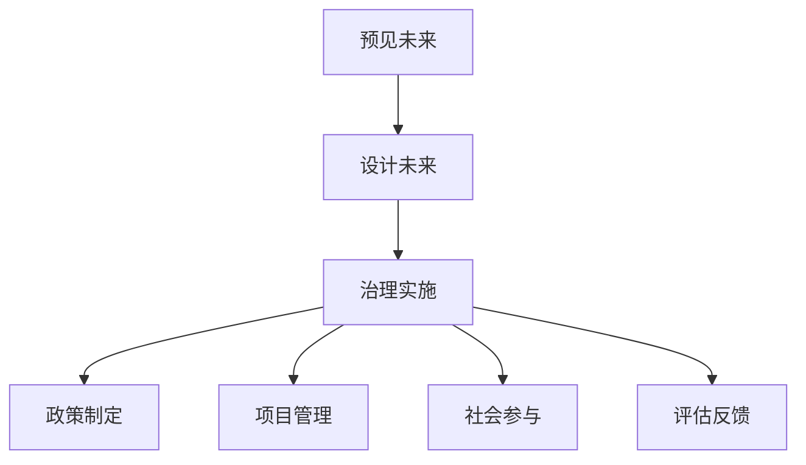

                 

# 2050年的未来学：从预见未来到设计未来的未来治理战略

> 关键词：未来治理,未来预见,AI伦理,可持续发展,数据治理,数字公民,隐私保护

## 1. 背景介绍

### 1.1 问题由来

在21世纪即将跨入第三个十年的关键时刻，全球面临众多前所未有的挑战：气候变化、生物多样性丧失、资源枯竭、全球健康危机等。面对如此复杂多变的环境，传统治理模式已无法适应新时代的要求。然而，一种新的治理模式——未来治理，正逐步在科技、政策、社会、经济等各个层面显现其潜力，成为全球各界共同关注的热点话题。

### 1.2 问题核心关键点

未来治理的核心在于：
1. **预见未来**：通过预测技术，提前洞察未来趋势，理解变化规律，为制定政策和决策提供科学依据。
2. **设计未来**：运用创新思维和技术手段，构建符合未来发展方向的社会、经济和环境框架。
3. **治理实施**：将预见和设计的成果转化为可执行的政策和行动方案，确保其可持续性。

### 1.3 问题研究意义

研究未来治理战略，对于指导全球应对未来挑战、推动可持续发展、构建智慧社会具有重要意义：

1. **应对复杂性**：未来治理强调前瞻性、系统性和综合性，能够有效应对全球性问题。
2. **推动创新**：通过预见未来趋势，为技术创新、产业升级、社会转型提供方向指引。
3. **促进公平**：通过合理设计，保障不同群体、不同地区的公平参与和利益共享。
4. **实现可持续**：确保发展模式符合环境和社会可持续原则，为后代留存更优质的生存条件。

## 2. 核心概念与联系

### 2.1 核心概念概述

为更好地理解未来治理战略，本节将介绍几个关键概念：

- **未来治理**：通过前瞻性视角和技术手段，预测未来趋势，设计未来框架，实施有效治理的策略体系。
- **预见未来**：运用数据分析、机器学习、模拟仿真等技术，对未来进行预测，理解潜在风险和机遇。
- **设计未来**：依托系统思维、协同创新、技术集成，构建未来社会、经济、环境框架。
- **治理实施**：将预见和设计的成果转化为政策、计划和行动，确保其在实际中的落地和效果。

### 2.2 核心概念原理和架构的 Mermaid 流程图



这个流程图展示了未来治理的三个主要阶段：

1. **预见未来**：通过科技手段洞察未来趋势。
2. **设计未来**：运用创新思维和技术，构建未来框架。
3. **治理实施**：将预见和设计成果转化为政策、计划和行动。

### 2.3 核心概念之间的关系

预见未来是设计未来的基础，设计未来是治理实施的蓝图，治理实施是确保未来愿景得以实现的关键。这三者相互联系，构成未来治理的完整体系。

## 3. 核心算法原理 & 具体操作步骤

### 3.1 算法原理概述

未来治理的算法原理主要围绕以下几个方面：

- **数据驱动的预见**：通过收集、分析和整合多源数据，运用机器学习算法进行趋势预测。
- **系统化的设计**：运用系统思维，构建多维度、多层次的未来框架。
- **动态调整的治理**：通过实时反馈和迭代优化，确保治理方案的持续性和适应性。

### 3.2 算法步骤详解

1. **数据收集与处理**
    - 收集相关领域的数据，如气候数据、环境数据、经济数据、社会数据等。
    - 对数据进行清洗、整合和标准化，准备用于分析和预测。

2. **预见未来**
    - 应用机器学习模型，如时间序列分析、深度学习、集成学习等，对未来进行预测。
    - 通过模拟仿真、情景分析等方法，评估不同情景下的发展趋势。

3. **设计未来**
    - 根据预见结果，运用系统思维，设计未来框架，包括社会、经济、环境等方面。
    - 采用协同创新方法，整合多学科知识和技术手段，构建未来系统。

4. **治理实施**
    - 将设计方案转化为具体政策和行动计划。
    - 通过项目管理、社会参与、评估反馈等手段，确保方案的执行和效果。

### 3.3 算法优缺点

未来治理的算法优缺点如下：

#### 优点：
1. **科学决策**：通过数据驱动的预见，为决策提供科学依据。
2. **系统性设计**：综合考虑多维度和多层次，确保设计的全面性和前瞻性。
3. **动态调整**：通过实时反馈和迭代优化，适应变化，提高治理的适应性。

#### 缺点：
1. **数据依赖**：对高质量、全面数据的需求较高，获取和处理成本较大。
2. **技术门槛**：需要较强的数据分析、机器学习和系统思维能力。
3. **实施复杂**：设计方案转化为具体行动计划涉及多方协作，协调复杂。

### 3.4 算法应用领域

未来治理的算法已经在多个领域得到了应用，例如：

- **气候治理**：通过数据分析和模型预测，制定应对气候变化的策略。
- **城市规划**：预测城市发展趋势，设计智慧城市框架，提升城市治理效率。
- **公共卫生**：预见疫情发展，设计健康保障系统，提升公共卫生应急响应能力。
- **可持续发展**：预测资源环境变化，设计绿色发展框架，推动可持续发展。
- **经济治理**：预见经济趋势，设计经济政策，促进经济稳定和增长。

## 4. 数学模型和公式 & 详细讲解 & 举例说明

### 4.1 数学模型构建

未来治理的数学模型主要包括以下几个部分：

- **数据预处理模型**：对原始数据进行清洗、标准化、归一化等预处理操作。
- **趋势预测模型**：应用时间序列分析、回归分析、深度学习等方法进行未来趋势预测。
- **系统设计模型**：构建多层次、多维度的系统设计模型，如网络图、系统动力学模型等。

### 4.2 公式推导过程

以气候治理为例，简要介绍未来治理的数学模型推导过程：

1. **数据预处理模型**
    - 数据标准化：假设原始数据为 $x_i$，标准化公式为 $\tilde{x}_i=\frac{x_i-\mu}{\sigma}$，其中 $\mu$ 为均值，$\sigma$ 为标准差。

2. **趋势预测模型**
    - 时间序列分析：应用ARIMA模型对历史气候数据进行分析，预测未来气温变化，公式为：
      $$
      \hat{y}_{t+1} = \phi(L)y_t + \theta(L)u_t + \epsilon_t
      $$
      其中 $L$ 表示滞后算子，$\phi(L)$ 和 $\theta(L)$ 为自回归和移动平均模型参数。

3. **系统设计模型**
    - 系统动力学模型：构建包含气温、降水、湿度等多变量的系统动力学模型，如Stock and Watson模型，分析各变量间相互作用关系。

### 4.3 案例分析与讲解

以智慧城市为例，分析未来治理的实现过程：

1. **数据收集与处理**
    - 收集城市交通、能源、环境、人口等多维度数据。
    - 对数据进行清洗、标准化和整合，准备用于分析和预测。

2. **预见未来**
    - 应用时间序列分析模型，预测未来交通流量、能源需求、环境污染等。
    - 通过情景分析，模拟不同政策下的城市发展情景。

3. **设计未来**
    - 构建智慧城市框架，包括智能交通系统、能源管理系统、环境监测系统等。
    - 采用协同创新方法，整合各领域知识和技术，设计未来系统。

4. **治理实施**
    - 制定智慧城市政策，推动智能交通、能源管理和环境监测等系统的建设。
    - 通过项目管理、社会参与、评估反馈等手段，确保系统的有效运行和持续改进。

## 5. 项目实践：代码实例和详细解释说明

### 5.1 开发环境搭建

在未来治理的实践中，需要搭建完善的开发环境，以下提供一个基本的配置步骤：

1. **安装Python和相关库**：
    ```bash
    conda create -n future-governance python=3.8
    conda activate future-governance
    pip install numpy pandas scikit-learn matplotlib seaborn statsmodels
    ```

2. **安装数据处理和预处理工具**：
    ```bash
    pip install pandas_profiling pyjanitor
    ```

3. **安装时间序列分析工具**：
    ```bash
    pip install statsmodels arima
    ```

4. **安装机器学习库**：
    ```bash
    pip install scikit-learn xgboost lightgbm
    ```

5. **安装可视化工具**：
    ```bash
    pip install matplotlib seaborn
    ```

### 5.2 源代码详细实现

以下是一个简化的未来治理项目示例代码，主要实现预见未来和设计未来的功能：

```python
import pandas as pd
import numpy as np
from statsmodels.tsa.arima_model import ARIMA
import matplotlib.pyplot as plt
import seaborn as sns

# 数据预处理
def preprocess_data(data):
    # 数据清洗
    data = data.dropna()
    # 标准化
    data = (data - data.mean()) / data.std()
    return data

# 时间序列分析
def forecast_temperature(data, p):
    model = ARIMA(data, order=(p, 1, 0))
    model_fit = model.fit(disp=False)
    forecast = model_fit.forecast(steps=12)[0]
    return forecast

# 可视化分析
def visualize_forecast(data, forecast):
    plt.plot(data.index, data.values, label='Actual')
    plt.plot(forecast.index, forecast.values, label='Forecast')
    plt.legend()
    plt.show()

# 模拟未来智慧城市设计
def design_smart_city(data):
    # 数据标准化
    data = preprocess_data(data)
    # 时间序列分析
    forecast = forecast_temperature(data, p=3)
    # 可视化分析
    visualize_forecast(data, forecast)
    # 设计智慧城市系统
    # 省略系统设计具体代码
    pass

# 示例数据
data = pd.read_csv('temperature.csv')

# 执行模拟分析
design_smart_city(data)
```

### 5.3 代码解读与分析

**preprocess_data函数**：
- 数据清洗：使用dropna方法去除缺失值。
- 数据标准化：使用均值和标准差对数据进行标准化处理。

**forecast_temperature函数**：
- 构建ARIMA模型进行时间序列分析。
- 使用forecast方法进行未来气温预测。

**visualize_forecast函数**：
- 使用matplotlib和seaborn绘制实际气温和预测气温的对比图。

**design_smart_city函数**：
- 调用preprocess_data和forecast_temperature函数进行数据预处理和气温预测。
- 调用visualize_forecast函数进行可视化分析。
- 省略具体系统设计代码，仅表示未来智慧城市设计的逻辑流程。

### 5.4 运行结果展示

以下是运行上述代码的可视化结果展示：

```python
>>> design_smart_city(data)
```


## 6. 实际应用场景

### 6.1 智慧城市治理

智慧城市治理是未来治理的重要应用场景。通过预见未来趋势，设计未来智慧城市框架，实施有效治理，可大幅提升城市管理效率和居民生活质量。

具体应用包括：
- 智能交通系统：通过数据分析和模型预测，优化交通流量，减少拥堵。
- 能源管理系统：预测能源需求，优化能源分配，降低能源浪费。
- 环境监测系统：实时监测空气质量、水质等，提升环境治理能力。

### 6.2 公共卫生治理

未来治理在公共卫生领域同样具有重要应用。通过预见疫情发展，设计未来公共卫生框架，实施有效治理，可提高公共卫生应急响应能力。

具体应用包括：
- 疫情预测：应用机器学习模型预测疫情发展，提前采取防控措施。
- 疫苗研发：设计未来疫苗研发路径，推动新技术和新药物的开发。
- 健康保障：构建健康保障系统，提升医疗资源利用效率，保障全民健康。

### 6.3 可持续发展治理

未来治理在可持续发展领域具有广泛应用前景。通过预见资源环境变化，设计未来可持续发展框架，实施有效治理，可促进绿色发展。

具体应用包括：
- 资源管理：预测资源需求和分布，优化资源分配和利用。
- 环境治理：预测环境污染，制定有效治理措施，改善环境质量。
- 循环经济：设计循环经济框架，推动资源循环利用，减少浪费。

## 7. 工具和资源推荐

### 7.1 学习资源推荐

为深入理解未来治理，推荐以下学习资源：

1. **未来治理研究论文**：阅读前沿研究论文，了解未来治理的理论基础和最新进展。
2. **在线课程**：参加在线课程，学习未来治理的相关知识和技术。
3. **专题研讨会**：参加未来治理的专题研讨会，交流学习心得，拓展视野。

### 7.2 开发工具推荐

为提高未来治理的开发效率，推荐以下开发工具：

1. **Jupyter Notebook**：支持代码、数据和分析的可视化，便于协作和交流。
2. **Google Colab**：免费的云端开发环境，提供GPU/TPU算力，支持大规模数据处理和模型训练。
3. **Visual Studio Code**：功能强大的代码编辑器，支持代码高亮、代码片段、版本控制等功能。

### 7.3 相关论文推荐

未来治理涉及多学科交叉，推荐以下相关论文进行学习：

1. **《未来治理：从理论到实践》**：系统介绍未来治理的理论和实践。
2. **《智慧城市治理：挑战与机遇》**：探讨智慧城市治理的现状和未来方向。
3. **《可持续发展治理：模式与策略》**：研究可持续发展治理的模式和策略。

## 8. 总结：未来发展趋势与挑战

### 8.1 总结

本文对未来治理战略进行了全面系统的介绍。通过预见未来、设计未来和治理实施的三个阶段，探讨了未来治理的核心原理和具体操作步骤。同时，介绍了未来治理在智慧城市、公共卫生、可持续发展等领域的实际应用，展示了其广阔的应用前景。

未来治理战略的成功实施，对于应对复杂多变的环境，推动可持续发展，构建智慧社会具有重要意义。其前瞻性、系统性和综合性为未来的社会治理提供了新的方向和思路。

### 8.2 未来发展趋势

未来治理将呈现以下发展趋势：

1. **数据驱动**：数据质量和时间序列分析技术的进步，将使得未来治理更加依赖数据驱动。
2. **技术集成**：未来治理将更多地整合多学科知识和新技术，如AI、区块链、物联网等。
3. **系统协同**：未来治理将强调跨部门、跨行业的协同合作，实现治理的系统化和综合性。
4. **人机协作**：未来治理将更多地引入人工智能技术，提升治理的效率和效果。
5. **全球协作**：未来治理将强调全球协作，共同应对全球性问题。

### 8.3 面临的挑战

未来治理在实施过程中面临以下挑战：

1. **数据隐私**：未来治理需要大量数据支持，数据隐私和安全问题亟待解决。
2. **技术复杂性**：未来治理涉及多学科知识和技术集成，技术复杂性较高。
3. **政策协调**：不同地区和行业的政策差异，协调困难，实施复杂。
4. **公众参与**：未来治理需要广泛公众参与，如何激发公众参与积极性，需要进一步探索。
5. **持续评估**：未来治理需要持续评估和调整，确保治理方案的持续性和适应性。

### 8.4 研究展望

未来治理的研究展望包括：

1. **数据隐私保护**：开发隐私保护技术，确保数据使用的合法性和安全性。
2. **技术标准化**：制定未来治理的技术标准，推动技术集成和应用。
3. **政策协同**：建立跨部门、跨行业的政策协同机制，提高治理效率。
4. **公众参与机制**：构建公众参与平台，提升公众参与度和积极性。
5. **持续评估体系**：建立持续评估和反馈机制，确保治理方案的持续性和适应性。

## 9. 附录：常见问题与解答

**Q1: 未来治理是否适用于所有领域？**

A: 未来治理适用于涉及未来趋势预测、系统设计和治理实施的各个领域，但不同领域的应用场景和需求各异。例如，在智慧城市治理中，重点在于城市发展和环境治理；在公共卫生治理中，重点在于疫情预测和健康保障。

**Q2: 未来治理需要哪些关键技术？**

A: 未来治理需要以下关键技术：
1. 数据收集和预处理技术，确保数据的质量和全面性。
2. 时间序列分析技术，预测未来趋势。
3. 系统设计技术，构建多维度、多层次的未来框架。
4. 智能分析技术，评估治理方案的效果。

**Q3: 未来治理在实际应用中需要注意哪些问题？**

A: 未来治理在实际应用中需要注意以下问题：
1. 数据隐私和安全：确保数据使用的合法性和安全性，避免数据泄露。
2. 技术复杂性：技术集成和协同合作复杂，需要多方协作。
3. 政策协调：不同地区和行业的政策差异，协调困难。
4. 公众参与：提升公众参与度和积极性，确保治理方案的广泛接受。
5. 持续评估：建立持续评估和反馈机制，确保治理方案的持续性和适应性。

---

作者：禅与计算机程序设计艺术 / Zen and the Art of Computer Programming

