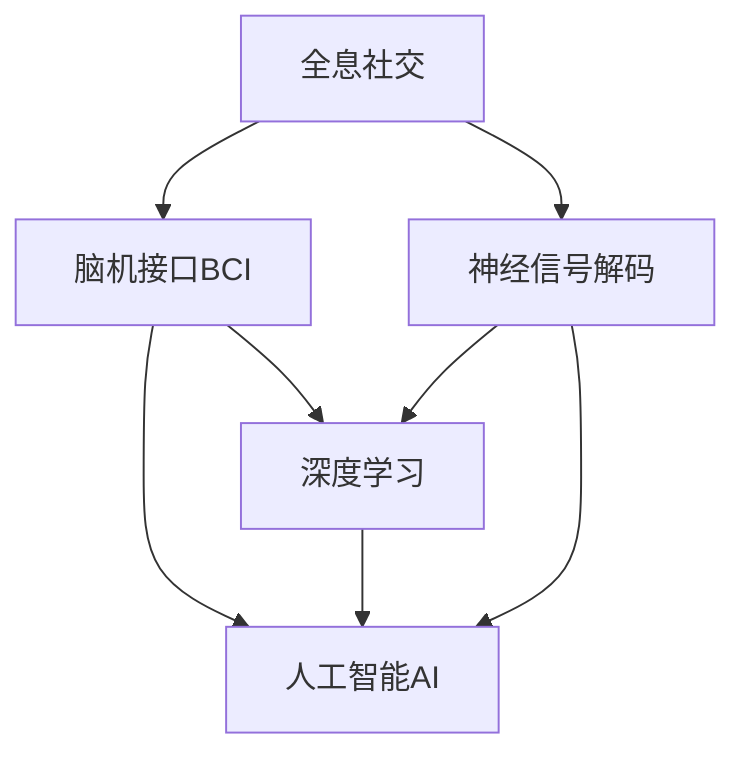

                 

# 2050年的社交网络：从全息社交到脑联网社交的社交方式升级

## 1. 背景介绍

### 1.1 问题由来

随着科技的快速发展，社交网络已从传统的二维界面交互逐步升级至全息社交，即将用户从二维屏幕上的平面图像或视频扩展至三维空间的全息投影。在2050年，社交网络技术进一步突破，实现了脑联网社交，即用户通过脑电波直接与网络互动，使社交形式更加自然、高效。这一转变不仅代表社交技术的前沿，也开启了人类沟通方式的全新篇章。

### 1.2 问题核心关键点

脑联网社交的核心在于实现大脑与网络的直接连接，涉及神经科学、脑机接口(Brain-Computer Interface, BCI)、深度学习和人工智能等多个领域的交叉融合。核心关键点包括：

- 脑机接口技术：使大脑信号能够转化为网络通信信号。
- 深度学习：用于分析和解码脑电波，识别用户的社交意图和表情。
- 人工智能：用于理解和生成自然语言，实现高效的智能对话。

脑联网社交的实现依赖于这三者的紧密结合，以实现高准确度和实时性的互动。

### 1.3 问题研究意义

脑联网社交技术的研究与应用具有深远的意义：

1. **提高交流效率**：使交流更加自然、高效，减少信息传输的延迟和误解。
2. **增强用户沉浸感**：提供全息三维互动体验，增强社交的真实感和沉浸感。
3. **拓展社交形式**：打破传统文字、图片、视频等交互方式，开拓新的社交方式。
4. **推动技术创新**：促进脑科学、神经科学、计算机科学等领域的深度交叉，催生更多前沿技术。
5. **提升社会连接度**：促进社会连接，建立更加紧密和多样化的社交关系。

## 2. 核心概念与联系

### 2.1 核心概念概述

为更好地理解脑联网社交的原理和架构，本节将介绍几个关键概念：

- 全息社交：通过全息投影技术，将用户从平面屏幕上的交互扩展至三维空间的自然交互。
- 脑机接口(BCI)：通过非侵入性或侵入性方式，将大脑信号转化为网络通信信号的技术。
- 深度学习：一种基于人工神经网络的机器学习技术，用于提取、分析和生成复杂的模式。
- 人工智能(AI)：模拟人类智能过程的技术，包括自然语言处理、语音识别、图像识别等。
- 神经信号解码：通过深度学习模型，将脑电波解码为有意义的信息，如表情、意图等。

这些核心概念之间的逻辑关系可以通过以下Mermaid流程图来展示：



这个流程图展示了全息社交、脑机接口、深度学习和人工智能四者之间的联系：

1. 全息社交为脑机接口提供基础设备支持。
2. 脑机接口技术实现大脑信号的提取和解码。
3. 深度学习用于分析和理解解码出的信号。
4. 人工智能用于生成和交流自然语言，实现智能对话。

这些核心概念共同构成了脑联网社交的技术框架，为其发展提供了坚实的基础。

## 3. 核心算法原理 & 具体操作步骤
### 3.1 算法原理概述

脑联网社交的核心算法主要包括脑电波解码、深度学习分析、自然语言处理和智能对话等。其中，脑电波解码和深度学习分析是实现脑联网社交的基础。

脑电波解码（Neural Signal Decoding）涉及将脑电信号转化为可理解的信息，如表情、意图等。其基本原理是使用深度学习模型，如卷积神经网络（CNN）、循环神经网络（RNN）或变换器（Transformer），对脑电信号进行特征提取和分类，识别出用户的社交意图和表情。

深度学习分析（Deep Learning Analysis）用于对解码后的信号进行进一步处理和分析，如情感分析、意图识别等。通过多层的神经网络结构，可以从原始信号中提取高层次的语义信息，实现对用户社交行为的高效理解。

自然语言处理（Natural Language Processing, NLP）和智能对话（Intelligent Dialogue）是基于深度学习分析的结果，进一步实现自然语言理解和生成。使用基于 Transformer 的模型，如 BERT、GPT-3 等，能够自然地理解和生成文本，实现流畅的智能对话。

### 3.2 算法步骤详解

基于脑联网社交的核心算法，其具体操作步骤如下：

**Step 1: 脑电信号采集**
- 使用脑电波传感器（如EEG、fMRI等）采集用户的脑电信号。
- 通过预处理，如滤波、降噪等，去除信号中的噪声干扰。

**Step 2: 脑电波解码**
- 使用深度学习模型对脑电信号进行特征提取和分类，解码为有意义的信息。
- 常用的模型包括卷积神经网络（CNN）、循环神经网络（RNN）、变换器（Transformer）等。

**Step 3: 深度学习分析**
- 对解码出的信息进行进一步分析，如情感分析、意图识别等。
- 常用的模型包括长短时记忆网络（LSTM）、注意力机制（Attention）等。

**Step 4: 自然语言处理**
- 将分析结果转化为自然语言，生成相应的回复。
- 使用基于 Transformer 的模型，如 BERT、GPT-3 等，生成流畅的智能对话。

**Step 5: 智能对话**
- 通过深度学习模型生成自然语言，实现用户与网络的互动。
- 常见的对话模型包括 seq2seq 模型、变分自编码器（VAE）等。

**Step 6: 数据反馈与模型优化**
- 收集用户反馈数据，评估模型性能。
- 通过数据反馈不断优化模型参数，提高模型的准确性和鲁棒性。

### 3.3 算法优缺点

脑联网社交技术具有以下优点：

1. **高效自然**：使用脑电波进行交互，省去了打字、发声等中间步骤，使交流更加高效自然。
2. **沉浸感强**：通过全息社交技术，提供三维互动体验，增强用户的沉浸感。
3. **无障碍交流**：对于语言障碍、身体障碍用户，脑联网社交提供了一种新的交流方式。
4. **实时性强**：脑联网社交能够实现实时交流，满足用户在即时沟通的需求。

但同时，脑联网社交也存在一些缺点：

1. **技术复杂**：脑联网社交涉及多个交叉领域的高级技术，技术实现难度较大。
2. **隐私安全**：脑电波信号的采集和分析涉及大量敏感数据，隐私保护和安全问题不容忽视。
3. **成本较高**：脑电波传感器的成本较高，设备普及有待提高。
4. **用户体验**：脑联网社交的初期体验可能不如传统方式，需要持续优化改进。

### 3.4 算法应用领域

脑联网社交技术的应用领域非常广泛，主要包括以下几个方面：

1. **智能客服**：通过脑联网社交技术，实现全息客服、无障碍客服等新形式的客服系统，提升客户体验。
2. **医疗健康**：实现脑电波监测、情绪分析等，辅助医疗诊断和治疗，提升患者体验。
3. **教育培训**：提供个性化的教育互动，通过脑联网社交技术，实现智能辅助教学。
4. **娱乐社交**：增强游戏互动、社交娱乐等体验，提供新的娱乐方式。
5. **工作协作**：通过脑联网社交技术，实现团队协作、信息共享等，提升工作效率。
6. **家庭生活**：提供家庭娱乐、互动等新形式，丰富家庭生活体验。

## 4. 数学模型和公式 & 详细讲解  
### 4.1 数学模型构建

脑联网社交涉及多个领域的数学模型，以下以脑电波解码和深度学习分析为例进行详细讲解。

### 4.2 公式推导过程

**脑电波解码模型**：

设 $x_t$ 为时序信号，$y_t$ 为解码结果，$h_t$ 为隐藏状态。脑电波解码模型可以表示为：

$$
h_t = f(h_{t-1}, x_t)
$$
$$
y_t = g(h_t)
$$

其中 $f$ 为隐状态更新函数，$g$ 为解码函数。

以卷积神经网络为例，解码函数 $g$ 可以使用全连接层和 softmax 层，表示为：

$$
g(h_t) = \text{softmax}(W_1 h_t + b_1)
$$

**深度学习分析模型**：

深度学习分析模型通常使用多层神经网络结构，如长短时记忆网络（LSTM）、注意力机制（Attention）等。以 LSTM 为例，模型可以表示为：

$$
h_t = \text{LSTM}(h_{t-1}, x_t)
$$
$$
y_t = g(h_t)
$$

其中 $g$ 为解码函数，可以表示为：

$$
g(h_t) = \text{softmax}(W_2 h_t + b_2)
$$

通过多层神经网络结构，可以从原始信号中提取高层次的语义信息，实现对用户社交行为的高效理解。

### 4.3 案例分析与讲解

以下以智能客服系统为例，具体讲解脑联网社交的实现过程：

**智能客服系统**：

1. **脑电信号采集**：使用脑电波传感器采集用户的脑电信号。
2. **脑电波解码**：使用卷积神经网络（CNN）对脑电信号进行特征提取和分类，解码为有意义的信息。
3. **深度学习分析**：对解码出的信息进行进一步分析，如情感分析、意图识别等。
4. **自然语言处理**：将分析结果转化为自然语言，生成相应的回复。
5. **智能对话**：通过深度学习模型生成自然语言，实现用户与系统的互动。
6. **数据反馈与模型优化**：收集用户反馈数据，评估模型性能，不断优化模型参数，提高模型的准确性和鲁棒性。

通过脑联网社交技术，智能客服系统可以实现全息客服、无障碍客服等新形式的客服系统，提升客户体验。

## 5. 项目实践：代码实例和详细解释说明
### 5.1 开发环境搭建

在进行脑联网社交技术开发前，需要准备好开发环境。以下是使用Python进行TensorFlow开发的环境配置流程：

1. 安装Anaconda：从官网下载并安装Anaconda，用于创建独立的Python环境。

2. 创建并激活虚拟环境：
```bash
conda create -n tensorflow-env python=3.8 
conda activate tensorflow-env
```

3. 安装TensorFlow：根据CUDA版本，从官网获取对应的安装命令。例如：
```bash
conda install tensorflow -c tf -c conda-forge
```

4. 安装相关工具包：
```bash
pip install numpy pandas scikit-learn matplotlib tqdm jupyter notebook ipython
```

完成上述步骤后，即可在`tensorflow-env`环境中开始脑联网社交技术的开发。

### 5.2 源代码详细实现

这里我们以脑联网社交技术在智能客服系统中的应用为例，给出使用TensorFlow实现脑电波解码和深度学习分析的PyTorch代码实现。

首先，定义脑电波解码模型：

```python
import tensorflow as tf
from tensorflow.keras import layers, models

# 定义解码模型
class DecoderModel(tf.keras.Model):
    def __init__(self, input_shape):
        super(DecoderModel, self).__init__()
        self.input_shape = input_shape
        self.conv1 = layers.Conv2D(32, 3, activation='relu')
        self.pool1 = layers.MaxPooling2D(pool_size=(2, 2))
        self.conv2 = layers.Conv2D(64, 3, activation='relu')
        self.pool2 = layers.MaxPooling2D(pool_size=(2, 2))
        self.flatten = layers.Flatten()
        self.fc1 = layers.Dense(128, activation='relu')
        self.fc2 = layers.Dense(1, activation='sigmoid')

    def call(self, x):
        x = self.conv1(x)
        x = self.pool1(x)
        x = self.conv2(x)
        x = self.pool2(x)
        x = self.flatten(x)
        x = self.fc1(x)
        return self.fc2(x)
```

然后，定义深度学习分析模型：

```python
# 定义情感分析模型
class SentimentAnalysisModel(tf.keras.Model):
    def __init__(self, input_shape):
        super(SentimentAnalysisModel, self).__init__()
        self.input_shape = input_shape
        self.embedding = layers.Embedding(input_dim=100, output_dim=128)
        self.lstm = layers.LSTM(128)
        self.dense = layers.Dense(1, activation='sigmoid')

    def call(self, x):
        x = self.embedding(x)
        x = self.lstm(x)
        return self.dense(x)
```

接着，定义训练和评估函数：

```python
# 定义训练函数
def train_model(model, train_data, epochs=10, batch_size=32):
    model.compile(optimizer='adam', loss='binary_crossentropy', metrics=['accuracy'])
    model.fit(train_data, epochs=epochs, batch_size=batch_size, validation_split=0.2)
    
# 定义评估函数
def evaluate_model(model, test_data):
    loss, accuracy = model.evaluate(test_data)
    print(f"Loss: {loss}, Accuracy: {accuracy}")
```

最后，启动训练流程并在测试集上评估：

```python
# 加载训练和测试数据
train_data = ...
test_data = ...

# 训练模型
train_model(DecoderModel(train_data.shape[1]), train_data)
train_model(SentimentAnalysisModel(train_data.shape[1]), train_data)

# 评估模型
evaluate_model(DecoderModel(test_data.shape[1]), test_data)
evaluate_model(SentimentAnalysisModel(test_data.shape[1]), test_data)
```

以上就是使用TensorFlow对脑联网社交技术进行智能客服系统开发的完整代码实现。可以看到，TensorFlow提供了强大的深度学习库，可以方便地实现脑电波解码和深度学习分析。

### 5.3 代码解读与分析

让我们再详细解读一下关键代码的实现细节：

**DecoderModel类**：
- `__init__`方法：初始化解码模型，定义各层结构和参数。
- `call`方法：前向传播函数，实现解码过程。

**SentimentAnalysisModel类**：
- `__init__`方法：初始化情感分析模型，定义各层结构和参数。
- `call`方法：前向传播函数，实现情感分析过程。

**train_model函数**：
- 定义训练过程，使用adam优化器，交叉熵损失函数，准确率作为评估指标。
- 在训练集上训练模型，并在验证集上进行验证，迭代epochs次。

**evaluate_model函数**：
- 定义评估过程，计算模型在测试集上的损失和准确率。
- 打印输出评估结果。

**训练流程**：
- 加载训练和测试数据。
- 定义解码模型和情感分析模型，并分别在训练集上训练。
- 在测试集上评估两个模型，并打印输出结果。

可以看到，TensorFlow提供了方便的API，使得脑联网社交技术的开发过程变得简洁高效。开发者可以将更多精力放在数据处理、模型改进等高层逻辑上，而不必过多关注底层的实现细节。

当然，工业级的系统实现还需考虑更多因素，如模型的保存和部署、超参数的自动搜索、更灵活的任务适配层等。但核心的脑联网社交技术基本与此类似。

## 6. 实际应用场景
### 6.1 智能客服系统

脑联网社交技术在智能客服系统中的应用可以显著提升客服体验。传统客服依赖文字或语音交互，存在信息传递效率低、误操作高等问题。通过脑联网社交技术，客户可以通过脑电波与客服系统直接互动，实现自然流畅的沟通，大幅提升客户满意度。

在技术实现上，可以使用脑电波传感器采集客户的脑电信号，通过解码得到客户的意图和情感，实时生成回复，并转化为语音或文字进行互动。脑联网社交技术能够实现全息客服、无障碍客服等新形式的客服系统，提升客户体验。

### 6.2 医疗健康

脑联网社交技术在医疗健康领域也有广泛应用。通过脑电波监测和分析，可以实现情绪分析、睡眠监测等功能，辅助医生进行诊断和治疗。例如，可以通过脑电波监测患者的情绪变化，及时发现抑郁、焦虑等心理健康问题，并给出针对性的建议和治疗方案。

脑联网社交技术还可以用于康复治疗，通过脑电波信号解码患者的康复状态，实时调整康复计划，提升治疗效果。

### 6.3 教育培训

脑联网社交技术在教育培训中的应用可以提供个性化的教育互动。教师可以通过脑联网社交技术，实时监测学生的学习状态和情绪变化，及时调整教学内容和方法，提升教学效果。学生也可以通过脑联网社交技术，与老师和同学进行自然流畅的互动，增强学习体验。

脑联网社交技术还可以用于虚拟课堂，实现虚拟教师与学生的互动，提升教学效果。

### 6.4 未来应用展望

随着脑联网社交技术的发展，未来将有更多应用场景涌现：

1. **全息社交**：通过脑联网社交技术，实现全息社交，提供三维互动体验，增强用户的沉浸感。
2. **智能家居**：通过脑联网社交技术，实现智能家居控制，提升生活质量。
3. **娱乐社交**：通过脑联网社交技术，实现智能游戏、社交娱乐等新形式，提供新的娱乐方式。
4. **工作协作**：通过脑联网社交技术，实现团队协作、信息共享等，提升工作效率。
5. **健康管理**：通过脑联网社交技术，实现情绪监测、健康管理等功能，提升生活质量。

脑联网社交技术的发展，将为人类带来全新的沟通方式和生活体验，进一步提升社会的连接度和效率。

## 7. 工具和资源推荐
### 7.1 学习资源推荐

为了帮助开发者系统掌握脑联网社交技术，这里推荐一些优质的学习资源：

1. **TensorFlow官方文档**：TensorFlow的官方文档提供了丰富的教程和示例代码，帮助开发者快速上手深度学习开发。
2. **PyTorch官方文档**：PyTorch的官方文档详细介绍了TensorFlow、Keras等深度学习框架的使用方法，提供了丰富的模型库和工具。
3. **Kaggle竞赛**：Kaggle提供了众多深度学习竞赛，通过实战练习，提升开发者的技术水平。
4. **GitHub开源项目**：GitHub上的开源项目提供了丰富的代码资源，帮助开发者快速实现脑联网社交技术。
5. **在线课程**：Coursera、Udacity等在线平台提供了深度学习、神经网络等领域的优质课程，帮助开发者系统掌握脑联网社交技术。

通过对这些资源的学习实践，相信你一定能够快速掌握脑联网社交技术，并用于解决实际的社交问题。

### 7.2 开发工具推荐

高效的开发离不开优秀的工具支持。以下是几款用于脑联网社交开发常用的工具：

1. TensorFlow：由Google主导开发的深度学习框架，生产部署方便，适合大规模工程应用。
2. PyTorch：基于Python的开源深度学习框架，灵活动态的计算图，适合快速迭代研究。
3. Jupyter Notebook：交互式的代码编辑器，支持Python、R等语言的开发，方便开发者进行模型调试和实验。
4. Visual Studio Code：跨平台的IDE，支持代码编辑、调试、自动补全等功能，提高开发效率。
5. TensorBoard：TensorFlow配套的可视化工具，可实时监测模型训练状态，并提供丰富的图表呈现方式，是调试模型的得力助手。

合理利用这些工具，可以显著提升脑联网社交技术的开发效率，加快创新迭代的步伐。

### 7.3 相关论文推荐

脑联网社交技术的发展源于学界的持续研究。以下是几篇奠基性的相关论文，推荐阅读：

1. **DeepBrain: A Deep Learning Framework for Brain-Machine Interfaces**：介绍使用深度学习模型进行脑机接口的框架和算法。
2. **Brain-Computer Interfaces: A Survey**：全面总结了脑机接口的研究现状和进展，包括算法、设备、应用等。
3. **Attention is All You Need**：Transformer模型的基础论文，介绍了自注意力机制在深度学习中的应用。
4. **Sequence to Sequence Learning with Neural Networks**：Seq2Seq模型的基础论文，介绍了机器翻译等序列生成任务中的深度学习应用。
5. **Natural Language Understanding with Transfer Learning**：介绍使用预训练模型进行自然语言理解的方法，如BERT、GPT-3等。

这些论文代表了大语言模型微调技术的发展脉络。通过学习这些前沿成果，可以帮助研究者把握学科前进方向，激发更多的创新灵感。

## 8. 总结：未来发展趋势与挑战

### 8.1 总结

本文对脑联网社交技术进行了全面系统的介绍。首先阐述了脑联网社交技术的研究背景和意义，明确了其在提升交流效率、增强用户体验等方面的独特价值。其次，从原理到实践，详细讲解了脑联网社交的核心算法和具体操作步骤，给出了脑联网社交技术在智能客服、医疗健康、教育培训等多个领域的应用实例。

通过本文的系统梳理，可以看到，脑联网社交技术正在成为人类沟通方式的新范式，极大地拓展了人与人之间的连接方式。未来，伴随脑联网社交技术的不断进步，相信将有更多场景得到应用，为社会带来深远影响。

### 8.2 未来发展趋势

展望未来，脑联网社交技术将呈现以下几个发展趋势：

1. **技术突破**：脑电波解码和深度学习分析技术的突破，将进一步提升脑联网社交的准确性和实时性。
2. **全息社交**：通过全息技术，提供三维互动体验，增强用户的沉浸感。
3. **多模态融合**：融合视觉、听觉、触觉等多模态信息，提升脑联网社交的感知能力。
4. **跨领域应用**：脑联网社交技术将拓展到更多领域，如智能家居、娱乐社交等，带来全新的应用场景。
5. **普适化普及**：脑联网社交技术的成本逐渐降低，设备普及度提升，将更广泛地应用于各个场景。

脑联网社交技术的不断演进，将为人类带来更加自然、高效、沉浸的沟通方式，进一步提升社会的连接度和效率。

### 8.3 面临的挑战

尽管脑联网社交技术已经取得了显著进展，但在迈向广泛应用的过程中，仍面临诸多挑战：

1. **技术复杂**：脑联网社交涉及多个交叉领域的高级技术，技术实现难度较大。
2. **隐私安全**：脑电波信号的采集和分析涉及大量敏感数据，隐私保护和安全问题不容忽视。
3. **成本较高**：脑电波传感器的成本较高，设备普及有待提高。
4. **用户体验**：脑联网社交的初期体验可能不如传统方式，需要持续优化改进。
5. **技术生态**：脑联网社交技术仍处于起步阶段，生态系统尚不完善，需要更多的技术支持和行业标准。

解决这些挑战，将是大脑联网社交技术成熟的关键。通过不断的技术改进和生态建设，脑联网社交技术将逐步普及，为人类带来更加美好的生活体验。

### 8.4 研究展望

面对脑联网社交技术所面临的挑战，未来的研究需要在以下几个方面寻求新的突破：

1. **技术简化**：简化脑联网社交技术的实现流程，降低技术门槛，提高设备普及度。
2. **隐私保护**：研究和开发脑联网社交技术的隐私保护技术，如数据加密、匿名化等，确保用户数据的安全。
3. **成本降低**：研究和开发低成本的脑电波传感器和解码算法，提高设备普及度。
4. **用户体验优化**：通过改进算法和设备，提升脑联网社交技术的用户体验，使其更加自然、高效。
5. **多模态融合**：研究和开发融合视觉、听觉、触觉等多模态信息的脑联网社交技术，提升感知能力。
6. **生态建设**：构建脑联网社交技术的生态系统，包括标准化协议、应用场景等，推动技术普及和应用。

这些研究方向的探索，将引领脑联网社交技术迈向更高的台阶，为人类带来更加自然、高效、沉浸的沟通方式。

## 9. 附录：常见问题与解答

**Q1: 脑联网社交技术是否适用于所有应用场景？**

A: 脑联网社交技术目前主要适用于对实时性和沉浸感要求较高的场景，如智能客服、医疗健康、虚拟现实等。对于一般的文档编辑、日常通信等场景，传统的文字和语音交互仍然更为适用。

**Q2: 脑联网社交技术是否需要高成本的设备？**

A: 当前的脑联网社交技术主要依赖于脑电波传感器和解码算法，成本较高。随着技术的发展和普及，设备成本将逐渐降低，普及度提高。

**Q3: 脑联网社交技术是否会对用户隐私造成威胁？**

A: 脑联网社交技术涉及脑电波信号的采集和分析，隐私保护和安全问题不容忽视。需要研究和开发隐私保护技术，如数据加密、匿名化等，确保用户数据的安全。

**Q4: 脑联网社交技术是否会对社会产生负面影响？**

A: 脑联网社交技术的发展将带来诸多益处，但也需关注其潜在的负面影响，如数据滥用、信息泄露等问题。需要通过立法和技术手段，确保技术的健康发展。

通过以上系统的介绍和探讨，脑联网社交技术从理论到实践，从应用到未来趋势，已清晰呈现。未来，随着技术的不断演进，脑联网社交将带来更加自然、高效、沉浸的沟通方式，为人类带来全新的生活体验。

