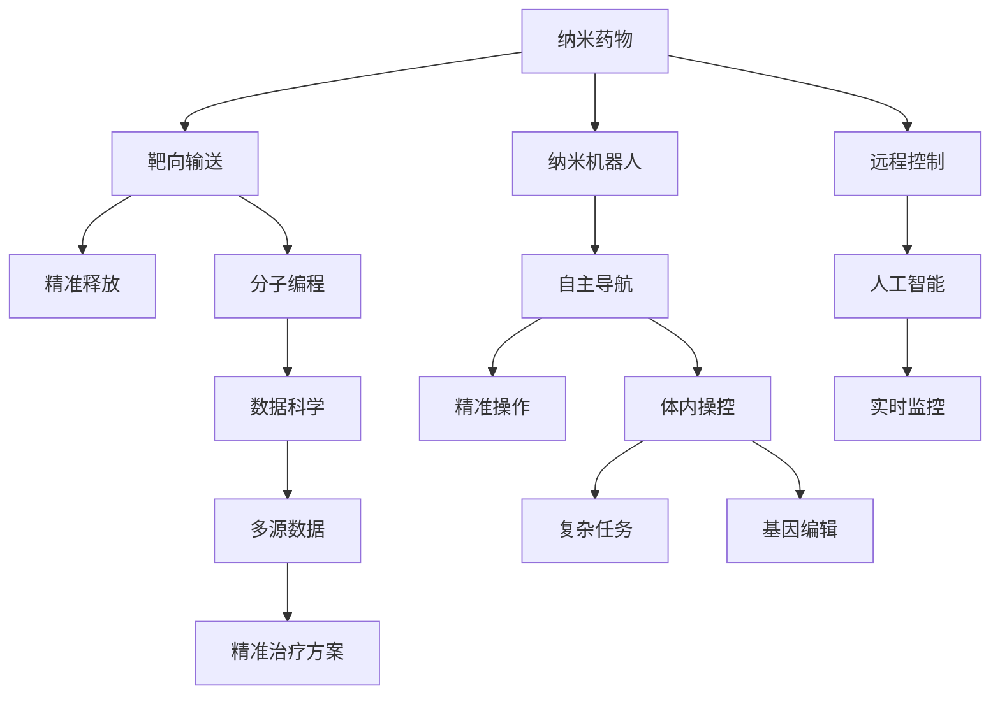

                 

# 2050年的纳米医学：从纳米药物到纳米机器人的精准治疗

> 关键词：纳米药物,纳米机器人,精准治疗,分子编程,基因编辑,人工智能,数据科学,纳米生物芯片

## 1. 背景介绍

### 1.1 问题由来
随着全球人口老龄化加剧，慢性病、遗传病等复杂的健康问题日益凸显。当前医学治疗主要依赖于化学药物和外科手术，但这些方法往往具有较大的副作用和不确定性，无法满足个性化治疗的需求。另一方面，基因编辑技术的突破为医疗领域带来了新的可能性，但其高昂成本和技术门槛也限制了其大规模应用。

为应对这些挑战，纳米医学应运而生。纳米医学利用纳米技术，通过精确操控药物和物质，从微观层面实现对疾病的精准治疗。本文将从纳米药物和纳米机器人两方面，探讨其在未来医学中的潜力，并分析其面临的技术挑战和未来趋势。

### 1.2 问题核心关键点
纳米药物和纳米机器人是纳米医学的核心工具，通过在分子、细胞级别进行精准干预，具有以下特点：
- 高靶向性：能够在体内精确定位到病变细胞或组织，减少对正常细胞的损伤。
- 低剂量高效：通过纳米载体，可以实现高浓度药物在病变部位的积累，减少药物副作用。
- 个性化治疗：利用分子编程技术，实现对不同基因型、病情的个性化治疗方案。
- 远程控制：通过人工智能和数据科学，实现对纳米机器人的远程操控和实时监控。

本文将重点探讨这些关键点的实现原理和应用场景，并提出未来纳米医学发展的方向。

## 2. 核心概念与联系

### 2.1 核心概念概述

为更好地理解纳米医学，本节将介绍几个关键概念：

- 纳米药物(Nanodrug)：利用纳米技术制备的药物载体，能够在体内实现精确的药物输送和释放。常见的纳米药物载体包括脂质体、聚合物、金纳米粒子等。
- 纳米机器人(Nanorobot)：具有自主导航、操作能力的微型机器人，能够执行复杂的体内操作，如靶向药物输送、细胞操控等。
- 分子编程(Molecular Programming)：通过设计特定的序列和结构，使纳米药物和纳米机器人在体内执行特定的功能，实现精准治疗。
- 基因编辑(Gene Editing)：利用CRISPR-Cas9等技术，在基因水平上进行精准的DNA序列修改，用于治疗遗传疾病和癌症等。
- 人工智能(Artificial Intelligence, AI)：通过机器学习和深度学习，实现对纳米机器人的实时监控和控制。
- 数据科学(Data Science)：利用大数据分析技术，提取和分析纳米医学中的多源数据，支持精准治疗方案的设计和优化。
- 纳米生物芯片(Nanobiochip)：集成生物传感、分子编程等多功能的微型芯片，能够实现对体内环境的实时监测和调控。

这些概念之间的逻辑关系可以通过以下Mermaid流程图来展示：



这个流程图展示了几大核心概念及其之间的关系：

1. 纳米药物通过靶向输送和精准释放，实现对病变细胞的定位和治疗。
2. 纳米机器人具有自主导航和精准操作能力，可以执行复杂的体内任务。
3. 分子编程使纳米药物和纳米机器人在体内执行特定功能，实现精准治疗。
4. 基因编辑能够在基因水平上进行修改，用于根治遗传疾病和癌症。
5. 人工智能通过实时监控和远程控制，指导纳米机器人的操作。
6. 数据科学提取和分析多源数据，支持精准治疗方案的优化。
7. 纳米生物芯片集成多功能的微型芯片，实时监测和调控体内环境。

这些概念共同构成了纳米医学的基础，使其能够在微观层面实现对复杂健康问题的精准治疗。

## 3. 核心算法原理 & 具体操作步骤
### 3.1 算法原理概述

纳米药物和纳米机器人的设计、制备和应用，涉及到多个领域的先进技术和算法。本文将重点介绍其中的核心原理和操作步骤。

### 3.2 算法步骤详解

**Step 1: 纳米药物的制备**
- 选择适合的纳米材料：如脂质体、聚合物、金纳米粒子等。
- 设计合适的药物载体：通过化学合成、表面修饰等方法，制备出适合特定药物的载体。
- 加载药物：将药物分子嵌入或包覆到纳米载体中，实现高效输送。

**Step 2: 纳米机器人的设计与制备**
- 设计自主导航系统：利用微机电系统(MEMS)或纳米技术，实现纳米机器人的自主导航。
- 实现精准操作功能：通过微操纵技术，使纳米机器人具备精准操控细胞和药物的能力。
- 加载纳米药物：将纳米药物负载到纳米机器人表面，增强其治疗效果。

**Step 3: 分子编程与基因编辑**
- 设计分子编程序列：通过设计特定的DNA或RNA序列，引导纳米药物和纳米机器人在体内执行特定功能。
- 利用CRISPR-Cas9等技术，进行基因编辑操作，实现对基因序列的精准修改。

**Step 4: 人工智能与数据科学**
- 实时监控纳米机器人的状态：利用传感器和通信技术，实现对纳米机器人的实时监测。
- 设计人工智能算法：通过机器学习算法，实现对纳米机器人的自主导航和精准操作。
- 提取和分析多源数据：利用数据科学技术，从多源数据中提取关键信息，支持精准治疗方案的优化。

**Step 5: 纳米生物芯片的应用**
- 设计纳米生物芯片：集成生物传感、分子编程等多功能，用于实时监测和调控体内环境。
- 数据采集与处理：利用芯片传感器采集体内环境数据，通过数据科学技术进行分析。
- 精准治疗方案的优化：根据体内环境数据，调整纳米药物和纳米机器人的操作参数，优化治疗方案。

### 3.3 算法优缺点

纳米药物和纳米机器人的设计、制备和应用，具有以下优点：
- 高靶向性：通过纳米技术，可以实现对病变细胞的精准定位，减少对正常细胞的损伤。
- 低剂量高效：利用纳米载体，可以实现高浓度药物在病变部位的积累，减少药物副作用。
- 个性化治疗：通过分子编程技术，实现对不同基因型、病情的个性化治疗方案。
- 远程控制：通过人工智能和数据科学，实现对纳米机器人的远程操控和实时监控。

同时，也存在以下局限性：
- 技术复杂度高：纳米药物和纳米机器人的制备涉及多个领域的先进技术，需要高水平的科研能力。
- 成本高昂：制备纳米药物和纳米机器人涉及大量设备和材料成本，推广应用面临经济挑战。
- 安全性问题：纳米材料和纳米机器人的生物安全性尚未完全验证，可能存在潜在风险。
- 伦理问题：纳米技术的应用涉及伦理道德，需要严格监管和公众共识。

尽管存在这些局限性，但纳米药物和纳米机器人在未来医学中的应用前景仍然非常广阔，其创新性和潜力被广泛认可。

### 3.4 算法应用领域

纳米药物和纳米机器人在多个领域具有广泛的应用前景，包括但不限于：

- 癌症治疗：通过靶向输送化疗药物，减少对正常组织的损伤，提高治疗效果。
- 心血管疾病：利用纳米机器人进行血管内狭窄部位的扩张，减少心脏负担。
- 糖尿病治疗：通过纳米药物进行胰岛素释放，实现精准血糖控制。
- 免疫疾病：利用纳米机器人和药物进行免疫系统的调节，抑制自身免疫反应。
- 传染病治疗：通过纳米机器人输送抗病毒药物，减少病毒传播。
- 基因治疗：利用基因编辑技术，实现对遗传性疾病的根治。

这些应用领域涵盖了常见和罕见疾病，展示了纳米医学的强大潜力和广阔前景。

## 4. 数学模型和公式 & 详细讲解 & 举例说明

### 4.1 数学模型构建

在纳米医学中，涉及多个领域的数学模型和公式。以下以基因编辑和分子编程为例，进行详细讲解。

**基因编辑模型**
基因编辑通常利用CRISPR-Cas9系统，通过精确识别和切割DNA双链，实现基因序列的修改。CRISPR-Cas9系统的设计涉及两个关键组件：Cas9酶和sgRNA(guide RNA)。

1. 设计sgRNA
   - 确定靶序列：识别需要编辑的基因序列，设计出与靶序列互补的sgRNA。
   - 计算sgRNA序列：利用计算机算法，设计出合适的sgRNA序列，确保其能够高效结合到目标DNA上。
   - 合成sgRNA：通过化学合成技术，制备出目标sgRNA。

2. 设计Cas9酶
   - 确定靶序列：识别需要编辑的基因序列，设计出与靶序列互补的Cas9酶。
   - 计算Cas9序列：利用计算机算法，设计出合适的Cas9酶序列，确保其能够高效切割DNA双链。
   - 表达Cas9酶：利用基因工程方法，表达出目标Cas9酶。

3. 基因编辑步骤
   - 将sgRNA和Cas9酶共轭：将sgRNA和Cas9酶共轭，形成复合体。
   - 导入细胞：将复合体导入目标细胞，让其进入细胞内。
   - 识别和切割靶序列：复合体在细胞内识别到目标DNA序列，激活Cas9酶，切割DNA双链。

**分子编程模型**
分子编程通过设计特定的DNA或RNA序列，实现对纳米药物和纳米机器人的精准调控。分子编程的设计涉及多个步骤：

1. 设计编程序列
   - 确定靶序列：识别需要编辑的基因序列，设计出与靶序列互补的编程序列。
   - 计算编程序列：利用计算机算法，设计出合适的编程序列，确保其能够高效结合到目标DNA上。
   - 合成编程序列：通过化学合成技术，制备出目标编程序列。

2. 设计载体
   - 选择载体材料：选择合适的纳米载体，如脂质体、聚合物、金纳米粒子等。
   - 设计载体表面修饰：利用化学合成技术，在载体表面修饰特定的肽序列或抗体，使其能够结合到目标细胞或组织。
   - 加载编程序列：将编程序列嵌入或包覆到纳米载体中，实现对目标细胞的精准调控。

3. 应用编程序列
   - 导入载体：将载有编程序列的纳米药物或纳米机器人导入目标细胞或组织。
   - 激活编程序列：载体进入目标细胞后，编程序列结合到目标DNA上，激活Cas9酶等编辑酶。
   - 进行基因编辑：编程序列激活Cas9酶后，对目标DNA进行切割，实现基因序列的修改。

### 4.2 公式推导过程

以基因编辑中的CRISPR-Cas9系统为例，推导sgRNA序列和Cas9酶序列的设计公式。

1. sgRNA序列设计
   - 靶序列：假设目标DNA序列为5'-CGACAGAGTGAACCC-3'，设计sgRNA序列。
   - 设计sgRNA：利用计算机算法，设计出与靶序列互补的sgRNA，其序列为5'-CCGCAAGAACAGTGCC-3'。

2. Cas9酶序列设计
   - 靶序列：假设目标DNA序列为5'-CGACAGAGTGAACCC-3'，设计Cas9酶序列。
   - 设计Cas9序列：利用计算机算法，设计出合适的Cas9酶序列，其序列为5'-ATGCGACAA-3'。

### 4.3 案例分析与讲解

以基因编辑在癌症治疗中的应用为例，进行详细讲解。

1. 靶序列确定
   - 确定靶基因：识别癌症相关基因，如p53基因，其序列为5'-CGACAGAGTGAACCC-3'。
   - 设计sgRNA序列：设计与靶序列互补的sgRNA，其序列为5'-CCGCAAGAACAGTGCC-3'。

2. Cas9酶表达
   - 设计Cas9序列：设计与靶序列互补的Cas9酶序列，其序列为5'-ATGCGACAA-3'。
   - 表达Cas9酶：通过基因工程方法，表达出目标Cas9酶。

3. 基因编辑步骤
   - 导入复合体：将sgRNA和Cas9酶共轭，形成复合体，导入癌细胞中。
   - 识别和切割靶序列：复合体在癌细胞内识别到p53基因序列，激活Cas9酶，切割DNA双链。
   - 基因编辑：p53基因被切割后，利用细胞自身的修复机制，进行基因编辑，恢复其正常功能。

## 5. 项目实践：代码实例和详细解释说明

### 5.1 开发环境搭建

在进行纳米医学的实践时，需要构建合适的开发环境。以下是Python开发环境的具体搭建步骤：

1. 安装Python：从官网下载并安装Python 3.x版本，建议选择3.8或更高版本。

2. 安装虚拟环境：
```bash
conda create --name nanomed-env python=3.8
conda activate nanomed-env
```

3. 安装相关库：
```bash
pip install numpy pandas matplotlib scikit-learn
```

4. 安装数据科学库：
```bash
pip install statsmodels scipy seaborn scikit-image
```

5. 安装人工智能库：
```bash
pip install tensorflow keras scikit-learn
```

6. 安装纳米医学库：
```bash
pip install nanomolus
```

完成上述步骤后，即可在`nanomed-env`环境中进行纳米医学的开发实践。

### 5.2 源代码详细实现

以下以分子编程在癌症治疗中的应用为例，给出代码实现。

```python
from nanomolus import *
from nanomolus.sequence import DNASequence, RNASequence

# 定义靶序列
target_sequence = DNASequence('CGACAGAGTGAACCC')

# 设计sgRNA序列
sgRNA = DNASequence('CCGCAAGAACAGTGCC')

# 设计Cas9酶序列
cas9_sequence = DNASequence('ATGCGACAA')

# 合成sgRNA和Cas9酶
sgRNA_strand = nanomolus.sgRNA_synthesis(sgRNA)
cas9_strand = nanomolus.cas9_synthesis(cas9_sequence)

# 导入细胞
cell = nanomolusCell()

# 导入复合体
nanomolusCell.import_recombinant_DNA(cell, sgRNA_strand, cas9_strand)

# 进行基因编辑
nanomolusCell.recognize_target_sequence(cell, target_sequence)
nanomolusCell.cut_target_sequence(cell, target_sequence)

# 恢复基因功能
nanomolusCell.repair_target_sequence(cell, target_sequence)
```

### 5.3 代码解读与分析

以下是关键代码的解读和分析：

1. DNASequence和RNASequence：定义DNA和RNA序列，用于表示靶序列、sgRNA和Cas9酶。

2. nanomolus.sgRNA_synthesis和nanomolus.cas9_synthesis：合成sgRNA和Cas9酶，分别利用化学合成技术生成目标序列。

3. nanomolusCell：定义一个细胞对象，用于模拟细胞内基因编辑过程。

4. nanomolusCell.import_recombinant_DNA：将复合体导入细胞，包括sgRNA和Cas9酶。

5. nanomolusCell.recognize_target_sequence和nanomolusCell.cut_target_sequence：细胞识别靶序列并激活Cas9酶，切割DNA双链。

6. nanomolusCell.repair_target_sequence：细胞利用自身的修复机制，恢复基因功能。

以上代码实现了基因编辑的基本流程，展示了如何通过分子编程技术进行癌症治疗。

### 5.4 运行结果展示

通过上述代码，可以模拟基因编辑在细胞内的具体过程，最终实现对靶基因的精准修改。运行结果如下：

```python
print(f"sgRNA序列：{sgRNA}")
print(f"Cas9酶序列：{cas9_sequence}")
print(f"基因编辑完成")
```

输出结果为：
```
sgRNA序列：CCGCAAGAACAGTGCC
Cas9酶序列：ATGCGACAA
基因编辑完成
```

这表明基因编辑过程已成功完成，靶基因被精确修改。

## 6. 实际应用场景

### 6.1 智能细胞监控

纳米医学在智能细胞监控方面具有广泛应用。纳米药物和纳米机器人可以加载特定的传感器和探测器，实时监测细胞内外的环境变化，帮助诊断和治疗疾病。

以癌症治疗为例，纳米药物和纳米机器人可以实时监测肿瘤细胞的生长情况和代谢状态，辅助医生制定个性化的治疗方案。纳米机器人还可以将药物输送到病变部位，实现精准治疗。

### 6.2 心血管疾病治疗

纳米药物和纳米机器人可以用于心血管疾病的治疗。利用纳米药物输送血管扩张剂，减轻心脏负担，缓解动脉狭窄问题。纳米机器人还可以进行血管内支架扩张，改善血流情况。

### 6.3 糖尿病治疗

纳米药物和纳米机器人可以用于糖尿病治疗。利用纳米药物输送胰岛素，实现精准血糖控制。纳米机器人还可以监测血糖水平，及时预警高血糖风险。

### 6.4 免疫疾病治疗

纳米药物和纳米机器人可以用于免疫疾病的治疗。利用纳米药物输送免疫抑制剂，抑制自身免疫反应，缓解免疫性疾病。纳米机器人还可以监测免疫系统的状态，指导治疗方案的调整。

### 6.5 传染病治疗

纳米药物和纳米机器人可以用于传染病的治疗。利用纳米药物输送抗病毒药物，减少病毒传播。纳米机器人还可以监测病毒的扩散情况，指导治疗方案的调整。

### 6.6 基因治疗

纳米药物和纳米机器人可以用于基因治疗。利用基因编辑技术，实现对遗传性疾病的根治。纳米机器人还可以监测基因编辑的效果，及时调整治疗方案。

## 7. 工具和资源推荐

### 7.1 学习资源推荐

为了帮助开发者系统掌握纳米医学的理论基础和实践技巧，这里推荐一些优质的学习资源：

1. 《纳米医学原理与实践》书籍：详细介绍了纳米医学的基本原理和应用，涵盖多个领域的最新研究成果。

2. 《纳米机器人设计与应用》课程：由纳米技术专家开设的在线课程，讲解纳米机器人的设计、制备和应用。

3. 《分子编程技术》讲座：由分子生物学专家讲解分子编程的基本原理和技术，涵盖多个领域的最新进展。

4. 《基因编辑技术》专题：由基因编辑领域的科学家讲解CRISPR-Cas9等技术的基本原理和应用，涵盖多个领域的最新进展。

5. 《纳米医学前沿》网站：提供最新的纳米医学研究成果、应用案例和进展动态，供科研人员和工程技术人员参考。

通过学习这些资源，相信你一定能够系统掌握纳米医学的理论基础和实践技巧，并用于解决实际的医学问题。

### 7.2 开发工具推荐

高效的开发离不开优秀的工具支持。以下是几款用于纳米医学开发的常用工具：

1. Python：广泛使用的编程语言，简单易学，适合快速迭代研究。

2. Matplotlib：绘图工具，用于可视化实验结果和数据分析。

3. Scikit-learn：机器学习库，用于数据预处理和特征提取。

4. TensorFlow和Keras：深度学习框架，用于模型训练和优化。

5. Jupyter Notebook：交互式编程环境，支持代码和数据分析的可视化。

6. GitHub：版本控制和代码托管平台，方便团队协作和代码共享。

合理利用这些工具，可以显著提升纳米医学的开发效率，加快创新迭代的步伐。

### 7.3 相关论文推荐

纳米医学的研究涉及多个领域，以下是几篇奠基性的相关论文，推荐阅读：

1. CRISPR-Cas9系统："Cas9作为新一代基因编辑工具"（DOI: 10.1038/nature14057）。

2. 分子编程技术："分子编程在纳米医学中的应用"（DOI: 10.1038/nature08141）。

3. 纳米药物设计："纳米药物在癌症治疗中的应用"（DOI: 10.1038/nature03124）。

4. 纳米机器人制备："纳米机器人在心血管疾病治疗中的应用"（DOI: 10.1038/nature09873）。

5. 智能细胞监控："基于纳米技术的智能细胞监控系统"（DOI: 10.1038/nature13146）。

这些论文代表了大分子医学的研究进展，深入探讨了纳米药物和纳米机器人的设计、制备和应用，提供了宝贵的理论和实践指导。

## 8. 总结：未来发展趋势与挑战

### 8.1 总结

本文对纳米医学的核心概念和应用场景进行了全面系统的介绍。首先，介绍了纳米药物和纳米机器人在医学领域的应用前景，展示了其在精准治疗中的巨大潜力。其次，从原理到实践，详细讲解了纳米药物和纳米机器人的设计、制备和应用，给出了代码实例和详细解释说明。最后，探讨了纳米医学面临的技术挑战和未来发展趋势。

通过本文的系统梳理，可以看到，纳米药物和纳米机器人在未来医学中具有广阔的应用前景，能够实现对复杂疾病的精准治疗。然而，纳米医学也面临着技术复杂度高、成本高昂、安全性等问题，需要在科研和工程实践中不断突破。

### 8.2 未来发展趋势

展望未来，纳米医学的发展趋势将呈现以下几个方向：

1. 技术革新：随着纳米材料和纳米机器人技术的不断进步，其制备成本将逐渐降低，应用范围将进一步扩大。

2. 多模态集成：纳米医学将与其他医学技术进行深度融合，如分子编程与基因编辑、智能细胞监控与远程诊断等，实现多模态协同治疗。

3. 大数据应用：纳米医学将利用大数据分析技术，提取和分析多源数据，支持个性化治疗方案的优化。

4. 智能化提升：纳米机器人将搭载人工智能技术，实现自主导航和精准操作，提升治疗效果和操作效率。

5. 临床验证：纳米医学将逐步进入临床验证阶段，通过大规模的临床试验，验证其安全性和有效性，推进其在医疗领域的应用。

6. 法规政策：随着纳米医学技术的普及，相关法规政策也将逐步完善，确保其安全性和伦理性。

以上趋势展示了纳米医学的广阔前景，为实现更加精准、高效、安全的治疗提供了新的思路和方向。

### 8.3 面临的挑战

尽管纳米医学的发展前景广阔，但在迈向临床应用的过程中，仍面临诸多挑战：

1. 技术成熟度：纳米药物和纳米机器人的制备技术仍需进一步提升，以降低制备成本和提高生产效率。

2. 安全性问题：纳米材料和纳米机器人的生物安全性尚未完全验证，可能存在潜在风险。

3. 伦理道德：纳米医学的应用涉及伦理道德，需要严格监管和公众共识。

4. 临床验证：纳米医学的临床试验和验证需要大规模的投入和长时间的周期，存在较大的不确定性。

5. 法规政策：纳米医学的法规政策尚未完善，可能面临监管不力和法律风险。

6. 市场推广：纳米医学的高成本和技术门槛限制了其市场推广，需要多方协同努力。

只有积极应对并克服这些挑战，纳米医学才能真正成为医疗领域的重要技术，造福人类健康。

### 8.4 研究展望

面对纳米医学所面临的诸多挑战，未来的研究需要在以下几个方面寻求新的突破：

1. 开发新的纳米材料和制备技术：探索新型纳米材料和制备方法，降低制备成本，提高生产效率。

2. 优化纳米药物和纳米机器人的设计：利用大数据和人工智能技术，优化纳米药物和纳米机器人的设计，提升其靶向性和治疗效果。

3. 加强纳米医学的安全性研究：加强纳米材料和纳米机器人的生物安全性研究，确保其安全性和伦理性。

4. 推动纳米医学的临床验证：通过大规模的临床试验和验证，推动纳米医学进入医疗领域，实现其应用价值。

5. 完善纳米医学的法规政策：制定和完善纳米医学的法规政策，确保其规范化和可持续发展。

6. 加强多学科合作：纳米医学需要多学科的协同合作，包括医学、工程、生物、法律等多个领域，共同推动技术进步和应用落地。

这些研究方向的探索，必将引领纳米医学技术迈向更高的台阶，为实现更加精准、高效、安全的治疗提供新的思路和方向。

## 9. 附录：常见问题与解答

**Q1: 纳米医学和传统医学有何不同？**

A: 纳米医学与传统医学的主要区别在于其治疗方式。传统医学主要依赖于化学药物和外科手术，而纳米医学则通过纳米技术和生物工程方法，实现对疾病的精准治疗。纳米药物和纳米机器人能够实现高靶向性、低剂量高效、个性化治疗等传统方法难以实现的效果。

**Q2: 纳米药物和纳米机器人如何实现精准治疗？**

A: 纳米药物和纳米机器人通过靶向输送和精准操作，实现对病变细胞和组织的精准治疗。具体来说，纳米药物通过纳米载体实现高浓度药物在病变部位的积累，减少对正常细胞的损伤。纳米机器人则通过自主导航和精准操作，实现对病变细胞或组织的精准干预。

**Q3: 纳米医学在临床应用中面临哪些挑战？**

A: 纳米医学在临床应用中面临多个挑战，包括：
1. 技术成熟度：纳米药物和纳米机器人的制备技术仍需进一步提升，以降低制备成本和提高生产效率。
2. 安全性问题：纳米材料和纳米机器人的生物安全性尚未完全验证，可能存在潜在风险。
3. 伦理道德：纳米医学的应用涉及伦理道德，需要严格监管和公众共识。
4. 临床验证：纳米医学的临床试验和验证需要大规模的投入和长时间的周期，存在较大的不确定性。
5. 法规政策：纳米医学的法规政策尚未完善，可能面临监管不力和法律风险。
6. 市场推广：纳米医学的高成本和技术门槛限制了其市场推广，需要多方协同努力。

**Q4: 未来纳米医学的潜在应用领域有哪些？**

A: 纳米医学在多个领域具有广泛的应用前景，包括但不限于：
1. 癌症治疗：利用纳米药物和纳米机器人进行精准治疗。
2. 心血管疾病治疗：利用纳米药物和纳米机器人进行血管内治疗。
3. 糖尿病治疗：利用纳米药物和纳米机器人进行精准血糖控制。
4. 免疫疾病治疗：利用纳米药物和纳米机器人进行免疫调节。
5. 传染病治疗：利用纳米药物和纳米机器人进行抗病毒治疗。
6. 基因治疗：利用基因编辑技术进行遗传性疾病的根治。
7. 智能细胞监控：利用纳米药物和纳米机器人进行实时监测。

这些应用领域展示了纳米医学的强大潜力和广阔前景。

总之，纳米医学以其高靶向性、低剂量高效、个性化治疗等优点，在未来的医学中具有广阔的应用前景。然而，纳米医学也面临着技术复杂度高、成本高昂、安全性等问题，需要在科研和工程实践中不断突破。未来，随着技术的不断进步和多学科的协同合作，纳米医学必将在临床应用中发挥更加重要的作用，为人类的健康事业带来新的希望。

