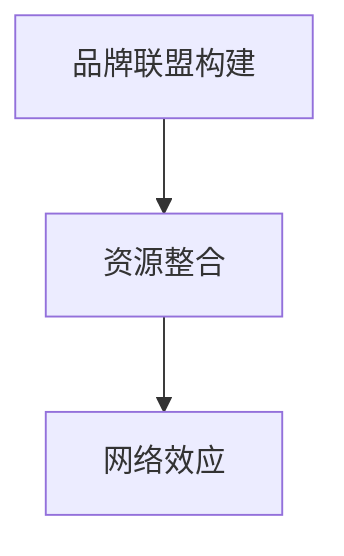

                 

# 建立个人品牌合作联盟：整合行业资源

> 关键词：品牌联盟,行业整合,资源共享,合作共赢,网络效应

## 1. 背景介绍

### 1.1 问题由来

在当今信息爆炸和市场竞争日益加剧的时代，单个企业或个人品牌在复杂多变的市场环境中难以独自应对挑战。如何在竞争中保持领先，如何扩大自身的市场影响力，成为了众多品牌共同面临的问题。品牌联盟（Brand Coalition）成为了一种新兴的商业模式，通过整合行业资源，利用网络效应，实现合作共赢。

### 1.2 问题核心关键点

品牌联盟的核心关键点在于其合作本质、资源整合能力和网络效应。品牌联盟通常由行业内的企业或个人品牌联合组建，共享市场资源、技术资源和客户资源，以共同面对外部市场的挑战。

- **合作本质**：品牌联盟是基于互利共赢的合作模式，各方通过资源共享和互补，实现双赢或多赢的局面。
- **资源整合**：联盟成员通过协同合作，优化资源配置，提升整体竞争力。
- **网络效应**：品牌联盟通过聚合更多的合作伙伴，产生更大的网络效应，实现更大的市场影响力。

## 2. 核心概念与联系

### 2.1 核心概念概述

品牌联盟作为一种合作模式，涉及多个相关概念，包括品牌联盟构建、资源整合、网络效应等。

- **品牌联盟构建**：指通过一系列谈判和协议，将多个品牌聚集在一起，共同组建一个组织，实现资源共享和协作。
- **资源整合**：指对联盟内各成员资源进行整合，形成更有效的资源配置和使用，提升整体竞争力。
- **网络效应**：指随着更多的品牌加入，品牌联盟的影响力和价值将呈指数级增长。

这些核心概念之间的关系可以通过以下Mermaid流程图来展示：



这个流程图展示了品牌联盟构建、资源整合和网络效应之间的逻辑关系：

1. 通过品牌联盟构建将各品牌聚合在一起。
2. 在联盟内部进行资源整合，提升整体竞争力。
3. 随着更多的品牌加入，品牌联盟的网络效应会不断增强。

## 3. 核心算法原理 & 具体操作步骤

### 3.1 算法原理概述

品牌联盟的构建和运营，本质上是一个多主体交互的优化问题。其核心在于如何通过合理的策略和协议，使各成员之间实现资源最优配置，从而提升整体联盟的价值。

形式化地，假设品牌联盟中有 $n$ 个品牌成员 $B_i$，其拥有的资源为 $R_i$，品牌联盟的目标是最大化整体联盟的资源总和 $R_{total}$：

$$
\max R_{total} = \sum_{i=1}^{n} R_i
$$

在实践中，可以通过以下步骤实现品牌联盟的构建和运营：

1. **选择合适的联盟伙伴**：根据各自品牌特性和需求，选择合适合作伙伴，建立合作关系。
2. **确定资源分配机制**：设计合理的资源分配规则，确保各成员在联盟中能够公平地获取资源。
3. **制定合作协议**：明确各方权利和义务，确保合作稳定性和可持续性。
4. **运营管理**：建立有效的运营管理体系，确保联盟资源高效配置和利用。

### 3.2 算法步骤详解

品牌联盟的构建和运营一般包括以下几个关键步骤：

**Step 1: 品牌筛选与评估**

- **品牌筛选**：通过筛选机制，选择符合联盟目标和要求的企业或个人品牌。
- **品牌评估**：对候选人进行评估，确保其具备必要的资源和技术能力，能够为联盟带来实质性贡献。

**Step 2: 资源整合与分配**

- **资源整合**：对各品牌成员的资源进行整合，形成统一的资源池。
- **资源分配**：根据各成员的需求和贡献，合理分配资源。

**Step 3: 制定合作协议**

- **合作条款**：明确各方的权利和义务，包括资源使用、收益分配、违约责任等。
- **合作期限**：约定合作期限，确保合作的稳定性和可持续性。

**Step 4: 运营管理与监控**

- **运营管理体系**：建立高效的运营管理体系，确保资源的有效配置和利用。
- **监控与反馈**：实时监控各成员的资源使用情况，及时调整资源分配策略。

**Step 5: 扩展与优化**

- **吸引新成员**：通过联盟的表现，吸引更多优质品牌加入，提升联盟的影响力。
- **优化运营策略**：根据市场变化，优化联盟的运营策略，提高资源利用效率。

### 3.3 算法优缺点

品牌联盟具有以下优点：

1. **资源共享**：通过资源整合，提高联盟的整体资源利用效率。
2. **风险分散**：各成员共同承担风险，降低了单个成员的风险压力。
3. **能力互补**：成员之间可以互补能力和资源，提升整体竞争力。
4. **市场影响力**：随着成员的增加，品牌联盟的市场影响力呈指数级增长。

同时，品牌联盟也存在一些局限性：

1. **协调成本高**：各成员之间的协调和沟通成本较高，需要高度的信任和合作精神。
2. **利益冲突**：成员之间可能存在利益冲突，需要平衡各方的利益诉求。
3. **合作周期长**：品牌联盟的建立和运营周期较长，需要持续的投入和维护。

## 4. 数学模型和公式 & 详细讲解

### 4.1 数学模型构建

品牌联盟的构建和运营可以通过数学模型进行建模和优化。以下是一个简化的数学模型：

设联盟中有 $n$ 个品牌成员 $B_i$，其拥有的资源为 $R_i$，联盟的目标是最大化整体联盟的资源总和 $R_{total}$：

$$
\max R_{total} = \sum_{i=1}^{n} R_i
$$

其中，每个品牌成员的资源可以表示为一个向量 $R_i = (r_{i1}, r_{i2}, ..., r_{in})$，其中 $r_{ij}$ 表示品牌成员在资源类型 $j$ 上拥有的资源量。

### 4.2 公式推导过程

为了最大化资源总和，我们可以使用线性规划（Linear Programming）方法进行求解。假设每个品牌成员资源的约束条件为 $C_i = (c_{i1}, c_{i2}, ..., c_{in})$，即成员 $i$ 在资源类型 $j$ 上的可用资源量。则线性规划问题可以表示为：

$$
\max \sum_{i=1}^{n} \sum_{j=1}^{m} r_{ij}
$$

约束条件为：

$$
\begin{cases}
\sum_{i=1}^{n} r_{ij} \leq C_j & \text{(资源总量约束)}\\
r_{ij} \geq 0 & \text{(非负约束)}
\end{cases}
$$

### 4.3 案例分析与讲解

以汽车行业为例，假设联盟中有三家汽车公司 $A$、$B$、$C$，它们分别拥有不同类型和数量的资源：

- 公司 $A$ 在发动机技术、智能化驾驶方面拥有优势，资源向量为 $R_A = (10, 5, 0, 0)$。
- 公司 $B$ 在电池技术和新能源方面有优势，资源向量为 $R_B = (0, 8, 5, 0)$。
- 公司 $C$ 在自动驾驶和车联网方面有优势，资源向量为 $R_C = (0, 0, 3, 2)$。

联盟的目标是最大化整体的资源总和 $R_{total}$：

$$
\max R_{total} = R_A + R_B + R_C = 10 + 5 + 0 + 0 + 0 + 8 + 5 + 0 + 0 + 0 + 3 + 2 = 30
$$

在实际应用中，可以通过线性规划工具（如Python的PuLP库）进行求解，找到最优的资源分配方案。

## 5. 项目实践：代码实例和详细解释说明

### 5.1 开发环境搭建

在进行品牌联盟的项目实践前，我们需要准备好开发环境。以下是使用Python进行PuLP开发的环境配置流程：

1. 安装Anaconda：从官网下载并安装Anaconda，用于创建独立的Python环境。

2. 创建并激活虚拟环境：
```bash
conda create -n coalition-env python=3.8 
conda activate coalition-env
```

3. 安装PuLP：
```bash
conda install pulp
```

4. 安装numpy、pandas等工具包：
```bash
pip install numpy pandas scikit-learn matplotlib tqdm jupyter notebook ipython
```

完成上述步骤后，即可在`coalition-env`环境中开始品牌联盟的项目实践。

### 5.2 源代码详细实现

以下是使用PuLP库实现品牌联盟资源分配的Python代码实现：

```python
from pulp import LpProblem, LpVariable, lpSum

# 创建线性规划问题
problem = LpProblem("BrandCoalition", LpMaximize)

# 定义品牌成员和资源类型
n = 3  # 品牌数量
resources = ["Engineering", "Electricity", "Autonomous", "Connectivity"]

# 定义品牌成员的资源向量
A = [10, 5, 0, 0]
B = [0, 8, 5, 0]
C = [0, 0, 3, 2]

# 定义资源向量
R = [A, B, C]

# 定义约束条件
C = [(10, 0, 0, 0), (0, 8, 0, 0), (0, 0, 3, 0), (0, 0, 0, 2)]

# 定义变量
variables = [LpVariable(f"x{i}", lowBound=0) for i in range(n*len(resources))]

# 目标函数
problem += lpSum([variables[i] * r for i, r in enumerate(R)])

# 约束条件
for i in range(n):
    problem += lpSum([variables[i + j] for j in range(len(resources))]) <= C[i]

# 求解
problem.solve()

# 输出结果
if problem.status == LpStatus.Optimal:
    print(f"最优资源总和：{problem.objective.value()}")
    print("资源分配方案：")
    for i in range(n):
        print(f"品牌 {i+1}：")
        for j in range(len(resources)):
            print(f"{resources[j]}: {problem.variables()[variables[i + j]].varValue}")
else:
    print("问题无解")
```

### 5.3 代码解读与分析

**变量定义**

在代码中，我们定义了变量 `variables`，表示每个品牌成员在每种资源上的分配量。变量下标从0开始，每次增加品牌数量 `n`，以确保每个品牌成员的每种资源都有对应的变量。

**目标函数**

目标函数 `problem += lpSum([variables[i] * r for i, r in enumerate(R)])` 表示最大化整体资源总和，其中 `R` 是品牌成员的资源向量，变量 `variables` 表示每种资源在每个品牌成员中的分配量。

**约束条件**

约束条件 `problem += lpSum([variables[i + j] for j in range(len(resources))]) <= C[i]` 表示每个品牌成员的总资源量不能超过其可用资源量 `C[i]`。

**求解与输出**

使用 `problem.solve()` 求解线性规划问题，并输出最优资源总和和每个品牌成员在每种资源上的分配量。

## 6. 实际应用场景

### 6.1 智能制造联盟

在智能制造领域，品牌联盟可以实现资源共享和能力互补，提升整体制造能力和效率。例如，汽车制造商、电子企业、物流公司等可以组成联盟，共享生产设备、技术专利、供应链资源等。通过品牌联盟，各方可以在智能制造、物流配送、售后服务等方面实现协同优化，提升整个制造行业的服务水平和市场竞争力。

### 6.2 金融科技联盟

在金融科技领域，品牌联盟可以实现技术协同和数据共享，提升金融服务的安全性和便捷性。例如，银行、保险公司、支付公司等可以组成联盟，共享技术平台、数据资源和用户信息，实现金融服务的个性化定制和精准推荐。通过品牌联盟，各方可以共同应对金融科技的挑战，提升金融服务的整体竞争力。

### 6.3 医疗健康联盟

在医疗健康领域，品牌联盟可以实现资源整合和能力互补，提升整体医疗服务水平。例如，医院、药店、健康管理公司等可以组成联盟，共享医疗资源、健康数据和患者信息，实现医疗服务的个性化和精准化。通过品牌联盟，各方可以共同提升医疗服务质量，优化医疗资源配置，推动医疗健康行业的创新发展。

### 6.4 未来应用展望

随着品牌联盟的不断发展和应用，未来在更多领域将实现更大的影响和价值。以下是一些可能的未来应用场景：

- **智慧城市联盟**：城市运营、交通管理、能源供应等领域的企业可以组成联盟，共享资源和技术，实现智慧城市的高效管理和运营。
- **环境保护联盟**：环保组织、企业、政府等可以组成联盟，共享环保技术和资源，提升整体环境保护能力。
- **教育科技联盟**：教育机构、技术公司、内容提供商等可以组成联盟，共享教育资源和平台，实现教育服务的个性化和智能化。

## 7. 工具和资源推荐

### 7.1 学习资源推荐

为了帮助开发者系统掌握品牌联盟的理论基础和实践技巧，这里推荐一些优质的学习资源：

1. **《网络经济学》**：介绍网络效应、品牌联盟等概念，是了解品牌联盟的必读之作。
2. **《品牌管理》**：介绍品牌联盟的构建、运营和管理，提供了丰富的案例分析。
3. **Coursera《Data Mining and Statistical Learning》课程**：斯坦福大学开设的机器学习课程，涉及聚类、分类、回归等数据处理和分析方法，有助于理解品牌联盟的数据驱动决策。
4. **Kaggle品牌联盟竞赛**：通过实践竞赛，锻炼品牌联盟的实际操作能力，积累项目经验。
5. **GitHub品牌联盟项目**：查看和参与开源项目，学习品牌联盟的最佳实践和代码实现。

通过对这些资源的学习实践，相信你一定能够快速掌握品牌联盟的理论基础和实践技巧，为品牌联盟的构建和运营奠定坚实基础。

### 7.2 开发工具推荐

高效的开发离不开优秀的工具支持。以下是几款用于品牌联盟开发的常用工具：

1. **PuLP**：Python的线性规划库，支持建模和求解线性规划问题，是品牌联盟资源分配的重要工具。
2. **Jupyter Notebook**：交互式笔记本环境，方便进行数据分析和代码调试，适合品牌联盟的实际应用。
3. **SQLAlchemy**：Python的SQL工具包，支持数据库连接、数据建模和查询，有助于品牌联盟的数据存储和管理。
4. **TensorFlow**：谷歌开源的深度学习框架，支持大规模数据处理和机器学习模型训练，适合品牌联盟的智能化决策。
5. **Docker**：容器化技术，便于品牌联盟的部署和管理，提升系统的稳定性和可移植性。

合理利用这些工具，可以显著提升品牌联盟的开发效率，加快创新迭代的步伐。

### 7.3 相关论文推荐

品牌联盟作为一种新兴的商业模式，相关研究正在不断深入。以下是几篇奠基性的相关论文，推荐阅读：

1. **《The Economics of Platforms》**：分析平台网络效应和品牌联盟的构建条件，是理解品牌联盟理论的重要文献。
2. **《Brand Coalitions: Foundations of Collective Brands》**：介绍品牌联盟的构建、运营和管理，提供丰富的案例分析。
3. **《Brand Alliance Building》**：分析品牌联盟的构建过程和机制，探讨品牌联盟的优化策略。
4. **《A Network Approach to Brand联盟》**：使用网络分析方法，研究品牌联盟的演化和稳定性。
5. **《Brand Alliances in Industry: The Role of Differentiation》**：分析品牌联盟在工业中的应用和效果，探讨品牌联盟的差异化策略。

这些论文代表了大联盟联盟的理论发展和应用实践，为你提供全面的理论支持和实践指导。

## 8. 总结：未来发展趋势与挑战

### 8.1 总结

本文对品牌联盟的理论基础和实践技巧进行了全面系统的介绍。首先阐述了品牌联盟的核心概念和构建原理，明确了品牌联盟的合作本质、资源整合能力和网络效应。其次，从理论到实践，详细讲解了品牌联盟的构建和运营步骤，并给出了具体的代码实现。同时，本文还探讨了品牌联盟在智能制造、金融科技、医疗健康等众多领域的应用前景，展示了品牌联盟的广泛应用价值。

通过本文的系统梳理，可以看到，品牌联盟作为一种合作模式，正逐步成为各行各业的重要工具，在资源共享、能力互补和市场扩展方面发挥着越来越重要的作用。未来，伴随品牌联盟理论和实践的不断完善，其应用场景和影响范围将进一步扩大，为各行业带来更大的合作价值。

### 8.2 未来发展趋势

展望未来，品牌联盟将呈现以下几个发展趋势：

1. **跨行业合作**：品牌联盟将跨越行业界限，形成跨行业的合作网络，提升整体竞争力。
2. **数字化转型**：品牌联盟将利用数字化技术，实现资源的智能化管理和优化。
3. **全球化拓展**：品牌联盟将扩展到全球市场，形成全球化的合作网络。
4. **智能化决策**：品牌联盟将利用机器学习和人工智能技术，实现决策的智能化和自动化。
5. **社会责任**：品牌联盟将注重社会责任，推动可持续发展，提升社会影响力。

以上趋势凸显了品牌联盟的未来发展潜力，将为各行各业带来更大的合作价值和竞争优势。

### 8.3 面临的挑战

尽管品牌联盟具有诸多优势，但在实践中仍面临诸多挑战：

1. **信任和协调**：品牌联盟需要高度的信任和良好的协调机制，以确保各成员的合作意愿和效率。
2. **利益平衡**：品牌联盟成员之间的利益平衡是关键，需要合理分配资源和收益。
3. **资源整合**：品牌联盟需要对各成员的资源进行有效整合，形成统一资源池。
4. **运营风险**：品牌联盟的运营过程中可能存在各种风险，需要建立有效的风险管理体系。
5. **数据安全和隐私**：品牌联盟涉及大量的数据共享，需要建立严格的数据安全和隐私保护机制。

这些挑战需要品牌联盟在实践中不断探索和解决，才能实现长期稳定的发展。

### 8.4 研究展望

未来，品牌联盟的研究将集中在以下几个方向：

1. **理论深化**：深化品牌联盟的理论研究，探索更加优化和可持续的合作机制。
2. **技术应用**：利用人工智能、大数据等技术，提升品牌联盟的资源配置和运营效率。
3. **实践探索**：在更多行业和领域推广品牌联盟，探索新的应用场景和合作模式。
4. **治理机制**：建立有效的品牌联盟治理机制，保障联盟的公平性和稳定性。
5. **社会影响**：研究品牌联盟对社会和环境的影响，推动可持续发展。

这些研究方向的探索，将推动品牌联盟理论的不断深化和实践的不断创新，为品牌联盟的未来发展奠定坚实基础。

## 9. 附录：常见问题与解答

**Q1: 品牌联盟与企业联盟的区别是什么？**

A: 品牌联盟和传统的企业联盟虽然在某些方面有相似之处，但核心区别在于其合作本质和资源整合能力。品牌联盟的目的是通过共享品牌价值和资源，提升整体市场影响力；而企业联盟则是基于具体的商业目标，实现资源的共享和合作。品牌联盟更注重品牌价值的共享和传递，而企业联盟则更注重业务和资源的具体合作。

**Q2: 品牌联盟的构建和运营需要注意哪些关键点？**

A: 品牌联盟的构建和运营需要注意以下几个关键点：
1. 选择合适的联盟伙伴，确保其具备必要的资源和技术能力。
2. 设计合理的资源分配机制，确保各成员在联盟中能够公平地获取资源。
3. 制定合作协议，明确各方的权利和义务，确保合作的稳定性和可持续性。
4. 建立高效的运营管理体系，确保资源的有效配置和利用。
5. 定期评估联盟表现，根据市场变化及时调整合作策略。

**Q3: 品牌联盟的扩展和优化策略有哪些？**

A: 品牌联盟的扩展和优化策略主要包括以下几个方面：
1. 吸引更多优质品牌加入，提升联盟的整体资源和市场影响力。
2. 优化资源分配策略，提高资源利用效率。
3. 引入新技术和新业务，提升联盟的创新能力和市场竞争力。
4. 建立更加紧密的合作关系，提升各成员之间的信任和协同。
5. 持续改进联盟的运营管理体系，确保合作的稳定性和可持续性。

**Q4: 如何衡量品牌联盟的价值？**

A: 品牌联盟的价值可以通过以下几个指标进行衡量：
1. 市场份额：联盟整体的市场份额和增长率。
2. 资源利用效率：联盟成员资源利用效率和合作效果。
3. 品牌影响力：联盟整体品牌价值和社会影响力。
4. 合作满意度：联盟成员对合作的满意度和合作意愿。
5. 经济效益：联盟整体的经济效益和收益。

通过综合衡量以上指标，可以评估品牌联盟的整体表现和价值。

---

作者：禅与计算机程序设计艺术 / Zen and the Art of Computer Programming

