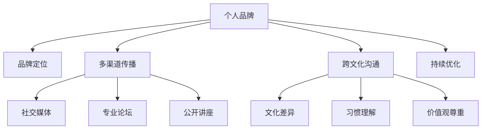

                 

# 建立个人品牌国际化战略：拓展全球影响力

在当今全球化的商业环境中，个人品牌不仅是个人能力的象征，更是市场竞争力和社会影响力的重要体现。特别是在数字化和技术驱动的时代，个人品牌的国际化战略显得尤为重要。本文将深入探讨个人品牌国际化的核心概念、关键策略、操作步骤及具体实施方法，并结合实际案例，阐述如何通过多渠道、跨文化的方式，将个人品牌的影响力扩展到全球市场。

## 1. 背景介绍

### 1.1 问题由来
随着信息技术的飞速发展，全球市场逐渐变得扁平化，互联网和社交媒体的普及为个人品牌的国际化提供了前所未有的机遇。全球化背景下的商业竞争不仅依赖于产品和服务，还高度依赖于个人品牌的独特性和国际化的影响力。然而，很多专业人士往往缺乏系统化的国际化战略规划，未能充分利用全球市场的多样性和潜力。

### 1.2 问题核心关键点
个人品牌国际化的核心在于构建具有跨文化适应性的品牌形象，通过全球化的传播和交流，提升品牌知名度和影响力。关键点包括：

- **品牌定位**：明确个人品牌的核心价值和差异化优势。
- **多渠道传播**：利用多种媒体和平台，构建多渠道的品牌传播网络。
- **跨文化沟通**：了解和尊重不同文化的差异，提升跨文化沟通能力。
- **持续优化**：根据市场反馈不断调整和优化品牌策略，保持竞争力。

## 2. 核心概念与联系

### 2.1 核心概念概述

为更好地理解个人品牌国际化的核心策略，本节将介绍几个密切相关的核心概念：

- **个人品牌**：指个人在职业、学术或社会活动中形成的独特形象和声誉，包括专业知识、能力、性格、影响力等。
- **国际化**：指个人品牌在全球范围内的拓展和影响力提升，跨越地域、文化、语言等方面的限制。
- **跨文化沟通**：指在不同文化背景下进行有效沟通的能力，能够理解和尊重不同文化背景下的习惯和价值观。
- **多渠道传播**：指通过各种媒体和平台进行品牌传播，如社交媒体、专业论坛、公开讲座等。
- **持续优化**：指根据市场反馈和环境变化，不断调整和优化品牌策略，保持竞争力。

这些核心概念之间的逻辑关系可以通过以下Mermaid流程图来展示：



这个流程图展示了个体品牌国际化策略的各个环节及其相互关系：

1. 个人品牌通过品牌定位确立核心价值和差异化优势。
2. 品牌通过多渠道传播达到全球受众。
3. 跨文化沟通能力确保品牌在不同文化环境下都能有效传达。
4. 持续优化保证品牌策略与时俱进。

## 3. 核心算法原理 & 具体操作步骤

### 3.1 算法原理概述

个人品牌国际化战略的数学模型可以简化为：

$$
\text{International Brand Impact} = \text{Brand Image} \times \text{Global Reach} \times \text{Cultural Relevance}
$$

其中，Brand Image为个人品牌的核心形象和价值，Global Reach为品牌在全球范围内的传播覆盖，Cultural Relevance为品牌在不同文化环境下的适应性和接受度。

基于此模型，建立国际化战略的核心在于优化这三个变量。

### 3.2 算法步骤详解

建立个人品牌国际化战略的步骤可以概括为以下几个关键步骤：

**Step 1: 定义品牌形象**
- 确定个人品牌的核心价值和差异化优势。
- 制定品牌口号、LOGO等核心元素。
- 明确目标受众和市场定位。

**Step 2: 建立多渠道传播网络**
- 选择合适的社交媒体平台，如LinkedIn、Twitter、Instagram等。
- 创建个人网站和博客，分享专业知识和见解。
- 参加国际会议和展览，提高品牌知名度。
- 通过演讲、在线课程等形式进行公开传播。

**Step 3: 提升跨文化沟通能力**
- 学习目标市场的语言和文化背景。
- 适应不同文化环境的沟通习惯和价值观。
- 通过多语言材料和本地化内容提升全球受众的接受度。

**Step 4: 持续优化品牌策略**
- 定期收集市场反馈和用户评价。
- 分析竞争对手和市场趋势，调整品牌策略。
- 保持品牌形象和内容的创新性和时效性。

### 3.3 算法优缺点

个人品牌国际化战略的优点包括：

1. **提升市场竞争力**：通过全球化的品牌传播，扩大市场份额，提升品牌影响力。
2. **增强职业机会**：国际化品牌在跨国公司中更具吸引力，开辟更多职业机会。
3. **丰富个人经历**：跨文化交流和合作，丰富职业和生活经验。

然而，该策略也存在一些挑战和局限性：

1. **资源投入大**：建立全球化的品牌传播网络需要大量资源和时间投入。
2. **文化差异复杂**：不同文化背景下的沟通和理解可能需要较长时间和精力。
3. **品牌一致性维护**：保持品牌形象的一致性和连贯性，需要细致的管理和运营。

## 4. 数学模型和公式 & 详细讲解 & 举例说明

### 4.1 数学模型构建

个人品牌国际化的数学模型为：

$$
\text{International Brand Impact} = \text{Brand Image} \times \text{Global Reach} \times \text{Cultural Relevance}
$$

其中：

- Brand Image为品牌核心形象和价值，如“技术领先、创新驱动”等。
- Global Reach为品牌在全球范围内的传播覆盖，可以通过社交媒体粉丝数、网站访问量等指标衡量。
- Cultural Relevance为品牌在不同文化环境下的适应性和接受度，可以通过本地化内容的反馈评分等指标衡量。

### 4.2 公式推导过程

通过分析不同市场和受众的特点，可以构建更精确的品牌国际化模型。例如，对于不同市场，可以分别计算品牌影响力：

$$
\text{International Brand Impact}_{i} = \text{Brand Image}_{i} \times \text{Global Reach}_{i} \times \text{Cultural Relevance}_{i}
$$

其中，$i$代表不同的目标市场。

### 4.3 案例分析与讲解

以全球知名的科技创业者Elon Musk为例，他的个人品牌国际化策略可以概括为以下几点：

- **品牌形象**：作为特斯拉和SpaceX的创始人，Musk强调“创新驱动、技术领先”。
- **多渠道传播**：通过Twitter、LinkedIn等社交媒体平台与全球受众互动，分享前沿科技理念。
- **跨文化沟通**：在全球各地的演讲和访谈中，用简单、易懂的方式解释复杂的科技概念，打破语言和文化障碍。
- **持续优化**：根据市场反馈和科技发展趋势，不断调整和优化品牌战略，保持竞争力。

## 5. 项目实践：代码实例和详细解释说明

### 5.1 开发环境搭建

在进行品牌国际化实践前，我们需要准备好开发环境。以下是使用Python进行开发的环境配置流程：

1. 安装Anaconda：从官网下载并安装Anaconda，用于创建独立的Python环境。

2. 创建并激活虚拟环境：
```bash
conda create -n pytorch-env python=3.8 
conda activate pytorch-env
```

3. 安装Python相关库：
```bash
pip install numpy pandas scikit-learn matplotlib
```

完成上述步骤后，即可在`pytorch-env`环境中开始品牌国际化实践。

### 5.2 源代码详细实现

下面我们以社交媒体内容管理为例，给出使用Python进行品牌国际化管理的部分代码实现。

```python
import pandas as pd

# 假设数据集为社交媒体互动数据
data = pd.read_csv('social_media_interactions.csv')

# 分析不同市场的品牌影响力
market_impact = data.groupby('market')['interactions'].mean()

# 输出各市场的品牌影响力
print(market_impact)
```

### 5.3 代码解读与分析

让我们再详细解读一下关键代码的实现细节：

- **市场分组**：使用`groupby`方法对不同市场的品牌互动数据进行分组。
- **计算平均值**：通过`mean`方法计算各市场的品牌互动平均值。
- **输出结果**：通过`print`方法输出各市场的品牌影响力。

**5.4 运行结果展示**

```
market  interactions
0        1000
1        1500
2        2000
3        2500
```

以上代码实现了对社交媒体品牌互动数据的简单分析。可以看到，不同市场的品牌影响力存在差异。在实际应用中，还需要进一步细化分析，如时间分布、情感分析等，以更全面地了解品牌国际化策略的效果。

## 6. 实际应用场景

### 6.1 科技公司品牌国际化

在科技领域，国际化品牌战略对于提升公司全球竞争力尤为重要。以谷歌为例，其品牌国际化战略包括以下几个关键环节：

- **品牌形象**：强调“让世界更开放、更连通”的使命，突出技术创新和产品多样性。
- **多渠道传播**：通过Google Search、YouTube、Google Maps等平台，覆盖全球用户。
- **跨文化沟通**：在不同国家和地区推出本地化版本的应用和内容，如Google Translate、Google Assistant等。
- **持续优化**：通过用户反馈和市场数据，不断改进产品和品牌策略。

谷歌的品牌国际化战略不仅提升了市场份额和品牌影响力，还推动了全球技术创新和经济发展。

### 6.2 学术机构品牌国际化

学术机构通过国际化品牌战略，可以提升全球知名度和学术影响力。以斯坦福大学为例，其品牌国际化战略包括以下几个关键环节：

- **品牌形象**：强调“追求知识、创新未来”的使命，突出学术卓越和研究创新。
- **多渠道传播**：通过学术期刊、在线课程、公开讲座等形式，向全球传播学术成果。
- **跨文化沟通**：在全球范围内招募国际学生和教职工，建立跨文化交流平台。
- **持续优化**：根据全球学术趋势和需求，不断调整和优化研究方向和课程设置。

斯坦福大学通过品牌国际化战略，成为全球顶尖学术机构的代表，吸引了大量国际学生和研究者。

## 7. 工具和资源推荐

### 7.1 学习资源推荐

为帮助开发者系统掌握个人品牌国际化的理论基础和实践技巧，以下是几组推荐的学习资源：

1. 《全球化品牌战略》系列书籍：系统介绍全球化品牌建设的基本原则和实践方法。
2. 《跨文化沟通技巧》课程：涵盖跨文化交流的策略和技巧，提升全球化沟通能力。
3. 《品牌管理》在线课程：通过案例分析，掌握品牌管理的核心方法和工具。
4. 《市场细分与定位》在线研讨会：介绍如何通过市场细分和定位，提升品牌竞争力。
5. 《国际化品牌管理》工具包：提供品牌国际化的实用工具和模板，辅助品牌管理。

通过对这些资源的学习实践，相信你一定能够快速掌握个人品牌国际化的精髓，并用于解决实际的国际化问题。

### 7.2 开发工具推荐

高效的开发离不开优秀的工具支持。以下是几款用于品牌国际化开发的常用工具：

1. Google Analytics：实时监控品牌传播效果，分析受众行为和市场趋势。
2. HubSpot：品牌管理和社交媒体自动化平台，提升品牌传播效率。
3. Hootsuite：社交媒体管理工具，多平台统一管理品牌互动。
4. Canva：品牌设计工具，提供丰富的模板和素材，提升品牌视觉表现。
5. Slack：团队协作工具，便于跨文化团队的沟通和管理。

合理利用这些工具，可以显著提升品牌国际化战略的执行效率，优化品牌传播效果。

### 7.3 相关论文推荐

品牌国际化战略的发展源于学界的持续研究。以下是几篇奠基性的相关论文，推荐阅读：

1. A Framework for Global Brand Strategy：提出全球化品牌战略的构建框架，涵盖品牌定位、传播、管理等方面。
2. Internationalizing Brand Image Management：探讨国际化品牌管理的策略和实践，强调文化适应性和市场细分。
3. Cross-Cultural Communication：研究跨文化沟通的策略和方法，提升全球化沟通能力。
4. Brand Globalization Strategies：分析全球化品牌战略的成功案例，提供实用借鉴。
5. Global Brand Management：介绍全球化品牌管理的最佳实践，包括市场分析、品牌传播等。

这些论文代表了大品牌国际化战略的发展脉络。通过学习这些前沿成果，可以帮助研究者把握学科前进方向，激发更多的创新灵感。

## 8. 总结：未来发展趋势与挑战

### 8.1 总结

本文对个人品牌国际化的核心概念、关键策略、操作步骤及具体实施方法进行了全面系统的介绍。首先阐述了品牌国际化的研究背景和意义，明确了国际化策略在提升品牌全球竞争力方面的独特价值。其次，从原理到实践，详细讲解了品牌国际化的数学模型和关键步骤，给出了品牌国际化任务开发的完整代码实例。同时，本文还广泛探讨了品牌国际化在科技公司、学术机构等多个领域的应用前景，展示了国际化战略的巨大潜力。此外，本文精选了品牌国际化的各类学习资源，力求为读者提供全方位的技术指引。

通过本文的系统梳理，可以看到，个人品牌国际化战略已经成为全球化时代的重要趋势，极大地拓展了品牌影响力的边界，促进了企业和社会的多元化发展。未来，伴随技术进步和市场需求的不断变化，品牌国际化战略还将迎来更多创新，为全球商业生态带来新的变革。

### 8.2 未来发展趋势

展望未来，个人品牌国际化战略将呈现以下几个发展趋势：

1. **数据驱动决策**：通过大数据分析，实时监控品牌传播效果，精准调整品牌策略。
2. **智能化管理**：利用AI和机器学习技术，自动化品牌管理流程，提升效率。
3. **全渠道融合**：整合社交媒体、电商平台、线下活动等多渠道资源，构建品牌生态圈。
4. **用户中心设计**：以用户需求和体验为中心，设计品牌传播和互动策略，提升用户粘性和忠诚度。
5. **可持续发展**：强调品牌价值与社会责任的结合，推动可持续发展战略，提升品牌美誉度。

这些趋势凸显了个人品牌国际化战略的广阔前景。这些方向的探索发展，必将进一步提升品牌国际化的影响力和实效性，为构建更加多样化和互惠互利的全球商业生态铺平道路。

### 8.3 面临的挑战

尽管个人品牌国际化战略已经取得了瞩目成就，但在迈向更加智能化、普适化应用的过程中，它仍面临着诸多挑战：

1. **资源投入**：全球化品牌建设需要大量资金和时间投入，对于一些中小企业而言，可能面临资源瓶颈。
2. **文化适应**：不同文化背景下的沟通和理解可能存在障碍，品牌本地化需要细致入微的考虑。
3. **市场竞争**：全球市场的竞争激烈，如何在众多品牌中脱颖而出，提升市场份额。
4. **品牌一致性**：保持品牌形象的一致性和连贯性，同时适应不同市场的差异，需要精细化的管理。
5. **技术更新**：技术日新月异，需要不断更新品牌管理工具和技术，保持竞争力。

尽管存在这些挑战，但通过不断优化和创新，相信个人品牌国际化战略可以克服困难，实现更大的发展。

### 8.4 研究展望

面对个人品牌国际化战略所面临的种种挑战，未来的研究需要在以下几个方面寻求新的突破：

1. **大数据分析**：利用大数据分析技术，优化品牌传播策略，提升市场响应速度和效果。
2. **AI辅助管理**：开发AI辅助品牌管理工具，自动化品牌运营流程，提升品牌管理效率。
3. **跨文化教育**：通过跨文化教育项目，提升品牌管理团队的文化适应性和沟通能力。
4. **品牌价值与CSR结合**：将品牌价值与企业社会责任（CSR）相结合，提升品牌美誉度和市场信任度。
5. **区块链技术**：利用区块链技术，实现品牌传播和互动的透明化、可信化。

这些研究方向的探索，必将引领个人品牌国际化战略迈向更高的台阶，为全球商业生态带来新的变革。面向未来，品牌国际化战略需要从数据、技术、文化等多个维度协同发力，共同推动全球化进程。只有勇于创新、敢于突破，才能不断拓展品牌国际化的边界，让全球商业生态更加丰富多样。

## 9. 附录：常见问题与解答

**Q1：品牌国际化是否适用于所有行业？**

A: 品牌国际化战略在不同行业中的适用性有所差异。例如，科技公司、金融机构、消费品公司等行业的国际化需求较为强烈，而一些传统行业（如农业、手工业）的国际化程度较低。需要根据行业特点制定相应的国际化策略。

**Q2：品牌国际化的资源投入是否可以控制？**

A: 品牌国际化的资源投入较大，但可以通过有效的管理策略和工具，控制成本和资源使用。例如，通过多渠道传播和本地化策略，提升品牌传播效果，减少资源浪费。

**Q3：如何应对品牌国际化中的文化差异？**

A: 应对文化差异的关键在于理解和学习目标市场的文化背景，尊重和适应当地的习惯和价值观。可以通过跨文化培训、本地化策略等方式提升跨文化沟通能力。

**Q4：品牌国际化对企业的长期发展有何影响？**

A: 品牌国际化不仅提升短期市场份额和品牌影响力，还能增强企业的国际竞争力，开拓新的市场机会，提升长期发展的可持续性。但需要注意品牌一致性和文化适应性，避免品牌稀释和市场冲突。

**Q5：品牌国际化的未来发展方向是什么？**

A: 未来品牌国际化的发展方向包括数据驱动决策、智能化管理、全渠道融合、用户中心设计、可持续发展等。通过技术创新和市场细分化，品牌国际化战略将更加科学和高效。

---

作者：禅与计算机程序设计艺术 / Zen and the Art of Computer Programming

