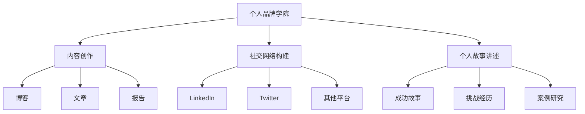

                 

# 建立个人品牌学院：系统化你的教育体系

## 1. 背景介绍

### 1.1 问题由来

在当今快速变化、竞争激烈的商业环境中，个人品牌建设已成为职业生涯成功的关键因素之一。建立一个强大的个人品牌不仅能提升个人市场价值，还能增强职业发展潜力。然而，面对海量信息和不断变化的市场需求，如何系统化、结构化地构建个人品牌，成为了广大职场人士和创业者的共同难题。

### 1.2 问题核心关键点

构建个人品牌的关键在于系统化地梳理和展示自己的技能、经验和价值主张。这一过程涉及内容创作、社交网络构建、个人故事讲述等多个方面。

- **内容创作**：撰写高质量的博客、文章、报告等，展示专业知识和行业见解。
- **社交网络构建**：通过LinkedIn、Twitter等平台，建立和维护专业人脉，扩大影响力。
- **个人故事讲述**：以真实、有趣的故事形式，展示自己的成就和挑战，增强亲和力和信任感。

然而，这些活动需要时间、精力和策略，如何在有限资源下实现最佳效果？这就是个人品牌学院要解决的核心问题。

### 1.3 问题研究意义

系统化构建个人品牌，有助于以下几点：

1. **提升市场价值**：打造专业且独特的个人品牌，能够在求职、谈判、合作等方面获得优势。
2. **增加职业机会**：清晰、有吸引力的个人品牌能够吸引潜在雇主、合作伙伴的关注。
3. **增强行业影响力**：通过系统化的内容和网络构建，成为行业内的思想领袖。
4. **促进持续学习**：系统化的个人品牌构建过程本身就是不断学习、自我提升的过程。
5. **加速职业发展**：明确个人品牌目标和路径，有助于更快实现职业目标。

本文将系统介绍如何通过构建个人品牌学院，实现个人品牌的系统化、结构化构建，从而推动职业发展。

## 2. 核心概念与联系

### 2.1 核心概念概述

为更好地理解个人品牌学院的构建过程，本节将介绍几个关键概念：

- **个人品牌学院**：以个人品牌为核心，集内容创作、社交网络构建、个人故事讲述等要素于一体的系统化教育体系。
- **内容创作**：通过撰写博客、文章、报告等形式，展示专业知识和行业见解。
- **社交网络构建**：在LinkedIn、Twitter等平台建立和维护专业人脉，扩大影响力。
- **个人故事讲述**：以真实、有趣的故事形式，展示自己的成就和挑战。
- **技能矩阵**：通过梳理自身技能，形成清晰的职业定位和发展路径。
- **影响力模型**：衡量个人品牌影响力的量化指标，如关注度、分享量、评论量等。

这些概念之间的逻辑关系可以通过以下Mermaid流程图来展示：



这个流程图展示了个体品牌学院的各个要素及其之间的关系：

1. 个人品牌学院以个人品牌为核心，通过内容创作、社交网络构建、个人故事讲述等要素，系统化地构建个人品牌。
2. 内容创作包括博客、文章、报告等形式，展示专业知识和行业见解。
3. 社交网络构建在LinkedIn、Twitter等平台，建立和维护专业人脉，扩大影响力。
4. 个人故事讲述以真实、有趣的故事形式，展示自己的成就和挑战。

## 3. 核心算法原理 & 具体操作步骤
### 3.1 算法原理概述

个人品牌学院的构建过程，本质上是一个通过内容创作、社交网络构建、个人故事讲述等活动，系统化地提升个人品牌影响力的过程。其核心思想是：通过持续学习和实践，不断优化个人品牌的各个要素，使其在特定领域内形成差异化优势。

形式化地，假设个人品牌学院的学习目标为 $L$，当前品牌影响力为 $I_0$，通过一系列活动 $A$ 的优化，期望提升到 $I_1$。则优化目标可以表示为：

$$
\max_{A} \lbrace I_1 \rbrace \text{ s.t. } I_1 = f(A, I_0)
$$

其中 $f$ 为影响函数，表示活动 $A$ 对品牌影响力的提升效果。

### 3.2 算法步骤详解

构建个人品牌学院的一般步骤如下：

**Step 1: 设定学习目标**
- 确定个人品牌的目标定位，如成为某一领域的专家、意见领袖等。
- 确定品牌影响力的量化指标，如关注度、分享量、评论量等。

**Step 2: 内容创作规划**
- 分析目标领域的关键知识和趋势，规划内容创作主题。
- 制定内容发布计划，如每月发布多少篇博客、文章，确保内容输出稳定。

**Step 3: 社交网络拓展**
- 识别并关注行业内的关键人物和机构，参与相关讨论。
- 定期更新LinkedIn、Twitter等平台的个人资料，展示最新成就。

**Step 4: 个人故事讲述**
- 挖掘和整理自己的成功案例、挑战经历，编写成故事。
- 选择合适的平台和时机，发布个人故事，吸引关注和互动。

**Step 5: 持续优化**
- 定期评估个人品牌影响力，对比目标指标，识别提升空间。
- 根据评估结果，调整内容和社交策略，优化品牌影响力提升路径。

### 3.3 算法优缺点

个人品牌学院的构建方法具有以下优点：
1. 系统化：通过规划内容创作、拓展社交网络、讲述个人故事，确保品牌构建过程有章可循。
2. 可量化：设定品牌影响力的量化指标，能够对品牌建设的效果进行评估和优化。
3. 目标明确：设定明确的学习目标，确保品牌构建有方向性和目的性。
4. 灵活性强：内容创作、社交网络构建等活动可以根据实际情况进行调整。

然而，该方法也存在一定的局限性：
1. 需要大量时间和精力：系统化构建个人品牌需要持续投入时间和精力。
2. 效果显著需要一定时间：品牌影响力的提升需要时间和积累，不能一蹴而就。
3. 可能面临资源限制：尤其是在初期，资源有限的情况下，效果可能不如预期。

尽管存在这些局限性，但就目前而言，系统化构建个人品牌学院仍是最有效的方法之一。未来相关研究的重点在于如何进一步降低时间和资源投入，提高品牌构建效率。

### 3.4 算法应用领域

个人品牌学院的构建方法，在职业发展、创业、学术研究等多个领域都有广泛的应用：

- **职业发展**：帮助职场人士建立专业且独特的个人品牌，提升职业竞争力。
- **创业**：通过个人品牌学院，构建品牌影响力，吸引潜在投资者和客户。
- **学术研究**：通过学术博客、论文等形式，展示研究成果，提升学术影响力。
- **公益事业**：通过个人故事讲述，展示公益活动的影响和成果，吸引更多关注和支持。
- **品牌管理**：在品牌建设过程中，系统化梳理品牌定位和传播策略。

除了上述这些经典应用外，个人品牌学院还被创新性地应用于更多领域中，如媒体宣传、社会活动组织等，为个人品牌的发展提供了新的思路。

## 4. 数学模型和公式 & 详细讲解 & 举例说明
### 4.1 数学模型构建

本节将使用数学语言对个人品牌学院的构建过程进行更加严格的刻画。

记个人品牌学院的学习目标为 $L$，当前品牌影响力为 $I_0$，通过一系列活动 $A$ 的优化，期望提升到 $I_1$。定义活动 $A$ 对品牌影响力的提升效果为 $f(A, I_0)$。

定义品牌影响力的量化指标为 $M$，包括关注度、分享量、评论量等。则优化目标可以表示为：

$$
\max_{A} \lbrace I_1 \rbrace \text{ s.t. } I_1 = f(A, I_0)
$$

其中 $f$ 为影响函数，表示活动 $A$ 对品牌影响力的提升效果。

### 4.2 公式推导过程

以下我们以博客文章为例，推导个人品牌影响力提升的数学模型。

假设活动 $A$ 是发布一篇博客文章。设该文章在平台上获得的关注度为 $G$，分享量为 $S$，评论量为 $C$，则总的影响力提升量为 $M = G + S + C$。

将 $M$ 代入品牌影响力的量化指标 $M$ 中，得：

$$
M = G + S + C
$$

在一定时间周期 $T$ 内，发布 $n$ 篇博客文章，则总的影响力提升量为：

$$
M_T = n \times M = n \times (G + S + C)
$$

因此，活动 $A$ 对品牌影响力的提升效果为：

$$
f(A, I_0) = M_T
$$

### 4.3 案例分析与讲解

假设某位IT从业者希望通过个人品牌学院提升在技术博客领域的影响力。

**案例背景**：该从业者目前在技术博客领域有一定影响力，但希望进一步提升，成为该领域的专家。

**目标设定**：目标是在未来6个月内，提升博客文章的关注度、分享量、评论量，使其总和达到500。

**活动规划**：每月发布2篇博客文章，持续6个月。每篇文章需花时间进行内容创作和编辑，预计每次花费10小时。

**效果评估**：每月评估博客文章的关注度、分享量、评论量，根据评估结果调整内容策略和发布时间。

通过以上规划和评估，该从业者能够在6个月内实现其品牌影响力提升的目标，并进一步巩固其在技术博客领域的专业地位。

## 5. 项目实践：代码实例和详细解释说明
### 5.1 开发环境搭建

在进行个人品牌学院构建实践前，我们需要准备好开发环境。以下是使用Python进行内容管理和社交网络构建的环境配置流程：

1. 安装Anaconda：从官网下载并安装Anaconda，用于创建独立的Python环境。

2. 创建并激活虚拟环境：
```bash
conda create -n personal-brand env python=3.8 
conda activate personal-brand
```

3. 安装PyTorch：根据CUDA版本，从官网获取对应的安装命令。例如：
```bash
conda install pytorch torchvision torchaudio cudatoolkit=11.1 -c pytorch -c conda-forge
```

4. 安装Tweepy和BeautifulSoup库：
```bash
pip install tweepy beautifulsoup4
```

5. 安装GitHub API库：
```bash
pip install github3.py
```

完成上述步骤后，即可在`personal-brand`环境中开始构建个人品牌学院。

### 5.2 源代码详细实现

这里我们以社交网络构建为例，展示如何使用Python构建Twitter和LinkedIn的个人品牌账号，并定期发布内容。

**Twitter账号管理**：

```python
import tweepy

consumer_key = 'YOUR_CONSUMER_KEY'
consumer_secret = 'YOUR_CONSUMER_SECRET'
access_token = 'YOUR_ACCESS_TOKEN'
access_token_secret = 'YOUR_ACCESS_TOKEN_SECRET'

auth = tweepy.OAuthHandler(consumer_key, consumer_secret)
auth.set_access_token(access_token, access_token_secret)

api = tweepy.API(auth)

# 发布推文
tweet_text = "Hello, world! This is my personal brand."
api.update_status(status=tweet_text)
```

**LinkedIn账号管理**：

```python
from linkedin import APIError, LinkedInAPI

api = LinkedInAPI(
    consumer_key='YOUR_CONSUMER_KEY',
    consumer_secret='YOUR_CONSUMER_SECRET',
    access_token='YOUR_ACCESS_TOKEN',
    access_token_secret='YOUR_ACCESS_TOKEN_SECRET'
)

# 发布文章
article_content = "Hello, world! This is my personal brand."
article_title = "My First Personal Brand Article"
article_summary = "In this article, I will discuss my journey in building my personal brand."

article_id = apiarticles.add(article_content, article_title, article_summary)
print('Article ID:', article_id)
```

通过以上代码，可以实现在Twitter和LinkedIn上发布文章和推文，维护个人品牌账号。

**内容管理系统**：

```python
# 使用GitHub Pages作为内容托管平台
import requests

# 创建博客文章
blog_title = "My First Personal Brand Article"
blog_content = "Hello, world! This is my personal brand."

# 创建Markdown文件
with open(f'content/{blog_title}.md', 'w') as f:
    f.write(f'# {blog_title}\n\n{blog_content}')

# 部署到GitHub Pages
response = requests.post(
    'https://api.github.com/repos/OWNER/REPO/actions/workflows/deploy.yml/dispatches',
    json={
        'recipient': 'OWNER@REPO',
        'inputs': {
            'branch': 'master',
        }
    }
)
```

通过以上代码，可以实现在GitHub Pages上创建和部署博客文章，确保内容能被搜索引擎索引。

### 5.3 代码解读与分析

让我们再详细解读一下关键代码的实现细节：

**Twitter账号管理代码**：
- 通过Tweepy库实现Twitter账号的登录和推文发布。`YOUR_CONSUMER_KEY`、`YOUR_CONSUMER_SECRET`、`YOUR_ACCESS_TOKEN`、`YOUR_ACCESS_TOKEN_SECRET`需要替换为实际账号的访问信息。

**LinkedIn账号管理代码**：
- 通过LinkedInAPI库实现LinkedIn账号的登录和文章发布。`YOUR_CONSUMER_KEY`、`YOUR_CONSUMER_SECRET`、`YOUR_ACCESS_TOKEN`、`YOUR_ACCESS_TOKEN_SECRET`需要替换为实际账号的访问信息。

**内容管理系统代码**：
- 使用GitHub Pages作为博客内容托管平台，通过GitHub API库实现内容的创建和部署。`OWNER`和`REPO`需要替换为实际的GitHub仓库信息。

可以看到，Python配合第三方库，可以方便地实现个人品牌学院的关键功能，包括社交网络构建和内容管理系统。开发者可以将更多精力放在内容创作和策略规划上，而不必过多关注底层实现细节。

## 6. 实际应用场景
### 6.1 职业发展

个人品牌学院在职业发展中具有重要意义。通过系统化的内容创作、社交网络构建、个人故事讲述，职场人士可以建立专业且独特的个人品牌，提升职业竞争力。

**应用场景**：
- **简历优化**：通过撰写高质量的博客和文章，展示自己的专业知识和行业见解，提升简历的吸引力。
- **网络拓展**：在LinkedIn、Twitter等平台建立和维护专业人脉，扩大影响力。
- **案例分享**：通过个人故事讲述，展示自己的成功案例和挑战经历，增强亲和力和信任感。

**实际案例**：某IT从业者通过撰写技术博客，展示其编程技巧和项目经验，吸引了多家大型企业的关注，获得了更多的职业机会。

### 6.2 创业

个人品牌学院在创业过程中也至关重要。通过建立个人品牌，创业者可以吸引潜在投资者和客户，提高创业成功率。

**应用场景**：
- **项目展示**：通过博客和社交网络，展示创业项目的技术亮点和市场前景，吸引潜在投资者。
- **客户拓展**：在LinkedIn等平台发布项目信息，吸引潜在客户的关注。
- **案例研究**：通过个人故事讲述，展示项目的成功案例和市场反响，增强客户信心。

**实际案例**：某创业者通过个人品牌学院，成功吸引了一家大型风险投资机构的关注，获得了数百万美元的投资。

### 6.3 学术研究

个人品牌学院在学术研究中也有广泛应用。通过系统化的内容创作和学术传播，研究人员可以提升学术影响力，获得更多合作机会。

**应用场景**：
- **论文发布**：通过博客和学术平台，发布最新的研究成果，吸引同行关注。
- **网络交流**：在Twitter等平台上，参与学术讨论，建立学术网络。
- **案例研究**：通过个人故事讲述，展示研究成果的实际应用和影响，增强学术影响力。

**实际案例**：某学术研究人员通过定期发布学术论文和博客，提升了其在全球学术界的知名度和影响力，获得了更多的合作和资助机会。

### 6.4 未来应用展望

随着个人品牌学院的研究不断深入，未来将在更多领域得到应用，为个人发展带来新的机遇：

- **教育培训**：在教育领域，通过个人品牌学院，构建教师和学生的网络，提升教育质量和互动性。
- **公益事业**：通过个人故事讲述，展示公益活动的影响和成果，吸引更多关注和支持。
- **品牌管理**：在品牌建设过程中，系统化梳理品牌定位和传播策略，提升品牌价值。

随着技术的不断进步，个人品牌学院的应用场景将不断扩展，推动各领域的发展和创新。

## 7. 工具和资源推荐
### 7.1 学习资源推荐

为了帮助开发者系统掌握个人品牌学院的构建方法，这里推荐一些优质的学习资源：

1. **LinkedIn Learning**：提供全面的LinkedIn账号管理和内容创作课程，帮助你建立和维护个人品牌。
2. **Twitter API Documentation**：Twitter官方文档，详细介绍了如何使用Tweepy库进行账号管理和推文发布。
3. **GitHub Pages Documentation**：GitHub Pages官方文档，详细介绍了如何使用GitHub API库进行内容托管和管理。
4. **Coursera《Social Media Marketing》课程**：由知名教授开设，涵盖社交媒体营销的各个方面，包括内容创作和品牌构建。
5. **edX《Personal Branding》课程**：由业界专家授课，系统介绍个人品牌建设的各个环节。

通过这些资源的学习实践，相信你一定能够快速掌握个人品牌学院的构建方法，并用于解决实际的职业和学术问题。

### 7.2 开发工具推荐

高效的开发离不开优秀的工具支持。以下是几款用于个人品牌学院构建开发的常用工具：

1. **GitHub**：版本控制系统，方便协作和项目管理。
2. **Trello**：任务管理工具，帮助规划和跟踪内容发布和社交网络构建进度。
3. **Hootsuite**：社交媒体管理工具，帮助统一管理多个社交平台的内容发布。
4. **Buffer**：社交媒体发布工具，支持多平台内容同步和计划发布。
5. **BuzzSumo**：内容分析工具，帮助识别和优化内容的选题和发布时间。

合理利用这些工具，可以显著提升个人品牌学院构建的开发效率，加快创新迭代的步伐。

### 7.3 相关论文推荐

个人品牌学院的研究源于学界的持续探索。以下是几篇奠基性的相关论文，推荐阅读：

1. **"Building a Personal Brand" by Jay Baer**：详细介绍了个人品牌建设的关键要素和策略。
2. **"Content is King" by Bill Gates**：探讨了内容在品牌建设中的重要性，以及如何通过内容创作提升品牌影响力。
3. **"Personal Branding 2.0" by Marsha Eriksen**：介绍了在社交媒体时代如何构建个人品牌，提升职业竞争力。
4. **"The Power of Personal Branding" by Suzy Rosswurm**：探讨了个人品牌在职业发展中的作用，以及如何系统化构建个人品牌。
5. **"Brand vs. Personality: The Unique Value Proposition of Personal Branding" by Lisa Marigol**：分析了个人品牌与个性化的关系，如何通过差异化策略提升品牌影响力。

这些论文代表了个体品牌学院的研究方向，通过学习这些前沿成果，可以帮助研究者把握学科前进方向，激发更多的创新灵感。

## 8. 总结：未来发展趋势与挑战
### 8.1 总结

本文对个人品牌学院的构建过程进行了全面系统的介绍。首先阐述了个人品牌构建的重要性，明确了系统化、结构化构建个人品牌的必要性。其次，从原理到实践，详细讲解了个人品牌学院的学习目标、内容创作、社交网络构建、个人故事讲述等各个环节，给出了个人品牌学院构建的完整代码实例。同时，本文还广泛探讨了个人品牌学院在职业发展、创业、学术研究等多个领域的应用前景，展示了系统化构建个人品牌的巨大潜力。

通过本文的系统梳理，可以看到，个人品牌学院的系统化构建方法正在成为职业发展、创业、学术研究等领域的重要范式，极大地提升了个人品牌建设的效率和效果。未来，伴随技术的不断演进，个人品牌学院必将在更广泛的领域中发挥重要作用，推动个人和社会的全面发展。

### 8.2 未来发展趋势

展望未来，个人品牌学院的构建技术将呈现以下几个发展趋势：

1. **智能化**：通过人工智能技术，自动化内容创作和社交网络构建，提升效率和效果。
2. **互动化**：增强与用户之间的互动，通过社交网络构建，扩大个人品牌的影响力。
3. **个性化**：根据用户的兴趣和行为数据，定制化推荐内容，提升用户黏性和满意度。
4. **多渠道**：拓展到更多渠道，如视频、音频等形式，丰富个人品牌的内容形态。
5. **国际化**：在全球范围内推广个人品牌，拓展国际市场和影响力。
6. **持续性**：建立持续学习和改进机制，定期评估和优化个人品牌策略。

以上趋势凸显了个人品牌学院构建技术的广阔前景。这些方向的探索发展，必将进一步提升个人品牌建设的效果和效率，为个人发展和社会进步注入新的动力。

### 8.3 面临的挑战

尽管个人品牌学院构建技术已经取得了显著成效，但在迈向更加智能化、个性化应用的过程中，它仍面临诸多挑战：

1. **时间成本**：系统化构建个人品牌需要持续投入时间和精力，如何在有限资源下实现最佳效果？
2. **内容质量**：如何确保内容的高质量和高吸引力，避免低质量内容的传播。
3. **平台选择**：如何选择和优化社交平台，最大化品牌影响力。
4. **用户互动**：如何增强与用户的互动，提升用户参与度和忠诚度。
5. **品牌定位**：如何在多渠道、多平台中保持一致的品牌定位，避免品牌混乱。

尽管存在这些挑战，但通过持续优化和创新，相信个人品牌学院构建技术能够不断克服这些难题，推动个人品牌的系统化、结构化构建。

### 8.4 研究展望

面对个人品牌学院构建所面临的种种挑战，未来的研究需要在以下几个方面寻求新的突破：

1. **智能化内容创作**：开发更加智能的内容创作工具，如自动生成、个性化推荐等，提升内容创作效率和质量。
2. **多渠道传播策略**：研究多渠道内容传播的最佳策略，最大化个人品牌影响力。
3. **互动化品牌管理**：开发互动化品牌管理工具，增强与用户的互动，提升品牌忠诚度。
4. **国际化品牌推广**：研究国际市场的推广策略，提升个人品牌在全球的影响力。
5. **持续性品牌优化**：建立持续学习和改进机制，定期评估和优化个人品牌策略。

这些研究方向将推动个人品牌学院构建技术的不断进步，为个人发展和职业提升提供更强大的支撑。

## 9. 附录：常见问题与解答

**Q1: 个人品牌学院构建需要多长时间？**

A: 个人品牌学院的构建是一个长期过程，没有固定的时间限制。一般而言，持续投入时间和精力，逐步优化品牌策略，才能实现最佳效果。建议根据个人实际情况和目标，制定具体的构建计划，并不断调整和优化。

**Q2: 如何评估个人品牌影响力？**

A: 个人品牌影响力的评估可以从多个维度进行，如关注度、分享量、评论量、转发量等。具体评估方法可以结合社交网络分析工具，如Hootsuite、Buffer等，获取各项指标数据，并进行定期分析。

**Q3: 如何处理个人品牌形象不一致的问题？**

A: 个人品牌形象的一致性非常重要，可以通过以下方法解决：
1. 统一内容风格和语调，确保不同平台上的内容保持一致。
2. 制定品牌管理策略，定期审查和优化内容发布。
3. 建立品牌形象管理团队，负责整体品牌形象的维护。

**Q4: 如何提升个人品牌的国际化影响力？**

A: 提升个人品牌的国际化影响力，可以从以下几个方面入手：
1. 学习目标市场的语言和文化，使用本地化内容进行传播。
2. 建立国际化的社交网络，参与国际行业讨论和活动。
3. 参与国际公益活动，提升品牌的社会责任感和国际形象。

通过以上方法，可以逐步提升个人品牌的国际化影响力，拓展国际市场和受众群体。

---

作者：禅与计算机程序设计艺术 / Zen and the Art of Computer Programming

