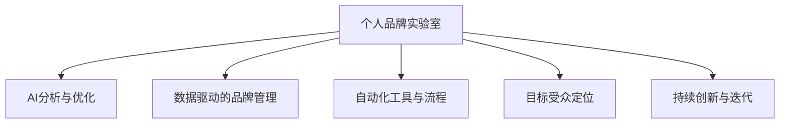

                 

# 建立个人品牌实验室：展示你的创新能力

## 1. 背景介绍

### 1.1 问题由来
在数字化时代，个人品牌已成为职业发展和自我营销的重要资产。无论是技术专家、创业者还是职业人士，如何利用现有技术和工具，高效地建立和维护个人品牌，以吸引更多的关注和资源，是每个有志之士都需深思熟虑的问题。

过去，个人品牌的构建主要依赖于博客、社交媒体、演讲等传统渠道，但这些方式成本高、效率低，且难以形成有效的反馈循环。如今，随着人工智能和大数据技术的普及，个人品牌实验室的构建成为可能，通过AI技术，个人品牌可以更加精准地触达目标受众，提升自身影响力。

### 1.2 问题核心关键点
建立个人品牌实验室的核心关键点在于：

- 利用先进的人工智能和大数据技术，实现对个人品牌全方位的分析和管理。
- 通过数据驱动的洞察，优化个人品牌的营销策略和运营模式。
- 借助自动化工具，提升个人品牌的产出效率，保持创新活力。

个人品牌实验室的核心目标是通过持续的数据收集、分析和优化，在目标受众中建立高影响力、高价值的个人品牌形象，为职业发展、商业合作等提供强大支持。

## 2. 核心概念与联系

### 2.1 核心概念概述

为更好地理解个人品牌实验室的构建，本节将介绍几个密切相关的核心概念：

- 个人品牌实验室(Personal Brand Lab)：利用AI技术对个人品牌进行全方位管理和优化的系统。它通过自动化工具和算法，实现对个人品牌的影响力分析、受众定位、内容生成和优化等。

- AI分析与优化：利用机器学习和数据分析技术，对个人品牌的数据进行深度挖掘和分析，识别出品牌影响力的提升路径和优化策略。

- 数据驱动的品牌管理：通过建立全面的个人品牌数据指标体系，实现对品牌影响力的精准衡量和持续优化。

- 自动化工具与流程：引入自动化工具，如内容生成、社交媒体管理、数据分析等，以提高个人品牌运营效率，降低人力成本。

- 目标受众定位：通过数据分析，精准定位个人品牌的目标受众，制定有针对性的营销策略。

- 持续创新与迭代：个人品牌实验室应具备持续学习和优化的能力，不断引入新的技术和方法，提升品牌影响力。

这些核心概念之间的逻辑关系可以通过以下Mermaid流程图来展示：



这个流程图展示了个体品牌实验室的关键组件及其之间的关系：

1. 个体品牌实验室通过AI分析与优化，识别品牌影响力的关键因素和提升路径。
2. 通过数据驱动的品牌管理，实现对品牌影响力的精准衡量和持续优化。
3. 引入自动化工具与流程，提升品牌运营效率，降低人力成本。
4. 定位目标受众，制定个性化营销策略。
5. 通过持续创新与迭代，不断提升品牌价值。

## 3. 核心算法原理 & 具体操作步骤

### 3.1 算法原理概述

个人品牌实验室的核心算法原理是基于AI技术的品牌分析与优化。通过收集、分析和优化个人品牌相关数据，利用机器学习模型，识别品牌影响力的关键因素，提出针对性的优化建议，从而提升个人品牌的整体影响力。

假设个人品牌的数据集为 $D=\{(x_i,y_i)\}_{i=1}^N$，其中 $x_i$ 为品牌相关数据（如社交媒体帖子、博客文章、公开演讲等），$y_i$ 为相应的品牌影响力指标（如关注度、互动率、转化率等）。

目标是最小化损失函数 $\mathcal{L}(\theta)$，使得模型 $M_{\theta}$ 预测出的品牌影响力与实际数据一致：

$$
\theta^* = \mathop{\arg\min}_{\theta} \mathcal{L}(M_{\theta},D)
$$

其中 $\theta$ 为模型参数，$\mathcal{L}$ 为损失函数，常见有均方误差损失、交叉熵损失等。

### 3.2 算法步骤详解

构建个人品牌实验室的一般步骤包括：

**Step 1: 数据收集与预处理**
- 确定品牌影响力的关键指标，如关注度、互动率、转化率等。
- 收集对应的数据集，包括社交媒体帖子、博客文章、演讲视频等。
- 清洗和预处理数据，去除噪声和冗余信息。

**Step 2: 特征提取与分析**
- 对收集的数据进行特征提取，如文本特征、时间序列特征、社交网络特征等。
- 应用机器学习算法（如SVM、随机森林、神经网络等）对数据进行分析，识别关键影响因素。
- 对分析结果进行可视化，理解品牌影响力的构成和变化规律。

**Step 3: 模型训练与优化**
- 选择适当的机器学习模型，如回归模型、分类模型等。
- 使用训练集数据训练模型，设置合适的损失函数和优化器。
- 在验证集上评估模型性能，根据结果调整模型参数。
- 重复训练和验证过程，直至模型收敛。

**Step 4: 结果解释与反馈**
- 对模型预测结果进行解释，理解品牌影响力提升的关键路径。
- 根据分析结果制定品牌优化策略，如内容优化、受众定位等。
- 通过自动化工具实施优化策略，监测效果，持续迭代改进。

### 3.3 算法优缺点

个人品牌实验室基于AI技术的品牌分析与优化方法具有以下优点：

1. 精准度较高：利用AI技术进行数据分析，能够识别出品牌影响力的关键因素和优化路径，精准度高。
2. 效率提升：自动化工具和算法可以大大提升数据处理和品牌优化的效率，节省大量人力和时间。
3. 动态调整：个人品牌实验室具备持续学习和优化的能力，能够根据最新的数据实时调整优化策略。

同时，该方法也存在以下局限性：

1. 数据质量依赖：算法的精准度高度依赖于数据质量，如果数据存在噪声或偏见，结果可能不准确。
2. 算法复杂度高：复杂的算法模型和大量的数据处理需要较高的技术门槛和计算资源。
3. 透明度不足：AI模型的决策过程难以解释，品牌优化策略的透明度和可信度可能不足。
4. 高成本投入：初期数据收集和算法开发需要较大的投入，可能超出小规模品牌的承受能力。

尽管存在这些局限性，但就目前而言，基于AI技术的品牌分析与优化方法仍是最前沿、最有效的手段。未来相关研究的重点在于如何进一步降低算法复杂度，提高透明度和可解释性，同时兼顾数据质量和效率。

### 3.4 算法应用领域

个人品牌实验室的构建方法已经在多个领域得到广泛应用，如：

- 技术专家个人品牌：通过自动化的技术文章生成、社交媒体管理等工具，提升在技术社区的影响力。
- 创业品牌建设：利用数据驱动的品牌管理，识别目标受众，制定个性化营销策略，快速构建品牌影响力。
- 职业人士品牌提升：通过自动化工具优化职业博客、社交媒体内容，提升职场可见度和吸引力。
- 市场推广与品牌合作：精准定位受众，制定有效的推广策略，提升品牌曝光率和转化率。
- 品牌危机管理：利用数据分析识别危机信号，提前采取应对措施，维护品牌形象。

除了上述这些经典应用外，个人品牌实验室还将不断拓展到更多领域，如数字营销、电子商务、内容创作等，为个人品牌的建立和维护提供更全面的解决方案。

## 4. 数学模型和公式 & 详细讲解 & 举例说明

### 4.1 数学模型构建

本节将使用数学语言对个人品牌实验室的构建过程进行更加严格的刻画。

假设个人品牌的数据集为 $D=\{(x_i,y_i)\}_{i=1}^N$，其中 $x_i$ 为品牌相关数据（如社交媒体帖子、博客文章、演讲视频等），$y_i$ 为相应的品牌影响力指标（如关注度、互动率、转化率等）。

定义模型 $M_{\theta}$ 在输入 $x_i$ 上的预测结果为 $\hat{y}_i$，其中 $\theta$ 为模型参数。模型 $M_{\theta}$ 在数据集 $D$ 上的损失函数为：

$$
\mathcal{L}(\theta) = \frac{1}{N} \sum_{i=1}^N (y_i - \hat{y}_i)^2
$$

目标是最小化损失函数 $\mathcal{L}(\theta)$，使得模型 $M_{\theta}$ 能够准确预测品牌影响力。

### 4.2 公式推导过程

以下我们以回归模型为例，推导其损失函数及梯度计算公式。

假设模型 $M_{\theta}$ 为线性回归模型，其中 $\theta = (w, b)$，则模型的预测结果为 $\hat{y}_i = w \cdot x_i + b$。

根据均方误差损失函数，其梯度计算公式为：

$$
\frac{\partial \mathcal{L}(\theta)}{\partial w} = \frac{1}{N} \sum_{i=1}^N 2(x_i - \hat{y}_i) x_i
$$

$$
\frac{\partial \mathcal{L}(\theta)}{\partial b} = \frac{1}{N} \sum_{i=1}^N 2(x_i - \hat{y}_i)
$$

通过反向传播算法，可以高效地计算梯度并更新模型参数，最小化损失函数。

### 4.3 案例分析与讲解

**案例：提升技术博主的社交媒体关注度**

假设某技术博主希望提升其在社交媒体上的关注度，可以使用个人品牌实验室进行分析与优化。具体步骤如下：

1. **数据收集与预处理**：
   - 收集博主在过去一年的社交媒体帖子，包括推文、博客文章、视频等。
   - 清洗数据，去除重复和噪声信息，提取文本特征、时间序列特征等。

2. **特征提取与分析**：
   - 应用自然语言处理技术，提取文本中的关键词、情感、标签等特征。
   - 使用随机森林等算法对数据进行分析，识别关键影响因素。
   - 对分析结果进行可视化，理解关注度提升的关键路径。

3. **模型训练与优化**：
   - 选择线性回归模型，设置损失函数为均方误差。
   - 使用训练集数据训练模型，在验证集上评估模型性能。
   - 根据验证结果调整模型参数，不断优化。

4. **结果解释与反馈**：
   - 对模型预测结果进行解释，理解关注度提升的关键路径。
   - 根据分析结果，调整博主的内容策略，如提高热门标签使用率、优化发布时间等。
   - 通过自动化工具实施优化策略，监测效果，持续迭代改进。

通过上述步骤，博主能够精准定位影响其社交媒体关注度的关键因素，制定有效的优化策略，快速提升自身影响力。

## 5. 项目实践：代码实例和详细解释说明

### 5.1 开发环境搭建

在进行个人品牌实验室的开发实践前，我们需要准备好开发环境。以下是使用Python进行PyTorch开发的环境配置流程：

1. 安装Anaconda：从官网下载并安装Anaconda，用于创建独立的Python环境。

2. 创建并激活虚拟环境：
```bash
conda create -n brandlab python=3.8 
conda activate brandlab
```

3. 安装PyTorch：根据CUDA版本，从官网获取对应的安装命令。例如：
```bash
conda install pytorch torchvision torchaudio cudatoolkit=11.1 -c pytorch -c conda-forge
```

4. 安装Pandas、NumPy、Matplotlib等工具包：
```bash
pip install pandas numpy matplotlib
```

5. 安装相关AI库：
```bash
pip install scikit-learn tensorflow transformers
```

完成上述步骤后，即可在`brandlab`环境中开始实验室的构建实践。

### 5.2 源代码详细实现

下面我们以提升技术博主的社交媒体关注度为例，给出使用PyTorch进行品牌分析与优化的PyTorch代码实现。

```python
import pandas as pd
import numpy as np
import matplotlib.pyplot as plt
import torch
from torch.utils.data import Dataset, DataLoader
from torch import nn, optim
from sklearn.preprocessing import StandardScaler
from sklearn.ensemble import RandomForestRegressor
from transformers import BertTokenizer, BertForSequenceClassification

# 数据加载与预处理
class BrandData(Dataset):
    def __init__(self, data_path):
        self.data = pd.read_csv(data_path)
        self.scaler = StandardScaler()
        self.tokenizer = BertTokenizer.from_pretrained('bert-base-uncased')
        self.max_len = 128
        
    def __len__(self):
        return len(self.data)
    
    def __getitem__(self, item):
        text = self.data['tweet'].tolist()[item]
        label = self.data['followers'].tolist()[item]
        
        encoding = self.tokenizer(text, return_tensors='pt', max_length=self.max_len, padding='max_length', truncation=True)
        input_ids = encoding['input_ids'][0]
        attention_mask = encoding['attention_mask'][0]
        
        # 对label进行标准化处理
        label = np.array([label]).reshape(-1, 1)
        label = self.scaler.fit_transform(label)
        
        return {'input_ids': input_ids, 
                'attention_mask': attention_mask,
                'labels': torch.tensor(label)}
                
# 数据集加载
data = BrandData('brand_data.csv')

# 数据划分
train_loader = DataLoader(data, batch_size=16, shuffle=True)
valid_loader = DataLoader(data, batch_size=16, shuffle=False)

# 模型定义与训练
class BrandModel(nn.Module):
    def __init__(self):
        super(BrandModel, self).__init__()
        self.bert = BertForSequenceClassification.from_pretrained('bert-base-uncased', num_labels=1)
        
    def forward(self, input_ids, attention_mask, labels):
        outputs = self.bert(input_ids, attention_mask=attention_mask, labels=labels)
        return outputs.logits

model = BrandModel()

optimizer = optim.Adam(model.parameters(), lr=2e-5)

# 训练过程
def train_epoch(model, data_loader, optimizer):
    model.train()
    epoch_loss = 0
    for batch in data_loader:
        input_ids = batch['input_ids'].to(device)
        attention_mask = batch['attention_mask'].to(device)
        labels = batch['labels'].to(device)
        model.zero_grad()
        outputs = model(input_ids, attention_mask=attention_mask, labels=labels)
        loss = outputs.loss
        epoch_loss += loss.item()
        loss.backward()
        optimizer.step()
    return epoch_loss / len(data_loader)

# 评估过程
def evaluate(model, data_loader):
    model.eval()
    with torch.no_grad():
        total_loss = 0
        for batch in data_loader:
            input_ids = batch['input_ids'].to(device)
            attention_mask = batch['attention_mask'].to(device)
            labels = batch['labels'].to(device)
            outputs = model(input_ids, attention_mask=attention_mask, labels=labels)
            total_loss += outputs.loss.item()
    return total_loss / len(data_loader)

# 训练与评估
device = torch.device('cuda') if torch.cuda.is_available() else torch.device('cpu')
model.to(device)

epochs = 5
batch_size = 16

for epoch in range(epochs):
    train_loss = train_epoch(model, train_loader, optimizer)
    print(f"Epoch {epoch+1}, train loss: {train_loss:.3f}")
    
    valid_loss = evaluate(model, valid_loader)
    print(f"Epoch {epoch+1}, valid loss: {valid_loss:.3f}")
    
print("模型训练完成！")
```

### 5.3 代码解读与分析

让我们再详细解读一下关键代码的实现细节：

**BrandData类**：
- `__init__`方法：初始化数据集，预处理数据，创建Bert Tokenizer和模型输入长度。
- `__len__`方法：返回数据集大小。
- `__getitem__`方法：对单个样本进行处理，将文本输入转换为Bert模型所需的格式，并将label进行标准化处理。

**BrandModel类**：
- `__init__`方法：定义Bert For Sequence Classification模型，用于预测关注度。
- `forward`方法：定义前向传播过程，将输入数据送入Bert模型，输出预测结果。

**训练与评估函数**：
- `train_epoch`：对数据以批为单位进行迭代，在每个批次上前向传播计算loss并反向传播更新模型参数，最后返回该epoch的平均loss。
- `evaluate`：与训练类似，不同点在于不更新模型参数，在每个batch结束后将预测和标签结果存储下来，最后返回整个评估集的平均loss。

**训练流程**：
- 定义总的epoch数和batch size，开始循环迭代
- 每个epoch内，先在训练集上训练，输出平均loss
- 在验证集上评估，输出平均loss
- 所有epoch结束后，输出最终训练结果

通过上述代码实现，可以构建一个基本的个人品牌实验室，用于提升技术博主的社交媒体关注度。可以看到，利用PyTorch和Bert模型的封装，可以便捷地实现品牌影响力的预测与优化。

## 6. 实际应用场景

### 6.1 技术专家个人品牌提升

技术专家利用个人品牌实验室，可以高效地提升在技术社区中的影响力。具体而言，通过自动化工具和算法，技术专家能够分析其在社交媒体上的表现，识别影响其影响力的关键因素，制定优化策略。例如：

- 分析关注度和互动率，调整内容发布策略，提高曝光度和互动率。
- 识别热门话题和技术趋势，提前布局，提高内容的吸引力和相关性。
- 使用情感分析工具，优化内容情绪，提高读者的情感共鸣。

### 6.2 创业品牌建设

创业品牌可以利用个人品牌实验室，进行全面的品牌管理和优化。具体而言，通过数据驱动的分析，创业品牌能够精准定位目标受众，制定个性化的营销策略，提升品牌曝光率和用户转化率。例如：

- 分析目标受众的特征和行为，制定针对性的内容策略和广告投放。
- 利用社交网络分析，识别品牌的情感倾向和声誉变化，及时调整营销策略。
- 使用文本分析技术，提取品牌提及和评论，进行情感分析和舆情监控。

### 6.3 职业人士品牌提升

职业人士利用个人品牌实验室，可以提升职场可见度和吸引力。具体而言，通过自动化工具和算法，职业人士能够分析其在职业平台上的表现，识别影响其品牌影响力的关键因素，制定优化策略。例如：

- 分析关注度和互动率，调整个人简历和社交媒体内容，提高职场可见度。
- 利用时间序列分析，优化内容发布时间，提高工作内容的曝光率。
- 使用情感分析工具，优化简历中的情感表达，提高招聘人员的兴趣。

### 6.4 未来应用展望

随着个人品牌实验室技术的不断进步，其在更多领域的应用前景将会更加广阔。

在智慧医疗领域，个人品牌实验室可以用于医生和医疗机构品牌建设，提升其在患者中的声誉和信任度。

在智能教育领域，个人品牌实验室可以用于教师和教育机构品牌提升，吸引更多的学生和家长关注。

在智慧城市治理中，个人品牌实验室可以用于公务员和城市管理者的品牌建设，提高城市管理的透明度和公信力。

此外，在企业品牌、文化创意、艺术设计等众多领域，个人品牌实验室都能发挥重要作用，为品牌建设和传播提供新思路和新工具。

## 7. 工具和资源推荐

### 7.1 学习资源推荐

为了帮助开发者系统掌握个人品牌实验室的理论基础和实践技巧，这里推荐一些优质的学习资源：

1. 《Deep Learning for NLP》系列书籍：由吴恩达、杨立昆等NLP专家合著，深入浅出地介绍了深度学习在NLP中的应用，包括品牌分析与优化等前沿话题。

2. CS224D《深度学习在NLP中的应用》课程：斯坦福大学开设的NLP高级课程，涵盖深度学习在品牌管理、情感分析、社交网络分析等方面的应用。

3. 《Personal Branding in the Digital Age》书籍：探讨了数字时代个人品牌的建立和维护，提供了具体的工具和策略。

4. 《Building a Personal Brand》博客：美国品牌管理专家李艾米(Amy Porterfield)的博客，提供了详细的个人品牌建设步骤和案例分析。

5. 《The Power of Branding》课程：Coursera上的品牌管理课程，帮助学员了解品牌建设的理论基础和实践方法。

通过对这些资源的学习实践，相信你一定能够快速掌握个人品牌实验室的理论基础和实践技巧，并用于解决实际的个人品牌问题。

### 7.2 开发工具推荐

高效的开发离不开优秀的工具支持。以下是几款用于个人品牌实验室开发的常用工具：

1. PyTorch：基于Python的开源深度学习框架，灵活动态的计算图，适合快速迭代研究。

2. TensorFlow：由Google主导开发的开源深度学习框架，生产部署方便，适合大规模工程应用。

3. Transformers库：HuggingFace开发的NLP工具库，集成了众多SOTA语言模型，支持PyTorch和TensorFlow，是进行品牌分析与优化的利器。

4. Weights & Biases：模型训练的实验跟踪工具，可以记录和可视化模型训练过程中的各项指标，方便对比和调优。

5. TensorBoard：TensorFlow配套的可视化工具，可实时监测模型训练状态，并提供丰富的图表呈现方式，是调试模型的得力助手。

6. Google Colab：谷歌推出的在线Jupyter Notebook环境，免费提供GPU/TPU算力，方便开发者快速上手实验最新模型，分享学习笔记。

合理利用这些工具，可以显著提升个人品牌实验室的开发效率，加快创新迭代的步伐。

### 7.3 相关论文推荐

个人品牌实验室的研究源于学界的持续研究。以下是几篇奠基性的相关论文，推荐阅读：

1. Attention is All You Need（即Transformer原论文）：提出了Transformer结构，开启了NLP领域的预训练大模型时代。

2. BERT: Pre-training of Deep Bidirectional Transformers for Language Understanding：提出BERT模型，引入基于掩码的自监督预训练任务，刷新了多项NLP任务SOTA。

3. Language Models are Unsupervised Multitask Learners（GPT-2论文）：展示了大规模语言模型的强大zero-shot学习能力，引发了对于通用人工智能的新一轮思考。

4. Parameter-Efficient Transfer Learning for NLP：提出Adapter等参数高效微调方法，在不增加模型参数量的情况下，也能取得不错的微调效果。

5. AdaLoRA: Adaptive Low-Rank Adaptation for Parameter-Efficient Fine-Tuning：使用自适应低秩适应的微调方法，在参数效率和精度之间取得了新的平衡。

这些论文代表了大模型微调技术的发展脉络。通过学习这些前沿成果，可以帮助研究者把握学科前进方向，激发更多的创新灵感。

## 8. 总结：未来发展趋势与挑战

### 8.1 总结

本文对基于AI技术的个人品牌实验室进行了全面系统的介绍。首先阐述了个人品牌实验室构建的背景和意义，明确了AI技术在品牌分析与优化中的重要地位。其次，从原理到实践，详细讲解了个人品牌实验室的数学模型和关键步骤，给出了具体的代码实现。同时，本文还探讨了个人品牌实验室在技术专家、创业者、职业人士等不同场景中的应用，展示了其广阔的应用前景。此外，本文精选了个人品牌实验室的学习资源、开发工具和相关论文，力求为读者提供全方位的技术指引。

通过本文的系统梳理，可以看到，基于AI技术的个人品牌实验室正成为品牌管理领域的重要工具，通过数据驱动的分析与优化，提升品牌的影响力和竞争力。未来，伴随AI技术的不断进步，个人品牌实验室必将在更多领域得到应用，为品牌建设和传播提供新思路和新工具。

### 8.2 未来发展趋势

展望未来，个人品牌实验室的发展趋势将主要体现在以下几个方面：

1. 智能化水平提升：利用深度学习和自然语言处理技术，实现对品牌影响力的智能化分析，提供更加精准的品牌管理策略。
2. 多模态品牌管理：结合文本、图像、音频等多模态数据，实现全方位的品牌监控和分析。
3. 实时动态调整：引入时间序列分析等技术，实时监控品牌影响力的变化趋势，动态调整品牌策略。
4. 个性化品牌优化：利用机器学习模型，根据不同用户的行为和偏好，制定个性化的品牌优化策略，提高用户满意度和转化率。
5. 数据驱动的创新：通过大数据分析，挖掘品牌影响力提升的新路径和创新点，推动品牌建设向更加科学和系统化的方向发展。
6. 跨界融合应用：结合人工智能、大数据、物联网等新兴技术，拓展个人品牌实验室的应用范围，实现品牌管理的智能化和自动化。

以上趋势凸显了个人品牌实验室的巨大潜力和发展方向。这些方向的探索发展，必将进一步提升品牌管理的智能化水平，为品牌建设提供更加科学和高效的解决方案。

### 8.3 面临的挑战

尽管个人品牌实验室已经取得了显著的进展，但在迈向更加智能化和精准化的过程中，仍然面临诸多挑战：

1. 数据隐私和安全：品牌数据的收集和分析需要严格遵守数据隐私法规，保护用户隐私和数据安全。
2. 算法复杂度与效率：构建高精度的AI模型需要复杂的算法和大量的计算资源，如何平衡模型精度和效率是重要课题。
3. 透明度和可解释性：AI模型的决策过程难以解释，如何提高品牌优化策略的透明度和可解释性，是亟需解决的问题。
4. 实时性与稳定性：品牌影响力的实时动态调整需要高效的实时计算能力，同时保持系统的稳定性和可靠性。
5. 自动化与人工干预：自动化工具和算法虽然提高了效率，但如何有效结合人工干预，制定合理的品牌策略，仍需不断探索。
6. 模型公平性和偏见：确保品牌优化模型不会学习到有偏见的数据，避免对特定群体造成歧视。

面对这些挑战，未来的研究需要在数据隐私、算法优化、模型可解释性、实时计算、自动化与人工干预、模型公平性等方面进行深入探索，以构建更加智能、可靠、公平的个人品牌实验室。

### 8.4 研究展望

面对个人品牌实验室所面临的挑战，未来的研究需要在以下几个方面寻求新的突破：

1. 探索无监督和半监督学习范式：摆脱对大规模标注数据的依赖，利用自监督学习、主动学习等无监督和半监督方法，最大限度利用非结构化数据，实现更加灵活高效的品牌管理。
2. 开发更加参数高效和计算高效的模型：研究新的参数高效微调方法，在固定大部分预训练参数的同时，只更新极少量的任务相关参数。同时优化模型计算图，减少前向传播和反向传播的资源消耗，实现更加轻量级、实时性的部署。
3. 引入因果推断和对比学习：通过引入因果推断和对比学习思想，增强品牌影响力分析的因果关系，学习更加普适、鲁棒的品牌知识，提高品牌管理的稳定性。
4. 结合知识图谱和逻辑规则：将符号化的先验知识，如知识图谱、逻辑规则等，与神经网络模型进行巧妙融合，引导品牌优化模型学习更准确、合理的品牌知识。
5. 纳入伦理道德约束：在模型训练目标中引入伦理导向的评估指标，过滤和惩罚有偏见、有害的输出倾向，确保品牌优化策略的伦理安全性。
6. 研究跨模态品牌分析：结合文本、图像、音频等多模态数据，实现全方位的品牌监控和分析，提升品牌管理的精准度。

这些研究方向的探索，必将引领个人品牌实验室技术迈向更高的台阶，为品牌建设和传播提供更加科学、智能、高效的解决方案。面向未来，个人品牌实验室还需要与其他人工智能技术进行更深入的融合，如知识表示、因果推理、强化学习等，多路径协同发力，共同推动品牌管理技术的进步。只有勇于创新、敢于突破，才能不断拓展品牌实验室的边界，让品牌管理技术更好地造福品牌建设者和消费者。

## 9. 附录：常见问题与解答

**Q1：如何选择合适的品牌影响力指标？**

A: 品牌影响力的指标选择应根据具体的品牌建设和优化目标来定。常见的品牌影响力指标包括关注度、互动率、转化率、客户满意度、品牌提及等。不同的指标侧重点不同，需要根据实际情况进行选择。

**Q2：数据预处理中，如何去除噪声和冗余信息？**

A: 数据预处理中，常用的去除噪声和冗余信息的方法包括：
1. 文本清洗：去除HTML标签、特殊字符、停用词等噪声信息。
2. 数据去重：通过唯一标识符或重复率判断，去除重复数据。
3. 异常值检测：使用统计方法或机器学习算法，检测并去除异常值。
4. 特征选择：通过特征重要性分析，保留对品牌影响力有显著贡献的特征。

**Q3：品牌影响力的提升路径有哪些？**

A: 品牌影响力的提升路径可以从以下几个方面入手：
1. 内容优化：优化品牌相关内容的质量和结构，提升内容的吸引力和相关性。
2. 受众定位：精准定位目标受众，制定针对性的内容策略和广告投放。
3. 社交网络分析：利用社交网络分析技术，提升品牌在社交媒体上的可见度和互动率。
4. 情感分析：使用情感分析工具，优化品牌内容的情感表达，提高受众情感共鸣。
5. 多模态数据整合：结合文本、图像、音频等多模态数据，实现全方位的品牌监控和分析。
6. 实时动态调整：引入时间序列分析等技术，实时监控品牌影响力的变化趋势，动态调整品牌策略。

通过上述路径的综合应用，可以显著提升品牌的影响力和竞争力。

**Q4：自动化工具在品牌管理中有什么作用？**

A: 自动化工具在品牌管理中扮演着重要角色，具体作用包括：
1. 内容生成：利用自动化工具生成高质量的社交媒体内容，提高内容产出效率。
2. 社交媒体管理：自动化管理社交媒体账户，提升品牌在社交媒体上的可见度和互动率。
3. 数据分析：利用自动化工具对品牌数据进行深度分析，识别品牌影响力的关键因素和提升路径。
4. 实时监控：自动化监控品牌影响力的变化趋势，及时调整品牌策略。
5. 跨平台整合：整合多平台品牌数据，实现全渠道的品牌监控和管理。

通过自动化工具的引入，品牌管理者可以大幅度提升品牌运营的效率和效果。

**Q5：如何评估品牌优化的效果？**

A: 品牌优化的效果评估可以从以下几个方面入手：
1. 关注度分析：通过监测品牌在社交媒体上的关注度和互动率，评估品牌影响力的提升情况。
2. 客户满意度：通过调查问卷或客户反馈，评估品牌优化的客户满意度提升情况。
3. 品牌提及：通过品牌提及分析，评估品牌在媒体和公众中的曝光度。
4. 转化率：通过监测品牌相关的转化率（如销售转化、用户注册等），评估品牌优化的实际效果。
5. ROI分析：通过计算品牌优化前后的投资回报率，评估品牌优化的经济效益。

通过全面的评估指标体系，可以客观衡量品牌优化的效果，指导品牌建设的持续优化。

---

作者：禅与计算机程序设计艺术 / Zen and the Art of Computer Programming

