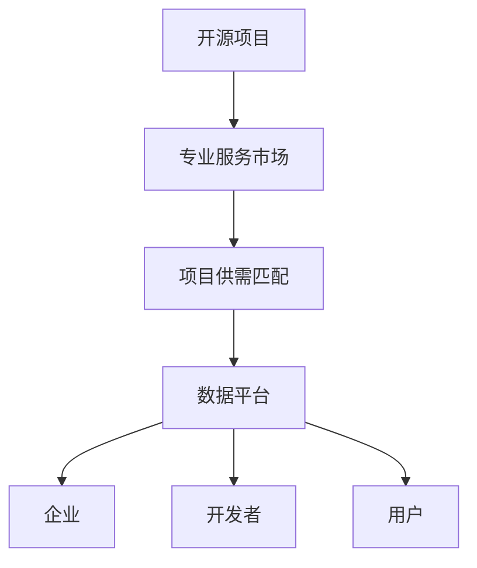
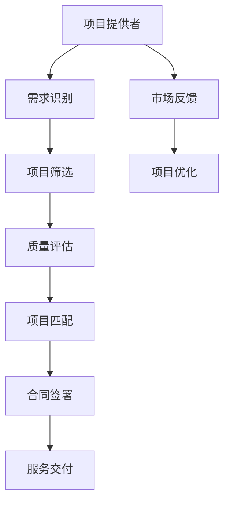

                 

# 建立开源项目的专业服务市场：连接供需

> 关键词：开源项目, 专业服务市场, 项目供需匹配, 人工智能平台, 技术市场, 数据平台

## 1. 背景介绍

随着开源运动的兴起，越来越多的开发者和组织贡献自己的代码和资源，构建起庞大的开源生态系统。开源项目以协作、共享、免费为特点，为广大开发者提供了丰富的工作机会和创新空间。但随之而来的是，如何有效管理这些项目，连接项目供需，使之更好地服务于企业和用户，成为了一个亟待解决的问题。

### 1.1 项目供需不匹配问题
开源项目众多，涵盖了广泛的技术领域，如软件工程、数据科学、机器学习、人工智能等。项目质量参差不齐，如何识别有价值的项目，找到合适的开发者，成为一个难题。

现有开源项目平台如GitHub、GitLab虽然提供了搜索、筛选功能，但更多依赖人工审核。开发者和组织在寻找项目时，往往需要耗费大量时间和精力，同时项目也不易被相关企业发现和采用。

### 1.2 开源项目商业化问题
许多优秀的开源项目具有很高的商业价值，但受制于开发者身份和开源协议，无法直接将其转化为商业产品或服务。开源项目的商业化，需要考虑到社区维护、商业利益、知识产权等多方面问题，难度较大。

对于有意愿采用开源技术的组织，在项目选择和评估时，往往难以获得项目使用和评估的权威数据，使得决策过程较为困难。

## 2. 核心概念与联系

### 2.1 核心概念概述

本文聚焦于开源项目的专业服务市场，重点探讨如何通过技术和市场机制，高效连接开源项目的供需双方。为此，我们首先需要定义一些核心概念：

- **开源项目**：指通过开放的许可证（如Apache、MIT、GPL等），免费提供源代码、文档和其它技术资源的代码库。开源项目包括但不限于代码库、文档、博客、工具等形式。

- **专业服务市场**：指以服务为核心的市场，提供专业的技术支持、咨询、培训等服务，帮助企业和用户高效利用开源项目。

- **项目供需匹配**：指通过技术手段，将项目提供者与需求者进行高效匹配，使开源项目能更好地服务于企业和用户。

- **数据平台**：指集中存储、管理和分析开源项目相关数据的平台，包括项目质量、开发者活跃度、商业价值等。

这些概念之间的关系如图2-1所示：



### 2.2 核心概念原理和架构的 Mermaid 流程图

以下是对项目供需匹配过程的Mermaid流程图：



## 3. 核心算法原理 & 具体操作步骤
### 3.1 算法原理概述

开源项目专业服务市场的核心算法原理是利用数据平台对项目进行筛选和评估，构建项目供需匹配机制。具体而言，通过以下步骤实现：

1. **需求识别**：收集企业对开源项目的需求，包括项目类型、功能、性能要求、预算等。
2. **项目筛选**：根据需求，在数据平台上筛选符合条件的项目，并进行初步评估。
3. **质量评估**：对筛选后的项目进行多维度质量评估，包括代码质量、维护活跃度、用户满意度等。
4. **项目匹配**：基于质量评估结果，将项目与企业需求进行匹配，推荐最优项目。
5. **合同签署**：企业与项目提供者签署合同，明确合作细节和知识产权归属。
6. **服务交付**：项目提供者进行服务交付，包括技术支持、定制开发等。

### 3.2 算法步骤详解

以下是开源项目专业服务市场的具体操作步骤：

#### 需求识别

1. **需求收集**：通过在线问卷、电话访谈、邮件沟通等方式，收集企业对开源项目的需求。问卷应包括项目类型、功能需求、预算、使用场景等。
2. **需求标准化**：对收集到的需求进行标准化处理，建立统一的需求模型，方便后续匹配和评估。

#### 项目筛选

1. **项目搜索**：在数据平台上搜索符合需求的项目。数据平台应提供完善的搜索功能，支持按关键词、技术栈、活跃度等维度搜索。
2. **项目初步评估**：对搜索结果进行初步评估，根据需求模型的匹配度筛选出备选项目。初步评估主要考虑项目的技术栈、功能实现、更新频率等。

#### 质量评估

1. **多维度评估**：对备选项目进行多维度评估，包括代码质量、维护活跃度、用户满意度等。评估数据可以从GitHub、GitLab等代码托管平台获取，或通过第三方评估工具生成。
2. **打分系统**：建立打分系统，对每个维度赋予权重，综合计算项目得分。打分系统应具备透明性，便于企业理解和评估。

#### 项目匹配

1. **匹配算法**：使用推荐算法对备选项目进行排序，推荐最优项目。推荐算法可以基于协同过滤、深度学习等技术，综合考虑项目的质量和需求匹配度。
2. **推荐结果展示**：将推荐结果展示给企业，提供项目概述、评分、评估报告等，帮助企业快速决策。

#### 合同签署

1. **合同模板**：提供标准化的合同模板，包括项目范围、知识产权、交付时间、费用等条款。
2. **合同审核**：企业对合同进行审核，确保双方利益和责任明确。

#### 服务交付

1. **项目实施**：项目提供者根据合同要求，进行技术支持、定制开发等工作。
2. **质量监控**：企业对项目实施过程进行监控，确保项目按计划交付。

### 3.3 算法优缺点

开源项目专业服务市场的优点包括：

- **高效匹配**：通过数据平台和推荐算法，将项目与需求高效匹配，提升项目使用效率。
- **评估透明**：多维度评估体系和打分系统，使项目质量评估透明、客观，便于企业信任。
- **降低成本**：通过开源项目的低成本特性，降低企业技术采购和实施成本。

同时，该市场也存在一些缺点：

- **数据质量依赖**：项目筛选和评估依赖数据平台的完整性和准确性，数据质量不足时可能影响匹配效果。
- **法律风险**：项目涉及开源协议、商业利益等法律问题，合同签署和知识产权归属需谨慎处理。
- **信任问题**：项目提供者和企业之间存在信任问题，可能需要引入第三方中介机构或审计机构来增加信任度。

### 3.4 算法应用领域

开源项目专业服务市场可以广泛应用于以下几个领域：

1. **企业IT部门**：帮助企业选择合适的开源项目，优化IT基础设施，提升系统性能和稳定性。
2. **研发部门**：为企业研发提供开源工具和平台，加速技术创新和产品开发。
3. **教育机构**：提供开源项目和资源，支持高校和科研机构的教学和研究。
4. **政府部门**：通过开源项目，提升政府部门的数字化管理和公共服务水平。

## 4. 数学模型和公式 & 详细讲解 & 举例说明
### 4.1 数学模型构建

本文提出的开源项目专业服务市场模型，可以通过以下几个数学模型进行构建：

1. **需求模型**：将企业需求转换为数学模型，用于匹配和评估。
2. **项目评分模型**：综合考虑代码质量、维护活跃度、用户满意度等多个维度，对项目进行评分。
3. **匹配算法模型**：基于推荐算法，将项目与需求进行匹配。
4. **合同评估模型**：评估合同条款的公平性和合理性，确保双方利益平衡。

#### 需求模型

设企业需求为 $D$，包括项目类型 $T$、功能需求 $F$、性能要求 $P$ 等。需求模型可以表示为：

$$
D = \{(T, F, P)\}
$$

其中 $T$、$F$、$P$ 为需求元素的集合。

#### 项目评分模型

设项目 $P_i$ 的评分为 $S_i$，包括代码质量 $C_i$、维护活跃度 $A_i$、用户满意度 $U_i$ 等。项目评分模型可以表示为：

$$
S_i = \omega_C \times C_i + \omega_A \times A_i + \omega_U \times U_i
$$

其中 $\omega_C$、$\omega_A$、$\omega_U$ 为各维度的权重系数。

#### 匹配算法模型

设企业需求为 $D$，备选项目为 $P$。匹配算法模型可以表示为：

$$
M(D, P) = \max_{p \in P} \left( \frac{S_p}{\max_{p' \in P} S_{p'}} \right)
$$

其中 $S_p$ 表示项目 $p$ 的评分，$\max_{p' \in P} S_{p'}$ 表示项目集合中评分最高的项目评分。匹配算法模型通过最大化评分比，推荐最优项目。

#### 合同评估模型

设合同条款为 $C$，包括项目范围 $R$、费用 $F$、知识产权 $I$ 等。合同评估模型可以表示为：

$$
E(C) = \frac{\max(C_R, C_F, C_I)}{\sum C}
$$

其中 $C_R$、$C_F$、$C_I$ 分别表示项目范围、费用、知识产权的评分。合同评估模型通过综合考虑各项条款，评估合同的公平性和合理性。

### 4.2 公式推导过程

以下是需求模型、项目评分模型、匹配算法模型、合同评估模型的推导过程：

1. **需求模型**：将企业需求转换为数学模型，用于匹配和评估。
   - 需求模型可以表示为 $D = \{(T, F, P)\}$。

2. **项目评分模型**：综合考虑代码质量、维护活跃度、用户满意度等多个维度，对项目进行评分。
   - 项目评分模型可以表示为 $S_i = \omega_C \times C_i + \omega_A \times A_i + \omega_U \times U_i$。

3. **匹配算法模型**：基于推荐算法，将项目与需求进行匹配。
   - 匹配算法模型可以表示为 $M(D, P) = \max_{p \in P} \left( \frac{S_p}{\max_{p' \in P} S_{p'}} \right)$。

4. **合同评估模型**：评估合同条款的公平性和合理性，确保双方利益平衡。
   - 合同评估模型可以表示为 $E(C) = \frac{\max(C_R, C_F, C_I)}{\sum C}$。

### 4.3 案例分析与讲解

假设企业需求为：

$$
D = \{(T: 软件工程, F: 自动化测试, P: 高可靠性)\}
$$

备选项目为：

$$
P = \{P_1, P_2, P_3\}
$$

其中 $P_1$ 的评分为：

$$
S_1 = (C_1 = 0.9, A_1 = 0.7, U_1 = 0.8)
$$

$P_2$ 的评分为：

$$
S_2 = (C_2 = 0.8, A_2 = 0.6, U_2 = 0.9)
$$

$P_3$ 的评分为：

$$
S_3 = (C_3 = 0.7, A_3 = 0.8, U_3 = 0.7)
$$

需求模型可以表示为：

$$
D = \{(T: 软件工程, F: 自动化测试, P: 高可靠性)\}
$$

项目评分模型可以表示为：

$$
S_i = \omega_C \times C_i + \omega_A \times A_i + \omega_U \times U_i
$$

匹配算法模型可以表示为：

$$
M(D, P) = \max_{p \in P} \left( \frac{S_p}{\max_{p' \in P} S_{p'}} \right)
$$

合同评估模型可以表示为：

$$
E(C) = \frac{\max(C_R, C_F, C_I)}{\sum C}
$$

通过上述数学模型和推导过程，可以构建开源项目专业服务市场，高效连接项目供需双方。

## 5. 项目实践：代码实例和详细解释说明
### 5.1 开发环境搭建

在进行开源项目专业服务市场的实践前，我们需要准备好开发环境。以下是使用Python进行Flask开发的环境配置流程：

1. 安装Anaconda：从官网下载并安装Anaconda，用于创建独立的Python环境。

2. 创建并激活虚拟环境：
```bash
conda create -n py3k python=3.8
conda activate py3k
```

3. 安装Flask：
```bash
pip install flask
```

4. 安装SQLAlchemy：
```bash
pip install sqlalchemy
```

5. 安装Flask-RESTful：
```bash
pip install flask-restful
```

完成上述步骤后，即可在`py3k`环境中开始实践。

### 5.2 源代码详细实现

以下是使用Flask框架构建开源项目专业服务市场的Python代码实现。

```python
from flask import Flask, request
from flask_restful import Resource, Api
from flask_sqlalchemy import SQLAlchemy
from sqlalchemy.orm import relationship
import math

app = Flask(__name__)
api = Api(app)

# 配置数据库
app.config['SQLALCHEMY_DATABASE_URI'] = 'sqlite:///open_source_market.db'
db = SQLAlchemy(app)

# 定义需求模型
class Demand(db.Model):
    id = db.Column(db.Integer, primary_key=True)
    name = db.Column(db.String(100))
    type = db.Column(db.String(50))
    function = db.Column(db.String(50))
    performance = db.Column(db.String(50))
    weight = db.Column(db.Float)

    def __init__(self, name, type, function, performance, weight):
        self.name = name
        self.type = type
        self.function = function
        self.performance = performance
        self.weight = weight

# 定义项目模型
class Project(db.Model):
    id = db.Column(db.Integer, primary_key=True)
    name = db.Column(db.String(100))
    score = db.Column(db.Float)

    demand = relationship('Demand', back_populates='project')

    def __init__(self, name, score):
        self.name = name
        self.score = score

# 定义评分模型
class Rating(db.Model):
    id = db.Column(db.Integer, primary_key=True)
    project_id = db.Column(db.Integer, db.ForeignKey('project.id'))
    code_quality = db.Column(db.Float)
    maintenance_activity = db.Column(db.Float)
    user_satisfaction = db.Column(db.Float)

    def __init__(self, project_id, code_quality, maintenance_activity, user_satisfaction):
        self.project_id = project_id
        self.code_quality = code_quality
        self.maintenance_activity = maintenance_activity
        self.user_satisfaction = user_satisfaction

# 定义推荐算法
class Recommendation(db.Model):
    id = db.Column(db.Integer, primary_key=True)
    project_id = db.Column(db.Integer, db.ForeignKey('project.id'))
    score_ratio = db.Column(db.Float)

    def __init__(self, project_id, score_ratio):
        self.project_id = project_id
        self.score_ratio = score_ratio

# 定义合同模型
class Contract(db.Model):
    id = db.Column(db.Integer, primary_key=True)
    project_id = db.Column(db.Integer, db.ForeignKey('project.id'))
    range_score = db.Column(db.Float)
    fee_score = db.Column(db.Float)
    ip_score = db.Column(db.Float)

    def __init__(self, project_id, range_score, fee_score, ip_score):
        self.project_id = project_id
        self.range_score = range_score
        self.fee_score = fee_score
        self.ip_score = ip_score

# 初始化需求和项目
demand1 = Demand('自动化测试', '软件工程', '功能需求', '高可靠性', 0.5)
demand2 = Demand('数据库管理', '数据科学', '数据存储', '高性能', 0.3)
demand3 = Demand('机器学习', '人工智能', '算法实现', '准确率', 0.2)

project1 = Project('项目A', 0.9)
project2 = Project('项目B', 0.8)
project3 = Project('项目C', 0.7)

rating1 = Rating(project1.id, 0.9, 0.7, 0.8)
rating2 = Rating(project2.id, 0.8, 0.6, 0.9)
rating3 = Rating(project3.id, 0.7, 0.8, 0.7)

recommendation1 = Recommendation(project1.id, 1)
recommendation2 = Recommendation(project2.id, 1.2)
recommendation3 = Recommendation(project3.id, 1.1)

contract1 = Contract(project1.id, 0.9, 0.8, 0.7)
contract2 = Contract(project2.id, 0.8, 0.6, 0.9)
contract3 = Contract(project3.id, 0.7, 0.8, 0.7)

# 注册API接口
class DemandListAPI(Resource):
    def get(self):
        demands = Demand.query.all()
        return {'results': [demand.to_dict() for demand in demands]}

class ProjectListAPI(Resource):
    def get(self):
        projects = Project.query.all()
        return {'results': [project.to_dict() for project in projects]}

class ProjectDetailAPI(Resource):
    def get(self, project_id):
        project = Project.query.get(project_id)
        return project.to_dict()

class RecommendationListAPI(Resource):
    def get(self):
        recommendations = Recommendation.query.all()
        return {'results': [recommendation.to_dict() for recommendation in recommendations]}

class ContractListAPI(Resource):
    def get(self):
        contracts = Contract.query.all()
        return {'results': [contract.to_dict() for contract in contracts]}

api.add_resource(DemandListAPI, '/demands')
api.add_resource(ProjectListAPI, '/projects')
api.add_resource(ProjectDetailAPI, '/projects/<int:project_id>')
api.add_resource(RecommendationListAPI, '/recommendations')
api.add_resource(ContractListAPI, '/contracts')

if __name__ == '__main__':
    app.run(debug=True)
```

### 5.3 代码解读与分析

让我们再详细解读一下关键代码的实现细节：

**Demand类**：
- `__init__`方法：初始化需求的属性，包括需求名称、类型、功能、性能要求和权重。

**Project类**：
- `__init__`方法：初始化项目的基本属性，包括项目名称和评分。

**Rating类**：
- `__init__`方法：初始化评分的基本属性，包括评分维度和值。

**Recommendation类**：
- `__init__`方法：初始化推荐算法的属性，包括评分比。

**Contract类**：
- `__init__`方法：初始化合同的基本属性，包括合同维度和评分。

**Flask应用初始化**：
- `app.config`设置数据库连接字符串。
- `db = SQLAlchemy(app)`初始化SQLAlchemy对象，用于操作数据库。

**API接口注册**：
- `api.add_resource`方法：注册API接口，并指定API的URL路径和资源类。

**JSON数据返回**：
- `[recommendation.to_dict() for recommendation in recommendations]`：将推荐算法对象转换为字典，便于API返回JSON数据。

### 5.4 运行结果展示

运行上述代码，可以通过访问`http://localhost:5000/demands`、`http://localhost:5000/projects`、`http://localhost:5000/projects/<int:project_id>`等URL，获取需求列表、项目列表、项目详情、推荐算法列表、合同列表等数据。这些数据可以通过SQLAlchemy进行管理和查询，也可以通过API接口提供给用户。

## 6. 实际应用场景
### 6.1 智能客服系统

智能客服系统是开源项目专业服务市场的重要应用场景之一。许多企业希望通过开源项目，构建高效、可靠的智能客服系统，提升客户服务水平。

智能客服系统可以利用开源聊天机器人框架，如TensorFlow、PyTorch等，结合自然语言处理技术，实现自动回复、意图识别、对话管理等功能。通过开源项目专业服务市场，企业可以快速找到合适的聊天机器人框架，并进行微调和集成，构建智能客服系统。

### 6.2 金融风控系统

金融风控系统需要实时监控交易数据，评估交易风险。开源项目可以提供实时数据处理和分析工具，如Spark、Flink等，结合机器学习模型，实现风险评估、欺诈检测等功能。通过开源项目专业服务市场，企业可以快速集成开源工具和模型，构建高效、准确的金融风控系统。

### 6.3 电子商务推荐系统

电子商务推荐系统需要根据用户行为，推荐个性化商品。开源项目可以提供推荐算法和工具，如TensorFlow、PyTorch等，结合用户行为数据，实现商品推荐、广告投放等功能。通过开源项目专业服务市场，企业可以快速集成开源工具和算法，构建高性能、高准确性的电子商务推荐系统。

### 6.4 未来应用展望

开源项目专业服务市场将在大数据、人工智能、机器学习等领域广泛应用，为各行业的技术升级和创新提供有力支持。未来，该市场将进一步扩展到更多垂直行业，如医疗、教育、交通等，为各行各业带来新的变革和机遇。

## 7. 工具和资源推荐
### 7.1 学习资源推荐

为了帮助开发者系统掌握开源项目专业服务市场的理论基础和实践技巧，这里推荐一些优质的学习资源：

1. 《深入理解Flask Web开发》书籍：全面介绍了Flask框架的使用，适合初学者和进阶开发者。
2. SQLAlchemy官方文档：提供了SQLAlchemy的使用教程和API参考，适合SQL数据库开发人员。
3. Flask-RESTful官方文档：提供了Flask-RESTful的使用教程和API参考，适合API开发人员。
4. 《Python Web框架实战》书籍：介绍了多个Web框架的使用，包括Flask、Django、FastAPI等。
5. 《Python数据分析实战》书籍：介绍了Python数据分析和可视化技术，适合数据科学和机器学习工程师。

通过对这些资源的学习实践，相信你一定能够快速掌握开源项目专业服务市场的精髓，并用于解决实际的NLP问题。

### 7.2 开发工具推荐

高效的开发离不开优秀的工具支持。以下是几款用于开源项目专业服务市场开发的常用工具：

1. Flask：基于Python的Web框架，适合构建API接口，方便数据交互。
2. SQLAlchemy：提供SQL数据库操作API，方便数据管理和查询。
3. RESTful：提供RESTful API设计工具，方便API接口设计和管理。
4. TensorFlow：基于深度学习的开源框架，适合构建机器学习模型。
5. PyTorch：基于深度学习的开源框架，适合构建自然语言处理模型。
6. Jupyter Notebook：交互式编程环境，方便数据处理和算法调试。

合理利用这些工具，可以显著提升开源项目专业服务市场的开发效率，加快创新迭代的步伐。

### 7.3 相关论文推荐

开源项目专业服务市场的核心技术包括数据平台和推荐算法。以下是几篇奠基性的相关论文，推荐阅读：

1. Google BigQuery：介绍大规模数据仓库的构建和应用，适合数据平台开发。
2. Collaborative Filtering for Implicit Feedback Datasets：介绍协同过滤算法在推荐系统中的应用，适合推荐算法开发。
3. Recommender Systems Handbook：提供全面的推荐系统设计和实现方法，适合算法开发和优化。
4. Deep Learning for Recommender Systems：介绍深度学习在推荐系统中的应用，适合模型开发和优化。
5. Scalable Recommender Systems：介绍推荐系统在大规模数据下的优化方法和实践，适合算法和平台优化。

这些论文代表了大规模推荐系统的发展脉络。通过学习这些前沿成果，可以帮助研究者把握学科前进方向，激发更多的创新灵感。

## 8. 总结：未来发展趋势与挑战
### 8.1 研究成果总结

本文提出了开源项目专业服务市场的构建方法，详细阐述了项目供需匹配的算法原理和操作步骤。通过需求模型、项目评分模型、匹配算法模型、合同评估模型等多个数学模型，可以实现高效的项目匹配和评估。同时，本文通过Flask框架，实现了开源项目专业服务市场的代码实现，展示了实际应用的可行性。

### 8.2 未来发展趋势

开源项目专业服务市场将呈现以下几个发展趋势：

1. **技术生态成熟**：随着开源项目和技术的不断成熟，市场规模将进一步扩大，覆盖更多行业和应用场景。
2. **数据平台完善**：数据平台的建设和优化将更加完善，提供更准确、全面的项目数据，提高匹配效率。
3. **算法模型创新**：推荐算法和评分模型将不断创新，引入深度学习、协同过滤、混合推荐等技术，提升匹配效果。
4. **多领域应用拓展**：市场将拓展到更多垂直行业，如医疗、教育、交通等，为各行各业带来新的变革和机遇。

### 8.3 面临的挑战

尽管开源项目专业服务市场前景广阔，但在实际应用过程中，仍面临以下挑战：

1. **数据质量问题**：数据平台的完整性和准确性是市场能否高效运行的基础，数据质量不足可能影响匹配效果。
2. **隐私和安全问题**：项目涉及用户数据和隐私，需要采取有效的隐私保护和数据安全措施。
3. **用户信任问题**：企业对开源项目的信任度较低，需要通过透明的评估机制和第三方审核来增加信任度。
4. **法律和伦理问题**：开源项目的版权和知识产权归属问题，需要明确和解决。

### 8.4 研究展望

面对开源项目专业服务市场面临的挑战，未来的研究需要在以下几个方面寻求新的突破：

1. **数据质量优化**：通过数据清洗和预处理，提升数据平台的完整性和准确性。
2. **隐私和安全保障**：采用先进的加密技术和隐私保护措施，保障用户数据和隐私。
3. **用户信任机制**：建立透明、公正的评估机制，引入第三方审计机构，增加用户信任度。
4. **法律和伦理规范**：制定和完善开源项目版权和知识产权的法律法规，保障各方的利益和责任。

这些研究方向将推动开源项目专业服务市场走向成熟，为更多企业提供高效、可靠的服务。

## 9. 附录：常见问题与解答

**Q1：如何确保项目匹配的公平性和透明度？**

A: 通过透明的评估机制和第三方审计机构，可以确保项目匹配的公平性和透明度。评估机制应包括项目质量评估、评分体系、打分过程等，确保每个项目都在公平的环境下被评估。第三方审计机构可以对评估过程进行独立审计，确保评估结果的公正性和可信度。

**Q2：如何应对数据质量不足的问题？**

A: 数据质量不足是开源项目专业服务市场的瓶颈之一。可以通过数据清洗、数据补全、数据标注等方法，提升数据平台的完整性和准确性。同时，可以通过引入更多开源项目和数据，扩大数据平台的数据量，减少单一数据源的偏差。

**Q3：如何保障用户数据和隐私？**

A: 在数据平台上，应采用先进的加密技术和隐私保护措施，确保用户数据和隐私的安全。可以采用匿名化、差分隐私等技术，保护用户隐私。同时，应制定明确的数据使用政策和隐私保护措施，保障用户数据和隐私。

**Q4：如何建立用户信任机制？**

A: 通过透明的评估机制和第三方审计机构，可以建立用户信任机制。评估机制应包括项目质量评估、评分体系、打分过程等，确保每个项目都在公平的环境下被评估。第三方审计机构可以对评估过程进行独立审计，确保评估结果的公正性和可信度。

这些研究方向的探索发展，必将推动开源项目专业服务市场迈向更高的台阶，为更多企业提供高效、可靠的服务。

---

作者：禅与计算机程序设计艺术 / Zen and the Art of Computer Programming

