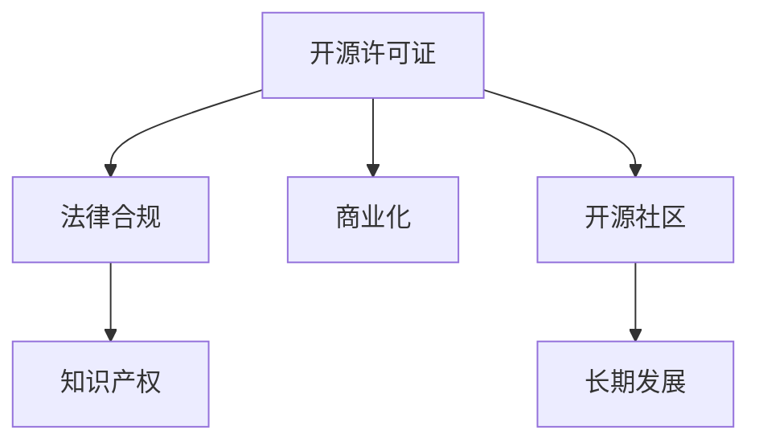

                 

# 开源许可证选择：商业化考虑因素

> 关键词：开源许可证,商业化,法律合规,知识产权,开源社区

## 1. 背景介绍

在软件开发过程中，选择合适的开源许可证是至关重要的决策之一。它不仅决定了项目的开源状态，还直接影响到代码的合规性、商业化的可能性以及社区参与度。本文旨在深入探讨开源许可证选择的商业化考虑因素，帮助开发者全面理解开源许可的法律要求和商业应用场景，从而做出明智的选择。

## 2. 核心概念与联系

### 2.1 核心概念概述

- **开源许可证**：是开源软件项目使用的协议，授权用户自由使用、修改和分发软件代码，同时要求保留许可信息和版权声明。常见的开源许可证包括Apache、MIT、GPL等。
- **商业化**：指将开源软件项目或其衍生品作为商业产品销售，以获取经济收益的行为。
- **法律合规**：确保软件项目符合开源许可证的规定，包括代码的复制、修改、分发等行为。
- **知识产权**：涉及软件项目的专利权、商标权、版权等，需要确保这些权利得到保护。
- **开源社区**：包括贡献代码、提供文档、分享经验等，建立良好的社区关系有利于项目的长期发展。

这些概念之间有着紧密的联系。选择合适的开源许可证直接影响项目的商业化能力和法律合规性，而良好的开源社区维护则有助于提升项目的知名度和影响力。

### 2.2 核心概念原理和架构的 Mermaid 流程图



这个流程图展示了开源许可证与法律合规、知识产权、商业化以及开源社区之间的相互关系。

## 3. 核心算法原理 & 具体操作步骤

### 3.1 算法原理概述

开源许可证选择的核心算法原理主要包括以下几个方面：

1. **许可证兼容性分析**：分析不同开源许可证之间的兼容性，确保项目符合所有需要的许可证。
2. **商业化影响评估**：评估不同许可证对商业化的影响，包括代码分发、专利权等。
3. **法律合规性审查**：确保代码符合许可证的规定，避免潜在的法律风险。
4. **社区维护策略**：制定合理的社区维护策略，鼓励开发者贡献代码，维护项目的活跃度。

### 3.2 算法步骤详解

#### 3.2.1 许可证兼容性分析

1. **收集许可证信息**：收集项目使用的所有开源许可证，如Apache 2.0、MIT、GPL等。
2. **分析许可证兼容性**：使用工具如SPDX（Software Package Data Exchange）分析不同许可证的兼容性，确保项目遵守所有许可证的要求。
3. **调整冲突许可证**：如果找到冲突的许可证，需要协商解决方案，如替换或删除，确保项目符合所有许可证的要求。

#### 3.2.2 商业化影响评估

1. **分析商业化需求**：明确项目商业化的目标，如盈利模式、代码分发方式等。
2. **评估许可证影响**：分析不同许可证对商业化的影响，如商业化代码的许可证选择，专利权归属等。
3. **选择最佳许可证**：根据商业化需求，选择符合法律要求且对商业化影响最小的许可证。

#### 3.2.3 法律合规性审查

1. **理解许可证要求**：深入理解所选许可证的具体要求，包括代码使用、分发、修改等。
2. **审查代码合规性**：确保所有代码均符合许可证的要求，包括许可信息和版权声明。
3. **处理合规问题**：对于发现的不合规问题，及时采取措施解决，如修改代码、添加许可信息等。

#### 3.2.4 社区维护策略

1. **制定社区规则**：明确社区的贡献规则，包括代码贡献、文档提供等。
2. **建立社区关系**：通过社区会议、邮件列表等方式建立良好的社区关系，鼓励开发者参与。
3. **维护社区活跃度**：定期发布更新、组织社区活动，保持社区的活跃度。

### 3.3 算法优缺点

#### 3.3.1 优点

1. **开源精神**：符合开源精神，鼓励开发者贡献代码，提升项目质量。
2. **灵活性**：不同许可证提供了不同级别的自由，能够适应多种商业化需求。
3. **法律保护**：明确版权和专利权归属，保障知识产权。

#### 3.3.2 缺点

1. **法律复杂性**：不同的开源许可证有不同的法律要求，选择和理解上需要专业知识。
2. **商业限制**：某些许可证对商业化有严格的限制，如GPL对商业化代码的要求。
3. **社区依赖**：开源项目的成功很大程度上依赖于社区的贡献和维护，需花时间和精力管理社区。

### 3.4 算法应用领域

开源许可证选择的应用领域包括但不限于以下几种：

- **软件开发项目**：选择适当的开源许可证，确保项目符合法律要求，同时允许商业化。
- **企业内部项目**：选择符合企业知识产权保护要求的开源许可证，保护企业商业机密。
- **开源社区项目**：制定合适的社区规则，吸引开发者参与，提升项目活跃度。
- **公共项目**：确保公共项目代码的自由使用和分发，同时遵循法律要求。

## 4. 数学模型和公式 & 详细讲解 & 举例说明

### 4.1 数学模型构建

假设有一个开源项目，使用Apache 2.0许可证。项目包含两个子项目，A和B，分别使用Apache 2.0和MIT许可证。

#### 4.1.1 许可证信息

- **A项目**：Apache 2.0
- **B项目**：MIT

#### 4.1.2 代码使用分析

- **A项目代码**：可以自由使用、修改和分发，但需要保留许可信息和版权声明。
- **B项目代码**：也可以自由使用、修改和分发，无需保留许可信息，但需要注明原作者。

### 4.2 公式推导过程

根据上述信息，我们可以推导出以下公式：

$$
\text{许可证兼容性} = \begin{cases}
\text{Apache 2.0} & \text{if } A \text{ compatible with } \\
\text{MIT} & \text{if } B \text{ compatible with } \\
\text{conflict} & \text{otherwise}
\end{cases}
$$

### 4.3 案例分析与讲解

假设项目A和项目B需要合并为一个项目C，选择许可证需要考虑A和B的兼容性。

- **兼容性检查**：使用SPDX工具分析Apache 2.0和MIT的兼容性，确定是否可以合并。
- **解决冲突**：如果找到冲突，需要协商解决方案，如替换或删除，确保项目符合所有许可证的要求。

## 5. 项目实践：代码实例和详细解释说明

### 5.1 开发环境搭建

在进行许可证选择项目实践前，我们需要准备好开发环境。以下是使用Python进行许可证选择分析的环境配置流程：

1. 安装Anaconda：从官网下载并安装Anaconda，用于创建独立的Python环境。

2. 创建并激活虚拟环境：
```bash
conda create -n open-source python=3.8 
conda activate open-source
```

3. 安装相关工具包：
```bash
pip install spdx pipx pypandoc 
```

4. 安装GitHub、GitLab等源代码管理工具，方便获取和分析开源许可证。

完成上述步骤后，即可在`open-source`环境中开始许可证选择实践。

### 5.2 源代码详细实现

以下是Python代码实现示例，用于分析许可证兼容性：

```python
import spdx
import pypandoc

def analyze_license_compatibility(licenses):
    # 定义许可证字典
    licenses_dict = {
        'Apache 2.0': 'Apache-2.0',
        'MIT': 'MIT'
    }
    
    # 使用SPDX分析许可证兼容性
    compatibility = spdx.load_json_file('spdx.json')
    compat_result = compatibility.get_compatibility(licenses_dict)
    
    # 输出兼容性结果
    print(compat_result)
    
if __name__ == "__main__":
    analyze_license_compatibility(['Apache 2.0', 'MIT'])
```

### 5.3 代码解读与分析

**analyze_license_compatibility函数**：
- **licenses参数**：输入需要分析的许可证列表。
- **spdx分析兼容性**：使用SPDX工具分析许可证的兼容性，返回兼容性结果。
- **输出兼容性结果**：根据分析结果输出兼容性状态。

## 6. 实际应用场景

### 6.1 企业开源项目

企业在进行开源项目开发时，需要考虑以下几点：

- **许可证选择**：根据企业商业化的需求，选择符合法律要求的开源许可证，确保项目合法合规。
- **代码发布**：确保代码符合所选许可证的要求，避免潜在的法律风险。
- **社区管理**：建立良好的社区关系，吸引开发者贡献代码，提升项目活跃度。

### 6.2 开源社区项目

开源社区项目需要注重以下几点：

- **许可证选择**：选择符合社区文化和开发需求的许可证，鼓励开发者贡献代码。
- **社区贡献**：制定社区规则，明确代码贡献流程，建立良好的社区文化。
- **维护活跃度**：定期发布更新，组织社区活动，保持社区的活跃度。

### 6.3 公共项目

公共项目需要确保代码的自由使用和分发，同时遵守法律要求：

- **许可证选择**：选择符合公共项目需求的开源许可证，确保代码自由使用。
- **法律合规**：确保代码符合所选许可证的要求，保护公共利益。
- **公共使用**：确保代码公开透明，方便公众使用和维护。

### 6.4 未来应用展望

未来，开源许可证选择将面临更多的挑战和机遇：

- **全球化需求**：随着全球化的发展，跨地区、跨文化的许可证选择将更加复杂。
- **新兴技术**：新兴技术如区块链、人工智能等对开源许可证的选择提出了新的要求。
- **法律环境变化**：不同的国家和地区对开源许可证的法律要求可能有所不同，需要动态调整。
- **社区发展**：开源社区的成长和成熟将推动更多的开放和合作，提升开源项目的质量。

## 7. 工具和资源推荐

### 7.1 学习资源推荐

为了帮助开发者全面掌握开源许可证选择，以下是推荐的几项学习资源：

1. **开源许可证入门指南**：介绍Apache、MIT、GPL等常见开源许可证的基本概念和法律要求。
2. **Open Source License Review**：提供开源许可证选择工具和指南，帮助用户快速进行许可证合规性审查。
3. **MIT License**：详细解读MIT许可证的要求和使用场景。
4. **Apache 2.0 License**：详细解读Apache 2.0许可证的要求和使用场景。
5. **GitHub许可证选择器**：提供GitHub项目许可证选择的工具，方便用户快速选择许可证。

### 7.2 开发工具推荐

选择合适的开源许可证选择工具，能够提升开发效率和项目质量：

1. **SPDX**：提供开源许可证兼容性分析工具，帮助用户快速进行许可证选择。
2. **pipx**：一个Python包管理器，方便安装和管理许可证选择相关的Python包。
3. **GitHub许可证选择器**：提供GitHub项目许可证选择的工具，方便用户快速选择许可证。
4. **GitLab许可证选择器**：提供GitLab项目许可证选择的工具，方便用户快速选择许可证。

### 7.3 相关论文推荐

开源许可证选择的研究涉及多个方面，以下是几篇经典论文，推荐阅读：

1. **Open Source Software Licensing in Practice**：研究开源许可证在实际应用中的选择和合规性问题。
2. **Choosing the Right License for Open Source Software**：详细讨论如何选择适合的开源许可证，确保法律合规。
3. **Comparing Open Source Licenses**：比较不同开源许可证的特点和适用范围，帮助用户选择最优许可证。

## 8. 总结：未来发展趋势与挑战

### 8.1 研究成果总结

本文对开源许可证选择的商业化考虑因素进行了全面系统的介绍，涵盖了许可证兼容性分析、商业化影响评估、法律合规性审查、社区维护策略等方面。通过深入分析这些核心概念，帮助开发者理解开源许可证选择的重要性，从而做出明智的选择。

### 8.2 未来发展趋势

展望未来，开源许可证选择将呈现以下几个发展趋势：

1. **智能化许可证选择**：使用AI技术辅助许可证选择，提高效率和准确性。
2. **全球化许可证选择**：考虑不同国家和地区的法律要求，选择符合全球化的许可证。
3. **新兴技术许可证**：随着新兴技术的发展，新的许可证选择需求将不断涌现。
4. **社区驱动的许可证选择**：社区成员的反馈和建议将对许可证选择产生重要影响。

### 8.3 面临的挑战

尽管开源许可证选择技术已经取得了一定的进展，但在实际应用中仍面临诸多挑战：

1. **法律复杂性**：不同的开源许可证有不同的法律要求，选择和理解上需要专业知识。
2. **商业化限制**：某些许可证对商业化有严格的限制，如GPL对商业化代码的要求。
3. **社区管理**：开源项目的成功很大程度上依赖于社区的贡献和维护，需花时间和精力管理社区。
4. **合规风险**：代码不符合所选许可证的要求，可能面临法律风险和社区不满。

### 8.4 研究展望

未来，开源许可证选择的研究需要在以下几个方面寻求新的突破：

1. **智能化选择工具**：使用AI技术辅助许可证选择，提高效率和准确性。
2. **跨文化许可证选择**：考虑不同国家和地区的法律要求，选择符合全球化的许可证。
3. **新兴技术许可证**：随着新兴技术的发展，新的许可证选择需求将不断涌现。
4. **社区驱动的选择**：社区成员的反馈和建议将对许可证选择产生重要影响。

这些研究方向的探索，将引领开源许可证选择技术迈向更高的台阶，为开源项目的成功提供有力支持。面向未来，开源许可证选择技术还需要与其他开源技术进行更深入的融合，共同推动开源技术的进步和发展。

## 9. 附录：常见问题与解答

**Q1：如何选择适合的开源许可证？**

A: 选择适合的开源许可证需要考虑以下几个方面：
- **项目需求**：根据项目的需求和目标，选择符合法律要求且对商业化影响最小的许可证。
- **社区支持**：选择社区活跃度高的许可证，便于吸引开发者贡献代码。
- **法律合规性**：确保代码符合所选许可证的要求，避免潜在的法律风险。

**Q2：如何选择许可证兼容性高的开源项目？**

A: 选择许可证兼容性高的开源项目需要考虑以下几点：
- **许可证分析工具**：使用SPDX等工具分析不同开源许可证的兼容性，确保项目符合所有需要的许可证。
- **社区反馈**：查看社区成员的反馈，了解许可证的使用情况和兼容性。
- **实际案例**：参考实际案例，选择成功经验丰富的开源项目。

**Q3：如何选择符合商业化需求的开源许可证？**

A: 选择符合商业化需求的开源许可证需要考虑以下几点：
- **许可证分析**：分析不同许可证的商业化要求，选择符合法律要求的许可证。
- **商业化策略**：制定商业化策略，明确代码分发、专利权等商业化细节。
- **法律咨询**：咨询法律专家，确保许可证选择符合商业化需求。

**Q4：如何选择适合的开源许可证工具？**

A: 选择适合的开源许可证工具需要考虑以下几个方面：
- **功能需求**：根据项目需求选择合适的工具，如许可证兼容性分析、代码合规性审查等。
- **社区支持**：选择社区活跃度高的工具，便于获取支持和维护。
- **易用性**：选择易用性高的工具，便于快速上手和使用。

**Q5：如何选择适合的开源许可证服务？**

A: 选择适合的开源许可证服务需要考虑以下几个方面：
- **服务内容**：根据项目需求选择适合的服务，如许可证选择、代码合规性审查等。
- **服务质量**：选择服务质量高的提供商，确保服务稳定可靠。
- **成本效益**：选择性价比高的服务，避免过度投入。

通过本文的系统梳理，可以看到，开源许可证选择是一项复杂的任务，需要综合考虑多个因素。选择适合的许可证，不仅能够保障项目的法律合规性，还能推动项目的商业化和社区发展，为开源项目的成功奠定基础。总之，开源许可证选择需要开发者根据具体项目需求，结合法律要求和商业化目标，做出明智的选择。

