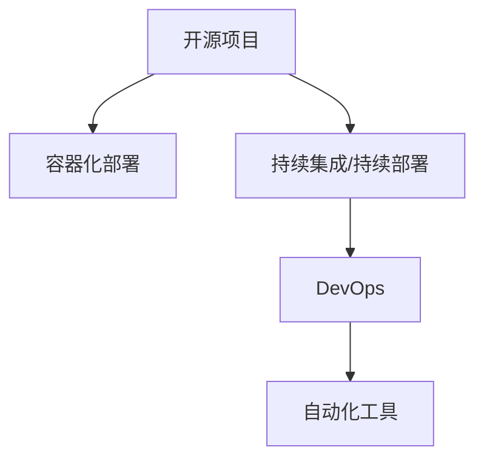

                 

# 开源项目的企业级部署服务：创造高价值机会

## 1. 背景介绍

### 1.1 问题由来

近年来，开源项目在企业级应用中获得了越来越广泛的应用。企业级的部署和运维，使得开源软件能够以更高的效率和更低的成本，为企业提供稳定可靠的技术解决方案。然而，开源项目的灵活性、定制化需求，以及企业内部的复杂环境，使得其在企业级部署和服务上仍面临诸多挑战。

本文章聚焦于如何高效、安全地将开源项目部署到企业内部，探讨如何通过规范化、标准化的流程，结合自动化工具，实现开源项目的高效部署和持续服务，最终创造高价值机会。

## 2. 核心概念与联系

### 2.1 核心概念概述

为更好地理解企业级开源项目部署的方法，本节将介绍几个密切相关的核心概念：

- 开源项目：指以开源许可证发布的源代码和相关文档，可以自由修改、使用和分发，如Linux内核、Apache Web Server等。
- 容器化部署：将应用及其依赖打包到一个可移植、可重复使用的容器中，如Docker、Kubernetes等。
- 持续集成/持续部署(CI/CD)：自动化地构建、测试和部署代码，确保软件的一致性和可靠性。
- DevOps：融合开发与运维，通过自动化流程、持续反馈，提升软件交付的速度和稳定性。
- 自动化工具：如Ansible、Puppet、Chef等，能够自动化地管理系统配置和应用部署。

这些核心概念之间的逻辑关系可以通过以下Mermaid流程图来展示：



这个流程图展示了几者之间的联系：

1. 开源项目通过容器化部署进行灵活打包，便于在不同环境中快速部署。
2. 容器化项目通过CI/CD进行自动化构建和部署，确保代码一致性和可靠性。
3. DevOps结合开发和运维的自动化流程，提升软件交付速度和稳定性。
4. DevOps流程依赖自动化工具的支持，自动化管理系统配置和应用部署。

## 3. 核心算法原理 & 具体操作步骤
### 3.1 算法原理概述

企业级开源项目部署的核心思想是通过容器化和自动化，实现应用的快速、一致、安全的部署和运维。其核心原理可以归纳为以下三个方面：

1. **模块化与组件化**：将项目划分为多个独立模块或组件，便于单独管理和部署。
2. **自动化与脚本化**：将部署流程脚本化，通过自动化工具执行，减少人为操作和错误。
3. **持续集成与持续部署**：通过CI/CD流程，实现代码的自动化构建和测试，自动化部署和回滚。

### 3.2 算法步骤详解

基于上述原理，以下是企业级开源项目部署的核心操作步骤：

**Step 1: 项目划分子模块**
- 将开源项目按照功能、依赖等维度划分为多个独立模块或组件。例如，一个Web应用项目可以划分为Web服务器、数据库、缓存、消息队列等组件。
- 每个组件独立打包为容器镜像，并标注依赖关系。

**Step 2: 配置CI/CD流程**
- 设计CI/CD流程，包括代码审查、构建、测试、部署等环节。选择合适的CI/CD工具，如Jenkins、GitLab CI/CD等。
- 定义构建和测试脚本，确保构建的环境和依赖与生产环境一致。
- 集成自动化部署工具，如Ansible、Puppet、Chef等，自动化执行部署脚本。

**Step 3: 配置容器化部署**
- 选择容器化部署工具，如Docker、Kubernetes等。
- 为每个组件设计容器配置文件，包含资源限制、环境变量、依赖等配置。
- 将配置文件部署到自动化工具，实现自动部署和扩展。

**Step 4: 配置DevOps流程**
- 实现DevOps流程自动化，包括代码审查、构建、测试、部署、监控等环节。
- 使用DevOps工具，如JIRA、Confluence、Slack等，协调团队协作。
- 定期评估和优化CI/CD和DevOps流程，提升部署效率和稳定性。

**Step 5: 持续优化和改进**
- 定期收集部署和运维反馈，持续优化和改进CI/CD和DevOps流程。
- 引入自动化测试和安全检查，提高部署质量和安全性。
- 结合机器学习和人工智能技术，自动预测和解决部署和运维中的问题。

### 3.3 算法优缺点

企业级开源项目部署具有以下优点：

1. 灵活性高：组件化和模块化部署使得开源项目能够快速适应不同的应用场景。
2. 可扩展性好：通过容器化和自动化，可以快速扩展和缩容应用实例。
3. 一致性保障：通过CI/CD流程，确保不同环境下的代码一致性。
4. 高效部署：通过自动化工具和容器化，减少了人为操作，提升部署速度和稳定性。

同时，该方法也存在一定的局限性：

1. 初期成本高：部署和运维流程设计、工具选型、培训等初期成本较高。
2. 运维复杂：自动化流程和容器化管理需要一定的运维技能，增加复杂度。
3. 依赖技术栈：选择适合自己项目的CI/CD和自动化工具，需要一定的技术积累。
4. 安全性风险：自动化流程和容器化部署需要加强安全检查，避免漏洞风险。

尽管存在这些局限性，但就目前而言，企业级开源项目部署的范式仍是大势所趋。未来相关研究的重点在于如何进一步降低初期成本，提高运维便捷性和安全性，同时兼顾快速部署和高性能需求。

### 3.4 算法应用领域

企业级开源项目部署方法适用于各种规模的企业应用，包括：

- 网站和Web应用：通过容器化和自动化，快速部署和扩展Web服务。
- 移动应用：将后端服务打包为容器镜像，实现快速部署和回滚。
- 数据处理和大数据分析：通过容器化和自动化，实现大数据作业的快速部署和扩展。
- IoT应用：通过容器化和自动化，实现物联网设备的统一管理和部署。
- 人工智能应用：通过容器化和自动化，实现机器学习模型的快速部署和迭代。

除了上述这些经典应用外，企业级开源项目部署方法也在更多场景中得到了应用，如DevOps、敏捷开发、持续集成和交付等，为企业应用提供了强有力的技术保障。

## 4. 数学模型和公式 & 详细讲解  
### 4.1 数学模型构建

本节将使用数学语言对企业级开源项目部署过程进行更加严格的刻画。

假设企业级开源项目包含 $N$ 个模块 $M_i$，每个模块的部署时间为 $t_i$。定义总体部署时间为 $T$，则有：

$$
T = \sum_{i=1}^{N} t_i
$$

其中 $t_i$ 为模块 $M_i$ 的部署时间。

为了简化模型，我们假设每个模块的部署时间 $t_i$ 都为固定值 $t$，则总体部署时间 $T$ 可以表示为：

$$
T = Nt
$$

在实际应用中，模块的部署时间 $t_i$ 可能会因为环境、网络、资源等因素存在差异，因此，需要引入平均部署时间 $t$ 和方差 $\sigma^2$ 来描述。

$$
T = N \mu + \sigma^2 \sqrt{N}
$$

其中 $\mu$ 为平均部署时间，$\sigma^2$ 为部署时间的方差。

### 4.2 公式推导过程

下面以Web应用为例，给出企业级开源项目部署时间的计算公式推导。

假设Web应用由Web服务器、数据库、缓存、消息队列等四个模块组成，每个模块的部署时间 $t_i$ 分别为 $t_s$、$t_d$、$t_c$、$t_m$，部署时间 $t_i$ 的分布满足正态分布，平均部署时间为 $\mu$，方差为 $\sigma^2$。

则Web应用的总部署时间为：

$$
T_{Web} = t_s + t_d + t_c + t_m
$$

为了简化计算，我们假设每个模块的部署时间都为 $\mu$，则总体部署时间 $T_{Web}$ 可以表示为：

$$
T_{Web} = 4\mu
$$

其中 $\mu$ 为每个模块的平均部署时间。

在实际应用中，由于模块之间存在依赖关系，部署时间可能存在差异，因此需要引入部署时间 $t_i$ 的方差 $\sigma^2$ 来描述。

假设每个模块的部署时间 $t_i$ 满足正态分布 $N(\mu, \sigma^2)$，则总体部署时间 $T_{Web}$ 的方差为：

$$
\sigma^2_{Web} = \sum_{i=1}^{4} \sigma^2_i
$$

其中 $\sigma^2_i$ 为每个模块部署时间的方差。

综上所述，Web应用的总部署时间为：

$$
T_{Web} = \mu + \sigma^2 \sqrt{N}
$$

其中 $\mu$ 为平均部署时间，$\sigma^2$ 为部署时间的方差。

### 4.3 案例分析与讲解

假设企业部署一个包含四个模块的Web应用，每个模块的平均部署时间为 $t_s = 5$ 分钟，方差为 $\sigma^2_s = 1$，总部署时间为 $T_{Web} = 20$ 分钟。则总体部署时间的方差为：

$$
\sigma^2_{Web} = 1 + 1 + 1 + 1 = 4
$$

总体部署时间为：

$$
T_{Web} = 5 + 2\sqrt{4} = 13
$$

在实际部署中，可以通过优化部署流程、引入自动化工具、提高资源利用率等方法，减小部署时间的方差，提高部署效率。

## 5. 项目实践：代码实例和详细解释说明
### 5.1 开发环境搭建

在进行企业级开源项目部署实践前，我们需要准备好开发环境。以下是使用Python进行企业级开源项目部署的环境配置流程：

1. 安装Anaconda：从官网下载并安装Anaconda，用于创建独立的Python环境。

2. 创建并激活虚拟环境：
```bash
conda create -n pytorch-env python=3.8 
conda activate pytorch-env
```

3. 安装相关工具：
```bash
pip install ansible kubernetes docker
```

4. 安装Docker和Kubernetes：
```bash
sudo apt-get update
sudo apt-get install -y apt-transport-https ca-certificates curl
curl -fsSL https://download.docker.com/linux/debian/gpg | sudo apt-key add -
curl -fsSL https://download.docker.com/linux/debian/gpg | sudo apt-key add -
add-apt-repository "deb [arch=amd64] https://download.docker.com/linux/debian $(lsb_release -cs) stable"
sudo apt-get update
sudo apt-get install -y docker-ce docker-compose
sudo apt-get install -y kubectl
```

完成上述步骤后，即可在`pytorch-env`环境中开始企业级开源项目部署实践。

### 5.2 源代码详细实现

下面以Web应用为例，给出企业级开源项目部署的PyTorch代码实现。

首先，设计Web应用的两个模块，分别为Web服务器和数据库。

```python
# server.py
import flask

app = flask.Flask(__name__)

@app.route('/')
def index():
    return 'Hello, World!'

if __name__ == '__main__':
    app.run(host='0.0.0.0', port=5000)

# database.py
import flask

app = flask.Flask(__name__)

@app.route('/')
def index():
    return 'Hello, World!'

if __name__ == '__main__':
    app.run(host='0.0.0.0', port=5000)
```

然后，定义Docker容器文件：

```dockerfile
# server.dockerfile
FROM python:3.8-slim
WORKDIR /app
COPY requirements.txt ./
RUN pip install -r requirements.txt
COPY . .
CMD ["python", "server.py"]

# database.dockerfile
FROM python:3.8-slim
WORKDIR /app
COPY requirements.txt ./
RUN pip install -r requirements.txt
COPY . .
CMD ["python", "database.py"]
```

接着，定义Ansible配置文件：

```yaml
# server.yml
hosts: web-servers
tasks:
  - name: Install Docker
    apt:
      name: docker-ce
      state: present
  - name: Run Docker container
    docker:
      name: "my-web-server"
      image: "my-web-server:latest"
      command: ["python", "server.py"]
  - name: Start Docker container
    docker:
      name: "my-web-server"
      action: start

# database.yml
hosts: db-servers
tasks:
  - name: Install Docker
    apt:
      name: docker-ce
      state: present
  - name: Run Docker container
    docker:
      name: "my-db-server"
      image: "my-db-server:latest"
      command: ["python", "database.py"]
  - name: Start Docker container
    docker:
      name: "my-db-server"
      action: start
```

最后，使用Ansible自动化执行配置文件：

```bash
ansible-playbook server.yml
ansible-playbook database.yml
```

这样，Web应用的两个模块就成功部署到了容器中，并通过Docker Compose进行管理。

### 5.3 代码解读与分析

让我们再详细解读一下关键代码的实现细节：

**Flask应用代码**：
- Flask是一个轻量级的Web框架，通过定义路由和处理函数，实现Web应用的基本功能。
- `app.run()`方法启动Web服务，监听指定端口。

**Dockerfile文件**：
- 在Dockerfile中，我们首先指定基础镜像为Python 3.8的Slackware版本。
- `WORKDIR`指令设置工作目录为应用根目录。
- `COPY requirements.txt .`指令复制项目的依赖文件。
- `RUN pip install -r requirements.txt`指令安装依赖包。
- `COPY . .`指令复制应用代码到容器中。
- `CMD`指令定义容器的启动命令。

**Ansible配置文件**：
- Ansible通过定义多个任务，实现对Docker容器的自动化管理。
- 使用`apt`模块安装Docker。
- 使用`docker`模块启动和管理Docker容器。
- 使用`name`参数指定容器的名称。
- 使用`image`参数指定容器的镜像。
- 使用`command`参数指定容器的启动命令。

以上代码实现实现了Web应用的容器化和自动化部署。在实际应用中，还可以引入其他自动化工具，如Jenkins、GitLab CI/CD等，进一步提高部署的效率和稳定性。

## 6. 实际应用场景
### 6.1 智能制造

企业级开源项目部署方法在智能制造领域具有广泛的应用前景。传统制造企业需要高效协调生产设备、监控生产线状态、优化生产流程等，通过企业级开源项目部署，可以实现快速、灵活的解决方案。

具体而言，可以收集企业内部的生产设备数据，并将其打包为Docker容器镜像。通过自动化工具，实现对生产设备的监控、调度、故障预测等功能。此外，还可以通过CI/CD流程，快速更新生产设备的配置和程序，提升生产效率和稳定性。

### 6.2 智慧物流

智慧物流系统需要高效管理货物信息、调度运输资源、优化配送路线等。企业级开源项目部署方法，可以提供快速、可靠的解决方案，满足智慧物流的需求。

具体而言，可以设计包含数据处理、物流调度、配送管理等模块的开源项目。通过容器化和自动化部署，实现系统的快速部署和扩展。同时，结合DevOps流程，确保系统的稳定性和可靠性，提升物流效率和服务质量。

### 6.3 电子商务

电子商务平台需要高效管理商品信息、处理订单、提供客户服务等。企业级开源项目部署方法，可以实现快速、灵活的解决方案，满足电子商务的需求。

具体而言，可以设计包含商品管理、订单处理、客户服务等模块的开源项目。通过容器化和自动化部署，实现系统的快速部署和扩展。同时，结合DevOps流程，确保系统的稳定性和可靠性，提升客户满意度和交易成功率。

### 6.4 未来应用展望

随着企业级开源项目部署方法的不断成熟，未来将在更多领域得到应用，为各行各业带来变革性影响。

在智慧医疗领域，开源项目可以用于医疗数据管理、患者信息查询、临床决策支持等，提升医疗服务的智能化水平。

在智能交通领域，开源项目可以用于交通流量监控、智能调度、安全预警等，提升交通管理的智能化水平。

在智能农业领域，开源项目可以用于农业生产监控、智能灌溉、农作物分析等，提升农业生产的智能化水平。

此外，在工业互联网、智慧建筑、智慧旅游等众多领域，开源项目都将发挥重要作用，推动各行业的数字化转型升级。

## 7. 工具和资源推荐
### 7.1 学习资源推荐

为了帮助开发者系统掌握企业级开源项目部署的理论基础和实践技巧，这里推荐一些优质的学习资源：

1. Kubernetes官方文档：Kubernetes作为企业级部署的重要工具，其官方文档提供了详细的部署和使用指南。

2. Jenkins官方文档：Jenkins是常用的持续集成工具，其官方文档介绍了丰富的CI/CD实践案例。

3. Ansible官方文档：Ansible是常用的自动化管理工具，其官方文档提供了详尽的使用教程和最佳实践。

4. Docker官方文档：Docker作为容器化部署的重要工具，其官方文档介绍了容器化部署的原理和实践。

5. DevOps基础教程：如《DevOps实践指南》等书籍，介绍了DevOps流程、工具、实践等方面的内容。

通过对这些资源的学习实践，相信你一定能够快速掌握企业级开源项目部署的精髓，并用于解决实际的IT问题。
### 7.2 开发工具推荐

高效的开发离不开优秀的工具支持。以下是几款用于企业级开源项目部署开发的常用工具：

1. Kubernetes：开源容器编排系统，支持快速部署和扩展容器应用。

2. Jenkins：开源持续集成工具，支持自动化构建、测试和部署代码。

3. Ansible：开源自动化管理工具，支持自动化配置系统和应用。

4. Docker：开源容器化部署工具，支持快速打包、分发和运行应用。

5. GitLab CI/CD：开源持续集成/持续部署工具，支持代码审查、构建和部署。

6. ELK Stack：开源日志管理工具，支持集中管理和分析日志信息。

合理利用这些工具，可以显著提升企业级开源项目部署的开发效率，加快创新迭代的步伐。

### 7.3 相关论文推荐

企业级开源项目部署方法的发展源于学界的持续研究。以下是几篇奠基性的相关论文，推荐阅读：

1. Docker: The Platform for Developers: Docker, a tool designed to ease the creation, deployment, and scaling of applications with containers. 介绍Docker容器化部署的基本原理和方法。

2. Kubernetes: An Open Platform for Automated Scalability and Deployment: Kubernetes，一种开源平台，用于容器编排和部署。介绍Kubernetes的架构和关键特性。

3. Ansible for the Masses: An Introduction: Ansible，一种开源自动化管理工具，介绍其基本概念和使用方法。

4. DevOps Handbook: 介绍DevOps流程、工具、实践等方面的内容，是DevOps领域的经典之作。

这些论文代表了大规模应用部署技术的发展脉络。通过学习这些前沿成果，可以帮助研究者把握学科前进方向，激发更多的创新灵感。

## 8. 总结：未来发展趋势与挑战

### 8.1 总结

本文对企业级开源项目部署方法进行了全面系统的介绍。首先阐述了企业级开源项目部署的背景和意义，明确了通过容器化和自动化，实现快速、灵活、可靠部署的核心价值。其次，从原理到实践，详细讲解了企业级开源项目部署的数学模型和操作步骤，给出了企业级开源项目部署的完整代码实例。同时，本文还广泛探讨了企业级开源项目部署方法在智能制造、智慧物流、电子商务等多个领域的应用前景，展示了其广阔的应用空间。此外，本文精选了企业级开源项目部署技术的各类学习资源，力求为读者提供全方位的技术指引。

通过本文的系统梳理，可以看到，企业级开源项目部署方法通过容器化和自动化，为企业应用提供了高效、可靠、灵活的解决方案。未来，伴随技术进一步成熟，企业级开源项目部署将成为各行业数字化转型升级的重要技术手段，推动人工智能技术在各行各业的深度应用。

### 8.2 未来发展趋势

展望未来，企业级开源项目部署方法将呈现以下几个发展趋势：

1. 容器化部署标准化：容器化部署逐渐成为企业级应用的标准配置，推动容器编排工具如Kubernetes的普及应用。

2. DevOps流程自动化：通过持续集成/持续部署，实现企业级应用的快速交付和迭代。

3. 多云平台部署：企业级应用在多个云平台之间进行快速切换和部署，提高资源利用率。

4. 微服务架构：通过容器化和微服务架构，实现企业级应用的模块化部署和扩展。

5. 持续学习与优化：通过持续集成/持续部署，实现企业级应用的持续学习与优化，提升系统性能和稳定性。

6. 自动化运维：引入机器学习和人工智能技术，实现自动化运维与故障预测，提高系统稳定性和可用性。

以上趋势凸显了企业级开源项目部署技术的广阔前景。这些方向的探索发展，必将进一步提升企业级应用的效率和可靠性，为各行业的数字化转型升级带来新的动力。

### 8.3 面临的挑战

尽管企业级开源项目部署方法已经取得了显著成效，但在向更广泛应用推广的过程中，仍面临诸多挑战：

1. 初期成本高：部署和运维流程设计、工具选型、培训等初期成本较高。

2. 运维复杂：容器化部署和自动化运维需要一定的运维技能，增加复杂度。

3. 依赖技术栈：选择适合自己项目的CI/CD和自动化工具，需要一定的技术积累。

4. 安全性风险：自动化流程和容器化部署需要加强安全检查，避免漏洞风险。

尽管存在这些挑战，但就目前而言，企业级开源项目部署方法仍然是大势所趋。未来相关研究的重点在于如何进一步降低初期成本，提高运维便捷性和安全性，同时兼顾快速部署和高性能需求。

### 8.4 研究展望

面对企业级开源项目部署所面临的种种挑战，未来的研究需要在以下几个方面寻求新的突破：

1. 探索无监督和半监督部署方法：摆脱对大规模标注数据的依赖，利用自监督学习、主动学习等无监督和半监督范式，最大限度利用非结构化数据，实现更加灵活高效的部署。

2. 研究参数高效和计算高效的部署范式：开发更加参数高效的部署方法，在固定大部分部署参数的同时，只更新极少量的任务相关参数。同时优化部署模型的计算图，减少前向传播和反向传播的资源消耗，实现更加轻量级、实时性的部署。

3. 引入因果和对比学习范式：通过引入因果推断和对比学习思想，增强部署模型建立稳定因果关系的能力，学习更加普适、鲁棒的语言表征，从而提升模型泛化性和抗干扰能力。

4. 结合因果分析和博弈论工具：将因果分析方法引入部署模型，识别出模型决策的关键特征，增强输出解释的因果性和逻辑性。借助博弈论工具刻画人机交互过程，主动探索并规避模型的脆弱点，提高系统稳定性。

5. 纳入伦理道德约束：在部署目标中引入伦理导向的评估指标，过滤和惩罚有害的输出倾向。同时加强人工干预和审核，建立模型行为的监管机制，确保输出符合人类价值观和伦理道德。

这些研究方向的探索，必将引领企业级开源项目部署技术迈向更高的台阶，为构建安全、可靠、可解释、可控的智能系统铺平道路。面向未来，企业级开源项目部署技术还需要与其他人工智能技术进行更深入的融合，如知识表示、因果推理、强化学习等，多路径协同发力，共同推动自然语言理解和智能交互系统的进步。只有勇于创新、敢于突破，才能不断拓展开源项目的边界，让智能技术更好地造福人类社会。

## 9. 附录：常见问题与解答

**Q1：企业级开源项目部署是否适用于所有应用场景？**

A: 企业级开源项目部署方法适用于大多数应用场景，特别是那些需要高效、灵活、可靠的解决方案的领域。但对于某些特殊场景，如实时性要求极高的应用，可能需要采用其他的部署方法，如微服务架构和容器编排。

**Q2：如何选择合适的CI/CD工具？**

A: 选择合适的CI/CD工具需要考虑应用的特点和规模。对于中小规模的应用，可以考虑使用Jenkins、GitLab CI/CD等开源工具。对于大规模的应用，可以考虑使用GitLab、Jenkins等商业工具，或者基于Kubernetes的CI/CD平台。

**Q3：如何降低企业级开源项目部署的初期成本？**

A: 降低企业级开源项目部署的初期成本，可以通过以下几个方法：
1. 简化部署流程：选择简单高效的部署工具和流程。
2. 自动化运维：使用自动化运维工具，减少人工干预。
3. 模块化设计：将应用设计为模块化，便于单独部署和扩展。
4. 快速原型：通过快速原型测试，减少开发和部署的时间成本。

**Q4：如何提高企业级开源项目部署的安全性？**

A: 提高企业级开源项目部署的安全性，可以从以下几个方面入手：
1. 加强安全检查：使用自动化安全扫描工具，检测部署代码中的漏洞。
2. 配置安全策略：在CI/CD流程中引入安全策略，限制敏感操作的权限。
3. 定期更新：定期更新容器镜像和部署工具，修复已知漏洞。
4. 访问控制：使用访问控制策略，限制内部网络的访问权限。

**Q5：如何优化企业级开源项目部署的性能？**

A: 优化企业级开源项目部署的性能，可以从以下几个方面入手：
1. 资源优化：通过资源池化、资源限制等方法，优化资源利用率。
2. 容器压缩：使用容器压缩技术，减小容器镜像的大小。
3. 缓存机制：使用缓存机制，减少重复计算和资源消耗。
4. 异步部署：通过异步部署机制，提高部署效率和稳定性。

这些优化措施可以进一步提升企业级开源项目部署的性能和稳定性，保障系统的稳定运行。

---

作者：禅与计算机程序设计艺术 / Zen and the Art of Computer Programming

