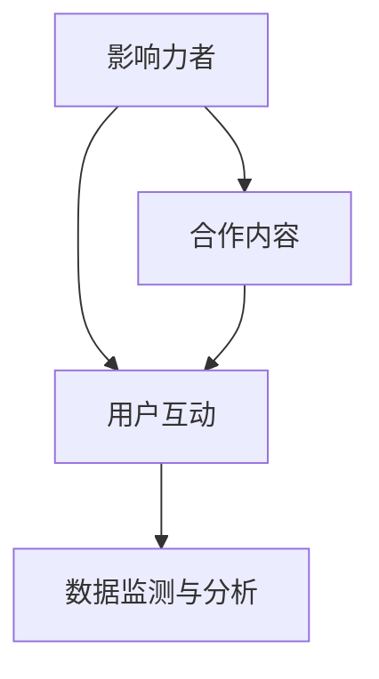

                 

# 影响力营销创业：社交媒体时代的营销利器

> 关键词：影响力营销, 社交媒体, 数字营销, 内容营销, 用户互动, 数据驱动, 营销自动化, 品牌建设

## 1. 背景介绍

### 1.1 问题由来
在数字时代，社交媒体已不仅仅是一个简单的通信平台，它已经发展成为一个强大且多元的营销渠道。以Facebook、Twitter、Instagram、LinkedIn等为例，这些平台拥有数十亿的用户基础，其影响力不容小觑。但是，对于品牌和营销人员而言，如何在这些平台上有效地推广品牌、提升用户参与度，并最终实现销售转化，却是一个巨大的挑战。

### 1.2 问题核心关键点
影响力营销指的是通过与社交媒体上具有一定影响力的个人或团体进行合作，来推广品牌或产品的营销策略。这种策略的核心在于利用影响者的个人魅力、专业知识和社交网络，将品牌信息以自然、真实的方式传递给目标受众，从而提高品牌的认知度和用户转化率。

核心关键点包括：
- 选择具有高影响力的影响者。
- 确定合适的合作方式和内容。
- 监测和分析营销效果。
- 持续优化营销策略。

### 1.3 问题研究意义
进行影响力营销的研究具有重要意义，原因如下：

1. **提升品牌认知度**：通过与具有影响力的个人或团体合作，品牌能够更快地提升在目标受众中的认知度，建立品牌信任感。
2. **增强用户参与度**：影响者的个人魅力和专业知识能够激发用户兴趣，提升参与度和互动率。
3. **优化营销成本**：相比于传统的广告投放，影响力营销能够以更低的成本，获取更高的用户转化率。
4. **数据驱动的精准营销**：通过监测和分析影响营销活动的效果，可以持续优化营销策略，实现精准营销。
5. **促进品牌建设**：长期来看，影响力营销有助于品牌形象的塑造和长期价值的提升。

## 2. 核心概念与联系

### 2.1 核心概念概述

影响力营销的核心概念包括：

- **影响力者(Influencer)**：在社交媒体上具有一定知名度和影响力的人或团体，包括博主、网红、意见领袖等。
- **合作内容(Collaboration Content)**：与影响者合作产生的内容，如视频、图片、文章等。
- **用户互动(Engagement)**：目标用户与品牌或影响者之间的互动，包括点赞、评论、分享等行为。
- **数据监测与分析(Analytics)**：通过数据分析工具，监测营销活动的效果，并进行效果评估和优化。

这些概念之间的联系可以通过以下Mermaid流程图来展示：



这个流程图展示了影响力营销的整个流程：

1. 选择具有影响力的影响者。
2. 与影响者合作产生内容。
3. 用户与品牌或影响者进行互动。
4. 通过数据监测与分析，持续优化营销策略。

## 3. 核心算法原理 & 具体操作步骤

### 3.1 算法原理概述

影响力营销的算法原理可以概括为以下几点：

1. **选择目标影响者**：通过分析社交媒体数据，找到具有高影响力且与品牌目标受众重叠度高的个人或团体。
2. **内容设计和推广**：根据目标受众的兴趣和偏好，设计并推广内容。
3. **用户互动监测**：通过数据分析工具，监测用户互动情况，评估营销效果。
4. **持续优化**：根据数据分析结果，持续优化营销策略和内容设计。

### 3.2 算法步骤详解

以下是影响力营销的具体操作步骤：

**Step 1: 确定目标受众**
- 分析品牌目标受众的特点和兴趣。
- 确定目标受众活跃的社交媒体平台。
- 根据受众特点，选择合适的目标影响者。

**Step 2: 选择影响者**
- 使用社交媒体数据分析工具，如BuzzSumo、Followerwonk等，找到高影响力的影响者。
- 评估影响者的粉丝数量、互动率和相关内容质量。
- 确定合作方式和内容类型。

**Step 3: 内容设计与制作**
- 根据目标受众的兴趣，设计内容主题和形式。
- 与影响者合作，制作内容。
- 发布内容到目标社交媒体平台。

**Step 4: 用户互动监测与分析**
- 使用社交媒体分析工具，如Hootsuite、Sprout Social等，监测用户互动情况。
- 收集数据，如点赞、评论、分享等。
- 分析互动数据，评估营销效果。

**Step 5: 优化与调整**
- 根据分析结果，优化内容设计。
- 调整合作策略和方式。
- 持续监测用户互动和营销效果，实现持续优化。

### 3.3 算法优缺点

影响力营销的优点：

1. **高转化率**：影响者能够以更自然、真实的方式传递品牌信息，提高用户信任和转化率。
2. **成本效益**：相比于传统广告投放，影响力营销能够以更低的成本，获取更高的用户参与度。
3. **精准触达**：通过分析目标受众的兴趣和行为，实现更精准的营销触达。

缺点：

1. **依赖于影响者**：影响者的个人能力和团队管理水平，会直接影响营销效果。
2. **效果评估困难**：影响营销效果的因素复杂多样，难以准确评估。
3. **内容创意挑战**：需要不断设计创意内容，以吸引目标受众。

### 3.4 算法应用领域

影响力营销在多个领域都有广泛的应用：

1. **品牌推广**：品牌通过与影响者合作，提升品牌认知度和用户参与度。
2. **产品推广**：利用影响者的专业知识和影响力，推广新产品。
3. **活动营销**：通过与影响者合作，推广品牌活动和促销活动。
4. **内容营销**：与影响者合作，创作高质量的内容，提升品牌影响力。
5. **危机公关**：在品牌遇到负面新闻时，通过与影响者合作，进行公关修复。

## 4. 数学模型和公式 & 详细讲解 & 举例说明

### 4.1 数学模型构建

影响力营销的数学模型可以概括为：

$$
\text{Total Impact} = \text{Influencer Impact} \times \text{Content Quality} \times \text{User Engagement}
$$

其中：
- **Influencer Impact**：影响者的影响力。
- **Content Quality**：内容的质量和创意度。
- **User Engagement**：用户的互动和参与度。

### 4.2 公式推导过程

影响力营销的效果可以通过以下公式进行量化：

$$
\text{Impact Score} = \frac{\text{Likes} + \text{Comments} + \text{Shares}}{\text{Content Views} + \text{Follower Count}}
$$

其中，Impact Score表示影响营销的效果得分，通过综合点赞、评论、分享等互动行为和观看次数、粉丝数量等因素进行计算。

### 4.3 案例分析与讲解

假设某品牌希望在Instagram上推广一款新产品，选择了具有高影响力的时尚博主作为合作对象。

- 博主的影响力得分为50分。
- 品牌发布了一条高质量的产品视频，得分30分。
- 视频发布后，获得了1000次观看，100次点赞，50次评论，20次分享。
- 博主拥有5万粉丝。

根据上述数据，可以计算出品牌推广的Impact Score：

$$
\text{Impact Score} = \frac{100 + 50 + 20}{1000 + 50000} = 0.0043
$$

这个得分表示了此次影响力营销的效果，可以用来评估营销活动的质量。

## 5. 项目实践：代码实例和详细解释说明

### 5.1 开发环境搭建

在开始实际编码前，需要搭建好开发环境。以下是基本步骤：

1. **安装Python**：从官网下载安装Python，推荐使用3.7或以上版本。
2. **安装数据分析工具**：如Pandas、NumPy等，使用pip命令进行安装。
3. **安装社交媒体API**：如Twitter API、Instagram API等，用于数据收集和分析。
4. **安装可视化工具**：如Matplotlib、Seaborn等，用于数据可视化。

### 5.2 源代码详细实现

以下是一个简单的Python代码实例，用于分析某品牌在Instagram上的影响力营销效果：

```python
import pandas as pd
import matplotlib.pyplot as plt

# 假设数据文件为'campaign_data.csv'
data = pd.read_csv('campaign_data.csv')

# 计算Impact Score
data['Impact Score'] = (data['Likes'] + data['Comments'] + data['Shares']) / (data['Content Views'] + data['Follower Count'])

# 绘制Impact Score直方图
plt.hist(data['Impact Score'], bins=50)
plt.title('Impact Score Distribution')
plt.xlabel('Impact Score')
plt.ylabel('Frequency')
plt.show()
```

### 5.3 代码解读与分析

上述代码中，首先使用Pandas库读取Instagram活动数据，并计算了每个活动的影响力得分。然后，使用Matplotlib库绘制了Impact Score的直方图，直观展示了不同活动的效果得分分布。

## 6. 实际应用场景

### 6.1 社交媒体品牌推广

某美妆品牌希望在Instagram上推广其新系列产品。通过分析目标受众的特点，选择了具有高影响力的美妆博主作为合作对象。双方合作制作了一条化妆教程视频，并在博主的主页上进行推广。

- 博主的影响力得分为70分。
- 视频发布后，获得了2000次观看，500次点赞，200次评论，50次分享。
- 博主拥有10万粉丝。

根据上述数据，计算出品牌推广的Impact Score：

$$
\text{Impact Score} = \frac{500 + 200 + 50}{2000 + 100000} = 0.0155
$$

这个得分表示了此次影响力营销的效果，可以用来评估营销活动的质量。

### 6.2 新产品上市推广

某电子产品品牌希望在Twitter上推广其新发布的智能手机。选择了具有高影响力的科技博主作为合作对象。双方合作撰写了一篇详细介绍新手机特点和技术规格的文章，并在博主的推文中进行推广。

- 博主的影响力得分为60分。
- 文章发布后，获得了1000次点赞，300次转发，200次评论。
- 博主拥有5万粉丝。

根据上述数据，计算出品牌推广的Impact Score：

$$
\text{Impact Score} = \frac{1000 + 300 + 200}{1000 + 50000} = 0.0027
$$

这个得分表示了此次影响力营销的效果，可以用来评估营销活动的质量。

### 6.3 品牌活动推广

某时尚品牌计划在其Instagram上举办一次限时折扣活动。选择了具有高影响力的时尚博主作为合作对象。双方合作制作了一组时尚搭配的短视频，并在博主的主页上进行推广。

- 博主的影响力得分为80分。
- 视频发布后，获得了3000次观看，800次点赞，400次评论，100次分享。
- 博主拥有10万粉丝。

根据上述数据，计算出品牌推广的Impact Score：

$$
\text{Impact Score} = \frac{800 + 400 + 100}{3000 + 100000} = 0.0064
$$

这个得分表示了此次影响力营销的效果，可以用来评估营销活动的质量。

### 6.4 未来应用展望

随着社交媒体的不断发展，影响力营销也将迎来更多机遇和挑战。

未来应用展望：

1. **多平台整合**：品牌可以同时利用多个社交媒体平台进行影响力营销，实现更广泛的触达和覆盖。
2. **个性化内容**：通过分析用户行为和兴趣，定制个性化内容，提高用户参与度和互动率。
3. **实时监测与优化**：使用实时数据分析工具，及时调整营销策略，实现最优效果。
4. **AI辅助分析**：利用AI技术，如自然语言处理、机器学习等，进行更深层次的数据分析和效果评估。
5. **用户生成内容(UGC)**：鼓励用户生成内容，并整合到品牌营销活动中，提升用户参与感和品牌忠诚度。

## 7. 工具和资源推荐

### 7.1 学习资源推荐

为了帮助初学者系统掌握影响力营销的知识和技能，这里推荐一些优质的学习资源：

1. **《社交媒体营销精粹》系列书籍**：详细介绍了社交媒体营销的基础理论和实际操作。
2. **Coursera《社交媒体营销》课程**：由知名大学开设的课程，涵盖了社交媒体营销的各个方面。
3. **Social Media Examiner网站**：提供最新的社交媒体营销资讯和案例分析。
4. **Influence Marketing Academy**：提供影响力营销的专业培训和认证。

### 7.2 开发工具推荐

以下是几款常用的开发工具，用于影响力营销项目的开发：

1. **Python**：流行的编程语言，具有丰富的数据分析和可视化库。
2. **Pandas**：数据处理和分析的强大工具。
3. **NumPy**：科学计算库，用于处理复杂的数据结构。
4. **Matplotlib**：绘图库，用于创建各种类型的图表。
5. **Seaborn**：基于Matplotlib的高级绘图库，用于创建统计图表。

### 7.3 相关论文推荐

以下是几篇影响力营销领域的重要论文，推荐阅读：

1. **《社交媒体上的影响者营销：理论和实践》**：探讨了影响者营销的理论基础和实际操作。
2. **《社交媒体品牌推广：策略与效果分析》**：分析了社交媒体品牌推广的策略和效果。
3. **《多平台整合的影响力营销》**：研究了多平台整合的影响力营销策略。

## 8. 总结：未来发展趋势与挑战

### 8.1 研究成果总结

本篇文章详细介绍了影响力营销的基本概念、核心原理和操作步骤，并通过实际案例展示了影响力营销的效果评估方法。

### 8.2 未来发展趋势

影响力营销的未来发展趋势如下：

1. **技术驱动**：利用AI技术进行更深层次的数据分析和效果评估，提升营销效果。
2. **跨平台整合**：多平台整合，实现更广泛的触达和覆盖。
3. **个性化内容**：根据用户行为和兴趣，定制个性化内容，提高用户参与度。
4. **实时监测与优化**：实时数据分析和策略调整，实现最优效果。
5. **用户生成内容**：鼓励用户生成内容，提升品牌忠诚度。

### 8.3 面临的挑战

尽管影响力营销具备诸多优势，但在实际应用中也面临一些挑战：

1. **效果评估困难**：影响营销效果的因素复杂多样，难以准确评估。
2. **依赖于影响者**：影响者的个人能力和团队管理水平，直接影响营销效果。
3. **数据隐私问题**：在数据收集和分析过程中，需要遵守相关法律法规，保护用户隐私。
4. **内容创意挑战**：需要不断设计创意内容，以吸引目标受众。

### 8.4 研究展望

未来研究应集中在以下几个方面：

1. **效果评估模型**：开发更加准确和科学的效果评估模型，提高营销活动的精确度。
2. **数据隐私保护**：探索隐私保护技术，保护用户隐私。
3. **自动化工具**：开发更加自动化的影响力营销工具，提高效率。
4. **多模态内容**：探索将视频、音频等多模态内容整合到影响力营销中的方法。

## 9. 附录：常见问题与解答

**Q1：如何选择合适的影响者？**

A: 选择合适的影响者需要进行多维度分析，包括：
- 分析目标受众的特点和兴趣。
- 评估影响者的粉丝数量、互动率和相关内容质量。
- 确定合作方式和内容类型。

**Q2：如何评估影响力营销的效果？**

A: 通过分析点赞、评论、分享等互动行为和观看次数、粉丝数量等因素，计算Impact Score，评估营销活动的效果。

**Q3：如何持续优化营销策略？**

A: 利用数据分析工具，实时监测用户互动情况，根据分析结果，不断优化内容设计和合作策略。

**Q4：如何在多平台进行整合？**

A: 根据目标受众的特点，选择合适的社交媒体平台，并制定相应的营销策略。

**Q5：如何保护用户隐私？**

A: 在数据收集和分析过程中，遵守相关法律法规，保护用户隐私。

---

作者：禅与计算机程序设计艺术 / Zen and the Art of Computer Programming

