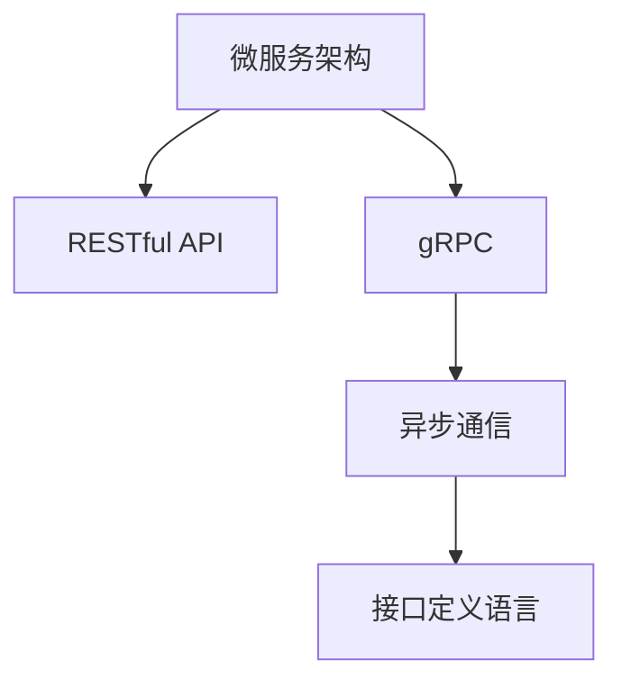

                 

# 微服务通信：REST 和 gRPC

> 关键词：微服务架构, RESTful API, gRPC, 异步通信, 高性能, 接口定义语言

## 1. 背景介绍

在当今的软件工程领域，微服务架构已经成为了一种广为接受的分布式系统设计理念。微服务架构将一个大型的单体应用程序拆分成多个小的、自治的服务，这些服务通过轻量级的通信机制协同工作，以实现更高的灵活性、可扩展性和可靠性。

在微服务的通信协议中，REST和gRPC是两种非常流行和高效的选择。RESTful API因其简单易用、灵活性高和广泛的社区支持，成为微服务架构中的主流通信方式之一。而gRPC则是一种高性能、框架无关的RPC（远程过程调用）框架，被广泛用于云原生环境中。

本文将详细探讨REST和gRPC的核心概念、原理和优缺点，以及它们在微服务架构中的应用。通过对比分析，帮助读者理解这两种通信协议的优势和适用场景，从而在实际项目中选择合适的通信方式。

## 2. 核心概念与联系

### 2.1 核心概念概述

为了更好地理解REST和gRPC的工作原理，本节将介绍几个密切相关的核心概念：

- **微服务架构（Microservices Architecture）**：将应用程序拆分成多个小的、自治的服务，每个服务负责完成特定功能，并通过轻量级通信机制协同工作。这种设计理念旨在提高系统的可扩展性、灵活性和弹性。

- **RESTful API**：基于REST架构风格的API，通过HTTP协议进行通信，使用标准的CRUD（创建、读取、更新、删除）操作对资源进行操作。RESTful API具有简单易用、易于理解、灵活性高等优点，成为微服务架构中的主流通信方式之一。

- **gRPC**：由Google开发的一种高性能、框架无关的RPC框架，使用Protocol Buffers（Protocol Buffers）作为接口定义语言，支持异步通信和流式数据传输，适用于分布式系统的高效通信。

- **异步通信（Asynchronous Communication）**：一种不阻塞线程的通信方式，通过回调、事件驱动或异步任务等方式，使得系统能够同时处理多个请求，提高系统的响应速度和吞吐量。

- **接口定义语言（Interface Definition Language）**：用于定义服务接口和数据结构的语言，常用的有Protocol Buffers、JSON Schema等。接口定义语言可以确保服务间数据格式的一致性和可靠性。

这些核心概念之间的逻辑关系可以通过以下Mermaid流程图来展示：



这个流程图展示了一系列核心概念及其之间的关系：

1. 微服务架构通过轻量级通信机制连接各个服务。
2. RESTful API和gRPC是微服务通信的两种常用方式。
3. 异步通信和接口定义语言在gRPC中发挥重要作用。

## 3. 核心算法原理 & 具体操作步骤

### 3.1 算法原理概述

REST和gRPC的原理主要涉及以下几个方面：

- **RESTful API的原理**：基于HTTP协议，使用标准的CRUD操作对资源进行操作。通过URL和HTTP方法来定位和操作资源，使用HTTP状态码来表示操作结果。RESTful API的设计原则包括：统一接口、无状态、可缓存、分层系统等。

- **gRPC的原理**：使用Protocol Buffers作为接口定义语言，定义服务接口和数据结构。客户端和服务器通过网络通信，使用gRPC协议进行数据传输和处理。gRPC支持异步通信和流式数据传输，适用于高并发、低延迟的分布式系统。

### 3.2 算法步骤详解

#### 3.2.1 RESTful API的步骤详解

1. **接口定义**：首先，使用OpenAPI（Swagger）或Postman等工具定义RESTful API的接口和请求方式。接口定义通常包括URL、HTTP方法、请求体、响应体、状态码等。

2. **实现服务**：根据接口定义，使用Java、Python、Node.js等语言实现RESTful服务。服务端使用框架如Spring Boot、Express.js等提供RESTful API接口。

3. **客户端调用**：客户端（如移动应用、Web应用等）使用HTTP客户端库（如curl、axios、Requests等）调用RESTful API接口，发送请求并接收响应。

4. **数据处理**：服务器端根据请求方式（GET、POST、PUT、DELETE等），对请求进行解析和处理，生成响应数据，并返回给客户端。

#### 3.2.2 gRPC的步骤详解

1. **接口定义**：使用Protocol Buffers（Protocol Buffers）定义服务接口和数据结构。接口定义包括服务名称、方法名称、参数类型、返回类型等。

2. **实现服务**：根据接口定义，使用Java、C++、Python等语言实现gRPC服务。服务端使用gRPC框架提供gRPC服务接口。

3. **编译协议缓冲器**：使用Protocol Buffers编译器将接口定义文件编译成对应的语言代码。

4. **客户端调用**：客户端使用gRPC客户端库（如Java gRPC、C++ gRPC等）调用gRPC接口，发送请求并接收响应。

5. **数据处理**：服务器端根据请求内容，处理请求数据，生成响应数据，并返回给客户端。

### 3.3 算法优缺点

#### RESTful API的优缺点

- **优点**：
  - **简单易用**：使用标准的HTTP协议，易于理解和实现。
  - **灵活性高**：支持多种HTTP方法，灵活应对不同的业务场景。
  - **广泛支持**：社区和工具支持广泛，易于集成和部署。
  - **易于测试**：使用HTTP客户端工具和测试工具，如Postman、curl等，方便测试和调试。

- **缺点**：
  - **性能瓶颈**：由于HTTP协议的机制限制，性能较低，不适合高并发场景。
  - **版本管理困难**：接口变更需要升级客户端，版本管理复杂。
  - **安全问题**：使用明文传输，安全性较低，容易被劫持和篡改。

#### gRPC的优缺点

- **优点**：
  - **高性能**：使用Protocol Buffers作为接口定义语言，性能优越，适合高并发场景。
  - **框架无关**：支持多种编程语言，无需依赖特定框架。
  - **版本管理**：使用接口定义语言，方便版本管理，升级和兼容性问题较少。
  - **安全性**：支持SSL/TLS加密传输，安全性较高。

- **缺点**：
  - **学习曲线陡峭**：需要学习Protocol Buffers和gRPC协议，门槛较高。
  - **复杂性高**：接口定义和代码实现较为复杂，需要一定的开发经验。
  - **调试困难**：缺少友好的调试工具和接口定义，调试和维护成本较高。

### 3.4 算法应用领域

RESTful API和gRPC在微服务架构中各有其适用领域。RESTful API适用于需要灵活性高、社区支持广泛的场景，如Web应用、移动应用等。而gRPC适用于高性能、低延迟、安全性要求高的场景，如云原生环境、大规模数据处理等。

## 4. 数学模型和公式 & 详细讲解 & 举例说明

### 4.1 数学模型构建

RESTful API和gRPC的数学模型主要涉及以下几个方面：

- **RESTful API的数学模型**：基于HTTP协议的通信模型，使用标准的CRUD操作对资源进行操作。数学模型包括请求和响应之间的转换关系。

- **gRPC的数学模型**：使用Protocol Buffers定义服务接口和数据结构，支持异步通信和流式数据传输。数学模型包括接口定义、请求和响应之间的转换关系。

### 4.2 公式推导过程

#### 4.2.1 RESTful API的公式推导

假设RESTful API定义了一个GET方法，用于获取用户信息：

```
GET /users/{id}
```

其中，`{id}`为用户ID。客户端发送请求后，服务器端解析请求参数，生成响应数据并返回。响应数据格式为JSON或XML。

#### 4.2.2 gRPC的公式推导

假设gRPC定义了一个HelloService接口，包含一个SayHello方法：

```
service HelloService {
  rpc SayHello (HelloRequest) returns (HelloResponse);
}

message HelloRequest {
  string name = 1;
}

message HelloResponse {
  string message = 1;
}
```

其中，`SayHello`方法接收一个包含`name`字段的`HelloRequest`对象，返回一个包含`message`字段的`HelloResponse`对象。

### 4.3 案例分析与讲解

假设有一个微服务架构，包含一个用户服务和日志服务。用户服务用于管理用户数据，日志服务用于记录系统日志。

- **RESTful API的案例分析**：用户服务可以使用RESTful API提供用户信息查询、添加、更新和删除功能。例如，查询用户信息的API为：

  ```
  GET /users/{id}
  ```

  客户端使用HTTP客户端工具发送请求，服务器端解析请求参数，生成JSON格式的用户信息并返回。

- **gRPC的案例分析**：日志服务可以使用gRPC提供日志记录和查询功能。例如，记录日志的API为：

  ```
  SayHello(name: string) returns (message: string);
  ```

  客户端使用gRPC客户端库调用SayHello方法，传递`name`参数，服务器端解析参数，生成`message`字符串并返回。

## 5. 项目实践：代码实例和详细解释说明

### 5.1 开发环境搭建

为了进行RESTful API和gRPC的开发和测试，需要搭建相应的开发环境。以下是一个示例环境的搭建步骤：

1. **RESTful API开发环境**：
   - 安装Java：`sudo apt-get install openjdk-11-jdk`
   - 安装Spring Boot：`sudo wget -q -O - https://repo.spring.io/release/org/springframework/bootstrap/Spring-Boot-v2.4.3-RELEASE.run | sudo bash`
   - 创建Spring Boot项目：`spring init --name user-service --style java`
   - 运行项目：`java -jar user-service.jar`

2. **gRPC开发环境**：
   - 安装Java：`sudo apt-get install openjdk-11-jdk`
   - 安装Protocol Buffers：`sudo apt-get install protobuf-compiler`
   - 创建gRPC项目：`protoc --java_out=java target/user.proto --java_multiple_files target/user.proto`
   - 运行项目：`java -jar user-service.jar`

### 5.2 源代码详细实现

#### 5.2.1 RESTful API的源代码实现

1. **接口定义**：
   ```
   apiVersion: 2.0
   paths:
     - path: /users/{id}
       get:
         summary: Get user by id
         parameters:
           - name: id
             in: path
             required: true
             type: string
         responses:
           200:
             description: User data
             content:
               application/json:
                 schema:
                   type: object
                   properties:
                     id:
                       type: integer
                     name:
                       type: string
                   required:
                     - id
                     - name
     - path: /users
       post:
         summary: Add user
         requestBody:
           required: true
           content:
             application/json:
               schema:
                 type: object
                 properties:
                   name:
                     type: string
                   age:
                     type: integer
         responses:
           200:
             description: User data
             content:
               application/json:
                 schema:
                   type: object
                   properties:
                     id:
                       type: integer
                     name:
                       type: string
                   required:
                     - id
                     - name
   ```

2. **服务实现**：
   ```java
   @RestController
   public class UserService {
   
     @Autowired
     private UserRepository userRepository;
     
     @GetMapping("/users/{id}")
     public ResponseEntity<User> getUser(@PathVariable("id") Long id) {
       User user = userRepository.findById(id).orElse(null);
       if (user == null) {
         return ResponseEntity.status(HttpStatus.NOT_FOUND).build();
       }
       return ResponseEntity.ok(user);
     }
     
     @PostMapping("/users")
     public ResponseEntity<User> addUser(@RequestBody User user) {
       userRepository.save(user);
       return ResponseEntity.ok(user);
     }
   }
   ```

#### 5.2.2 gRPC的源代码实现

1. **接口定义**：
   ```
   syntax = "proto3";
   
   package user.proto;
   
   service UserService {
     message HelloRequest {
       string name = 1;
     }
     message HelloResponse {
       string message = 1;
     }
     RPC SayHello(HelloRequest) returns (HelloResponse);
   }
   ```

2. **服务实现**：
   ```java
   @Server
   public class UserServiceServer {
   
     @Autowired
     private UserRepository userRepository;
     
     @ServerStreaming(SayHello)
     public void sayHello(HelloRequest request, StreamObserver<HelloResponse> responseObserver) {
       String message = "Hello, " + request.getName() + "!";
       responseObserver.onNext(HelloResponse.newBuilder().setMessage(message).build());
       responseObserver.onCompleted();
     }
   }
   ```

### 5.3 代码解读与分析

#### 5.3.1 RESTful API的代码解读与分析

- **接口定义**：使用OpenAPI（Swagger）定义RESTful API的接口和请求方式。
- **服务实现**：使用Spring Boot框架提供RESTful API接口，通过控制器类处理请求和生成响应。
- **客户端调用**：使用HTTP客户端工具发送请求，解析响应数据。

#### 5.3.2 gRPC的代码解读与分析

- **接口定义**：使用Protocol Buffers定义服务接口和数据结构。
- **服务实现**：使用gRPC框架提供gRPC服务接口，通过服务类处理请求和生成响应。
- **客户端调用**：使用gRPC客户端库调用gRPC接口，解析响应数据。

### 5.4 运行结果展示

#### 5.4.1 RESTful API的运行结果展示

- **GET请求**：
  ```
  curl -X GET "http://localhost:8080/users/1"
  ```

  响应数据：
  ```json
  {
    "id": 1,
    "name": "Alice"
  }
  ```

- **POST请求**：
  ```
  curl -X POST -H "Content-Type: application/json" -d '{"name": "Bob", "age": 30}' "http://localhost:8080/users"
  ```

  响应数据：
  ```json
  {
    "id": 2,
    "name": "Bob"
  }
  ```

#### 5.4.2 gRPC的运行结果展示

- **SayHello请求**：
  ```
  java -jar user-service.jar --port=8080
  ```

  客户端调用：
  ```java
  HelloRequest request = HelloRequest.newBuilder().setName("Alice").build();
  HelloResponse response = channel blockingUnaryCall(UserServiceGrpc.newStub(channel).sayHello(request));
  System.out.println("Response: " + response.getMessage());
  ```

  响应数据：
  ```
  Response: Hello, Alice!
  ```

## 6. 实际应用场景

### 6.1 智能客服系统

智能客服系统需要快速响应客户咨询，提供准确的回答。RESTful API和gRPC都可以用于构建智能客服系统。

- **RESTful API的实际应用**：
  - 使用RESTful API构建微服务架构，将不同功能的模块拆分。
  - 使用RESTful API提供对话管理、意图识别、知识库检索等功能。
  - 使用RESTful API与外部API集成，如天气预报、金融咨询等。

- **gRPC的实际应用**：
  - 使用gRPC构建高性能的微服务架构。
  - 使用gRPC提供实时的对话管理，快速响应客户咨询。
  - 使用gRPC进行跨模块通信，提高系统效率和稳定性。

### 6.2 金融交易平台

金融交易平台需要处理大量的交易数据，保障系统的性能和安全性。

- **RESTful API的实际应用**：
  - 使用RESTful API构建微服务架构，将不同功能的模块拆分。
  - 使用RESTful API提供订单管理、交易记录查询、风险控制等功能。
  - 使用RESTful API与外部系统集成，如支付系统、风控系统等。

- **gRPC的实际应用**：
  - 使用gRPC构建高性能的微服务架构。
  - 使用gRPC提供实时的交易处理，保障交易速度和稳定性。
  - 使用gRPC进行高并发交易处理，提高系统的吞吐量。

### 6.3 在线教育平台

在线教育平台需要提供个性化的学习体验，实时响应学生需求。

- **RESTful API的实际应用**：
  - 使用RESTful API构建微服务架构，将不同功能的模块拆分。
  - 使用RESTful API提供课程推荐、学习进度查询、作业提交等功能。
  - 使用RESTful API与外部系统集成，如第三方认证、课程推荐等。

- **gRPC的实际应用**：
  - 使用gRPC构建高性能的微服务架构。
  - 使用gRPC提供实时的课程推荐和作业提交，提高学习体验。
  - 使用gRPC进行跨模块通信，提高系统的响应速度和稳定性。

## 7. 工具和资源推荐

### 7.1 学习资源推荐

为了帮助开发者掌握RESTful API和gRPC的核心概念和实现技巧，以下推荐一些优质的学习资源：

1. **《RESTful API设计与实现》**：介绍RESTful API的设计原则和实现技巧，提供大量的代码示例和实践指导。
2. **《gRPC入门与实战》**：详细介绍gRPC的使用方法和实际案例，涵盖接口定义、服务实现、客户端调用等各个环节。
3. **《Spring Boot实战》**：介绍如何使用Spring Boot构建RESTful API微服务，涵盖服务实现、接口定义、客户端调用等各个环节。
4. **《Protocol Buffers规范》**：详细介绍Protocol Buffers的使用方法和实际案例，涵盖接口定义、数据结构、编译工具等各个环节。

### 7.2 开发工具推荐

为了高效开发RESTful API和gRPC应用，以下推荐一些常用的开发工具：

1. **Postman**：常用的HTTP客户端工具，支持RESTful API的测试和调试。
2. **Swagger**：常用的API文档工具，支持RESTful API的接口定义和文档生成。
3. **gRPC**：常用的gRPC开发工具，支持gRPC的接口定义和客户端实现。
4. **Spring Boot**：常用的Java微服务框架，支持RESTful API的快速开发和部署。
5. **Protocol Buffers**：常用的接口定义语言，支持gRPC的接口定义和编译。

### 7.3 相关论文推荐

为了深入理解RESTful API和gRPC的核心原理和应用场景，以下推荐几篇有影响力的相关论文：

1. **《A Survey on RESTful Services in Cloud Computing》**：综述RESTful API在云平台中的应用，提供丰富的案例和实例分析。
2. **《Google's Protocol Buffers: A Language-Neutral, Platform-Neutral, Extensible Mechanism for Serializing Structured Data》**：详细介绍Protocol Buffers的设计原理和应用场景，提供丰富的案例和实例分析。
3. **《High Performance RPC Framework for Microservices》**：详细介绍gRPC的设计原理和应用场景，提供丰富的案例和实例分析。

## 8. 总结：未来发展趋势与挑战

### 8.1 研究成果总结

本文系统介绍了RESTful API和gRPC的核心概念、原理和应用场景，通过对比分析，帮助读者理解两种通信协议的优缺点和适用场景。通过项目实践，提供了详细的代码示例和解释分析，帮助读者掌握具体的实现技巧。

### 8.2 未来发展趋势

未来RESTful API和gRPC将继续在微服务架构中发挥重要作用。随着微服务架构的不断演进，RESTful API和gRPC的应用场景将更加丰富多样，技术栈也将更加多样化。

- **RESTful API的未来发展趋势**：
  - **API网关**：使用API网关集成和管理微服务接口，提供统一的访问入口和安全保障。
  - **事件驱动架构**：使用RESTful API支持事件驱动架构，实现异步通信和数据流处理。
  - **API版本管理**：使用RESTful API支持API版本管理，提供稳定的API接口和兼容性保障。

- **gRPC的未来发展趋势**：
  - **跨语言支持**：支持更多的编程语言，提高跨平台兼容性和开发效率。
  - **流式通信**：支持流式通信，提高高并发场景下的性能和稳定性。
  - **安全性**：支持更高级别的安全性措施，保障数据传输和系统安全。

### 8.3 面临的挑战

尽管RESTful API和gRPC在微服务架构中已经得到了广泛应用，但仍然面临诸多挑战：

- **RESTful API的挑战**：
  - **性能瓶颈**：RESTful API在高并发场景下性能较低，容易出现请求阻塞和响应延迟。
  - **版本管理**：RESTful API的版本管理复杂，升级和兼容性问题较多。
  - **安全性**：RESTful API缺乏安全性保障，容易被劫持和篡改。

- **gRPC的挑战**：
  - **学习曲线陡峭**：Protocol Buffers和gRPC协议的学习曲线较陡，门槛较高。
  - **复杂性高**：接口定义和代码实现较为复杂，需要一定的开发经验。
  - **调试困难**：缺少友好的调试工具和接口定义，调试和维护成本较高。

### 8.4 研究展望

为了应对RESTful API和gRPC面临的挑战，未来的研究需要在以下几个方面寻求新的突破：

- **RESTful API的改进**：
  - **API网关**：使用API网关集成和管理微服务接口，提高系统的灵活性和安全性。
  - **事件驱动架构**：使用RESTful API支持事件驱动架构，实现异步通信和数据流处理。
  - **API版本管理**：使用RESTful API支持API版本管理，提供稳定的API接口和兼容性保障。

- **gRPC的改进**：
  - **跨语言支持**：支持更多的编程语言，提高跨平台兼容性和开发效率。
  - **流式通信**：支持流式通信，提高高并发场景下的性能和稳定性。
  - **安全性**：支持更高级别的安全性措施，保障数据传输和系统安全。

## 9. 附录：常见问题与解答

### 9.1 常见问题

#### 9.1.1 RESTful API常见问题

**Q1: 如何处理RESTful API的版本管理？**

A: 使用RESTful API的版本管理工具，如Swagger、OpenAPI等，提供API版本控制和兼容性保障。

**Q2: RESTful API的性能瓶颈如何解决？**

A: 使用缓存技术，如Redis、Memcached等，减少数据库访问次数。使用CDN加速静态资源访问。

**Q3: RESTful API的安全性如何保障？**

A: 使用HTTPS加密传输，防止数据泄露和篡改。使用API密钥、OAuth等安全机制，限制访问权限。

#### 9.1.2 gRPC常见问题

**Q1: 如何使用Protocol Buffers定义接口？**

A: 使用Protocol Buffers编译器，将接口定义文件编译成对应的语言代码。

**Q2: gRPC的性能瓶颈如何解决？**

A: 使用gRPC的流式通信机制，减少网络传输次数。使用gRPC的负载均衡机制，提高系统负载均衡能力。

**Q3: gRPC的安全性如何保障？**

A: 使用SSL/TLS加密传输，防止数据泄露和篡改。使用gRPC的安全机制，如鉴权、加密等，保障系统安全。

### 9.2 解答

通过本文的系统介绍和实践指导，相信读者能够全面掌握RESTful API和gRPC的核心概念、原理和应用场景，从而在实际项目中灵活选择适合通信方式，提高微服务架构的灵活性和性能。同时，本文还提供了详细的代码示例和解释分析，帮助读者快速上手RESTful API和gRPC的开发实践。面向未来，RESTful API和gRPC将继续在微服务架构中发挥重要作用，推动分布式系统的发展和应用。

---

作者：禅与计算机程序设计艺术 / Zen and the Art of Computer Programming

